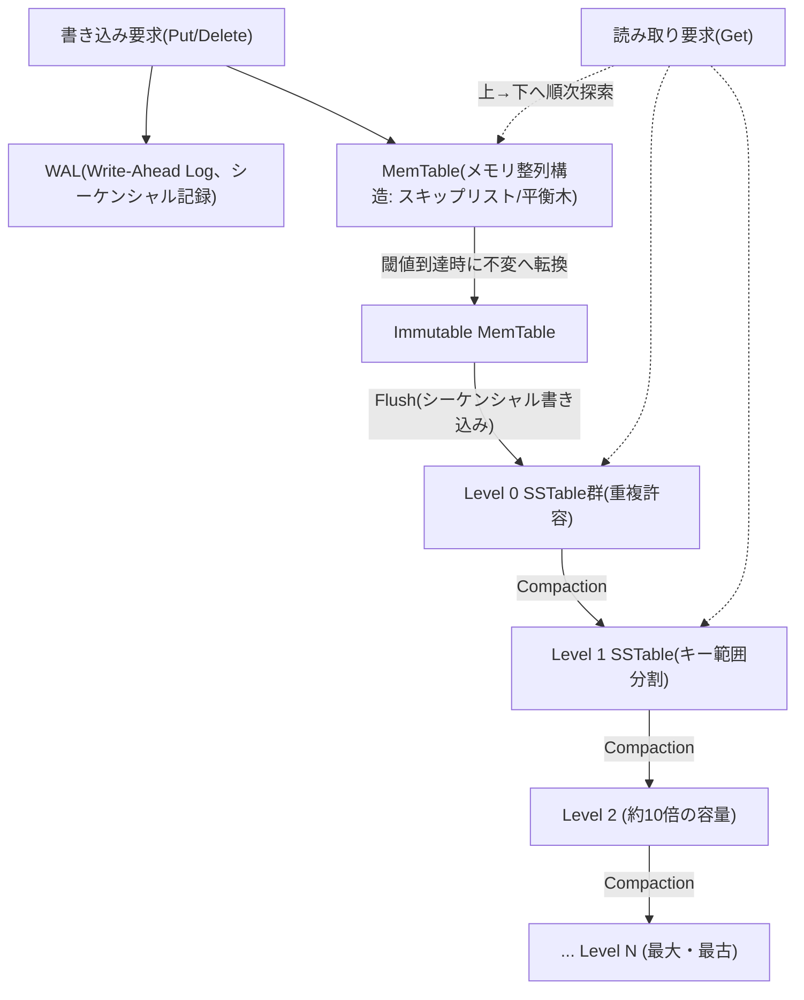
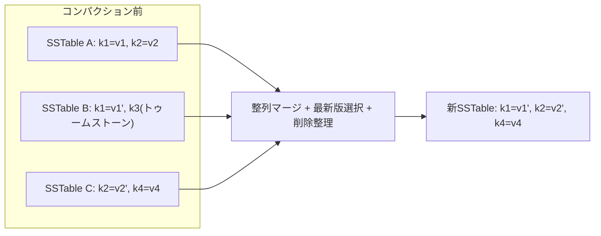

# LSMツリー（Log-Structured Merge-Tree）

## 1. 概要

> **定義**: LSMツリー（Log-Structured Merge-Tree）とは、ランダムな書き込みをまずメモリ上の整列構造に集め、それをディスクへ**シーケンシャルに（append-only）一括記録**し、多数の不変（immutable）な整列ファイルをバックグラウンドでマージ・整理（Compaction）して読み取り効率を回復する、**書き込み最適化（write-optimized）ストレージ構造**である。

従来のリレーショナルデータベースのインデックスは、大半がBツリー/B+ツリーを基盤としており、読み取りと書き込みの双方に対してバランスの取れた対数時間の性能を提供する。しかしB+ツリーは、更新が発生するたびにディスク上の特定ページを**その場で更新（in-place update）**するため、更新対象のページがあちこちに散らばっているとディスクへのランダム書き込み（random write）が急増する。HDDのシーク遅延やSSDのページ単位の書き込み・ガベージコレクションを考慮すると、ランダム書き込みはシーケンシャル書き込みに比べて数十倍以上遅く、記憶媒体の寿命も削る。大量の書き込みが絶え間なく流入するログ収集、時系列、メッセージング、ソーシャルフィードのようなワークロードでは、このランダム書き込みのコストがシステム全体のボトルネックとなる。

LSMツリーは、まさにこの点を正面から狙って登場した。発想の核心は、「**更新をその場で行わず、新しい値を追記し続けよう**」というものである。値を上書きする代わりに新しいバージョンをシーケンシャルに追加し、古い値は後でマージ処理の中で整理する。こうすればディスク書き込みは常にシーケンシャルとなってスループットが最大化され、記憶媒体に優しいアクセスが可能になる。1996年にPatrick O'Neilらが提案したこの構造は、その後GoogleのBigtableとそのオープンソース実装であるApache HBase、Cassandra、そしてLevelDB・RocksDBのような組み込み型キー・バリューエンジンの中核ストレージエンジンとして定着した。今日、大規模なNoSQL・時系列・検索システムの大半がLSM系エンジンの上で動作している。

実際、LSMの威力は媒体特性の非対称性から生まれる。代表的なNVMe SSDでは、シーケンシャル書き込みの帯域幅は毎秒数GBに達するが、4KBのランダム書き込みはその数分の一にすぎず、内部のガベージコレクションによって遅延のばらつき（tail latency）も大きくなる。B+ツリーが更新のたびに散らばったページをランダムに叩いている間、LSMは同じ書き込みをメモリに集め、一回の大容量シーケンシャルストリームに変えて流し込む。この「ランダムをシーケンシャルに変換する」発想がLSMのすべての利得の出発点であり、記憶媒体がHDDからSSDへ、さらにZNS・オブジェクトストレージへと進化しても、その有効性が維持される根本的な理由である。

技術士の観点からLSMツリーが重要な理由は、これが単なるデータ構造ではなく、**「どのアクセス特性を犠牲にし、どの特性を得るのか」というストレージエンジン設計哲学の典型**だからである。B+ツリーが読み取り・空間効率のために書き込み増幅を甘受するとすれば、LSMツリーは書き込みスループットのために読み取り増幅と空間増幅を甘受する。この三つの増幅（RUM予想：Read・Update・Memory）の間のトレードオフを理解することがLSM学習の本質であり、後でこれを定量的に扱う。

- **シーケンシャル書き込み志向**: すべてのディスク書き込みをappend-onlyに転換し、ランダムI/Oを排除する。
- **不変ファイル**: 一度記録された整列ファイル（SSTable）は修正されず、削除・更新も新しいレコードの追加として表現する。
- **多段階マージ**: バックグラウンドのコンパクションが重複・削除レコードを整理し、読み取り性能と空間効率を回復する。

## 2. 全体構造

LSMツリーは、**メモリ階層とディスク階層の二元的な構造**で構成される。最新の書き込みはメモリ上の整列構造（MemTable）に反映され、これが一定サイズに達するとまとめてディスクへ整列ファイル（SSTable）としてフラッシュされる。ディスク上のSSTableは複数のレベル（Level）に階層化され、下位レベルに行くほど大きく古いデータを保持する。以下の構造図は、一つの書き込みが流入し、メモリを経てディスク階層へ下りていく全体の骨格を示している。

この構造において、各構成要素は明確な役割を持つ。**WAL（Write-Ahead Log）**は永続性（Durability）を担う。MemTableは揮発性メモリ上にあるため障害が起きると失われるが、書き込みをMemTableに反映する直前に同じ内容をWALへシーケンシャルにappendすることで、障害後の再起動時にWALを再生（replay）して損失なく復旧する。WALもまたシーケンシャル書き込みであるため、LSMの書き込み性能を損なわない。

**MemTable**は、最新データをキー順に保持するメモリ上の整列構造であり、通常はスキップリスト（skip list）や平衡二分木で実装する。スキップリストがよく使われる理由は、ロック競合を減らしつつ並行挿入・参照をサポートし、挿入/参照が平均O(log n)と良好だからである。MemTableが設定サイズ（例：64MB）に達すると**不変（Immutable）MemTable**に転換されてそれ以上修正されなくなり、新しい書き込みは新たなMemTableが受け付ける。この分離のおかげで、フラッシュが進行している間も書き込みが止まらない。

**SSTable（Sorted String Table）**は、ディスクに保存される不変の整列ファイルである。キー・バリューのペアがキー順に整列して保存され、ファイル内部には特定のキーを素早く見つけるための疎インデックス（sparse index）とブロック単位の区画が含まれる。整列されているため範囲スキャンに有利であり、不変であるため並行読み取りにロックが不要で、キャッシュ・レプリケーション・バックアップが単純になる。複数のSSTableはレベルごとに組織され、後述するコンパクション戦略によってレベル間の重複許容の有無やマージ方式が異なる。SSTable一つの物理的構成要素を整理すると以下のとおりである。

- **データブロック（Data Block）**: 整列されたキー・バリューのペアを保持する実際の格納単位（通常4〜64KB単位で圧縮）。
- **インデックスブロック（Index Block）**: 各データブロックの先頭キーとオフセットを保持し、目的のブロックを二分探索で見つけられるようにする。
- **ブルームフィルタブロック**: このファイルに特定のキーが存在しないことを素早く判定し、不要なディスクアクセスを遮断する。
- **メタ/フッター（Footer）**: ファイルバージョン・統計・インデックス位置など、ファイルの解釈に必要なメタデータ。

このファイルフォーマットが不変であることは、運用上大きな利点をもたらす。すでに書かれたファイルは変わらないため、ページキャッシュ・ブロックキャッシュの無効化が不要であり、リモートレプリケーション・スナップショット・チェックサム検証がファイル単位で単純になる。また、オブジェクトストレージ（S3など）のような不変性と相性の良い媒体にそのまま載せられるため、ストレージとコンピュートの分離アーキテクチャともよく適合する。

## 3. 中核動作：書き込み・読み取り・削除の経路

### A. 書き込み経路（Write Path）

LSMの書き込みは驚くほど単純かつ高速である。値を上書きする位置をディスク上で探す必要がまったくないからである。書き込み要求が来ると、①WALにシーケンシャルにappendして永続性を確保し、②MemTableにキー・バリューを挿入する。両演算ともディスクのランダムシークがないため、書き込み遅延が非常に短く、スループットが高い。更新（update）でさえ既存の値を探して直すのではなく、**新しいバージョンを単に追加**し、どの値が最新かはシーケンス番号（sequence number）やタイムスタンプで判別する。

MemTableが満杯になると不変に転換され、バックグラウンドスレッドがこれを**一つのSSTableとしてシーケンシャルに記録**した後、対応するWAL区間を破棄する。このフラッシュは、すでにメモリ上で整列済みのデータをまとめてシーケンシャルに記録するものであるため、ディスク帯域幅を最大限に活用する。例えば毎秒数十万件の書き込みが流入する時系列収集システムでは、B+ツリーインデックスはページ分割とランダム更新によって急激に遅くなるが、LSMはこれをメモリに蓄積した後の大容量シーケンシャルフラッシュで吸収し、安定したスループットを維持する。

### B. 読み取り経路（Read Path）

読み取りは、書き込みの単純さの代償を支払う。特定のキーの最新値はMemTableにあるかもしれないし、複数のSSTableのどこかにあるかもしれないため、**最新の階層から古い階層の順に次々と探索**しなければならない。すなわちMemTable → Immutable MemTable → Level 0 → Level 1 → … の順に下りていき、目的のキーに初めて出会った時点（最新バージョン）の値を返す。最悪の場合は複数のファイルを開いて確認する必要があるため、これを**読み取り増幅（read amplification）**と呼ぶ。

このコストを減らすために、二つの補助構造が必須的に動員される。第一は**ブルームフィルタ（Bloom Filter）**であり、各SSTableごとに「このキーがここに存在する可能性があるか」を確率的に判断し、存在しないことが確実なファイルはディスクアクセスなしにスキップする。通常キーあたり約10ビットを使えば偽陽性率を1%程度まで下げられるため、存在しないキーの参照（例：キャッシュミスの確認）においてディスクI/Oを劇的に削減する。第二は各SSTableの**疎インデックスとブロックキャッシュ**であり、フィルタを通過したファイル内で目的のブロックを素早く見つけ、頻繁に読むブロックをメモリに保持する。

### C. 削除と更新：トゥームストーン（Tombstone）

不変ファイル構造では、データを物理的に即座に消すことができない。代わりに削除は、**トゥームストーン（tombstone）という削除マーカーレコードを追加**する方式で行われる。読み取り時、あるキーの最新レコードがトゥームストーンであればそのキーは削除されたものとみなされ、実際の物理的な除去は、後にコンパクションが当該キーのすべての旧バージョンとトゥームストーンを一緒に破棄する時点で行われる。この遅延削除の特性のため、大量削除の直後にはむしろデータが増え、トゥームストーンが溜まると範囲スキャン時に削除済み区間まで走査しなければならず参照が遅くなる現象が現れる。Cassandraの運用でよく経験する「ゾンビデータ」やトゥームストーン急増の問題はここに起因する。

特に分散環境では、トゥームストーンを性急に消すと危険である。あるノードはすでに削除を反映したが、別のノードは障害によって削除を取りこぼした状態でトゥームストーンが消えると、レプリケーションの同期過程ですでに削除された値が蘇る「データ復活（resurrection）」が起こる。Cassandraが`gc_grace_seconds`（デフォルト10日）という猶予期間を過ぎてからトゥームストーンを物理削除する理由はここにある。すなわち削除マーカーは単なる最適化の仕組みではなく、**結果整合性（eventual consistency）を守るための整合性の仕組み**でもあり、この値を不用意に下げると性能は良くなるが、データの整合性が崩れる可能性がある。

### D. 並行性制御とスナップショット読み取り

LSM構造は並行性制御にも有利である。SSTableが不変であり、更新が新バージョンの追加として表現されるため、各レコードにシーケンス番号を付与すれば、特定時点の一貫したスナップショットを自然に得ることができる。読み取りトランザクションは「自身が開始した時点以下のシーケンス番号を持つ最新バージョン」だけを見ればよく、これはまさに**MVCC（多版型同時実行制御）**と軌を一にする。書き込みと読み取りが互いをブロックしない（readers never block writers）ため、読み取りロックなしに高い並行性を達成する。RocksDBのスナップショット機能や分散SQLのスナップショット分離レベルは、この特性の上に構築されている。ただし、古いスナップショットを長く保持すると、そのバージョンを参照するSSTableをコンパクションが回収できず空間増幅が大きくなり得るため、長時間実行されるスナップショットの管理が運用上のポイントとなる。

## 4. コンパクション（Compaction）戦略と増幅のトレードオフ

コンパクションはLSMツリーの心臓部である。時間が経つとSSTableが蓄積し、同じキーの複数バージョンとトゥームストーンが散在し、読み取りが確認すべきファイル数が増え（読み取り増幅）、重複データが空間を浪費する（空間増幅）。コンパクションは、複数のSSTableを読み込んで整列マージしつつ古いバージョンと削除されたキーを除去し、新しいSSTableを作ることでこの問題を回復する。以下のダイアグラムは、コンパクションが重複・削除を整理しながらデータを下位レベルへ移動させる過程を示している。

コンパクション方式は大きく二つの系統に分かれ、この選択がワークロード別の性能特性を左右する。第一に、**レベルドコンパクション（Leveled Compaction）**はRocksDB・LevelDBのデフォルトであり、各レベル（L1以上）の内部ではSSTable同士のキー範囲が互いに重ならないように維持し、上位レベルが満杯になると下位レベルの重なるファイルとマージする。各レベルはおおよそ前のレベルの10倍のサイズを持つ。この方式は、特定のキーを含み得るファイルがレベルあたり一つだけであるため**読み取り増幅と空間増幅が小さい**が、マージが頻繁で**書き込み増幅が大きい**。読み取りが多く空間に余裕のないワークロードに適している。

第二に、**サイズ階層コンパクション（Size-Tiered Compaction）**はCassandraのデフォルト戦略であり、似たサイズのSSTableが一定数集まると、一つのより大きなファイルへマージする。マージ頻度が低いため**書き込み増幅は小さい**が、同じキーが複数の大きなファイルに重複して存在し得るため**読み取り増幅と空間増幅が大きい**（マージ直前の瞬間は元データと結果が共存するため、一時的に最大2倍の空間が必要）。書き込みが殺到するログ・時系列の取り込みに適している。このほか、時系列専用のTWCS（Time-Window Compaction）のように、時間窓単位でまとめて期限切れデータを丸ごと破棄する特化戦略もある。

この二系統の違いは、結局**RUMトレードオフ**に要約される。三つの増幅を同時に最小化することは不可能であり、何かを得るには何かを差し出さなければならない。

| 区分 | 読み取り増幅(RA) | 書き込み増幅(WA) | 空間増幅(SA) | 代表システム/適合ワークロード |
|------|------------|------------|------------|----------------------|
| レベルドコンパクション | 低い | 高い | 低い | RocksDB・LevelDB / 読み取りの多いOLTP・インデックス |
| サイズ階層コンパクション | 高い | 低い | 高い | Cassandra / 書き込み殺到・ログ取り込み |
| B+ツリー(比較対象) | 低い | 中程度(ランダム) | 低い | RDBMS / バランス型ワークロード |

ここで、各増幅の実務的な含意を押さえておく必要がある。書き込み増幅が大きいとは、ユーザーが1を書くとコンパクションが同じデータを何度も書き直すという意味であり、レベルド方式ではしばしば10〜30倍に達する。これはSSDの摩耗とバックグラウンド帯域幅の消費に直結するため、NVMe SSDの書き込み耐久性（TBW）の算定とコンパクションのスケジューリングが運用の鍵となる。逆に、サイズ階層方式の空間増幅はストレージコストを押し上げ、コンパクション時の2倍の空き容量を常に確保しなければならないという運用上の制約を生む。

コンパクションがいつ発動するかも運用上重要である。代表的なトリガーは以下のとおりであり、これらを調整することがすなわち増幅予算を管理することである。

- **レベル容量超過**: 特定レベルの総サイズが目標値を超えると、上位・下位レベルのマージを開始する（レベルド）。
- **SSTable数の閾値**: 似たサイズのファイルが指定数（例：4個）集まるとマージする（サイズ階層）。
- **トゥームストーン/期限切れの比率**: 削除マーカーやTTL期限切れデータが一定比率を超えると、空間回収のために強制マージする。
- **手動/全面コンパクション（major compaction）**: 運用者がすべてのファイルを一つにマージして重複を完全に除去するが、大量のI/Oを誘発するため低負荷の時間帯に実施する。

## 5. 比較：LSMツリー vs B+ツリー

LSMツリーとB+ツリーはストレージエンジン設計の二大軸であり、優劣ではなく**ワークロード適合性**の問題である。違いが生じる根本原因は更新方式にある。B+ツリーはin-place更新によってデータを常に一か所に整頓しておくため読み取りが予測可能で速いが、その整頓を維持するためにランダム書き込みとページ分割を甘受する。LSMはappend-onlyで書き込みを集約してシーケンシャルなスループットを最大化するが、散らばったデータを後でマージ・参照しなければならないため、読み取りとバックグラウンドのコストを甘受する。

具体例として、毎秒50万件のIoTセンサーデータを取り込む時系列パイプラインを考える。B+ツリーベースのインデックスは、時間が経つにつれてインデックスツリーのあちこちが更新されてランダムI/Oが支配的となり、スループットが急落する。一方、LSMベースのエンジン（例：RocksDB、Cassandra）はこれをメモリ蓄積後のシーケンシャルフラッシュで吸収し、書き込みスループットを数倍〜数十倍高く維持する。しかし、「特定センサーの直近値一件」をランダムに参照するポイントルックアップが圧倒的に多いワークロードであれば、ブルームフィルタがうまく機能しても、複数SSTableの探索とコンパクションの負担のため、B+ツリーの方がより安定した低遅延を提供し得る。

定量的に見るとトレードオフはより明確になる。レベルがL個で、各レベルのサイズ倍率がT（例：10）のとき、レベルドコンパクションの書き込み増幅はおおよそ`T × L`に比例してしばしば10〜30倍に達する一方、読み取り時に確認すべきファイル数はレベルあたり最大1個程度に抑えられる。サイズ階層方式は逆に書き込み増幅が`L`程度と低いが、一つのキーが複数のファイルに散らばるため、読み取り時には最悪`O(ファイル数)`の探索が必要となる。ブルームフィルタがこの読み取り増幅を実質的に下げてくれるが、存在するキーを探す場合（true positive）にはフィルタでふるい落とせないため、根本的な違いは残る。このように、同じデータでもどのコンパクションを使うかによってSSDの摩耗量と参照遅延が数倍単位で変わるため、ストレージエンジンのチューニングとは、すなわちこれらの係数をワークロードに合わせる作業である。

もう一つの実務的な含意は、**範囲スキャンと整列**である。両構造ともデータを整列して保持するため範囲クエリをサポートするが、LSMではスキャンが複数のSSTableとMemTableを同時にマージ巡回（merge iterator）しなければならず、トゥームストーン区間まで走査し得るため、削除の多いテーブルではスキャン遅延が予測不能になる。このため、強いトランザクション整合性と予測可能な遅延が重要な従来型のOLTP RDBMSは依然としてB+ツリーを、書き込みスループットと水平拡張が最優先の大規模分散ストレージはLSMを選ぶのが一般的な傾向である。

## 6. 深掘り：最新動向と実務適用

LSMツリーは今なお活発に進化している分野である。第一に、**書き込み増幅の緩和**のための新しい設計が次々と提案されている。WiscKeyに代表される**キー・バリュー分離（Key-Value Separation）**手法は、大きな値（value）を別のログに保存し、LSMにはキーとポインタだけを置くことで、コンパクション時に大きな値を繰り返し書き直さないようにし、書き込み増幅を大きく減らす。RocksDBのBlobDB、TerarkDBなどがこの系統を商用化しており、値が大きいワークロードで効果が大きい。

第二に、**記憶媒体との協調設計**が中心的な話題である。初期のLSMはHDDのランダム書き込み回避を狙っていたが、今日ではNVMe SSDやZNS（Zoned Namespace）SSD、さらにはCXLベースのメモリ拡張を前提に再設計されている。特にSSDの内部GCとLSMのコンパクションはどちらも「ガベージ整理」を行うため、これを重複なく協調させるZNSベースのLSMは、書き込み増幅と摩耗を同時に低減する。これは大規模データセンターのTCO（総所有コスト）を左右する実質的な最適化である。

具体的な産業事例として、大規模ソーシャルサービスの受信箱・タイムラインストレージが代表的である。ユーザーごとに毎秒数万〜数十万件のイベントがappendされ、読み取りの大半は直近区間に集中するが、このような書き込みヘビーなワークロードでは、サイズ階層コンパクションを用いるCassandraが広く採用された。逆にFacebookは、MySQLのInnoDB（B+ツリー）をLSMベースのMyRocksに置き換え、同一データセットの保存容量を約半分に削減し、書き込み負荷を大きく低減した事例を公開している。これは「圧縮率と空間効率」という別の軸でもLSMが有利になり得ることを示している。不変のSSTableはブロック単位で強く圧縮しやすく、in-place更新に必要なページの空き領域（fill factorの余白）を残す必要がないからである。

第三に、実務適用の観点から、RocksDBは事実上**分散システムのローカルストレージエンジン標準**となった。Kafka Streams・Flinkの状態ストア、TiKV・CockroachDBのような分散SQLのストレージ層、MySQLのMyRocksエンジン、さらにはブロックチェーンノードの状態DBまでがRocksDB（LSM）を採用している。すなわちLSMは単独製品というよりも、上位システムに組み込まれる**ストレージエンジン部品（embedded engine）**としてエコシステム全体に浸透している。したがって技術士の観点では、特定製品よりも「なぜこのシステムはLSMを選んだのか」、そしてコンパクションのチューニング・ブルームフィルタのビット数・MemTableサイズのような**運用パラメータが性能に与える影響**を説明できなければならない。

## 7. 考慮事項および示唆

- **ワークロードプロファイルに基づく選択**: 書き込み:読み取りの比率、ポイントルックアップ対範囲スキャンの比重、削除頻度を定量的に測定したうえで、ストレージエンジンとコンパクション戦略を決めなければならない。「書き込みが多いから無条件にLSM」ではなく、ポイント読み取りが支配的であればB+ツリーが有利になり得ることも併せて検討すべきである。
- **増幅予算の管理（RUM）**: 読み取り・書き込み・空間の増幅は同時に最小化できないため、SLA（遅延・スループット）とストレージ予算・SSD耐久性（TBW）を定量目標として、三つのうち何を優先するかを明示的に決定し、コンパクション戦略・ブルームフィルタのビット数・レベル倍率で調整する。
- **コンパクションの運用リスク**: コンパクションはバックグラウンドのI/O・CPUを消費してフォアグラウンドのトラフィックとリソースを奪い合うため、スケジューリング・速度制限（rate limiting）・メンテナンス時間帯の分離によって遅延スパイクを制御し、サイズ階層方式ではマージ時の空き容量（最大2倍）を常に確保しなければならない。
- **削除・期限切れデータの戦略**: トゥームストーンの蓄積は参照遅延とゾンビデータを誘発するため、TTL・時間窓コンパクション（TWCS）・gc_grace_secondsのような期限切れポリシーとコンパクション周期を整合的に設計し、大量削除後にはトゥームストーンの整理時点を監視しなければならない。
- **連携技術と拡張**: LSMは分散合意（Raft）、レプリケーション・シャーディング、キャッシュ層と組み合わさって大規模ストレージを構成するため、ローカルエンジンの特性が上位の分散システムの一貫性・復旧・ホットスポット対応の設計とどのようにかみ合うかを併せて考慮しなければならない。
- **オブザーバビリティの確保**: 書き込み/読み取り/空間の増幅、コンパクションの待ち行列、ブルームフィルタの偽陽性率、MemTableのフラッシュ遅延などの中核指標を常時計測してチューニングの根拠とすべきであり、これこそがLSMベースシステムの運用成熟度の尺度となる。

## 参考資料

- Patrick O'Neil et al., "The Log-Structured Merge-Tree (LSM-Tree)", 1996: https://www.cs.umb.edu/~poneil/lsmtree.pdf
- RocksDB Wiki, "Leveled Compaction": https://github.com/facebook/rocksdb/wiki/Leveled-Compaction
- Apache Cassandra Docs, "How is data maintained (Compaction)": https://cassandra.apache.org/doc/latest/cassandra/managing/operating/compaction/index.html
- WiscKey: Separating Keys from Values in SSD-conscious Storage (FAST '16): https://www.usenix.org/system/files/conference/fast16/fast16-papers-lu.pdf

---

> **一言まとめ**: LSMツリーは、ランダム書き込みをメモリ蓄積後のシーケンシャルフラッシュとバックグラウンドコンパクションに転換して書き込みスループットを最大化するストレージ構造であり、読み取り・書き込み・空間の増幅（RUM）のトレードオフをワークロードに合わせて調整することが設計・運用の核心である。
