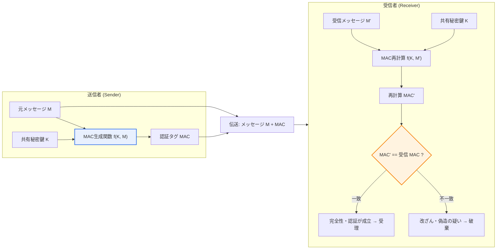
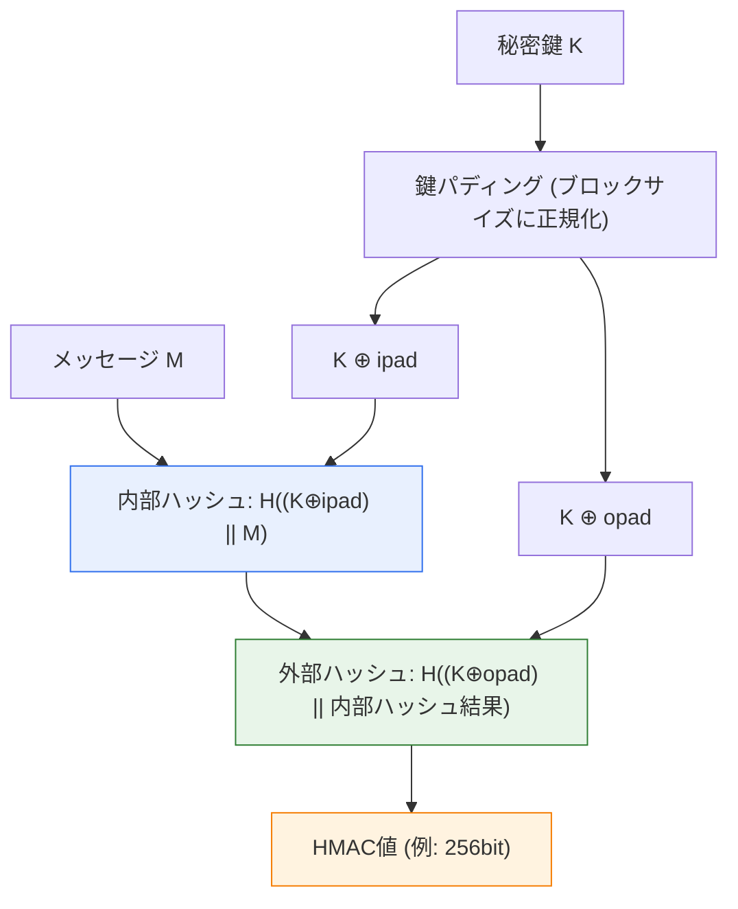

# メッセージ認証コード（MAC, Message Authentication Code）

## 1. 概要

### A. 定義
> **MAC（Message Authentication Code）**とは、メッセージと**送受信者のみが共有する秘密鍵を併せて入力として生成する固定長の認証タグ**であり、メッセージが伝送中に**改ざんされていないこと（完全性, Integrity）**と、**秘密鍵を知る正当な送信者が送ったこと（送信元認証, Data-Origin Authentication）**を同時に検証する共通鍵暗号技術である。

MACが登場した背景を理解するには、まず「単純なハッシュだけではなぜ不十分なのか」という問いから出発する必要がある。メッセージの完全性を保証する最も素朴な方法は、メッセージにSHA-256のようなハッシュ値を付けて送り、受信者が再びハッシュを計算して比較することである。しかし、ハッシュ関数は公開アルゴリズムであるため、**誰でも計算できる**という致命的な弱点がある。中間者（MITM）攻撃者はメッセージを思いのままに偽造した後、その偽造メッセージのハッシュを新たに計算して付け直すだけでよく、受信者は改ざんの事実にまったく気づけない。すなわち単純なハッシュは、**通信エラー（偶発的な変化）**は検出できるが、**悪意ある攻撃（意図的な偽造）**は防げない。

MACは、まさにこの穴を秘密鍵で塞ぐ。MAC生成関数は`MAC = f(K, M)`の形で、メッセージ`M`だけでなく**送受信者のみが知る秘密鍵`K`**を併せて入力に取る。攻撃者は鍵`K`を知らないため、メッセージを改ざんしても、それに合った正しいMACを作り出すことができない。受信者は、受け取ったメッセージと自身が保管する同じ鍵でMACを再計算し、一緒に届いたMACと一致するかを検査する。一致すれば、「①メッセージが伝送中に変わっておらず（完全性）、②このMACを作れるのは同じ鍵を持つ正当な相手だけなので、その相手が送った（送信元認証）」という二つの事実を同時に確信できる。要するにMACの本質は、**「鍵があって初めて計算・検証できるkeyed hash（鍵付きハッシュ）」**であり、このkeyedの性質が完全性と認証を一つにまとめて提供する。

### B. 登場背景と必要性
現代の通信は、インターネット・無線網など信頼できないチャネルを前提としている。金融取引メッセージが途中で「送金額100万ウォン」から「1,000万ウォン」に書き換えられたり、IoT（モノのインターネット）センサーが送る制御コマンドが偽造されたりすれば、甚大な被害が生じる。このとき、**機密性（暗号化）**だけでは不十分である。暗号文であってもビットを反転させる改ざんが可能であり、特にストリーム暗号やCTRモードでは、特定の平文ビットを予測可能な形で操作する**ビットフリッピング（bit-flipping）攻撃**が可能だからである。したがって「内容を隠すこと」とは別に、「内容が変わっておらず、正当な相手が送ったこと」を保証する仕組みが必ず必要であり、それを共通鍵ベースで高速かつ効率的に提供するのがMACである。実際、TLS、IPSec、SSH、JWT（JSON Web Token）、OAuthの署名検証など、今日のほぼすべてのセキュリティプロトコルの根底にMACが敷かれている。

## 2. 動作原理と全体構造

### A. 全体構造図
MACベースの通信の全体フローは、以下のように「生成側（送信）」と「検証側（受信）」が同一の秘密鍵を共有した状態で対称的に行われる。

この構造の核心は、**送信者と受信者がまったく同じ演算を行う**という対称性にある。秘密鍵`K`は、事前に安全なチャネル（鍵交換プロトコルまたは事前共有）で双方に配布されていなければならず、この鍵の機密性が破られた瞬間にMAC体系全体が無力化される。すなわちMACの安全性は、アルゴリズムの強度だけでなく、**鍵管理体系**に決定的に依存する。

### B. 生成と検証の手順の詳細
送信側の手順は、①メッセージ`M`と秘密鍵`K`をMAC関数に入力してタグを計算し、②メッセージとタグを一緒に送信する、というだけで終わる。ここでメッセージ自体は（機密性が不要であれば）平文で送っても差し支えない。MACの役割は「隠すこと」ではなく「封印」だからである。

受信側の手順で最も重要な原理は、**再計算・比較（recompute and compare）**である。受信者は届いたメッセージ`M'`で自らMACを再計算する。もし伝送中にわずか1ビットでも変わっていれば、ハッシュ関数の**雪崩効果（avalanche effect）**によって再計算されたMACは元の値とまったく異なる値となり、比較に失敗する。このとき必ず守るべき実務原則が一つあり、MACの比較は必ず**定数時間比較（constant-time comparison）**で行わなければならないということである。バイトを一つずつ比較し、最初の不一致で即座に返す一般的な文字列比較は、応答時間のわずかな差から正しいMACを1バイトずつ割り出す**タイミング攻撃（timing attack）**に脆弱である。そのため実務では、`hmac.compare_digest`（Python）、`crypto.timingSafeEqual`（Node.js）のような定数時間関数を使用する。

### C. 代表的アルゴリズムの内部構造（HMAC）
最も広く使われるHMACは、「ハッシュ関数を二重に入れ子にして鍵を安全に結合する」構造として設計された。単に`H(K || M)`のように鍵を前に付ける方式は、マークル・ダンガード（Merkle-Damgård）構造のハッシュの**伸長攻撃（length-extension attack）**にさらされる。HMACはこれを防ぐため、内部パッド（ipad）と外部パッド（opad）を用いた二重ハッシュ構造を採る。

この二重構造のおかげで、HMACは使用するハッシュ関数（SHA-256、SHA-3など）が安全であるという前提のもとで伸長攻撃に対して免疫があり、安全性証明（security proof）が存在する点で信頼されている。実務では`HMAC-SHA256`が事実上の標準として定着しており、JWTの`HS256`署名、AWS署名バージョン4のリクエスト認証、TLSの完全性検証などに幅広く使われている。

## 3. MACの類型

MACは、**どのような基盤プリミティブ（primitive）を使用するか**によって大きく三系統に分かれる。それぞれ性能特性と活用環境が異なるため、どれか一つが無条件に優れているのではなく、**環境に合わせて選択する**という観点が重要である。

| 類型 | 基盤 | 特徴と活用の文脈 |
|---|---|---|
| **HMAC** | ハッシュ関数(SHA-256/512、SHA-3) | 最も広く使用。ソフトウェア実装が簡単で、安全性証明が存在。JWT・TLS・API署名で標準的に使用 |
| **CMAC** | ブロック暗号(AES) | ブロック暗号のハードウェアアクセラレーション(AES-NI)がある環境で有利。別途ハッシュモジュールなしにAESだけで認証を提供 |
| **GMAC** | GCMモードの認証部分 | GF(2¹²⁸)有限体乗算ベース。並列処理に有利で高速。AES-GCM(AEAD)の認証タグとして使用 |

**HMAC**はハッシュ関数さえあれば実装できるため移植性に優れ、ライブラリのサポートも幅広い。一方**CMAC**は、ブロック暗号をCBCに類似した方式で連鎖させて最終ブロックをタグとする構造であり、すでにAESハードウェアアクセラレーションを使用しているIoT・組み込み環境でコードサイズを削減できる。**GMAC**はGCM（Galois/Counter Mode）の認証成分だけを切り出したもので、有限体乗算を並列化できるため、10Gbps級の高速ネットワーク機器で好まれる。例えばTLS 1.3は、`AES-128-GCM`、`ChaCha20-Poly1305`のようなAEAD方式だけを残し、旧式のCBC+HMACの組み合わせを廃止したが、これは性能と安全性を同時に得るための選択であった。

## 4. 電子署名・ハッシュとの比較および事例

### A. 電子署名との比較 — 否認防止の有無
MACと電子署名はいずれも「完全性＋送信元認証」を提供するが、**否認防止（Non-repudiation）**で決定的に分かれる。この違いが生じる根本的な理由は、**鍵の対称/非対称性**にある。

| 区分 | MAC | 電子署名(Digital Signature) |
|---|---|---|
| **鍵体系** | 共通鍵(一つの秘密鍵を双方が共有) | 公開鍵(秘密鍵で署名、公開鍵で検証) |
| **提供するセキュリティ特性** | 完全性 + 送信元認証 | 完全性 + 送信元認証 + **否認防止** |
| **演算速度** | 非常に速い(対称演算) | 遅い(公開鍵演算、数十〜数百倍) |
| **否認防止** | 不可 — 鍵を共有するため第三者への証明が不可能 | 可能 — 秘密鍵は署名者のみが保有 |
| **代表的アルゴリズム** | HMAC、CMAC、GMAC | RSA、ECDSA、EdDSA |

MACで否認防止が不可能な理由は明快である。送信者と受信者が**同じ秘密鍵**を共有しているため、あるMACについて「これは送信者が作った」と第三者（裁判官・仲裁者）に証明しようとしても、受信者も同じ鍵でそのMACを作ることができるので、**送信者は「私は送っていない、あなたが作ったのではないか」と否認**できる。一方、電子署名は署名者だけが持つ秘密鍵で署名し、誰もが公開鍵で検証するため、「この署名を作れるのは秘密鍵の所有者だけ」という論理で否認防止が成立する。したがって、**法的証拠能力・契約・電子文書**のように否認防止が求められる場面では電子署名を、**高速なセッション内の完全性検証**にはMACを使うというのが実務の原則である。

### B. 単純なハッシュとの比較
単純なハッシュ（SHA-256単独）は鍵がないため、**偶発的なエラーの検出**にのみ有効である。ファイルダウンロード時のチェックサム比較がその例である。しかし前述のとおり、攻撃者がハッシュまで再計算すれば無力であるため、**悪意ある偽造が想定される通信**には、必ずkeyed方式であるMACが必要である。「チェックサムはミスを防ぎ、MACは攻撃を防ぐ」と要約できる。

### C. 具体的な適用事例
第一に、**JWT（JSON Web Token）**の`HS256`は、ヘッダ・ペイロードを`HMAC-SHA256`で署名したタグを付け、サーバーが発行したトークンがクライアント側で偽造されていないことを検証する。ただし、ここには有名な脆弱性がある。署名アルゴリズムを`none`に変えたり、HMACの鍵としてサーバーのRSA公開鍵を誤用するよう誘導したりする**アルゴリズム混同（algorithm confusion）攻撃**である。これはMAC自体の欠陥ではなく検証ロジックの実装の問題であり、サーバーが許容アルゴリズムを明示的に固定しなければならないことを示す代表的な事例である。

第二に、**AWS Signature Version 4**は、APIリクエストの各要素（HTTPメソッド、URI、ヘッダ、タイムスタンプ）を`HMAC-SHA256`で連鎖的に署名し、リクエストが伝送中に改ざんされておらず、正当な認証情報の所有者が送ったことを検証する。タイムスタンプを含めることで、**リプレイ攻撃（replay attack）**まで防御する。

第三に、**金融ICカード・EMV決済**では、CMAC系を用いて端末とカード間の取引メッセージの完全性を保証する。組み込み環境の特性上、AESハードウェアを再利用するCMACがリソース効率に優れるからである。

## 5. 深掘り — AEADへの進化と最新の標準動向

今日、MACは単独で使われるよりも、**暗号化と結合した認証付き暗号（AEAD, Authenticated Encryption with Associated Data）**の形へと発展した。かつては「暗号化後にMAC（Encrypt-then-MAC）」、「MAC後に暗号化（MAC-then-Encrypt）」など組み合わせの順序を開発者が自ら選ばなければならず、組み合わせを誤ると**パディングオラクル攻撃（Padding Oracle）**、**Lucky 13**のような深刻な脆弱性が露呈した。実際、TLSのCBC+HMACの組み合わせでこうした攻撃が相次いで報告されたことから、順序ミスの余地をなくした統合方式が求められるようになった。

その結果がAEADである。**AES-GCM**は暗号化とGMAC認証タグの生成を一つの演算にまとめ、機密性と完全性・認証を同時に提供する。さらに、ヘッダのように「暗号化はしないが完全性は保証すべき」付随データ（Associated Data）までタグに含めることができる。モバイル・低消費電力環境では、AES-NIハードウェアアクセラレーションがなくても高速な**ChaCha20-Poly1305**が好まれ、ここではPoly1305がMACの役割を果たす。**TLS 1.3（RFC 8446）**は、こうしたAEAD方式だけを標準として残し、CBC+HMACのような旧式の組み合わせを全面的に廃止した。

一方、量子コンピューティング時代に備えた**耐量子計算機暗号（PQC）**への移行議論においても、MACの位置付けは安定している。ショアのアルゴリズムが脅かすのはRSA・ECCのような公開鍵（非対称）体系であり、共通鍵ベースのMACは、グローバーのアルゴリズムによって実効的なセキュリティ強度が半分に下がる程度の影響しか受けない。すなわち、**鍵・タグ長を2倍にすれば（例：HMAC-SHA512）**量子時代にも十分な安全性を維持でき、公開鍵アルゴリズムのような根本的な置き換えが不要である点が、MACの強みとして再評価されている。

## 6. 考慮事項および示唆（技術士の観点）

1. **否認防止が求められる場合は電子署名へ切り替える** — MACは完全性・認証に効率的だが、鍵を共有する対称構造のため、否認防止は原理的に不可能である。電子契約・監査証跡・法的証拠が必要な領域では必ず非対称の電子署名（ECDSA・EdDSA）を適用し、性能が重要なセッション内部の検証にのみMACを使う**階層的な組み合わせ戦略**が望ましい。

2. **鍵管理（Key Management）がセキュリティの急所** — MACの安全性はアルゴリズムではなく、**秘密鍵の機密性**に全面的に依存する。鍵の配布は安全な鍵交換（例：ECDH）やKMS/HSMを通じて行われなければならず、定期的な鍵の更新（rotation）、用途別の鍵分離、漏えい時の即時破棄の体制を整える必要がある。一つの鍵を長期間・多目的に再利用することは、最もよくありながら致命的な実務上の誤りである。

3. **実装脆弱性の防御 — 定数時間比較とアルゴリズムの固定** — MACアルゴリズムが安全でも、検証コードが杜撰であれば無力化される。タイミング攻撃を防ぐ定数時間比較、JWTのアルゴリズム混同を防ぐ許容アルゴリズムの明示的固定、リプレイを防ぐタイムスタンプ・ノンス（nonce）の付与など、**実装レベルの防御**を設計段階から反映しなければならない。

4. **AEADの優先採用と順序ミスの排除** — 機密性も併せて必要な場合、開発者が暗号化・MACの順序を自ら組み合わせるのではなく、検証済みのAEAD（AES-GCM、ChaCha20-Poly1305）を標準として採用すべきである。これは、パディングオラクル・Lucky 13のような組み合わせミスによる脆弱性を構造的に除去する最も安全な選択である。

5. **量子時代への備えという観点でのバランス** — 共通鍵MACはグローバーのアルゴリズムの影響が限定的であるため、鍵・タグ長の拡大（HMAC-SHA512など）だけで対応可能である。PQC移行ロードマップを策定する際は、公開鍵体系（署名・鍵交換）にリソースを集中し、MACはパラメータの引き上げで対応するという**優先順位差別化戦略**が合理的である。

## 参考資料
- RFC 2104, HMAC: Keyed-Hashing for Message Authentication — https://datatracker.ietf.org/doc/html/rfc2104
- RFC 8446, The Transport Layer Security (TLS) Protocol Version 1.3 — https://datatracker.ietf.org/doc/html/rfc8446
- NIST SP 800-38B, Recommendation for Block Cipher Modes: CMAC — https://csrc.nist.gov/pubs/sp/800/38/b/final
- NIST SP 800-38D, Recommendation for GCM and GMAC — https://csrc.nist.gov/pubs/sp/800/38/d/final

---

> **一言まとめ**: MACは、*メッセージと共有秘密鍵でkeyed認証タグを生成し、再計算して比較する*ことで完全性と送信元認証を同時に検証する共通鍵技術であり、HMAC・CMAC・GMACの系統があり、鍵を共有する特性上、否認防止は電子署名に委ね、今日ではAES-GCMのようなAEADとして暗号化と統合されて使われ、鍵管理と定数時間比較などの実装上の防御が安全性の鍵となる。
