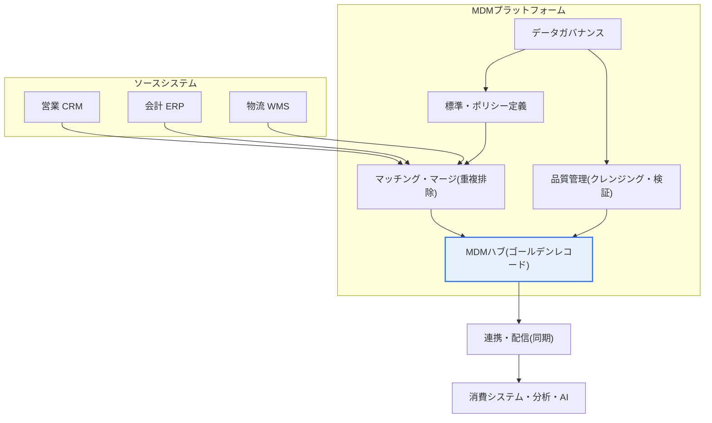
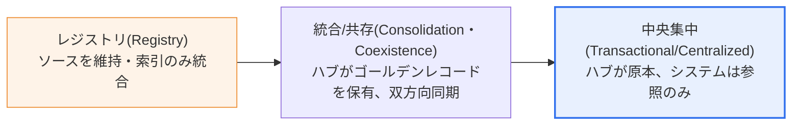

# マスターデータ管理（MDM, Master Data Management）

## 1. 概要

### A. 定義
> **マスターデータ（Master Data）**とは、顧客・商品・組織・取引先・勘定のように、複数の業務・システムで**共通して繰り返し参照される中核的な基準データ**を意味し、**MDM（Master Data Management）**とは、このマスターデータを組織全体で**単一かつ一貫して定義・統合・クレンジング・配信・管理**する活動と、それを支えるシステム・ガバナンス体系を総称したものである。

企業が扱うデータは、大きく三種類に区分できる。刻々と発生する**トランザクションデータ（Transactional Data）**—受注・売上・入出庫のようなイベントの記録、その取引を解釈するのに必要な**マスターデータ**—顧客・商品・取引先のような基準情報、そしてそれらを分析・集計した**分析データ（Analytical Data）**である。このうちマスターデータは頻繁には変わらないが、ほぼすべての業務プロセスが参照する**骨格（Backbone）**に当たる。例えば一つの「顧客」レコードは、営業の契約、会計の請求、物流の配送、マーケティングのキャンペーン、データ分析のセグメントに至るまで、全社にわたって再利用される。したがって、マスターデータの品質は、そのデータを消費するすべての業務の品質を左右する。

MDMが必要となる根本的な理由は、「**同じ顧客・商品の情報がシステムごとに異なって存在する混乱**」にある。組織が成長するにつれ、営業CRM、会計ERP、物流WMS、コールセンターシステムがそれぞれ異なる時期・異なる方式で導入されると、同一の顧客がシステムごとに別々に登録される。あるシステムには「㈱韓国電子」、別のシステムには「韓国電子(株)」、さらに別の場所には「Korea Electronics」と記録され、事実上同じ実体が三人の異なる顧客のように扱われる。こうした不一致は、誤配送、二重請求、与信限度の誤判断、不正確な売上集計、信頼できない分析結果へとつながる。実際、ある通信事業者が顧客統合の前に複数のグループ会社システムに散在する顧客を整合させたところ、重複・誤りのあるレコードが全体の20〜30%程度に達したという事例は珍しくなく報告されている。

MDMは、この問題を「**信頼できる単一の真実の情報源（Single Source of Truth, SSOT）**」を構築することで解決する。散在するマスターデータを一つの基準で収集・マッチング・マージ・クレンジングして**ゴールデンレコード（Golden Record）**—複数のソース値のうち最も正確で完全な代表レコード—を作成し、各業務システムがこの基準データを参照するか、同期を受けるようにする。そうすれば組織全体が同一の顧客・商品情報を共有してデータの整合性が確保され、規制対応（金融業界の本人確認KYC、個人情報の正確性の原則など）と分析・AIの信頼性が併せて高まる。

### B. マスターデータ・MDMの必要性
トランザクションデータがマスターデータを参照する構造であるため、マスターが不正確であれば、その上に積み上がったすべての取引と分析が連鎖的に汚染される。これをよく「**Garbage In, Garbage Out**」と呼ぶ。データウェアハウス・データレイク・AI学習データの信頼性は、結局のところ入力される基準データの品質を超えることができない。近年、生成AI・機械学習の活用が広がるにつれ、学習・推論の基盤となるマスターデータの品質を確保する手段として、MDMの戦略的重要性が改めて浮き彫りになっている。要約すると、MDMは、(1)データ整合性の確保、(2)業務効率化・コスト削減（重複排除・手戻りの削減）、(3)規制・コンプライアンス対応、(4)分析・AIの信頼性確保、という四つの軸で必要性を持つ。

## 2. MDMの概念構造と構成要素

MDMは単一のリポジトリだけでは完成しない。データを定義する**標準・ポリシー**、それを統合・格納する**ハブ**、責任体制を確立する**ガバナンス**、継続的にクレンジングする**品質管理**、そして各システムへ流し込む**連携・配信**が有機的にかみ合わなければならない。

**標準・ポリシー**はMDMの出発点である。「顧客とは何か」、「商品コードはどのような体系に従うか」、「住所はどのような形式で表記するか」といった、マスターデータの定義・標準・業務ルールを確定する段階である。この標準が揺らげば、その後のいかなる統合も砂上の楼閣となる。例えば事業部ごとに「アクティブ顧客」の定義（直近6か月の取引 vs 直近1年の取引）が異なれば、統合後も同じ指標が部署ごとに異なる数値を示す。そのため標準化は、技術課題である以前に業務上の合意の課題である。

**MDMハブ**は、統合・クレンジングされたマスターデータを格納する中央リポジトリであり、ゴールデンレコードを保管し、各ソースレコードとの対応（Cross-reference）情報を維持する。ハブは単なるDBではなく、どのソースのどの値がいつゴールデンレコードとして採用されたかという**データリネージ（Lineage）**を併せて管理する。これにより「この顧客の代表住所はなぜこの値なのか」を追跡でき、監査や紛争への対応が可能になる。

**ガバナンス**は、MDMの持続性を担保する組織・責任体制である。データの事業上の責任を負う**データオーナー（Data Owner）**、実務的に品質を面倒見る**データスチュワード（Data Steward）**、ポリシーを審議する協議体が定義される。技術的な統合は一度のプロジェクトで終わるが、データは毎日新たに入ってくるため、ガバナンスがなければ時間の経過とともに再び不一致が蓄積する。

**品質管理**は、重複排除（マッチング・マージ）、欠損・誤りの補正、標準化、検証ルールの適用によって、データを継続的にクレンジングする。特にマッチングは完全一致ではなく、名称・住所・事業者番号の類似度を計算する**確率的/ファジーマッチング（Probabilistic Matching）**を活用し、「㈱韓国電子」と「韓国電子(株)」を同一の実体と判断する。

**連携・配信**は、クレンジングされたゴールデンレコードを各消費システムへリアルタイム（API/イベント）またはバッチで同期し、組織全体が同じ基準データを使うようにする。このチャネルの信頼性が低いと、ハブだけがきれいで現場のシステムは依然として古い値を使うという乖離が生じる。

| 構成要素 | 中核的な役割 | 失敗時の症状 |
|---|---|---|
| **標準・ポリシー** | マスターデータの定義・標準・業務ルール | 部署ごとに指標の定義が異なる |
| **MDMハブ** | ゴールデンレコードの格納・リネージ管理 | 代表値の根拠を追跡できない |
| **ガバナンス** | オーナー・スチュワード・責任体制 | 時間経過後に再び不一致 |
| **品質管理** | 重複排除・クレンジング・検証 | 重複・誤りのあるレコードが残存 |
| **連携・配信** | 各システムへの同期・提供 | ハブだけがきれいで現場は旧値 |

## 3. MDMの実装類型（アーキテクチャ）と構築手順

MDMは、データをどこまで中央で所有・管理するかによって、複数の実装類型（スタイル）に分かれる。組織の成熟度・システムの複雑さ・ガバナンス能力に合わせて選択し、多くの場合、低い段階から始めて段階的に上位の段階へと発展させる。

**レジストリ（Registry）方式**は、ソースデータをそのまま残し、MDMは各システムのレコードをマッチングして、どれが同一実体であるかという索引（参照リンク）だけを管理する。ソースシステムにほとんど手を加えないため導入が軽く速いが、実際のデータは依然として分散しているため、「単一の値」の確保は限定的である。すでにシステムが多く、当面は大きな変更が難しい大企業が最初の段階としてよく選ぶ。

**統合/共存（Consolidation・Coexistence）方式**は、ソースデータをハブに集めてゴールデンレコードを生成し、それを再びソースへ戻す（双方向）折衷型である。ハブが実質的な基準を持ちつつ、現場システムの入力の自律性もある程度維持するため、現実の大多数のMDMプロジェクトがこの方式に落ち着く。

**中央集中（Transactional/Centralized）方式**は、ハブがマスターデータの原本（System of Record）となり、すべてのシステムはハブを参照・要求するだけである。整合性は最も強力であるが、すべての業務プロセスをハブ中心に再設計しなければならないため、ガバナンスの成熟度と組織的な決断が必要である。

構築手順は一般に、(1)対象マスタードメインの選定（顧客・商品など中核から）、(2)標準・データモデルの定義、(3)ソースのプロファイリング・品質診断、(4)マッチング・マージルールの設計およびゴールデンレコードの生成、(5)ガバナンス体制の確立、(6)連携・配信および展開、の順に進める。**中核原則は「ビッグバン」ではなく「段階的拡大」**である。最も波及効果の大きい一つのドメイン（多くは顧客）で成功事例を作った後、商品・取引先へと広げていく方式が、失敗リスクを大きく下げる。

| 考慮事項 | 内容 | 実務的含意 |
|---|---|---|
| **実装類型の選択** | レジストリ・統合/共存・中央集中 | 成熟度に合わせて段階的に引き上げ |
| **データ統合・クレンジング** | マッチング・マージ、標準化、欠損補正 | ファジーマッチングの閾値チューニングが必要 |
| **ガバナンスの確保** | オーナー・スチュワード・審議体 | 組織・KPIとの連携なしには形骸化 |
| **連携戦略** | リアルタイム(API/イベント)・バッチ同期 | 消費システムのSLAに合わせて設計 |
| **段階的拡大** | 中核ドメインから段階適用 | ビッグバンを避け、成功事例を展開 |

## 4. 類似概念との比較と適用事例

MDMはデータ管理系の複数の概念と混同されやすいため、違いを明確に理解してこそ、実務で役割を正しく配置できる。

| 区分 | MDM | データウェアハウス(DW) | データガバナンス |
|---|---|---|---|
| **主な対象** | マスター(基準)データ | 分析用の統合履歴データ | データ全般のポリシー・責任 |
| **目的** | 単一の基準データの運用 | 意思決定のための分析・レポーティング | 管理原則・統制 |
| **性格** | 基幹系(現行の基準) | 情報系(履歴の蓄積) | 上位の管理フレーム |
| **関係** | DWに正確なディメンションを提供 | MDMの基準を消費 | MDMを包含・規律 |

違いが生じる理由は、それぞれがデータのライフサイクルにおいて担う位置が異なるからである。DWは「過去を分析」するために履歴を蓄積するが、MDMは「現在の正確な基準」を基幹系に供給する。DWの顧客ディメンション（Dimension）が不正確であれば分析が歪むため、よく構築されたMDMは、DW・BIのディメンションデータを信頼できるものにする上流（Upstream）の役割を果たす。データガバナンスはこれより上位の概念であり、MDMは、ガバナンスが所管する複数の領域のうち「基準データ管理」という中核領域を実装したものと理解できる。

適用事例としては、**グローバル小売企業**が数百万点の商品（SKU）の名称・規格・分類・画像を国・チャネル別にばらばらに管理していたところ、商品MDM（多くはPIM, Product Information Managementと組み合わせる）を導入し、オンライン・オフライン・モバイルに一貫した商品情報を提供した事例がある。**金融機関**は、顧客MDMによって複数の口座・商品に散在する同一顧客を統合し、総与信・リスクを正確に算定して、KYC・マネーロンダリング対策（AML）規制に対応する。**製造業者**は、サプライヤー・部品マスターを統合して重複発注や仕様の誤りを減らし、調達コストを削減する。三つの事例いずれにも共通して、マスターデータの統合後に重複・誤り率が有意に減少し、分析の信頼性が改善される効果が観察される。

## 5. 深掘り：最新動向とAI・クラウド時代のMDM

MDMの最近の潮流は、三つの方向に要約される。第一に、**クラウド・SaaS型MDM**の普及である。かつては大規模なオンプレミス構築が主流であったが、近年はクラウドベースで導入期間と初期コストを下げ、拡張性を確保する方向へと移行している。第二に、**AI・機械学習を組み合わせたマッチング・クレンジングの自動化**である。ルールベースのマッチングの限界を補うため、類似度学習・エンティティ解決（Entity Resolution）にMLを適用し、人が一件一件レビューしていたマージ判断の相当部分を自動化・推薦する機能が拡大している。

第三にして最も重要な潮流は、**生成AI・データ中心組織における再評価**である。RAG（検索拡張生成）・LLMの活用が増えるにつれ、モデルが参照する基準データの正確性がそのまま回答品質を左右するという認識が広がった。汚染されたマスターデータの上で学習・推論するAIは、もっともらしいが誤った答えを自信たっぷりに出力する。このためMDMは「AI準備度（AI Readiness）」の必須基盤として改めて評価されており、**データファブリック（Data Fabric）・データメッシュ（Data Mesh）**のような現代的なデータアーキテクチャの議論においても、マスターデータの信頼の基準をどこに置くかが中核的な争点として扱われている。ただし、こうした技術・製品の動向は急速に変化するため、特定の製品・バージョンを断定するよりも、アーキテクチャ原則の観点から理解する方が安全である。

## 6. 考慮事項および示唆（技術士の観点）

1. **ガバナンスが技術よりも成否を左右する。** MDMはツールの導入ではなく、データに対する「持ち主」を立てる組織変革の課題である。データオーナー・スチュワードの役割と責任（R&R）を明確にし、品質指標をKPI・人事評価と連携させてこそ、時間が経っても整合性が維持される。ガバナンスのないMDMは、プロジェクトの終了とともに品質が再び低下する。

2. **データ標準化が先行する前提である。** 用語・コード・形式が統一されていなければ、統合そのものが不可能である。全社的なデータ標準化・メタデータ管理とMDMは並行して推進すべきであり、標準化なしに統合だけを試みると、「きれいに見えるが基準が混在した」データが出来上がる。

3. **漸進的・段階的なアプローチでリスクを管理する。** すべてのマスタードメインを一度に統合するビッグバンは失敗リスクが大きい。波及効果が大きく成果が目に見えやすいドメイン（顧客・商品）で成功事例を作り、組織の信頼と予算を確保したうえで展開する戦略が現実的である。実装類型も、レジストリ→統合→中央集中と、成熟度に合わせて引き上げる。

4. **AI・分析の信頼性の基盤として戦略的価値を再評価すべきである。** MDMはコスト部門の整理活動ではなく、データ・AI活用の信頼を支える全社インフラである。データ品質管理・データカタログ・データリネージ管理と連携し、「信頼できるデータエコシステム」の中心軸として位置付けなければならない。

5. **連携・配信の完全性と性能を併せて設計する。** ハブだけがクレンジングされ、消費システムへ適時に伝播されなければ、現場との乖離が続く。リアルタイム（イベント/API）・バッチを消費システムの要求水準（SLA）に合わせて組み合わせ、同期の失敗・遅延に対するモニタリングと再処理の体制を必ず整えなければならない。

## 参考資料
- Gartner, "Master Data Management (MDM)" Glossary — https://www.gartner.com/en/information-technology/glossary/master-data-management-mdm
- DAMA International, DMBOK2 — Reference & Master Data Management (Chapter 10) — https://www.dama.org/cpages/body-of-knowledge
- IBM, "What is master data management (MDM)?" — https://www.ibm.com/topics/master-data-management

---

> **一言まとめ**: MDMは、*顧客・商品のような中核的な基準（マスター）データをマッチング・マージ・クレンジングし、単一の真実の情報源（ゴールデンレコード）として統合・配信する活動*であり、標準・ハブ・ガバナンス・品質・連携で構成され、レジストリ→統合→中央集中へと成熟し、ガバナンスと標準化が成否を分け、AI・分析の信頼性の必須基盤として再評価されている。
