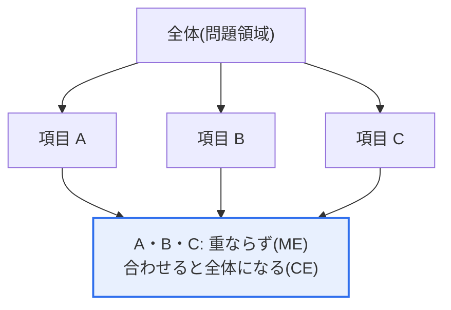
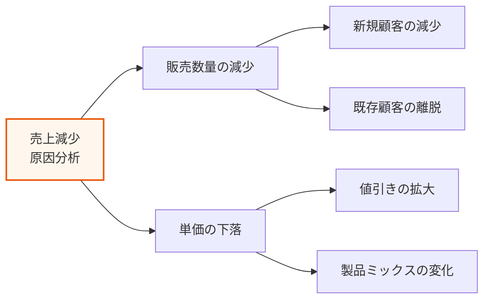

# MECE（Mutually Exclusive, Collectively Exhaustive）

## 1. 概要

### A. 定義
> **MECE**とは、ある対象を分類・分析する際に、項目同士が**互いに重複せず（相互排他, Mutually Exclusive）**、**全体として漏れなく完全な（全体網羅, Collectively Exhaustive）**状態を備えるようにする論理的な分類原則である。マッキンゼー（McKinsey）のバーバラ・ミント（Barbara Minto）が確立した思考技法であり、今日ではコンサルティング・戦略・企画・意思決定全般の基本として定着している。

MECEが問題解決・分析の出発点に挙げられる理由は、「**重複と漏れをなくしてこそ、正確で信頼できる分析になる**」という点にある。ある問題を分けて分析する際、項目同士が重なれば（重複）同じものを二度数えたり責任の所在が曖昧になったりして資源が浪費され、抜けている部分があれば（漏れ）重要な要素を見落として結論そのものが誤る。MECEは、この二つの誤りを**同時に**防ぐ仕組みである。相互排他は「重ねるな」（重複の排除）を、全体網羅は「漏らすな」（漏れの防止）を求める。

例えば顧客を「新規/既存」に分ければ重なりも漏れもなくMECEであるが、「20代/会社員」に分けると、20代の会社員が両方に重なり（重複）、30代の非会社員などはどこにも属さない（漏れ）ため、MECEではない。この単純な例が示すように、MECEであるかどうかは**分類基準の選択**で決まる。コンサルティングにおいて問題を論理的に構造化（ロジックツリー）したり市場を細分化したりする際、MECEは分析の正確性と説得力を担保する出発点となる。すなわちMECEは、「**うまく分けること**」がすなわち「**うまく分析すること**」であることを示す原則であり、情報管理技術士の観点からは、要件分解・リスク識別・代替案導出のような構造的分析活動の品質を左右する思考ツールである。

### B. 二つの要件とその相互関係
MECEは、二つの要件が**同時に**満たされて初めて成立する。一方だけを満たしても、半分の分類にすぎない。相互排他だけを守って全体網羅を見落とせば「すっきりしているが不完全な」分析となり、全体網羅だけを守って相互排他を見落とせば「漏れはないが重複で混乱した」分析となる。

| 要件 | 意味 | 違反時の問題 |
|---|---|---|
| **ME(相互排他)** | 項目間に重複がない | 二重計上・責任の曖昧化・資源の浪費 |
| **CE(全体網羅)** | 全体を漏れなく含む | 中核要素の漏れ・誤った結論 |

### C. よくある誤解
MECEについてよくある誤解は、「項目数が多いほど完全である」という考えである。しかし、項目がいくら多くても互いに重なればME違反であり、いくら少なくても全体を覆っていればCEは満たされる。核心は**数ではなく、基準の一貫性と網羅性**である。もう一つの誤解は、MECEを「完璧に」達成しなければならないという強迫観念であるが、後述するように、実務では目的に合った「実用的MECE」で十分である。

## 2. 概念図解と原理

### A. パズルの比喩で見るMECE
MECEな分類は、全体を切り分けた**パズル**のようなものである。ピース同士が重ならず（ME）、すべて合わせると元の全体が完成する（CE）。重なればピースが余って混乱し、欠ければ絵に穴が開く。以下の図解は、全体（問題領域）を三つの項目に分けたMECE分解の基本構造を示している。

### B. 反復適用とロジックツリー
この構造が威力を発揮するのは、**複数の段階にわたって反復適用**するときである。大きな問題をMECEに分割した後、各下位問題を再びMECEに分割していくと、「ロジックツリー（イシューツリー）」が出来上がる。各階層で重複・漏れがないため、ツリー全体を見渡せば、原因・解決策を漏れなく・重ならずに導き出すことができる。以下の図解は、「売上減少」という問題をMECEなロジックツリーに分解する例である。

### C. 良い分解基準の条件
ここで売上は恒等式`売上 = 販売数量 × 単価`で分解されるため、二つの下位項目は自然にMECEとなる。このように**数式・構造に基づく分解**（例：売上＝数量×単価、利益＝売上−費用）はMECEを保証しやすい一方、任意の属性の羅列（年齢・職業・地域を混ぜるようなもの）は重複・漏れを招きやすい。良い分解基準を選ぶことがMECEの半分であるという原理が、ここに現れている。

## 3. MECEを達成する方法と活用

### A. 三つの分解方法
MECEを実務で達成する代表的な方法は三つある。

**第一に、要素分解型（構成要素の分解）**である。全体を物理的・論理的な構成部分に分ける（例：身体を頭・胴体・腕・脚に、システムをフロントエンド・バックエンド・データ・インフラに）。対象が明確な構成要素を持つ場合には直感的であり、漏れを発見しやすい。ただし、「どこまでが一つの要素か」という境界が曖昧だと重複が入り込み得るため、境界の定義を先に確定することが鍵となる。

**第二に、計算式分解型（数式分解）**である。恒等式で分けることで、数学的に重なりも漏れもないようにする（例：売上 = 顧客数 × 購買頻度 × 客単価、利益 = 売上 − 費用）。恒等式は定義上、左辺と右辺が完全に一致するため、MECEが構造的に保証される。計量可能な成果の問題（売上・費用・コンバージョン率）に特に強力であり、各因数をさらに分解してドライバーツリーを構成することができる。

**第三に、検証済みフレームワーク活用型**である。3C（自社・競合・顧客）・4P（製品・価格・流通・販促）・バリューチェーン・PESTなど、すでにMECEに近くなるよう設計された枠組みを借りて使う。フレームワークは「車輪の再発明をせずに」検証済みのMECE構造を再利用させてくれ、利害関係者間の共通言語を提供してコミュニケーションコストを下げる。ただし、フレームワークが対象に合わなければ無理な分類になるため、問題の性質に合った枠組みを選ぶ判断が必要である。

### B. 代表的な活用領域
実務においてMECEは、**ロジックツリー**と組み合わせたときに最も大きな力を発揮する。大きな問題をMECEな下位問題へと次々に分割していけば、漏れなく原因・解決策を導き出すことができ、各枝が独立しているため、チームで分業して並行分析するのにも適している。また、報告書・プレゼンテーションの**目次の構造化**にも使われ、論理的な流れと説得力を高める。聞き手は「何か抜けていないか、同じ話を繰り返していないか」という疑いを自然に解くことになる。

情報管理技術士の実務では、この原則が特に有用である。例えば要件を「機能要件 / 非機能要件」に、さらに非機能を「性能・セキュリティ・可用性・保守性」などの品質特性へとMECEに分解すれば、要件の漏れを防止できる。リスク管理においても、リスク分類体系（RBS）をMECEに設計してこそ、識別段階で重要なリスクカテゴリが抜け落ちない。

| 活用領域 | 内容 | 実務上の効果 |
|---|---|---|
| **ロジックツリー** | 問題をMECEに下位要素へ分解 | 原因・解決策の漏れ防止、分業が容易 |
| **市場細分化** | 重複・漏れのない顧客グループの分類 | ターゲティングの精度・資源配分の効率 |
| **原因分析** | 問題の原因を漏れなく・重ならずに導出 | 根本原因の特定、再発防止 |
| **報告書の構造化** | 論理的で説得力のある目次構成 | コミュニケーションの明瞭性 |

## 4. 事例と比較：MECEと非MECE

### A. 非MECE事例の是正
具体的な事例で違いを見てみる。ある企業が「顧客離脱の原因」を分析し、候補を「価格への不満、品質への不満、競合他社への移動、20代の顧客」と列挙したとする。この分類はMECEではない。「競合他社への移動」と「価格への不満」は重なり得（価格が原因で競合他社へ移動）、「20代の顧客」は原因ではなく属性であるため次元が異なり（カテゴリの混同）、サービスへの不満などが漏れている。

これをMECEに直すには、「製品要因（価格・品質）/ サービス要因（応対・アフターサービス）/ 関係要因（競合他社の誘引・スイッチングコスト）/ その他」のように、**同一次元の相互排他的なカテゴリ**へと再構成しなければならない。違いが生じる理由は、分類の**基準（次元）を一つに統一**したかどうかである。実務的な含意は明確である。項目を列挙する前に、「今どのような基準で分けているのか」をまず定義しなければならない。基準を先に定めれば自然に相互排他が確保され、その基準が対象全体を覆っているかを点検すれば全体網羅が確保される。

### B. 分解方式の比較と混合戦略
もう一つの比較として、**定性的分解 vs. 計算式分解**がある。定性的分解（例：満足/不満足）は直感的だが境界が曖昧で重複が生じやすく、計算式分解（売上＝数量×単価）は構造的にMECEを保証するが、すべての問題に適用できるわけではない。したがって、計量化可能な問題は計算式で、そうでない問題は検証済みのフレームワークや明確な二分（あり/なし、内部/外部）基準で分けるのが実務の定石である。

コンサルティングの現場では、3Cで「全体像」をMECEに押さえた後、各Cの内部をさらに詳細な基準で分割していく**混合戦略**がよく使われる。上位階層はフレームワークで大きな漏れを防ぎ、下位階層は計算式・二分基準で精密に分ける方式である。このように、一つの万能な基準に固執するよりも、階層ごとに適切な分解方法を選択することが、実践における成熟したMECEの活用である。

## 5. 深掘り：限界と実務上のバランス、連携フレームワーク

MECEは強力であるが万能ではなく、その**限界とコスト**を理解してこそ、実務で誤用しない。

### A. 完璧なMECEの非現実性と実用的MECE
**完璧なMECEは非現実的**である場合が多い。実際の問題は要因が複雑に絡み合っているため完全な相互排他は難しく、完全な全体網羅のために「ETC（その他）」項目を乱用すると分析の焦点がぼやける。そのため実務では、分析目的に合致した**「実用的MECE（practically MECE）」**を志向する。重要な軸で重複・漏れがなければ十分であり、些細な重なりに執着して分析を遅らせない。言い換えれば、MECEは「目標」ではなく「分析品質を高めるための手段」であり、手段に埋没して目的（問題解決）を見失うことを警戒しなければならない。

### B. MECEは「分けること」にすぎず「洞察」ではない
MECEにうまく分けたからといって、自ずと良い結論が出るわけではない。分けた後には、「どの枝が最も重要か（80:20）」を判断する優先順位付けが必要である。すなわち、MECE（漏れなく分けること）とパレートの法則（核心に集中すること）は相互補完的である。MECEで全体を俯瞰した後、インパクトの大きい少数の枝に資源を集中するのが、実践的な問題解決の形である。MECE分解ばかりを大量に行って優先順位を付けられなければ、「分析のための分析」に終わってしまう。

### C. 連携フレームワークと技術士としての適用
MECEは、ロジックツリー、ピラミッド構造（MintoのPyramid Principle）、仮説思考（Hypothesis-Driven）、So What?/Why So?の論理と併せて使われて初めて完成する。情報管理技術士の観点からは、システム要件の分類（機能/非機能）、リスクの分解（WBS・リスク分類体系）、品質特性の分解など、構造的分析成果物の**漏れ・重複検証チェックリスト**としてMECEを活用できる。近年では、データ分析・AIのプロンプト設計においても、問題をMECEに構造化した後で各部分を処理する（分割統治）方式が強調されるなど、適用範囲が広がっている。これは、複雑な問題を独立かつ完全な下位問題に分割すれば各部分を並行・個別に扱いやすくなるという、ソフトウェア工学のモジュール化・関心の分離（Separation of Concerns）の原理とも通じるものである。

## 6. 考慮事項および示唆（技術士の観点）

1. **適切な分類基準（次元）の選択が核心である。** MECEであるかどうかは何で分けるか（年齢・地域・行動・計算式など）で分かれるため、分析目的に合致した単一次元の基準を慎重に選択しなければならない。異なる次元を混ぜた瞬間に、重複・漏れが発生する。
2. **完璧主義を警戒し、実用的MECEを志向する。** 現実の問題では、完全な相互排他・全体網羅は難しい。重要な軸で重複・漏れをなくしつつ、些細な重なりのために分析を遅らせる過度な完璧主義は、かえって非効率である。
3. **MECEは優先順位付け・洞察と結合しなければならない。** 漏れなく分けるだけでは結論は出ないため、パレートの法則で核心となる少数を特定し、So What?で示唆を導き出す後続の思考と必ず連携させなければならない。
4. **構造的分析の品質検証ツールとして活用する。** 要件分解・リスク識別・代替案導出など、技術士の実務成果物に対して「重なる項目はないか、抜けている次元はないか」を点検する検証チェックリストとしてMECEを適用すれば、分析の信頼性と説得力を高めることができる。
5. **論理的思考・コミュニケーションの基本である。** MECEはコンサルティングだけでなく、企画・意思決定・報告全般において明瞭で説得力のある思考を支える土台であり、3C・4P・SWOTなど多様なフレームワークの根底をなしている。[[swot-3c-pest]]

## 参考資料
- Barbara Minto, "The Pyramid Principle: Logic in Writing and Thinking" — ピラミッド構造とMECE原則の原典
- McKinsey & Company, "The McKinsey Way"(Ethan Rasiel) — MECE・ロジックツリーの実務適用
- Wikipedia, "MECE principle" — https://en.wikipedia.org/wiki/MECE_principle
- 関連トピック: [[swot-3c-pest]] — MECEに基づく戦略分析フレームワーク

---

> **一言まとめ**: MECEは、*項目が互いに重複せず（ME）全体を漏れなく網羅（CE）*するように分ける論理的な分類原則であり、正しい分類基準の選択が鍵となり、ロジックツリー・市場細分化・原因分析の基本となる。ただし、完璧主義を警戒した「実用的MECE」として、パレート・So What?などの優先順位付け・洞察の思考と結合してこそ、実践的な問題解決として完成する。
