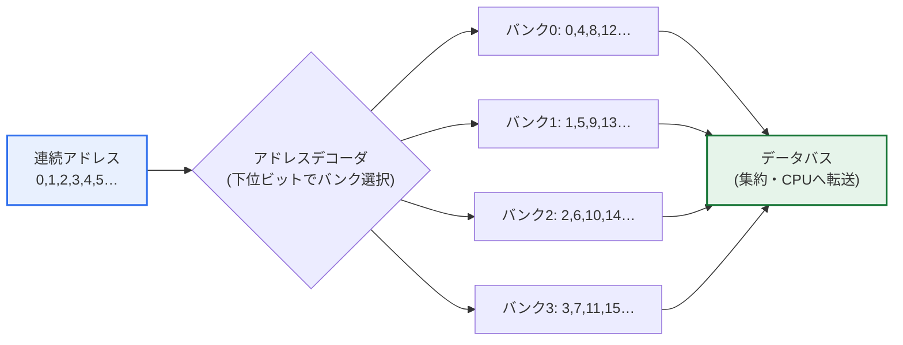
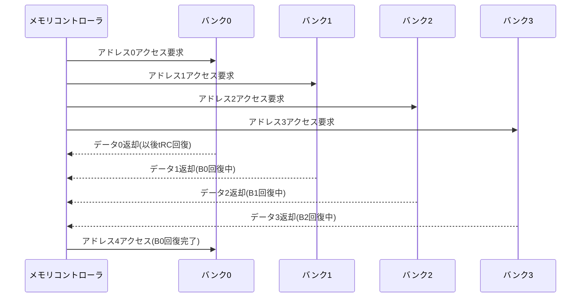

# メモリインターリーブ（Memory Interleaving）

## 1. 概要

### A. 定義

> **メモリインターリーブ（Memory Interleaving）**とは、物理メモリを複数の独立した**バンク（Bank）**または**チャネル（Channel）**に分割し、連続するアドレスを異なるバンクに交互に分散配置することで、複数のバンクに**同時・重畳的（overlap）**にアクセスし、メモリの実効帯域幅（effective bandwidth）を高める手法である。

メモリインターリーブの核心的な発想は、「一つずつ順番に待つのではなく、複数の窓口で同時に処理しよう」というものである。DRAMは一度アクセスすると、次のアクセスを受け付けるまでにセル電荷の再充電（precharge）や行活性化（row activation）などに一定の時間を消費し、この回復時間はしばしば**バンクサイクルタイム（bank cycle time）**またはtRCと呼ばれる。メモリモジュールを一つしか使わなければ、CPUはこの回復時間の間、何のデータも受け取れずに待機（stall）することになる。インターリーブは、メモリを複数のバンクに分けたうえで、連続アドレス（0, 1, 2, 3…）をバンクに交互に（0→バンク0、1→バンク1、2→バンク2、3→バンク3、4→再びバンク0…）配置する。すると連続データを読み出す際、複数バンクの動作が時間軸上で重なって（pipeline）進行し、あるバンクが回復待ちをしている間に、別のバンクがすでに次のデータを送り出している。

この構造は、銀行の窓口を同時に複数開けて待ち行列を分散させることに例えられる。窓口が一つであれば、前の人が用件を終えるまで後ろの人は必ず待たなければならないが、窓口が四つあれば四人が同時に処理され、全体のスループット（throughput）は理論上四倍まで増える。ただし、レイテンシ（latency）、すなわち一人が窓口に入って用件を終えるまでにかかる絶対時間そのものは短くならないという点が重要である。インターリーブが改善するのは個々のアクセスのレイテンシではなく、**単位時間あたりに処理できるアクセス数（帯域幅）**であり、これは後述するキャッシュがレイテンシを扱う方式と明確に区別しなければならない。

### B. 登場背景と必要性

CPUの動作速度はムーアの法則に支えられて急激に向上してきた一方、DRAMのアクセス速度は相対的に緩やかにしか改善されず、その差は年々広がってきた。この累積した性能差を**メモリウォール（Memory Wall）**と呼び、どれほどCPUが速くても、データを適時に供給されなければ演算ユニットが遊んでしまうボトルネックが発生する。特に、配列・行列演算、ストリーミングメディア処理、グラフィックスレンダリング、ディープラーニングのテンソル演算のように、大量の連続データを走査する処理ほど、このボトルネックは致命的である。

メモリインターリーブは、素子そのものを速くする代わりに、**並列性（parallelism）**によって帯域幅を確保するアプローチである。素子速度（tRC）は物理的な限界に突き当たるが、バンク数を増やして同時に処理するアクセス数を大きくすることは相対的に安価である。こうした理由から、インターリーブは初期の大型コンピュータのメモリ設計から出発し、今日のマルチチャネルDIMM、DDRの内部バンクグループ、GPUのHBMに至るまで、事実上すべての高性能メモリサブシステムの基本原理として定着した。

## 2. 動作原理と全体構造

全体構造は、「アドレス分解 → バンク選択 → 並列アクセス → 結果の集約」の流れとして理解できる。メモリコントローラは、CPUが要求した物理アドレスを受け取り、そのアドレスの特定ビットを用いてどのバンクへ送るかを決定する。下位インターリーブでは、アドレスの最下位ビットがバンク番号となり、残りの上位ビットがバンク内部のオフセットとなる。

上図のように、連続したアドレスが4つのバンクに循環的に分散されるため、シーケンシャルアクセス時には4つのバンクが並列・重畳的に動作し、各バンクの回復遅延が他のバンクの動作の陰に隠される（latency hiding）。すなわち、バンク一つだけではtRCごとに一回しかデータを出せないが、4-wayインターリーブでは、tRCの1/4間隔ごとに順次データが流れ出るパイプラインが形成される。

このパイプライン効果は、時間軸で見るとさらに明確になる。以下のシーケンス図は、4つのバンクが回復時間を重ね合わせながら連続データを送り出す過程を示している。

要点は、バンク0がデータ0を送り出した後に回復している間も、コントローラは遊ばずにバンク1・2・3から順次データを受け取っているという点である。バンク0の回復が終わる頃にはすでにアドレス4の要求を投入できるため、理想的なシーケンシャルアクセスではバンクの回復遅延が完全に隠され、バスはほとんど休むことなくデータを転送する。

## 3. インターリーブ方式の類型

インターリーブは、アドレスのどの部分をバンク選択に用いるかによって、大きく下位（low-order）と上位（high-order）に分かれる。この二つは単なる実装の違いではなく、性能と信頼性の間の設計哲学の違いを表している。

**下位インターリーブ（Low-order Interleaving）**は、アドレスの最下位ビットをバンク番号として使用する。その結果、連続したアドレスが自然に複数のバンクへ広がるため、配列をシーケンシャルに走査するようなアクセスパターンでバンク並列性が最大化される。シーケンシャルアクセスの帯域幅を高めることが目的であれば、下位インターリーブが正解に近い。性能志向のメモリシステムの大半は、この方式を基本として採用している。

**上位インターリーブ（High-order Interleaving）**は、アドレスの最上位ビットをバンク番号として使用する。すると、一つのバンクが連続した大きなアドレスブロックを丸ごと担当することになる。性能上の並列性は低下するが、特定のバンクが故障しても、そのバンクが担当するアドレス領域だけが影響を受けるため、**障害の隔離（fault isolation）**やバンク単位でのモジュール拡張・交換に有利である。例えば、メモリモジュールを抜き差しして容量を増やしたり、欠陥バンクを無効化して残りで運用したりするシナリオでは、上位インターリーブが管理上便利である。

| 方式 | バンク選択ビット | データ配置 | 強み | 弱み |
|---|---|---|---|---|
| **下位インターリーブ** | 下位アドレスビット | 連続アドレスを複数バンクに分散 | シーケンシャルアクセス帯域幅の最大化 | バンク故障時の影響が広範 |
| **上位インターリーブ** | 上位アドレスビット | 連続ブロックが一つのバンクに集中 | 障害隔離・モジュール拡張が容易 | シーケンシャルアクセスの並列性が低い |

実際のシステムでは両者を混合することもある。上位の数ビットでチャネルを、下位の数ビットでバンクを選ぶ多段マッピングを用いて性能と管理性を両立させるのが、現代のメモリコントローラの一般的な設計である。

## 4. 性能特性とバンクコンフリクト

インターリーブの効果は、アクセスパターンに大きく左右される。最も理想的なケースは、前述のように連続アドレスを順に読み出すシーケンシャルアクセスであり、このときN-wayインターリーブは理論上N倍に近い帯域幅を出す。例えば、単一バンクの回復時間が60nsで4-wayインターリーブであれば、理想的なシーケンシャルアクセスでは15nsごとに1ワードずつ流れ出ることになり、実効スループットが大きく増加する（実際にはバス幅・転送オーバーヘッドのため理想値には届かない）。

問題は、ランダムアクセスや特定のアドレス間隔（stride）を持つアクセスである。もしアクセスアドレスが偶然すべて同じバンクにマッピングされると、複数のアクセスが一つのバンクで直列に処理され、並列性が失われる。これを**バンクコンフリクト（bank conflict）**という。代表的な例が2のべき乗のstrideアクセスである。例えば4-wayインターリーブにおいて、strideが4の倍数のアクセス（アドレス0, 4, 8, 12…）はすべてバンク0だけに向かうため、並列性が完全に崩れ、性能が単一バンクの水準まで低下する。行列を列優先（column-major）で走査する際に、このような病理的パターンが頻繁に発生する。

この問題を緩和するため、実務ではバンク数を素数（prime number）に近い値にしたり、アドレスビットをXOR・ハッシュで混ぜてバンクにマッピングする**XOR/permutationインターリーブ**手法を用いたりする。ソフトウェア側では、配列のpaddingによってstrideがバンク数の倍数にならないよう調整したり、行列演算をタイリング（tiling）してアクセスパターンを局所化したりする最適化が併用される。すなわち、インターリーブの実効性能は、ハードウェアのマッピングとソフトウェアのアクセスパターンが共同で決定する。

## 5. キャッシュ・メモリ階層との関係の比較

インターリーブとよく一緒に言及されるのがキャッシュであるが、両手法が扱う問題は根本的に異なる。キャッシュは、頻繁に使うデータをCPUに近い高速ストレージに置き、**個々のアクセスのレイテンシ（latency）**を減らす。一方インターリーブは、複数のバンクを並列に回して**単位時間あたりの帯域幅（bandwidth）**を増やす。この二つは代替財ではなく、相互補完財である。

| 観点 | キャッシュ(Cache) | メモリインターリーブ |
|---|---|---|
| 扱うボトルネック | アクセスレイテンシ(latency) | アクセス帯域幅(bandwidth) |
| 中核原理 | 局所性(locality)を活用した再利用 | バンク並列性を活用した重畳 |
| 効果が大きい状況 | 反復的な再アクセス(temporal locality) | 大量のシーケンシャルアクセス(streaming) |
| 限界 | キャッシュミス時に無力 | バンクコンフリクト時に無力 |

実際のシステムでキャッシュがミスを起こした瞬間、そのミスをメモリから埋めるキャッシュラインフィル（cache line fill）は、複数のワードを連続して取得する典型的なシーケンシャルアクセスであるため、インターリーブの帯域幅がそのまま効果を発揮する。すなわち、キャッシュは「いつメモリへ行くか」を、インターリーブは「行ったときにどれだけ速く埋めるか」を担当する。両手法が協力してこそ、メモリウォールの緩和が完成する。

## 6. 深掘り：現代のメモリにおけるインターリーブ

今日、インターリーブは、複数の階層で同時に作動する多層的な並列性へと拡張された。まず**DDR SDRAM**は、一つのチップ内部にすでに複数のバンク（例：DDR4はバンクグループごとに複数のバンク）を持ち、バンクインターリーブによって連続アクセス時の回復遅延を隠す。その上でメモリコントローラは、複数のDIMM・チャネルを束ねる**チャネルインターリーブ（マルチチャネル）**を適用する。デュアル・クアッドチャネル構成がよく宣伝する帯域幅の向上は、まさにチャネル単位のインターリーブの結果である。例えばデュアルチャネルは、二つのチャネルにデータを分散して、理論上シングルチャネル比で約2倍の帯域幅を提供する（実際のアプリケーションでの利得はアクセスパターンによってそれより小さい）。

GPUとAIアクセラレータの領域では、**HBM（High Bandwidth Memory）**がインターリーブの原理を極限まで推し進めた事例である。HBMは、複数のDRAMダイを垂直に積層し（TSVで接続）、数千ビット級という非常に広いインターフェースと多数の独立チャネルを備え、一つのスタックで数百GB/sからTB/s級の帯域幅を確保する。ディープラーニングの学習のように巨大なテンソルをストリーミングで読み出す必要があるワークロードにおいて、このチャネル・バンク並列性がなければ、演算ユニットはデータ飢餓（starvation）に陥るであろう。こうした文脈において、インターリーブは単なる古典的手法ではなく、AI時代のハードウェアの中核的な帯域幅戦略として再評価されている。

NUMA（Non-Uniform Memory Access）のマルチソケットサーバーでは、インターリーブが性能と局所性の間のトレードオフを生む。複数ソケットのメモリをインターリーブして帯域幅を均等に使えば特定ノードのボトルネックは減るが、アクセスがリモートノードに散らばり、局所性の利点が弱まる可能性がある。そのため、オペレーティングシステム・ハイパーバイザは、`numactl`のinterleaveポリシーのように、ワークロードの性質に合わせてインターリーブの有無を選択できるようにしている。帯域幅志向のバッチ・分析ワークロードにはインターリーブが、レイテンシに敏感で局所性の高いワークロードにはノードローカル配置が有利である場合が多い。

## 7. 考慮事項および示唆

技術士の観点から、メモリインターリーブは次のように整理・活用できる。

1. **アクセスパターン整合性の設計原則**: インターリーブはシーケンシャルアクセスで帯域幅を最大化するが、2のべき乗のstrideなどではバンクコンフリクトによって無力化する。したがって、データ構造のアライメント・padding、行列のタイリング、XORバンクマッピングを併せて適用し、ハードウェアの並列性とソフトウェアのアクセスパターンを整合させることが、性能設計の核心である。

2. **帯域幅とレイテンシの階層的協力**: インターリーブ（帯域幅）とキャッシュ（レイテンシ）は相互補完財であるため、システム性能のチューニングは、どちらか一方ではなく、キャッシュミス率とメモリ帯域幅の利用率を併せて計測してボトルネックの性質を明らかにしたうえでアプローチしなければならない。

3. **AI・HPCワークロードにおける戦略的重要性**: HBMのマルチチャネル・バンク並列性は、ディープラーニング・科学計算のテンソルストリーミング帯域幅を左右する。アクセラレータの選択・システム設計においては、理論演算量（FLOPS）だけでなく、メモリ帯域幅と演算強度（arithmetic intensity）を併せて検討するルーフライン（roofline）の観点が必要である。

4. **NUMA環境における配置ポリシーのトレードオフ**: マルチソケット・マルチノードにおいて、インターリーブは帯域幅のバランスと局所性の損失との間の選択であるため、ワークロードが帯域幅志向か、レイテンシ・局所性志向かをプロファイリングしたうえで、OSのメモリポリシー（interleave vs. local）を決定しなければならない。

5. **信頼性・拡張性とのバランス**: 純粋な性能では下位インターリーブが有利であるが、障害隔離とモジュール単位の拡張・交換が重要なミッションクリティカルシステムでは、上位インターリーブや混合マッピングを検討し、可用性と性能を両立させなければならない。

## 参考資料

- Hennessy & Patterson, *Computer Architecture: A Quantitative Approach* — メモリ階層・インターリーブ関連の章
- JEDEC DDR/HBM 標準の概要: https://www.jedec.org/standards-documents/technology-focus-areas/main-memory-ddr3-ddr4-sdram
- Linux `numactl`/`numa(7)` マニュアル: https://man7.org/linux/man-pages/man8/numactl.8.html

---

> **一言まとめ**: メモリインターリーブは、*メモリを複数のバンク・チャネルに分割し、連続アドレスを分散配置*して並列・重畳アクセスにより帯域幅を高める手法であり、シーケンシャルアクセスに強い下位インターリーブが性能上の標準であるが、バンクコンフリクト・NUMAの局所性などのトレードオフがあり、キャッシュ（レイテンシ）と協力してメモリウォールを緩和し、現代のマルチチャネルメモリ・HBM・AIアクセラレータの帯域幅の基盤となる。
