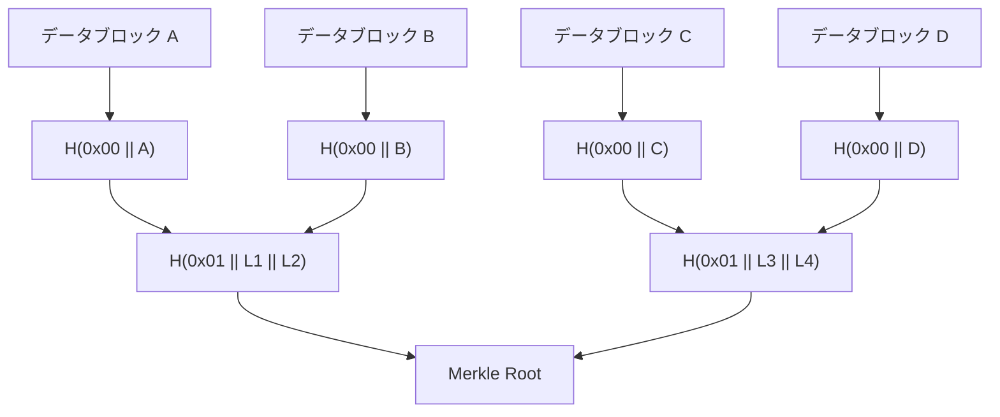
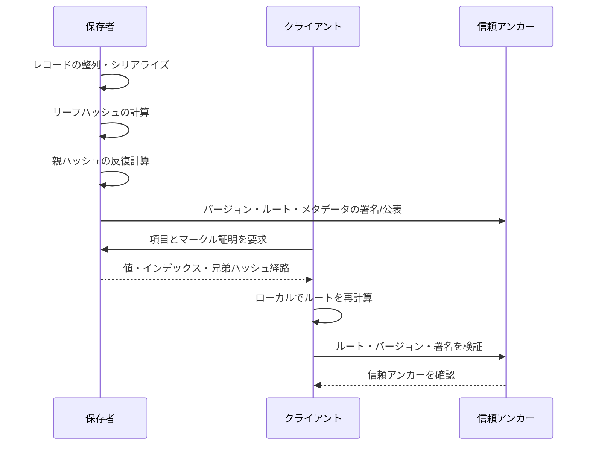

# マークルツリー（Merkle Tree）とデータ完全性の検証

## 1. 概要

> **定義**: マークルツリー（Merkle Tree）とは、データの断片を繰り返しハッシュして親ハッシュへと結合し、最終的なルートハッシュ（root hash）一つで集合全体の状態を要約するハッシュ木である。

分散システムでは、データを保管するノードとデータを照会するノードが異なり、ネットワークを通じて伝達されるデータが途中で改ざんされる可能性がある。このとき検証者は、元データ全体とすべてのレコードを受け取り直すことなく、特定の項目が集合に含まれているか、あるいは同一の状態を指しているかを確認できなければならない。

ファイル一つのハッシュを単純に比較する方式には、ファイル全体を再ダウンロードしなければならないという限界がある。一方マークルツリーは、リーフ（leaf）からルートまでの兄弟ハッシュだけを伝達するマークル証明（Merkle proof）を用いるため、データ全体が大きくなっても、検証に必要な証明のサイズはおおむね対数オーダーでしか増加しない。

マークルツリーの核心は、暗号学的ハッシュそのものではなく、**要約値を階層的に構成する方式**にある。ハッシュ関数が衝突耐性、原像計算困難性、雪崩効果を十分に提供するのであれば、一つのルートハッシュは、多数の下位データの変化を敏感に反映するコミットメント（commitment）として機能する。

例えば1,048,576件のレコードを2件ずつ束ねて二分木を作ると、特定レコードの包含を示す証明には、理想的な場合で約20個の兄弟ハッシュが必要となる。全レコードを伝達する方式と比べれば通信量は大きく減るが、ルートハッシュが信頼できるチャネルを通じて配布されなければならないという前提は残る。

### 登場背景と必要性

分散台帳、コンテンツ配信網、ソフトウェアリポジトリ、ログ透明性システムは、いずれも「元データと検証データが分離している」という問題を抱えている。リポジトリはデータ全体を保有しているが、クライアントは一部だけを照会したり、軽量な検証だけを行ったりしようとする。

マークルツリーは、この問題をデータ構造の観点から解決する。保存者はツリー全体を計算してルートハッシュを公表し、検証者は対象項目と兄弟ノードのハッシュを受け取って、同じ結合規則でルートを再計算する。

ただし、マークルツリーがデータの真正性や意味的な正確性を保証するわけではない。信頼できないデータが最初から入力されていれば、ツリーはその誤ったデータの一貫性を証明するだけである。したがって、ルートの生成主体、配布チャネル、鍵管理、時間順序、最新性の検証まで併せて設計しなければならない。

### 技術士の観点からの問題定義

論述答案では、マークルツリーを「ハッシュをつないだ図」としてのみ説明するのではなく、検証コスト・信頼境界・変更検知・最新性という品質特性の観点から記述することが重要である。

第一に、検証者がデータ全体を保有していなくても包含証明を作れるかを確認する。第二に、同一のデータであっても、シリアライズ方式やハッシュのドメイン分離が異なれば、異なるルートが生成され得ることを説明する。

第三に、ルートハッシュの信頼性を確保する鍵署名、合意、TLS、透明性ログなどの補完手段を区別する。第四に、追加・削除・更新が頻繁な環境では、静的な二分木と動的なデータ構造のコストの違いを比較する。

## 2. 基本構造と動作原理

### A. ノード構成とハッシュ階層

リーフノードは、元のデータブロックまたはレコードから計算したハッシュである。内部ノードは、左の子と右の子のハッシュを定められた順序で連結して再びハッシュした値である。ルートは、すべてのリーフの影響が伝播した最上位の要約値である。

実際の実装では、単に`H(left || right)`だけを使うよりも、リーフと内部ノードの意味を区別するドメイン分離（domain separation）を適用する方が安全である。例えば、リーフを`H(0x00 || data)`、内部ノードを`H(0x01 || left || right)`で計算すれば、異なる種類の入力が同じ解釈経路に混ざるリスクを減らすことができる。

入力データのシリアライズも合意された規則でなければならない。JSONオブジェクトのキー順序、数値表現、文字エンコーディング、改行、空白が異なれば、同じ意味のデータであっても異なるバイト列となる。したがって、canonical serializationまたは明示的なバイナリエンコーディングを使用しなければならない。

上記の構造において、ルートは特定のデータブロックを直接格納するわけではない。ルートはすべての下位ハッシュの結合結果であるため、データが1バイトでも変われば、変更されたリーフからルートまでの経路が変化する。

ノード数が2のべき乗でない場合は、プロトコルが奇数レベルを処理する規則を明示しなければならない。最後のノードを複製する方式、最後のノードを昇格させる方式、不完全なノードを別途処理する方式は、それぞれ異なるルートを生み出す。

したがって、マークルツリーはアルゴリズム名だけでは相互運用できない。ハッシュ関数、リーフのドメイン、内部ノードの結合順序、奇数の処理、インデックスの基準、シリアライズ規則は、すべてプロトコルの一部である。

### B. ルートハッシュの意味

ルートハッシュは、データ集合全体に対する短いコミットメントである。検証者は、ルートと証明を照合することで、特定のデータがその時点の集合に属しているという事実を確認できる。

しかし、ルートハッシュを公開するだけで検証可能なシステムが自動的に完成するわけではない。攻撃者が偽のルートを配布すれば、クライアントはその偽のルートに合致する証明を受け取ることになり得る。そのためルートは、デジタル署名、ブロックヘッダ、合意されたチェックポイント、公開ログなど、信頼できる外部アンカー（anchor）に結び付けなければならない。

ルートに時刻とバージョン情報を併せて束ねることも重要である。同一データ集合のルートを再利用すると、古い状態を最新の状態のように提示するリプレイ攻撃（replay attack）が発生し得る。実務では、ルートにepoch、ブロック高、スナップショットバージョン、生成時刻、チェーン識別子などをバインドする。

### C. 完全性・無欠性・最新性の分離

マークル証明は通常、包含証明と完全性（無改ざん）の検証を提供する。「この項目のハッシュがこのルートに含まれる」という事実は確認できるが、その項目が唯一であるか、欠落した項目がないかまでは自動的に保証しない。

例えば、キー・バリューストアにおいて`user-100`の存在を証明することと、`user-100`が唯一存在することを証明することは異なる。後者には、整列規則、隣接キー、非存在証明、または別途のインデックス構造が必要である。

最新性は、さらに別の問題である。検証者には、正しい過去のルートと現在のルートを区別する基準がなければならない。署名されたチェックポイント、単調増加するバージョン、合意されたヘッダ、透明性ログの一貫性証明がこれを補完する。

## 3. マークルツリーの生成とマークル証明の検証

### A. 生成手順

最初の段階は、元レコードを決定論的に整列し、シリアライズすることである。入力順序がノードごとに異なれば、同一のデータセットでも異なるツリーが生成されるため、キーの整列とエンコーディング規則を文書化しなければならない。

第二に、各レコードにリーフのドメインタグを付けてハッシュする。このとき、空のデータと空のリストを区別し、レコード識別子やバージョンのような文脈を含めるかどうかを決める。

第三に、隣接する二つのリーフを内部ノードへ結合する。左右の順序を入れ替えると結果が変わるため、整列型マークルツリーか位置ベースのマークルツリーかを明確にする。

第四に、最上位ノードが一つ残るまで同じ作業を繰り返す。奇数ノードが残るレベルでは、仕様に従って複製または昇格を適用し、この規則を検証コードとテストベクタに反映する。

第五に、生成したルートとツリーバージョン、ハッシュアルゴリズム、レコード範囲を併せて保存する。ルートだけを保存すると、後になってどの規則で作られたのかを再現することが難しい。

生成パイプラインは、データ処理とルートの公表をアトミックに結び付けなければならない。データファイルは新バージョンなのにルートが旧バージョンのまま残っていれば、検証者は混乱する。したがって、スナップショットIDを先に確定し、スナップショット・ルート・署名を同一のリリース単位で管理する。

### B. 包含証明と検証手順

特定リーフの包含証明は、対象リーフの位置と、ルートまで上がる経路上の兄弟ハッシュのリストで構成される。検証者は、対象データからリーフハッシュを計算した後、各段階で兄弟ハッシュが左か右かに応じて結合する。

例えば、四つのリーフのうち三番目の項目を検証する場合には、四番目のリーフのハッシュと、一番目と二番目のリーフを結合した親ハッシュが必要である。この二段階の結果がルートと一致すれば、当該項目はそのツリーに含まれていると判断する。

検証者は、証明に含まれるインデックスが範囲内か、経路長が予想される高さと合っているか、ハッシュアルゴリズムとドメインタグがルートのメタデータと一致しているかも確認しなければならない。長さの検証がなければ、異常に長い証明やメモリを枯渇させる入力がサービス拒否につながり得る。

検証コストは、ハッシュ計算の回数と証明のサイズに比例する。平衡二分木においてレコード数をnとすると、経路長はおおよそ\(\lceil log_2 n ceil\)であり、データ全体のサイズO(n)に対して、証明データはO(log n)程度である。

### C. 非存在証明と範囲証明

存在しないキーを証明するには、単純な包含証明だけでは不十分である。整列型マークルツリーやマークルパトリシアツリーでは、探索経路と隣接する二つのキーを提示し、その位置に対象キーが入り得ないことを示す。

非存在証明は、個人情報の照会や権限確認のように、「リストに存在しないという事実」が重要なサービスに活用できる。ただし、キーの整列規則が検証者に知られている必要があり、隣接キーの公開が情報漏えいを引き起こさないかも評価しなければならない。

複数の項目を一度に証明するマルチプルーフは、共通の祖先ハッシュを共有して重複を減らす。例えば、同じサブツリーに属する100個の項目をそれぞれ証明する代わりに、一度だけ必要な兄弟ハッシュをまとめて送信できる。

範囲証明は、特定区間のすべての項目が含まれていることを示す要件である。これは単一項目の包含証明よりも完全性の要求が強いため、整列・境界・欠落の検証を明示し、応答する事業者が中間の項目を恣意的に省略できないように設計しなければならない。

## 4. 類型と関連データ構造の比較

### A. 位置ベースの二分マークルツリー

位置ベースの二分マークルツリーは、配列の順序とインデックスを基準に親を計算する。ブロックチェーンのトランザクションリスト、ファイルチャンクの検証、バージョンスナップショットのように、データの順序が意味を持つ場合に適している。

この構造は実装が単純で、検証コストを予測しやすい。一方、途中に項目を挿入すると、以降の項目の位置と多くの親ハッシュが変わるため、頻繁な挿入には非効率となり得る。

奇数ノードの規則が実装ごとに異なれば、異なるルートが算出される。したがって、テストベクタで1個、2個、3個、5個のノードと空の入力をすべて検証しなければならない。

### B. 整列型マークルツリー

整列型マークルツリーは、キーを整列して同一キーの位置を決定する。複数のノードが同じキー集合を独立に構成しても同一のルートを作りやすく、非存在証明や範囲証明に有利である。

その代わり、整列コストと更新コストを負担しなければならない。リアルタイムイベントが大量に流入するサービスでは、毎回全体を整列するよりも、バッチスナップショット、増分ツリー、ログ構造ストレージと組み合わせる方式を検討する。

キー自体を公開すると個人情報や事業情報が露出し得るため、キーのハッシュ化やプライバシー保護型のツリー構造が必要になる場合がある。ただし、キーを単純にハッシュしても、辞書攻撃が容易な値は推測され得るため、ソルトとアクセス制御を別途考慮しなければならない。

### C. マークルパトリシアツリーとトライ

マークルパトリシアツリーは、キーのプレフィックス経路と圧縮ノードを併用して、キー・バリューの状態を効率的に表現する。状態が変更されると、影響を受ける経路のノードだけを再計算すればよいため、動的な状態ストアに適している。

トライ系は文字列またはビット経路を活用するため、単純な配列型マークルツリーよりも照会の意味が豊かである。一方で、ノードのエンコーディングと分岐規則が複雑であるため、実装の互換性、悪意ある入力、ストレージ容量を細心の注意で管理しなければならない。

次の表は、構造の選択基準を要約したものである。表そのものは結論ではなく、要件を構造にマッピングするための補助ツールであり、実際の設計では、更新頻度と証明対象まで併せて判断する。

| 区分 | 位置ベースの二分木 | 整列型マークルツリー | マークルパトリシア/トライ |
|---|---|---|---|
| 中核基準 | 配列の位置 | キーの整列順序 | キーの経路・プレフィックス |
| 強み | 単純性・予測可能な経路 | 決定性・非存在証明 | 動的なキー・バリュー状態の更新 |
| 弱み | 途中挿入に弱い | 整列・再構成のコスト | 複雑なエンコーディングと運用 |
| 適合事例 | ブロック・ファイルチャンク | スナップショット・リストの完全性 | 状態ストア・アカウント照会 |

### D. 一般的なハッシュ・デジタル署名・ブロックチェーンとの違い

一般的なハッシュは、単一メッセージの変更を検知するには効率的だが、部分データに対する包含経路を提供しない。マークルツリーは、複数のハッシュを階層化することで部分検証を可能にする。

デジタル署名は、署名者がメッセージまたはルートを承認したことを証明するが、大規模データの部分的な包含関係をそれ自体では表現しない。実務では、マークルルートに署名して「署名された要約値」を作り、個々の項目はマークル証明で検証するという組み合わせが一般的である。

ブロックチェーンはマークルツリーを構成要素として使用できるが、マークルツリーとブロックチェーンは同じ概念ではない。マークルツリーはデータ集合を要約するデータ構造であり、ブロックチェーンはブロックの連結・合意・台帳規則まで含むシステムである。

| 比較対象 | 主な保証 | 部分検証 | 信頼の前提 |
|---|---|---|---|
| 単一ハッシュ | メッセージの変更検知 | 困難 | ハッシュアルゴリズムと値の伝達 |
| マークルツリー | 集合内の包含・一貫性 | 可能 | 信頼できるルート・規則 |
| デジタル署名 | 承認主体・完全性 | ルート署名との組み合わせ | 秘密鍵と証明書 |
| ブロックチェーン | 合意された順序・台帳状態 | マークル構造との組み合わせ | 合意・経済的セキュリティなど |

## 5. 適用事例と脅威への対応

### A. ブロックチェーンの軽量検証

ブロックチェーンのブロックヘッダにトランザクションのマークルルートを入れれば、軽量クライアントはブロック全体のすべてのトランザクションを保存しなくても、特定のトランザクションがブロックに含まれているかを確認できる。クライアントは、ブロックヘッダの信頼性とトランザクションのマークル経路を併せて検証する。

この方式はストレージ容量とネットワークコストを削減するが、包含されていることがそのままトランザクションのファイナリティや有効性を意味するわけではない。十分なブロック承認数、合意規則、二重支払い防止のポリシーを別途確認しなければならない。

トランザクションの順序とブロック高を証明にバインドすれば、同一のトランザクションが別の文脈で再利用されるリスクを減らすことができる。また、ノードが相反するヘッダを提示した場合に、どのアンカーを基準に選択するかを定義しなければならない。

### B. Gitのオブジェクトモデルと分散リポジトリ

Gitは、コンテンツアドレッシング方式によってオブジェクト内容のハッシュを識別子のように使用し、ツリーオブジェクトとコミットオブジェクトが下位の内容を指す構造を持つ。ファイルの内容が変われば、関連するツリーとコミットの識別子も連鎖的に変化するため、スナップショットの完全性を追跡できる。

この事例は、「データを位置ではなく内容で識別する」という原理を示している。ただし、Gitのオブジェクトグラフは典型的な完全二分マークルツリーと同一ではなく、DAG形式の参照とコミットのメタデータを利用するという違いを、答案では区別しなければならない。

リポジトリのリモートサーバーやタグの署名が信頼できなければ、ローカルのハッシュだけではサプライチェーンの出所を完全には保証できない。署名付きコミット、保護されたブランチ、レビューポリシー、再現可能なビルドと組み合わせてこそ、実務的な信頼の連鎖が形成される。

### C. Certificate Transparencyログ

公開鍵証明書の透明性ログは、発行された証明書を追記専用のログに記録し、ログの状態をマークルツリー系の構造で要約する。モニターと監査者は、包含証明とログの一貫性証明を用いて、特定の証明書が記録されたかどうか、そしてログが後から操作されていないかを確認する。

ここで重要なのは、単純な包含証明と一貫性証明が異なるという事実である。包含証明は一つの項目が特定のツリーに入ったことを示し、一貫性証明は以前のツリーが新しいツリーのプレフィックスとして維持されていることを確認させる。

ログ運営者は、ルートまたはツリーヘッダを信頼できるプロトコルで提供しなければならない。監査システムは、異なるクライアントに相反するツリーを見せる分岐（equivocation）を検知して報告できなければならない。

### D. バックアップ・ファイル配布・データレイク

大容量ファイルをチャンクに分割し、各チャンクのハッシュとルートを保存すれば、並列ダウンロード中に破損したチャンクだけを再送信できる。データレイクの不変スナップショットも、ファイルリストとパーティションのメタデータをマークルルートで要約することで、バッチの再現性を高めることができる。

ただし、チャンクの境界が変われば、同一のファイルでも異なるルートを持つ。コンテンツ定義チャンキング、固定サイズチャンキング、ローリングハッシュチャンキングの中から要件に合った方式を選択し、バージョン間の比較においてチャンクIDがどのように維持されるかを定めなければならない。

ランサムウェアや内部者攻撃に備えるには、ルートを運用サーバーから分離された保管場所へ定期的にアンカリングし、ルートのメタデータにアクセス制御と変更履歴を適用する。ルートがデータと同じストレージで一緒に改ざんされれば、検証構造が無力化される可能性がある。

## 6. 深掘り：設計・実装・運用の品質基準

### A. セキュリティ設計

ハッシュ関数は、衝突攻撃と伸長攻撃の可能性を評価して選択する。Merkle–Damgård系のハッシュを内部ノードで使用する際は、ドメイン分離と長さのエンコーディングを適用し、異なる入力文脈が衝突しないようにする。

インデックスと方向ビットを証明に含めなければならない。兄弟ハッシュのリストだけを送って方向を省略すると、検証者が左右の結合を推測しなければならなくなったり、実装ごとの異なる解釈によって、同一の証明が異なる結果を生んだりする可能性がある。

検証APIは、証明の深さ、ノード数、全体のバイト長、バージョン、アルゴリズム識別子を制限し、検査しなければならない。これにより、攻撃者が異常に大きな証明を送信してCPUやメモリを占有する状況を防止できる。

### B. 性能とストレージ戦略

静的なバッチデータは、ツリー全体を一度作ってルートをキャッシュする方式が効率的である。更新が少なければ、計算コストよりも証明生成の単純さの方が大きな利点となる。

変更の多いデータには、ログ構造ストレージ、増分マークルツリー、サブツリーキャッシュを活用できる。変更されたリーフからルートまでの経路だけを再計算すればよいが、ランダムな更新が急増すると、保存ノード数とガベージコレクションのコストが大きくなる。

マルチプルーフやバッチ証明を使用すれば、共通の兄弟ハッシュを除去できる。CDNやRPCサービスでは、同一ルートに対する証明をキャッシュしつつ、認証対象の権限と応答の最新性を併せて検証しなければならない。

### C. テストと運用

テストベクタには、空のツリー、単一リーフ、奇数リーフ、平衡ツリー、重複データ、最大長データ、非ASCII文字列を含めなければならない。特に奇数ノードの複製規則は、最もよくある相互運用性エラーの発生箇所である。

プロパティベーステストでは、任意のデータセットを生成し、生成したすべてのリーフの証明が同一のルートで検証されるかを確認する。1バイトを変えたデータ、方向ビットを変えた証明、別バージョンのルートを使った証明は、失敗しなければならない。

運用モニタリングでは、検証失敗率、証明サイズ、検証遅延、ルート生成遅延、ルート間の不一致、バージョンの逆行を収集しなければならない。検証失敗を単純な404として処理するのではなく、データ破損・攻撃・実装の不一致に分類できる診断情報を残す。

鍵でルートに署名する場合は、署名鍵の更新、失効、HSMでの保管、マルチシグネチャ、監査ログを設計する。署名鍵が奪取されると、攻撃者は一貫した偽のルートを配布できるため、鍵への信頼だけですべてのリスクを解決することはできない。

## 7. 考慮事項および示唆

### A. 信頼境界とアンカーの設計

マークルツリーは、ルートを信頼した瞬間から有効となる。ルートの出所が不明確であれば、どれほど正確な証明であっても、攻撃者のデータに対する証明となり得る。

したがって、ルートを署名付きメタデータ、ブロックヘッダ、公認された透明性ログ、別途のWORMストレージなど、一つ以上の独立したアンカーに結び付ける。異なる運用主体がルートに相互署名すれば、単一障害点を減らすことができる。

### B. 標準化と相互運用性

ハッシュ関数だけを合意するのでは十分ではない。シリアライズ、ドメイン分離、バイト順序、奇数ノードの処理、証明フォーマット、エラーコード、バージョンネゴシエーションまで仕様に含めなければならない。

プロトコルのバージョンをルートと証明に併せて記録すれば、アルゴリズム移行時に旧型クライアントと新型クライアントの解釈の衝突を減らすことができる。異なる実装が同一の公開テストベクタを通過することを確認したうえで、運用に投入する。

### C. 個人情報と情報漏えい

マークルルートは元データを直接露出しないが、証明経路やキー・メタデータが間接的な存在情報を露出させる可能性がある。希少な値や推測可能な識別子は、ハッシュ化だけでは匿名化されない。

個人情報の項目をリーフに入れる際は、最小収集、仮名化、アクセス制御、証明の有効期限、削除要求の処理方法を併せて検討する。不変の台帳にルートを残す場合も、元データの削除と、ルートに残る推論可能性との間の法的・運用的な関係を評価しなければならない。

### D. 最新性・可用性・障害対応

正確な過去のルートに対する証明は、最新の状態を保証しない。クライアントが許容できるルートの最大経過時間、バージョンの単調性、タイムスタンプの誤差、再同期の手順を定義しなければならない。

証明の提供者が障害を起こすと、検証自体は可能でもサービスを利用できない。ルートとスナップショットを複数リージョンに複製し、証明APIを複数の提供者から照会できるようにし、キャッシュされた証明の有効期限ポリシーを設ける。

### E. 適用の優先順位と展望

小さな静的リストには単一のハッシュや署名だけで十分な場合があるため、マークルツリーをむやみに導入しない。部分検証、大規模データ、分散保管、独立監査が実際の要件であるかをまず確認する。

導入するのであれば、データモデリングの段階で検証対象と信頼アンカーを先に決定し、その後でデータ構造と証明フォーマットを選択する。この順序を逆にすると、ストレージ構造は複雑になったにもかかわらず、最新性と出所を保証できないという結果を招く。

今後は、透明性ログ、分散ストレージ、ゼロ知識証明、コンテンツアドレッシング、データサプライチェーンの追跡がマークル構造と結び付く可能性が高い。ただし、ゼロ知識証明やブロックチェーンを適用しても、シリアライズ・鍵管理・運用監査という基本的な問題はなくならない。

## 参考資料

- RFC 6962, Certificate Transparency: https://www.rfc-editor.org/rfc/rfc6962
- Git公式ドキュメント, Git Internals - Git Objects: https://git-scm.com/book/en/v2/Git-Internals-Git-Objects
- Bitcoin Developer Guide, Block Chain: https://developer.bitcoin.org/devguide/block_chain.html
- Ethereum Developers Documentation, Patricia Merkle Trie: https://ethereum.org/en/developers/docs/data-structures-and-encoding/patricia-merkle-trie/

---

> **一言まとめ**: マークルツリーは、データをハッシュ階層で要約したルートと対数サイズの経路証明によって、大規模分散データの部分的な完全性・包含検証を可能にするが、ルートの信頼アンカー・最新性・シリアライズ・個人情報の露出まで併せて設計しなければならない。
