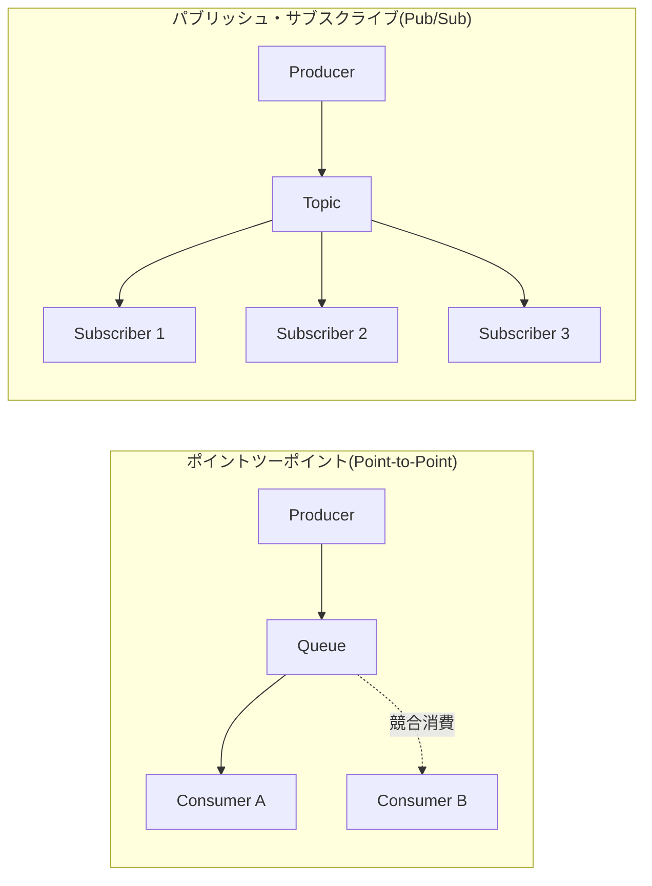
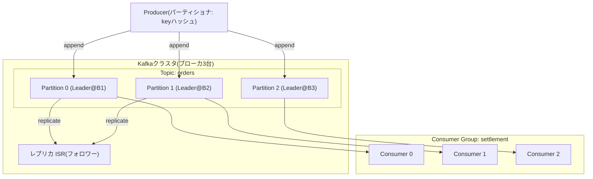

# メッセージキュー（Message Queue）とApache Kafka

## 1. 概要

> **定義**: メッセージキュー（Message Queue）とは、送信者（Producer）と受信者（Consumer）の間に**メッセージを一時保存する中間バッファ**を置き、双方が互いの存在や処理速度を知らないまま**非同期・疎結合（loose coupling）**で通信できるようにするメッセージ指向ミドルウェア（MOM, Message-Oriented Middleware）である。Apache Kafkaは、この概念を**分散コミットログ（distributed commit log）**ベースで再解釈し、大量のイベントを永続的に保存しながら、多数のコンシューマが再生（replay）・再処理できるようにした**分散イベントストリーミングプラットフォーム**である。

現代のシステムでは、受注・決済・通知・精算・レコメンドのように、異なる速度で動作する多数のサービスが協調している。もしこれらが直接の同期呼び出し（synchronous call）だけでつながっていれば、一つの下位サービスが遅くなったり障害を起こしたりした瞬間に、その遅延と失敗が呼び出しの連鎖全体に伝播する。例えば、受注サービスが決済・在庫・通知を順次同期呼び出しすると、通知サービスの応答が3秒遅延したとき、ユーザーは注文完了画面を3秒遅れて見ることになる。このように**時間的結合（temporal coupling）**と**障害の伝播**は、マイクロサービスが大きくなるほど深刻なボトルネックとなる。

メッセージキューは、この問題を**「中間に緩衝バッファを置いて時間軸を分離する」**ことで解決する。プロデューサはメッセージをキューに入れるとすぐに自分の仕事を終え（fire-and-forget）、コンシューマは自分が処理可能な速度でメッセージを取り出して処理する。その結果、①生産・消費の速度差をキューが吸収して**バーストトラフィックを平準化（load leveling）**し、②コンシューマが一時的に停止してもメッセージがキューに残るため**失われることなく後で処理**され、③プロデューサとコンシューマが互いを直接参照しないため、**一方を交換・拡張しても他方に影響がない**。この三点が、メッセージキュー導入の本質的な効用である。

メッセージキューの特徴は次のように整理される。第一に、**非同期（asynchronous）**通信によって、プロデューサは消費の完了を待たないため応答性が向上する。第二に、**バッファリング（buffering）**によって瞬間的なトラフィックの急増を吸収し、下位システムを保護する。第三に、**疎結合**によってプロデューサ・コンシューマが互いを直接参照しないため、独立したデプロイ・拡張が可能となる。第四に、**永続性（durability）**によって、コンシューマの障害時にもメッセージを保持し、最終的な処理を保証する。これら四つの特徴が組み合わさることで、システムの回復力（resilience）と拡張性（scalability）が同時に高まる。

ただし、非同期化には代償が伴う。処理順序の保証、重複のない厳密に一回（exactly-once）の処理、メッセージ消失の防止、そして「いつ処理が終わったのか分からない」という結果整合性（eventual consistency）の可観測性の問題が新たに生じる。したがってメッセージキューは「投げれば終わり」ではなく、**配信保証レベル（delivery semantics）と順序・重複のポリシーを明示的に設計**しなければならない技術であり、技術士の観点からは、このトレードオフをどのように調整するかが中核的な論点となる。

## 2. メッセージキューの通信モデルと構成要素

メッセージキューの通信は、大きく**ポイントツーポイント（Point-to-Point）**と**パブリッシュ・サブスクライブ（Publish-Subscribe）**の二つのモデルに分かれる。ポイントツーポイントモデルでは、一つのメッセージを複数のコンシューマが競合的に取りに行くが、**厳密に一つのコンシューマだけ**が消費する（作業分配・負荷分散に適する）。パブリッシュ・サブスクライブモデルでは、一つのメッセージが**購読しているすべてのコンシューマに複製**されて配信される（イベントのブロードキャストに適する）。以下の構造図は、二つのモデルとブローカの位置を併せて示している。

**A. プロデューサ（Producer）とコンシューマ（Consumer）** — プロデューサは、ビジネスイベントをメッセージとしてシリアライズ（serialize）してブローカへ送信する主体であり、コンシューマは、ブローカからメッセージを受信して実際の処理を行う主体である。両者の間の中核的な設計判断は、**プッシュ（push）とプル（pull）**方式の選択である。従来型のキュー（ActiveMQなど）は、ブローカがコンシューマにメッセージを押し込むプッシュ方式を用いるが、コンシューマが処理しきれない速度で押し寄せるとコンシューマが崩壊する。Kafkaは逆に、コンシューマが自身の処理速度に合わせてブローカから引き出す**プル方式**を採用し、コンシューマが自らバックプレッシャー（backpressure）を調整できるように設計した。この違いが、大容量処理の安定性において決定的な優位性を生む。

**B. ブローカ（Broker）とキュー/トピック** — ブローカは、メッセージを受信・保存・配信するサーバーであり、メッセージキューの心臓部である。ブローカはメッセージをメモリまたはディスクに保管し、コンシューマが確認（acknowledge）するまでメッセージを保持して消失を防ぐ。ここには重要な哲学的違いがある。RabbitMQのような**従来型ブローカは「消費されたらキューから削除」**するのに対し、Kafkaは消費の有無にかかわらず、設定された保持期間（retention）の間メッセージを**ディスクに残し続け**、複数のコンシューマがそれぞれの位置から繰り返し読めるようにする。すなわち、従来型キューが「郵便受け」だとすれば、Kafkaは「巻き戻して読み直せる録画テープ」に近い。保持ポリシーも二つに分かれ、時間・容量を基準に古いメッセージを削除する**時間ベースの保持**と、同じキーの最新値だけを残して以前の値を整理する**ログコンパクション（log compaction）**がある。ログコンパクションは「キーごとの最終状態」を永続保管すべき場合（例：ユーザープロファイルの現在値）に有用であり、Kafkaをイベントソーシング・状態ストアとして活用する際の中核機能となる。

**C. メッセージと確認応答（Acknowledgement）** — メッセージはヘッダ（メタデータ）とペイロード（本文）で構成され、順序・重複制御のためのキー（key）やシーケンス番号を含むことができる。コンシューマがメッセージの処理に成功した後にブローカへ送る確認応答（ack）は、配信保証の中核的な仕組みである。ackを**処理前に**送ると、処理中の障害時にメッセージが失われ（at-most-once）、ackを**処理完了後に**送ると、ackが失われた場合の再送によって重複が生じる（at-least-once）。この微妙なタイミングが、後述する配信セマンティクスの根源である。

確認応答と対をなす概念が、**再送とデッドレターキュー（DLQ, Dead Letter Queue）**である。コンシューマが特定のメッセージの処理に繰り返し失敗すると、ブローカはそれを無限に再送しようとするが、このとき破損したメッセージ一つがキュー全体の処理を妨げる**ポイズンメッセージ（poison message）**現象が生じ得る。これを防ぐため、一定回数以上失敗したメッセージを別のDLQに隔離して正常な処理フローを保護し、運用者が後で原因を分析・再処理できるようにする。すなわち、確認応答が「成功のシグナル」だとすれば、DLQは「失敗のセーフティネット」であり、両者を併せて設計してこそ、メッセージパイプラインが堅牢になる。

従来型メッセージキュー製品を比較すると以下のとおりである。表は選択の出発点にすぎず、各製品がそうした特性を持つ理由は、上記の段落で述べた保存・配信の哲学の違いに由来する。

| 区分 | RabbitMQ | ActiveMQ | Amazon SQS | Apache Kafka |
|---|---|---|---|---|
| モデル | ポイントツーポイント・Pub/Sub | ポイントツーポイント・Pub/Sub | ポイントツーポイント(マネージド) | 分散ログ(Pub/Sub) |
| 消費後 | 削除(ack時) | 削除 | 削除(可視性タイムアウト) | 保持(再生可能) |
| 配信方式 | プッシュ | プッシュ | プル(ポーリング) | プル |
| 強み | 柔軟なルーティング | 標準(JMS) | 運用負担ゼロ | 超大容量・再処理 |
| スループット | 中 | 中 | 中 | 超大容量 |

## 3. Apache Kafkaのアーキテクチャと処理手順

Kafkaは、メッセージを**トピック（Topic）**という論理チャネルにまとめ、各トピックをさらに複数の**パーティション（Partition）**に分割する。パーティションは追記のみが行われ修正されない**シーケンシャルなコミットログ**であり、各メッセージはパーティション内で単調増加する**オフセット（offset）**で識別される。このパーティショニングが、Kafkaの並列性と拡張性の源泉である。以下は、ブローカクラスタ・パーティション・コンシューマグループの関係を示した詳細アーキテクチャである。

**A. パーティションと順序保証** — Kafkaは、**パーティション単位でのみ順序を保証**する。同じパーティションに入ったメッセージはオフセット順に消費されるが、異なるパーティション間ではグローバルな順序は保証されない。これは、性能と順序の根本的なトレードオフから生まれた設計である。もしトピック全体に対してグローバルな順序を強制すれば、パーティションを一つだけにしなければならず、そうなると並列性が失われてスループットが急減する。したがって実務では、**順序が重要な単位（例：同一口座・同一注文番号）をメッセージキーに指定**して、同じパーティションへルーティングする。例えば口座番号をキーにすれば、特定口座の入出金イベントは常に同じパーティションに順序どおり積み上がり、残高計算の整合性を守ることができる。

**B. コンシューマグループ（Consumer Group）と拡張** — 複数のコンシューマを一つのグループにまとめると、Kafkaはパーティションをグループ内のコンシューマに**排他的に割り当てる（assignment）**。一つのパーティションはグループ内で厳密に一つのコンシューマだけが担当するため、パーティション数がそのままグループの最大並列消費の上限となる。コンシューマを増やすとパーティションが再分配（rebalancing）されて水平拡張され、コンシューマが停止すると、それが担当していたパーティションが他のコンシューマに再割り当てされて高可用性が確保される。ただし、リバランス中は一時的に消費が止まるため、パーティション・コンシューマ数を過度に変更すると、頻繁なリバランスによってかえって遅延が増える可能性がある。実務では多くの場合、**パーティション数を予想される最大並列度より余裕をもって（例：将来の2〜3倍）あらかじめ確保**しておき、頻繁な再調整を避ける。

**C. レプリケーション（Replication）と永続性** — 各パーティションは複数のブローカに複製され、一つのリーダー（leader）と複数のフォロワー（follower）で構成される。プロデューサはリーダーにのみ書き込み、フォロワーがそれを複製する。リーダーと同期しているレプリカの集合を**ISR（In-Sync Replica）**と呼ぶ。プロデューサの`acks`設定が永続性のレベルを決定する。`acks=0`は送信後に応答を待たないため最も速いが消失リスクが大きく、`acks=1`はリーダーへの書き込みのみを確認し、`acks=all`はすべてのISRが書き込みを終えて初めて成功とみなすため、ブローカ障害時にも消失がない。金融業界のように消失が許されないドメインでは、`acks=all`と`min.insync.replicas=2`以上を併せて設定し、リーダーが停止しても最低1つの同期レプリカがデータを保持するようにする。

パーティション数の決定が、後戻りしにくい初期の設計判断であることにも留意すべきである。Kafkaではパーティションは増やせても減らすことはできず、キーベースのルーティングを使う場合は、パーティション数を変えるとキー→パーティションのマッピングが変わり、既存の順序保証が崩れる可能性がある。したがって、目標スループット（毎秒のメッセージ数 ÷ コンシューマ1台の処理速度）を基準に必要な並列度を算定し、そこに成長の余裕を加えてパーティション数を慎重に決定しなければならない。例えば、毎秒20万件を処理するのにコンシューマ1台が毎秒2万件を処理するのであれば、最低10個のパーティションが必要であり、将来の成長を考慮して20〜30個とする、といった具合である。

**D. 配信セマンティクス（Delivery Semantics）** — メッセージの配信保証は三つのレベルに分かれる。**At-most-once（最大一回）**は、重複はないが消失の可能性があり、ログ・メトリクスのように一部の損失が許容される場合に使う。**At-least-once（最低一回）**は、消失はないが重複が生じ得るため、消費側が**冪等（idempotent）処理**で重複を吸収しなければならない。**Exactly-once（厳密に一回）**は、消失も重複もない理想的なレベルであり、Kafkaはプロデューサの冪等性（idempotent producer）とトランザクション（transactional API）を組み合わせてこれをサポートする。ただし、exactly-onceはトランザクション調整のコストのためにスループットが低下するため、決済・精算のように整合性が絶対的な区間にのみ選択的に適用し、それ以外は「at-least-once＋冪等コンシューマ」の組み合わせで設計するのが実務の定石である。三つのセマンティクスの特性と適用指針を整理すると以下のとおりである。

| 配信セマンティクス | 消失 | 重複 | スループット | コンシューマへの要求 | 適用例 |
|---|---|---|---|---|---|
| At-most-once | あり得る | なし | 最高 | なし | ログ・メトリクス収集 |
| At-least-once | なし | あり得る | 高い | 冪等処理が必須 | 一般的なイベント・通知 |
| Exactly-once | なし | なし | 低い | トランザクション連携 | 決済・精算 |

ここで、**冪等コンシューマ（idempotent consumer）**の設計は、実務で最も頻繁に求められる手法である。同じメッセージが二度届いても結果が一度処理したものと同一になるよう、メッセージの固有キー（例：注文ID＋イベントタイプ）を処理履歴テーブルに記録し、すでに処理済みのキーであればスキップする方式が代表的である。こうすれば、at-least-onceの重複を消費側で吸収でき、高コストなexactly-onceなしでも実質的な正確性を確保できる。この「ブローカはat-least-once、アプリケーションは冪等」という役割分担が、大容量システムにおいて性能と整合性を同時に実現する現実的な解決策である。

## 4. 比較と適用事例

**A. Kafka vs 従来型メッセージキュー — なぜ異なるのか** — RabbitMQに代表される従来型ブローカとKafkaの違いは、単純な性能の優劣ではなく、**設計目的の違い**から生じる。RabbitMQは、複雑なルーティング（exchange、binding、routing key）と即時の消費・削除に最適化された**「タスクキュー（task queue）」**であり、消費後に消えるコマンド・タスクの配信に強い。一方Kafkaは、イベントをログとして**永続保存**し、複数のコンシューマがそれぞれの時点から再生する**「イベントストア（event log）」**であり、大容量ストリーム処理と再処理に強い。したがって、「注文処理コマンドを一つのワーカーが受け取って実行する」ようなシナリオにはRabbitMQが、「すべての注文イベントを精算・レコメンド・監査システムがそれぞれ消費する」ようなシナリオにはKafkaが自然である。一方が他方を完全に置き換えることはなく、二つのミドルウェアを役割に応じて併用するアーキテクチャも一般的である。選択基準を要件別に整理すると以下のとおりである。

| 要件 | 推奨 | 理由 |
|---|---|---|
| イベントの再処理・再生が必要 | Kafka | ログを保持し、任意の時点から再消費が可能 |
| 毎秒数十万件以上の大容量 | Kafka | パーティション並列性・シーケンシャルなディスク書き込みで高スループット |
| 複雑なルーティング・優先度キュー | RabbitMQ | exchange・bindingベースの柔軟なルーティング |
| 運用負担の最小化(マネージド) | SQS/クラウド | サーバーレスのマネージド型で運用ゼロ |
| メッセージごとの個別確認・短いタスク | RabbitMQ | 消費・削除モデルがタスクキューに適する |

この表が示すように、選択は「性能の優劣」ではなく、**再処理の必要性・スループット・ルーティングの複雑さ・運用上の余力**という要件の組み合わせによって決まる。核心は、イベントを「一度使って捨てるコマンド」とみなすか、「複数のコンシューマが再利用する事実の記録」とみなすかという観点の違いであり、この観点がミドルウェアの選択とアーキテクチャ全体の性格を左右する。

**B. イベント駆動アーキテクチャ（EDA）・CDCとの結合** — Kafkaは、マイクロサービスのイベントバックボーン（backbone）の役割を果たす。サービスが状態変更をイベントとして発行し、他のサービスがそれを購読して反応するEDAにおいて、Kafkaはイベントの信頼性ある配信と保持を担う。特に**CDC（Change Data Capture）**と組み合わせると強力である。Debeziumのようなコネクタがデータベースのトランザクションログ（WAL/binlog）を読み取り、変更分をKafkaトピックへ流せば、元のDBに負荷をかけることなく、データウェアハウス・検索エンジン・キャッシュをリアルタイムに同期できる。このパターンは、モノリシックなDBからマイクロサービスへ段階的に移行する際にデータ整合性を維持する**ストラングラー（strangler）移行**の中核ツールとして使われる。

**C. 具体的な産業適用事例** — Kafkaは、もともとLinkedInが一日あたり数兆件のアクティビティログを処理するために開発し、2011年にオープンソース化したものであり、その後事実上のストリーミング標準となった。実務の数値で見ると、大手ECは受注・クリック・在庫のイベントを毎秒数十万〜数百万件規模でKafkaに収集し、リアルタイムのレコメンドや異常検知に活用している。韓国国内でも、大手ポータル・金融機関が、ログ収集（ELKパイプラインの前段バッファ）、リアルタイム精算、MSAのイベントバスとしてKafkaを広く採用している。例えば決済システムは、決済承認イベントを`acks=all`・トランザクションで発行し、精算・通知・不正検知サービスが同一のトピックをそれぞれ消費することで、一つのイベントを複数の目的に再利用しつつ、サービス間の結合を排除する。

もう一つの代表的な事例は、**ログ・モニタリングパイプラインの緩衝バッファ**である。数千台のサーバーが吐き出すログをElasticsearchに直接投入すると、瞬間的な急増時にインデックスサーバーが過負荷で崩壊するが、その前段にKafkaを置けば、ログをいったんトピックに安全に格納し、Logstash・インデクサが処理可能な速度で引き出すことで負荷を平準化できる。この構造においてKafkaは、データの消失を防ぐ安全バッファであると同時に、インデックス化・検索・異常検知など多数のコンシューマが同じログストリームをそれぞれ異なる目的で再利用する共有パイプラインの役割を担う。

**D. バックプレッシャーとコンシューマラグの管理** — 大容量パイプラインにおいて、生産速度が消費速度を継続的に上回ると、未処理のメッセージが溜まり続ける。この未処理の累積量を**コンシューマラグ（consumer lag）**といい、最新オフセットとコンシューマが確認したオフセットの差として測定される。ラグが大きくなるということはリアルタイム性が崩れつつあるシグナルであるため、Kafka運用における最優先の観測指標である。対応方法は、コンシューマ（パーティション）の数を増やして並列度を高めるか、消費ロジックをバッチ化・非同期化してスループットを引き上げることである。例えば、韓国のあるEC事業者は、セールイベント中に受注イベントのラグが急増した際、コンシューマをオートスケーリングで拡張し、数分以内にラグを解消した。このようにKafkaでは、プル方式によってコンシューマが自ら速度を調整する（backpressure）ため、ブローカが崩壊せずバッファが負荷を吸収するが、ラグそのものを放置すると結果整合性の遅延がユーザー体験を損なうため、継続的なモニタリングが必須である。

## 5. 深掘り — 最新動向と予想される出題方向

Kafkaのエコシステムは、近年、運用の複雑さを下げる方向へと急速に進化している。最大の変化は、長らくクラスタのメタデータ・リーダー選出を担ってきた**ZooKeeperへの依存を排除**し、Kafka自体の合意プロトコルである**KRaft（Kafka Raft）**へ統合したことである。KRaftは、別途ZooKeeperクラスタを運用・チューニングしなければならない負担をなくし、メタデータを内部ログで管理することで、大規模なパーティション環境におけるコントローラ障害の復旧時間を大きく短縮した。技術士の答案で「Kafkaの運用複雑性の改善」が問われれば、ZooKeeper→KRaftへの移行が中核的な論拠となる。

もう一つの潮流は、**Tiered Storage（階層型ストレージ）**である。ブローカのローカルディスクには直近のデータだけを置き、古いログはオブジェクトストレージ（S3など）へ移すことで、保存コストを下げつつ、長期保持と再処理を可能にする。これは「ストレージとコンピュートの分離」というクラウドネイティブの原則をストリーミングに適用した事例であり、データレイクハウス・データメッシュのアーキテクチャと自然にかみ合う。さらに、**Kafka Streams・ksqlDB**のようなストリーム処理層が成熟するにつれ、単純なメッセージ配信を超えて、リアルタイムの結合・集計・ウィンドウ演算をKafka上で直接実行する事例も増えている。

競合・代替技術の登場も注目に値する。**Apache Pulsar**は、ストレージとサービングを分離した階層型の構造によって、マルチテナンシーと地理的レプリケーションに強みを打ち出しており、クラウド事業者はフルマネージドのストリーミング（Amazon MSK/Kinesis、Confluent Cloud、GCP Pub/Sub）を提供して、ブローカ運用の負担そのものをなくす方向で競争している。これは、「Kafkaを自ら運用するのか、マネージド型に委ねるのか」という新たな意思決定の軸を生み出している。同時に、ストリーミングの事実上の標準インターフェースとしてKafkaプロトコルとの互換性が求められるようになり、多数の新製品がKafka API互換を標榜していることも、エコシステムのロックイン（lock-in）と標準化の間の緊張を示す点である。

加えて、ストリーミングがバッチ（batch）処理のかなりの部分を置き換えるにつれ、データパイプラインの重心は「夜間に一度実行されるETL」から「途切れなく流れるリアルタイムストリーム」へと移りつつある。この流れの中でKafkaは、データレイク・ウェアハウスへデータを運ぶ収集層であると同時に、リアルタイム分析・MLの特徴量供給の共通バックボーンとして位置付けられており、これはデータメッシュが強調する「データをプロダクトとして扱う」分散所有モデルともよくかみ合う。

予想される出題方向としては、①配信セマンティクス（at-least/exactly-once）と冪等コンシューマの設計、②パーティション・キー・順序保証のトレードオフ、③Kafka vs RabbitMQの選択基準、④CDC・EDA・MSAとの連携、⑤大容量ログパイプラインにおけるバックプレッシャー・再処理戦略がよく扱われる。答案の構成にあたっては、「なぜ非同期・疎結合が必要なのか」という背景から出発し、具体的なセマンティクスと数値・事例で深みを加えたうえで、トレードオフと最新動向（KRaft・Tiered Storage）で締めくくる流れが説得力を持つ。

## 6. 考慮事項および示唆

メッセージキュー・Kafkaの導入は、技術士の観点から次のような戦略的判断を必要とする。

- **適用戦略（ツールの目的適合性）**: 「コマンド配信・作業分配」なのか「イベントストリーム・再処理」なのかによって、RabbitMQ・SQSとKafkaを区別して選択しなければならない。すべての通信を無条件にKafkaへ統一すると、単純なタスクキューには過度な運用負担となり、逆に大容量のイベントバックボーンに従来型キューを使うと、拡張・再処理で限界に突き当たる。目的とツールの整合が第一の考慮事項である。
- **整合性のトレードオフ（セマンティクスとコストのバランス）**: exactly-onceは魅力的であるが、トランザクション調整によってスループットとレイテンシを犠牲にする。したがって、ドメインごとに整合性のグレードを分け、金融・決済区間にのみexactly-onceを適用し、ログ・メトリクスはat-most-once、一般的なイベントは「at-least-once＋冪等コンシューマ」と差別化して設計するのが費用対効果に優れる。
- **運用・可観測性（非同期の影の管理）**: 非同期化は、「いつ処理が終わったのか把握しにくい」という結果整合性の問題を生む。コンシューマラグ（consumer lag）のモニタリング、デッドレターキュー（DLQ）による失敗メッセージの隔離、分散トレーシング（OpenTelemetry）との連携によってメッセージフローの可観測性を確保しなければ、障害原因の追跡が極めて困難になる。
- **データガバナンス・スキーマ進化**: 複数のサービスが同じトピックを消費するため、プロデューサがメッセージ構造を安易に変更すると、下流のコンシューマが一斉に壊れる。Schema Registryと互換性ルール（backward/forward compatibility）、データコントラクト（Data Contract）によってスキーマの進化を統制してこそ、長期的に安全である。
- **展望と連携技術**: KRaft・Tiered Storageによって運用の複雑さとコストが下がり、Kafka Streams・Flinkなどのストリーム処理と結合し、CDC・データメッシュ・イベントソーシングとともにリアルタイムデータアーキテクチャの中枢として定着すると見込まれる。メッセージキューは単一の技術ではなく、EDA・MSA・データパイプラインを貫く**接続基盤（fabric）**として理解しなければならない。

## 参考資料
- Apache Kafka 公式ドキュメント, https://kafka.apache.org/documentation/
- Apache Software Foundation, "KRaft: Apache Kafka Without ZooKeeper", https://developer.confluent.io/learn/kraft/
- AWS, "メッセージキューとは何か", https://aws.amazon.com/message-queue/
- RabbitMQ 公式ドキュメント, https://www.rabbitmq.com/documentation.html

---

> **一言まとめ**: メッセージキューは、プロデューサとコンシューマを緩衝バッファで分離して非同期・疎結合を実現するミドルウェアであり、Apache Kafkaは、それを分散コミットログとして再解釈し、大量イベントの永続保存・再処理・水平拡張を可能にしたストリーミングプラットフォームであって、配信セマンティクス・パーティションの順序・レプリケーション・整合性のトレードオフを明示的に設計することが成功の鍵である。
