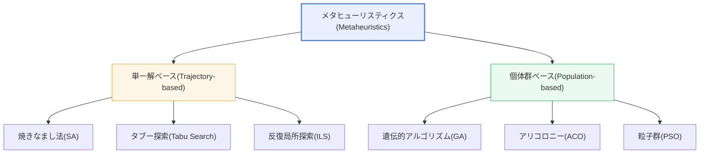
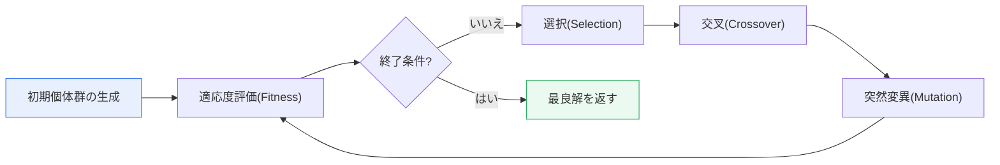

# メタヒューリスティクス（Metaheuristics）

## 1. 概要

### A. 定義
> **メタヒューリスティクス（Metaheuristics）**とは、複雑な最適化問題において**最適解に近い優れた解を現実的な時間内に見つけ出す、上位レベル（meta）の経験的（heuristic）探索戦略**であり、特定の問題構造に縛られることなく解空間を知的に探索する汎用（problem-independent）最適化フレームワークである。

メタヒューリスティクスが必要とされる根本的な理由は、「**現実の最適化問題は全探索（exhaustive search）が不可能なほど大きい**」という点にある。代表的な例が巡回セールスマン問題（TSP, Traveling Salesman Problem）である。都市が*n*個のとき、可能な経路の数は(*n*−1)!/2であり、都市が30個になるだけで経路数は約4.4×10³¹個に達する。毎秒10億個の経路を検査するコンピュータでも、これをすべて調べるには宇宙の年齢よりも長い時間がかかる。このように場合の数が組合せ的に爆発する**NP困難（NP-hard）**問題には、多項式時間内に大域的最適解（global optimum）を保証するアルゴリズムが知られていない。かといって最適化を諦めるわけにはいかないため、「完璧ではなくても十分に良い解（good-enough solution）を十分に速く」見つける実用的なアプローチが求められる。メタヒューリスティクスこそがその答えである。

メタヒューリスティクスの発想は、**自然や物理現象を模倣する**ことから出発する。生物の進化、金属の焼きなまし、アリの群れの餌探し、鳥の群れの集団移動のように、「自然が長い時間をかけて良い解を見つけてきた方法」を計算手順へと移し替えたものである。これらは単純な貪欲（greedy）規則とは異なり、時にはその場では悪く見える解も確率的に受け入れながら広い領域を調べ、良い解の周辺は集中的に掘り下げる。こうした**メタ（上位）レベルの制御ロジック**が問題固有のヒューリスティクスを指揮するという点から、「メタ」ヒューリスティクスと呼ばれる。

中核原理は、**探索（Exploration）と活用（Exploitation）のバランス**である。探索とは、まだ訪れていない新しい領域を広く探して多様性を確保する活動であり、活用とは、これまでに見つけた良い解の周辺を集中的に改善して収束を図る活動である。探索が過ぎればランダム探索に近づいて収束が遅くなり、活用が過ぎれば**局所最適（local optimum）**に早期に閉じ込められて大域最適を逃す。優れたメタヒューリスティクスは、初期には探索中心で解空間を広く走査し、後半になるほど活用中心へと絞り込んでいく適応的なスケジュールによって、この二つの力の緊張を精緻に調整する。

### B. 登場背景と必要性
従来の最適化は、線形計画法（LP）・整数計画法（IP）のように、**問題の数学的構造（微分可能性・凸性など）を前提として厳密解（exact solution）を求める方式**が主流であった。しかし、物流経路、生産スケジュール、ニューラルネットワークの構造設計のように、現実の問題の相当数は、目的関数が不連続・非線形あるいは微分不可能であり、制約が複雑で、探索空間が天文学的である。こうした問題には、厳密解法をそのまま適用することが難しい。メタヒューリスティクスは、目的関数を「ブラックボックス」として評価する（解を入れるとスコアが出てくる）だけでも動作するため、問題構造に関する仮定がほとんど不要である。まさにこの**汎用性と柔軟性**が、1980〜1990年代以降に焼きなまし法・遺伝的アルゴリズム・タブー探索などが広く普及した背景である。

## 2. 全体分類と構造

メタヒューリスティクスは、探索過程で**保持する解の個数**を基準に、大きく二つの系統に分かれる。一つの解を段階的に改善する**単一解ベース（trajectory-based）**と、複数の解の集合を同時に進化させる**個体群ベース（population-based）**である。前者は、一つの点が解空間を移動する軌跡を描きながら局所探索（local search）を精緻化することに強く、後者は、複数の解が並列に空間を走査して互いに情報を交換するため、大域探索と多様性の確保に有利である。



単一解ベースは実装が単純でメモリ負担が小さいが、一つの軌跡に依存するため、別途の仕組み（焼きなまし法の確率的受理、タブー探索の禁止リスト）で探索能力を補強しなければ局所最適から抜け出せない。個体群ベースは、複数の候補が異なる領域を同時に探索し、優れた解の情報を集団に広めるため、広い探索が自然に行われるが、解ごとに目的関数を評価しなければならず、**評価コストが大きく、パラメータ（個体数・交叉率など）のチューニング負担**も大きい。実務では、問題の性質と目的関数の評価コストを見て、どちらか一方を選ぶか、両者を組み合わせる。

| 系統 | 代表的手法 | 長所 | 限界 |
|---|---|---|---|
| **単一解ベース** | 焼きなまし法(SA)、タブー探索、ILS | 単純・軽量、局所探索が精緻 | 大域探索が弱く、別途の脱出の仕組みが必要 |
| **個体群ベース** | 遺伝的(GA)、アリ(ACO)、粒子群(PSO) | 並列探索・多様性、大域探索に有利 | 評価コスト・パラメータチューニングの負担 |

## 3. 主要手法の詳細

### A. 遺伝的アルゴリズム（GA, Genetic Algorithm）
遺伝的アルゴリズムは、**生物の進化**を模倣する。解一つを染色体（chromosome）としてエンコードし、複数の解からなる個体群を用意したうえで、適応度（fitness）の高い個体を**選択（selection）**し、二つの親の遺伝子を混ぜ合わせる**交叉（crossover）**と、一部の遺伝子をランダムに変える**突然変異（mutation）**によって次の世代を作る。世代を重ねるごとに適応度の高い解が生き残り、集団全体の品質が段階的に向上する。

ここで交叉は主に**活用**の役割を、突然変異は**探索**の役割を果たす。突然変異率が低すぎると集団が一点へ早期収束（premature convergence）して局所最適に閉じ込められ、高すぎるとランダム探索のようになって収束しない。そのため突然変異率は、通常0.1〜1%程度の小さな値から始め、状況に応じて調整する。GAは解を自由にエンコードできるため、組合せ最適化（スケジュール・配置・経路）で特に幅広く使われている。



実際の適用例として、NASAは衛星アンテナの設計において、遺伝的アルゴリズムを用いて、人が直感的には思いつきにくい非対称形状の高性能アンテナを見つけ出したことがある。このように、設計空間が広く直感が通用しない問題において、GAは人間の設計者が見落としていた解を発掘するという強みを示す。

### B. 焼きなまし法（SA, Simulated Annealing）
焼きなまし法は、**金属を高温からゆっくり冷やして結晶構造を安定化させる**物理過程にちなんで名付けられた。現在の解から近傍の解へ移動する際、より良い解は常に受け入れ、より悪い解も**確率的に受理**する。この受理確率は、温度（T）が高いほど、また悪化の度合いが小さいほど大きくなり（ボルツマン分布に基づく）、反復が進むにつれて温度を下げる（cooling schedule）ことで、次第に悪い解を受け入れにくくする。

この「悪い解もときどき受け入れる」仕組みが、焼きなまし法の核心である。序盤の高温では局所最適の谷を越えながら広く探索し、終盤の低温では良い領域に集中して活用しながら収束する。温度を速く下げすぎると探索が不足して局所最適に閉じ込められ、遅く下げすぎると収束が遅くなり計算が長引く。冷却スケジュール（初期温度・減少率）が性能を左右する理由はここにある。VLSI半導体の配置・配線の最適化は、焼きなまし法の古典的な成功事例である。以下の擬似コードは、この確率的受理と冷却の流れを要約したものである。

```text
T ← T_初期             # 高い温度から開始
s ← 初期解を生成
繰り返し:
    s' ← sの近傍解を生成
    Δ ← cost(s') - cost(s)
    if Δ < 0:          # より良い解なら常に受理
        s ← s'
    else if rand() < exp(-Δ / T):   # 悪い解も確率的に受理
        s ← s'
    T ← T × α          # 冷却(0<α<1)、温度を徐々に低下
until 終了条件(Tが十分に低い)
return s
```

### C. アリコロニー（ACO）・粒子群（PSO）・タブー探索（Tabu Search）
アリコロニー最適化（ACO）は、アリが餌を運ぶ際に経路に**フェロモン**を残し、短い経路ほどフェロモンが早く蓄積して他のアリを誘引するという集団知能を模倣する。複数のアリ（解）が残したフェロモンが良い経路に蓄積されていき、集団は次第に優れた解へと収束する。経路・ネットワークルーティングの問題に適している。

粒子群最適化（PSO）は、鳥の群れ・魚の群れの集団移動を模倣する。各粒子（解）は、自身が見つけた最良位置（pbest）と群れ全体の最良位置（gbest）を併せて参照しながら速度を更新して移動する。連続空間の最適化において、実装が簡単で収束が速いため広く使われている。タブー探索は、**最近訪れた解を禁止リスト（tabu list）に載せて再訪問を防ぐ**ことで、同じ場所をぐるぐる回る循環を防止し、局所最適から抜け出すよう強制する。このように各手法は、「局所最適からどのように脱出するか」という同じ問いに対し、それぞれ異なる仕組みで答えている。

## 4. 比較と選択基準

手法の選択は、「どのアルゴリズムが絶対的に優れているか」ではなく、**問題の構造にどの手法の探索方式が合っているか**で判断しなければならない。これは、「すべての問題に最適な単一のアルゴリズムは存在しない」という**ノーフリーランチ定理（No Free Lunch Theorem）**の実践的な含意でもある。連続変数の最適化（関数最小化・パラメータチューニング）にはPSO・焼きなまし法が、順序・配置が重要な組合せ最適化（TSP・スケジューリング）にはGA・ACO・タブー探索が有利な傾向がある。

| 手法 | 着想・原理 | 探索/活用の仕組み | 適合する問題 |
|---|---|---|---|
| **遺伝的(GA)** | 進化(選択・交叉・突然変異) | 突然変異(探索)+交叉(活用) | 組合せ・設計最適化 |
| **焼きなまし法(SA)** | 金属の焼きなまし・確率的受理 | 温度に応じた確率的受理 | 連続・配置(VLSI) |
| **アリ(ACO)** | フェロモンによる経路探索 | フェロモンの蒸発・蓄積 | 経路・ルーティング |
| **粒子群(PSO)** | 鳥の群れの集団移動 | pbest/gbestの重み付け | 連続関数の最適化 |
| **タブー(Tabu)** | 最近の解の禁止 | 禁止リストで循環を防止 | 組合せ最適化 |

比較において重要なのは、「なぜ違いが生じるのか」である。例えば、PSOが連続空間で強い理由は、粒子の位置・速度が実数ベクトルで表現されるため、gradientなしでも滑らかな移動が可能だからであり、ACOが経路問題で強い理由は、フェロモンという蓄積情報が「良い部分経路」を自然に記憶・再利用するからである。実務では単一の手法に依存するよりも、例えばGAで広く探索した後に焼きなまし法・タブー探索で局所的に精緻化するといった**ハイブリッド**によって、各手法の強みを組み合わせる。

## 5. 深掘り — 最新動向と実務適用

今日、メタヒューリスティクスは**AI/MLパイプラインの中核的な構成要素**として再浮上している。代表的なものが、**ハイパーパラメータ最適化（HPO）**と**ニューラルアーキテクチャ探索（NAS, Neural Architecture Search）**である。学習率・層数・バッチサイズのようなハイパーパラメータや、ニューラルネットワークのアーキテクチャそのものは、微分不可能な離散・混合の探索空間を形成するため、進化的アルゴリズム・PSOのようなメタヒューリスティクスが自然なツールとなる。GoogleのAmoebaNetなどは、進化ベースの探索によって、人が設計したモデルに匹敵するか、それを上回る構造を見つけ出した事例として知られている。

また、**ハイブリッド・ミーム（Memetic）アルゴリズム**と**多目的最適化（Multi-objective）**が主流の研究方向である。ミームアルゴリズムは、個体群ベースの大域探索（GA）に局所探索（焼きなまし法など）を組み合わせて収束の品質を高め、NSGA-IIのような多目的進化アルゴリズムは、コスト・性能・電力のように相反する複数の目標を同時に考慮し、**パレート最適解集合（Pareto front）**を提示する。実務では、物流企業の配送計画問題（VRP）、半導体工程の生産スケジュール、通信網の設計、金融ポートフォリオの最適化など、制約が複雑で目標が複数ある問題にこうした手法が適用されている。ただし、メタヒューリスティクスは近似解しか提供しないため、解の品質保証が重要な領域では、厳密解法（数理計画）や限界手法と併用して検証することが望ましい。

## 6. 考慮事項および示唆（技術士の観点）

1. **問題特性に基づく手法・パラメータの選択**: ノーフリーランチ定理が示すとおり、万能な手法は存在しない。連続か離散か、制約構造、目的関数の評価コスト（一回の評価にシミュレーションが必要かどうかなど）をまず分析し、手法とパラメータ（個体数・温度・突然変異率）を選択・チューニングしてこそ性能が出る。パラメータの自己調整（self-adaptive）手法も併せて検討する。
2. **探索と活用のバランスの適応的制御**: 初期は探索、後半は活用へと切り替える動的なスケジュールが成否を分ける。早期収束（premature convergence）の兆候（多様性の急減）を監視し、突然変異率を上げたり再スタート（restart）したりする戦略が有効である。
3. **評価コストと計算資源のトレードオフ**: 個体群ベースは解ごとに目的関数を評価するため、並列化（複数の解を同時に評価）によって高速化できるが、資源を要する。評価コストの大きい問題には、代理モデル（surrogate model）で目的関数を近似して評価回数を減らす戦略を適用する。
4. **近似解の品質保証と厳密解法の併用**: メタヒューリスティクスは最適解を保証しないため、安全・金銭が絡む意思決定においては、下限/上限（bound）の計算や数理計画とのクロス検証によって、解の信頼区間を確保しなければならない。
5. **AI時代における連携活用の展望**: HPO・NAS・強化学習の方策探索など、メタヒューリスティクスと機械学習の結合が拡大しており、逆に、学習済みモデルを代理評価器として用いる学習と最適化の融合（learn-to-optimize）が新たな潮流として浮上している。

## 参考資料
- Wikipedia, "Metaheuristic" — https://en.wikipedia.org/wiki/Metaheuristic
- Wikipedia, "No free lunch theorem" — https://en.wikipedia.org/wiki/No_free_lunch_theorem
- Wikipedia, "Neural architecture search" — https://en.wikipedia.org/wiki/Neural_architecture_search

---

> **一言まとめ**: メタヒューリスティクスは、*全探索が不可能な大規模NP困難最適化において、優れた近似解を実用的な時間で見つける汎用探索戦略*であり、自然・物理現象を模倣して**探索と活用のバランス**によって局所最適から脱出し、今日ではHPO・NASなどAIパイプラインの中核ツールとして再浮上している。
