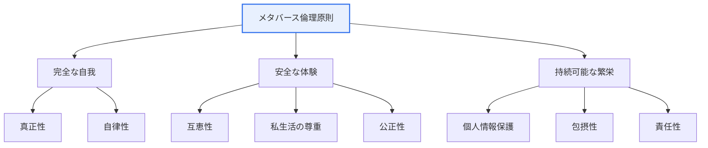

# メタバース倫理原則

## 1. 概要

### A. 定義

> **メタバース倫理原則** は韓国の科学技術情報通信部が発表した指針であり、メタバースの拡散が引き起こし得る **アイデンティティの混乱・プライバシー侵害・依存・仮想犯罪などの倫理的問題に先制的に対応**するための自主規範である。強制的な規制ではなく、利用者・企業・開発者が共に目指すべき価値と実践原則を提示する。

メタバース倫理原則の性格を理解する鍵は、それが「**自主規範（soft law）**」であるという点である。法的強制力を持つ規制ではなく、産業がまだ形成途上にある段階で、関係者が自発的に目指すべき方向を示すソフトな規範である。これは新技術の発展余地を残しつつ、問題が深刻化する前に社会的合意の下絵を描いておこうとするアプローチである。

### B. 登場背景

メタバース倫理がインターネット倫理・AI倫理とは別に必要とされる理由は、メタバースが現実と仮想が融合した**新たな社会的空間**である点にある。人々はアバターというもう一つの自我で相互作用し、ヘッドセットを通じた没入的な体験をし、仮想資産・仮想通貨で経済活動を行う。この過程で、既存のオンライン倫理では十分に捉えきれない新たな問題が生じる。

第一は**アイデンティティの問題**である。アバターの背後に複数の自我を置くことができ、匿名性と没入が結びつくことで、現実の自我と仮想の自我の間に混乱や乖離が生じ得る。第二は**実在感に起因する衝撃**である。仮想空間でのいじめ・暴力・セクシャルハラスメントは、没入のために現実のように体感され、テキストベースのオンライン暴力よりも心理的衝撃が大きくなり得る。実際にソーシャルVRプラットフォームでアバターに対する性的嫌がらせ・いじめの事例が報告され、「仮想空間における身体侵害」という新たな論点が浮上した。第三は**データの問題**である。視線追跡・動作認識・生体反応など没入型デバイスが収集するデータは、既存のインターネットサービスよりはるかに機微であり、個人を深く露わにする。

### C. 必要性

メタバースはまだ形成途上の空間であるため、問題が起きてから規制したのでは手遅れである。発展初期に目指すべき価値と実践原則を提示することで、技術発展と利用者保護のバランスを取ろうとする先制的アプローチが求められた。強制的規制によって新産業を萎縮させるよりも、ステークホルダーが共有すべき規範を先に提示して健全なエコシステムを誘導しようというのが、この原則の趣旨である。これは青少年・児童など脆弱な利用者が急速に流入している現実を考慮した予防的性格も帯びている。

## 2. 全体構造 — 3大志向価値と8大実践原則

まず倫理原則の全体構造を概念図で俯瞰し、続いて実践原則が実際にどのように適用されるかの手順を詳細なフローで説明する。

メタバース倫理原則は3つの志向価値を軸とし、その下に8つの実践原則を置く。**完全な自我** はアバターを通じても真正な自我を実現し、アイデンティティを健全に維持することであり、真正性・自律性の原則がこれを支える。**安全な体験** は利用者が暴力・犯罪・依存の危険なく、信頼できる環境で活動することであり、互恵性・私生活の尊重・公正性がこれに該当する。**持続可能な繁栄** は特定主体の独占ではなく、参加者全員が共に成長するエコシステムを目指すものであり、個人情報保護・包摂性・責任性が支える。

3つの価値は、個人（自我）→相互作用（体験）→共同体（エコシステム）へと視野が拡張する構造として読むことができる。すなわち、個人の健全なアイデンティティから出発し、他者との安全な相互作用を経て、持続可能な社会へと向かう同心円的配置である。

| 3大志向価値 | 意味 | 関連する実践原則（要旨） |
|---|---|---|
| **完全な自我** | 真正な自我の実現・アイデンティティの尊重 | 真正性、自律性 |
| **安全な体験** | 安全で信頼できる利用 | 互恵性、私生活の尊重、公正性 |
| **持続可能な繁栄** | 共に成長する持続可能なエコシステム | 個人情報保護、包摂性、責任性 |

各実践原則は抽象的なスローガンではなく、設計・運用に反映されるべき行動指針として理解する必要がある。8つの原則をもう少し具体的に示すと次のとおりである。

- **真正性**: ディープフェイクのアバターで他人になりすましたり、虚偽のアイデンティティで欺いたりせず、アバターの背後にある自我が歪められないようにする。
- **自律性**: 利用者が自らのデータ・体験・参加の可否を自ら決定・制御できるようにし、強要や操作（ダークパターン）を排除する。
- **互恵性**: 他者を尊重し相互利益となる相互作用を目指し、一方的な搾取やいじめを禁じる。
- **私生活の尊重**: 仮想空間においても個人の私的領域・境界を尊重し、望まない接近・監視を防ぐ。
- **公正性**: 特定の利用者・集団が差別されず、ルールが透明かつ一貫して適用されるようにする。
- **個人情報保護**: 没入型デバイスが収集する機微データを、最小収集・目的制限の原則で保護する。
- **包摂性**: 障害・年齢・所得による利用格差を縮め、誰もが参加できるようにする。
- **責任性**: 問題発生時にプラットフォーム・開発者・利用者がそれぞれの責任を負い、救済・改善を行う。

このように原則を具体的行為へと翻訳することが、倫理原則の実効性の鍵である。原則が宣言にとどまれば実際のサービスの挙動を変えられないため、各原則を「禁止行為」と「要求機能」に具体化し、設計チェックリストへと転換する作業が続かなければならない。

## 3. 実践原則の適用手順とステークホルダー

倫理原則は宣言にとどまらず、サービスの企画・運用の全段階に溶け込まなければならない。以下は、実践原則が実際のサービスに反映される過程をステークホルダーの観点から詳細化したフローである。

**企画段階**では、サービスがどのような利用者を対象とし、どのような相互作用が起こるかを予想して、リスク要素をあらかじめ識別する。例えば青少年が主な利用者であれば、依存防止・有害コンテンツ遮断を設計要件として明記する。**開発段階**では、プライバシー・バイ・デザイン（Privacy by Design）のように、原則をデフォルト（default）として実装する。通報・ブロック・距離確保（パーソナルスペース保護）機能を事後的に追加するのではなく、最初から組み込むことがその例である。

**運用段階**ではリアルタイムモニタリングと利用者通報体制によって問題を早期に捕捉し、**対応段階**で制裁（警告・利用制限）と被害者救済を行う。**改善段階**では事故事例と利用者フィードバックを再び企画に反映する循環構造をつくる。この循環において責任主体が3つに分かれる点が重要である。**プラットフォーム**は安全な環境と通報・対応体制を、**開発者**は倫理を反映した設計を、**利用者**は他者の尊重と規範の遵守を、それぞれ担う。いずれか一つの主体にのみ責任を負わせると実効性が低下するため、共同責任（shared responsibility）構造が強調される。

## 4. インターネット・AI・メタバース倫理の比較

3つの倫理は、対象と中核的論点、そして問題が発生するメカニズムが異なる。単に項目を列挙するのではなく、なぜ違いが生じるのかを押さえる必要がある。

| 区分 | インターネット倫理 | AI倫理 | メタバース倫理 |
|---|---|---|---|
| **対象** | オンラインの情報・コミュニケーション | AIシステムの判断 | 仮想融合空間・アバター |
| **中核的論点** | 情報の信頼性・著作権・マナー | バイアス・透明性・責任 | アイデンティティ・実在感・没入・プライバシー |
| **特性** | 匿名性・開放性 | 自動化・自律性 | 没入・身体化・現実融合 |
| **被害の体感** | テキスト・画像ベース | 決定の結果として現れる | 実在感により即時的・身体的 |

インターネット倫理がオンラインの情報・コミュニケーションの問題（匿名性の中でのマナー・著作権・偽情報）を扱い、AI倫理がAIの判断は公正・透明か（バイアス・説明責任）を扱うとすれば、メタバース倫理は没入的仮想空間特有の問題（アイデンティティ・実在感・プライバシー）を扱う。違いの根源は「没入と身体化（embodiment）」である。インターネット上の侮辱は画面の中のテキストであるが、メタバースにおけるアバターへの侵害は、没入のために自分の身体への侵害のように体感される。この実在感が被害の強度と性格を変えるため、既存のオンライン倫理をそのまま適用することは難しい。

また、メタバースはインターネットの接続性とAIの自動化（NPC・生成型アバター）をいずれも含みつつ、没入・身体化という固有の次元を加える。したがってメタバース倫理は前の2つの倫理を置き換えるものではなく、その上に新たな層を重ねるものとして理解すべきである。例えば生成AIで作られたディープフェイクのアバター問題は、AI倫理（生成物の真偽）とメタバース倫理（アイデンティティ・なりすまし）が重なる地点である。

## 5. 深掘り — 国内外の動向と予想出題方向

メタバース倫理は韓国国内の指針にとどまらず、国際的な議論と連動している。韓国国内では科学技術情報通信部の倫理原則のほか、メタバース振興のための法制整備が推進され、産業の自主規制と利用者保護の仕組みを併せて整える方向で議論が続いている。国際的にはユネスコ・OECDなどで没入型技術のプライバシー・児童保護・包摂性に関する議論が進められており、特に視線・動作などの**没入型データ（immersive/neural data）** の機微性が新たな規制上の論点として浮上した。このデータは個人の関心・感情・健康状態まで推論し得るため、既存の個人情報概念を超える保護が必要だという問題提起がある。

実務適用事例としては、ソーシャルVRプラットフォームがアバター間の最小距離を強制する「パーソナルバウンダリー（personal boundary）」機能を導入し、仮想空間でのいじめを技術的に緩和したことが挙げられる。これは倫理原則の「安全な体験」と「私生活の尊重」を設計で実装した具体例である。また、青少年の利用時間管理・有害コンテンツフィルタリングなどは、「完全な自我（依存防止）」と「包摂性」を反映した措置である。

技術士試験の観点から、予想される出題方向は次のように整理できる。① メタバース倫理原則の3大価値・8大原則を記述し、インターネット・AI倫理と比較する類型、② 特定の倫理問題（仮想犯罪・依存・プライバシー）を提示し、技術的・制度的対応策を論じる類型、③ プライバシー・バイ・デザイン・利用者保護機能など原則の実装方策を設計の観点から記述する類型である。答案構成の際は原則の列挙にとどまらず、「なぜ必要か（背景）→何か（構造）→どう実装するか（方策）」の流れで展開するのが有利である。

## 6. 考慮事項および示唆点

技術士の観点からメタバース倫理を扱う際は、次の点を総合的に考慮する必要がある。

1. **自主規範による先制的対応戦略。** 強制的規制は形成期の産業を萎縮させ得るため、志向価値と実践原則を先に提示して利用者・企業の自発的実践を誘導する。ただし自主規範は実効性の確保が難しいという限界があるため、自主規制と最低限の法的セーフティネット（特に児童・青少年保護）を組み合わせるトレードオフ設計が必要である。

2. **没入・身体化特有の問題への別個のアプローチ。** 仮想空間のいじめ・暴力は実在感によって心理的衝撃が大きく、アイデンティティの混乱・依存のリスクも高い。したがって既存のオンライン倫理を準用するにとどまらず、パーソナルバウンダリー機能・通報体制・リアルタイムモニタリングなど、没入環境に特化した技術的・運用的統制を設計に組み込む必要がある。

3. **没入型・生体データのプライバシー保護。** 視線・動作・生体反応データは、個人の感情・健康まで推論可能な高機微情報である。プライバシー・バイ・デザイン（収集最小化・デバイス内処理・目的制限）をデフォルトとし、個人情報保護法上の機微情報要件と国際的な規制動向に適合するよう管理しなければならない。

4. **マルチステークホルダーによる共同責任構造。** メタバースはプラットフォーム・開発者・利用者が共につくる空間であるため、責任をいずれか一つの主体に集中させず、それぞれの役割（安全な環境・倫理的設計・規範遵守）を明確に分担すべきである。インターネット・AI倫理と相互補完し、融合技術の特性上、複数の倫理体系が共に機能するよう整合性を保つことも課題である。

5. **包摂性とアクセシビリティの確保。** 没入型デバイスはコスト・身体条件によって利用格差（デジタルデバイド）を拡大し得る。持続可能な繁栄のためには、障害者・高齢者・低所得層も取り残されないよう、アクセシビリティを設計要件として反映しなければならない。

## 参考資料

- 韓国科学技術情報通信部、メタバース倫理原則発表の報道資料 — https://www.msit.go.kr/
- UNESCO、Ethics of immersive technologies に関する議論 — https://www.unesco.org/
- OECD、Immersive technologies and privacy 関連資料 — https://www.oecd.org/

---

> **一言まとめ**: メタバース倫理原則は *完全な自我・安全な体験・持続可能な繁栄* の3大志向価値と8大実践原則を提示する自主規範であり、没入・身体化に起因するアイデンティティ・実在感・プライバシーの問題に先制的に対応し、企画→運用→改善の循環とプラットフォーム・開発者・利用者の共同責任を通じてインターネット・AI倫理を補完する。
