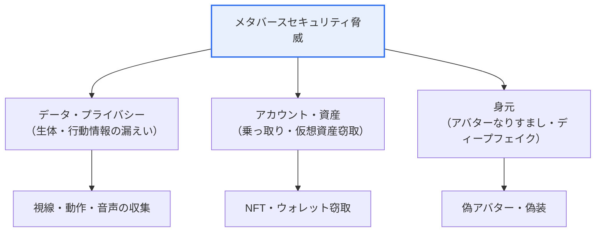
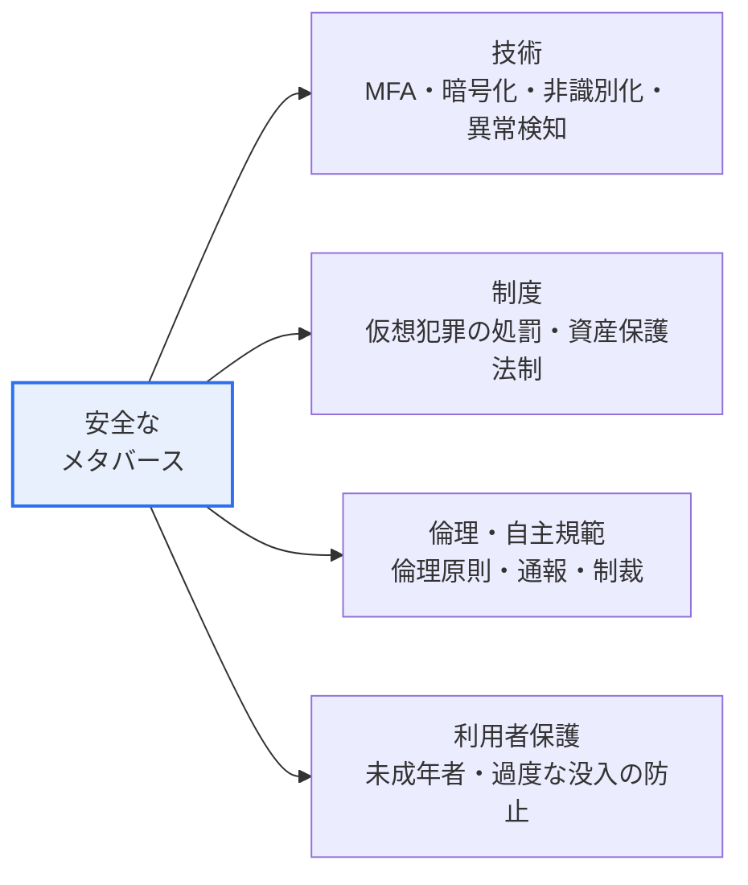

# メタバースのセキュリティ脅威と社会的問題

## 1. 概要

### A. 概念と特徴

> **メタバース（Metaverse）** は現実世界と仮想世界が融合した **3次元の没入型仮想空間**であり、利用者がアバター（Avatar）を通じて社会・経済・文化活動を行う、永続的（persistent）かつリアルタイムのインターネット環境をいう。「超越」を意味するメタ（meta）と「世界」を意味するユニバース（universe）の合成語である。

メタバースが利便性と同時に新たな脅威を生む根本的な理由は、「**現実と仮想の境界が崩れ、没入のために膨大かつ機微な個人・生体データが常時やり取りされる**」点にある。メタバースは単なるゲームやビデオ会議ではなく、人々がアバターで出会い、働き、取引し、コミュニケーションする「もう一つの持続する現実」を目指す。この没入（immersion）と実在感（presence）が価値の源泉であるが、同時に脅威の根源でもある。現実のように感じられるため、仮想での暴力・いじめが実際の心理的衝撃を与え、没入を実現するために収集する視線・頭部の回転・手の動き・表情・音声といった生体・行動データが漏えいすれば、極めて機微なプライバシー侵害となる。さらにNFT・仮想通貨のような仮想資産が実際の貨幣価値と結びつくことで金銭的攻撃の標的となり、アバターで身元を隠したり偽造したりできるため、なりすまし・犯罪が容易になる。

メタバースセキュリティが既存のサイバーセキュリティの単なる延長ではない理由はここにある。Webサービスの脅威（アカウント乗っ取り・フィッシング・マルウェア）をそのまま継承しつつ、**仮想・没入・生体データ・仮想経済**という固有の特性に由来する新たな層の脅威と社会問題が重なる。特にVR/ARヘッドセットが収集するデータは単なるプロフィール情報ではなく、個人を再識別し得る生体・行動シグナルであるという点で、漏えいすれば回復不能な被害につながり得る（パスワードは変更できるが、歩容・虹彩・視線パターンは変えられない）。

### B. メタバースの主な特徴

メタバースの4つの特徴はそれぞれ特定の脅威と直結しているため、特徴をまず理解することで脅威の構造が見えてくる。**没入感・実在感**は3D・VR/AR技術によって現実のような体験を与えるが、そのためのセンサーが機微データを常時収集する。**アバター**は仮想の自我による自由な活動を可能にするが、匿名性の背後に身元を隠し、なりすまし・責任回避を招く。**仮想経済**はNFT・仮想通貨で新たな経済活動を開くが、金銭的攻撃の誘因を生む。**リアルタイムの多者間相互作用**はコミュニケーションを豊かにするが、同時に仮想暴力・いじめの経路となる。

| 特徴 | 内容 | 直結する脅威 |
|---|---|---|
| **没入感・実在感** | 3D・VR/ARによる現実のような体験 | 生体・行動データの収集・漏えい |
| **アバター** | 仮想の自我で活動、匿名性 | なりすまし・ディープフェイク・責任回避 |
| **仮想経済** | NFT・仮想通貨ベースの取引 | 資産窃取・スマートコントラクト攻撃 |
| **リアルタイム相互作用** | 多数ユーザーの同時コミュニケーション | 仮想性犯罪・いじめ・ヘイト |

## 2. 情報システム面のセキュリティ脅威

メタバースの脅威は大きくデータ・プライバシー、アカウント・資産、身元の3つの軸に分けられ、次の概念図はその全体構造を示す。

**A. 個人・生体情報の漏えい** はメタバース固有の最も深刻な脅威である。没入型デバイスは利用者の視線追跡（eye-tracking）、頭部・手の動き、部屋の広さ・家具の配置（空間マッピング）、音声、さらには表情・心拍まで収集し得る。研究者らは、このようなモーション・視線データだけでも個人を高い精度で再識別できることを報告してきたが、これは仮名化されたアバターの背後にいる実際のユーザーを特定できるという意味である。視線データは何に関心を向けているか（広告・政治的傾向・健康状態の示唆）を露わにするため、漏えい・悪用されれば、ターゲット広告を超えて心理的操作や差別につながり得る。このデータは一度漏れると変更できないという点で、パスワード漏えいとは質的に異なる。

**B. アカウント乗っ取りと仮想資産攻撃** は、仮想経済が実物価値と結びつくことで拡大した脅威である。アバターのアカウントには購入したアイテム、仮想不動産、NFT、連携された決済手段が紐づいており、アカウントを失うことはすなわち金銭的損失である。特にブロックチェーンベースの資産は、ウォレットの秘密鍵が奪われると取引を取り消すことができず（不可逆性）、スマートコントラクトのコードの脆弱性（リエントランシー攻撃など）を狙った窃取事例が実際に発生してきた。フィッシングで偽造された仮想ショップ・エアドロップのリンクを通じてウォレットの署名を誘導する手口が代表的である。

**C. アバターなりすまし・ディープフェイク・マルウェア** は、身元とコンテンツの信頼を崩壊させる。他人の外見・声を偽造したアバターで知人・有名人になりすまして詐欺を働いたり（ディープフェイクと組み合わせればリアルタイムの偽装も可能）、仮想アイテム・リンクにマルウェアを仕込んで感染させたりすることができる。アバターの匿名性は表現の自由を広げる一方で、加害者が身元を隠したまま攻撃し、追跡を回避する盾にもなる。

一方、没入環境は**ソーシャルエンジニアリング攻撃の効果を増幅**するという点にも注目すべきである。3D空間で信頼できる機関のロゴを掲げた仮想支店（branch）や、実在の人物と区別しにくいアバターが目の前で話しかけてくれば、テキストベースのフィッシングよりはるかに強い説得力を持つ。すなわちメタバースは既存の脅威を継承するにとどまらず、実在感という特性を通じてその脅威の成功率を高める「増幅器」の役割を果たす。これが、利用者教育とプラットフォームレベルでの身元認証表示（公式アカウントバッジなど）が併せて必要な理由である。

| 脅威 | 内容 | 特性 |
|---|---|---|
| **個人・生体情報の漏えい** | 視線・動作・音声などの機微データの窃取 | 再識別可能・回復不能 |
| **アカウント乗っ取り** | 仮想資産・身元の盗用 | 金銭被害に直結 |
| **仮想資産攻撃** | NFT・仮想通貨の窃取、コントラクトの脆弱性 | 不可逆・追跡困難 |
| **アバターなりすまし・ディープフェイク** | 他人のアバター偽造、偽の身元 | 信頼の崩壊 |
| **マルウェア・フィッシング** | 仮想アイテム・リンクを介した感染 | 既存脅威の継承 |

## 3. 社会的問題と安全なメタバースの方策

### A. 社会的問題

メタバースの社会的問題は、技術だけでは解決できない人間・倫理の次元の問題であるという点で、別個のアプローチが必要である。第一に、**アイデンティティの混乱**である。アバターで複数の自我を行き来することで現実の自我との乖離が大きくなり、特に自我形成期の青少年にとっては現実と仮想の混同につながり得る。第二に、**仮想性犯罪・暴力・いじめ**である。没入感のために仮想空間でのセクハラ・ストーキング・暴力が実際の被害者に現実に近い心理的トラウマを残すという報告が相次いでおり、実際にVRソーシャル空間でのアバターを対象とした性的嫌がらせの通報が社会問題として注目されたことがある。第三に、**過度な没入・依存**である。現実よりも魅力的な仮想の報酬体系が過度な没入を誘発し、日常・学業・対人関係を蝕み得る。第四に、**経済犯罪と詐欺**であり、仮想不動産・アイテムを餌にした投資詐欺・マルチ商法が匿名性と規制の空白に乗じて拡散する。第五に、**デジタル格差とアクセシビリティ**の問題であり、高価なVR機器と高速ネットワークが前提となる特性上、経済的・身体的条件によって参加機会が分かれ、メタバースが新たな社会・経済活動の場となるほど、疎外層の排除につながり得る。

これらの問題は互いに絡み合って増幅する。例えば匿名性は仮想暴力と経済犯罪を同時に助長し、過度な没入は詐欺・犯罪への脆弱性を高める。したがって個別の問題に別々に対応するよりも、身元・行動に対する最小限の責任追跡性と利用者保護の仕組みをプラットフォーム設計に統合するアプローチが求められる。

これらの問題の共通の背景は、**匿名性＋没入感＋規制の未整備**の結合である。加害者は身元を隠したまま現実に近い衝撃を与えることができ、国境を越える仮想空間であるため管轄・処罰が曖昧である。実際に大手VRソーシャルプラットフォームでは、サービス初期にアバターを対象とした性的嫌がらせの通報が相次いだことから、利用者間の最小距離を強制する「パーソナルバウンダリー（personal boundary）」機能を事後的にデフォルトとして導入した事例があるが、これは社会問題が技術設計の欠陥から生じ得ること、そして設計によって緩和され得ることを同時に示している。

もう一つ注目すべき流れは児童・青少年の保護である。没入型仮想空間は成人と未成年者がアバターで入り混じる構造であるため、未成年者が不適切なコンテンツ・接触にさらされたり、年齢を偽った成人と相互作用したりするリスクが大きい。このため、年齢確認（age assurance）、未成年アカウントの既定保護の強化、保護者による管理機能が、規制・プラットフォーム政策の中核的論点として浮上している。

### B. 安全なメタバースの方策

安全なメタバースは、技術・制度・倫理・利用者保護を併せて備えたときに成立する。いずれか一つだけでは不十分であり、例えば強力な暗号化（技術）を備えてもアバターへの性暴力（社会問題）は防げず、処罰規定（制度）だけでは国境を越える匿名の加害を追跡することは難しい。次の概念図は、4つの軸が互いを補完する構造を示す。

**技術的方策** は、強力な認証（MFA・FIDO）、伝送・保存データの暗号化、データの最小収集・非識別化、視線・生体データのオンデバイス（local）処理、異常行為検知（アカウント不正利用・ボット検知）を含む。**制度的方策** は、仮想空間での犯罪を処罰できる法整備と、仮想資産利用者保護法制（韓国の仮想資産利用者保護法など）である。**倫理・自主規範** は、プラットフォームレベルのメタバース倫理原則と実効的な通報・制裁体制であり、**利用者保護** は、未成年者のアクセス制御、過度な没入の防止（利用時間の案内）、個人の安全境界（パーソナルバブルなど物理的距離を確保する機能）といった具体的な仕組みを指す。

| 区分 | 方策 |
|---|---|
| **技術** | MFA・暗号化、データ最小収集・非識別化、オンデバイス処理、異常行為検知 |
| **制度** | 仮想犯罪の処罰・規制、仮想資産利用者保護法制 |
| **倫理・自主規範** | メタバース倫理原則、通報・制裁体制 |
| **利用者保護** | 未成年者保護、過度な没入の防止、パーソナルバブルなどの安全機能 |

## 4. 深掘り — 規制・標準動向とプライバシー・バイ・デザイン

メタバースセキュリティは、個々のプラットフォームの取り組みを超えて規制・標準のレベルへと拡張している。データ保護の面では、EU GDPRは視線・生体データを機微情報（特別な種類の個人データ）とみなして強い保護を求めており、韓国でも個人情報保護法上の生体情報・行動情報の規律がメタバースのデータに適用される。相互運用性・標準化の面では、複数のプラットフォーム間でのアバター・資産の移動を扱う標準化の議論（Metaverse Standards Forumなど）が進行中であるが、相互運用が拡大するほど一つのプラットフォームの脆弱性が接続された全体へと広がり得るため、セキュリティ標準の重要性が増す。仮想資産の面では、韓国の「仮想資産利用者保護法」の施行により、資産の保管・不公正取引の規律の法的根拠が整えられた。

設計思想としては、**プライバシー・バイ・デザイン（Privacy by Design）** が中核である。サービス企画段階から、データの最小収集、目的制限、デフォルトでのプライバシー保護（privacy by default）、生体データのローカル処理・即時廃棄を設計に組み込むことである。事後対応（漏えい後の対応）では回復不能な生体データを守ることはできないため、そもそも「収集しない、またはデバイスの外に出さない」事前設計が唯一実効的な防御である。これは近年の規制における「設計段階での説明責任（accountability by design）」の流れとも通じる。[[privacy-by-design]]

技術的な補完策としては、視線・モーションのような生（raw）の信号をサーバーへ送る前にノイズを加えたり精度を下げたりする**差分プライバシー・データ難読化**の手法や、再識別を困難にする生体データ処理の研究が進められている。ただしこうした手法は没入品質と相反し得るため（過度な難読化は応答遅延・不正確さを生む）、「保護レベル対没入品質」のバランス点をドメインごとに見いだすことが実務上の課題として残る。結局、メタバースセキュリティは完成品の機能ではなく、技術・政策・利用者の意識が共に進化していくべき継続的プロセスとして理解する必要がある。

予想される出題方向としては、▲メタバース固有の脅威3〜5つと対応策を技術的・制度的・倫理的に階層化して記述する論述型、▲生体・行動データの再識別リスクとプライバシー・バイ・デザインの適用方策、▲アバターの匿名性の順機能・逆機能と、実名・責任追跡とのバランスの問題などが有力である。答案構成の際は、「特徴 → 特徴から派生する脅威 → 階層的対応 → 技術士の観点からの示唆点」という因果の流れで展開すると説得力が高い。

また近年では、生成AIとの結合が新たな変数として浮上している。AIが生成したアバター・音声・コンテンツがメタバースに流入すると、ディープフェイクによるなりすましや偽情報の拡散が一段と容易になるため、コンテンツの出所表示（provenance）とAI生成物のラベリングが信頼維持の新たな課題として浮上している。これは、メタバースセキュリティが固定された対策ではなく、技術の発展に応じて更新され続けるべき領域であることを改めて示している。

## 5. 考慮事項および示唆点

1. **プライバシー保護が最優先課題である。** メタバースは没入のために視線・表情・動作など、再識別可能かつ回復不能な生体・行動データを常時収集するため、最小収集・非識別化・オンデバイス処理とプライバシー・バイ・デザインをデフォルトとしなければならない。事後対応ではこのデータを守れないという点が、他のサービスとの決定的な違いである。[[privacy-by-design]]

2. **技術・制度・倫理のバランスが必要である。** 暗号化・認証のような技術的セキュリティだけでは、アバターなりすまし・仮想性暴力のような社会問題を防ぐことはできない。国境を越える匿名の加害という特性上、処罰法制と管轄間の協力、プラットフォームの自主的倫理規範・通報体制が共に機能してはじめて実効性がある。[[metaverse-ethics]]

3. **信頼が産業拡大の前提である。** 安全・プライバシーが保証されなければ利用者は離れていくため、セキュリティはメタバース成長の障害ではなく、持続可能性に不可欠な基盤である。特に未成年者保護の失敗は、社会的信頼と規制リスクに直結する。

4. **相互運用・拡張が新たな攻撃面を生む。** プラットフォーム間のアバター・資産の移動が拡大するほど、一か所の脆弱性が接続された全体へと伝播するため、相互運用標準にセキュリティ・本人確認を最初から組み込む必要がある。技術士はメタバースアーキテクチャの設計時に、没入品質とデータ最小化という相反する目標を併せて比較衡量し、生体データのライフサイクル（収集・処理・廃棄）を管理するガバナンスを処方できなければならない。[[digital-twin-metaverse]]

## 参考資料

- Wikipedia, "Metaverse" — https://en.wikipedia.org/wiki/Metaverse
- 韓国個人情報保護委員会、個人情報保護法（生体・行動情報関連） — https://www.pipc.go.kr
- 韓国金融委員会、仮想資産利用者保護法の案内 — https://www.fsc.go.kr

---

> **一言まとめ**: メタバースは *没入・アバター・仮想経済* という固有の特性のために、再識別可能な生体・行動情報の漏えい、仮想資産・アカウントの乗っ取り、アバターなりすましといったセキュリティ脅威と、アイデンティティの混乱・仮想暴力・依存などの社会問題を併せ持っており、回復不能なデータを守るにはプライバシー・バイ・デザインを軸に、技術・制度・倫理・利用者保護を包含した多層的な対応が必要である。
