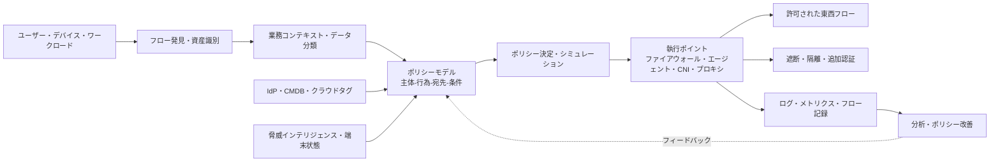
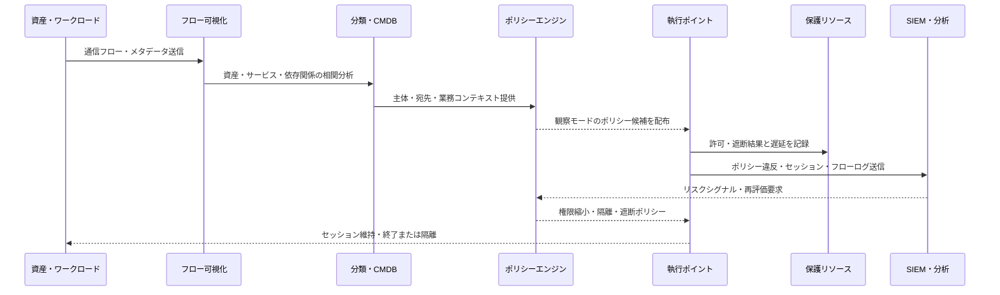

# マイクロセグメンテーション（Microsegmentation）に基づく東西トラフィック制御とゼロトラストの実装

## 1. 概要

> **マイクロセグメンテーション（Microsegmentation）**は、ユーザー・アプリケーション・ワークロード・デバイス・データフローを業務上の属性と通信の必要性に応じて非常に小さな論理領域に分割し、領域間の通信を許可リストとポリシーによってきめ細かく制御するセキュリティ設計手法である。

従来のネットワークセキュリティは、インターネットと内部ネットワークの境界にファイアウォールを配置し、内部では比較的広い通信を許可する方式として発展してきた。

この構造は、データセンターと業務システムが固定された場所にあり、ユーザーが社屋内から接続していた時代には運用しやすかった。

しかし、クラウド、コンテナ、SaaS、在宅勤務、協力会社との連携が広がるにつれ、ユーザーの所在やサーバーの物理的な位置が保護の基準となりにくくなった。

攻撃者が一つのアカウントや一台のサーバーを掌握した後、内部の別のサーバーへ移動するラテラルムーブメント（Lateral Movement）が可能であれば、最初の侵害地点よりはるかに大きな被害が発生する。

マイクロセグメンテーションは、この問題を東西（East-West）トラフィックの観点から扱う。

東西トラフィックとは、ユーザーとインターネットの間の南北（North-South）トラフィックとは異なり、サーバー間、サービス間、端末間の内部の流れを意味する。

したがって外部ファイアウォールを強化するだけでは十分ではなく、内部のすべての通信について業務上必要な流れであるかを確認し、不要な接続は遮断しなければならない。

NIST SP 800-207は、ゼロトラストをネットワーク上の位置に基づく暗黙の信頼を排除し、リソースへのアクセスを継続的に評価するセキュリティパラダイムとして説明し、論理的なマイクロセグメンテーションをゼロトラストアーキテクチャのアプローチの一つとして示している（[NIST SP 800-207](https://csrc.nist.gov/pubs/sp/800/207/final)）。

マイクロセグメンテーションはゼロトラストそのものではなく、ゼロトラストの最小権限と侵害前提（Assume Breach）をネットワーク・ワークロードの境界で執行する手段である。

すなわち、アイデンティティとコンテキストでアクセスを決定するポリシー体系と、実際のパケット・セッション・サービス呼び出しを遮断または許可する執行ポイントが併せて存在しなければならない。

### A. 登場背景と必要性

第一に、仮想化とコンテナによって、一台の物理サーバー上に異なる業務や顧客のワークロードを同時に配置するようになった。

同じホストや同じクラスタ内にあるという理由だけですべてのワークロードが相互に通信できるとすれば、一つの脆弱性が複数のサービスへと拡大し得る。

第二に、開発速度を高めるためのマイクロサービス構造は、サービス間のAPI呼び出しを大きく増やした。

サービス数が増えるとネットワーク接続も複雑になるため、「内部サービスは信頼する」という単純なルールがかえって攻撃者の移動経路となる。

第三に、ハイブリッド・マルチクラウド環境では、VLANや物理ファイアウォールだけですべての業務フローを一貫して管理することは難しい。

クラウドのセキュリティグループ、ホストファイアウォール、サービスメッシュ、コンテナのネットワークポリシーを一つのポリシーモデルで束ねてこそ、資産の場所が変わっても同じ統制を維持できる。

第四に、ランサムウェアやアカウント乗っ取りのインシデントでは、初期侵入後の拡散をどれだけ速く遮断できるかが被害規模を左右する。

セグメントが小さくポリシーが具体的であるほど、攻撃者が利用できる経路とアクセス可能なリソースの範囲が狭まる。

## 2. 中核原理と概念構造

マイクロセグメンテーションの核心は、ネットワークをやみくもに細かく分割することにあるのではない。

業務フローを識別し、各フローの主体・宛先・行為・条件を表現したうえで、必要な通信のみを許可することが本質である。

ポリシーの単位はIPアドレスとポートにとどまらず、ユーザー、デバイスの状態、アプリケーション名、ワークロードのラベル、サービスアカウント、データ分類、環境、デプロイバージョンへと拡張できる。

次の概念図は、資産の発見からポリシー執行、継続的な観測までの全体構造を示す。

### A. 保護対象領域とセグメント

保護対象領域（Protect Surface）とは、すべての資産を一度に保護対象とする代わりに、ビジネスへの影響度が高いデータ・アプリケーション・サービスを優先的に識別する概念である。

例えば、決済データベース、顧客個人情報の保存領域、認証サービス、生産制御サーバーは、一般的な開発サーバーと同じセキュリティ優先度を持つものではない。

保護対象領域を定義すれば、セグメントの境界を資産の物理的な位置ではなく、業務の重要度と通信関係に合わせることができる。

セグメントはVLANのようにネットワークアドレスで分けることもでき、クラウドのセキュリティグループ、ホストファイアウォール、コンテナのネームスペース、サービスメッシュのワークロードアイデンティティで分けることもできる。

一つのワークロードを一つのセグメントにすることもできるが、実際の環境では管理の複雑さと性能を考慮し、同じポリシーを共有する資産グループをまとめることもある。

セグメントが大きすぎればラテラルムーブメントを十分に制限できず、小さすぎればポリシー数が爆発的に増えて運用者が例外を乱発することになる。

したがってセグメントの大きさは「最小の単位」ではなく、「独立してリスクを管理し、業務フローを説明できる単位」として定めなければならない。

### B. 主体・宛先・行為・条件

ポリシーは「ネットワークAからネットワークBへTCP 443を許可する」という技術的ルールから始めることができる。

しかしクラウドやコンテナ環境ではIPが再割り当てされ、インスタンスが頻繁に入れ替わるため、IPだけでポリシーを維持すると変更のたびに手作業が必要になる。

代わりに「注文サービスが承認済みデプロイバージョンの決済サービスに対して決済承認APIを呼び出す」のように、主体と宛先の意味を表現しなければならない。

主体は、人、サービスアカウント、アプリケーション、デバイス、ジョブスケジューラーになり得る。

宛先は、Webサービス、メッセージキュー、データベース、ファイルストレージ、管理インターフェースなどの保護リソースになり得る。

行為は接続だけでなく、APIメソッド、データベースコマンド、ファイルの読み書き、管理コマンドのように細かく定義できる。

条件には、時間、環境（dev・staging・production）、デプロイバージョン、端末のセキュリティ状態、データ分類、リクエストのリスク度、承認の有無が含まれる。

これらの属性を用いれば、同じサービスであっても開発環境では広いテストアクセスを許可し、本番環境では特定のサービスアカウントによる読み取り要求のみを許可するといった差別化された統制が可能になる。

### C. デフォルト拒否と最小権限

マイクロセグメンテーションの一般的なデフォルトは、明示的に許可していないフローを拒否することである。

ただし業務フローを把握する前に全面遮断すると障害が発生するため、初期には観察モードで実際の通信を収集し、ポリシー候補を作成する。

ポリシー候補がそのまま自動的に許可ルールになってはならない。

正常な業務フローなのか、一時的なデバッグ用の接続なのか、古いエージェントによる不要な通信なのかを、運用者とサービス担当者が確認しなければならない。

最小権限とは、接続対象だけでなく、接続方向、ポート、呼び出すAPI、データの種類、セッション時間まで絞り込むプロセスである。

例えば、注文サービスが決済サービスにリクエストできるからといって、決済サービスの管理ポートや運用シェルにまでアクセスさせてはならない。

デフォルト拒否ポリシーは可用性に影響を与えるため、例外承認手続きと緊急解除手続きを併せて設計しなければならない。

緊急解除は一定時間後に自動的に失効し、理由・承認者・影響範囲が記録されてはじめて、恒久的な迂回経路にならずに済む。

### D. 継続的検証と侵害前提

マイクロセグメンテーションは、セグメントに入った主体を恒久的に信頼する技術ではない。

サービス証明書が失効したり、デバイスのセキュリティ状態が悪化したり、異常な振る舞いが検知されたりした場合には、既存セッションの権限を再評価できなければならない。

ゼロトラストの侵害前提とは、すでに一つの資産が侵害されていたとしても、他の資産へ自動的に移動できないように設計せよという意味である。

したがってポリシーは正常時だけでなく、アカウント乗っ取り、悪意あるプロセスの実行、異常な大量リクエスト、サプライチェーン経由の悪性コード流入の状況において、どのように縮小されるかを含まなければならない。

## 3. 実装アーキテクチャと動作手順

実装方式は、資産の種類と通信レイヤーによって異なる。

データセンターのサーバーにはホストエージェントやホストファイアウォールを適用でき、クラウドにはネイティブのセキュリティグループとネットワークファイアウォールを利用できる。

コンテナには、CNIプラグインのネットワークポリシーとサービスメッシュのサイドカーまたはノードプロキシを組み合わせることができる。

OT・IoTのようにエージェントの導入が難しい資産には、スイッチ、ファイアウォール、パッシブセンサー、IDベースのNACといったネットワーク中心の統制が必要である。

次のシーケンスは、観察からポリシー執行、インシデント対応へと続く運用手順である。

### A. 資産の発見とフローのベースライン

最初のステップは、ファイアウォールルールをすぐに書くことではなく、資産一覧と通信関係を信頼できる状態にすることである。

IPアドレス、ホスト名、クラウドアカウント、タグ、コンテナラベル、サービスアカウント、所有組織を、可能な限り一つの識別体系に結びつける。

NetFlow・VPC Flow Logs・パケットメタデータ・アプリケーションログを収集すれば、誰がどのリソースにどのポートでどれほど頻繁に接続しているかを把握できる。

暗号化されたトラフィックは、本文を復号しなくても、両端点、時刻、ポート、バイト数、接続頻度といったメタデータから基本的なフローを確認できる。

資産の所有者と業務目的が確認できないフローは、すぐに削除せず、リスク度と影響度を付して調査対象とする。

ベースラインには、バッチジョブの時間帯、バックアップトラフィックの周期、フェイルオーバー時の代替経路も含めなければならない。

そうしなければ、正常な夜間バックアップを攻撃と誤認したり、障害時に必要なフローをポリシーから漏らしたりする恐れがある。

### B. ポリシーモデルとポリシーライフサイクル

ポリシーモデルとは、自然言語の業務ルールを実際の執行ルールへ変換する中間表現である。

ポリシーに含めるべき最小限のフィールドは、主体、行為、宛先、プロトコル・ポート、条件、決定、有効期限、所有者、根拠である。

ポリシーの根拠を記録しておけば、監査や障害分析の際に「誰がどのような業務要件でこのフローを許可したのか」を確認できる。

ポリシーは、作成・レビュー・シミュレーション・承認・デプロイ・観察・改訂・廃止というライフサイクルを持たなければならない。

開発者が緊急にポートの開放を求めたとしても、有効期限のない恒久的な例外として処理すれば、セキュリティ負債が蓄積する。

Policy as Codeを用いれば変更履歴とピアレビューを残せるが、ポリシー言語の表現力と実際の執行器との差異を検証しなければならない。

ポリシーシミュレーションでは、既存の許可フローが遮断されないか、ルールの順序が意図どおりか、より広いルールが狭いルールを上書きしていないかを確認しなければならない。

### C. ポリシー決定ポイントとポリシー執行ポイント

ポリシー決定ポイント（PDP）はアクセスを許可するか拒否するかを判断し、ポリシー執行ポイント（PEP）は実際の通信経路上でその決定を強制する。

NIST SP 800-207の論理構成では、ポリシーエンジンが決定を下し、ポリシー管理者が執行ポイントにセッションの確立・変更・終了の指示を伝達する。

マイクロセグメンテーションの執行ポイントは、ファイアウォール、ルーター、ホストエージェント、クラウドのセキュリティグループ、コンテナネットワークプラグイン、サービスメッシュのプロキシとして実装できる。

ポリシーエンジンが正常に「許可」を返しても、リソースが別の迂回経路で直接露出していれば統制は失敗する。

保護リソースは承認された執行ポイントを経由しなければアクセスできないよう、ルーティング、セキュリティグループ、ホストファイアウォールを併せて調整しなければならない。

執行ポイントの障害時の動作も重要である。

認証サービスやポリシーエンジンが一時的に利用できないとき、既存セッションを維持するのか、新規セッションのみを遮断するのか、高リスクのリソースだけを優先的に遮断するのかを、業務の重要度に応じて定める。

### D. オブザーバビリティと対応の自動化

すべての遮断を成功とみなすことはできない。

ポリシーが広すぎれば侵害時に拡散を防げず、狭すぎれば正常な呼び出しを遮断して、運用者が迂回ポリシーを作ることになる。

許可・遮断・例外・ポリシー照会の失敗・執行ポイントのエラーをすべて中央ログに送り、資産・ユーザー・チケット・デプロイ情報と連携させる。

運用指標としては、未分類資産の比率、観察モードの期間、ポリシー例外の数、期限切れ例外の比率、遮断後の再試行回数、ポリシー変更の失敗率を用いることができる。

セキュリティ指標としては、重要資産への未承認接続の試行、セグメント間のラテラルムーブメント経路、隔離までにかかった時間、侵害された資産がアクセスしたリソース数を追跡できる。

自動隔離は誤検知時に業務停止を引き起こし得るため、重要度と信頼度に応じて、警告・追加認証・読み取り専用・隔離という段階的対応を適用する。

## 4. 適用類型と比較

### A. データセンターとクラウド

データセンター環境では、VLAN・VRF・内部ファイアウォールで大きな領域を分け、ホストファイアウォールやエージェントでサーバー間の統制を補完できる。

この方式は既存機器との互換性を確保しやすい反面、IPアドレスの変更や機器ごとのポリシー文法の違いのために一貫した運用が難しい。

クラウド環境では、アカウント・VPC・サブネット・セキュリティグループ・ネットワークACL・ワークロードタグをポリシー属性として活用できる。

クラウドネイティブの機能は拡張性に優れるが、クラウドごとにモデルやログ形式が異なるため、マルチクラウドにおけるポリシーの移植性が低下し得る。

したがって共通のポリシーモデルとクラウドごとの変換・検証レイヤーを設け、実際の執行結果は各環境で改めて確認しなければならない。

### B. コンテナとサービスメッシュ

コンテナのネットワークポリシーは、ネームスペース、Podのラベル、サービスアカウントなどを用いてL3・L4の通信を制限する。

サービスメッシュのプロキシは、サービスアイデンティティ、mTLS、リクエストパス、メソッドといったL7情報を活用できるため、APIレベルのポリシーに有利である。

一方、すべてのトラフィックがプロキシを経由すると、遅延・リソース使用量・運用の複雑さが増加し得る。

また、メッシュのポリシーだけでは、ノードの管理ポート、外部DNS、ストレージ経路といったアプリケーション以外のフローをすべて保護することはできない。

したがってL3・L4の基本的な隔離とL7のきめ細かな統制を階層的に組み合わせ、メッシュ外部の管理経路も別途統制する。

### C. エージェントベースとネットワークベース

エージェントベース方式は、プロセス・ユーザー・ワークロードの情報をポリシーに反映しやすく、ホスト内できめ細かな統制を行える。

しかし、エージェントを導入できないOT・IoT、性能が限られた機器、外部協力会社の機器には適用が難しい。

ネットワークベース方式は、既存のルーター・スイッチ・ファイアウォールで幅広い機器を保護できるが、暗号化されたアプリケーションの意味やプロセスレベルの主体を把握することは難しい。

両方式は代替関係というよりも、保護対象と通信レイヤーに応じて補完的に用いるべきものである。

| 区分 | 従来のネットワーク分割 | マイクロセグメンテーション | ZTNA |
|---|---|---|---|
| 主な目標 | 大きな領域の境界分離 | 東西フローとラテラルムーブメントの制限 | ユーザー・デバイスのアプリケーションアクセス制御 |
| ポリシー単位 | VLAN・サブネット・IP | ワークロード・アイデンティティ・タグ・サービス | ユーザー・デバイス・リソース・コンテキスト |
| 主なフロー | 領域間トラフィック | サーバー・サービス・デバイス間の内部フロー | ユーザー・外部主体とリソースの間 |
| 執行ポイント | ルーター・ファイアウォール | ホスト・CNI・ファイアウォール・プロキシ | ブローカー・ゲートウェイ・エージェント |
| 長所 | 理解と運用が比較的単純 | 爆発半径とポリシー範囲を縮小 | ネットワーク全体を露出させずにリソースへ接続 |
| 限界 | 領域内での過度な信頼 | ポリシー・資産・例外運用の複雑さ | レガシー・非Webプロトコルとの連携の難しさ |

3つの技術は互いを置き換えるものではない。

外部ユーザーのアクセスはZTNAで最小化し、内部ワークロード間の通信はマイクロセグメンテーションで統制し、データセンターの大きな障害ドメインは従来のネットワーク分割で隔離するといった多層設計が現実的である。

## 5. 適用事例

### A. 電子商取引サービスの事例

以下は、Web・注文・決済・データの各レイヤーを運用する電子商取引企業を想定した例である。

インターネットからWebレイヤーに入るトラフィックはWAFとAPIゲートウェイを通過し、Webレイヤーは注文APIのみを呼び出せるように制限する。

注文サービスは決済承認APIと在庫照会APIを呼び出せるが、決済データベースの管理ポートにはアクセスできない。

決済サービスは承認に必要なストアドプロシージャまたは特定の読み書き用アカウントのみを使用し、運用者のシェルや大量エクスポートの経路は別途の承認で分離する。

開発環境のテストサービスが本番の決済レイヤーを呼び出すフローはデフォルトで拒否し、障害対応時に作成される一時アクセスには、チケット番号と有効期限をポリシーに記録する。

決済サービスのアカウントが普段と異なり顧客データベースの複数テーブルを大量に照会した場合、SIEMのリスクシグナルをポリシーエンジンに伝え、セッションを読み取り専用に切り替えたり隔離したりできる。

この構造の効果は、攻撃者がWebレイヤーを掌握したとしても、注文・決済・個人情報のレイヤーへ直ちに移動できないようにする点にある。

ただし正常な注文フローを遮断すれば売上損失につながるため、観察モードと負荷テストを経て、ポリシーを段階的に執行しなければならない。

### B. 製造・OT環境の事例

製造工場では、事務用ITネットワーク、生産管理サーバー、制御ネットワーク、設備・センサーネットワークを同じセキュリティレベルで扱ってはならない。

生産設備の制御プロトコルは、業務上必要なサーバーとのみ、限定された方向で通信するようにし、事務用端末から制御ネットワークへ直接アクセスする経路は遮断する。

協力会社がリモート保守を行う際は、承認された時間帯に承認された機器から中継サーバーを経由して、特定の設備にのみアクセスさせる。

古いPLCやセンサーのようにエージェントの導入が難しい機器は、パッシブモニタリング、産業用ファイアウォール、スイッチACL、ジャンプサーバーで統制を構成する。

制御ネットワークではセキュリティポリシーの変更が可用性と安全に影響し得るため、遮断ポリシーをデプロイする前に、シミュレーションと変更承認、現場の安全手順を経なければならない。

ISA/IEC 62443のZone・Conduitアプローチのように、機能とリスクが類似する資産をゾーンとしてまとめ、ゾーン間の通信経路を統制すれば、ITとOTの異なる可用性要件を調整するのに役立つ。

## 6. 深掘り：段階的導入と成熟度戦略

CISAは2025年に、マイクロセグメンテーションをゼロトラストの観点から計画・適用するためのガイドの第1部を公開し、ネットワークの柱（Networks pillar）において通信の必要性に応じてネットワークを分割し、セキュリティ統制を適用する能力として説明している（[CISA Microsegmentation in Zero Trust, Part One](https://www.cisa.gov/resources-tools/resources/microsegmentation-zero-trust-part-one-introduction-and-planning)）。

このガイドの流れを実務に適用する際には、製品の導入よりも業務資産とフローの理解を先に行うことが重要である。

第1段階は準備段階であり、保護対象領域・重要資産・所有組織・規制要件・障害許容レベルを定める。

第2段階は発見段階であり、一定期間フローを観察し、資産・サービス・ユーザー・データの依存関係を正規化する。

第3段階は設計段階であり、業務フローを主体・行為・宛先・条件で表現し、ポリシー候補をシミュレーションする。

第4段階は限定的執行段階であり、影響が小さく所有者が明確な開発・テスト環境、または重要資産の一部からデフォルト拒否を適用する。

第5段階は拡張段階であり、クラウド・コンテナ・データセンター・OTの異なる執行手段を、共通のポリシーモデルとログ体系で結びつける。

第6段階は最適化段階であり、リスクシグナルに応じた自動隔離、ポリシーの失効、例外の削減、攻撃経路の検証を運用に組み込む。

成熟度を単にセグメント数で測定してはならない。

重要資産の保護率、未分類フローの減少、恒久的例外の減少、ポリシー変更の失敗率、侵害時にアクセス可能なリソース数と隔離時間を併せて見る必要がある。

AIベースのポリシー推奨を利用することはできるが、推奨結果がそのまま許可ポリシーになると、誤ったフローや攻撃者の通信を自動承認してしまうリスクがある。

AIはフローのクラスタリングや重複ポリシー検出の補助手段として用い、高リスクのリソースや例外ポリシーは、人が根拠をレビューしたうえで承認しなければならない。

## 7. 考慮事項および示唆点

### A. 業務継続性とセキュリティのバランス

マイクロセグメンテーションはセキュリティを強化するが、誤った遮断は即座に業務障害となる。

最初から全面遮断せず、観察・シミュレーション・部分執行・拡大の段階を守り、フェイルオーバー経路と緊急解除手順を事前に検証しなければならない。

### B. 資産識別とポリシー品質

資産一覧が不正確であったり所有者が定まっていなかったりすれば、ポリシーの基準も揺らぐ。

CMDB、クラウドインベントリ、コンテナオーケストレーター、IdPの識別子を結びつけ、資産のライフサイクル終了時にはポリシーも併せて廃止する自動化が必要である。

### C. ポリシー例外とセキュリティ負債

緊急の障害対応を理由に作成した例外が失効しなければ、マイクロセグメンテーションは名ばかりのものとなる。

例外には理由・承認者・影響範囲・有効期限・代替統制を記録し、失効前に再承認されなければ自動的に削除する原則を適用しなければならない。

### D. 暗号化と可視性

TLSやmTLSは機密性と身元確認に有利であるが、観測システムが業務フローを完全に理解することを難しくし得る。

復号の範囲をむやみに拡大するよりも、メタデータ、サービスログ、分散トレーシング、証明書・サービスアイデンティティ、エンドポイントテレメトリを組み合わせて、必要な可視性を確保すべきである。

### E. 性能と拡張性

ポリシー照会やパケット検査はリクエスト経路の遅延を増やし得るため、キャッシュ・ポリシー配布構造・執行ポイントの容量・障害時の動作を性能試験しなければならない。

サービスメッシュのプロキシ数、エージェントのCPU・メモリ使用量、ログ量と保存コストも、全体設計の非機能要件として管理する。

### F. レガシー・OT・IoTの現実性

すべての機器に最新のエージェントや強力な認証を適用できるという前提は現実と異なる。

サポートが限られた機器には、ネットワークベースの隔離、仮想パッチ、ジャンプサーバー、パッシブ検知といった補完的統制を適用し、更新計画と残存リスクを経営陣に報告しなければならない。

### G. 成果測定と継続的改善

セグメント数や遮断ルール数が多いからといって、セキュリティ成熟度が高いわけではない。

侵害シナリオを想定した攻撃経路の検証やパープルチーム演習を通じて、実際にラテラルムーブメントが遮断されるかを確認し、サービス変更時のポリシー影響分析を自動化しなければならない。

## 参考資料

- NIST, “Zero Trust Architecture, SP 800-207”: https://csrc.nist.gov/pubs/sp/800/207/final
- NIST NCCoE, “Implementing a Zero Trust Architecture, SP 1800-35”: https://www.nist.gov/news-events/news/2025/06/nist-releases-cybersecurity-practice-guide-implementing-zero-trust
- CISA, “Microsegmentation in Zero Trust, Part One: Introduction and Planning”: https://www.cisa.gov/resources-tools/resources/microsegmentation-zero-trust-part-one-introduction-and-planning
- CISA, “Zero Trust Maturity Model Version 2.0”: https://www.cisa.gov/resources-tools/resources/zero-trust-maturity-model

---

> **一言まとめ**: マイクロセグメンテーションは、資産と業務フローを小さな論理境界に分割し、最小権限・デフォルト拒否のポリシーを東西トラフィックに執行することで、侵害後のラテラルムーブメントと被害の爆発半径を縮小するゼロトラストの実装手段である。
