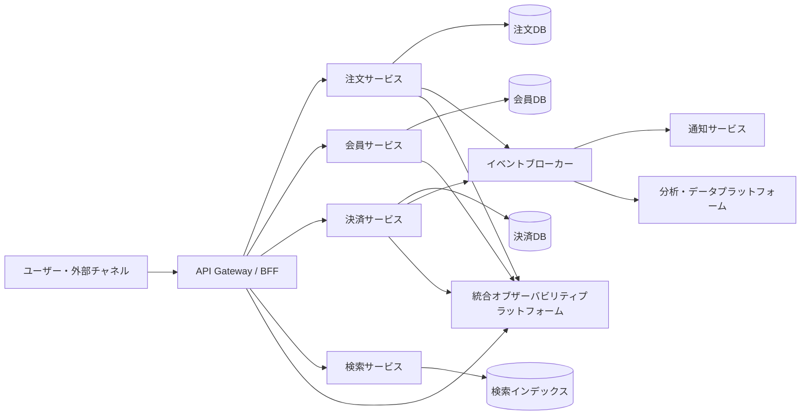
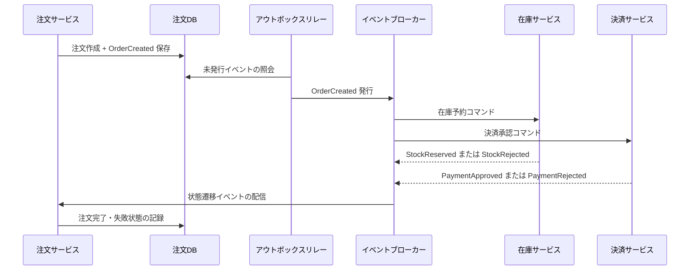

# マイクロサービスアーキテクチャ（MSA, Microservices Architecture）

## 1. 概要

> **マイクロサービスアーキテクチャ（MSA）**とは、一つの業務システムを、独立して開発・デプロイ・拡張できる小さなサービスの集合として構成し、サービス間を明示的な契約とネットワーク通信で接続するアーキテクチャスタイルである。

従来のモノリシックシステムは、一つのアプリケーション単位でビルドしデプロイする。初期には呼び出し経路が単純で、トランザクションを一つのデータベースで処理しやすいため生産性が高い。しかし組織と機能が大きくなるにつれて変更範囲が広がり、小さな修正でも全体のデプロイと回帰テストが必要になる。特定機能の負荷がアプリケーション全体の拡張につながり、障害が他の機能へ伝播するという結合度の問題も現れる。

MSAは、この問題を業務能力（business capability）単位のサービス境界に分解することで解決しようとするアプローチである。サービスは独自のコード、デプロイ単位、データ所有権を持ち、必要な契約のみを外部に公開する。したがって組織はサービスごとに異なる技術とデプロイ周期を選択でき、トラフィックが集中するサービスだけを水平スケールできる。

ただしMSAは、単にアプリケーションを複数のプロセスに分割する作業ではない。ネットワーク呼び出し、分散トランザクション、データ一貫性、オブザーバビリティ、セキュリティ、運用自動化が同時に持ち込まれるため、システム全体の複雑性が増大する。小さなサービスが増えても、デプロイ・障害・データフローを管理できなければ、かえってモノリシックよりも運用が難しくなる。

したがって技術士の答案では、「分解すれば無条件に良い」と主張するのではなく、なぜ境界を分けるべきか、どのような結合を許容するか、分散環境の失敗をどう統制するかを、アーキテクチャの観点から説明しなければならない。

### 1.1 登場背景と必要性

第一に、ビジネスの変化速度が速くなった。決済、会員、注文、レコメンドのように変更頻度とリスクの異なる機能を一つのリリースに束ねると、全体のスケジュールが最も遅い部分に合わせられてしまう。サービスごとの独立デプロイは変更の影響範囲を狭め、実験や段階的リリースを可能にする。

第二に、ワークロードの特性が多様化した。検索は読み取り中心であり、決済は一貫性と監査証跡が重要で、画像処理はCPU・GPUリソースを大量に必要とする場合がある。単一プロセスの同一のスケーリングポリシーでは、こうした違いを効率的に反映することが難しい。

第三に、大規模組織ではコードよりも組織間のコミュニケーションコストがボトルネックとなる。サービス境界とAPI契約を明確にすればチームの責任範囲がはっきりし、チームが独立して計画・開発・運用できる。しかし組織構造がサービス境界を無理に決定してはならず、実際のドメインの結合度とデータ所有権をまず分析すべきである。

### 1.2 中核的特性

MSAの第一の特性はサービスの独立性である。独立性とは、ソースリポジトリが分離されているという意味だけでなく、サービスが独立してビルド・テスト・デプロイできるという意味である。あるサービスが他のサービスの内部テーブルやデプロイ順序に依存していれば、論理的には分離されていても運用上は結合した状態である。

第二の特性は明示的な契約である。REST、gRPC、メッセージイベントなど、どの通信方式を用いるにせよ、リクエスト・レスポンスの形式、エラーの意味、バージョン互換性、セキュリティ要件が契約として管理されなければならない。契約をドキュメントと自動検証で維持しなければ、サービス数が増えるにつれて変更の衝突が大きくなる。

第三の特性はデータの自律性である。各サービスは自らが責任を持つデータモデルを所有し、他のサービスが内部スキーマを直接参照しないようにする。この原則はデータの重複と結果整合性を受け入れることを求めるが、サービス間の結合を減らし、独立した変更を可能にする。

## 2. 参照構造とサービス分解

### 2.1 全体アーキテクチャ概念図

上記の構造において、ゲートウェイは外部クライアントの認証、ルーティング、レート制限、共通ポリシーを担当する。しかしすべての業務ロジックをゲートウェイに入れると新たなモノリスになるため、ドメインルールは各サービスに残すべきである。モバイル・Web画面に特化した組み合わせが必要であればBFFを別途設けるが、BFFが中核データの所有者とならないよう境界を区別する。

注文・会員・決済サービスは、それぞれ自身のデータストアを所有する。ここでストレージ技術が必ずしも互いに異なる必要はない。重要なのは、他のサービスがテーブルを直接更新したり結合（JOIN）したりせず、所有サービスが定義したAPIやイベントを通じてアクセスするという点である。

イベントブローカーは、サービス間の非同期接続と状態変化を伝達する。注文サービスが注文作成イベントを発行すれば、通知と分析のサービスがそれぞれのペースで処理できる。しかしイベント配信が一度だけ行われると仮定すると、重複や再処理の失敗が発生するため、冪等性キー、リトライ、保持期間、順序要件を設計しなければならない。

統合オブザーバビリティプラットフォームは、ログ・メトリクス・トレースをサービス境界を越えて結びつける。分散トレースの相関IDがなければ、ユーザーの一つのリクエストがどのサービスで遅延したのかを把握することは難しい。MSAにおいてオブザーバビリティは運用上の付加機能ではなく、基本的なアーキテクチャ構成要素である。

### 2.2 サービス境界決定の原理

サービス境界は、技術レイヤーではなくドメインの業務能力を基準に決定する。「コントローラーサービス」「データベースサービス」のようにレイヤーごとに分割すると、一つの業務リクエストが複数のサービスにまたがって呼び出され、サービス間の通信量と調整コストが急増する。一方、注文、在庫、配送のように業務責任と変更理由が異なる単位は境界の候補となる。

ドメイン駆動設計の境界づけられたコンテキスト（Bounded Context）は、境界設定に有用な思考の枠組みである。同じ単語でも文脈によって意味が異なれば、モデルを分離する。例えば顧客は、マーケティングではセグメントの対象であり、決済では請求の主体であり、配送では受取人である場合がある。あらゆる文脈の顧客情報を一つの巨大な顧客モデルに統合すると、変更の影響が大きくなる。

凝集度と結合度も併せて評価する。一緒に変更され一緒にデプロイされるべき機能は同じサービスに置くほうがよく、異なるチーム・スケジュール・障害特性を持つ機能は分離の候補となる。呼び出し頻度だけを見て分離するとネットワークの往復が過剰になり得るため、業務フローの境界とデータ一貫性の要件をまず検討する。

分解の結果は一度に完成するものではない。モノリシックのコードで変更箇所を観察し、優先度の高い業務能力からストラングラーパターンで段階的に抽出する方法がリスクを減らす。抽出したサービスが安定するまでは、フィーチャーフラグ、並行検証、ロールバック経路を用意しなければならない。

### 2.3 構成要素ごとの役割

| 構成要素 | 主な役割 | 設計時の核心的な問い |
|---|---|---|
| サービス | 業務能力の実装とデータ所有 | 独立デプロイと責任範囲は明確か？ |
| API Gateway | 外部エントリポイント、ルーティング、共通ポリシー | ポリシーと業務ロジックが混在していないか？ |
| サービスメッシュ | サービス間通信ポリシー、セキュリティ、オブザーバビリティ | プロキシ運用の複雑さが利益を上回っていないか？ |
| イベントブローカー | 非同期配信とバッファリング | 重複・順序・再処理をどう保証するか？ |
| サービスごとのストア | データ所有とモデル最適化 | 他サービスの直接アクセスを遮断しているか？ |
| CI/CD | ビルド・テスト・デプロイの自動化 | サービスごとのパイプラインと品質ゲートがあるか？ |
| オブザーバビリティプラットフォーム | ログ・メトリクス・トレースの統合 | リクエストの相関関係を追跡できるか？ |

表の構成要素は、独立して導入する製品のリストではない。例えばイベントブローカーを導入しても、サービス間のデータ所有権と再処理ポリシーがなければ、メッセージ処理が複雑になるだけである。逆にオブザーバビリティは、サービス数が増える前に標準フィールドとトレース伝播のルールを定めてこそ効果がある。

## 3. 通信とデータ管理

### 3.1 同期・非同期通信の選択

同期呼び出しは、即時の応答が必要な照会や短い検証に適している。呼び出し側は結果を受け取ってから次の処理を決定でき、インターフェースが直感的である。しかし呼び出し先が遅延したり障害を起こしたりすると、呼び出し側のスレッドとリソースも一緒に拘束される。呼び出しの連鎖が長くなるほど、部分的な障害がリクエスト全体の失敗へと伝播する。

非同期メッセージは、サービス間の時間的結合を減らす。注文作成後に通知を即座に完了させる必要がなければ、注文サービスはイベントを発行し、通知サービスに後で処理させることができる。その代わり、重複配信、順序の入れ替わり、コンシューマーの遅延、メッセージ消失に対応しなければならない。

実務では通信方式を二者択一で選ぶことはしない。ユーザーの決済承認のように即時の結果が必要な中核ステップは同期呼び出しと制限されたタイムアウトで処理し、領収書の送信・レコメンドの更新・分析データのロードはイベントとして分離する。業務の完了の定義と失敗時の補償手順を基準に通信方式を選択すべきである。

| 区分 | 同期API | 非同期メッセージ |
|---|---|---|
| 応答性 | 呼び出し時点で結果を確認 | 後で処理結果を確認 |
| 結合度 | 時間的結合が大きい | 時間的結合が小さい |
| 障害伝播 | タイムアウトの連鎖が起こり得る | キューに蓄積してバッファリング可能 |
| 一貫性 | 即時の検証が容易 | 結果整合性の設計が必要 |
| 運用難易度 | 呼び出し・リトライ中心 | ブローカー・再処理・順序管理が必要 |

### 3.2 データ一貫性と分散トランザクション

MSAでサービスごとのデータベースを用いると、一つのACIDトランザクションで複数のサービスを束ねることは難しい。例えば注文の保存、在庫の引き当て、決済承認を一つのコミットで処理しようとすると、サービス間の強い結合と障害時のロック問題が生じる。したがって業務をローカルトランザクションと状態遷移に分け、失敗時に補償する構造を設計する。

サーガ（Saga）は、分散業務を複数のローカルトランザクションで構成し、途中のステップが失敗した場合に、すでに完了した作業を取り消す補償トランザクションを実行するパターンである。オーケストレーション方式は中央のコーディネーターが次のステップを指示するため、フローと失敗処理が明確である。コレオグラフィ方式はサービスがイベントに反応するため結合は低いが、全体のフローを一目で把握することは難しい。

補償はデータベースの物理的なロールバックとは異なる。すでに外部決済が承認されていれば、単に行を削除することはできず、決済取消しという別の業務を実行しなければならない。したがって補償の可否、重複実行、時間制限、運用者による手動対応までを含めて、ステートマシンとして定義するのが安全である。

アウトボックスパターンは、データ変更とイベント発行の不整合を減らす。サービスは業務データと発行すべきイベントを同じローカルトランザクションで保存し、別の発行器（リレー）がアウトボックスのレコードをブローカーに配信する。配信の成否と重複発行を管理できるが、コンシューマー側の冪等処理まで併せて設計しなければならない。

### 3.3 サーガ・アウトボックスの処理フロー

このフローにおいて、注文サービスが注文を保存した後にイベントを直接ネットワークへ発行すると、データのコミット成功と発行成功の間に隙間が生じる。アウトボックスリレーは、同じローカルトランザクションで保存されたイベントを読み直して発行するため、この隙間を縮める。リレーが発行後に障害を起こすと同じイベントが再送され得るため、イベントIDを基準にコンシューマーの冪等性を保証しなければならない。

在庫と決済の結果は独立して到着し得る。注文サービスはイベントの到着順序が常に一定であるとは仮定せず、状態遷移ルールと許可されない遷移を検証する。例えば決済承認が先に到着しても在庫予約が失敗した場合は、決済取消しの補償を実行したうえで注文を失敗状態に遷移させなければならない。

### 3.4 API契約とバージョン管理

契約には、正常応答だけでなく、エラーコード、必須・任意フィールド、時間単位、識別子の形式、個人情報を含むかどうかまでが含まれる。ドキュメントがあっても実際の実装とずれていれば契約とは言えないため、スキーマベースの契約テストとコンシューマー駆動契約テストをCIに組み込む。

後方互換性を考慮すれば、既存フィールドを突然削除したり意味を変更したりしてはならない。新しいフィールドを追加する際はコンシューマーが無視できるようにし、フィールドの廃止は利用状況を確認したうえで、告知・並行期間・削除の順序を経る。URIバージョン、ヘッダーバージョン、コンテントネゴシエーションのいずれを選択するかは、組織の標準と運用ツールに合わせて一貫して適用する。

内部サービスだからといって契約管理の重要性が低いわけではない。むしろ内部コンシューマーが多くデプロイ周期が異なれば、変更の影響を追跡することが難しい。呼び出し元の一覧、契約の所有者、廃止予定日、スキーマ変更履歴をカタログとして管理すれば、非公式な依存関係を減らすことができる。

## 4. 運用・セキュリティ・品質管理

### 4.1 障害隔離とレジリエンス

分散システムでは、失敗を例外ではなく通常の設計条件とみなす。タイムアウトを設定していない呼び出しは、障害サービスが回復するまでリソースを占有させ、最終的には正常なサービスまで枯渇させる。すべてのリモート呼び出しには、業務に適した制限時間と失敗時の代替経路が必要である。

サーキットブレーカーは、連続した失敗が一定の基準を超えると呼び出しを遮断し、素早く失敗させる。隔離された呼び出しプールやバルクヘッドは、ある機能のリソース枯渇が他の機能へ波及するのを防ぐ。リトライは一時的なエラーに限って限定的に用い、指数バックオフとジッターを入れてリトライストームを防止する。

リトライ可能な処理は冪等でなければならない。決済リクエストに単純なリトライを適用すると二重決済になり得るため、クライアントのリクエストキーとサーバーの処理結果の保存が必要である。障害回復の設計とは技術パターンの名前を列挙することではなく、各エラー類型におけるユーザー体験とデータの結果を定義する作業である。

### 4.2 デプロイ戦略と品質ゲート

サービスごとの独立デプロイは、自動化されたビルド・テスト・デプロイのパイプラインを前提とする。静的解析、単体テスト、契約テスト、結合テスト、脆弱性検査を変更リスクに応じて配置し、本番デプロイの前には、元に戻せるアーティファクトとデータマイグレーション計画を確保する。

ブルーグリーンデプロイは、2つの環境を切り替えることで迅速なロールバックを提供する。カナリアデプロイは、一部のユーザーやトラフィックに新バージョンを公開し、エラー率・レイテンシ・業務指標を比較する。段階的デプロイはネットワークのルーティングだけで完結するものではなく、どの指標を基準に中止するか、データの互換期間をどうするかを定めなければならない。

データスキーマの変更は、アプリケーションのデプロイよりも長く残る。まず新しいフィールドを追加して両方のバージョンが読めるようにし、アプリケーションを切り替え、使われなくなった旧フィールドを後で削除する拡張-移行-縮小（expand-migrate-contract）方式が安全である。スキーマ変更とコードのデプロイを一度に束ねると、ロールバックがデータ構造によって阻まれることがある。

### 4.3 セキュリティとサプライチェーン

サービス数が増えると、認証・認可のポイントと秘密情報の数も併せて増加する。外部ユーザーの認証とサービス間の認証を区別し、最小権限の原則に従ってサービスアカウントごとの権限を絞る。通信経路の暗号化、秘密情報の一元管理、鍵のローテーション、監査ログを基本的な統制とする。

サービスメッシュを用いれば相互TLSとポリシーを共通化できるが、プロキシとコントロールプレーン自体の権限と更新を管理しなければならない。ネットワーク上の位置を信頼するだけでは十分ではなく、呼び出し主体・対象・行為・データ分類を確認して、きめ細かなアクセス判断を下す。

各サービスの依存ライブラリとコンテナイメージに対する脆弱性検査も必要である。ソフトウェア部品表（SBOM）、イメージ署名、ビルドの出所、デプロイ承認履歴を結びつければ、問題が発見されたときに影響を受けるサービスを迅速に特定できる。

### 4.4 オブザーバビリティとサービスレベル

ログは事象のコンテキストを、メトリクスは傾向としきい値を、トレースはリクエストの経路と遅延区間を示す。3つのシグナルに同一のtrace ID、サービス名、バージョン、環境、ユーザーリクエスト識別子を含めれば、原因分析の時間が短縮される。個人情報や秘密情報をログに残さないマスキングルールも、共通ライブラリや収集段階で強制する。

サービスレベル目標（SLO）は、技術指標と業務の結果を結びつけなければならない。注文APIの成功率だけを見るのではなく、注文完了率、決済失敗率、処理遅延といったユーザー視点の指標を併せて見る。サービスごとのSLOが互いに衝突する場合は、上位の業務フローの目標を基準に優先順位を調整する。

エラーバジェットは、安定性と変更速度のバランスをとるための運用上の仕組みである。許容された失敗量をすべて使い切った場合には新機能のデプロイを一時調整し、レジリエンスの改善に投資する。ただし数値自体が目的化すると指標の操作を招くため、障害の業務への影響と顧客体験を併せて検討しなければならない。

## 5. 比較と事例

### 5.1 モノリシック・SOA・MSAの比較

モノリシックはデプロイ単位とプロセスが一つであるため、初期開発とトランザクション処理が単純である。その代わり、コードとデータが大きくなるほど変更の影響分析と選択的な拡張が難しくなる。MSAは独立性を得る代わりに、ネットワークと運用の複雑さを負担する。SOAはサービス指向と再利用を追求するが、中央のESBにポリシーと変換が集中すると、ボトルネックと強い結合が生じ得る。

| 観点 | モノリシック | SOA | MSA |
|---|---|---|---|
| デプロイ単位 | アプリケーション全体 | サービス・ESBの組み合わせ | 独立したサービス |
| 統合方式 | プロセス内部の呼び出し | 中央統合と標準契約 | 軽量API・イベント中心 |
| データ | 統合DBが一般的 | 共有データも可能 | サービスごとの所有が原則 |
| 拡張 | 全体または大きな単位 | サービス単位で可能 | 機能ごとの精密な拡張 |
| 運用の複雑さ | 相対的に低い | 中程度、中央統合に依存 | 高い、自動化が必須 |
| 適する状況 | 小さく安定したドメイン | 組織間の統合・再利用 | 速い変化と大規模運用 |

比較の要点は、MSAを上位概念の進化段階であるかのように序列化しないことである。トランザクション中心の小規模システムではモノリシックのほうが経済的な場合があり、複数組織の異種システム統合にはSOAの中央ポリシーが有利な場合がある。業務の変化率、チーム構造、運用能力、規制要件を併せて評価して選択しなければならない。

### 5.2 電子商取引の注文事例

電子商取引において、注文作成は会員確認、在庫予約、決済承認、配送依頼、通知送信が連鎖的につながっている。これらすべての処理を単一の同期トランザクションで束ねると、決済システムの遅延が注文全体を止め、トラフィック急増時には接続リソースが急速に枯渇し得る。

改善されたフローは、注文サービスが注文を「決済待ち」状態で保存した後、決済承認リクエストを発行する方式である。決済が承認されると決済承認イベントが発行され、在庫サービスが予約を確定する。在庫不足であれば決済取消しの補償イベントを発生させ、注文状態を「失敗」に遷移させる。

このフローでは、ユーザーは即時の完了画面ではなく処理中の状態を見られるようにしなければならない。各ステップの状態と再処理ボタン、運用者による補正手順を提供すれば、結果整合性をユーザー体験の中に吸収できる。イベントには注文ID、イベントID、発生時刻、スキーマバージョンを含め、コンシューマーはイベントIDで重複を除去する。

### 5.3 段階的移行の事例

既存のモノリシックなショッピングモールを一度にサービスへ分解するのは危険である。まず変更頻度と障害影響の大きい検索機能を読み取り専用サービスとして分離し、既存データから検索インデックスを非同期で構築する。検索結果の整合性を一定期間並行比較して品質を確認したうえで、トラフィックを段階的に切り替える。

次に、注文と決済のようにデータ整合性の要求が高い領域を分離する際は、境界を明確に定義し、既存コードがデータベースを直接参照する経路をAPI呼び出しに置き換える。このとき性能低下と障害伝播を測定する必要があり、すべての呼び出しを単にネットワーク経由に変えることが目的ではない。

移行の完了基準には、コードの移動量よりも、独立デプロイの可能性、障害の隔離、チームの責任、運用指標を含めるべきである。サービスが抽出されても毎回システム全体と一緒にデプロイされるのであれば、構造的分離の効果はまだ実現されていない。

## 6. 深掘り：組織・プラットフォーム・出題との関連

MSAの成否は、個々のサービスのコードよりも、プラットフォームの標準化とチームの運用責任に左右される。サービステンプレート、共通認証ライブラリ、ログ形式、デプロイパイプライン、基本ダッシュボードを提供すれば、チームが毎回基盤機能を再実装する必要がなくなる。ただし共通プラットフォームがすべての技術選択を強制すると自律性が失われるため、必須の統制と選択可能な実装を区別しなければならない。

開発チームが運用まで責任を持つDevOpsモデルは、障害の原因とユーザーへの影響を迅速に学習させる。逆に運用チームにデプロイを一括して委ねると、サービスごとの特性を反映しにくく、デプロイ待ちの行列が再び生まれる。組織設計では、サービス境界、コードの所有権、オンコールの責任、コスト配分を併せて定義しなければならない。

技術士の答案では、MSAを説明した後にマイクロサービスの長所だけを繰り返すのではなく、分散トランザクションと運用の複雑さという反対論拠を提示することが重要である。答案の流れは、背景と定義、分解原則、通信・データ一貫性、運用・セキュリティ統制、段階的導入とリスク管理の順で構成すると論理的である。

予想される問題は、「MSA移行時の考慮事項」「モノリシックとMSAの比較」「サービス間のデータ一貫性確保の方策」「MSA環境におけるオブザーバビリティと障害対応」といった形で出題され得る。各問題に共通して、サービス境界の根拠、独立デプロイ、契約管理、サーガ・アウトボックス、オブザーバビリティ、セキュリティ、組織の変化までを結びつければ、単なる用語説明を超えた答案となる。

## 7. 考慮事項および示唆点

### 7.1 導入の妥当性

すべてのシステムにMSAを適用するわけではない。ドメインが小さく変更が少なく、チームが1〜2つであれば、モジュラーモノリスでまず境界を検証するほうが経済的である。サービス分離によって得られる独立性よりもネットワーク・運用コストのほうが大きければ、導入の妥当性は乏しい。

### 7.2 境界とデータ所有

サービス境界は、組織図や現在のテーブル構造ではなく、業務能力と変更理由に基づいて定める。データ所有者を明確にし、他サービスによるDBへの直接アクセスを禁止してこそ、独立デプロイが持続する。重複データが必要な場合は、複製の目的と整合性の許容範囲を文書化する。

### 7.3 段階的移行と品質

ストラングラーパターン、フィーチャーフラグ、カナリア、並行検証によってリスクを小さな単位に分割する。移行前後のレイテンシ・エラー率・業務成功率を比較し、ロールバック経路とデータ補正手順を訓練する。導入の成功は、サービス数の増加ではなく、障害影響と変更リードタイムの改善によって測定する。

### 7.4 運用自動化

サービスが増えるほど、手作業によるデプロイと個別のモニタリングは限界に達する。標準パイプライン、オートスケーリング、Policy as Code、集中ログ・トレース、コストの可視化をプラットフォームとして提供する。自動化そのものの失敗も監視し、権限と変更履歴を監査する。

### 7.5 セキュリティと規制

サービスごとの最小権限、相互認証、秘密情報管理、脆弱性検査を基本的な統制とする。個人情報がイベントやログを通じて複製され得るため、データ分類、保持期間、マスキング、削除の伝播を設計する。規制対象のデータについては、サービス分離の利便性よりもアクセス制御と監査可能性を優先する。

### 7.6 性能・コスト・持続可能性

ネットワーク呼び出し、シリアライズ、プロキシ、ログ保存は、リクエスト当たりのコストと遅延を増加させる。呼び出しをむやみに細分化せず、データアクセスパターンとキャッシュ、バッチ、非同期処理を併せて設計する。サービスごとのリソース使用量と炭素・コスト指標を追跡し、独立したスケーリングが実際のビジネス価値につながっているかを評価する。

---

> **一言まとめ**: MSAはドメイン境界に基づく独立したデプロイと拡張を提供するが、データ一貫性・障害隔離・オブザーバビリティ・セキュリティ・組織運用を併せて設計したときに初めて価値を生む。
