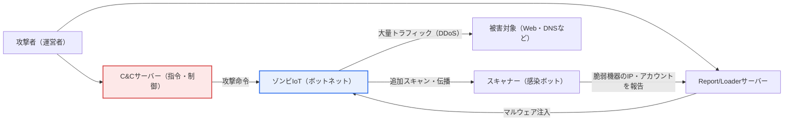
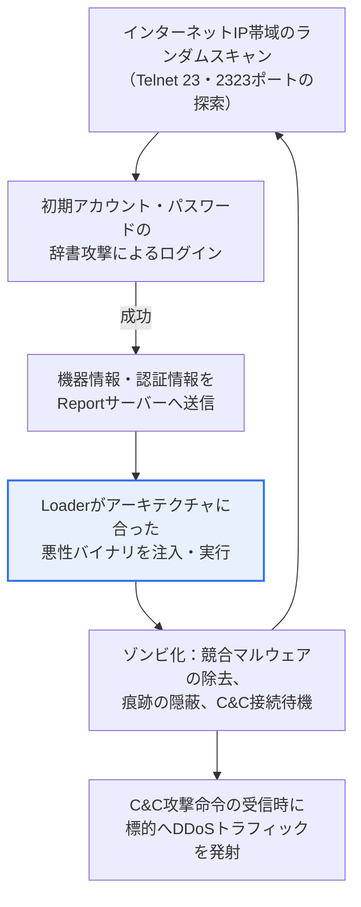

# Miraiボットネット（Mirai Botnet）

## 1. 概要

### A. 概念

> **Miraiボットネット**とは、セキュリティの脆弱な **IoT機器（IPカメラ・ルーター・DVRなど）を初期アカウント・パスワードの辞書攻撃で大量に感染させて遠隔操作可能なゾンビ（bot）とし、指令・制御（C&C）サーバーの命令に従って大規模なDDoS攻撃に悪用するマルウェアおよびボットネット**である。2016年後半に大規模なインターネット麻痺事態を引き起こし、IoTセキュリティの深刻さを世界中に印象づけた代表的な脅威である。

MiraiがIoTセキュリティに警鐘を鳴らした根本的な理由は、「**ずさんに放置されたIoT機器の一つひとつが強力な攻撃兵器になる**」ことを大規模に実証した点にある。従来のボットネットは主に脆弱性の多いPCをマルウェアに感染させて構成されていたが、PCはウイルス対策ソフト・ファイアウォール・定期パッチによってある程度保護され、ユーザーが常駐しているため異常に気づきやすかった。一方、IoT機器は性能が低くセキュリティソフトウェアを搭載しにくく、管理者のいないまま24時間インターネットに接続された状態で何年も放置され、何よりも工場出荷時に設定された初期認証情報がそのまま残っているケースが多かった。Miraiはこの死角を正確に突いた。

Miraiの攻撃手法は、高度なゼロデイ脆弱性ではなく驚くほど単純な方式であったという点で、かえって衝撃的であった。Miraiはインターネットのアドレス空間をランダムにスキャンしてリモート接続ポート（Telnetの23番、2323番）が開いている機器を探し、`admin/admin`、`root/12345`、`root/xc3511`などメーカーがよく使う**数十種類の初期アカウント・パスワードのリスト**を順に試行（brute force）し、ログインに成功するとすぐにマルウェアをダウンロードさせて感染させた。パスワードを変更していない機器がインターネット上に数十万台単位で存在していたため、感染は指数関数的に拡散した。

こうして確保したゾンビが、C&Cサーバーからの一度の命令で一斉に特定の標的へトラフィックを浴びせることで（DDoS）、Miraiは短時間で数百Gbpsから1Tbpsに達する、当時としては前例のない規模の攻撃を生み出した。Miraiは、IoTがもたらす利便性に比べてセキュリティが立ち遅れており、個々の機器の些細な不備が結集すればインターネットインフラ全体を脅かし得ることを示した象徴的な事件である。

### B. 主な攻撃事例と波及

Miraiの危険性は抽象的な懸念ではなく、実際の大規模障害として顕在化した。2016年9月にはセキュリティジャーナリストのサイト（KrebsOnSecurity）に対する約600Gbps級の攻撃、フランスのホスティング事業者OVHを狙った約1Tbpsに達する攻撃が相次ぎ、決定的に **2016年10月には米国の主要DNSサービス事業者Dynを麻痺**させ、Twitter・Netflix・Reddit・Spotifyなど多数の著名サービスが大規模に接続不能状態に陥った。DNSはインターネットの電話帳に相当するため、DNSが1か所崩れると、正常に稼働していたサービスまでがドミノ倒しのように接続できなくなったのである。これは、特定のサイトではなくインターネットの「共用基盤サービス」を狙えば波及がはるかに大きくなるという教訓を残した。

さらにMiraiは、2016年末に**ソースコードがオンラインフォーラムで公開**されたことで、多数の亜種（例：Satori、Okiru、Mozi などとして知られる系統）を生んだ。攻撃手法が大衆化し、誰でも容易にIoTボットネットを構成できるようになったという点で、Miraiは単発の事件ではなく、その後のIoT脅威の「標準設計図」となった。次の表はMiraiの中核的な特徴を整理したものである。

| 特徴 | 内容 |
|---|---|
| **攻撃方式** | Telnetスキャン + 初期アカウント・パスワードの辞書攻撃（brute force）でIoTに感染 |
| **目的** | C&C命令に従った大規模DDoS（SYN・UDP・HTTP・GREフラッディングなど多重ベクトル） |
| **規模** | 最大数十万台のゾンビIoTを動員、数百Gbps〜1Tbps級の攻撃 |
| **波及** | ソースコード公開により多数の亜種が拡散、IoTボットネットの大衆化 |

## 2. Miraiボットネットの感染・攻撃アーキテクチャ

Miraiの動作を理解するには、「感染を広げる過程」と「命令を受けて攻撃する過程」に分けて見る必要がある。次の全体構成図は、ボットネットの構成要素がどのようにつながっているかを示す。

上記の構造で重要なのは、ボットネットが自ら規模を拡大するという点である。すでに感染したゾンビIoTが再びスキャナーの役割を果たして新たな脆弱機器を探索し、発見した機器のIPと通用したアカウントをレポート/ローダーサーバーに送ると、ローダーがその機器にマルウェアを注入して新たなゾンビとして組み入れる。このように感染が自己増殖する構造であるため、初期の封じ込めに失敗するとボットネットは瞬く間に大規模へと成長する。

次のプロセス詳細図は、一台の脆弱な機器が感染し、攻撃に動員されるまでの段階を順に示す。

### A. 感染段階（スキャン・認証情報の試行）

感染の出発点は無差別スキャンである。Miraiボットはインターネットのアドレス空間を高速に走査し、リモート接続用のTelnetポートが開いている機器を探す。Telnetは暗号化なしでリモートログインを提供する古いプロトコルであり、利便性のためにIoT機器で有効化されたまま出荷されることが多かったため、Miraiの第一の標的となった。この段階での防御の要は、「**不要なサービス・ポートを閉じること**」である。そもそもTelnetがインターネットに露出していなければ、試行そのものが成立しないからである。

ポートが開いている機器を見つけると、Miraiは内蔵された数十種類の初期アカウント・パスワードの組み合わせを順に試行する。ここで決定的な脆弱性は技術ではなく「運用慣行」である。メーカーが利便性のために同一の初期パスワードを大量の製品に埋め込み、利用者がそれを変更せず、機器に変更を強制する手順すらなかったため、単純な試行だけでログインが突破された。実際にMiraiが用いた認証情報リストには、特定メーカーの製品群にハードコードされたアカウントがかなりの部分含まれていたと分析されている。

この段階が示す実務上の含意は明確である。IoTを導入する際には「設置直後に初期パスワードを強制変更」させ、可能であれば工場出荷段階から機器ごとに異なる初期パスワード（unique default password）を付与するよう制度化すべきである。実際、その後複数の国で初期・共通パスワードの使用を制限するIoTセキュリティ規制が導入されたのも、Miraiのこの点に端を発している。

### B. 伝播・ゾンビ化段階（マルウェア注入）

ログインに成功すると、ボットは機器の情報と認証情報をレポートサーバーに報告し、ローダー（Loader）がその機器のCPUアーキテクチャ（ARM・MIPS・x86など）に合った悪性バイナリを送り込んで実行する。IoT機器は種類が多様でアーキテクチャもまちまちであるが、Miraiが複数アーキテクチャ向けのバイナリを用意して幅広く感染させることができた点が、拡散力を高めた。

ゾンビとして組み入れられた機器は、自身を保護・隠蔽する動作も行う。他の競合マルウェアやリモート管理プロセスを終了・遮断して機器を「独占」し、プロセス名を偽装したり痕跡を消したりして検知を回避し、再起動すると感染が解ける特性（主にメモリ常駐）のため、継続的に再感染を試みる。この点での防御上の含意は、「**単純な再起動は一時しのぎにすぎず、パスワードを変更しファームウェアを更新しなければすぐに再感染する**」ということである。

この段階はまた、「運用中の継続的管理」の重要性も示している。感染の有無を利用者が察知することは難しく、機器が正常に動作しているように見えても裏で攻撃に動員され得るため、ネットワーク側で異常トラフィックを検知し、既知の悪性C&Cドメイン・IPへの通信を遮断するなど、常時監視の体制が必要である。

### C. 攻撃段階（DDoSの実行）

十分なゾンビが確保されると、攻撃者はC&Cサーバーを通じて標的と攻撃類型を指定して命令を下し、ゾンビが一斉にトラフィックを発射する。MiraiはSYNフラッディング・UDPフラッディング・HTTPフラッディング・GREフラッディングなど多様な攻撃ベクトルをサポートしており、標的の防御方式に応じて類型を変えながら攻撃することができた。このように複数の類型を組み合わせる「多重ベクトルDDoS」は、単一の類型のみを防ぐ防御策を迂回するため、対応を困難にする。

DDoSの本質的な難しさは、トラフィックの一つひとつが「正常なリクエストのように」見える点にある。数十万台の異なるIPから来るリクエストを一律に遮断すれば正常な利用者まで遮断されてしまうため、ボリュメトリック攻撃を吸収・分散するCDN・スクラビングセンター（scrubbing center）と、トラフィックパターンを分析してボットを選別するインテリジェントな防御が併せて必要である。Dynの事例のようにDNSなどの共用インフラが標的となる場合には、冗長化・エニーキャスト構成によって、特定地点の麻痺がサービス全体へ波及しないよう設計することも重要である。

### D. 従来型ボットネットとの比較

Miraiの性格を正確に把握するには、PCベースの従来型ボットネットと対比してみることが有用である。両ボットネットは「多数の感染端末をC&Cで制御して悪用する」という骨格は同じであるが、感染対象と方式・検知の難易度に明確な違いがあり、この違いこそがMiraiがなぜあれほど速く広範に拡散したかを説明する。

| 区分 | 従来型PCボットネット | Mirai（IoTボットネット） |
|---|---|---|
| **感染対象** | PC・サーバー（ウイルス対策・パッチで一部保護） | IoT機器（セキュリティSWの搭載が困難、放置） |
| **感染方式** | 脆弱性エクスプロイト・フィッシング添付など | Telnetの初期アカウント・パスワードの辞書攻撃 |
| **検知・対応** | ユーザー・ウイルス対策ソフトが認知可能 | 管理者不在のため感染の認知が困難 |
| **主な用途** | スパム・情報窃取・DDoSなど多目的 | 当初は大規模DDoSに特化 |

この比較の実務上の含意は、「IoTにはPCとは異なる防御戦略が必要である」という点である。PCセキュリティがウイルス対策ソフトとユーザーの認知に相当程度依存しているとすれば、IoTはそうした防御手段が乏しいため、「設計・設置段階での安全なデフォルト値」と「ネットワーク側での異常検知・遮断」に重点を置くべきである。Miraiが単純な手法でも成功した根本原因は、まさにこの防御の空白にあった。

## 3. IoTサービスのライフサイクル別セキュリティ脅威と対応

IoTセキュリティは特定時点の問題ではなく、機器の全ライフサイクルにわたって確保すべき課題である。Miraiは、「設置時の初期パスワードの放置」と「運用中のアップデート不在」という、ライフサイクル管理の代表的な穴を正確に突いた。次の表は段階別の脅威と対応を整理したものであり、各段階は前後がつながっているため、いずれか一つの段階だけを強化しても安全は確保されない。

| 段階 | セキュリティ脅威 | 対応 |
|---|---|---|
| **設計・開発** | 脆弱な設計、ハードコードされたアカウント、未検証のSW | セキュア設計・コーディング（Security by Design）、基本セキュリティの組み込み |
| **配備・設置** | 初期・共通パスワード、不要ポート（Telnet）の開放 | 初期パスワードの強制変更、最小露出（ポート・サービスの削減） |
| **運用・利用** | 未パッチの脆弱性、マルウェア感染、ボットネットへの組み入れ | 定期的なファームウェア更新、異常検知・アクセス制御 |
| **廃棄** | 残存データ・認証情報の漏えい、放置機器の再悪用 | データの完全消去、認証情報の破棄、回収・無効化 |

特にMiraiの観点から最も脆弱な環は、「配備・設置」と「運用・利用」の段階である。いくら設計段階でセキュリティを組み込んでも、設置時に初期パスワードがそのままであれば無力化され、運用中に脆弱性が発見されてもパッチが配布・適用されなければ攻撃の窓口は開いたままである。したがってライフサイクル管理は「一度きりの措置」ではなく、「継続的な管理体制」としてアプローチしなければならない。

## 4. IoT共通セキュリティ7大原則

IoTセキュリティ強化のために国内外の機関が提示した共通セキュリティ原則は、設計から廃棄までセキュリティを内在化することを求めている。これらの原則は、Miraiが露呈させた穴への直接的な対応策であるという点で、併せて理解するとよい。例えば「安全な初期セキュリティ設定」の原則は初期パスワードの試行を、「最新のセキュリティパッチ」の原則は運用中の放置を狙ったものである。

| 原則（要旨） | 内容 | Miraiの観点からの意味 |
|---|---|---|
| **1. 設計段階でのセキュリティ内在化** | 企画・設計からセキュリティを反映（Security by Design） | ハードコードされたアカウント除去の出発点 |
| **2. 安全なSW・ハードウェア** | 検証された開発・セキュアコーディング | 脆弱なバイナリの実行を阻止 |
| **3. 安全な初期セキュリティ設定** | 初期パスワードの変更など安全なデフォルト値 | 辞書攻撃そのものを無力化 |
| **4. 認証・暗号化の適用** | 相互認証、データ・通信の暗号化 | Telnetなど平文接続の代替 |
| **5. 最新セキュリティパッチ・アップデート** | 継続的な脆弱性対応 | 運用中の放置を防止 |
| **6. 安全な運用・管理** | 異常検知、アクセス制御 | ボットネットへの組み入れを早期検知 |
| **7. 侵害対応・復旧体制** | インシデント対応・安全な廃棄 | 感染拡大の阻止・復旧 |

原則を「項目の羅列」としてだけ暗記しても、実戦では力を発揮しない。重要なのは、各原則が「どの攻撃段階を断ち切るか」を理解することである。Miraiの感染チェーン（スキャン→試行→注入→攻撃）のいずれか一つの環でも断ち切ればボットネット化は阻止されるため、各原則は互いに重なり合う多層防御（defense in depth）として機能する。

## 5. 深掘り — Mirai以後の脅威の変化と規制動向

Miraiが残した最大の遺産は、ソースコード公開による「亜種の時代」である。Miraiの基本骨格（スキャン–試行–ローダー–C&C–DDoS）を再利用しつつ、初期パスワードの試行にとどまらず、**既知の機器脆弱性（CVE）のエクスプロイトを組み合わせ**て感染力を高めた亜種が相次いで登場した。また一部のIoTボットネットは、純粋なDDoSを超えて、暗号資産のマイニング、プロキシとしての悪用、情報窃取などへと目的を多様化させる傾向を見せている。すなわちIoTボットネットは、Miraiを原型として「より多様に感染し、より多様に稼ぐ」方向へ進化してきたと理解するのが妥当である。

規制・標準の面でもMiraiは分水嶺となった。多くの国・機関が、**IoT機器の初期・共通パスワードの使用を制限**し、脆弱性報告の受付窓口の運営、セキュリティアップデートの提供期間の明示などを求める方向で制度を整備した。代表的には、英国は消費者向けコネクテッド機器に対するセキュリティ要件（共通初期パスワードの禁止など）を法制化する流れを見せ、米国・EUもIoTセキュリティのラベリング・認証に関連する政策を推進してきた。韓国でもIoTセキュリティ認証と共通セキュリティガイドが整備され、「セキュリティが検証された機器」を市場が選択するよう誘導する方向へ政策が発展している。（具体的な法令・制度の名称と施行時期は国ごとに異なり、継続的に改正されるため、引用の際は最新の原文を確認することが望ましい。）

技術的対応も進化した。通信事業者・クラウド事業者は大規模なボリュメトリックDDoSを吸収するスクラビング基盤とエニーキャストベースの分散防御を強化し、企業はIoT機器を別セグメントに隔離（network segmentation）して、感染しても内部への拡散や外部攻撃への参加を制限するゼロトラスト志向の設計を採用している。試験答案の観点では、「Miraiの単純さがなぜ通用したのか（運用慣行の穴）」と「その後、防御・規制がどのように多層化したのか」を対比させて記述すれば、深みを示すことができる。

## 6. 考慮事項および示唆点（技術士の観点）

1. **デフォルト値のセキュリティが最初の防御線である。** Miraiが証明したように、初期・共通のアカウント・パスワードの放置が最大の脆弱性であるため、設置時のパスワード強制変更、機器ごとの固有初期パスワードの付与、不要なTelnetなどリモートポートの閉鎖を優先的に適用すべきである。最も単純な措置が最も大きな効果を生む領域である。

2. **ライフサイクル全体にわたる継続的管理が必要である。** IoTは配備後に長く放置されやすいため、リモートファームウェア更新（OTA）とセキュリティアップデート提供期間の明示、脆弱性発見時の迅速な配布体制が不可欠である。「設置したら忘れる」機器には、自動化された管理が解決策である。

3. **集団的脅威・エコシステム責任の観点が重要である。** 個々のIoTは些細でも、大量に結集すればインターネットインフラを脅かすため、メーカー（安全な設計・アップデート）・利用者（初期設定・管理）・通信事業者（異常トラフィックの遮断）・政府（規制・認証）が共に責任を負うエコシステムレベルのセキュリティが求められる。いずれか一つの主体の努力だけでは根絶できない構造的問題である。

4. **多層防御とレジリエンスを設計に反映すべきである。** 感染チェーンの複数の環を同時に断ち切る多層防御（ポート閉鎖＋強固な認証＋パッチ＋異常検知）と、DNSなど共用インフラの冗長化・エニーキャスト、DDoSスクラビング、IoTのネットワーク分離（セグメンテーション）を併用し、「完全な予防」ではなく「被害の最小化と迅速な復旧」までを含む戦略としてアプローチすべきである。

5. **規制・認証の流れを事業戦略に反映すべきである。** 初期パスワードの禁止・セキュリティラベリングなどIoTセキュリティ規制が世界的に強化される傾向にあるため、製品を開発・輸出する組織は、規制遵守をコストではなく市場参入要件かつ信頼資産として認識し、先制的に対応することが有利である。

## 参考資料

- CISA, "Understanding and Responding to Distributed Denial-of-Service Attacks": https://www.cisa.gov/news-events/news/understanding-denial-service-attacks
- Cloudflare Learning, "What is the Mirai botnet?": https://www.cloudflare.com/learning/ddos/glossary/mirai-botnet/
- KrebsOnSecurity, "Source Code for IoT Botnet 'Mirai' Released": https://krebsonsecurity.com/2016/10/source-code-for-iot-botnet-mirai-released/
- 韓国インターネット振興院（KISA）IoTセキュリティ資料室: https://www.kisa.or.kr/

---

> **一言まとめ**: Miraiボットネットは *Telnetポートが開き初期パスワードが放置されたIoT機器を辞書攻撃で大量に感染させ、C&C命令に従って大規模DDoSに悪用* した代表的なIoT脅威であり、感染チェーン（スキャン→試行→注入→攻撃）を多層的に断ち切るライフサイクル別セキュリティ・共通セキュリティ7大原則と、ソースコード公開後の亜種拡散・初期パスワード規制の強化を併せて理解する必要がある。
