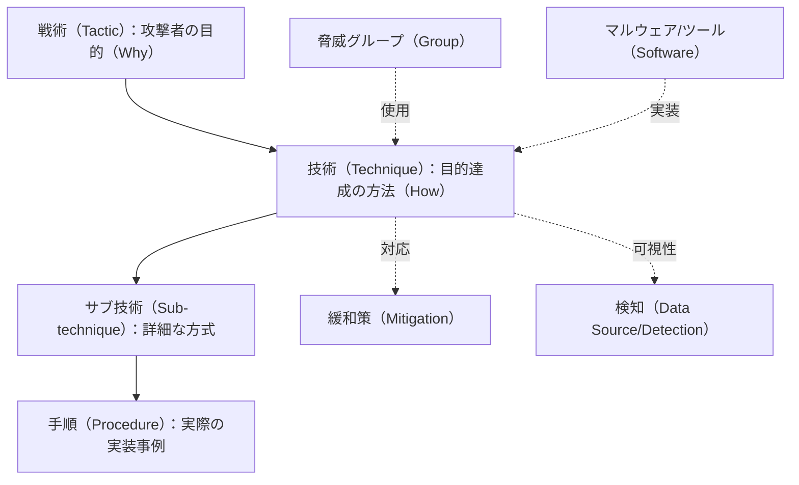
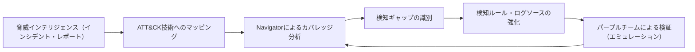

# MITRE ATT&CK（サイバー攻撃の戦術・技術ナレッジベース）

## 1. 概要

> **MITRE ATT&CK（Adversarial Tactics, Techniques, and Common Knowledge）** とは、実際のインシデントで観測された攻撃者の行動を **戦術（Tactic）・技術（Technique）・手順（Procedure）** として体系化した、米国の非営利研究機関MITREが構築・公開している **攻撃行動のナレッジベース**である。

従来のセキュリティ対応は、マルウェアのハッシュ・シグネチャ・IPのような **侵害指標（IoC, Indicator of Compromise）** に依存してきた。しかし攻撃者はハッシュやIPを容易に変更するため、指標ベースの検知は既知の攻撃の使い回しには有効でも、変形・新規の攻撃には脆弱である。セキュリティ実務者は、「攻撃者が何（ファイル・アドレス）を使ったか」よりも「攻撃者が **どのように行動するか**」、すなわち侵入後に権限を昇格させ、内部を移動し、データを持ち出す **行動パターン** のほうがはるかに変えにくいという点に着目した。ATT&CKはまさにこの **観測された実際の行動（Observed Behavior）** を共通言語として整理し、組織が自らの検知・防御能力を攻撃者の視点から点検できるようにする。

ATT&CKは、David Biancoが提示した **痛みのピラミッド（Pyramid of Pain）** の概念と通じている。ハッシュ・IPは攻撃者が容易に変更できるため防御者が与える「痛み」は小さいが、ツール（Tools）と戦術・技術・手順（TTPs）を無力化すれば、攻撃者は作戦方式を根本的に再設計しなければならないため、防御効果が大きい。ATT&CKは、このTTPの階層を標準識別子として一覧化することで、組織ごとにばらばらであった脅威の記述を、相互に比較・共有可能な形へと変えた点に意義がある。

主な特徴は次のとおりである。第一に、**実証ベース（Evidence-based）** であり、理論上の脅威ではなく、公開された脅威インテリジェンスやインシデント報告書で確認された行動のみを登録する。第二に、**マトリクス構造** により戦術（列）と技術（行）を交差させ、攻撃のライフサイクルを一目で俯瞰できる。第三に、**無料・オープン** であり、誰でもWeb・API・STIXで活用できる。第四に、Enterprise・Mobile・ICSなど **ドメイン別マトリクス** へと拡張され、ITだけでなく産業制御システムまで包括する。

## 2. 全体構造と中核的構成要素

ATT&CKの根幹は **戦術–技術–手順（TTP）** の3階層モデルであり、そこに脅威グループ（Group）・ソフトウェア（Software）・緩和策（Mitigation）・検知（Detection）が結びつく。

**戦術（Tactic）** は、攻撃者が特定の段階で達成しようとする **目的** を意味する。Enterpriseマトリクスは、偵察（Reconnaissance）、リソース開発（Resource Development）、初期アクセス（Initial Access）、実行（Execution）、永続化（Persistence）、権限昇格（Privilege Escalation）、防御回避（Defense Evasion）、認証情報アクセス（Credential Access）、探索（Discovery）、ラテラルムーブメント（Lateral Movement）、収集（Collection）、コマンド＆コントロール（Command & Control）、持ち出し（Exfiltration）、影響（Impact）の14の戦術で構成される。各戦術は、「なぜ（Why）」その行動をとるのかを表す上位カテゴリである。

**技術（Technique）** は、戦術の目的を達成する **具体的な方法（How）** であり、`T####` 形式の識別子を持つ。例えば認証情報アクセスの戦術には、認証情報ダンプ（T1003）、ブルートフォース（T1110）などの技術が属する。一つの技術が複数の戦術に同時に属し得るという点が重要であり、例えば有効なアカウントの使用（Valid Accounts, T1078）は、初期アクセス・永続化・権限昇格・防御回避の4つの戦術にまたがっている。これは、攻撃行動が目的によって異なって解釈され得ることを反映している。

**サブ技術（Sub-technique）** は2020年に導入された階層で、`T####.###` 形式を持ち、技術をさらに細分化する。認証情報ダンプ（T1003）は、LSASSメモリ（T1003.001）、SAM（T1003.002）などに分かれる。**手順（Procedure）** は、特定の脅威グループやツールがその技術を実際に **どのように実装したか** に関する事例であり、最も具体的なレベルの情報である。ここに脅威グループ（APT29、Lazarusなど）とソフトウェア（Mimikatz、Cobalt Strikeなど）がタグ付けされ、「どのグループがどのツールでどの技術を使うか」を横断的に追跡できる。

| 区分 | 意味 | 識別子の例 | 例 |
|------|------|-----------|------|
| 戦術（Tactic） | 攻撃の目的（Why） | TA0006 | 認証情報アクセス |
| 技術（Technique） | 達成方法（How） | T1003 | OS認証情報のダンプ |
| サブ技術 | 詳細な方式 | T1003.001 | LSASSメモリ |
| 手順（Procedure） | 実際の実装事例 | — | MimikatzによるLSASSへのアクセス |

## 3. マトリクスのドメインと類似フレームワークの比較

ATT&CKは対象環境に応じて3つの主要マトリクスに区分される。**Enterpriseマトリクス** は、Windows・macOS・Linux・クラウド（IaaS・SaaS・Office 365）・コンテナ・ネットワーク機器を包括する最も広範なドメインである。**Mobileマトリクス** はAndroid・iOS環境の攻撃行動を、**ICSマトリクス** は発電・製造など産業制御システム（OT）特有の攻撃（例：安全装置の無力化、物理プロセスの操作）を扱う。このようにドメインを分けた理由は、各環境の資産・脆弱性・攻撃対象領域が根本的に異なるためであり、特にICSは可用性と安全（Safety）が最優先であるという点で、ITとは防御の優先順位が異なる。

ATT&CKとよく比較されるフレームワークとして、**Lockheed Martinのサイバーキルチェーン（Cyber Kill Chain）** がある。キルチェーンは、偵察→武器化→配送→エクスプロイト→インストール→C2→目的の実行の7段階で攻撃を **線形的** にモデル化する。これに対しATT&CKは、段階の線形的な順序を強制せず、実際の攻撃に現れる **非線形的・反復的** な行動をマトリクスで表現する点が核心的な違いである。実務では、キルチェーンで大きな流れ（戦略的観点）を捉え、ATT&CKで各段階内部の詳細な技術（戦術的観点）をマッピングするという形で相互補完することが多い。

| 区分 | Cyber Kill Chain | MITRE ATT&CK |
|------|------------------|--------------|
| 観点 | 線形の7段階（戦略的） | 非線形のマトリクス（戦術的） |
| 焦点 | 攻撃の進行の流れ | 具体的な行動（TTP） |
| 侵入後の詳細 | 相対的に浅い | 非常に詳細（ラテラルムーブメント・永続化など） |
| 活用 | 全体的な防御コンセプトの設計 | 検知カバレッジ・脅威ハンティング |

ただし両フレームワークが「何をするか」を扱うのに対し、近年は **攻撃者の目標・動機・意思決定** までモデル化するアプローチが補完的に議論されている。例えば防御者の観点に立った対応ナレッジベースである **MITRE D3FEND** や、能動的な欺瞞・対応を扱う **MITRE Engage** は、ATT&CKを防御・欺瞞の側面から拡張した姉妹プロジェクトであり、ATT&CKの攻撃技術と相互にマッピングされて併用される。

## 4. 実務での活用方策

ATT&CKの実質的な価値は **検知能力の可視化** にある。これを支援する中核ツールが **ATT&CK Navigator** であり、マトリクス上に組織の検知・防御の現状を色分けして **カバレッジヒートマップ** を作成する。どの技術が赤いまま（未検知）残っているかが一目でわかるため、セキュリティ投資の優先順位をデータに基づいて決定できる。

第一に、**脅威インテリジェンス（CTI）の構造化** に用いられる。インシデントやAPTの報告書をATT&CKの技術にマッピングすれば、異なる機関の脅威情報を共通言語で比較・集計できる。第二に、**検知ギャップ分析（Gap Analysis）** である。組織のEDR・SIEMの検知ルールを技術にマッピングしてカバーされていない領域を識別し、必要なログソース（例：プロセス生成、PowerShellログ）を強化する。第三に、**脅威ハンティング（Threat Hunting）** の仮説設定の基準として活用する。「我々の環境でT1003のLSASSダンプが発生したら、どのログに痕跡が残るか」を出発点として能動的な探索を行う。

第四に、**敵対的エミュレーション（Adversary Emulation）** と **パープルチーム（Purple Team）** による検証である。MITREが提供する **CALDERA**、オープンソースの **Atomic Red Team** などは、特定の脅威グループのTTPを実際に再現し、検知ルールが機能するかを検証する。例えば金融業界のCSIRTがLazarusグループの公開TTP（スピアフィッシング→PowerShell実行→認証情報ダンプ→ラテラルムーブメント）をAtomic Red Teamで再現した際、3つの段階は検知されたものの、ラテラルムーブメント（T1021）の区間が検知されなかったのであれば、該当するログソースと相関分析ルールを直ちに強化するといった具体的な改善が可能になる。このようにATT&CKは、「我々が何を検知できていないか」を **測定可能な指標** に変えてくれるという点で、SOC成熟度向上の中心軸となる。第五に、セキュリティソリューション導入時にベンダーの検知範囲をATT&CKの技術を基準に要求・比較することで、マーケティング用語に左右されない客観的な評価が可能になる。MITREは実際に商用セキュリティ製品を対象に **ATT&CK Evaluations** を実施し、検知結果を公開している。

## 5. 考慮事項および示唆点

第一に、**カバレッジの錯覚（Coverage Illusion）** に注意しなければならない。Navigatorで特定の技術を「検知可能」と色付けしたからといって、あらゆる変形・回避の手順を捕捉できるという意味ではない。技術レベルのカバレッジと実際の手順レベルの検知力は異なるため、「すべてのマスを緑で埋めること」を目標とするよりも、組織にとって脅威となるグループの **優先度の高い技術** に集中する脅威ベース（Threat-informed）のアプローチが望ましい。

第二に、**適用のトレードオフ** が存在する。ATT&CKのマッピングと検知ルールの維持には、相当な専門人材・ログ保存・分析コストが伴う。成熟度の低い組織が14の戦術全体を一度に扱おうとすると過負荷に陥るため、初期アクセス・認証情報アクセス・ラテラルムーブメントのようにインシデントの波及が大きい少数の戦術から絞って始め、段階的に拡張する戦略が現実的である。ログソースの確保（可視性）が先行しなければ、いかなるマッピングも空虚であるという点にも留意すべきである。

第三に、**自動化・標準との連携** の展望が重要である。ATT&CKはSTIX/TAXIIベースで機械可読であるためSIEM・SOAR・TIPと連携でき、検知ルールの標準である **Sigma** ルールにATT&CKタグを付与してルールと技術を自動的に結びつける流れが広がっている。さらに近年は、生成AIを用いて脅威レポートからATT&CKの技術を自動抽出したり検知ルールを生成したりする試みが増えており、人員負担を緩和する方向へ発展すると見込まれる。ただし自動マッピングの精度検証（人によるレビュー）は依然として必要である。

第四に、**バージョン管理とガバナンス** の観点が必要である。ATT&CKは半年単位で改訂され、技術が追加・統廃合・再分類されるため、組織の検知ルールとマッピングも特定のバージョンを基準に構成管理しなければならない。フレームワークの改訂時にはカバレッジ指標が急変し得るため、バージョン移行の手順と責任組織を明確にする運用ガバナンスが、長期的な活用の鍵となる。究極的にATT&CKは単独のツールではなく、**脅威インテリジェンス–検知–対応–検証** をつなぐ共通言語かつ成熟度の測定尺度として定着しつつあり、キルチェーン・D3FEND・ゼロトラストなど他のセキュリティ体系と有機的に結合したときに効果が最大化する。

## 参考資料

- MITRE ATT&CK 公式サイト — https://attack.mitre.org/
- MITRE ATT&CK Navigator — https://mitre-attack.github.io/attack-navigator/
- MITRE, "ATT&CK Design and Philosophy" — https://attack.mitre.org/resources/
- MITRE D3FEND — https://d3fend.mitre.org/

---
> **一言まとめ**: MITRE ATT&CKは、実際のインシデントで観測された攻撃行動を戦術・技術・手順（TTP）として体系化したオープンなナレッジベースであり、変えやすいIoCの代わりに変えにくい攻撃者の行動に焦点を当て、検知ギャップ分析・脅威ハンティング・敵対的エミュレーション・ソリューション評価の共通言語として活用される。
