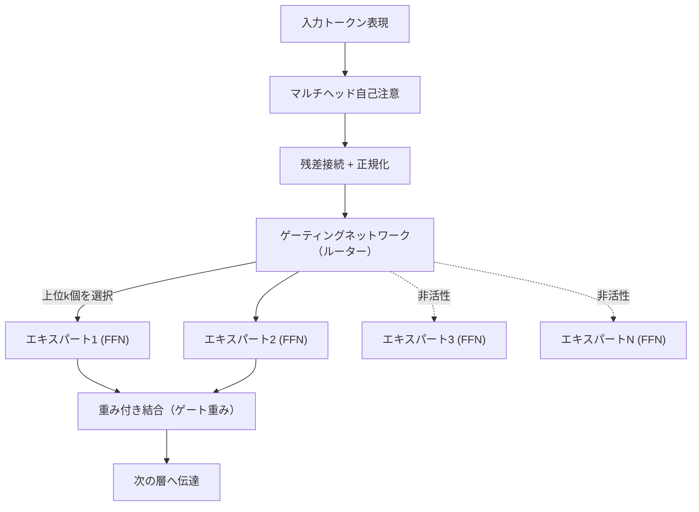
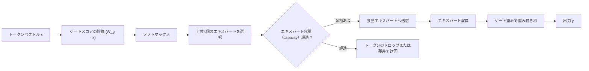

# 混合エキスパートモデル（MoE, Mixture of Experts）

## 1. 概要

> **定義**: 混合エキスパートモデル（MoE）とは、一つの巨大なニューラルネットワークを複数の **エキスパート（Expert）** サブネットワークに分割し、**ゲーティングネットワーク（Gating Network、ルーター）** が入力トークンごとに少数のエキスパートだけを選択的に活性化（sparse activation）して演算を行う、条件付き計算（conditional computation）に基づくアーキテクチャである。

MoEの登場背景は、大規模言語モデル（LLM）が直面する **「パラメータは増やしたいが、計算コストは負担しきれない」** という根本的な緊張関係にある。Transformerは、パラメータとデータを大きくするほど性能が予測可能な形で向上するスケーリング則（scaling law）に従うが、従来の密（Dense）モデルはすべての入力に対して全パラメータを漏れなく計算する。すなわちパラメータを2倍にすれば学習・推論コストもほぼ2倍に増加し、パラメータ規模が数千億を超えると、GPUメモリと電力コストが指数関数的に膨らむ。

MoEはこの問題を、**「モデルの知識容量（総パラメータ）」と「トークン当たりの実際の演算量（活性パラメータ）」を分離** することで解決する。例えばエキスパートが8個あり、トークンごとに2個だけを活性化するなら、モデルは8倍の知識を保持しながらも、演算は2個のエキスパート分しか行わない。これは人間の組織がすべての業務を一人で処理せず、分野ごとの専門家に分業させるのと同じ原理であり、「必要な知識だけを取り出して使う」という発想である。

このような疎な活性化のおかげで、MoEは同一の演算予算（FLOPs）において密モデルよりはるかに大きな実効容量を確保でき、GPT-4・Mixtral・DeepSeek-V3・Geminiなど最新の超大規模モデルの中核的設計として定着した。答案では、MoEを単なる性能向上の手法ではなく、**「演算効率とモデル規模のトレードオフを再定義したスケーリングパラダイム」** として記述するのが妥当である。

## 2. MoEの全体アーキテクチャ

MoEは、Transformerブロック内部の **フィードフォワードニューラルネットワーク（FFN）** 層を、一つの大きなFFNの代わりに複数のエキスパートFFNとルーターで置き換える方式で実装されるのが一般的である。次の概念図は、入力トークンがルーターを経て上位k個のエキスパートに振り分けられ、その出力が重み付き結合されて次の層へ渡される全体の骨格を示す。

**エキスパート（Expert）** は、それぞれ独立したパラメータを持つFFNであり、学習過程で異なる種類のパターン（例：特定の言語、文法構造、ドメイン知識）に自然に特化していく。ただしこの特化は人が明示的に指定するものではなく、データ分布とルーティングの学習を通じて **創発的（emergent）** に形成される点が重要である。実際に、特定のエキスパートがコードのトークンに、別のエキスパートが数式・句読点に偏る現象が観測されている。

**ルーター（ゲーティングネットワーク）** は入力トークンのベクトルを受け取って各エキスパートに対するスコアを計算し、ソフトマックスを経て上位k個のエキスパートを選択する。ルーターは通常一つの線形層であるためパラメータは非常に小さいが、「どのトークンをどのエキスパートに送るか」という決定がモデル性能を左右する核心であるため、MoE設計において最も繊細な部分である。

**結合（Combine）** の段階では、選択されたエキスパートの出力を、ルーターが付与したゲート重みで重み付き和をとる。活性化されなかったエキスパートは計算そのものがスキップされるため、総パラメータがどれほど大きくても、トークン当たりの演算量はk個のエキスパート分に固定される。

## 3. ルーティングメカニズムと動作手順

MoEの成否はルーティングにかかっている。代表的な方式が **Top-kルーティング** であり、GoogleのSwitch Transformerはk=1（最も強いエキスパート一つだけ）で極端な疎性を追求し、Mixtral 8x7Bは8個のエキスパートのうちk=2を選択する。次の図は、トークン単位のルーティングと負荷分散が行われる処理の流れを示す。

動作手順を段階的に見ると次のとおりである。第一に、ルーターがトークンベクトルにゲート重み行列を掛け、各エキスパートに対する選好スコアを算出する。第二に、ソフトマックスで確率化した後、上位k個を選ぶ。第三に、各エキスパートには処理可能なトークン数の上限である **容量係数（capacity factor）** が定められており、特定のエキスパートにトークンが集中して容量を超過すると、あふれたトークンは処理されずにドロップされるか、残差接続で迂回される。第四に、選択されたエキスパートの出力を重み付き和して最終出力を作る。

ここでMoE最大の難題である **負荷不均衡（load imbalance）** が発生する。ルーターが特定の少数のエキスパートばかりを優遇すると、そのエキスパートにはトークンが殺到してドロップが増え、残りのエキスパートは学習されずに「死んだエキスパート」となる。これを防ぐため、学習損失に **負荷分散損失（auxiliary load-balancing loss）** を追加し、トークンがエキスパート全体に均等に分散するよう誘導する。近年DeepSeek-V3は、補助損失が性能を損なう副作用を減らすため、補助損失なしにバイアス項（bias）だけで均衡をとる手法も導入した。

また、ルーティングの決定は学習初期に不安定になりやすいため、ルーターz-lossでゲートのロジットの発散を抑制したり、学習・推論間のルーティングの一貫性を確保したりするなどの安定化手法が併用される。

## 4. Denseモデルとの比較および適用事例

MoEと密（Dense）モデルの違いは、単なる構造の違いを超え、リソース配分の哲学の違いに由来する。密モデルはすべてのトークンに同じ演算を均一に投入するのに対し、MoEはトークンごとに必要なエキスパートにだけ演算を配分する **条件付き計算** を行う。その結果、次のような対照的な特性が現れる。

| 区分 | Denseモデル | MoEモデル |
|------|-----------|----------|
| 活性パラメータ | 全パラメータ = 活性パラメータ | 活性パラメータ ≪ 総パラメータ |
| 演算量（推論） | パラメータに比例して大きい | 活性エキスパート分のみ計算するため小さい |
| メモリ（VRAM） | 活性パラメータ分 | 総パラメータ全体のロードが必要 |
| 学習の安定性 | 安定的 | 負荷不均衡・ルーティング崩壊のリスク |
| ファインチューニング | 容易 | 過学習・不安定性のため難しい |

この比較の要点は、**MoEは「演算は節約するが、メモリは節約できない」** という点である。活性化されないエキスパートもいつ選択されるかわからないため、すべてのパラメータをGPUメモリに載せておかなければならない。したがってMoEは演算（FLOPs）がボトルネックとなる環境では大きな利得をもたらすが、メモリの乏しいオンデバイス・エッジ環境ではかえって不利になり得る。ここで「エキスパート並列化（expert parallelism）」という分散手法が重要になり、エキスパートを複数のGPUに分散配置し、トークンを該当GPUに送る（all-to-all通信）方式でメモリ負担を分け合う。ただしこのall-to-all通信が新たなボトルネックとなり、通信帯域幅がMoEの学習速度を左右する要因となる。

具体的な事例として、**Mixtral 8x7B** は総パラメータが約467億個であるにもかかわらず、トークン当たりの活性パラメータは約129億個にすぎず、130億級の推論コストで700億級の密モデルに匹敵する性能を示した。**Switch Transformer** は最大1.6兆パラメータまで拡張しながらも、トークン当たりの演算は従来のT5水準を維持し、**DeepSeek-V3** は総6710億パラメータのうちトークン当たり約370億だけを活性化するきめ細かな（fine-grained）エキスパート設計によって、学習効率を大きく高めた。このようにMoEは、「同じ演算予算でより大きな知識容量」という実質的な利得を数値で実証している。

## 5. 深掘り：最新動向と設計の進化

MoEの設計は近年、いくつかの方向で精緻化が進んでいる。第一に、**細粒度エキスパート（fine-grained experts）** の潮流であり、少数の大きなエキスパートの代わりに多数の小さなエキスパートを置くことで組み合わせの多様性を高め、知識の特化を促進する。第二に、**共有エキスパート（shared expert）** の導入であり、常に活性化される共用エキスパートに共通知識を担当させ、残りのルーティング対象エキスパートを特化知識に集中させることで、知識の重複を減らす（DeepSeek-MoE）。第三に、学習を妨げていた補助損失を取り除き、バイアス調整だけで負荷を均衡させる **auxiliary-loss-free** 手法が広がっている。

また、密モデルをMoEへ変換する **アップサイクリング（upcycling）**、推論時にルーティングを近似・量子化してサービングコストを下げる最適化、複数のドメイン・モダリティにエキスパートを割り当てるマルチモーダルMoEなども活発に研究されている。こうした流れは結局、「少ない演算でより大きなモデル」というMoEの根本目標を精緻化していく過程として理解でき、技術士の観点からは、ハードウェア（HBM容量・インターコネクト帯域幅）とソフトウェア（ルーティング・並列化）の設計が噛み合って発展している点に注目する必要がある。

## 6. 考慮事項および示唆点

第一に、**演算とメモリのトレードオフの明確な認識** が必要である。MoEは推論演算を減らすが総パラメータをすべてロードしなければならないため、導入前に目標環境が演算ボトルネックなのかメモリボトルネックなのかをまず診断し、クラウドでの大規模サービング（演算ボトルネック）とエッジ・オンデバイス（メモリボトルネック）を区別して適用戦略を立てるべきである。

第二に、**ルーティングの安定性と負荷分散が運用リスク** である。負荷不均衡は死んだエキスパートと性能低下を招くため、負荷分散損失・容量係数・ルーターの正規化などを組み合わせてチューニングし、学習・サービング中のエキスパートごとのトークン分布を常時モニタリングするオブザーバビリティ（observability）体制を整えなければならない。

第三に、**ファインチューニング・ドメイン適応の難しさ** を考慮すべきである。MoEは密モデルよりも微調整時の過学習とルーティング崩壊に脆弱であるため、エキスパートの一部だけを調整したりルーターを凍結したりするなどの慎重な戦略と、十分なデータが求められる。

第四に、**インフラ・コストの観点からの総所有コスト（TCO）の算定** が重要である。活性パラメータ基準の低い推論コストだけを見て導入すると、全パラメータのロードに必要な大容量GPUと高速インターコネクト（NVLink・InfiniBand）への投資、all-to-all通信のオーバーヘッドによって、予想以上にコストが膨らむ場合があるため、FinOpsの観点から演算・メモリ・通信のコストを総合して評価すべきである。

第五に、**展望** として、MoEは超大規模モデルの事実上の標準的なスケーリング手法として定着しつつあり、条件付き計算という原理は今後マルチモーダル・エージェント型モデルでさらに幅広く活用されると見込まれる。ただし「規模を大きくするだけ」のアプローチの限界も併せて議論されており、データ品質・アライメント（alignment）・効率化とのバランスのとれた発展が求められる。

---

> **一言まとめ**: MoEは、ゲーティングネットワークがトークンごとに少数のエキスパートだけを選択的に活性化する条件付き計算によって「総パラメータ（知識容量）」と「活性パラメータ（演算量）」を分離し、同じ演算予算ではるかに大きなモデルを実現する、大規模AIの中核的なスケーリングアーキテクチャである。
