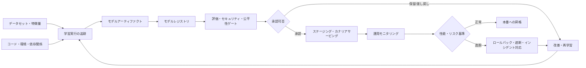
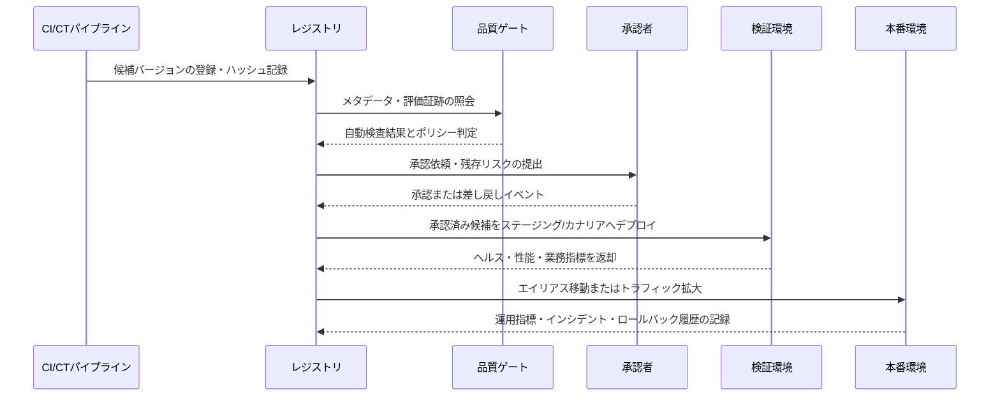

# 機械学習モデルレジストリ（Model Registry）と承認・デプロイのガバナンス

## 1. 概要

> **定義**: モデルレジストリ（Model Registry）とは、機械学習モデルとそのバージョン、学習実行、データ・コードの系譜、評価結果、承認状態、デプロイ参照および運用メタデータを一元管理し、モデルの開発から廃棄までを統制するシステムである。

機械学習プロジェクトが実験段階にとどまっている間は、ノートブックとファイルストレージだけでもモデルを保管できる。
しかし複数のチームが数十以上のモデルを運用するようになると、ファイル名やフォルダだけでは、どのモデルが実際にサービスで使われているかを説明することが難しくなる。
同じ名前のモデルファイルが複数のバケットに存在し、学習データの基準日やコードのバージョンが記録されていなければ、障害が発生したときに結果を再現することができない。

モデルレジストリはこの問題を、「モデルファイルを保存する場所」ではなく「運用可能なモデル資産の基準システム（System of Record）」として解決する。
レジストリに登録されたモデルは単なるバイナリではなく、バージョン、入出力シグネチャ、学習実行、評価指標、依存ライブラリ、セキュリティ検査結果、責任者、承認履歴を持つ管理対象である。
したがってレジストリは、MLOpsパイプラインとモデルリスク管理をつなぐ統制ポイントとなる。

モデルレジストリの核心は、バージョン番号を付けることそのものではない。
どの候補をなぜ登録したのか、どの検証を通過したのか、誰がどの環境へ昇格させたのか、現在トラフィックを受けているバージョンと前のバージョンは何かが追跡されなければならない。
この情報があってこそ、新しいモデルを迅速にデプロイしながらも、問題が生じたときには同じ条件へ戻すことができる。

### 1.1 登場背景と必要性

第一に、モデルの成果物が増えるにつれ、発見可能性と重複防止が必要になった。
チームごとに似たような分類モデルを別々に作れば、データとGPUのコストが重複し、検証されていないモデルが他のサービスで再利用される恐れがある。
中央のレジストリは、名前・所有者・ドメイン・目的・性能を検索可能な形で提供し、再利用と責任の所在を明確にする。

第二に、モデルはデプロイの瞬間に完成する静的なソフトウェアではない。
運用データの分布や業務ルールが変われば性能が変化し、新しい学習データが入れば既存のバージョンとは異なるリスクが生じる。
モデルのバージョンと運用上の観測値を結びつけてこそ、再学習・昇格・ロールバックの判断がデータに基づくものとなる。

第三に、金融・医療・公共分野では、モデルの判断に対する説明と変更履歴が重要である。
精度一つだけを残す方式では、学習データの基準、欠損値の処理、公平性指標、承認者、デプロイ環境を説明することができない。
レジストリは、こうした証跡をモデルバージョンのメタデータと不変の監査ログとして束ねる役割を果たす。

### 1.2 目標と設計原則

モデルレジストリの第一の目標は再現性である。
同じモデルバージョンを同じ入力契約と依存関係でロードし、過去の評価結果と運用結果を再確認できなければならない。

第二の目標は昇格の統制である。
開発者がファイルを本番サーバーにコピーする代わりに、定められた品質ゲートと承認手続きを経たバージョンだけがデプロイ参照となるようにしなければならない。

第三の目標は安全な変更である。
新しいバージョンは既存のバージョンを即座に上書きせずに候補として登録され、オフライン評価・ステージング・カナリア・段階的拡大を通じてリスクを限定しなければならない。

第四の目標はクローズドループの運用である。
デプロイ後のレイテンシ、エラー率、予測分布、実際の性能、バイアスとドリフトを再びレジストリと結びつけ、次の学習と審査に活用しなければならない。

設計時には、不変性、最小権限、自動化、説明可能性、監査可能性を基本原則とする。
特に、モデルファイルを差し替えたとしても、すでに承認されたバージョンの内容と履歴は変わってはならず、移動可能なのはバージョン自体ではなく、承認済みのエイリアスやデプロイポインターでなければならない。

## 2. モデルレジストリの構成と全体ライフサイクル

モデルレジストリは一つのストレージで完結するものではなく、学習追跡システム、アーティファクトストア、データカタログ、評価エンジン、CI/CD・CTパイプライン、サービングプラットフォームと連携する。
レジストリは各システムの原本をすべて複製するよりも、識別子と完全性ハッシュを結びつけて、モデルバージョンがどの成果物から作られたかを追跡する。

### 2.1 レジストリの中核オブジェクト

第一のオブジェクトは登録モデル（Registered Model）である。
登録モデルは「信用リスクスコアモデル」のように業務目的とサービス境界を表す論理名であり、複数のモデルバージョンを収める上位単位である。

第二のオブジェクトはモデルバージョン（Model Version）である。
バージョンは特定の時点に登録された不変の成果物を指し、学習実行の識別子・アーティファクトの場所・入出力契約・評価結果と結びつく。
バージョン番号は便利な識別子にすぎないため、他のシステムでも追跡できるグローバル識別子とコンテンツハッシュを併せて記録するのが安全である。

第三のオブジェクトはエイリアス（Alias）またはデプロイポインターである。
`champion`、`challenger`、`shadow`のように役割を表すエイリアスは特定のバージョンを指すが、エイリアスが移動した履歴は別途残さなければならない。
サービスがエイリアスを参照すればモデルの差し替えは容易になるが、エイリアスだけでは過去の時点の正確なバージョンを説明できないため、デプロイ時点にハッシュとバージョンをログに固定する。

第四のオブジェクトはタグと注釈である。
タグには、ドメイン、個人情報を含むかどうか、承認状態、デプロイ環境、評価ポリシーのバージョン、サポート終了日を構造化して記録する。
自由記述の注釈は人が読むための文脈を提供するが、自動ゲートが判断すべき値は、固定されたキーと許容値で管理しなければならない。

第五のオブジェクトは系譜（Lineage）と証跡である。
系譜は、モデルがどのデータスナップショット、特徴量定義、コードのコミット、実行パラメータ、環境から作られたかを結びつける。
系譜の目的はデータベースのすべての行を複製することではなく、再現に必要な参照点と変更関係を失わないことである。

|オブジェクト|主な内容|運用上の問い|
|---|---|---|
|登録モデル|業務目的、所有者、モデル群、リスク等級|誰がこのモデルに責任を持つのか？|
|モデルバージョン|アーティファクト、バージョン、ハッシュ、入出力契約|現在のバージョンと前のバージョンは何が違うのか？|
|学習実行|データ、コード、パラメータ、実行環境|どのような条件で作られたのか？|
|評価証跡|精度、レイテンシ、公平性、セキュリティ結果|昇格基準を通過したか？|
|エイリアス・デプロイポインター|champion、challenger、環境|どのトラフィックをどのバージョンが受けているか？|
|監査イベント|登録・承認・昇格・ロールバック・廃棄の記録|誰がいつ何を変更したのか？|

表のオブジェクトはそれぞれ独立したテーブルのように見えるが、運用では一つの変更グラフとして扱わなければならない。
モデルファイルだけを新たに登録し、入力スキーマが変わった事実を記録しなければ、バージョン管理は形式にとどまる。
逆に、小さなハイパーパラメータの変更であっても、モデルのリスク等級や承認ポリシーに影響を与えるのであれば、新しいバージョンと再評価が必要である。

### 2.2 ライフサイクルの段階

モデルのライフサイクルは、問題定義、実験、登録、検証、承認、デプロイ、観測、再学習、廃棄の循環として説明できる。
各段階の名称はツールによって異なり得るが、「誰が次の段階へ移行させることができるか」と「どのような証拠が必要か」のほうが重要である。

問題定義の段階では、モデルの使用目的、入力データ、想定ユーザー、意思決定への影響、禁止される用途を宣言する。
この宣言がなければ、同じモデルが推薦の補助なのか自動承認なのかを区別できず、リスク評価と承認基準が揺らぐ。

実験の段階では、学習実行と成果物を追跡する。
実験用モデルは本番モデルと同じ権限を持ってはならず、登録前には合成データまたは制限されたデータで安全に検証しなければならない。

登録の段階では、モデルアーティファクトとメタデータを一緒に保存する。
登録時点で、入出力スキーマ、学習データの基準日、所有者、ライセンス、依存関係、基本的な評価結果が欠落していると、後から復旧することは難しい。

検証の段階では、機能的な精度だけでなく、業務コスト、レイテンシ、安定性、セキュリティ、個人情報、公平性、説明可能性を、モデルの目的に合わせて評価する。
すべてのモデルに同じ指標を強制するよりも、リスク等級と使用文脈に応じて必須・任意の検査を区別する。

承認の段階では、技術レビューと業務・リスクレビューを分離することができる。
開発者は結果を説明できるが、単独で本番承認を下さないようにし、承認者は評価証跡と残存リスクの受容可否を確認する。

デプロイの段階では、モデルバージョン自体を上書きするのではなく、環境ごとのエイリアスやデプロイ宣言を変更する。
こうすれば、以前のバージョンの実行ファイルと記録を保持したまま、トラフィックの比率と承認状態を調整できる。

運用の段階では、性能とデータ品質を観測する。
正解ラベルが遅れて到着する業務では即座に性能を計算できないため、予測分布・入力品質・レイテンシ・エラー・業務上の代替指標をまず監視し、事後の性能と結びつける。

廃棄の段階では、もはやデプロイしないからといってファイルを即座に削除するわけではない。
保存期間、監査の必要性、個人情報の削除ポリシー、再現可能性、ライセンス条件を併せて確認したうえで、アーカイブ・アクセス制限・安全な削除を決定する。

|段階|必須の成果物|通過基準の例|
|---|---|---|
|問題定義|目的、ユーザー、リスク等級、使用制限|業務責任者との範囲合意|
|実験|実行ID、データ・コード参照、パラメータ|実験の再現が可能|
|登録|バージョン、ハッシュ、署名、モデルカード|メタデータの完全性|
|検証|性能・安全性・公平性の結果|ポリシーごとのしきい値を満たす|
|承認|レビュー意見、残存リスク、承認者|分離された承認と監査記録|
|デプロイ|環境、エイリアス、トラフィックポリシー|ヘルスチェック・ロールバック経路の確保|
|運用|モニタリング・インシデント・再学習の記録|SLOとリスク指標の遵守|
|廃棄|アーカイブ・保存・削除の証跡|規定と再現要件の充足|

## 3. バージョン・系譜・評価・昇格の運用設計

### 3.1 再現可能なバージョン管理

モデルのバージョンは、重みファイルだけのバージョンではない。
同じ重みであっても、前処理コード、トークナイザー、ランタイムライブラリ、入力スキーマが異なれば、予測結果が変わり得る。
したがってモデルバージョンには、モデルアーティファクトとともに、前処理・後処理コード、環境イメージ、依存関係のロックファイル、設定、署名とハッシュを結びつける。

バージョンの採番ルールは、組織の変更リスクに合致していなければならない。
パラメータチューニングは新しいバージョンとして登録し、入力契約や出力の意味が変わる場合は別のモデル系列、または互換性の破壊として表示する方式が安全である。
バージョンを再利用したり既存ファイルを差し替えたりすると、過去の承認と運用ログが現在のファイルを指すことになるため、禁止する。

バージョン番号には人が読みやすい連番を用いてもよいが、信頼の根拠はコンテンツアドレスのハッシュと署名である。
レジストリとアーティファクトストアが分離されている場合は、ダウンロード時にハッシュを検証し、署名検証に失敗したモデルは登録・デプロイの段階で遮断する。

### 3.2 系譜とモデルカード

系譜は、データの系譜と実行の系譜を併せて見る。
データの系譜は、ソースイベント、クレンジングルール、特徴量、学習スナップショットを結びつけ、実行の系譜は、コードのコミット、パラメータ、実行者、環境、モデルファイルを結びつける。
2つの系譜が結合されてはじめて、「どのデータとコードで作ったモデルが、どのサービスにデプロイされたのか」という問いに答えることができる。

モデルカードは、技術的な限界と使用条件を人が読める形で説明する。
目的・非目的、学習データの範囲、性能の区間、既知のバイアス、失敗事例、個人情報とライセンスに関する注意事項、連絡先を含めれば、運用者とユーザーは誤用を減らすことができる。

### 3.3 品質ゲートと承認ワークフロー

品質ゲートは単一の精度しきい値ではなく、モデルの目的に応じた多次元的な検査である。
分類モデルであれば、全体の精度に加えて、適合率・再現率・キャリブレーション・グループ別の性能・誤検知のコストを確認できる。
リアルタイムモデルであれば、同じ性能を維持しつつ、レイテンシ、スループット、メモリ、障害時の代替経路が基準に含まれなければならない。

評価データは学習データと分離し、時間の順序と実際の運用分布を考慮する。
過去のデータをランダムに混ぜると、未来の情報を含んだり運用状況を代表しなかったりする恐れがあるため、時系列分割と別途のホールドアウトを適用する。

承認ワークフローは、自動検証と人の判断を組み合わせる。
自動検証は、反復可能な数値・スキーマ・セキュリティの検査に強く、人はビジネスへの影響・説明可能性・例外的な状況・残存リスクの受容可否を判断する。
いずれか一方だけを用いると、自動化されたエラーを急速に拡大させたり、人による承認のボトルネックのために非公式なデプロイが生まれたりする恐れがある。

### 3.4 昇格、カナリアとロールバック

昇格とは、開発・ステージング・カナリア・本番へと続く環境の移行であり、環境名を変えるだけの作業ではない。
各段階でデータアクセス、トラフィック規模、可観測性、承認主体を異なるように設定し、失敗の影響範囲を限定する。

カナリアは、新しいバージョンを一部のトラフィックにだけ接続し、実際の環境で確認する方式である。
単にエラー率だけを見るのではなく、ユーザー層・地域・商品・時間帯ごとの性能と、前のバージョンとの差を確認してこそ、特定の集団への被害を見逃さずに済む。

ロールバックとは、「前のバージョンのファイルを探すこと」ではなく、「検証済みの以前のデプロイポインターに戻し、原因を保全すること」である。
ロールバックのコマンドは冪等に作り、トラフィック切り替え・キャッシュ・特徴量スキーマ・データベース変更の互換性まで併せて確認する。
新しいモデルがすでに外部の意思決定を下していた場合、ロールバックだけでは影響は消えないため、再処理・顧客への通知・手動審査といった対応手順も準備しておく。

## 4. セキュリティ・権限・監査と周辺システムとの連携

モデルレジストリは知識の保管庫であると同時に、高価値のサプライチェーン資産である。
悪意あるモデルや改ざんされた依存関係が登録されると、信頼を得た状態で複数のサービスにデプロイされ得るため、アップロード・承認・デプロイの権限を分離しなければならない。

開発者は候補モデルを登録できるが本番エイリアスを移動できないようにし、運用者はデプロイできるが評価証跡を修正できないようにするといった形で、職務を分離する。
サービスアカウントには必要なプロジェクト・ストア・環境にのみ権限を与え、人のアカウントの長期トークンの代わりに、短期の認証情報と監査ログを用いる。

モデルファイルをデシリアライズする過程は、コード実行の脆弱性につながり得る。
信頼できないファイルを本番ランタイムで直接ロードせず、許可フォーマット・サンドボックス・スキャン・署名検証・隔離された変換ステップを設ける。
モデルレジストリのアクセス制御だけで安全が完成するわけではなく、アーティファクトストア・コンテナイメージ・パイプライン・サービングクラスタにも同じ統制を適用しなければならない。

監査ログには、登録者、登録日時、バージョン・ハッシュ、評価ポリシー、承認者、エイリアスの変更、デプロイ先、ロールバックの理由を残す。
ログは削除・修正が困難なストレージに送り、個人情報が含まれ得る入力と出力は最小化するかマスキングする。

|統制領域|主な統制|失敗時のリスク|
|---|---|---|
|アクセス|RBAC、サービスアカウント、最小権限|無断のモデル差し替え・情報漏えい|
|完全性|ハッシュ、署名、アーティファクトの不変性|改ざんモデルのデプロイ|
|サプライチェーン|依存関係・イメージ・モデルのスキャン|悪性コード・脆弱なライブラリ|
|承認|職務分離、4-eyes、ポリシーゲート|検証なしの本番昇格|
|監査|不変イベント、保存・照会ポリシー|事後の原因・責任追跡の失敗|
|個人情報|メタデータ分類、マスキング、保存期間|規定違反・過度な露出|

## 5. 比較と適用事例

### 5.1 隣接概念との比較

アーティファクトストアは、ファイルを安定して保管し配布することに焦点を当てる。
モデルレジストリは、そのファイルがどのモデルのどのバージョンであり、どの検証と承認の状態にあるかを解釈し管理するレイヤーを追加する。

フィーチャーストアは、学習・推論に用いる特徴量を一貫して提供するプラットフォームである。
モデルレジストリは、その特徴量定義とデータスナップショットを参照して作られたモデルを管理するため、両システムは競合関係ではなく、データからモデルへとつながる系譜の関係にある。

モデルカタログは、組織のモデルを探し説明する検索・一覧機能に重点を置くことがある。
レジストリは、登録・バージョン・承認・デプロイ参照・ロールバックといった実行統制を担うため、カタログがレジストリのメタデータをインデックス化する構成も可能である。

ModelOpsは、モデルのガバナンスと運用体系という、より広い実践概念である。
モデルレジストリはModelOpsを実装する中核システムの一つであるが、組織の役割・ポリシー・リスク受容委員会・運用プロセス全体を代替するものではない。

|区分|主な関心事|モデルレジストリとの関係|
|---|---|---|
|アーティファクトストア|ファイルの保管・配布・複製|モデルファイルの物理的な保存レイヤー|
|実験追跡|実験・実行・パラメータ・指標|モデルバージョンの生成系譜を提供|
|フィーチャーストア|特徴量定義・時点整合・サービング|学習・推論のデータ契約を提供|
|モデルカタログ|モデルの検索・説明・再利用|レジストリのメタデータを利用可能|
|モデルレジストリ|バージョン・承認・デプロイ・ロールバック|運用モデルの基準システム|
|ModelOps|組織のポリシー・リスク・運用ガバナンス|レジストリを含む上位の運用体系|

違いを単に暗記するよりも、流れとして結びつけることが重要である。
データとコードが実験追跡に記録され、モデルファイルがアーティファクトストアに保管され、レジストリがそれをバージョンと承認状態で束ね、サービングプラットフォームが承認済みのポインターを読み取ってデプロイする。
運用モニタリングは再びレジストリに結果を残し、次の昇格と再学習の根拠を作る。

### 5.2 事例：決済不正検知モデル

電子商取引事業者が、1日150万件の決済について不正スコアを計算していると仮定する。
既存のモデルは全体の再現率は高いものの、正常な決済を遮断する誤検知のコストが大きくなっており、最近モバイルチャネルのパターン変化が観測された。

データチームは新しい候補モデルを学習しながら、データの基準日、特徴量のバージョン、コードのコミット、ハイパーパラメータと実行IDを記録する。
候補は`fraud-risk`登録モデルの新バージョンとして登録され、カード番号のような個人情報の原文ではなく、承認された識別子と統計的特徴量のみを参照するよう分類される。

自動ゲートは、ホールドアウトでの再現率、誤検知率、グループ間格差、予測レイテンシ、入力の欠損率、モデル署名の検証を実施する。
業務担当者は遮断金額と顧客の不便のコストを併せてレビューし、セキュリティ担当者は異常入力とモデル抽出のリスクを確認する。

承認された候補は`challenger`エイリアスでステージングにデプロイされ、実トラフィックの5%を受ける。
1時間の間、平均レイテンシとエラー率が基準内にあったとしても、モバイルの新規顧客層で誤検知率が上昇した場合は拡大を中止する。

問題がない場合にのみ`champion`エイリアスを新バージョンに移動させ、その際デプロイイベントに正確なバージョン・ハッシュ・トラフィック比率・承認者を記録する。
2日後、カード会社のポリシー変更により誤検知が急増すると自動アラートが発生し、運用者は以前のchampionバージョンへポインターを戻す。

ロールバック後には、新バージョンのエラー原因と、すでに遮断された取引の影響範囲を分析する。
必要であれば候補データを再検証し、再学習・再承認の前には同じバージョンを再び本番に上げない。
この事例におけるレジストリの価値は、新しいモデルの精度を高めるアルゴリズムではなく、変更を証拠とともに統制し、安全に元に戻す運用体系にある。

## 6. 深掘り：生成AIと規制・サプライチェーンへの拡張

生成AIモデルのレジストリは、重みのバージョンを管理するだけでは不十分である。
基盤モデル、ファインチューニングデータ、システムプロンプト、検索インデックスのバージョン、ツール権限、安全ポリシー、評価データ、トークンコストとレイテンシを併せて結びつけてこそ、実際のサービスの変更を説明できる。

LLMアプリケーションでは、モデルのバージョンが同じでも、プロンプトテンプレートや検索対象文書が変われば出力が変わる。
したがってレジストリの対象はモデルからAIシステムのリリースへと拡張し得るものであり、モデル・プロンプト・RAGインデックス・ガードレールを一つのデプロイバンドルとして識別する方式が適している。

評価も、単一の精度から、安全性・有害性・ハルシネーション・ツール使用・プロンプトインジェクション耐性・コスト・レイテンシの組み合わせへと拡張する。
自動評価の結果は人によるサンプルレビューとともに保管し、評価セット自体の汚染とデータの利用権を確認しなければならない。

規制対応においては、特定の法律のチェックリストをレジストリにそのままコピーするよりも、リスク等級ごとの必須メタデータと承認証跡をマッピングする。
高リスクの意思決定モデルには、人による監督、説明、異議申し立て、性能・バイアスのモニタリングとインシデント対応を、より厳格に求めることがある。
規定の適用範囲と施行時期は管轄とサービスによって異なるため、法務・コンプライアンスのレビューと最新の原文確認を並行して行わなければならない。

サプライチェーンの観点からは、モデルレジストリをSBOM・ML-BOM・データ系譜・脆弱性管理と結びつける。
モデルバージョンに含まれるライブラリと基盤モデルを把握しておけば、脆弱性やライセンスの変更が発生したときに影響を受けるデプロイを迅速に特定できる。

## 7. 考慮事項および示唆点

### 7.1 中央統制と開発速度のバランス

すべての実験を重い審査にかけると、開発者はレジストリを迂回したり個人のストレージを使ったりするようになる。
逆に本番モデルまで自由な登録を許せば、承認・監査の機能が無力化される。
実験・低リスク・高リスクのモデルを区別し、リスクが高くなるほどメタデータと承認レベルを強化する段階的なポリシーが現実的である。

### 7.2 不変性、再現性、コストのトレードオフ

モデルとデータをすべて永久保存すれば再現性は高まるが、保存・個人情報・ライセンスのコストが増加する。
コンテンツハッシュ、スナップショット参照、保存期間、再現に必要な最小限のメタデータを組み合わせ、規定とビジネス上の重要度に見合った保存戦略を設計する。

### 7.3 品質ゲートの実効性

しきい値が実際の業務コストと結びついていなければ、高スコアのモデルが現場で失敗し得る。
精度とともに、誤検知・見逃しのコスト、処理レイテンシ、ユーザーへの影響、障害時の手動代替手順を指標として定義し、モデルごとにどのゲートが遮断条件であるかを明確にする。

### 7.4 運用のオブザーバビリティとロールバックの準備

モデルのバージョンを知っているだけでは障害は解決できない。
入力品質、特徴量の鮮度、出力分布、レイテンシ、エラー、実ラベルでの性能、エイリアス移動イベントを、一つの時間軸で照会できるようにする。
ロールバックはデプロイ前にリハーサルし、スキーマ互換性・キャッシュ・データベース変更・外部への影響まで点検する。

### 7.5 セキュリティと個人情報の最小化

レジストリにはモデルとデータの機微な関係が表れ得るため、誰もがすべてのメタデータを閲覧できるようにしてはならない。
モデルのリスク等級と個人情報の分類はタグで管理するが、タグ自体に顧客の原文や秘密鍵を入れてはならない。
署名・検証・職務分離・不変ログを、サプライチェーン統制のベースラインとする。

### 7.6 技術士の観点からの連携戦略

レジストリはMLOpsのツール導入の問題ではなく、データガバナンス、DevSecOps、ITSM、リスク管理と結びついたエンタープライズアーキテクチャの課題である。
組織はまずモデル一覧と所有権を整備し、共通のメタデータとAPIを定義したうえで、高リスクの業務から承認・デプロイ・モニタリングのクローズドループを適用すべきである。
長期的には、モデル・データ・プロンプト・ポリシーの関係を統合したAI資産カタログへと発展させるが、すべてを一つの製品に依存させないオープンな連携が必要である。

## 参考資料

1. MLflow, “ML Model Registry” — https://mlflow.org/docs/latest/ml/model-registry/
2. Google Cloud, “Introduction to Model Registry” — https://docs.cloud.google.com/gemini-enterprise-agent-platform/machine-learning/model-registry/introduction
3. NIST, “AI Risk Management Framework” — https://www.nist.gov/itl/ai-risk-management-framework
4. NIST AI RMF Playbook, “Secure” — https://airc.nist.gov/airmf-resources/airmf/5-secure

---

> **一言まとめ**: モデルレジストリはモデルファイルを集めておくストレージではなく、バージョン・系譜・評価・承認・デプロイ・モニタリング・ロールバックを結びつけて、機械学習を信頼できる運用資産にする基準システムである。
