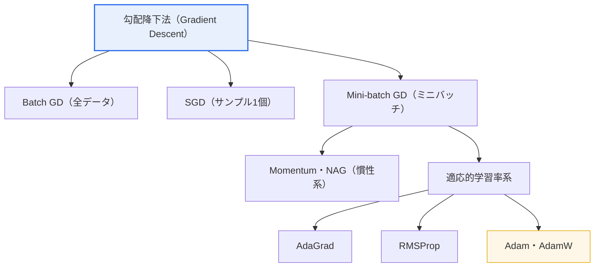

# 機械学習の最適化アルゴリズム（Optimization Algorithm）

## 1. 概要

### A. 定義

> **機械学習の最適化アルゴリズム**とは、モデルの **損失関数（Loss Function）を最小化するパラメータ（重み・バイアス）を反復的に探索していく** 手続きである。その多くは、損失関数の勾配（gradient）を用いて誤差が減少する方向へパラメータを更新する勾配降下法（Gradient Descent）を基盤としている。

最適化アルゴリズムを理解するうえで最もよい直観は、「**霧のかかった山で最も低い谷を探して下りていくこと**」である。損失関数は、パラメータの値に応じて予測誤差がどれだけかを表す地形（loss landscape）であり、学習とはその地形で最も低い地点（最小誤差）を探すことである。各地点での勾配は最も急に「上る」方向を教えてくれるため、その逆方向へ一歩ずつ下りていけば誤差が減少する。

ここでアルゴリズムごとに異なるのは3つの選択である。第一に「一歩をどれだけ大きく踏み出すか」（学習率、learning rate）、第二に「これまで下ってきた方向の慣性をどれだけ維持するか」（モーメンタム）、第三に「パラメータごとに歩幅を変えるか」（適応的学習率）である。この3つの選択をどう組み合わせるかが、収束速度と安定性を決定する。学習率が大きすぎれば谷を通り過ぎて振動したり発散したりし、小さすぎれば収束が極端に遅くなり、地形が起伏に富んでいれば浅いくぼみ（局所最小、local minimum）や平坦な鞍点（saddle point）に閉じ込められることがある。最適化アルゴリズムの発展史は、すなわちこの3つの問題をいかに緩和してきたかの歴史である。

### B. 登場背景と必要性

従来の統計モデルでは、正規方程式のように最適解を数式で一度に求められる場合が多かった。しかし深層学習モデルは数百万〜数千億個のパラメータを持ち、損失関数が高度に非線形・非凸（non-convex）であるため、閉形式の解を求めることは計算上不可能である。例えば大規模言語モデルはパラメータが数十億〜数千億個に達し、逆行列を計算する方式はそもそも成立しない。したがって **初期値から出発して少しずつ改善していく反復的（iterative）最適化** が唯一の現実的な方法であり、その効率が学習にかかる時間・コストと最終的なモデル性能を直接左右する。

また、データ規模が大きくなるにつれ、全データを一度に処理する方式は限界に突き当たった。数百万〜数十億件の学習データを更新のたびにすべて走査することはメモリ・演算の面で負担しきれないため、データの一部だけを標本として用いて勾配を推定する **確率的（stochastic）・ミニバッチ方式** が標準となった。現代の最適化アルゴリズムは、この「標本に基づく推定」のノイズをいかに扱うかを中心に設計されている。

結局のところ、最適化アルゴリズムは学習の「エンジン」に相当する。同じモデル構造とデータであっても、どのオプティマイザと学習率戦略を用いるかによって、数日かかっていた学習が数時間に短縮されることもあれば、まったく収束しないことも、逆にはるかに高い精度に到達することもある。それほど最適化は、深層学習の性能とコストを左右する中核的な軸である。

## 2. 勾配降下法の原理と系統

勾配降下法の更新規則は、本質的に一つの式に要約される。新しい重みは、現在の重みから「学習率 × 損失関数の勾配」を引いた値である（θ ← θ − η∇L）。ここでη（イータ）が学習率、∇Lが勾配である。この単純な式をどう拡張・補完するかによって系統が分かれる。以下は勾配降下法の系統の全体構成図である。

勾配降下法はまず、**1回の更新にどれだけのデータを使うか** で分かれる。**Batch GD** は全データで勾配を計算するため方向が正確で収束が安定しているが、データが大きいほど一歩ごとに全体を走査しなければならず、非常に遅くメモリ負担も大きい。例えば100万件のデータがあれば、パラメータを1回更新するために100万件すべての勾配を平均しなければならないため、一歩を踏み出すのにかかるコストが過大である。

**SGD（確率的勾配降下法）** は逆に、サンプル1個ごとに更新するため非常に高速で、オンライン学習（データが流入するそばから即座に学習）が可能であるが、1サンプルの勾配は全体の勾配の非常に粗い推定値であるため、方向が大きく揺れ動く。この揺れは短所である一方、逆説的に、浅い局所最小を揺さぶって抜け出させる正則化効果をもたらすこともある。

**Mini-batch GD** は、32・64・256のような適度な大きさのまとまり（バッチ）で更新することで速度と安定性のバランスをとった方式であり、今日の深層学習の事実上の標準である。1バッチの勾配は全体の不偏（unbiased）推定値でありながらノイズがSGDより小さく、何よりもバッチ単位の行列演算がGPUの大規模並列処理とぴたりと合致するため、ハードウェアの活用度が高い。すなわちミニバッチは、統計的な理由とハードウェア上の理由の双方から標準となったのである。

### A. 慣性（Momentum）系

ミニバッチのノイズと地形の起伏の問題を緩和するために登場したのが **モーメンタム** である。物理的な慣性のように、以前の更新方向を一定の比率（通常0.9）で累積し、現在の更新に加える。こうすることで、谷の緩やかな方向には速度がついて加速し、左右に振動する成分は互いに打ち消し合って小さくなる。その結果、狭く長い谷（ravine）の地形において、ジグザグせずに素早く底に向かって滑り下りていく。

モーメンタムを一段改良したものが **NAG（Nesterov Accelerated Gradient）** である。NAGは現在の位置ではなく、慣性によって「先に移動するであろう予想位置」で勾配を計算する。すなわち一歩先を見越して方向を修正するため、谷を通り過ぎそうであればあらかじめ減速し、振動をよりよく抑制する。この「先読み（lookahead）」の性質により、凸問題において理論上の収束速度がより速いことが知られている。

慣性系は、局所最小・鞍点からの脱出にも役立つ。勾配がほぼ0の平坦な鞍点では純粋な勾配降下法は止まってしまうが、慣性があれば以前の速度でその地点を突き抜けて抜け出すことができるからである。ただし慣性が過剰だと最小点を通り過ぎて再び振動し得るため、モーメンタム係数と学習率を併せて調整しなければならない。

実際の事例として、画像分類の標準ベンチマークであるImageNetの学習において、ResNet系モデルは長らく「SGD + Momentum（係数0.9）+ 段階的な学習率減衰」の組み合わせで学習されてきた。純粋なSGDだけでは収束が遅く振動も大きいが、モーメンタムを加えると狭く長い損失の谷に沿って安定的に加速し、収束が速まり最終精度も改善する。これは、慣性が単なる速度向上の手法を超えて、最終的な汎化性能にまで寄与することを示す代表的な例である。

### B. 適応的学習率（Adaptive）系

もう一つの改善の軸は、**パラメータごとに学習率を異なるように調整すること** である。**AdaGrad** は、各パラメータがこれまでに受けてきた勾配の二乗の累積和で学習率を割る。頻繁に更新されたパラメータは歩幅を小さくし、まれにしか更新されないパラメータ（例：出現頻度の低い単語の埋め込み）は大きな歩幅を維持する。そのため、疎なデータ（sparse data）で特に有利である。しかし累積和は増え続ける一方であるため、学習が進むにつれて学習率が0近くまで急減し、学習が早期に止まってしまうという短所がある。

**RMSProp** は、この急減の問題を解決する。勾配の二乗を際限なく累積する代わりに、**最近の値に指数加重移動平均** を適用して過去を徐々に忘れ、最近の勾配の大きさに合わせて学習率を調整する。その結果、学習の後半でも適切な歩幅を維持し、非定常（non-stationary）・非凸の地形で安定して動作するため、再帰型ニューラルネットワークの学習などで広く用いられた。

**Adam（Adaptive Moment Estimation）** は今日最も広く使われている汎用オプティマイザであり、**モーメンタム（1次モーメント、勾配の平均）とRMSProp（2次モーメント、勾配の二乗の平均）を組み合わせる**。すなわち方向の慣性とパラメータごとの適応的学習率を同時に取り入れ、学習初期のバイアスを補正する項まで備えている。ハイパーパラメータのデフォルト値（η=0.001、β₁=0.9、β₂=0.999）でもほとんどの問題で高速かつ安定して収束するため、深層学習の基本的な選択肢となった。一方、Adamには重み減衰（weight decay）を不正確に適用するという問題があり、これを分離して是正した **AdamW** が、Transformer・大規模言語モデルの学習の事実上の標準として定着した。

### C. 更新規則とハイパーパラメータの直観

3つの系統の更新規則を一か所で比較すると、違いが明確になる。純粋な勾配降下法は `θ ← θ − η·g`（gは勾配）であり、現在の勾配だけを見る。モーメンタムは `v ← βv + g; θ ← θ − η·v` であり、過去の方向vを累積する。適応的系統は `θ ← θ − (η / √(累積勾配二乗 + ε))·g` のように分母に勾配の大きさを置き、パラメータごとに歩幅を自動調整する。Adamは、この2つのアイデアを一つの式にまとめたものと見ることができる。

これらの式において実務者が操作するつまみは、結局のところ学習率η、モーメンタム係数β、そして数値安定のための小さな定数εである。ηは「歩幅」であるため最も敏感であり、βは通常0.9付近でうまく動作し、ε（例：1e-8）は0除算を防ぐ安全装置であるため大きなチューニング対象ではない。このように各ハイパーパラメータが更新式のどの位置で何の役割を果たすかを理解していれば、学習が発散したり停滞したりしたときに何を調整すべきかを診断できる。

すなわちオプティマイザの選択は、「現在の勾配だけを見るか、過去の方向を慣性として加えるか、パラメータごとに歩幅を分けるか、この3つをすべて組み合わせるか」という設計上の決定に還元される。この視点を持っていれば、新しいオプティマイザが登場しても、それがこの3つの軸のうち何をどう変形したのかという観点から素早く理解できる。

## 3. 類型別の比較

次の表は、系統ごとの原理と長所・短所を整理したものである。ただし表はあくまで要約であり、実際の選択は「なぜそのような違いが生じるのか」の理解から導かれる。

| アルゴリズム | 原理 | 長所 | 短所 |
|---|---|---|---|
| **Batch GD** | 全データで更新 | 正確・安定した収束 | 大規模データで遅い・メモリ負担 |
| **SGD** | サンプル1個ずつ更新 | 高速・オンライン学習 | 方向の振動が激しい |
| **Mini-batch GD** | ミニバッチ単位で更新 | 速度と安定性のバランス（標準） | バッチサイズのチューニングが必要 |
| **Momentum/NAG** | 慣性で振動を緩和・加速 | 収束の加速・鞍点からの脱出 | モーメンタム係数が追加される |
| **AdaGrad** | 勾配二乗の累積で学習率を調整 | 疎なデータに有利 | 学習率の急減・早期停止 |
| **RMSProp** | 最近の勾配で学習率を調整 | AdaGradの急減を補完 | 学習率のデフォルト値に敏感 |
| **Adam / AdamW** | Momentum + RMSProp | **汎用・高速な収束** | 汎化性能の低下の可能性（AdamWで補完） |

この比較において実務上最も重要な対比は、**Adam vs. SGD+Momentum** である。Adamは収束が速くハイパーパラメータにあまり敏感でないため、プロトタイプ開発や研究の反復に有利である。一方、画像分類のような課題では、**SGD+Momentumのほうが最終的な汎化（テスト精度）でより優れた結果** を出す場合が多いことが知られている。その理由として、SGDの大きなノイズがモデルを損失地形の「平坦で広い最小（flat minima）」へと導き汎化に有利に働くのに対し、Adamは狭く急峻な最小に収束して過学習のリスクがある、という仮説が提示されている。実際、大規模なImageNetの学習ではSGD+Momentumに学習率スケジュールを組み合わせる方式が長らく標準であり、Transformer系ではAdamWが標準であるという点は、「問題の類型によって最適なアルゴリズムが異なる」ことを示している。

この対比を実感できるもう一つの例が、Transformer系の学習である。BERT・GPTのようなモデルは学習初期のパラメータが極めて不安定であるため、純粋なSGDでは事実上収束させることが難しく、AdamWに線形ウォームアップ（例：最初の1万ステップの間、学習率を0から目標値まで線形に増加）とその後の減衰を組み合わせてはじめて安定して学習される。逆に、同じAdamWの設定を残差接続の強い小型CNNにそのまま用いると、かえってSGD+Momentumよりテスト精度が数%ポイント低くなることもある。このように「アーキテクチャ・データ・規模の組み合わせ」が最適なアルゴリズムを決定し、正解はベンチマーク比較を通じて経験的に探すのが原則である。

2つ目に注目すべき対比は、**バッチサイズと学習率の関係** である。バッチサイズを大きくすると勾配推定が正確になり学習が安定するが、ノイズが減って汎化が悪化することがあり、並列効率は向上する。経験的に、バッチサイズをk倍にすれば学習率もおおよそk倍（線形スケーリング）または√k倍にするのがよいことが知られているが、これはバッチが大きくなるほど一歩の方向がより信頼できるものとなり、歩幅を大きくできるからである。大規模分散学習で数千個のGPUを用いてバッチを大きくする際には、ウォームアップとともにこの規則を適用する。

## 4. 深掘り：学習率スケジューリングと最新動向

実務において最適化の性能を分ける決定的な要素は、アルゴリズムの選択に劣らず **学習率スケジューリング** である。固定の学習率よりも、序盤に学習率を徐々に上げる **ウォームアップ（warmup）** と、その後段階的に下げる **減衰（decay）** を組み合わせる方式が広く用いられている。ウォームアップは学習初期のパラメータが不安定なときに大きな歩幅で発散するのを防ぎ、コサイン減衰（cosine annealing）のような後半の減衰は、最小点付近で歩幅を小さくして精密に収束させる。Transformerの学習において「線形ウォームアップ後のコサイン減衰」は、ほぼ標準的な手順となっている。

最近の動向としては、大規模モデルの学習を狙ったオプティマイザが活発に研究されている。**LAMB**・**LARS** は、バッチサイズを数万規模にまで大きくした超大規模分散学習において層ごとに学習率を調整して安定性を確保するものであり、BERTの学習時間を大幅に短縮した事例として知られている。また、オプティマイザの状態（モーメント推定値）がパラメータの数倍に及ぶメモリを占有する問題を緩和するため、オプティマイザの状態を8ビットに量子化する **8-bit Adam**、状態を低ランク（low-rank）で近似する **Adafactor** など、メモリ効率の高い手法が大規模言語モデルの学習に用いられている。これらはいずれも「限られたリソースでより大きなモデルを学習する」という現実的な要求から生まれたものであり、最適化が単なる理論を超えて、システム・ハードウェアと噛み合う領域であることを示している。

また、最適化は **正則化・初期化・バッチ正規化** と切り離して考えることはできない。バッチ正規化（BatchNorm）や層正規化（LayerNorm）は損失地形を滑らかにし、より大きな学習率を安全に使えるようにし、適切な重みの初期化（He・Xavier）は初期の勾配消失・爆発を防いで、最適化が円滑に始まるよう助ける。すなわち良い最適化結果は、アルゴリズム一つではなく、これらの要素の組み合わせから生まれる。

実務では、学習がうまく進んでいるかどうかを損失曲線（loss curve）で診断する。損失が発散したり急激に跳ねたりすれば学習率が大きすぎ、あまりにも緩やかにしか減らなければ学習率が小さいか局所的な停滞に陥っている。訓練損失は減り続けているのに検証損失が再び上がり始めたら過学習の兆候であるため、早期終了（early stopping）を検討する。このように最適化は「設定して終わり」ではなく、学習過程を観察しながら学習率・バッチ・正則化をフィードバックによって調整する反復的なチューニング作業である。このフィードバックの感覚こそが、最適化アルゴリズムの知識を実際の性能に変える中核的な能力である。

## 5. 考慮事項および示唆点

1. **実務のデフォルトはAdam/AdamWとしつつ、問題の類型を考慮する。** 高速かつ安定した収束によってほとんどの深層学習で優先的に選択されるが、画像分類のように汎化が重要な課題ではSGD+Momentumのほうがより良いテスト性能を出すこともある。Transformer・LLMにはAdamWが事実上の標準である。「万能のオプティマイザは存在しない」という観点から、課題・データの特性に合わせて選択・比較する戦略が必要である。

2. **学習率とスケジューリングが最も重要なハイパーパラメータである。** オプティマイザの種類よりも、学習率の大きさと時間に応じた調整（ウォームアップ・コサイン減衰など）が性能を左右する場合が多い。学習率の探索（LR range test）とスケジュール設計に優先的にリソースを投入するのが効率的である。

3. **局所最小・鞍点よりも汎化が中核的な関心事である。** 高次元の非凸地形では、完全な大域最小よりも、鞍点と「平坦な最小 対 鋭い最小」の問題のほうが本質的である。慣性・適応的学習率によって鞍点を脱出しつつ、最終目標は訓練損失の最小化ではなく検証・テスト性能（汎化）であることを忘れず、早期終了・正則化と併せて調整しなければならない。

4. **リソース制約と最適化設計を併せて考慮する。** 大規模モデルでは、オプティマイザ状態のメモリ使用量、分散学習時のバッチサイズ・通信コスト、混合精度（mixed precision）との相互作用がオプティマイザの選択に影響を与える。8-bit Adam・Adafactorなどのメモリ効率化手法と、バッチと学習率のスケーリング規則を理解することが、大規模学習の成否を分ける。

5. **再現性と実験管理を確保する。** 最適化は乱数による初期化・データの順序・バッチ構成によって結果が変わるため、シードの固定・ハイパーパラメータの記録・実験追跡ツールによる体系的な管理が不可欠である。技術士の観点からは、個々のアルゴリズムの暗記よりも、「なぜそのアルゴリズムがその問題に適しているのか」をトレードオフの観点から説明する能力が重要である。

## 参考資料

- Kingma & Ba, "Adam: A Method for Stochastic Optimization" — https://arxiv.org/abs/1412.6980
- Loshchilov & Hutter, "Decoupled Weight Decay Regularization (AdamW)" — https://arxiv.org/abs/1711.05101
- Ruder, "An overview of gradient descent optimization algorithms" — https://arxiv.org/abs/1609.04747

---

> **一言まとめ**: 機械学習の最適化は、損失を最小化するパラメータを勾配の逆方向に反復探索する勾配降下法の系統であり、*データ使用量（Batch・SGD・Mini-batch）・慣性（Momentum・NAG）・適応的学習率（AdaGrad・RMSProp・Adam/AdamW）* のトレードオフを持ち、Adam/AdamWが汎用的なデフォルトであるものの、問題の類型と学習率スケジューリングが最終性能を左右する。
