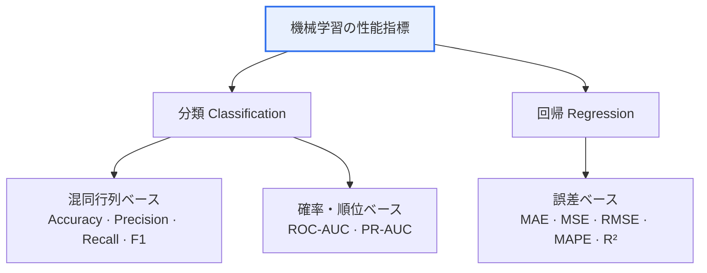

# 機械学習（Machine Learning）の性能指標

## 1. 概要

### A. 定義
> 学習済みモデルの **予測性能を定量的に測定・比較** するための指標であり、問題の類型（分類/回帰）とビジネス目的に応じて適切な指標を選択しなければならない。

性能指標は、モデルが「どれだけよく当てるか」を一つの数値に要約し、学習・選択の判断基準を提供する。しかし単一の数値は、常に情報を圧縮すると同時に何かを隠してしまう。例えば正解率（Accuracy）だけを見ると、データが不均衡な場合にモデルの実際の無能さを覆い隠してしまうことがある。したがって、指標を **なぜ、いつ使うのか** を理解し、複数の指標を併せて見ることが核心である。

### B. 登場背景および必要性
モデル開発は、学習・ハイパーパラメータのチューニング・モデル選択という無数の意思決定の連続であり、これらを客観的に比較するには共通の物差しが必要である。また、同じ誤分類であっても **コストが異なる**。がんを見逃すこと（FN）と健常者を患者と誤診すること（FP）の代償が異なるように、ビジネス目的によって最適化すべき指標が変わる。性能指標はこうした目的別の最適化を可能にし、データの不均衡・過学習といった問題を診断して、モデルの **汎化性能** を判断する根拠となる。

## 2. 指標の分類体系



性能指標は、予測対象がカテゴリ（class）か連続値かによって、**分類指標** と **回帰指標** に分かれる。分類指標はさらに、予測が当たったかを数える混同行列ベースの指標と、しきい値に関係なくモデルの順位付け能力を見る確率・順位ベースの指標に分かれる。回帰指標は、予測値と実測値の誤差の大きさをさまざまな方式で集計する。

## 3. 混同行列（Confusion Matrix）

分類指標の多くは混同行列から派生する。混同行列は予測と実際の組み合わせを4つのマスに分けた2×2の表であり、ここから得られるTP・FP・FN・TNの関係を理解すれば、すべての分類指標を導出できる。FPを統計学の **第1種の過誤**（陰性を陽性と誤って判断）、FNを **第2種の過誤**（陽性を見逃す）に対応させると、誤分類の性質が明確になる。

| 区分 | 実際 Positive | 実際 Negative |
|---|---|---|
| **予測 Positive** | TP (True Positive) | FP (False Positive, 第1種の過誤) |
| **予測 Negative** | FN (False Negative, 第2種の過誤) | TN (True Negative) |

## 4. 分類（Classification）の性能指標

各指標は、混同行列のどの部分を強調するかが異なる。適合率（Precision）は「陽性と予測したもののうち本当に陽性であるもの」を見るため、**誤った陽性（FP）のコスト** が大きいときに重要であり、再現率（Recall）は「本当の陽性のうち見逃さなかった割合」を見るため、**見逃し（FN）のコスト** が大きいときに重要である。F1はこの2つの調和平均であり、どちらか一方に偏ると値が大きく下がるため、不均衡データにおいてバランスを評価するのに適している。

| 指標 | 公式 | 意味 | 活用場面 |
|---|---|---|---|
| **正解率** Accuracy | `(TP+TN) / 全体` | 全体のうち正しく予測した割合 | クラスが均衡したデータ |
| **適合率** Precision | `TP / (TP+FP)` | Positive予測のうち実際に正解である割合 | FPのコストが大きい場合（スパム分類） |
| **再現率** Recall（感度） | `TP / (TP+FN)` | 実際のPositiveを見逃さなかった割合 | FNのコストが大きい場合（がん診断） |
| **特異度** Specificity | `TN / (TN+FP)` | 実際のNegativeを正しく当てた割合 | 正常の判別が重要な場合 |
| **F1 Score** | `2·(P·R) / (P+R)` | 適合率・再現率の調和平均 | 不均衡データ、P・Rのバランス |
| **ROC-AUC** | ROC曲線の下の面積 | しきい値全般にわたる分類能力（0.5〜1） | しきい値に依存しない総合評価 |
| **PR-AUC** | Precision-Recall曲線の面積 | 少数クラスの性能 | 極端な不均衡データ |

> **Precision-Recall Trade-off**: 分類のしきい値（threshold）を下げると、より多くのものを陽性と判定するため再現率↑・適合率↓となり、上げると適合率↑・再現率↓となる。2つの指標は根本的に相反するため、目的に合った均衡点（しきい値）を定めることが実務の核心である。

ROC-AUCとPR-AUCは、特定のしきい値ではなく **しきい値の全範囲** における性能を一つに要約する。ROC-AUCはしきい値に依存しない総合評価に有用であるが、陰性が圧倒的に多い **極端な不均衡** データでは楽観的に見えることがあり、その場合はPR-AUCのほうがより正直な指標となる。

### ROC曲線（例）

```chart
{
  "type": "line",
  "data": {
    "datasets": [
      {
        "label": "モデルのROC (AUC ≈ 0.9)",
        "data": [{"x":0,"y":0},{"x":0.05,"y":0.55},{"x":0.1,"y":0.72},{"x":0.2,"y":0.85},{"x":0.4,"y":0.93},{"x":0.6,"y":0.97},{"x":1,"y":1}],
        "borderColor": "#2f6fed",
        "backgroundColor": "rgba(47,111,237,0.12)",
        "fill": true,
        "tension": 0.3
      },
      {
        "label": "ランダムの基準線 (AUC = 0.5)",
        "data": [{"x":0,"y":0},{"x":1,"y":1}],
        "borderColor": "#9aa4b2",
        "borderDash": [6, 4],
        "pointRadius": 0,
        "fill": false
      }
    ]
  },
  "options": {
    "plugins": { "legend": { "position": "bottom" }, "title": { "display": true, "text": "ROC曲線 — 左上に近いほど優秀" } },
    "scales": {
      "x": { "type": "linear", "min": 0, "max": 1, "title": { "display": true, "text": "FPR (1 − 特異度)" } },
      "y": { "min": 0, "max": 1, "title": { "display": true, "text": "TPR (再現率)" } }
    }
  }
}
```

ROC曲線は、しきい値を連続的に変えながら再現率（TPR）と偽陽性率（FPR）の関係を描いたものであり、曲線が **左上に近いほど** 優れている。曲線の下の面積（AUC）が0.5であればランダムな推測の水準であり、1に近いほど完全な分類に近い。

## 5. 回帰（Regression）の性能指標

回帰指標は、誤差をどう扱うかによって性格が分かれる。MAEは誤差の絶対値を平均するため外れ値に頑健で解釈が直観的である一方、MSE・RMSEは誤差を二乗して **大きな誤差により大きなペナルティ** を与えるため、外れ値に敏感である。そのため、大きな誤差を特に避けたいならRMSEを、外れ値の影響を小さくしたいならMAEを見る。

| 指標 | 公式（概念） | 特徴 |
|---|---|---|
| **MAE**（平均絶対誤差） | `mean(|y − ŷ|)` | 外れ値の影響を受けにくい、解釈が直観的 |
| **MSE**（平均二乗誤差） | `mean((y − ŷ)²)` | 大きな誤差に大きなペナルティ、外れ値に敏感 |
| **RMSE**（二乗平均平方根誤差） | `√MSE` | 元の単位に復元、実務の標準指標 |
| **MAPE**（平均絶対パーセント誤差） | `mean(|y − ŷ| / |y|)·100` | 比率（%）で比較、0付近の値に弱い |
| **R²**（決定係数） | `1 − SS_res/SS_tot` | 説明力（0〜1）、1に近いほど優秀 |

RMSEは平方根をとることで予測対象と同じ単位に戻るため、実務では標準のように用いられ、R²はモデルがデータの分散をどれだけ説明するかを0〜1で表すため、スケールの異なる問題を比較する際に有用である。

## 6. 考慮事項および示唆点（指標選択ガイド）

技術士の観点から、性能指標の選択とは **ビジネスのコスト構造を数式に翻訳する** 作業である。指標を誤って選ぶと、よく当てているように見える無用なモデルをデプロイしてしまう。

1. **データ不均衡** の場合はAccuracyが歪むため、F1・PR-AUCを用いる（例：99%が正常である不正検知）。
2. **FNのコストが大きいドメイン**（医療・セキュリティ）では、見逃しを減らすRecallを優先する。
3. **FPのコストが大きいドメイン**（スパム・レコメンド）では、誤検知を減らすPrecisionを優先する。
4. しきい値に依存しない総合評価が必要であれば、ROC-AUCを見る。
5. 回帰ではRMSE（敏感）とMAE（頑健）を併せて見て、スケール間の比較にはR²・MAPEを活用する。
6. **単一指標の盲信は禁物** であり、複数の指標を相互に確認し、交差検証（cross-validation）によって汎化性能を確認しなければならない。

---

> **一言まとめ**: 性能指標は *分類（混同行列ベース＋確率・順位ベース）* と *回帰（誤差ベース）* に分かれ、データの特性と誤分類のコスト構造に合った指標を選択し、複数の指標を相互に確認することが核心である。
