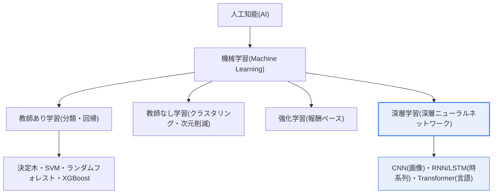

# 機械学習(Machine Learning)と深層学習(Deep Learning)の違い

## 1. 概要

### A. 定義
> **機械学習**とは、明示的なルールを人間が一つひとつプログラミングすることなく、**データからルール・パターンを自ら学習**して予測・分類・クラスタリングを行う人工知能手法の総称である。
>
> **深層学習**とは、**多層人工ニューラルネットワーク(深層ニューラルネットワーク、Deep Neural Network)** を用いて、生データから低水準から高水準までの特徴を階層的に自動学習する**機械学習の一分野**である。

### B. 包含関係と本質的な違い
両概念の関係は **AI ⊃ 機械学習 ⊃ 深層学習** という包含構造であり、深層学習は機械学習の部分集合である。したがって「機械学習と深層学習のどちらが優れているか」という問いは成立せず、正確には「機械学習という大きな枠組みの中で、従来型の手法と深層ニューラルネットワークの手法がどのような条件でそれぞれ有利か」を問うのが正しい。

両者を分ける最も決定的な違いは**「特徴(Feature)を誰が作るか」**である。従来の機械学習では、人間がドメイン知識を動員して「何が予測に重要な変数か」を直接設計しなければならない。これを**特徴量エンジニアリング(Feature Engineering)** と呼び、モデル性能の大部分がこの段階の品質に左右される。例えば猫の写真を分類するには、かつては人間が「耳の形・ひげの本数・目の位置」といった特徴を数値として定義する必要があった。つまり従来の機械学習の成否は「人間がどれだけ良い特徴を抽出できるか」にかかっていた。

一方、深層学習は生データ(例:画像のピクセル)をそのまま入力すれば、**ニューラルネットワークの層が自ら特徴を発見**する。前段の層は線・エッジのような低水準の特徴を、中間層は目・耳のような部分形状を、後段の層は猫の顔のような高水準の概念を学習する。このようにデータから表現そのものを学習する能力を**表現学習(Representation Learning)** と呼び、これが深層学習が画像・音声・自然言語といった非構造化データで革新をもたらした根本原理である。

### C. 登場の背景と必要性
深層学習のルーツである人工ニューラルネットワークと誤差逆伝播法(Backpropagation)の概念は1980年代にすでに確立されていたが、長らく実用化されなかった。これは、(1) 学習させるデータが不足しており、(2) 多層ニューラルネットワークを学習させる計算資源がなく、(3) 層が深くなると勾配が消える**勾配消失(Vanishing Gradient)** 問題により学習自体が困難だったためである。

この三つの障壁が2010年代に同時に崩れたことで、深層学習が爆発的に普及した。第一に**大量データ**がインターネット・モバイル・センサーを通じて蓄積され(例:ImageNetデータセットの約1,400万枚のラベル付き画像)、第二に**GPU並列演算**が大規模な行列演算を可能にし、第三に**アルゴリズムの革新**(ReLU活性化関数、Dropout、Batch Normalization、そして2017年のTransformer構造)が勾配消失と過学習の問題を解決した。この三拍子が揃い、2012年のImageNetコンテストで深層学習(AlexNet)が誤り率を劇的に低下させた出来事を起点として、画像・音声・自然言語において人間並みの性能を実現した。

## 2. 階層構造と技術の全体像

以下の概念図は、AI–機械学習–深層学習の包含関係と各階層の代表的手法を示す。機械学習はさらに学習方式によって教師あり・教師なし・強化学習に分かれる。

### A. 従来型機械学習のパイプライン
従来の機械学習は明確に分離された段階で構成される。生データ収集 → **前処理・特徴量エンジニアリング(人間主導)** → モデル学習 → 評価 → デプロイという流れに従い、このうち特徴量エンジニアリングが性能のボトルネックであり核心である。例えば不正取引検知では、「直前1時間の決済回数、普段の決済地域との距離」といった派生変数を人間が設計して投入しなければならない。

従来の機械学習の強みは、**少ないデータでも動作**し、決定木・ロジスティック回帰のようにモデルがルール形式であるため**判断根拠を人間が解釈**できる点である。また、CPUだけでも学習が可能でありインフラ負担が小さい。構造化(テーブル)データが中心の金融・製造品質管理・需要予測などでは、依然としてXGBoost・LightGBMのようなブースティング系が深層学習より優れるか同等である場合が多い。

### B. 深層学習の学習原理
深層学習は特徴量エンジニアリングの段階をニューラルネットワーク内部に吸収する。以下の流れは、深層ニューラルネットワークが順伝播(予測)と逆伝播(誤差に基づく重み更新)を繰り返しながら自ら特徴表現を学習する過程を示す。

深層学習の学習とは、予測値と正解の差(損失、Loss)を計算し、その誤差を出力層から入力層の方向へ送り返しながら(誤差逆伝播)、各層の重みを**勾配降下法(Gradient Descent)** で少しずつ調整する過程を数百万〜数十億回繰り返すことである。層が深く広いほど表現力は大きくなるが、その分学習に膨大なデータと演算が必要となる。このため深層学習は**GPU・HBM(広帯域メモリ)** のような高性能ハードウェアを事実上の前提とする。

### C. 深層学習の代表的構造と適用
深層学習はデータの形態に応じて特化した構造を用いる。**CNN**(畳み込みニューラルネットワーク)は局所的なパターンを捉えて画像・医用画像解析に、**RNN/LSTM**は順序情報を扱って時系列・音声に、**Transformer**はアテンション機構で文脈全体を並列処理して自然言語・大規模言語モデル(LLM)に用いられる。特に2017年に発表されたTransformerは、今日のGPT・BERT系大規模言語モデルの共通基盤となり、深層学習を生成AI時代へと導いた決定的な構造である。

各構造が特定のデータに強い理由も、表現学習の観点から説明できる。CNNはフィルタ(カーネル)を画像全体で共有することで「位置が異なっても同じパターンは同じ特徴」という**平行移動不変性**を自動的に学習するため、人間がピクセル特徴を設計していた従来の方式より圧倒的に優れている。RNN・LSTMは前の時点の出力を次の時点の入力にフィードバックして**時間的文脈**を記憶するが、長いシーケンスでは勾配消失が再発する限界があった。Transformerのアテンションはこれを克服し、文中のすべての単語ペアの関係を一度に並列計算することで、長距離依存性と学習速度を同時に改善した。このように深層学習の発展史は、「どのようなデータ構造をニューラルネットワークが自らうまく表現できるようにするか」の進化過程として理解できる。

### D. 開発・運用方式の違い
両アプローチは開発と運用(MLOps)の方式でも分かれる。従来の機械学習は、特徴量エンジニアリング–モデル選択–ハイパーパラメータチューニングが比較的短いサイクルで繰り返され、学習が軽いため再現・デバッグが容易である。一方、深層学習は大規模分散学習、GPUクラスタのスケジューリング、実験追跡、大容量データのバージョン管理など、はるかに重いパイプラインを要求する。したがって深層学習の導入は、アルゴリズムの選択を超えてデータ・インフラ・運用体制全般の準備度を併せて考慮しなければならず、この準備が不十分であれば、性能が良くても実サービスの安定化に失敗しやすい。

## 3. 詳細比較と事例

機械学習と深層学習は、特徴抽出の方式だけでなく、データ・資源・解釈性・開発方式の全般において分かれる。その違いは単純な優劣ではなく、**問題の性質(データの種類・量・説明要求)** に応じた適合性の問題である。以下では項目ごとに「なぜそのような違いが生じるのか」と「実務において何を意味するのか」を併せて説明する。

### A. データ量と性能曲線の違い
従来の機械学習は、データがある水準を超えると性能が緩やかに飽和する傾向がある。人間が作った特徴の表現力に上限があるためである。一方、深層学習はモデル規模とデータがともに大きくなるほど性能が向上し続ける**スケーリング則(Scaling Law)** を示し、これが大規模言語モデルがデータ・パラメータを拡大する方向へ発展した理論的根拠である。ただし、データが数千件程度と少ない場合、深層学習は過学習に陥り、従来の機械学習よりむしろ劣る。したがって「利用可能なデータ規模」が両アプローチを分ける第一の判断基準となる。

### B. 資源・コストと解釈性のトレードオフ
深層学習の高い性能は、GPU・電力・学習時間というコストを代償として得られる。数百万〜数十億のパラメータを学習・サービングするには相当なインフラが必要であり、これはそのまま総保有コスト(TCO)の負担につながる。同時に、パラメータが複雑に絡み合って判断根拠を人間が追跡しにくいブラックボックスとなるため、規制・監査・責任所在が重要なドメインでは導入の障壁となる。逆に従来の機械学習はコストが低くルール形式で解釈が容易であるため、「精度はやや低くても説明可能な」方が求められる領域では依然として優位にある。

| 区分 | 従来の機械学習 | 深層学習 |
|---|---|---|
| **特徴抽出** | 人間が設計(Feature Engineering) | モデルが自動学習(表現学習) |
| **データ量** | 比較的少なくても可能(数千〜数万) | 大量に必要(数十万〜数億) |
| **演算資源** | 低い(CPUで可能) | 高い(GPU/HBMが事実上必須) |
| **学習時間** | 短い | 長い(数時間〜数週間) |
| **代表モデル** | 決定木・SVM・ランダムフォレスト・XGBoost | CNN・RNN/LSTM・Transformer |
| **解釈性** | 比較的高い(ルール形式) | 低い(ブラックボックス) |
| **適合データ** | 構造化・小規模 | 非構造化(画像・音声・自然言語) |

この表の各項目は互いに因果関係で結びついている。深層学習が大量データを要求する理由は、人間が特徴を与えない代わりに、膨大な事例から特徴を統計的に自ら見つけ出さなければならないためである。パラメータが数百万〜数十億個に及ぶため、それを支えるデータと演算が大きくなり、その結果「なぜそのような判断をしたのか」を人間が追跡しにくい**ブラックボックス**となる。逆に従来の機械学習は人間が特徴を精製して与えるため少ないデータでも学習でき、モデル構造が単純で解釈が容易である代わりに、非構造化データでは人間が良い特徴を抽出しにくく、性能の限界に突き当たる。

### C. 開発生産性と保守の観点
従来の機械学習は特徴の意味が明確であるため誤りの原因を特定しやすく、データ分布が変化した際にどの変数が影響しているかを診断しやすい。深層学習は性能低下の原因がデータ・構造・ハイパーパラメータのどこにあるのかを把握しにくく、実験的なチューニングに多くの時間を要する。したがって、組織のデータサイエンス成熟度が低いほど、従来の機械学習で素早く価値を検証した後、データ・インフラが整った段階で深層学習へ拡張する段階的アプローチが実務的に有効である。

**具体的な三つの事例**で選択基準を整理できる。第一に、銀行の信用評価は数千〜数万件の構造化データであり、「なぜ融資が拒否されたのか」を規制上説明しなければならないため、ロジスティック回帰・XGBoostのような従来の機械学習が適している。第二に、数十万枚の胸部X線画像から病変を検出する課題は、ピクセルという非構造化データであり、データも豊富であるため、CNNベースの深層学習が圧倒的に優れている。第三に、顧客問い合わせの自動応答は自然言語の文脈理解が核心であるため、TransformerベースのLLMが適している。すなわち、データが構造化・少量で説明が必要なら従来の機械学習、データが非構造化・大量で性能が最優先なら深層学習、という実務上の判断基準が導かれる。

## 4. 深化 — 解釈可能性・転移学習・基盤モデル

深層学習の実務への普及は、二つの最新の流れによってその弱点を急速に補完しつつあり、技術士の観点から併せて扱う必要がある。

第一に、**説明可能なAI(XAI)** である。金融・医療・公共のように規制が強い領域では、「正確だが説明不可能な」深層学習をそのまま用いることは難しい。これを補完するため、特定の予測に各入力変数がどれだけ寄与したかを事後的に説明する**LIME・SHAP**、画像においてモデルが注目した領域を可視化する**Grad-CAM**などが活用される。EU AI Actなどの規制が高リスクAIに説明義務を課す流れと相まって、解釈性は深層学習導入の必須要件となりつつある。

第二に、**転移学習(Transfer Learning)と基盤モデル**である。かつて深層学習の参入障壁であった「大量データ・膨大な演算」の問題は、大規模に事前学習(pre-training)された汎用モデルを持ち込み、少量のドメインデータで**ファインチューニング(fine-tuning)** する方式によって大きく緩和された。例えば数億枚で事前学習された画像モデルや大規模言語モデルを、特定の病院の数百枚のデータだけで再学習して実用的な性能を得ることができる。これにより深層学習は少数のビッグテックの専有物から脱し、一般企業も活用可能な技術として普及しつつあり、これは**AutoML**(モデル探索の自動化)とともに、従来の機械学習と深層学習の開発方式の境界を曖昧にしている。

## 5. 考慮事項および示唆(技術士の観点)

1. **問題特性に基づく技術選択戦略**:深層学習が常に優れているという誤解に注意しなければならない。構造化・小規模データでは、従来の機械学習(特にブースティング系)の方がより速く正確であり、解釈性まで提供する。データの種類・規模・説明要求を基準に選択することが核心である。

2. **解釈性と規制対応のトレードオフ**:性能(深層学習)と説明可能性(従来のML)はしばしば相反するため、高リスク・規制領域ではXAI手法を組み合わせるか、解釈可能なモデルを優先的に検討するなど、トレードオフを明示的に管理しなければならない。

3. **データ・インフラ投資とTCO**:深層学習はGPU/HBM・電力・MLOpsパイプラインなど総保有コスト(TCO)が大きいため、転移学習・軽量化(量子化・プルーニング)・クラウド活用によってコストを統制する戦略が必要である。

4. **データガバナンスとバイアス管理**:両手法とも学習データのバイアスをそのまま学習するため、データ品質・代表性・個人情報保護を含むガバナンス体制と、継続的な性能モニタリング(データドリフト対応)が必須である。

5. **連携技術と組織能力**:深層学習の実効性は、MLOps(再学習・デプロイの自動化)、生成AI(LLM)の活用、そしてドメイン専門家とデータサイエンティストの協業体制に左右されるため、アルゴリズムの選択を超えて組織レベルのAI運用能力の確保を併せて考慮しなければならない。

## 参考資料
- Krizhevsky et al., "ImageNet Classification with Deep CNNs"(AlexNet, NeurIPS 2012): https://papers.nips.cc/paper_files/paper/2012/hash/c399862d3b9d6b76c8436e924a68c45b-Abstract.html
- Vaswani et al., "Attention Is All You Need"(Transformer, 2017): https://arxiv.org/abs/1706.03762
- EU AI Act(高リスクAIの透明性・説明義務): https://artificialintelligenceact.eu/

---

> **一言まとめ**: 深層学習は機械学習の部分集合であり、人間が特徴を設計する従来の機械学習とは異なり*深層ニューラルネットワークが特徴を階層的に自動学習(表現学習)* する。大量データ・GPUを要求し解釈性が低い代わりに非構造化データで優れているため、データの種類・規模・説明要求など問題の特性に合わせて選択すべきであり、XAI・転移学習によって弱点が補完されつつある。
