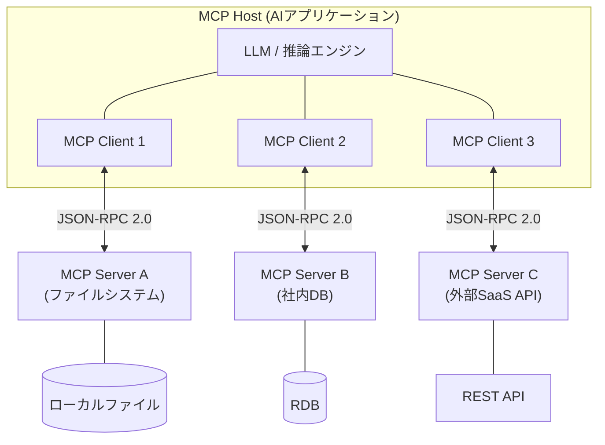
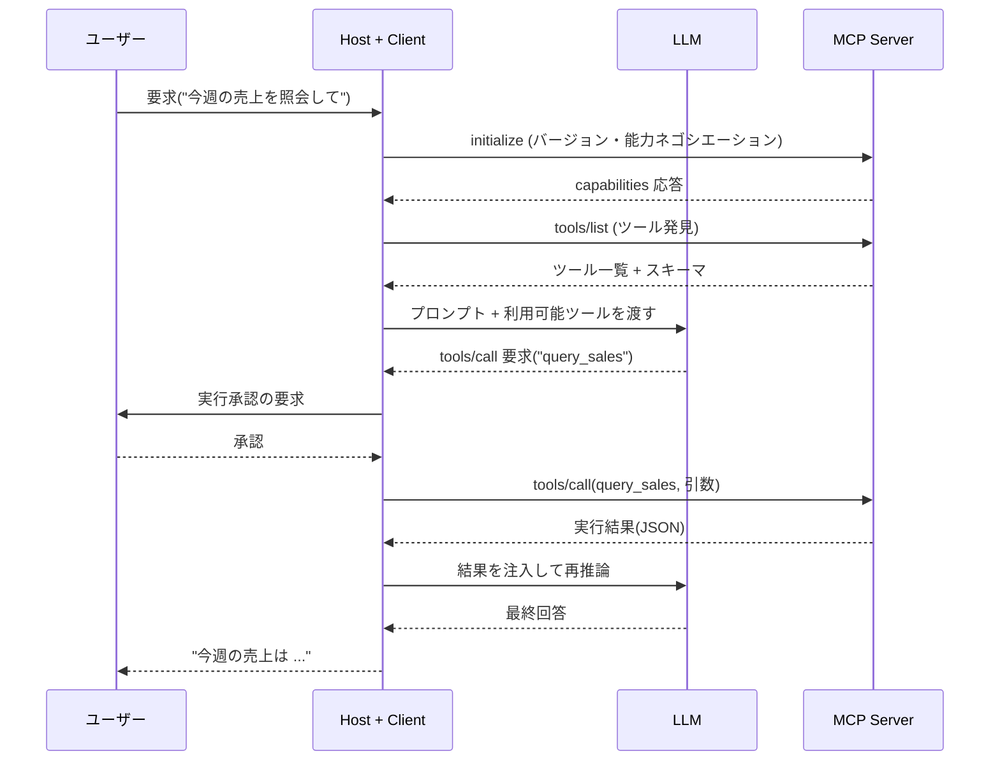

# MCP(Model Context Protocol)

## 1. 概要

> **定義**: MCP(Model Context Protocol)は、LLMベースのAIアプリケーションが外部のツール・データ・プロンプトといったコンテキストを**標準化された方式で接続**するために提案されたオープンプロトコルであり、JSON-RPC 2.0のメッセージ規約の上で**Host–Client–Server**構造により動作する「AIのための統合インターフェース」である。

生成AIが実際の業務に投入されるにつれ、最大のボトルネックはモデルの性能そのものではなく、**モデルが企業内部のデータ・システム・ツールに安全にアクセスする手段の欠如**であった。LLMは学習時点以降の情報を知らず(知識の断絶)、社内DB・ファイル・SaaS・社内APIから隔離されているため、そのままでは「議事録を要約してJiraにチケットを作成せよ」という要求を遂行できない。従来はこれを解決するため、アプリケーションごとに独自の関数呼び出し(Function Calling)スキーマを定義し、データソースごとにコネクタを個別に実装していたが、これはいわゆる**M×N統合問題**を生んだ。すなわち、M個のAIアプリケーションとN個のツールをつなぐためにM×N個の個別連携を毎回新たに作らねばならず、ツールが一つ変わればそれを使用するすべてのアプリケーションを修正しなければならないという保守地獄が発生する。

MCPはこの問題を**USB-Cに例えられる「標準ポート」**によって解決する。ツール提供者はMCPサーバーを一度だけ実装しておけば、MCPをサポートするすべてのAIアプリケーション(Host)がそれを再利用でき、AIアプリケーション開発者はMCPクライアントを搭載するだけでエコシステム上の多数のサーバーに即座に接続できる。結果として統合の複雑さは**M×NからM+Nへ**と減少し、ツールとモデルの結合度が下がって、それぞれが独立して進化できるようになる。このオープン性により、MCPは特定ベンダーの製品ではなく、複数のIDE・エージェントフレームワーク・商用アシスタントが共通して採用する事実上の連携標準として急速に普及しつつある。

MCPの特徴は次のように整理される。第一に、**オープンかつモデル非依存の標準**であり、特定のLLMやベンダーに縛られない。第二に、**JSON-RPC 2.0**ベースの明確なメッセージ規約と能力ネゴシエーション(capability negotiation)により相互運用性を保証する。第三に、ツールだけでなく**リソース(データ)とプロンプト(テンプレート)まで**、コンテキストの3要素を標準化する。第四に、ローカル(stdio)とリモート(HTTP)の**トランスポート層を分離**しており、配置形態に柔軟である。

## 2. MCPの全体構造と構成要素

MCPは、ユーザーと向き合うAIアプリケーションである**Host**、その中でサーバー1つと1:1のセッションを維持する**Client**、実際のツール・データを公開する**Server**の3層で構成される。Hostは複数のClientを生成して異なるServerに並列に接続し、各Client-Serverのペアは独立したセキュリティ境界を形成する。

**A. Host(ホスト)** — Hostは、Claude Desktop、Cursor・VS CodeのようなIDE、自律エージェントのように**エンドユーザーが直接対話するAIアプリケーション**である。LLM呼び出しを調整し、ユーザーに権限承認(consent)UIを提供し、複数のClientのライフサイクルを生成から終了まで管理する。

Hostの中核的な責任は、**セキュリティポリシーの執行点(Policy Enforcement Point)**である点にある。サーバーが公開したツールをモデルが無分別に呼び出せないよう、実際の実行前にユーザーの確認を得たり、ポリシーに従って遮断したりするのがHostの役割である。例えば、モデルが「ファイル削除」ツールを呼び出そうとすると、Hostがユーザーに承認を求め、承認なしではサーバーへリクエストが転送されない。サーバー・モデルを信頼境界の外に置き、統制をHostに集中させたこの構造が、MCPセキュリティモデルの出発点である。

**B. Client(クライアント)** — ClientはHost内部に組み込まれ、**1つのServerと状態を持つ(stateful)セッションを維持**する仲介者である。接続初期化時にプロトコルバージョンとサポート機能を交換する**能力ネゴシエーション(capability negotiation)**を行い、サーバーが提供するツール・リソース・プロンプトの一覧を発見(discovery)し、モデルが決定したツール呼び出しをサーバーへ転送し、その結果と通知(notification)を処理して再びモデルに返す。

ClientとServerが必ず1:1で対応するという制約は、単なる実装ルールではなく**隔離(isolation)装置**である。異なる信頼レベルのサーバーが同じセッションを共有しないため、信頼度の低い外部サーバーが社内DBサーバーのコンテキストや認証情報にアクセスすることを構造的に遮断する。複数のサーバーを組み合わせる際に生じる混乱した代理人(confused deputy)リスクを低減する第一の防御線がここで形成される。

**C. Server(サーバー)** — Serverは特定の機能をカプセル化して標準インターフェースとして公開する**独立プロセス**である。社内ファイルシステム、データベース、Gitリポジトリ、外部決済APIなど何でもサーバーとしてラップでき、サーバーは自らがラップしたシステムの認証・権限だけを管理すればよく、どのモデルが接続されるかを知る必要はない。

このカプセル化によって、サーバーは特定のAIアプリケーションとは無関係に再利用・配布され、ツールのロジックが変わってもインターフェース(スキーマ)さえ維持すれば消費側を修正する必要がない。サーバーはクライアントに**ツール・リソース・プロンプト**の3つのカテゴリの能力(primitive)を提供するが、この3要素の区分がMCP設計の核心であるため、以下で別途詳述する。

MCPの要素別の責任と統制主体を表に整理すると次のとおりである。ただし、表は要約にすぎず、各要素がなぜそのように分離されたかについては上記の段落の説明が本質である。

| 構成要素 | 役割 | 統制主体 | 代表例 |
|---|---|---|---|
| Host | LLM調整・権限承認・セッション管理 | ユーザー | Claude Desktop, Cursor, 自律エージェント |
| Client | サーバーとの1:1セッション・能力ネゴシエーション・メッセージ中継 | Host | Host内部のコネクタモジュール |
| Server | ツール・リソース・プロンプトの公開 | サーバー開発者 | ファイルシステム/DB/GitHubサーバー |

## 3. サーバーの3大プリミティブと通信手順

**A. ツール(Tools) — モデル制御(model-controlled)** — ツールは、モデルが自ら判断して呼び出す**実行可能な関数**である。各ツールは名前・説明・入力スキーマ(JSON Schema)を持ち、モデルはこのメタデータだけを見て、どのツールをどの引数で呼び出すかを決定する。したがって、ツールの自然言語による説明(description)は単なるドキュメントではなく、モデルの選択に直接影響を与える**実行可能な仕様**に近い。

ツールは「メール送信」「SQL実行」「コード実行」のように状態を変える副作用(side effect)を伴う場合が多い。このためMCPは、ツールの実行をモデルが任意に確定できないようにし、Hostが実行直前にユーザーの承認を得る**人間の介入(HITL)** パターンを推奨する。例えば `create_issue(title, body)` ツールを公開すると、モデルが会議の要約からイシュー作成を*提案*し、実際の作成はユーザーが承認ボタンを押して初めて行われるように設計できる。この分離が、自動化の利便性と統制可能性を同時に確保する。

**B. リソース(Resources) — アプリケーション制御(application-controlled)** — リソースは、ファイル・DBレコード・ログ・画像のように、モデルに**読み取り用のコンテキストとして提供されるデータ**である。各リソースはURIで識別され、副作用がないという点でツールと根本的に区別される。ツールが「行為」であるならば、リソースは「知識」である。

どのリソースをコンテキストに入れるかは、モデルではなくアプリケーション(またはユーザー)が決定するという点が重要である。これは、モデルがアクセス可能なデータ範囲をアプリケーションが統制することで、**不要な情報露出とコンテキスト汚染を防ぐための**設計である。例えば、ユーザーが特定の設計書を選択して会話に添付すると、Hostが該当リソースをサーバーから読み取ってプロンプトに挿入し、選択されなかった文書はモデルの視野に入らない。この方式はRAGの検索-注入フローとも自然に結合する。

**C. プロンプト(Prompts) — ユーザー制御(user-controlled)** — プロンプトは、サーバーが事前に定義して提供する**再利用可能なテンプレート・ワークフロー**である。スラッシュコマンドやボタンの形でユーザーに公開され、複雑で反復的な指示を標準化する。例えば「コードレビュー」プロンプトは、レビュー観点(セキュリティ・性能・可読性)と出力形式を含むテンプレートを提供し、毎回同じ品質のレビューを促す。

このように**制御主体(モデル/アプリケーション/ユーザー)を3要素に明確に分けたこと**が、MCPの安全性と予測可能性を高める中核的な設計である。副作用の大きい行為はモデルが提案しユーザーが承認し、データの公開範囲はアプリケーションが統制し、反復ワークフローはユーザーが明示的に呼び出すという原則がプロトコルレベルに内在しているため、自律性と統制のバランスが個別実装の裁量ではなく標準の一部となる。

通信はJSON-RPC 2.0の上で、初期化→発見→実行の順序で行われる。以下のシーケンスはツール呼び出しの代表的なフローである。

トランスポート層(transport)は配置形態に応じて選択する。**stdio**は、Hostと同一マシン上でサーバーをローカルプロセスとして起動し標準入出力で通信するもので、遅延が低くネットワークに露出しないため、ローカルファイル・開発ツールへのアクセスに適している。**HTTPベースのトランスポート**(ストリーミング対応)は、リモートサーバーにネットワーク経由で接続する際に使用し、最近の仕様は別途の状態保存なしに一般的なHTTPインフラ(ロードバランサー・サーバーレス)でも拡張できるよう、**ステートレス(stateless)コア**を志向している。二つのトランスポートの特性と統制ポイントは次のとおりである。

| 区分 | stdio(ローカル) | HTTP(リモート) |
|---|---|---|
| 配置 | Hostと同一ホスト、子プロセス | ネットワーク越しの別サーバー |
| 遅延/露出 | 低い / ネットワーク非露出 | 相対的に高い / 公開接点 |
| 認証 | ローカルプロセスの信頼 | OAuth 2.1/OIDCトークン |
| 適合事例 | ファイルシステム・IDE・ターミナル | SaaS・社内共用API |

リモートサーバーについては、OAuth 2.1/OIDCに整合した認可体系が仕様に含まれており、トークンベースのアクセス制御と標準的な認証情報フローを適用できる。これは、リモート配置において認証・認可を各サーバーがばらばらに実装していた問題を標準に収束させようとする試みであり、後述するリモートサーバーのセキュリティ脆弱性への対応と直結する。

## 4. 類似概念との比較および適用事例

MCPはしばしばFunction Calling、RAG、従来型APIと混同されるが、解決する問題の階層が異なる。**Function Calling**は、特定のモデルがツール呼び出しの意図を構造化された形式で出力するようにする*モデルの機能*であるのに対し、MCPはそのツールを**どのように発見・接続・実行するかを標準化したプロトコル層**である。すなわちMCPはFunction Callingを置き換えるものではなく、その上でツールのサプライチェーンを標準化する。**RAG**は検索された文書をプロンプトに入れて知識を補強する*手法*であり、MCPのリソースプリミティブがRAGのデータ供給経路になり得るという点で相互補完的である。**従来型のREST API**と比較すると、RESTが人間・プログラムのための汎用インターフェースであるのに対し、MCPは**LLMが自律的にツールを探索・使用するよう設計され、能力発見とコンテキストの意味(semantics)を内蔵した**インターフェースである点が決定的な違いである。

| 区分 | MCP | Function Calling | 従来型API(REST) |
|---|---|---|---|
| 階層 | 連携プロトコル(標準) | モデルのツール呼び出し機能 | 汎用サービスインターフェース |
| 発見 | 実行時の動的発見 | 事前定義スキーマ | ドキュメントベースの静的 |
| 対象 | LLMエージェント | 単一モデル | 人間・プログラム |
| 再利用性 | M+N (高い) | アプリごとの個別定義 | アプリごとの個別連携 |

特にREST APIとの比較において、もう一点指摘しておく必要がある。よく作られたREST APIがすでに存在していても、それをそのままLLMに渡すと、数十個のエンドポイントとパラメータの意味をモデルが毎回プロンプトから解釈しなければならず、認証・ページネーション・エラー処理がまちまちであるため信頼性が低下する。MCPサーバーは、このREST APIを**モデルが理解しやすい少数の意味のあるツールに再構成**し、発見・認証・エラーの規約を標準化する「アダプター」の役割を果たす。すなわちMCPは既存のAPIを置き換えるのではなく、その上に**LLMフレンドリーな層**を載せるものと理解するのが正確である。

この違いがもたらす実務的な含意は**「一度作ったサーバーの再利用」**である。例えば、ある組織が社内規程文書を公開するMCPサーバーを一つ構築すれば、開発者はIDEアシスタントで、企画担当者はデスクトップチャットボットで、運用チームは自動化エージェントで、**同一のサーバーをそのまま**活用できる。具体的な適用事例としては、(1) **ソフトウェア開発**において、IDEエージェントがGitHub・ファイルシステム・ターミナルのMCPサーバーに接続し、イシュー照会からコード修正・テスト実行までを遂行する場合、(2) **エンタープライズ知識検索**において、社内Wiki・チケット・DBをそれぞれサーバーとしてラップし、一つのアシスタントが複数の知識源を横断的に照会する場合、(3) **業務自動化**において、カレンダー・メッセンジャー・CRMのサーバーを組み合わせて「顧客ミーティングを設定し、要約をCRMに記録する」という多段階ワークフローを構成する場合が代表的である。三つの事例はいずれも、サーバーが独立して再利用され、統合コストが線形(M+N)にとどまるという利点を共有している。

## 5. 深化:最新動向とセキュリティ脅威・標準対応

MCPは2024年末に公開されて以降、仕様が急速に改訂されており、リモートサーバーの認可(OAuth 2.1整合)、ストリーミングが可能なHTTPトランスポート、ステートレスコア、サーバーレンダリングUI(MCP Apps)と長時間タスク(Tasks)の拡張など、**エンタープライズ運用に必要な要素**が継続的に補強されている。ただし、仕様は活発に進化中であるため、特定バージョンの詳細機能は公式仕様を確認して適用することが望ましい。

エコシステムの面では、ファイルシステム・Git・データベース・検索など多様なリファレンスサーバーが公開され、サーバーを登録・検索する**レジストリ**や、複数のIDE・エージェントフレームワークのクライアントサポートが増えるにつれて、「サーバーをインストールするようにツールを接続する」という利用体験が定着しつつある。これは、かつてパッケージマネージャーがライブラリの再利用を爆発的に増やしたのと類似したネットワーク効果を、ツール連携の領域で再現する潜在力を持つ。ただし、検証されていないサーバーが容易に流通し得るという点は、そのままセキュリティ問題につながる。

注目すべき点は**セキュリティ**である。標準化されたツール接続は、利便性と同じだけ新たな攻撃面(attack surface)を生む。学界・業界で提起された主な脅威は次のとおりである。

- **ツール説明の注入(tool poisoning / prompt injection)**:サーバーがツールの説明や戻り値に悪意のある指示を仕込み、モデルの挙動を乗っ取る攻撃。モデルは説明をそのまま信頼するため、一見正常なツールが内部的にデータ流出を誘導し得る。
- **過剰な権限と混乱した代理人(confused deputy)**:モデルが複数サーバーの能力を組み合わせる過程で、意図しない権限昇格・サーバー間のデータ流出が発生する。信頼度の低いサーバーが他のサーバーの結果を横取りするよう誘導する方式が代表的である。
- **リモートサーバーの認証・トークン管理の脆弱性**:実際に配置されたリモートMCPサーバーにおいて、認証の不備・トークンの露出・過剰なスコープの事例が観測されている。トークンが奪取されると、サーバーがラップしたバックエンド全体が危険にさらされる。

これへの対応として、**Host側でのユーザー承認(HITL)**、最小権限の原則に基づくツール・リソース範囲の制限、署名・出所検証による信頼サーバーのホワイトリスト、監査ロギング、OAuthベースのトークン有効期間・スコープの最小化が推奨される。すなわちMCPは「接続の標準」を提供するにすぎず、安全性はHost・サーバー運用者の**ゼロトラスト的な統制設計**にかかっている。

## 6. 考慮事項および示唆(技術士の観点)

- **標準採用戦略**:MCPはベンダーロックインを減らすオープン標準であるという点で導入価値が大きいが、仕様が進化中であるため、組織は**バージョン互換性・後方互換ポリシー**を定め、内部標準サーバーカタログとゲートウェイを設けて統制された普及を図るべきである。
- **セキュリティ・ガバナンスのトレードオフ**:ツールの自動接続による生産性と攻撃面の拡大は相反する。**最小権限・ユーザー承認・サーバー信頼検証・監査**をデフォルトとし、機微なツールには承認ゲートを強制するなど、利便性と安全性の均衡点を組織のリスク選好に合わせて設計すべきである。
- **連携技術との組み合わせ**:MCPは、RAG(リソース供給)、エージェントフレームワーク(ツールオーケストレーション)、APIゲートウェイ(認証・レートリミット)、オブザーバビリティ(呼び出し追跡)と結合したときに効果が最大化される。単独の技術ではなく、**AIプラットフォームアーキテクチャの接続層**として位置付けるべきである。
- **展望と対応**:ツール・データ連携が標準化されると、競争力は「接続の有無」ではなく、**良質なサーバー(ドメイン知識・統制)をどれだけ確保・運用するか**へと移行する。組織は内部データ・業務をMCPサーバーとして資産化し、レジストリ・サーバー品質/セキュリティ認証体系を先制的に準備する必要がある。
- **韓国の公共・企業への適用観点**:ネットワーク分離・個人情報保護環境では、リモートサーバーの国外移転・トークン管理・ロギング要件が規制(個人情報保護法・CSAPなど)と衝突し得るため、オンプレミスのstdioサーバーの優先適用とデータ持ち出し統制を併せて検討すべきである。

## 参考資料
- Model Context Protocol, Architecture overview — https://modelcontextprotocol.io/docs/2026-07-28/learn/architecture
- Model Context Protocol Blog, "The 2026-07-28 Specification" — https://blog.modelcontextprotocol.io/posts/2026-07-28/
- CodiLime, "Model Context Protocol (MCP) explained" — https://codilime.com/blog/model-context-protocol-explained/
- MCPSecBench: A Systematic Security Benchmark for Model Context Protocols (arXiv:2508.13220) — https://arxiv.org/pdf/2508.13220

---
> **一言まとめ**: MCPは、LLMアプリケーションと外部のツール・データ・プロンプトをHost–Client–Server構造とJSON-RPC 2.0で標準的に接続し、M×N統合問題をM+Nへと削減する「AIのためのUSB-C」たるオープンプロトコルであり、その安全性は最小権限・ユーザー承認などHost・サーバーの統制設計にかかっている。
