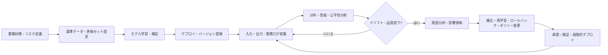
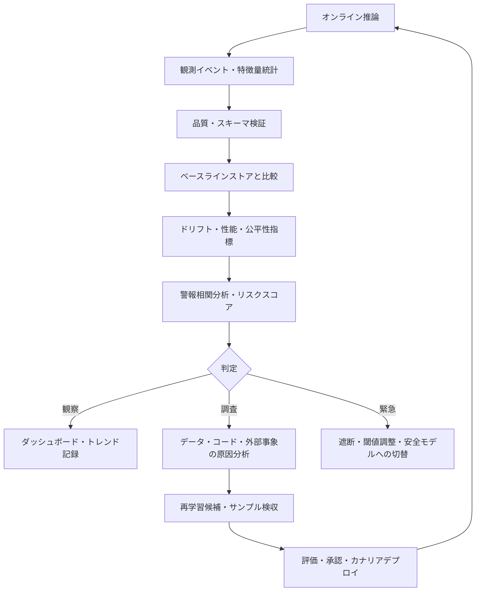

# AIモデルドリフト(Model Drift)とデータドリフト(Data Drift)の管理

## 1. 概要

> **定義:** AIモデルドリフト管理とは、運用環境の入力・正解・予測・業務コンテキストが学習時点と異なってくることで発生するデータドリフト、コンセプトドリフト、予測ドリフトおよびモデル性能の低下を継続的に観測し、原因を分析して再学習・補正・ロールバック・業務ポリシー変更によって対応する、ライフサイクル全体にわたる管理活動である。

機械学習モデルは、過去のデータから抽出した統計的関係を現在の業務に適用する。しかし、顧客行動、季節性、センサー環境、政策、競争状況、攻撃パターンは絶えず変化する。学習データが当時は代表性を持っていたとしても、デプロイ後に時間が経過すれば、入力分布が変わったり入力と正解の関係が変わったりして、モデルの判断が陳腐化し得る。

ドリフトは単純な障害とは異なる。サーバーが正常に応答し、レイテンシも基準内であっても、推薦モデルが古い商品ばかりを推薦したり、不正検知モデルの見逃し率が上昇したりすることがある。すなわち、従来のAPMが測定するシステム状態とAI品質状態との間に、別途の観測層が必要である。

また、入力分布が変化したという事実だけでモデル性能が低下したと断定してはならない。季節による正常な変化である可能性もあり、モデルが新しい分布でもうまく汎化する可能性もある。逆に、入力分布がほとんどそのままでも、不正手口や政策が変わって入力-正解の関係が変化すれば、性能が低下し得る。

したがって技術士の答案では、ドリフトを単一の閾値で捉える問題として書くよりも、基準データと観測データの定義、ラベル遅延、統計的検定、業務への影響、対応権限と承認手続きを結び付けるべきである。目標は警報を多く生成することではなく、意味のある変化を識別して適切な措置を実行することである。

## 2. 発生の背景と管理対象

運用データは学習データとは異なる経路で流入する。学習データは精製・ラベリング・検収された過去のスナップショットであるのに対し、運用データはリアルタイムのイベント、欠損値、新しいカテゴリ、ユーザーの戦略的行動を含む。データ収集システムのスキーマ変更や特徴量計算ロジックの変更だけでも分布が変わり得る。

ドリフトの原因は、自然的変化、システム的変化、敵対的変化に分けられる。自然的変化には季節性、人口構成の変化、景気変動が含まれる。システム的変化にはセンサーの交換、アプリUIの変更、ETLエラー、特徴量定義の変更が含まれる。敵対的変化には不正攻撃者の戦略変更、モデルを回避しようとする入力操作が含まれる。

管理対象は入力特徴量に限定されない。ラベルと予測結果、公平性グループ別の性能、ユーザーフィードバック、コストとレイテンシ、ポリシー違反率、人間がモデル出力を修正した比率までを併せて見て初めて、実際の業務品質を説明できる。

| 観測対象 | 確認質問 | 代表的シグナル | データ確保時点 |
|---|---|---|---|
| 入力データ | 学習・基準データと分布が変わったか? | 平均、分散、カテゴリ比率、欠損率 | 推論直前・直後 |
| 特徴量関係 | 特徴量間の関係と相関構造が変わったか? | 相関係数、共分散、埋め込みクラスタ | バッチ・ストリーミング |
| 正解ラベル | 実際の結果の比率と分布が変化したか? | クラス比率、遅延ラベルの品質 | 業務完了後 |
| 予測結果 | モデル出力の分布が動いたか? | スコア・クラス・拒否率 | 推論時点 |
| 性能 | 実際の正解基準で品質が維持されているか? | 正解率、F1、AUC、RMSE | ラベル到着後 |
| 業務コンテキスト | モデルの意思決定が目的に適合しているか? | コンバージョン率、損失、苦情、手動介入率 | 業務システム連携 |

上表の項目は互いに代替できない。入力データが変わっても性能が維持されることがあり、入力が維持されてもラベル関係が変わることがある。また、高いAUCが特定顧客層の再現率を保証するわけではないため、全体指標とグループ別指標を併せて記録しなければならない。

## 3. ドリフトの類型と作動原理

### 3.1 データドリフトと共変量ドリフト

データドリフトとは、入力変数の周辺分布が基準期間と異なってくる現象である。共変量ドリフトは特に、入力分布 \(P(X)\) は変化するが条件付き分布 \(P(Y|X)\) は変化しない場合を指す。例えば、オンラインショッピングモールの訪問者の年齢層が変わったが、年齢と購買の関係がそのままであれば、共変量ドリフトとみなすことができる。

この変化はモデルにとってリスクにも機会にもなり得る。新しい顧客層が流入し、それがモデルの学習していないカテゴリであれば性能が悪化し得るが、モデルが十分に汎化していれば、単なる警報は運用チームの疲労を高めるだけである。したがって、分布の差と検証ラベルに基づく性能を併せて分析しなければならない。

連続変数には、平均・分散・分位数・Wasserstein距離・KS検定などを適用できる。カテゴリ変数には頻度比較とカイ二乗検定、分布全体にはPSIやJensen-Shannon divergenceを活用できる。サンプル数が非常に大きいと小さな差でも統計的に有意になるため、効果量と業務上の閾値を併せて設定する。

### 3.2 コンセプトドリフト

コンセプトドリフトとは入力と正解の間の関係が変わる現象であり、\(P(Y|X)\) が変化することが核心である。同じ取引特性を持つ決済が、過去には正常であったが現在では盗難カードである可能性がある。不正者の行動変化や規制政策の変更は、モデルが学習した関係を急速に無効化する。

コンセプトドリフトは、正解ラベルがあれば直接確認しやすい。しかし、金融の承認結果、顧客の実際の離脱、設備故障のように、ラベルが遅れて到着するか観測されない場合が多い。この場合は代理指標と後行ラベルを組み合わせ、ラベルが確保された後に過去の警報の正確度を逆評価する。

コンセプトドリフトの早期シグナルは、入力分布よりも予測-結果の関係に現れる。予測スコアは正常なのに実際の損失や苦情が増えたり、同じスコア区間の陽性比率が変化したりすれば、条件付き関係が変わった可能性がある。基準期間を無条件に学習時点のみとせず、直近の正常運用区間とも比較する。

### 3.3 予測ドリフトとラベルドリフト

予測ドリフトとは、モデル出力の分布が変化する現象である。分類モデルの陽性判定率、回帰モデルの予測値の分位数、生成モデルの拒否率・応答長・トピック比率がその例である。予測ドリフトは迅速に計算できるが、出力の変化だけで精度低下の原因を確定することはできない。

ラベルドリフトまたは事前確率ドリフトとは、\(P(Y)\) が変化する現象である。流行性疾患の予測で実際の陽性比率が増加したり、ショッピングモールでセール期間中に購買比率が高くなったりする場合がこれに該当する。ラベル比率の変化は入力の代表性の変化とともに現れ得るため、各ドリフトを独立に観測する。

ドリフトの類型は排他的な分類ではない。入力分布とラベル分布が同時に変わったり、出力分布の変化が特徴量計算エラーから始まったりすることがある。運用センターは警報名だけを見て再学習を実行するのではなく、データリネージ、コードのデプロイ、政策変更、外部事象を原因候補として併せて調査しなければならない。

| 類型 | 変化する対象 | ラベルの要否 | 代表的原因 | 優先対応 |
|---|---|---:|---|---|
| データドリフト | 入力 \(P(X)\) | 不要 | 顧客層・季節・センサーの変化 | 分布点検・サンプル検証 |
| 共変量ドリフト | 入力、関係は仮定上維持 | 不要 | 流入母集団の変化 | 汎化性能の確認 |
| コンセプトドリフト | 関係 \(P(Y|X)\) | 概ね必要 | 攻撃・政策・業務の変化 | ラベル分析・再学習 |
| 予測ドリフト | 出力 \(P(\hat{Y})\) | 不要 | 入力変化・閾値変化 | 出力・閾値の点検 |
| ラベルドリフト | 実際の結果 \(P(Y)\) | 必要 | 事象頻度・市場の変化 | 基準率・キャリブレーション点検 |
| スキーマドリフト | データ構造・型 | 不要 | ETL・API契約の変更 | パイプライン遮断・復旧 |

## 4. ライフサイクルとベースライン設計

ドリフト管理は、モデルをデプロイした後に始める付加機能ではない。要件定義段階で許容可能な性能低下とラベル遅延を定義し、学習段階で基準データと評価セットを固定し、デプロイ段階で観測フィールドを接続しなければならない。運用段階の警報が再学習と承認につながって初めて、閉ループの管理となる。

ベースラインは一つの数値ではなく、比較ルールの束である。学習データの特徴量分布、検証データの性能、直近の正常運用期間の出力分布、グループ別品質、業務KPIをバージョンとともに保管する。基準期間の設定を誤ると、季節性をドリフトと誤認したり、すでに汚染された運用データを正常として学習したりする可能性がある。

ベースラインには有効期間も必要である。長期間運用されたモデルが最初の学習データとだけ比較され続けると、正常な長期トレンドも常に警報となる。学習ベースラインと直近正常ベースラインを並行して用い、季節別の基準やローリングウィンドウを使用しつつ、ベースライン更新の承認記録を残す。

収集ログには、モデルバージョン、特徴量バージョン、入力時刻、予測時刻、予測値、確率または信頼度、推論経路、業務結果、ラベル到着時刻を含める。個人情報や機微情報は原文を無条件に保存せず、トークン化・集計・アクセス制御で保護する。オブザーバビリティが高まるほど個人情報リスクも同時に大きくなる点を考慮しなければならない。

## 5. 検知指標と分析方法

### 5.1 統計的な分布比較

PSIは、区間ごとの基準比率と観測比率の差を対数比とともに合算する方式で分布の移動を要約する。実装と説明が容易なため運用ダッシュボードで多用されるが、区間化の方式と基準分布に敏感であり、すべての業務に同一の警報基準を適用することはできない。

Jensen-Shannon divergenceは、二つの分布の対称的な差を測定し、確率分布の比較に活用できる。Wasserstein距離は、分布の質量を移動させるコストの観点から連続変数の変化を解釈しやすい。KS検定は二つの連続標本が同じ分布かどうかを検定するが、大きな標本では些細な差も有意と判断し得る。

カテゴリ特徴量では、カイ二乗検定とカテゴリ別の比率差を用いる。新しいカテゴリが登場したり、欠損カテゴリが急増したりした場合は、統計的検定以前にデータ契約違反として処理すべきである。複数の特徴量を同時に検査する際は、多重比較による誤検知を減らすため、効果量、補正方法、重要特徴量の優先順位を定める。

### 5.2 性能・公平性・業務指標

ラベルが確保されたら、正解率一つではなく業務目的に合った指標を計算する。不均衡分類では適合率・再現率・F1・PR-AUCを確認し、コストの異なる誤りには期待損失と混同行列を用いる。確率を意思決定に使う場合は、Brier scoreとキャリブレーションも確認すべきである。

モデルの全体性能が維持されていても、グループ別の再現率や偽陽性率が悪化することがある。性別・年齢・地域・障がいの有無のように法的・倫理的配慮が必要なグループは、最小サンプル数と個人情報保護を併せて検討し、グループを過度に細分化して再識別リスクを生まないようにする。

業務指標はモデル指標と結び付けなければならない。推薦モデルではクリック率だけでなく長期継続率と顧客の不満を見、不正モデルでは検知率だけでなく正常顧客のブロックと調査コストを見る。技術的な警報が業務損失につながる経路を定義すれば、再学習の優先順位を合理的に決められる。

| 測定階層 | 指標例 | 長所 | 注意点 |
|---|---|---|---|
| データ | PSI, KS, JS, Wasserstein, 欠損率 | ラベルなしで迅速に監視 | 性能低下を直接証明しない |
| モデル出力 | クラス比率、スコア分布、エントロピー | 推論直後に計算可能 | 閾値・トラフィック変化の影響 |
| モデル性能 | F1, PR-AUC, RMSE, Brier | 品質を直接評価 | ラベル遅延・コスト |
| 公平性 | グループ別TPR/FPR、格差 | 影響を受ける集団の確認 | グループ標本・法的基準が必要 |
| 業務 | 損失、コンバージョン、苦情、手動介入 | 経営への影響を説明 | 外部要因が混在 |
| 運用 | レイテンシ、エラー率、コスト、リソース | システム原因の切り分け | AI品質と同一ではない |

## 6. 検知・判定・対応アーキテクチャ

ドリフトモニタリングは、コレクター、ベースラインストア、統計計算器、警報エンジン、分析ダッシュボード、対応オーケストレーターの組み合わせで構成する。バッチモデルは時間ウィンドウ単位で計算し、リアルタイムモデルはストリーミング集計とサンプリングを用いる。すべてのリクエスト原文を保管しなくても、主要統計量と追跡IDを残せば、コストと個人情報を削減できる。

警報エンジンは単一の閾値よりも複数のシグナルを組み合わせるべきである。例えば、入力PSIが上昇したが性能と業務指標が維持されていれば観察状態にとどめ、入力の変化とグループ別再現率の低下が同時に現れれば調査状態に引き上げる。ラベル遅延が長い業務では、先行指標と後行指標を分離して警報の確実性を表示する。

判定は、通知、調査、緩和、停止の4段階で設計できる。通知はトレンドを記録して担当者に伝達する段階である。調査はデータ品質、コード変更、外部事象を確認する段階である。緩和は閾値調整、保守的ポリシー、人間によるレビュー、安全モデルへの切替を適用する段階であり、停止は高リスクの自動決定を遮断して以前のバージョンにロールバックする段階である。

対応の自動化には権限の境界が必要である。低リスクの統計的警報が自動的にダッシュボードに記録されることと、高リスクモデルが自動再学習されて顧客承認業務に投入されることは異なる。再学習データの承認者、モデルリリース責任者、ロールバック権限者を分離し、すべての措置に根拠と結果を残す。

## 7. 再学習・補正・ロールバック戦略

再学習はドリフトに対する基本的な対応のように見えるが、常に正解とは限らない。特徴量パイプラインのエラーやラベルの誤りが原因であるのに再学習すれば、問題を新しいモデルに再び注入してしまう可能性がある。まずデータ契約、コード変更、ソースシステム、ラベル生成ルールを確認した後、学習データの代表性と品質を評価する。

再学習データは、直近データだけを集めるか過去データだけを維持するかの二者択一ではない。直近性、季節性、希少事例、安全事例に重み付けを行い、時系列分割によって未来の情報が過去の学習に漏れ込まないようにする。新データと既存データの混合比率は、性能・公平性・安定性の検証によって決定する。

オンライン学習は迅速に適応できるが、汚染データや異常イベントを即座に学習してしまうリスクがある。高リスク業務では承認されたバッチ再学習とカナリアモデルを優先し、オンライン更新が必要な場合はデータ品質ゲートとロールバック可能なチェックポイントを設ける。

モデル補正は、閾値、キャリブレーション、ルール層を調整して業務リスクを迅速に低減する方法である。しかし、閾値を変えると適合率と再現率、グループ別の誤り、顧客体験が同時に変化するため、変更前後を比較しなければならない。補正が一時的措置なのか恒久的ポリシーなのか、その失効時点も明記する。

ロールバックはモデルファイルだけを元に戻す作業ではない。特徴量コード、スキーマ、ベースライン、モデル、ポリシー、インデックスとデプロイ設定を、互換性のあるリリース単位として復元しなければならない。復旧前に以前のバージョンが現在のデータに対してどのようなリスクを持つかを確認し、段階的なトラフィック切替によって復旧後の異常を再確認する。

## 8. 比較:ドリフトと隣接概念

データ品質の低下は、欠損・形式・範囲・重複のように、データそのものの期待条件への違反を意味することが多い。ドリフトは、データが形式上有効であっても、基準分布や関係が時間とともに変化する現象である。品質検証はドリフトモニタリングの前提であるが、両者は同じ指標ではない。

データスキューは学習とサービングの間の不一致を強調し、ドリフトは時間または運用条件による変化に焦点を当てる。特徴量計算コードが学習とサービングで異なれば、それはスキューであると同時に、その後の分布変化を生み出し得る。したがってMLOpsでは、スキュー検査と時間ベースのドリフト検査の両方を設ける。

コンセプトドリフトとデータポイズニングも区別しなければならない。コンセプトドリフトは攻撃の意図がなくても現実の関係が変わる現象であるのに対し、データポイズニングは攻撃者が学習・検索データの完全性を意図的に毀損するものである。ポイズニングが成功するとドリフトのように見えることがあるため、セキュリティログとデータリネージを併せて調査する。

| 区分 | 変化の観点 | 代表的な問い | 対応の焦点 |
|---|---|---|---|
| データ品質の低下 | 妥当性・完全性 | 値がルールを守っているか? | パイプライン遮断・クレンジング |
| データスキュー | 学習-サービング間の差 | 同じ特徴量計算か? | コード・スキーマの整合 |
| データドリフト | 入力分布の時間変化 | 母集団が変わったか? | ベースライン・サンプル検証 |
| コンセプトドリフト | 入力-正解関係の変化 | 同じ入力が異なる結果になるか? | ラベル・再学習 |
| 予測ドリフト | 出力分布の変化 | 判定比率が変わったか? | 閾値・原因分析 |
| データポイズニング | 意図的な完全性攻撃 | 誰が何を汚染したか? | 隔離・フォレンジック・再現 |

## 9. 事例:仮想のオンライン決済不正検知モデル

仮想のEC企業が、決済承認時点で不正確率を計算するモデルを運用しているとする。学習当時はカード番号の盗用、海外IP、反復決済パターンを中心に検知しており、直近30日間の正常運用データで入力分布と出力分布を観察している。不正ラベルは、カード会社への異議申し立てと調査結果が反映された後、約14日後に到着する。

運用1か月後、海外取引比率が8%から18%に上昇し、新規モバイル指紋の比率も12%から31%に変化した。入力分布の警報は発生したが、全体の承認率と顧客の不満は基準範囲内であった。この場合、休暇シーズンの海外取引増加という正常な季節性の可能性をまず確認し、直ちにモデルを置き換えることはしない。

14日後にラベルが流入すると、特定のモバイル指紋グループで再現率が92%から71%に低下し、見逃しによる損失が1週間で18%増加したことが判明した。同時に、同じスコア区間の実際の不正比率が変化しており、コンセプトドリフトの候補となった。セキュリティチームは最近の攻撃パターンと特徴量計算の変更履歴を確認する。

調査の結果、攻撃者が正常な決済に見える分割決済と新規デバイスの組み合わせを用いており、その特徴の相互作用をモデルが十分に学習できていなかったと仮定する。まず高リスクのスコア区間は追加の人間によるレビューに切り替え、既存モデルの安全閾値を一時的に適用する。この措置は再学習完了前の損失を減らす緩和策であって、性能改善の証拠ではない。

再学習には、最近の攻撃事例、過去の正常事例、季節別の検証セット、新規モバイル指紋群を含める。時系列検証によって未来の情報を遮断し、全体のPR-AUCだけでなく、海外・モバイル・新規顧客グループの再現率と正常顧客のブロック率を比較する。カナリアトラフィックで10%を先に処理した後、業務損失と苦情を確認してから全面デプロイする。

| 段階 | 観察・決定 | 証拠 | 統制 |
|---|---|---|---|
| 1. 検知 | 海外取引・デバイス特徴量の分布変化 | 特徴量比率・PSIトレンド | 季節性との比較 |
| 2. 確認 | ラベル到着後のグループ別再現率低下 | 混同行列・損失 | コンセプトドリフト判定 |
| 3. 緩和 | 高リスク案件を人間レビューに切替 | 承認・拒否ログ | 一時閾値・安全ポリシー |
| 4. 改善 | 最近の攻撃パターンを含めた再学習 | 時系列検証結果 | データ承認・モデル登録 |
| 5. デプロイ | 10%カナリア後に拡大 | 業務KPI・エラー率 | 承認・ロールバック計画 |
| 6. 振り返り | 検知遅延とコストの分析 | MTTD・MTTR・損失 | ベースライン・特徴量改善 |

この事例で重要なのは、入力警報が発生した日と実際の性能低下を確認した日の間に、14日間のラベル遅延があったという点である。技術士は、警報時点、判定時点、緩和時点、再学習完了時点を分離し、遅延時間をサービスレベル目標として管理しなければならない。

## 10. 深化:MLOps・LLMOpsと最新のモニタリング観点

NISTによるデプロイ後のAIシステムモニタリングの議論は、機能性・運用性・人的要因の観測を区別し、事前評価と事後観測を結ぶフィードバックループが必要であるとしている。これは、モデル指標だけをダッシュボードに載せる方式から脱し、利用コンテキスト、ユーザーへの影響、長期的変化と不確実性まで検討せよという意味である。

Googleの機械学習運用ガイドは、サービングデータの学習データに対するスキュー・ドリフト、予測品質、ログとアラートをパイプラインの段階ごとに観察することを強調している。したがって、モデルリポジトリにバージョンだけを残すよりも、データ収集・サービング・業務結果のトレーサビリティを結び付ける設計が重要である。

クラウドのモデルモニタリングサービスは、通常、基準分布を計算した後、運用分布と統計的距離または検定結果を比較し、閾値超過時にアラートを発生させる。この機能は迅速な立ち上げに有用であるが、基準データの代表性、サンプルサイズ、ラベル遅延、閾値の業務上の意味は組織が別途検証しなければならない。

LLMOpsでは、従来の入力特徴量のドリフトだけでは回答品質を説明しにくい。検索文書のトピックと鮮度、検索ヒット率、根拠引用率、応答拒否率、応答長、ユーザーフィードバック、ツール呼び出しの失敗、コストとレイテンシを併せて観察する。生成結果は非決定的であり得るため、固定評価セット、モデルベースの評価、人間による評価、業務結果を組み合わせる。

モニタリング結果はAIガバナンスと結び付けられなければならない。モデルカードとデータカードにベースライン・限界・再評価周期を記録し、影響の大きいシステムには変更承認とインシデント報告の手続きを設ける。ドリフト警報を受けたにもかかわらず措置を取らない運用は、警報がないのと同じリスクを生む。

予想出題としては、「AIモデル性能低下の原因とMLOpsモニタリング方策」、「データ品質・AI信頼性・再学習ガバナンス」、「生成AI運用におけるドリフトと評価」を関連付けることができる。答案は、類型の定義、ベースライン・指標、概念図、事例、自動化と人間の承認、個人情報・公平性・セキュリティの示唆の順で構成すると論理的である。

## 11. 考慮事項および示唆

### 11.1 統計的有意性と業務的有意性のバランス

サンプルが多ければ、小さな分布差でも有意な結果になる。逆にサンプルが少なければ、実際には重要な変化が検定で表れないことがある。統計量だけで自動的に措置を取らず、効果量、持続時間、業務への影響、信頼区間を併せて用いる。

### 11.2 ベースラインと季節性の分離

直近の正常期間を基準とすれば季節性に適応できるが、すでに性能が低下した期間を正常として採用してしまうリスクがある。学習ベースライン、直近正常ベースライン、季節ベースラインを併せて保管し、更新承認と失効ポリシーを設ける。

### 11.3 ラベル遅延と早期警報の設計

正解ラベルが遅れて到着する業務では、入力・出力・業務の代理指標をまず確認し、後行ラベルで警報の正確度を検証する。早期警報を性能確定警報のように表現せず、「調査必要」「性能確認」「緊急緩和」などの状態を区別する。

### 11.4 自動再学習の安全装置

自動再学習は変化に迅速に対応できるが、汚染データや誤ったラベルを拡大させ得る。承認済みデータセット、再現可能なパイプライン、独立した検証セット、モデルレジストリ、カナリアデプロイ、即時ロールバックを必須条件とする。

### 11.5 個人情報と公平性の同時保護

特徴量とグループ別性能を詳細に保管するほど、機微情報が残る可能性がある。最小収集、仮名化、集計、アクセス権限、保存期間、再識別リスク評価を適用する。公平性評価も単なる数値合わせではなく、業務目的と法・倫理基準に即して説明する。

### 11.6 セキュリティ攻撃と自然的変化の区別

攻撃者が検知器を回避しようと正常分布のように振る舞ったり、フィードバックを操作したりすると、ドリフト警報がセキュリティインシデントの一部となり得る。データリネージ、アカウント活動、パイプライン変更、外部脅威インテリジェンスとモデル指標を相関分析し、疑わしいデータは証拠を保全したまま隔離する。

### 11.7 復旧可能性と説明責任

モデル・データ・特徴量コード・ポリシーのバージョンを一括して復旧できなければならず、誰がどのような根拠で緩和と再学習を承認したかを残さなければならない。RTOとRPOだけでなく、警報検知時間、原因分析時間、正常化時間、再発率をAI運用の成果指標として管理する。

## 12. 答案構成戦略(一行)

試験答案は、「定義と必要性 → データ・コンセプト・予測ドリフトの類型 → ベースラインとライフサイクルの概念図 → 統計・性能・公平性・業務指標 → 検知・判定・対応アーキテクチャ → 再学習・補正・ロールバック → 不正検知事例 → MLOps・LLMOpsとガバナンス → 技術士としての考慮事項」の流れで展開する。

## 参考資料

1. NIST, *Challenges to the monitoring of deployed AI systems*, https://nvlpubs.nist.gov/nistpubs/ai/NIST.AI.800-4.pdf
2. Google for Developers, *Productionization | Machine Learning*, https://developers.google.com/machine-learning/managing-ml-projects/production
3. Microsoft Learn, *Model monitoring in production - Azure Machine Learning*, https://learn.microsoft.com/en-us/azure/machine-learning/concept-model-monitoring?view=azureml-api-2
4. Google Cloud, *Introduction to Vertex AI Model Monitoring*, https://docs.cloud.google.com/gemini-enterprise-agent-platform/machine-learning/model-monitoring/overview

---

> **一言まとめ**: AIドリフト管理とは、入力・関係・出力・業務コンテキストの変化をベースラインとラベル遅延まで考慮して検知し、検証可能な再学習・補正・ロールバックへとつなげる、ライフサイクル全体にわたるガバナンスである。
