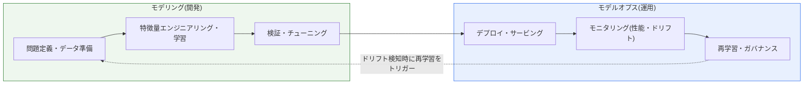
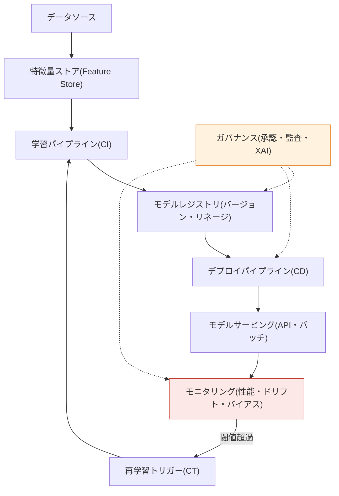

# 機械学習モデリングとモデルオプス(ModelOps)

## 1. 概要

### A. 定義
> **モデリング(Modeling)** とは、データから問題を定義し、特徴量を設計し、アルゴリズムを選択・学習・検証・チューニングして予測性能を確保する**開発(build)活動**であり、**モデルオプス(ModelOps)** とは、完成したモデルを運用環境に**デプロイ(deploy)し、継続的にモニタリング・再学習・ガバナンス**を行ってビジネス価値を安定的に実現する**運用(operate)・統制体系**である。

両概念を併せて理解する鍵は、「**モデルを作ることと運用することは根本的に異なる問題である**」という点にある。データサイエンティストが実験室のデータセットで正解率95%のモデルを作ること(モデリング)は、道のりの半分にすぎない。そのモデルが実際のサービスで継続的に価値を生み出すためには、運用システムにデプロイされ、実データでの性能が監視され、データ分布が変われば再学習され、規制監査や説明要求に対応しなければならない。実際、相当数の分析モデルは開発されただけでデプロイされなかったり(いわゆる「モデルの引き出しの中での死蔵」)、デプロイされた後も放置されて性能が静かに崩れていく。モデルオプスは、まさにこの開発と運用のギャップ(gap)を埋めるために登場した、モデルライフサイクル全過程を**標準化・自動化・ガバナンス**する体系である。

モデルオプスはMLOpsとしばしば混用されるが、その性格は異なる。MLOpsがデータ・モデルパイプラインの**技術的自動化(CI/CD/CT)** に重点を置くとすれば、モデルオプスはそれに加えて**ビジネス・リスク・規制の観点からのモデルガバナンス**を包含するより広い概念であり、組織が運用するすべての意思決定モデル(機械学習だけでなく、ルールベース・統計・最適化モデルまで)を一貫した原則で統制することを志向する。ガートナー(Gartner)がこの用語を広めたのも、個々のデータサイエンスプロジェクトの成功を超えて、「**エンタープライズレベルのモデル資産管理**」という組織能力が必要であるという問題意識からであった。

### B. 登場の背景および必要性
モデルオプスが必要となった背景は、三つの圧力の重なりで説明される。第一に、**規模の圧力**である。初期には組織あたりのモデルは一つか二つであったが、AIが全社に拡大するにつれ、数十〜数百のモデルが同時に運用されるようになった。人間が手作業で各モデルの性能を管理する方式は、この規模では破綻する。第二に、**信頼の圧力**である。モデルはデプロイされた瞬間から劣化し始める。学習時点のデータ分布と運用時点の実データ分布がずれるドリフト(drift)が発生すると、精度が目立たずに低下し、誤った意思決定が累積する。第三に、**規制の圧力**である。EU AI Act、金融分野のモデルリスク管理(SR 11-7)、個人情報・公平性規制が強化されるにつれ、モデルの根拠・バイアス・監査履歴を証明できなければ、サービスそのものが違法となり得る。

要するにモデルオプスとは、作ったモデルを「**信頼できる資産として生かし続ける**」ための運用規律であり、AIが実験を超えて基幹業務(mission-critical)に入り込んだ時代の必須インフラである。

## 2. モデリングとモデルオプスの関係 — ライフサイクル全体

モデリングとモデルオプスは断絶した二つの段階ではなく、一つの閉ループ(closed loop)として噛み合って循環する。モデリングはこのループの「開発」の半円を、モデルオプスは「運用」の半円を担当し、運用で検知されたドリフトが再びモデリング(再学習)の入力となるフィードバック構造が本質である。以下の図は、二つの領域がどのように接続されて循環するかを示す。

上図で注目すべき点は二つある。一つは、モデリングの成果物(検証済みモデル)がモデルオプスの入力となり、**責任が移管(handoff)** されるということであり、もう一つは、運用中に検知された異常が再び開発へとフィードバックされ、**ループが閉じる(closed loop)** ということである。このフィードバックが途切れると、モデルはデプロイ直後から劣化するだけで死んでいく。モデルオプスの存在理由は、まさにこのループを自動的に、かつ統制可能な形で回し続けることにある。

二つの領域の性格の違いは次の表に整理されるが、表を見る前にその違いが「なぜ」生じるのかを理解しなければならない。モデリングは**探索的(exploratory)** である。どの特徴量とアルゴリズムが最善かを事前に知ることはできないため、数多くの実験を繰り返し、成功基準は検証セットでの正解率のような技術指標である。一方、モデルオプスは**決定論的・統制志向的(controlled)** である。運用環境では再現性・安定性・監査可能性が正解率と同じくらい重要であり、成功基準はサービスのレイテンシ・可用性・ビジネスKPI・規制遵守へと拡張される。この性格の違いが、以下の活動・主体・観点の違いを生む。

| 区分 | モデリング(開発) | モデルオプス(運用) |
|---|---|---|
| **焦点** | 予測性能(正解率)の確保 | 安定運用・ガバナンス |
| **性格** | 探索的・実験の反復 | 決定論的・統制・自動化 |
| **主な活動** | データ準備・特徴量エンジニアリング・学習・検証・チューニング | デプロイ・モニタリング・再学習・監査 |
| **主体** | データサイエンティスト・MLエンジニア | 運用(SRE)・ガバナンス・リスク組織 |
| **成功指標** | 正解率・AUC・F1などの技術指標 | レイテンシ・可用性・ビジネスKPI・規制遵守 |
| **中核的観点** | 技術的性能 | ビジネス・リスク・規制 |

## 3. モデルオプスのアーキテクチャと構成要素

モデルオプスを実際に実装する参照アーキテクチャは、データ・学習・デプロイ・モニタリング・ガバナンスの各層がパイプラインで接続された形態である。以下の図は、CI(コード統合)・CD(デプロイ)・CT(継続的学習)の三つの自動化軸が、レジストリとモニタリングを媒介としてどのように循環するかを詳細に示す。

**A. デプロイ・サービング(Deployment & Serving).** 検証済みモデルを運用環境で消費可能な形で提供する段階である。リアルタイム推論のためのオンラインAPIサービングと、大量予測のためのバッチサービングに分かれ、トラフィックに応じて自動スケーリング(auto-scaling)されるよう、コンテナ・Kubernetes上に載せるのが一般的である。デプロイの中核原理は「リスクを分割して送り出す」ことである。新モデルに全量を切り替えると、問題が生じた際に全体が打撃を受けるため、**カナリア(canary)デプロイ**で少量のトラフィックにのみ先行公開したり、**シャドー(shadow)デプロイ**で実サービスに影響を与えずに予測のみを比較したりし、問題がなければ段階的に拡大する。この段階性が運用リスクを決定的に低減する。

**B. モニタリング(Monitoring).** モデルオプスの心臓部である。ソフトウェアモニタリングがレイテンシ・エラー率のようなシステム指標を見るのとは異なり、モデルモニタリングは**予測の品質そのもの**を見る。これには、(1) 入力データの分布が学習時と異なってくる**データドリフト(data drift)**、(2) 入力-出力の関係そのものが変わる**コンセプトドリフト(concept drift)**、(3) 実際の正解が到着した後に測定する**性能低下**、(4) 特定の集団に不利になる**バイアス(bias)** の監視が含まれる。性能低下が危険である理由は「静かである」点にある。システムは正常に動作し、APIも200を返すが、予測だけが徐々に外れていく。そのため、正解遅延(label delay)を考慮した代理指標(入力ドリフト、予測分布の変化)で早期警報を捉える設計が重要である。

**C. 再学習(CT, Continuous Training).** モニタリングが閾値を超える劣化を検知すると、パイプラインが自動的に最新データで再学習し、検証を経て再デプロイする。再学習トリガーは、定期スケジュール(例:毎週)、ドリフト閾値超過、性能指標の低下などのポリシーで定義する。ここで必ず守るべき原理は、「**自動再学習は自動的な信頼を意味しない**」ということである。再学習されたモデルが既存モデルより必ず優れているという保証はないため、昇格(promotion)前にチャンピオン-チャレンジャー(champion-challenger)比較と検証ゲートを設け、劣化したモデルがかえってデプロイされる事故を防ぐ。

**D. モデルレジストリ・ガバナンス(Registry & Governance).** モデルレジストリは、すべてのモデルのバージョン・学習データ・ハイパーパラメータ・性能・リネージ(lineage)を記録する「モデルの構成管理倉庫」である。ガバナンスはその上で、誰がどのような根拠でどのモデルを承認・デプロイしたか、予測がなぜそのように出たか(説明可能性、XAI)を追跡・監査できるようにする。

レジストリが特に重要である理由は、モデルの再現性(reproducibility)にある。事故が発生した際に、「その時点でどのデータで学習されたどのバージョンのモデルが、どのような入力を受けてそのような決定を下したのか」を正確に復元できなければ、原因究明も改善も不可能である。したがってレジストリは、コード・データ・モデル・環境の四つの軸を併せてバージョン固定(pinning)し、いつでも特定の予測をそのまま再現できなければならない。規制産業では、このリネージと監査履歴がなければ事故発生時に責任の究明と釈明が不可能であるため、ガバナンスは選択肢ではなく前提である。

## 4. 成熟度と実務適用 — MLOpsレベルとの連携

モデルオプスの実務水準は、しばしば自動化の成熟度で区分される。

**レベル0(手動プロセス)** は、データサイエンティストがノートブックで学習したモデルを、スクリプト・ファイルとして運用チームに手作業で引き渡す段階である。開発と運用が断絶しているためデプロイが稀で(四半期・年単位)、デプロイ後のモニタリングがないため劣化が放置され、再現性も確保されない。

**レベル1(MLパイプラインの自動化)** は、データ検証・学習・検証・デプロイが一つのパイプラインとして自動化され、ドリフトが検知されると最新データでの再学習(CT)が自動的に回る段階である。特徴量ストアとモデルレジストリが導入され、実験の再現性と一貫性が確保される。

**レベル2(CI/CDパイプラインの自動化)** は、モデルだけでなくパイプライン自体の変更までコードとして管理・テスト・デプロイ(CI/CD)され、複数のモデルを迅速かつ安定的に反復更新できる成熟段階である。この段階で組織は、数十〜数百のモデルを統制可能な状態で同時に運用できる。

具体的な産業適用を見ると、その必要性が明確になる。

金融の信用評価・不正取引検知(FDS)モデルは、不正パターンが絶えず進化するため(コンセプトドリフト)、再学習なしでは数週間で検知率が崩れ、同時に融資拒否の根拠を説明・監査しなければならない規制(モデルリスク管理、SR 11-7)の対象である。この領域においてモデルオプスは、「検知率の維持」と「規制への釈明」という二つの目標を同時に支えるインフラとして機能する。

ECの推薦・需要予測モデルは、季節・流行・プロモーションの変化によってデータドリフトが常時発生するため、継続的再学習の周期と品質がそのまま売上に直結する。例えば、新商品の発売や特定イベントの直後には過去データの代表性が急激に低下するため、ドリフトの閾値を下げて再学習の頻度を高めるといった政策的な調整が必要である。

製造の予知保全(predictive maintenance)モデルは、設備の老朽化に伴ってセンサー信号の分布が徐々に移動するため、ドリフトモニタリングの感度が誤検知(不要な保全)と見逃し(設備故障)の間のコストバランスを左右する。これらの事例に共通するのは、「一度うまく作ったモデル」ではなく「**うまく維持され続けるモデル**」が価値を生むという点であり、その維持活動を標準化・自動化したものがまさにモデルオプスである。

## 5. 深化 — 最新動向とLLMOpsへの拡張

最近のモデルオプスの議論の重心は、従来の機械学習から**生成AI/大規模言語モデル(LLM)** の運用、いわゆる**LLMOps**へと拡張している。LLMの運用は既存のモデルオプスと原理は同じであるが、管理対象が異なる。第一に、性能指標が正解率の代わりに**ハルシネーション(hallucination)・有害性・応答品質**のような定性的で評価の難しい軸へと移り、人間による評価とLLM-as-a-judgeベースの自動評価パイプラインが新たなモニタリング要素となる。第二に、再学習(ファインチューニング)の代わりに、**プロンプト・検索拡張(RAG)・コンテキスト** を構成管理しバージョン化することが中核的な統制対象となる。第三に、トークン単位の課金構造のため、**コスト(FinOps)モニタリング**が性能モニタリングと同じくらい重要になる。

ガバナンスの面では、規制が技術を牽引している。EU AI Actは高リスクAIに対し、リスク管理・データガバナンス・記録保存・透明性・人間による監督を義務付けているが、これは事実上、モデルオプスのモニタリング・レジストリ・監査機能を法的に要求するのと同じである。すなわちモデルオプスは今や、「あれば良い運用効率化」ではなく、「なければ違法となり得るコンプライアンスインフラ」へとその位置付けが変わりつつある。(具体的な規制条項・施行時期は継続的に改訂中であるため、適用時には最新の原文確認が必要である。)

## 6. 考慮事項および示唆

技術士の観点からモデルオプスの導入を判断する際は、次の点を総合的に考慮しなければならない。

1. **ドリフト検知・再学習ポリシーが運用の成否を分ける。** モデルはデプロイの瞬間から劣化する「腐敗する資産」である。したがって、何を(入力・予測・性能のどの指標)どの閾値で監視し、いつ(スケジュール・イベント)再学習をトリガーするかというポリシー設計が、モデルオプスの実効性を決定する。正解遅延を考慮した代理指標の設計が特に重要である。

2. **ガバナンスの観点がMLOpsとの決定的な違いである。** 単なる技術的自動化を超えて、承認ワークフロー・監査証跡・説明可能性(XAI)・バイアス統制を含めなければならず、金融・医療・公共のように規制が強い産業ほど、このガバナンス能力が導入の第一目標とならなければならない。規制(EU AI Actなど)をリスクではなく設計要件として先行的に反映する戦略が有利である。

3. **組織・文化とR&Rの再設計を並行しなければならない。** モデルオプスはツールの導入だけでは完成しない。データサイエンス・エンジニアリング・運用・リスク組織間の責任境界と協業プロセス(モデルの引き継ぎ、昇格承認の主体)を併せて定義しなければならず、この組織的な整合なしには、最新のプラットフォームもレベル0にとどまる。

4. **自動化のトレードオフを統制しなければならない。** 自動再学習・自動デプロイは速度をもたらすが、検証ゲートのない自動化は、劣化したモデルを自らデプロイする事故につながる。チャンピオン-チャレンジャー比較・カナリアデプロイ・ロールバック戦略によって、自動化の利得と安定性をバランスよく確保しなければならない。

5. **全社統合管理へと拡張するロードマップを持たなければならない。** MLモデルだけでなく、ルール・統計・LLMまでを一つのレジストリとガバナンスに統合して初めて、モデル資産全体の信頼性が確保される。個別プロジェクト単位の断片的な運用から、エンタープライズのモデルオプスプラットフォームへの段階的な移行戦略が必要である。

---

> **一言まとめ**: モデリングは*データでモデルを開発(学習・検証)* する活動、モデルオプスは*デプロイ・モニタリング・再学習(CT)・ガバナンスによってモデルを信頼できる資産として継続的に管理* する運用体系であり、ドリフト検知と再学習ポリシー・検証ゲート・監査証跡を通じて規制時代のAI運用を支え、近年はLLMOpsへと拡張されている。
