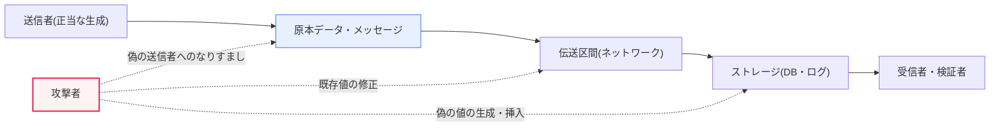
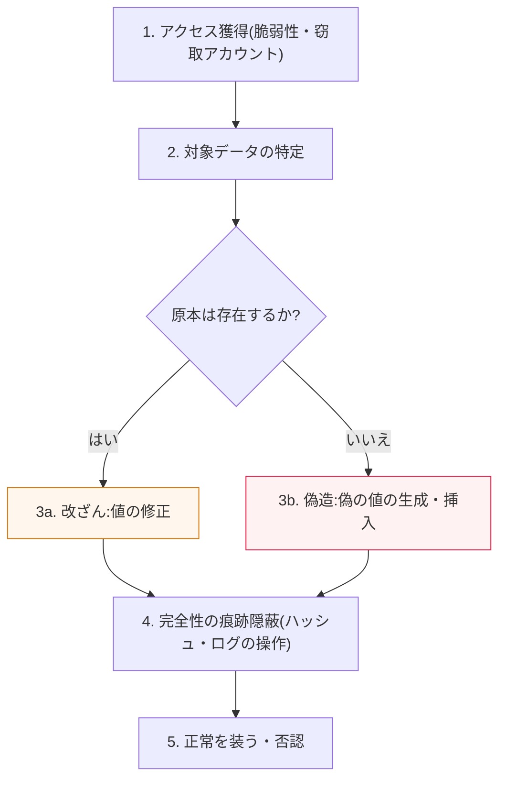

# 改ざん(Modification)と偽造(Fabrication)

## 1. 概要

### A. 定義
> **改ざん(Modification)** とは、正常に存在するデータ・メッセージを**不正に修正・変更**する攻撃であり、**偽造(Fabrication)** とは、存在しなかったデータ・メッセージを**偽って新たに作成し挿入**する攻撃である。両者とも情報の**完全性(Integrity)** と**真正性(Authenticity)** を脅かす。

両概念を分ける核心的な問いは、「**原本があるか否か**」である。改ざんは、もともと存在していた正当なデータを密かに書き換える行為であり、送金指示書の金額100万ウォンを1,000万ウォンに書き換えたり、成績データベースの評定を引き上げたりすることが典型例である。一方、偽造はもともとなかったものをでっち上げてシステムに差し込む行為であり、発生していない取引履歴を作成して元帳に挿入したり、発行された事実のない証明書・在職証明書を精巧に模倣して提出したりすることがこれに該当する。一見似ているように見えるが、防御の観点からこの区分は決定的である。改ざんは「何が変わったか」を検知する**完全性検証**だけでも相当程度対応できるが、偽造は「これは本当に正当な主体が作成したものか」を確認する**発信元認証(Origin Authentication)** が必ず併せて存在しなければ防ぐことができないためである。

この二つは、情報セキュリティ脅威を理解するための最も基本的な分類軸を構成する。古典的にセキュリティ脅威は、**傍受(Interception、機密性への脅威)・改ざん(完全性への脅威)・偽造(完全性・認証への脅威)・遮断(Interruption、可用性への脅威)** の四つに分類されるが(Stallingsのセキュリティ脅威分類)、このうち改ざんと偽造が完全性系統を構成する。完全性が破られると何が起こるかは、実際のインシデントによく表れている。通信区間でメッセージが改ざんされると、受信者は操作された内容を本物と信じて誤った意思決定を下し、偽造されたメッセージが挿入されると、発信されてもいない指示を受け取ったものと誤認して資金を送金したり権限を付与したりする。代表的には、**BEC(Business Email Compromise、ビジネスメール詐欺)** 攻撃は、CEOになりすました偽造メールと送金口座を書き換える改ざんを組み合わせ、FBI IC3の報告基準で累計数十億ドル規模の被害を生んだ。そのため、改ざん・偽造を防ぐことは完全性セキュリティの本体そのものであり、金融・医療・電子政府・サプライチェーンなど、データの真偽がそのまま信頼となるすべてのドメインにおいて最優先の統制対象となる。

### B. 登場の背景と必要性
改ざん・偽造が独立した脅威カテゴリとして確立された背景には、通信・取引のデジタル化がある。紙文書の時代には、原本と写しの物理的な違い(印章、筆跡、用紙)が真偽判断の根拠であったが、デジタルデータは完全な複製が可能であり、痕跡なく修正できるため、「このビット列が原本であり、偽造・改ざんされていない」ことを物理的特性によって保証することはできない。これに加えて、ネットワークを介した遠隔取引が普及するにつれ、相手を対面で確認できない状況で、データの完全性と発信者の真偽を**暗号学的証拠**によって立証する必要が生じた。電子署名法・電子商取引法が電子署名に手書き署名と同等の法的効力を付与したのも、偽造・改ざん防止が単なる技術的問題ではなく、取引の安全性と法的責任の土台であるためである。

### C. セキュリティ脅威分類における位置
以下の表は、四つの古典的脅威を侵害属性の基準で整理したものである。表は位置関係を一目で把握するための補助手段であり、各脅威がなぜその属性を侵害するかは、上記の本文で説明したとおりである。

| 脅威 | 侵害属性 | 内容 | 代表的事例 |
|---|---|---|---|
| **傍受(Interception)** | 機密性 | 情報を密かに盗み見る | パケットスニッフィング、盗聴 |
| **改ざん(Modification)** | 完全性 | 原本を不正に修正 | 送金額・ログ・ファームウェアの改ざん |
| **偽造(Fabrication)** | 完全性・認証 | なかったものを偽って生成・挿入 | 偽の取引・偽造証明書・ディープフェイク |
| **遮断(Interruption)** | 可用性 | サービス・伝達の妨害 | DoS/DDoS、回線切断 |

## 2. 改ざんと偽造の構造的理解

### A. 攻撃の発生地点と流れ
改ざんと偽造は、データが作られ(生成)、流れ(伝送)、とどまる(保存)全区間で発生し得る。以下の全体構造図は、正常なデータの流れの上で二つの攻撃がどこに介入するかを示す。

この図において、改ざんはすでに流れている実線(原本)に介入して値を書き換える点線として、偽造は流れとは無関係にストレージやチャネルに新しい値を押し込む点線として表現される。実務的には、伝送区間の改ざんは**中間者攻撃(MITM)** として、ストレージの改ざん・偽造は**権限昇格後のデータ操作**や**SQL Injectionによるレコード挿入**として具体化される。攻撃地点が異なれば統制地点も異なるため、チャネル保護(TLS)と保存時の完全性(ハッシュ・署名・監査ログ)を階層ごとに併せて設けなければならない。

### B. 攻撃者から見た実行手順
攻撃者が改ざん・偽造を成功させるには、いくつかの段階を経る。以下の詳細プロセス図は、典型的な完全性攻撃の進行を表す。

注目すべきは、第4段階の**痕跡隠蔽**である。攻撃者はデータを書き換えた後、それに対応する完全性の値(チェックサム・ハッシュ)やアクセスログにまで手を加えようとする。もし完全性の値が、攻撃者がアクセスできない場所(別の鍵で保護されたMAC、署名検証鍵、書き込み後に変更不可能なWORMログ)にあれば、隠蔽は失敗し攻撃は検知される。すなわち防御の要諦は、「**完全性の証拠をデータから分離し、攻撃者が同時に操作できないようにすること**」である。この原理が、後述するMAC・電子署名・不変ログ設計の共通基盤である。

### C. 改ざんと偽造の比較
| 区分 | 改ざん(Modification) | 偽造(Fabrication) |
|---|---|---|
| **原本** | 存在(修正) | なし(新規生成) |
| **中核行為** | 既存データの変更 | 偽のデータの挿入・なりすまし |
| **一次侵害** | 完全性 | 完全性 + 真正性 |
| **代表例** | 送金額・成績・ファームウェア・ログの変更 | 偽の取引・偽造証明書・ディープフェイク |
| **検知技術** | ハッシュ・MAC・チェックサム | 電子署名・証明書検証・出所証明 |
| **追加で必要な統制** | 変更検知 | 発信元認証・否認防止 |

表の最後の2行が実務的に最も重要である。改ざんは「変わった」という事実さえ察知すればよいため、ハッシュ・MACのような完全性検証で十分な場合が多い。しかし偽造は「これを作成した主体は本物か」を問わなければならないため、共通鍵ベースのMACだけでは不十分であり(検証者と生成者が同じ鍵を共有すると互いを否認できない)、送信者だけが持つ秘密鍵で署名する**電子署名**と、その公開鍵の信頼を保証する**PKI**が必要である。違いが生じる理由は信頼モデルにある。MACは「鍵を共有した二当事者間の完全性」を、署名は「誰に対しても証明可能な送信者への帰属性」を保証するからである。

## 3. 対応策

### A. 完全性検証技術 — ハッシュとMAC
改ざん検知の第一の防御線は**暗号学的ハッシュ関数**である。SHA-256のようなハッシュは、データが1ビットでも変わると結果がまったく異なるものになる**アバランシェ効果(Avalanche Effect)** を持つため、原本のハッシュ値を安全に保管しておき、受信・検証時点のハッシュと比較すれば改ざんの有無を確定できる。ただし、単純なハッシュは、攻撃者がデータとハッシュを同時に書き換えてしまえば無力化されるため、秘密鍵を混ぜて計算する**MAC(HMACなど)** を使用し、「鍵を知らない攻撃者は有効な完全性の値を作れない」ようにする。例えば、REST APIリクエストに`HMAC-SHA256`署名ヘッダーを付与すれば、パラメータが途中で書き換えられてもサーバーが即座に拒否する。ただしMACは鍵を共有する方式であるため、「第三者に対して送信者を証明する」ことはできないという限界があり、ここで電子署名が必要となる。

### B. 発信元認証と否認防止 — 電子署名とPKI
偽造まで防ぐには**電子署名**が答えである。送信者はメッセージのハッシュを自らの**秘密鍵**で暗号化(署名)し、検証者は送信者の**公開鍵**で復号してハッシュを照合する。秘密鍵は送信者だけが保持しているため、署名が検証されれば、「このデータは偽造・改ざんされておらず(完全性)+ 本当にその人が作成したものであり(認証)+ 後から否認できない(否認防止)」が同時に成立する。ここで、公開鍵が本当にその人のものであることを保証する信頼の連鎖が、**PKI(公開鍵基盤)** と**証明書**である。ブラウザがHTTPSサイトのサーバー証明書をCAチェーンで検証すること、電子税金計算書・電子契約に公認/共同証明書による署名を要求することは、いずれも偽造防止のための発信元認証の実際の適用である。

### C. 予防・検知・追跡の統制
技術的な完全性検証だけでは不十分であり、**アクセス制御・監査ログ・不変ストレージ**が併せて機能しなければならない。最小権限の原則によってデータ修正権限そのものを絞り込み、すべての変更を変更不可能な(WORM・append-only)ログに残して事後の追跡可能性を確保する。ブロックチェーン・分散台帳はこの原理を極限まで推し進め、前のブロックのハッシュを次のブロックに連鎖的に含める(ハッシュチェーン)ことで、過去の記録の事後改ざんを事実上不可能にした偽造・改ざん防止構造である。以下の表は、対応技術を階層別に整理したものである。

| 階層 | 対応技術 | 防御対象 |
|---|---|---|
| **検知(完全性)** | ハッシュ(SHA-256)・HMAC・チェックサム | 改ざん |
| **認証・否認防止** | 電子署名・PKI・証明書 | 偽造 |
| **予防(アクセス)** | アクセス制御・最小権限・MFA | 無断の修正・挿入 |
| **追跡・不変** | 監査ログ(WORM)・ブロックチェーン | 事後の隠蔽 |
| **コンテンツの真正性** | 電子透かし・C2PA出所証明 | AIによる偽造(ディープフェイク) |

## 4. 深化 — AI時代における偽造の高度化と対応標準

従来の偽造が「なかった文書をでっち上げる」水準であったとすれば、生成AIは偽造の様相を根本的に変えつつある。**ディープフェイク**は、実在の人物の顔・音声を学習し、本物と見分けにくい映像・音声を作り出す。2024年には香港で、CFOになりすましたディープフェイクのビデオ会議によって約2,500万ドルが送金された事件が報告されたが、これは「偽造された身元」がリアルタイムの対話にまで拡張された事例である。文書・画像の偽造もまたAIによって大量化・精巧化し、肉眼や単純なフィルタでは真偽を見分けることが難しくなった。

これに対応して、**コンテンツの出所と真正性を暗号学的に証明**しようとする標準が浮上している。**C2PA(Coalition for Content Provenance and Authenticity)** は、コンテンツの生成・編集履歴を電子署名されたメタデータ(Content Credentials)として添付し、画像・映像がいつ、誰によって、どのように作られたかを検証可能な履歴として残す。Adobe・Microsoftなどが参加しており、カメラや生成AIツールへの署名埋め込みが広がる傾向にある。これに**電子透かし**(肉眼では見えないように出所の標識を埋め込む)と**AI生成物検知モデル**が補完的に組み合わされる。ただし、これらの技術は透かしの除去・再エンコード攻撃に脆弱であり得るため万能ではなく、まだ標準化・相互運用性が進行中であるため、断定的な信頼よりも「多層防御の一つの軸」とみなす観点が適切である。情報管理技術士の観点からは、この領域は既存の完全性統制(署名・PKI)の原理をコンテンツの真正性検証へと拡張したものとして理解すると、つながりが自然である。

## 5. 考慮事項および示唆

1. **重要度に基づく完全性統制の差別化適用**が必要である。すべてのデータに電子署名を付与すると性能・運用コストが過大になるため、単純な改ざん検知で十分なデータはハッシュ・MACで、送信者への帰属と否認防止が必要な取引・契約・認証データは電子署名・PKIで階層化するトレードオフ設計が求められる。

2. **偽造防御は必ず認証・否認防止と結合**しなければならない。なかったものをでっち上げる偽造は、「正当な主体が作成したものか」を問わなければ防げないため、完全性のみを保証する共通鍵MACではなく、非対称署名に基づく発信元認証が核心であり、この際、秘密鍵の保管(HSM・鍵ライフサイクル管理)が信頼全体の実質的な弱点となる。

3. **完全性の証拠の分離・不変保管**が防御の要諦である。攻撃者による痕跡隠蔽(第4段階)を無力化するには、完全性の値と監査ログをデータとは異なる信頼境界(別の鍵・WORM・分散台帳)に置かなければならず、この原則が守られなければ、いかなるアルゴリズムも無意味となる。

4. **AIによる偽造に備えたコンテンツ出所証明体系へと拡張**しなければならない。ディープフェイク・生成型偽造が精巧になるほど、事後検知だけでは限界があるため、C2PA・電子透かしのような「生成時点の署名(Provenance)」に基づく事前統制へと重心を移しつつ、除去攻撃の可能性を考慮して多層防御として設計するバランスが必要である。

5. **法・制度と技術の整合性**を確保しなければならない。電子署名の法的効力、電子文書の真本性要件、ログの証拠能力などは、技術的統制が法的責任とつながる地点であるため、完全性アーキテクチャの設計時には、関連法規(電子署名法・電子文書法)と監査・フォレンジック要件を併せて考慮したガバナンスが裏付けとならなければならない。

## 参考資料
- NIST, "Secure Hash Standard (SHS)", FIPS PUB 180-4
- NIST, "Digital Signature Standard (DSS)", FIPS PUB 186-5
- C2PA, "Content Credentials: Technical Specification" — https://c2pa.org/specifications/
- FBI IC3, "Business Email Compromise" — https://www.ic3.gov/

---

> **一言まとめ**: 改ざんは*原本を不正に修正*する(完全性の侵害)、偽造は*なかったものを偽って生成・なりすます*(完全性+真正性の侵害)攻撃であり、ハッシュ・MACで改ざんを検知し、電子署名・PKIで偽造を防止し、完全性の証拠の分離・不変保管と、AI時代のディープフェイクに対応するC2PA・出所証明体系によって防御を拡張する。
