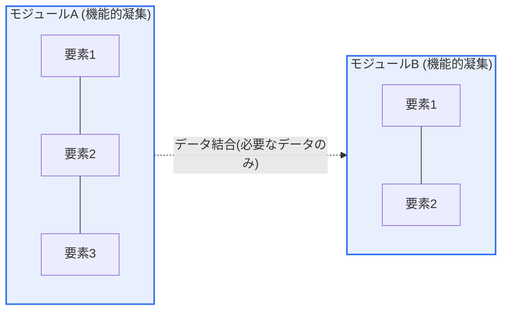
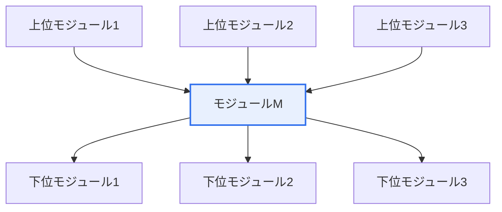

# ソフトウェアモジュール — 凝集度・結合度、Fan-in・Fan-out

## 1. 概要

### A. 定義

> **モジュール(Module)** とは、独立してコンパイル・再利用可能なソフトウェアの機能単位であり、その設計品質を定量的・定性的に判別する二つの軸が**凝集度(Cohesion、モジュール内部要素の関連性)** と**結合度(Coupling、モジュール間の依存性)** である。良い設計は例外なく「**高い凝集度(Strong Cohesion)・低い結合度(Loose Coupling)**」を志向する。

モジュール設計がソフトウェア品質の根本である理由は、それがそのまま「**一つのモジュールの変更がシステム全体へ波及する影響範囲(Ripple Effect)**」を決定するからである。ソフトウェアは作るコストよりも手直しして使うコストのほうがはるかに大きく(ライフサイクル全体のコストの60〜80%が保守)、保守コストの大部分は「一件の変更がいくつのモジュールを同時に触らせるか」に左右される。モジュールがうまく分割されていれば、各モジュールは独立しているため、理解・修正・再利用・単体テストが局所的に完結するが、分割を誤ると、些細な要件変更一つが連鎖的な修正と回帰欠陥(Regression)を招く。この「分割の良し悪し」を判定する二つの尺度が、まさに凝集度と結合度である。

二つの尺度は互いに独立した概念ではなく、**コインの表裏のように連動**する。関連する機能を一つのモジュールに適切に集めれば(凝集度↑)、そのモジュールは自己完結するため他のモジュールをあまり参照しなくなり(結合度↓)、自然と独立性が高まる。逆に、性質の異なる雑多な機能を一つのモジュールに詰め込むと(凝集度↓)、それらの機能がそれぞれ外部のデータ・状態を引き込んで使うため、あちこちに参照が伸び(結合度↑)、モジュールがシステムに絡め取られていく。すなわち、**凝集度を高める行為がそのまま結合度を下げる行為**となる場合が多い。これが、構造化設計(Structured Design)においてコンスタンティン(L. Constantine)とヨードン(E. Yourdon)が二つの概念を一対として提示した理由である。

### B. 登場の背景と必要性

1970年代に構造化手法が登場する以前は、プログラムが一つの巨大な流れ(モノリシックな手続き)として書かれており、どこを直せばどこが壊れるか予測できない「スパゲッティコード」が一般的であった。コンスタンティンとヨードンはこれを克服するため、プログラムを機能単位に分割(Decomposition)しつつ、**分割の質を客観的に評価する物差し**として凝集度・結合度を提案した。ソフトウェアが大きくなり長く保守されるほど変更頻度は高まるが、この二つの尺度は「変更に強い構造」を作る設計の物理法則のようなものである。今日のオブジェクト指向におけるSRP(単一責任の原則)、マイクロサービスのサービス境界設定、情報隠蔽とカプセル化は、いずれも結局のところ「高凝集・低結合」を別の言葉で言い直したものである。

## 2. モジュール独立性の二つの軸 — 凝集度と結合度

モジュールの良し悪しを一つの概念にまとめると**モジュール独立性(Module Independence)** となり、これは凝集度と結合度の関数である。以下の図は理想的な状態、すなわち二つのモジュールがそれぞれ内部で強固にまとまっており(高い凝集度)、互いには最小限のデータのみをやり取りする(低い結合度)姿を表す。

### A. 凝集度 — 「一つのモジュールは一つのことだけをうまくやれ」

凝集度とは、「一つのモジュール内の要素(文・関数・データ)がどれだけ一つの目的のためにまとまっているか」を表す。凝集度が高いということは、そのモジュールが「何をするか」を一文で説明できるという意味である。例えば `口座残高計算()` のように単一の目的が明確であれば機能的凝集である。逆に `共通ユーティリティ()` の中にログ・暗号化・日付変換が混在していれば、名前自体が「あれこれ」という意味にすぎず、凝集度は低い。

凝集度は、偶発的(最も悪い)から機能的(最も良い)まで**7段階**に区分される。この順序を暗記することよりも重要なのは、「なぜ上に行くほど良くなるのか」という原理である。下に行くほど要素をまとめる根拠が「たまたま同じファイルにあるから」という程度に弱く、上に行くほど「同じデータを順次加工するから」あるいは「単一の機能を構成するから」というように論理的必然性が強くなる。必然性が強いほど、そのモジュールは理由があって一まとまりになっているため分割する必要がなく、変更理由も一つだけである(SRPと正確に一致する)。

| 凝集度(低→高) | まとめる根拠 | 例 |
|---|---|---|
| 偶発的(Coincidental) | 何の関連もない | 雑多な関数を集めた`Util`クラス |
| 論理的(Logical) | 性質のみ類似、実行はフラグで選択 | `処理(type)`内でtypeごとに分岐 |
| 時間的(Temporal) | 同じ時点で実行 | `初期化()`でログ・DB・キャッシュを設定 |
| 手続き的(Procedural) | 決められた順序で実行 | 順序のみ共有、データは無関係 |
| 通信的(Communicational) | 同じデータを使用 | 同じ入力から複数の結果を算出 |
| 逐次的(Sequential) | 前の出力が後の入力 | パース→検証→変換のパイプライン |
| **機能的(Functional・最善)** | 単一機能の完結 | `利息計算()` |

### B. 結合度 — 「モジュール同士は最小限にしか絡み合うな」

結合度とは、「モジュール同士が互いにどれだけ深く依存しているか」である。結合が強いほど、一方の内部変更が他方をも強制的に修正させる。最も悪いのは**内容結合(Content Coupling)** であり、一つのモジュールが他のモジュールの内部コードやローカル変数に直接手を触れる場合である。この場合、相手の実装を変えた瞬間にこちらが音もなく壊れる。最も良いのは**データ結合(Data Coupling)** であり、必要な値だけを引数としてやり取りする場合である。インターフェース(何をやり取りするか)さえ守れば内部実装は自由に変えられるため、変更が局所化される。

結合度は、強い順(内容)から弱い順(データ)まで**6段階**である。特に実務でよく問題となるのは、**制御結合(Control Coupling)** — 相手モジュールの内部ロジックを左右するフラグを渡すこと(`ソート(data, true)`のtrueが昇順/降順を指示する) — と、**共通結合(Common Coupling)** — グローバル変数を複数のモジュールが共有し、誰が値を変えたのか追跡不可能になること — である。グローバル状態の乱用が保守性を最も大きく悪化させる理由がここにある。

| 結合度(強→弱) | 依存の形態 | 問題点 |
|---|---|---|
| 内容(Content) | 相手の内部・ローカル変数に直接アクセス | カプセル化の崩壊、変更時に必ず破損 |
| 共通(Common) | グローバル変数の共有 | 変更追跡不可、副作用の拡散 |
| 外部(External) | 外部フォーマット・プロトコル・デバイスの共有 | 外部の変更に連動して脆弱 |
| 制御(Control) | 制御フラグの受け渡し | 呼び出し側が被呼び出し側の内部を知っている |
| スタンプ(Stamp) | 構造体全体の受け渡し(一部のみ使用) | 不要なフィールドの変更に影響を受ける |
| **データ(Data・最善)** | 必要な値のみを引数で受け渡し | 依存最小、変更の局所化 |

一行で要約すると、凝集度は 偶発的 < 論理的 < 時間的 < 手続き的 < 通信的 < 逐次的 < **機能的**(最善)、結合度は 内容 > 共通 > 外部 > 制御 > スタンプ > **データ**(最善)の順であり、設計目標は**凝集度は下から上へ、結合度は左から右へ**と押し上げることである。

### C. 結合度を下げる実務技法

結合度は自然には下がらず、意図的な設計技法によって下げる。第一は**インターフェースの最小化**である。構造体全体を渡すスタンプ結合の代わりに本当に必要な値だけを引数として渡せば、データ結合へと下がる。例えば `割引計算(注文オブジェクト全体)` を `割引計算(金額, 等級)` に変えれば、注文オブジェクトの無関係なフィールドが変わってもこの関数は影響を受けない。第二は**制御フラグの除去**である。`処理(data, isAdmin)` のように内部分岐を左右するフラグを渡す代わりに、`管理者処理(data)`・`一般処理(data)` に分ければ(ポリモーフィズム・ストラテジーパターン)、呼び出し側が被呼び出し側の内部を知る必要がなくなり、制御結合が消える。

第三は**グローバル状態の排除**である。複数のモジュールが共有するグローバル変数は共通結合の源泉であるため、状態をローカル化するか、明示的な依存性注入(DI)によってやり取りし、「誰がいつ値を変えたのか」を追跡可能にする。第四は**情報隠蔽(Information Hiding)** である。モジュール内部のデータ構造とアルゴリズムを隠し、公開インターフェースのみで通信させれば、内部実装が変わってもインターフェースが維持される限り他のモジュールは影響を受けないため、結合が根本的に弱まる。この四つの技法はいずれも、「一つのモジュールが他のモジュールの内部について知っていることを減らす」という一つの原理に収束する。

## 3. Fan-inとFan-out — 構造の再利用性と複雑度の測定

凝集度・結合度が「モジュール一つの品質」を見るものだとすれば、ファンイン・ファンアウトは、**モジュール間の呼び出し関係によって全体構造(Structure Chart)の形態**を診断する。**Fan-in** は特定のモジュールを呼び出す上位モジュールの数(=どれだけ広く再利用されているか)であり、**Fan-out** は特定のモジュールが呼び出す下位モジュールの数(=どれだけ多くのものに依存しているか)である。

上図においてモジュールMは**Fan-in = 3、Fan-out = 3**である。Fan-inが高いということは、そのモジュールが複数の上位から共通して使われているという意味であり、重複コードを減らす**再利用性の指標**である。よく設計された共通ライブラリ関数(例:`日付フォーマット()`、`ログ記録()`)は、自然とFan-inが高くなる。一方、Fan-outが高いということは、そのモジュールが自らの仕事をするためにあまりにも多くの下位に依存しているという意味であり、責任が過大で(SRP違反の兆候)複雑度が高く、変更に脆弱であることを示す。したがって良い構造は、**高いFan-in・低いFan-out**を志向する。

| 指標 | 意味 | 望ましい方向 | 設計上の含意 |
|---|---|---|---|
| **Fan-in** | 自分を呼び出す上位モジュールの数 | **高いほど良い** | 再利用性↑、ただし安定性の管理が必須 |
| **Fan-out** | 自分が呼び出す下位モジュールの数 | **低いほど良い** | 依存・複雑度↓、通常7以下を推奨 |

ただし、Fan-inが高いモジュールは「多くの箇所が依存する急所」であるため、そのモジュールを誤って変更すると波及が大きいという諸刃の性質がある。そのため、Fan-inが高い共通モジュールほど、インターフェースを安定的に固定し(頻繁に変えず)、徹底的にテストしなければならない。逆に、Fan-outが過度に大きいモジュール(例:Fan-out 10以上)は「コントロールタワー型の過責任モジュール」である可能性が高いため、中間層を設けて責任を分散させる(Factoring)リファクタリングの対象となる。

## 4. 事例に見る適用 — 悪い設計から良い設計へ

具体的な事例で理解すると明確である。あるコマースシステムの初期の`注文処理()`モジュールが、在庫の引き当て、決済承認、メール送信、ログ蓄積、統計更新をすべて一つの関数内で実行していたとする。このモジュールは互いに異なる五つの変更理由(在庫ポリシーの変更、PGの切替、メールテンプレートの修正、ログフォーマットの変更、統計項目の追加)を持つため凝集度が低く(論理的〜時間的水準)、そのたびに関数全体に手を入れるため回帰リスクが大きかった。実際に、メールテンプレートの1行修正が決済ロジックを壊す事故につながった。

これを`在庫引当()`・`決済承認()`・`通知送信()`・`履歴記録()`という**機能的凝集**の単位に分離し、上位の`注文処理()`がそれらをデータ結合(必要な注文データのみを引数として渡す)で呼び出すように変えれば、各モジュールの変更理由は一つに絞り込まれる。このとき、`履歴記録()`・`通知送信()`のような共通機能は複数の上位(注文・返金・配送)で再利用されてFan-inが3〜4に上がり、`注文処理()`のFan-outは4という管理可能な水準にとどまる。その結果、あるチームの経験では、デプロイ後の回帰欠陥が目に見えて減少し、単体テストの作成がモジュールごとに独立して可能になったため、テストカバレッジを高めやすくなった。このように凝集度・結合度・ファンイン/ファンアウトは別個のものではなく、**一つの良い分割が同時に三つの指標を改善**する方向へとともに動く。

## 5. 深化 — オブジェクト指向・MSAへの拡張と定量測定

従来の構造化設計から生まれたこれらの概念は、今日ではより広い文脈で再解釈されている。**オブジェクト指向(OOP)** において凝集度は、クラスの単一責任(SRP)とメソッド・フィールドの関連性として表れ、LCOM(Lack of Cohesion of Methods)のような指標で定量化される — 一つのクラスのメソッドが共有フィールドをほとんど使わなければLCOMが高くなり、「分割せよ」という兆候となる。結合度はデメテルの法則(Law of Demeter)と依存性逆転の原則(DIP)によって管理され、インターフェース・依存性注入(DI)によってデータ結合に近い水準まで下げられる。広く使われている静的解析ツール(例:SonarQube系)は、循環的複雑度(Cyclomatic Complexity)と結合度指標(例:遠心性/求心性結合CE・CA)を自動測定し、「悪いモジュール」を早期に明らかにする。

**マイクロサービスアーキテクチャ(MSA)** になると、この原理はサービス境界の設定そのものとなる。ドメイン駆動設計(DDD)の境界づけられたコンテキスト(Bounded Context)は「高い凝集」の境界を引く作業であり、サービス間をREST/gRPC/メッセージキューで疎につなぐことは、結合度をデータ結合の水準まで下げることである。逆に、複数のサービスが一つの共有データベースを直接参照すれば、それは分散環境における「共通結合」であり、MSAの利点を崩壊させる代表的なアンチパターン(Shared Database)である。すなわち、モジュールレベルで学んだ「高凝集・低結合」が、スケールだけを拡大したままサービスレベルでそのまま繰り返される。

## 6. 考慮事項および示唆(技術士の観点)

1. **高凝集・低結合は設計の黄金律であり、SRP・情報隠蔽の別名**である。関連機能を一つのモジュールに集めて凝集度を上げれば、参照が減って結合度も同時に下がる。二つの尺度を別々に管理しようとするよりも、「このモジュールは一文で言えば何をするのか」をまず確立すれば、二つの指標が同時に改善される。

2. **Fan-in/outを構造診断の早期警報として活用**すべきである。Fan-outが過大なモジュール(推奨ラインの7超過)は責任を分割し(Factoring)、Fan-inが高い共通モジュールはインターフェースを安定的に固定して回帰テストを強化し、変更の波及を統制する。静的解析・構造チャートで定期的に測定し、リファクタリングの優先順位を決める。

3. **トレードオフを認識した過分割の境界**が必要である。凝集度だけを追ってモジュールを過度に細かく分割すると、モジュール数と呼び出し経路が爆発的に増え、かえって全体の理解が難しくなり(認知的結合の増加)、性能のオーバーヘッドが生じる。特にMSAでは、過度なサービス分解が分散トランザクション・ネットワーク遅延・運用の複雑さを増大させる。「できるだけ大きく、必要な分だけ小さく」が実務上の均衡点である。

4. **定量指標は目的ではなく手段**であることを忘れてはならない。LCOM・結合度の数値は悪い臭いを指し示すシグナルにすぎず、ドメインの文脈なしに数値だけを合わせるリファクタリングは無意味である。アーキテクチャ戦略・変更頻度・組織構造(コンウェイの法則)と併せて判断し、「頻繁に一緒に変わるものは一緒に、別々に変わるものは別々に」置くという原則へと収束させることが、技術士の観点からの設計判断である。

---

> **一言まとめ**: 良いモジュール設計は*高い凝集度(機能的)・低い結合度(データ)* を志向し、*高いFan-in(再利用)・低いFan-out(依存最小)* の構造によって変更の影響を局所化する。この原理はSRP・情報隠蔽を経て、オブジェクト指向とMSAのサービス境界設定に至るまで、スケールだけを変えたままそのまま貫かれている。
