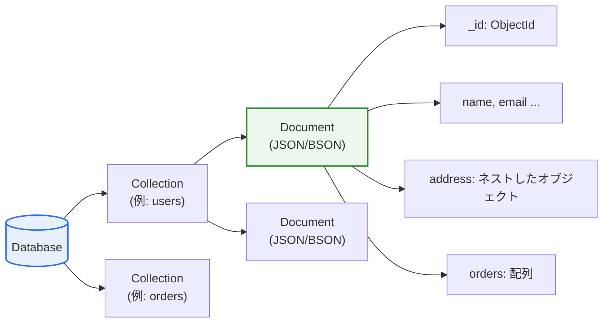
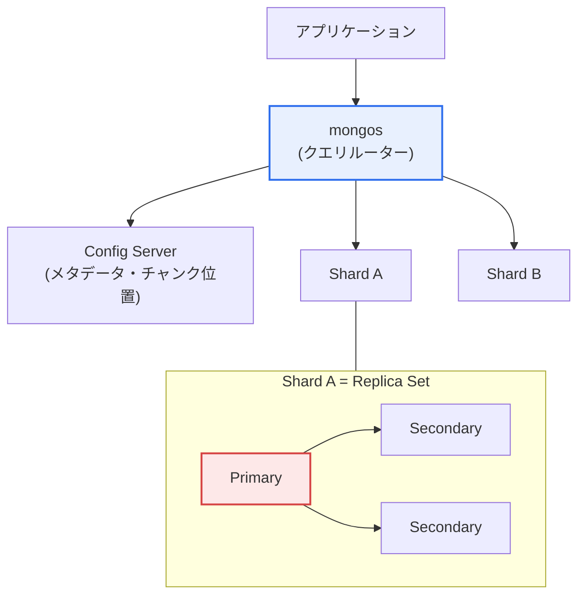

# MongoDB

## 1. 概要

### A. 定義

> **MongoDB**は、データを**JSONに類似したドキュメント(Document、内部保存形式はBSON)** の形で保存する代表的なドキュメント指向(Document-oriented)NoSQLデータベースであり、固定スキーマなしに柔軟にデータを扱い、シャーディングによる水平スケーリングとレプリカセットによる高可用性を標準で提供する。

MongoDBの中核的な発想は、「**データをテーブルの行ではなく、自己完結したドキュメントとして扱おう**」というものである。リレーショナルデータベース(RDB)はデータを複数のテーブルに正規化して分割し、結合(JOIN)でつなぐが、この方式は整合性と重複排除には強い一方で、スキーマが硬直的であり大規模な水平スケーリングが難しいという限界がある。これに対しMongoDBは、関連データを一つのドキュメントの中に丸ごと格納することを志向する。例えば、ユーザーとその住所・注文履歴を別々のテーブルに分けず、一つのユーザードキュメントの中に配列・オブジェクトとしてネストして保存する。そうすれば結合なしに一度の読み取りで照会できるため高速であり、フィールドを自由に追加・変更できるため柔軟であり(スキーマレス)、データを複数のサーバーに分散保存(シャーディング)して大規模にスケールさせやすい。

こうした特性は、データモデルとアプリケーションのオブジェクトとの間のギャップ、いわゆる「インピーダンスミスマッチ(impedance mismatch)」を減らすという点で、特に開発生産性に寄与する。オブジェクト指向言語で扱うネストしたオブジェクト構造がドキュメント形式とそのまま一致するため、複雑なORMマッピングや多段階の結合クエリなしに、アプリケーションコードで扱う形のまま保存・照会できる。このおかげで、要件が頻繁に変わり、大容量・半構造化データを扱うWeb・モバイル・IoTサービス、リアルタイム分析、コンテンツ管理などで広く採用されている。ただし、複数のドキュメントにまたがる強い整合性(複雑な結合・複数テーブルのトランザクション)が中核となる会計・精算のような業務には相対的に適さないという点は、明確に認識しておく必要がある。

### B. 登場の背景と必要性

MongoDBは2009年に登場し、その背景には2000年代後半におけるWebサービスの爆発的成長がある。トラフィックとデータが垂直スケーリング(スケールアップ)の限界を超えるにつれ、安価な汎用サーバーを複数台束ねて水平スケーリング(スケールアウト)しようという要求が高まった。同時にアジャイル開発が広がるにつれ、スキーマを毎回マイグレーションしなければならないリレーショナルモデルの硬直性が、開発速度を低下させるボトルネックとして指摘された。すなわちMongoDBの必要性は、「**柔軟なスキーマ + 大規模な水平スケーリング + 開発生産性**」という三つの要求が同時に高まったことに由来する。CAP定理の観点から見ると、MongoDBは基本的に一貫性(C)と分断耐性(P)を優先しつつ、設定によって可用性・一貫性のレベルを調整できる柔軟な折衷をとる。

## 2. データモデルと保存構造

MongoDBの論理構造は、リレーショナルと対応させて理解すると明確である。データベース(Database)は複数のコレクション(Collection)を格納する最上位の単位であり、コレクションはリレーショナルのテーブルに相当するが、スキーマを強制しない。コレクションは複数のドキュメント(Document)を格納し、ドキュメントがリレーショナルの行(Row)に相当する。各ドキュメントはフィールド-値のペアの集合であり、内部的にはBSON(Binary JSON)形式で保存される。BSONはJSONをバイナリ化した形式であり、文字列・整数・ブール値だけでなく、日付(Date)、バイナリデータ、`ObjectId`のような追加の型をサポートし、パース速度と保存効率を高める。

すべてのドキュメントは`_id`フィールドを必須で持ち、指定しなければMongoDBが12バイトの`ObjectId`(タイムスタンプ + マシン識別子 + カウンター)を自動生成して、グローバルな一意性を保証する。この`_id`にはデフォルトのインデックスが自動的に張られる。ドキュメント一つの最大サイズは16MBに制限されており、これより大きな大容量ファイル(画像・動画など)は、GridFSという別の規約でチャンク単位に分割して保存する。ドキュメントサイズの制限は、際限なく大きくなる配列フィールド(unbounded array)を防ぐ設計ガイドとしても機能する。

ドキュメント指向モデルの強みは「関連データの局所性(locality)」である。一度に一緒に読むデータが物理的に一つのドキュメントにまとまっていれば、ディスクI/Oが減って照会が高速になる。逆に、頻繁に更新されたり複数の箇所で共有されたりするデータを無理に埋め込むと、ドキュメントが肥大化して更新コストが大きくなる。そのため、後述する埋め込みか参照かの選択が、MongoDBモデリングの中核的な意思決定となる。

### A. 主な特徴

| 特徴 | 内容 | 原理・効果 |
|---|---|---|
| **ドキュメント指向** | JSON/BSONドキュメントで保存、ネスト・配列を表現 | オブジェクト-ドキュメント間のインピーダンスミスマッチの減少 |
| **スキーマの柔軟性** | 固定スキーマなし(フィールドを自由に追加) | アジャイル開発・頻繁な変更に対応 |
| **水平スケーリング** | シャーディングによる分散保存・拡張 | スケールアウトによる大容量処理 |
| **高可用性** | レプリカセット(Replica Set)による冗長化 | 自動フェイルオーバー(failover) |
| **インデックス・集計** | 多様なインデックス、集計パイプライン | 複雑な照会・分析をDB内で処理 |

特徴を列挙するだけにとどまらず、「なぜそのような特徴が可能なのか」を見ると、その根はすべてドキュメントモデルにある。スキーマの柔軟性はコレクションがドキュメント構造を強制しないことから生まれ、水平スケーリングはドキュメントにシャードキーを付与して範囲やハッシュでサーバーに振り分けられることから可能となり、高可用性はドキュメント単位の複製が比較的単純であるため自動化しやすい。すなわちMongoDBの特徴は互いに独立した機能ではなく、ドキュメントモデルという一つの設計上の選択から派生した結果である。

## 3. アーキテクチャ:レプリカセットとシャーディング

MongoDBの運用アーキテクチャは、大きく二つの軸、すなわち高可用性を担うレプリカセット(Replica Set)と、水平スケーリングを担うシャーディング(Sharding)で構成される。この二つは併用され、実際の本番環境では、各シャードがそれ自体一つのレプリカセットである構造が標準である。

### A. レプリカセット(Replica Set)と高可用性

レプリカセットは同一のデータを複数のノードに複製しておく構造であり、書き込みを受け付けるプライマリ(Primary)1台と、それを複製するセカンダリ(Secondary)複数台で構成される。クライアントの書き込みはプライマリで処理され、変更履歴はoplog(operation log)という特殊なコレクションに記録されて、セカンダリへ非同期に伝播される。プライマリが障害で応答しなくなると、残りのノードが合意(election)アルゴリズムによって新しいプライマリを選出する。この自動フェイルオーバー(failover)は通常数秒〜数十秒以内に完了し、サービス中断を最小化する。

レプリカセットで重要な概念が「Write Concern」と「Read Preference」である。Write Concernは、書き込みをいくつのノードが確認すれば成功とみなすかを定める。例えば`w:1`はプライマリのみが確認すればよく、`w:majority`は過半数のノードが確認しなければならないため、より安全であるが遅延が大きくなる。すなわち、整合性と性能の間の折衷をアプリケーションが直接調整するわけである。Read Preferenceは、読み取りをプライマリのみで行うか、セカンダリでも許可するかを定めて読み取り負荷を分散する。ただし、セカンダリはレプリケーション遅延(replication lag)のためにわずかに過去のデータを返すことがあるため、最新性が重要な照会はプライマリから読み取らなければならない。

### B. シャーディング(Sharding)と水平スケーリング

シャーディングは、一つの大きなコレクションをシャードキー(Shard Key)を基準に複数のシャードに分割して保存する技法である。データをチャンク(chunk)単位に分割して各シャードに分散し、チャンクが特定のシャードに偏ると、バランサーが自動的に再分配する。アプリケーションはこの分散を意識する必要がなく、`mongos`というルーターがクエリを適切なシャードへ転送し、Config Serverがどのチャンクがどのシャードにあるかというメタデータを管理する。

シャーディングの成否はシャードキーの選択にかかっている。単調増加するキー(例:タイムスタンプ)をシャードキーとして使うと、最新の書き込みが常に一つのシャードだけに集中する「ホットスポット」が生じ、スケーリングの効果が失われる。そのため、カーディナリティが高く、値が均等に分散し、クエリパターンとも合致するキーを選ばなければならない。MongoDBはこれを緩和するため、ハッシュシャーディング、複数のフィールドを組み合わせる複合シャードキー、そして急速に増加するキーを分散させるハッシュベースの分散などを提供している。シャードキーの選択を誤ると後から修正するのが非常に難しいため、設計初期にアクセスパターンを十分に分析することが重要である。

## 4. インデックスと集計パイプライン

MongoDBが単純なキー・バリューストアを超えて強力である理由は、豊富なインデックスと集計機能にある。インデックスがなければ、クエリはコレクション全体を走査するコレクションスキャン(collection scan)を実行し、データが大きくなるにつれて急激に遅くなる。MongoDBは単一フィールドインデックスだけでなく、複数のフィールドを組み合わせる複合インデックス、配列の各要素をインデックス化するマルチキーインデックス、テキスト検索用インデックス、位置ベースの照会用の地理空間(2dsphere)インデックス、そして一定時間が経過するとドキュメントを自動削除するTTLインデックスなどをサポートする。TTLインデックスは、セッション・ログ・キャッシュのように寿命が決まっているデータを自動的に期限切れにするのに有用である。

集計パイプライン(Aggregation Pipeline)は、複数の段階(stage)を順次連結してデータを変換・集計するフレームワークである。`$match`でフィルタリングし、`$group`でグループ集計し、`$sort`でソートし、`$lookup`で他のコレクションと結合する(リレーショナルの結合に相当)といった形で、複雑な分析クエリをDB内部で処理する。Unixのパイプのように前段の出力が後段の入力となる構造であるため、大容量データをアプリケーション側に引き出すことなくサーバー側で処理し、ネットワークコストを削減する。

## 5. リレーショナルDBとの比較:違いが生じる理由

二つのモデルの比較は、項目を列挙するよりも「なぜそのような違いが生じるのか」を理解することが重要である。根本的な違いはデータモデルから出発する。リレーショナルはデータを正規化して重複を排除し、結合で組み合わせるため整合性に有利であるが、結合コストとスキーマの硬直性を受け入れている。MongoDBは関連データをドキュメントに集めて結合を減らす代わりに、一部の重複を許容し、整合性の管理をよりアプリケーションに委ねる。

| 区分 | リレーショナル(RDB) | MongoDB | 違いの理由 |
|---|---|---|---|
| **データモデル** | テーブル・行(構造化) | ドキュメント(柔軟) | 正規化 vs 局所性優先 |
| **スキーマ** | 事前固定(schema-on-write) | 柔軟(schema-on-read) | コレクションが構造を強制しない |
| **関係** | 結合 | ドキュメント内のネスト・参照($lookup) | 一緒に読むデータを一緒に保存 |
| **スケーリング** | 主に垂直(スケールアップ) | 水平(シャーディング) | ドキュメントをシャードキーで分散可能 |
| **整合性** | 強いACID | ドキュメント単位の原子性 + マルチドキュメントトランザクション(4.0+) | 初期はスケーラビリティのために整合性を緩和 |
| **クエリ** | 標準SQL | MQL・集計パイプライン | ドキュメント構造に合わせたクエリ言語 |

実務的な含意は、「どちらがより良いか」ではなく「どのワークロードに適しているか」である。例えばECにおいて、商品カタログのように項目ごとに属性がまちまちで頻繁に変わるデータにはMongoDBの柔軟なスキーマが有利であるが、決済・精算のように複数の口座残高を原子的に更新しなければならない業務には、リレーショナルの強いトランザクションのほうが安全である。MongoDBも4.0からレプリカセットでのマルチドキュメントトランザクションを、4.2からシャーディング環境での分散トランザクションをサポートするようになり、この格差は縮まったが、トランザクションを乱用するとドキュメントモデルの性能上の利点を失うため、「必要な箇所にだけ」使うのが原則である。

### A. 埋め込み vs 参照(具体的事例)

モデリングの中核的な選択である埋め込み(embedding)と参照(referencing)を、ブログサービスの事例で見てみよう。投稿とコメントの関係において、コメント数が少なく常に投稿と一緒に照会されるのであれば、コメントを投稿ドキュメント内に配列として埋め込むのが有利である。結合なしに一度で読み取れ、ドキュメント単位の原子的な更新も保証される。逆に、人気の投稿に数万件のコメントが付く可能性があるなら、16MBのドキュメント上限に突き当たり、ドキュメントが肥大化して更新のたびに大きなドキュメントを書き直さなければならない。この場合は、コメントを別のコレクションに分離し、投稿の`_id`で参照する方がよい。すなわち、「一緒に読むか、どれだけ大きくなり得るか、どれだけ頻繁に更新されるか」というアクセスパターンが選択基準であり、この判断が性能を数十倍も左右する。

## 6. 深化:最新動向と実務適用

MongoDBは、初期の純粋なNoSQLというイメージを超えて、整合性と分析機能を強化しながら汎用データプラットフォームへと進化してきた。前述のマルチドキュメントACIDトランザクション(4.0/4.2)のサポートが代表的な転換点であり、「NoSQLにはトランザクションがない」という通念を覆した。その後のバージョンでは、時系列(Time Series)コレクションを導入してIoT・モニタリングデータを効率的に保存・圧縮し、フィールド単位の暗号化(Client-Side Field Level Encryption、Queryable Encryption)によって、機微情報をクライアント側で暗号化したまま保存・照会する機能を強化した。ストレージエンジンも、かつてのMMAPv1から、ドキュメント単位の同時実行制御と圧縮をサポートするWiredTigerへと標準が変わり、書き込み性能と保存効率が改善された。

クラウドの面では、マネージドサービスであるMongoDB Atlasが主流となった。Atlasは自動バックアップ・スケーリング・モニタリングに加え、全文検索のためのAtlas Search(Luceneベース)とベクトル検索(Atlas Vector Search)を統合した。特にベクトル検索は、生成AIのRAG(検索拡張生成)パイプラインにおいて埋め込みを保存し類似度検索を行う用途として注目され、「運用データとベクトルを一つのDBで扱う」という流れを生み出した。実務事例としては、大手メディア・ゲーム・EC企業が、ユーザープロファイル、リアルタイムセッション、商品カタログのようにスキーマが多様で大規模なデータにMongoDBを採用してきており、シングルビュー(Single View)の構築やリアルタイムのパーソナライズ推薦バックエンドなどが代表的な活用パターンである。一方、ライセンスは2018年にSSPL(Server Side Public License)に変更され、クラウドでの再販に制約が生じたが、この点は導入時にライセンスの検討が必要であるという意味で、実務上留意すべき点である。

## 7. 考慮事項および示唆

技術士の観点から見ると、MongoDBの導入は単に「高速で柔軟なDB」という認識を超えて、ワークロードの特性と整合性要件を総合的に判断するアーキテクチャ上の意思決定でなければならない。

1. **データモデリングが性能を左右する。** リレーショナルのように正規化のルールをそのまま適用するよりも、アプリケーションの実際のアクセスパターン(何を一緒に読み書きするか)をまず分析し、埋め込みと参照を決定しなければならない。スキーマレスだからといって設計が不要なわけではなく、むしろアクセスパターンに基づく設計がより重要になる。誤ったモデリングはドキュメントの肥大化・照会の非効率につながり、ハードウェアでも補いにくい。

2. **シャードキーの選択は取り返しの難しい決定である。** カーディナリティ・分散度・クエリパターンとの整合性を総合して初期に慎重に選ばなければならず、単調増加キーによるホットスポットを避けなければならない。スケーリングが必要になった後にシャードキーを変更することは大規模なデータ移行を伴うため、大容量が予想されるシステムは設計段階でシャーディング戦略を立てなければならない。

3. **整合性レベルをワークロードに合わせて調整する。** Write Concern・Read Preference・トランザクションによって、整合性と性能・可用性をきめ細かく折衷できる。金融・精算系のデータは`w:majority`とトランザクションで安全性を確保し、ログ・統計のように多少の遅延が許容されるデータは緩和された設定で性能をとるなど、データの等級別に差をつけたポリシーが望ましい。

4. **ポリグロットパーシステンスでアプローチする。** 一つのDBですべてを解決しようとするよりも、柔軟・大容量・半構造化はMongoDB、強い整合性・複雑な結合はRDB、キャッシュ・セッションはRedisといったように、データの特性に合わせて組み合わせるのが現代的なアプローチである。MongoDBの時系列・ベクトル検索への拡張はこの組み合わせの幅を広げるが、万能ではないことを前提に、各ストアの強みを組み合わせる設計能力が核心である。

5. **運用・セキュリティ・ライセンスのリスクを併せて検討する。** レプリカセット・シャーディングの運用はリレーショナルよりノード数が多く運用の複雑さが高いため、Atlasのようなマネージドサービスの活用を検討し、フィールド単位の暗号化・アクセス制御で機微情報を保護し、SSPLライセンスが自社のビジネスモデル(特にSaaSでの再販)に及ぼす影響を事前に点検しなければならない。

## 参考資料

- MongoDB公式ドキュメント: https://www.mongodb.com/docs/manual/
- MongoDB Data Modeling: https://www.mongodb.com/docs/manual/data-modeling/
- MongoDB Sharding: https://www.mongodb.com/docs/manual/sharding/
- MongoDB Transactions: https://www.mongodb.com/docs/manual/core/transactions/

---

> **一言まとめ**: MongoDBは*データをJSON類似のドキュメント(BSON)で保存* するドキュメント型NoSQLであり、スキーマの柔軟性・シャーディングによる水平スケーリング・レプリカセットによる高可用性が強みである。埋め込み/参照のモデリングとシャードキーの選択が性能を左右し、マルチドキュメントトランザクション・時系列・ベクトル検索へと進化しているが、強い整合性が求められる業務はリレーショナルとポリグロットで併用するのが望ましい。
