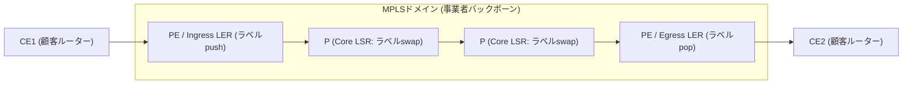
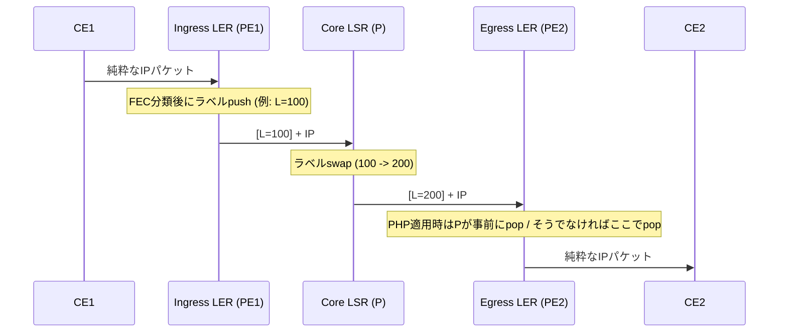

# MPLS(Multi-Protocol Label Switching)

## 1. 概要

> **MPLS(Multi-Protocol Label Switching)** とは、IPパケットに固定長の**ラベル(Label)** を付与し、ルーターが宛先IPアドレスの最長一致検索(Longest Prefix Match)の代わりにラベル値のみで高速スイッチング・経路決定を行えるようにする、**ラベルベースのパケット転送(Label Switching)技術**である。階層上はL2とL3の間で動作するため、しばしば**「Layer 2.5」**技術と呼ばれる。

MPLSが登場した背景には、1990年代後半のインターネットトラフィックの急増とともに明らかになった、**従来のIPルーティングが抱える三つの構造的限界**がある。第一は**性能の問題**である。ホップごとにルーターがルーティングテーブルを最長一致検索で参照する方式は、プレフィックス(prefix)が可変長であるためハードウェアによる高速化が難しく、初期のルーターではボトルネックとなった。MPLSは20ビットの固定ラベルを完全一致(exact match)で検索するため、ASICベースのラインレートスイッチングが容易になる。もっとも今日では、TCAMベースのハードウェアフォワーディングが一般化したため、純粋な「速度の利点」自体は薄れたが、以下の第二・第三の動機は依然として有効である。

第二は**トラフィックエンジニアリング(Traffic Engineering)の欠如**である。IGP(OSPF・IS-IS)は常に最短経路(shortest path)のみを選択するため、特定のリンクにトラフィックが集中して輻輳が発生しても、余裕のある迂回経路を活用できない。MPLSは宛先ではなく**経路(LSP)** 単位でトラフィックを明示的に配置できるため、帯域幅・遅延・ホップの制約を反映した経路割り当てが可能である。第三は**拡張可能なVPNサービスの必要性**である。通信事業者が多数の顧客のプライベートネットワークを一つのバックボーンで分離・収容するには、顧客ごとのルーティング分離が必要であるが、MPLS/BGP L3VPNはこれを、オーバーレイトンネルなしにバックボーンコアの状態を最小化しながら実現する。この三つの動機のうち、実際にMPLSを支配的なバックボーン技術にしたのは**VPNとTE**であった。

MPLSの特徴は次のように整理される。これらの特徴は、後述するVPN・TE・CoSサービスがすべて成立する土台となる。

- **プロトコル独立性(Multi-Protocol)**:上位(IPv4/IPv6)と下位(Ethernet・PPP・フレームリレー・ATM)の階層を問わず、ラベルでカプセル化・転送する。「Multi-Protocol」という名称の根拠である。
- **コネクション型(Connection-Oriented)転送**:コネクションレスのIPとは異なり、進入前にLSPという論理経路をあらかじめ設定し、その経路でのみ転送する。
- **コア状態の最小化**:ポリシー・分類はエッジ(PE/LER)に集中させ、コア(P/LSR)はラベルスイッチングのみを行うため、顧客数が増えてもコアの負担が線形に増大しない。
- **キャリアグレード機能の内蔵**:CoS/QoS(TC/EXPビット)、トラフィックエンジニアリング、FRR(50ms復旧)など、通信事業者のバックボーンに必要な機能を標準で提供する。

## 2. MPLSの構造と中核概念

MPLSドメインは顧客網(CE)と事業者バックボーン(PE・P)で構成され、トラフィックはドメイン進入時にラベルが付与(push)され、コアをラベル交換(swap)で通過した後、離脱直前に除去(pop)される。全体構造は次のとおりである。

**A. 構成要素 — LERとLSR.** MPLSネットワークのノードは役割によって分かれる。**LER(Label Edge Router)** はドメイン境界に位置し、入口(Ingress)ではIPパケットを分類してラベルを付与し、出口(Egress)ではラベルを外して再び純粋なIPルーティングで転送する。事業者網の観点では、LERは顧客設備(CE)と直接接する**PE(Provider Edge)** ルーターに該当する。**LSR(Label Switching Router)** はコアに位置する**P(Provider)ルーター**であり、IPヘッダーを参照することなく入力ラベルを出力ラベルに交換(swap)し、転送のみを担当する。このように「複雑な判断はエッジで一度だけ、コアは単純なスイッチング」という**エッジ-コア分離**の哲学が、MPLSのスケーラビリティの核心である。

**B. FEC(Forwarding Equivalence Class).** FECは「同一の方式(同じLSP・同じ処理)で転送されるべきパケットの集合」を意味する。Ingress LERは到着したパケットを、宛先プレフィックス、VPNへの所属、CoSなどのポリシーに従って特定のFECに分類し、そのFECにマッピングされたラベルを付与する。すなわち**分類は入口でただ一度だけ**行われ、以降コアはラベルのみを見る。例えば「10.1.0.0/16宛てのゴールド等級トラフィック」を一つのFECとして定義すれば、その条件に該当するすべてのパケットは同一の経路・同一のキューイングを受ける。

**C. ラベルとラベルスタック(Label Stack).** MPLSラベルは、L2ヘッダーとL3ヘッダーの間に挿入される32ビットの**シム(Shim)ヘッダー**であり、構造は下表のとおりである。特に**ラベルスタック**は複数のラベルを入れ子にして積む(push)ことを可能にし、外側のラベルをバックボーン転送用(transport)、内側のラベルをサービス識別用(VPN・疑似回線)として階層化する**トンネル・イン・トンネル**構造を実現する。これがMPLS VPNの根幹である。

| フィールド | サイズ | 説明 |
|------|------|------|
| Label | 20 bit | ラベル値(0〜1,048,575)。0〜15は予約ラベル(例:0=IPv4 Explicit NULL、3=Implicit NULL) |
| TC(EXP) | 3 bit | Traffic Class — CoS/QoS優先度の表示(DiffServマッピング) |
| S(Bottom of Stack) | 1 bit | スタック最下位のラベルであれば1 |
| TTL | 8 bit | Time To Live — ループ防止およびホップカウント |

**D. LSP(Label Switched Path).** LSPは、Ingress LERからEgress LERまで特定のFECのパケットがたどる**単方向の論理経路**である。双方向通信のためには二つのLSPが必要である。LSPは、IGPの最短経路に従う**ホップバイホップ(LDPベース)** 方式と、制約条件を反映して明示的に設定する**明示的経路(RSVP-TEベース)** 方式に分かれる。

## 3. MPLSの動作原理とラベル配布

MPLSデータプレーンの中核動作は、**push(付与)・swap(交換)・pop(除去)** の三つである。以下のシーケンスは、一つのパケットがドメインを通過する過程でラベルがどのように変化するかを示す。

**A. 転送手順とPHP.** Ingress LERはFECにマッピングされたラベルをpushし、各コアLSRは自身の**LFIB(Label Forwarding Information Base)** を参照して入力ラベルを出力ラベルにswapする。Egress LERは最後のラベルをpopし、IPルーティングに戻す。この際、**PHP(Penultimate Hop Popping)** 技法がよく適用される。これは、最後から2番目(penultimate)のLSRがあらかじめラベルを除去することで、Egress LERが「pop後に再びIP検索」という二重検索を行わずに済むようにするものである。Egressは予約ラベル**3(Implicit NULL)** を広告することで、「ラベルを外して純粋なIPで送れ」と隣接ノードに指示する。

各LSRのスイッチング判断は、**LFIB**という単純な検索テーブルによって行われる。例えば、あるコアLSRのLFIBが下表のとおりであれば、入力インターフェースにラベル100が入ってきたときにこれを200に交換(swap)してインターフェースIf2へ送出し、ラベル300はpop後にIP転送する。このように「入力ラベル → (操作、出力ラベル、出力ポート)」の完全一致検索のみを行うため、ハードウェアによる高速化とラインレート処理が容易である。

| 入力ラベル | 操作 | 出力ラベル | 出力インターフェース |
|-------------|------|-------------|------------------|
| 100 | swap | 200 | If2 |
| 150 | swap | 250 | If3 |
| 300 | pop | (なし、IP転送) | If1 |

**C. TTLとループ防止.** MPLSラベルにも8ビットのTTLがあり、IP TTLと同様にホップごとに1ずつ減算してループを防止する。IngressでIP TTLをラベルTTLにコピー(uniform mode)することも、独立して扱う(pipe mode)こともでき、TTLが0になるとパケットを破棄する。これは、誤ったLSP設定や一時的な経路の不一致の状況において、パケットが無限に循環するのを防ぐ安全装置である。

**D. ラベル配布プロトコル.** ラベル-FECのマッピング情報をルーター間で交換するには、別途のシグナリングプロトコルが必要である。代表的に三つが使われる。**LDP(Label Distribution Protocol)** は、IGPが計算した経路をそのまま辿ってホップバイホップでラベルを配布し、設定が単純であるため基本的な転送網で広く使われるが、帯域幅予約・TEはサポートできない。**RSVP-TE**(RSVPの拡張)は、帯域幅・優先度・明示的経路の制約を反映してLSPを設定し、TEと**FRR(Fast ReRoute)** の基盤となる。**MP-BGP(Multiprotocol BGP)** は、L3VPNにおいて顧客経路にVPNラベルを載せてPE間で伝播する役割を担う。まとめると、**「転送網のラベルはLDP/RSVP-TE、サービス(VPN)ラベルはMP-BGP」** という役割分担になる。

**E. 制御プレーンとデータプレーンの分離.** MPLSは、経路・ラベルを計算・配布する制御プレーン(IGP+LDP/RSVP-TE/BGP)と、実際のパケットをスイッチングするデータプレーン(LFIBベースのpush/swap/pop)が分離されている。この分離によってデータプレーンは単純かつ高速に保たれ、制御プレーンのポリシーを変えるだけで多様なサービス(VPN・TE・CoS)を載せることができる。後述するセグメントルーティングとSDNとの統合は、まさにこの制御プレーンを単純化・集中化しようとする流れである。

## 4. 主な応用:MPLS VPNとトラフィックエンジニアリング

**A. MPLS L3VPN(BGP/MPLS IP VPN、RFC 4364).** 最も成功したMPLSの応用である。事業者はPEルーターに顧客ごとの**VRF(Virtual Routing and Forwarding)** テーブルを設け、顧客のルーティングを物理的には一台の機器内で論理的に分離する。異なる顧客が同一のプライベートIPアドレス帯(例:10.0.0.0/8)を使っても衝突しないよう、**RD(Route Distinguisher)** をプレフィックスの前に付けてグローバルに一意なVPNv4経路とし、**RT(Route Target)** によってどのVRFがその経路を取り込むか(エクスポート/インポートのポリシー)を制御する。転送時には**2段のラベルスタック**を使用する — 外側(transport)ラベルは宛先PEまでのLSPを指定し、内側(VPN)ラベルはそのPEでどのVRF・どの顧客へ送るかを指定する。この構造のおかげで、**コアのPルーターは顧客経路を一切知る必要がなく**(外側ラベルのみをスイッチング)、数千の顧客を収容してもコアの状態が爆発的に増えない。これが、IPSecオーバーレイと比較したMPLS VPNの決定的なスケーラビリティ上の優位である。

具体的な転送の流れを数値で見ると理解が明確になる。顧客A(ソウル支社、10.1.0.0/24)が同じ顧客A(釜山支社、10.2.0.0/24)へパケットを送るとする。① ソウルのCEは宛先10.2.0.1のパケットを接続先のPE1へ送る。② PE1は該当VRFで宛先を検索し、リモートのPE2が広告した**VPNラベル(例:内側 L=50)** をpushし、さらにPE2に到達するための**transportラベル(例:外側 L=100)** をその上にpushする(スタック `[100][50]`)。③ コアのPルーターは外側ラベル100だけを見てswap(100→200→…)しながら転送し、顧客経路10.2.0.0/24は一切知らない。④ PE2の直前のPルーターはPHPによって外側ラベルをpopし、`[50]`だけを残す。⑤ PE2は内側ラベル50によって「このパケットは顧客Aの釜山VRF宛て」であることを識別し、IPルーティングで釜山のCEに転送する。このように、**外側ラベルは位置(どのPE)、内側ラベルは所属(どの顧客・VRF)** を分担して担うため、数千の顧客VPNをコアの状態を増やすことなく収容できる。

**B. MPLS L2VPN(疑似回線、Pseudowire).** L3ではなくL2フレーム(イーサネットなど)をバックボーンの向こう側へそのまま転送するサービスである。二地点を結ぶポイントツーポイント方式の**VPWS(Virtual Private Wire Service)** と、複数の地点を一つのブロードキャストドメインのように結ぶマルチポイント方式の**VPLS(Virtual Private LAN Service)** に分かれる。企業が支社間で同一のL2セグメント(例:データセンターの拡張、DCI)を要求する場合に活用される。

**C. トラフィックエンジニアリング(MPLS-TE)とFRR.** RSVP-TEは、**CSPF(Constrained Shortest Path First)** によって「50Mbps以上の余裕・特定リンクの回避」のような制約を満たす経路を計算し、明示的なLSPを設定する。これにより、IGPの最短経路が引き起こす特定リンクの輻輳を回避し、バックボーンの利用率を高める。さらに**FRR(Fast ReRoute)** は、リンク・ノード障害時に事前計算されたバックアップLSPへトラフィックを局所的に迂回させ、通常**50ms以内**の復旧を達成する。これはIGPの再収束(数百ms〜数秒)よりはるかに速く、音声・映像などのリアルタイムトラフィックが求めるキャリアグレードの可用性(99.999%)要件を満たす。

| 応用 | シグナリング | 中核メカニズム | 代表的用途 |
|------|----------|---------------|-----------|
| L3VPN | MP-BGP(VPNv4) | VRF・RD・RT、2段ラベル | 企業の支社間プライベートWAN |
| L2VPN(VPWS/VPLS) | LDP/BGP | 疑似回線、MAC学習(VPLS) | DCI、L2拡張 |
| MPLS-TE | RSVP-TE | CSPF、帯域幅予約、FRR | バックボーンの輻輳回避・高可用性 |
| 基本転送 | LDP | ホップバイホップLSP | 単純なコアスイッチング |

## 5. 比較 — 隣接技術との違いおよび含意

**A. 従来のIPルーティング vs MPLS.** IPルーティングは、ホップごとに宛先アドレスを**最長一致検索**で独立に判断するコネクションレス(connectionless)方式であるため、経路制御が不可能である。MPLSは入口で一度分類した後、**ラベルの完全一致**で経路(LSP)を辿るコネクション型方式であるため、TE・VPN・CoSが可能である。違いが生じる根本的な理由は「判断の位置」にある — IPは各ホップが判断し、MPLSはエッジが判断してコアは実行するだけである。この委任構造が、コアの単純化とサービスの多様性を同時に生み出している。

| 区分 | 従来のIPルーティング | MPLS |
|------|------------------|------|
| 転送判断 | ホップごとに宛先IPを検索 | 入口で1回分類、コアはラベルのみ検索 |
| 検索方式 | 最長一致検索(可変) | ラベルの完全一致(固定20ビット) |
| 接続の性格 | コネクションレス(Connectionless) | コネクション型(LSP) |
| 経路制御(TE) | 不可(常に最短経路) | 可能(明示的経路・帯域幅予約) |
| VPN・CoS | 別途オーバーレイが必要 | ラベルスタックで内蔵 |
| 障害復旧 | IGP再収束(数百ms〜秒) | FRRで50ms以内 |

**B. LDP vs RSVP-TE.** 両者ともラベルを配布するが、LDPは「IGPの経路をそのまま辿る」ポリシーなしの配布であるため設定が容易で状態が少ない代わりに、帯域幅の認識・明示的経路が不可能である。RSVP-TEはリンクごとの状態(soft state)を維持しながら制約付き経路を確立するため、TE・FRRを提供するが、コアにLSPの数だけ状態が蓄積され、大規模網では**状態爆発(state explosion)** が負担となる。この状態の負担こそが、セグメントルーティング登場の直接的な動機である。

**C. MPLS VPN vs IPSec VPN.** MPLS VPNは事業者バックボーン内部でラベルによって分離する**信頼ベース**の方式であり、コアに暗号化がないため高速で、QoS・TEとの組み合わせが自然であるが、インターネット区間へは拡張されず、事業者に依存する。IPSec VPNは公衆インターネット上に暗号トンネルを確立する方式であり、どこでも利用でき安価であるが、遅延・性能の変動が大きくQoSの保証が難しい。実際の企業WANは「中核拠点はMPLS、インターネットブレイクアウト・小規模支社はIPSec」と混在させる場合が多く、この混在をソフトウェアでインテリジェント化したものがSD-WANである。

**D. MPLS vs SD-WAN.** SD-WANは、MPLS・インターネット・LTE/5Gなどの異種回線を、アプリケーションを認識するポリシーで動的に選択する**オーバーレイ**であり、安価なインターネット回線の活用によってコストを下げる。ただしSD-WANは根本的にアンダーレイの品質に依存するため、遅延・損失の保証が絶対的なトラフィックには、依然としてMPLSアンダーレイが好まれる。すなわち両者は代替関係というよりも、**MPLS(品質保証アンダーレイ)+SD-WAN(ポリシー・コスト最適オーバーレイ)** という補完関係に収束する傾向にある。

## 6. 深化 — セグメントルーティング(SR)への進化と最新動向

MPLSの長年の弱点は、LDP・RSVP-TEという**別途のラベル配布プロトコルを運用・同期**しなければならず、TEを使うとコアにホップごとの状態が蓄積されるという点であった。これを解消しようとするのが**セグメントルーティング(Segment Routing、SR)** である。SRは、IGP(IS-IS/OSPF)の拡張によって各ノード・リンクに**SID(Segment Identifier)** を広告し、Ingressが経路を**SIDリスト(ソースルーティング)** としてパケットヘッダーに明示する。その結果、コアは別途の状態を維持する必要がなくなり、**LDP・RSVP-TEを撤廃**でき、制御プレーンが大幅に単純化される。

SRは二つのデータプレーンを持つ。**SR-MPLS**は既存のMPLSラベルスタックをそのままデータプレーンとして再利用するため、すでにMPLSを運用している事業者が、ハードウェアを交換せずに制御プレーンだけを変えて導入できる**実用的なアップグレードパス**である。一方、**SRv6**はMPLSラベルそのものを捨て、IPv6拡張ヘッダー(SRH)にSIDを格納してネイティブIPv6上で動作し、MPLSを完全に取り除く。業界資料によれば、今日の移行は概ね**SR-MPLSを先に経由**して段階的にSRv6へ進む傾向があり、SRv6は5G伝送・エッジ・大規模クラウドで好まれると紹介されている(ただし採用の速度・比率は事業者ごとに異なるため、断定は避ける)。実際に、Rakuten MobileはCiscoとともにSRv6ベースのオーバーレイで伝送網を単純化し、クラウドSD-WANを実現した事例として言及されている。

また、SRは中央コントローラー(SDN)と組み合わせて**SR-TE**で経路をプログラミングしやすいため、「MPLSのキャリアグレード機能 + SDNの集中制御・自動化」を同時に取り入れる方向へと発展している。予想出題の方向としては、① MPLSの基本構造・動作(ラベルスタック・push/swap/pop・PHP)、② L3VPNのRD/RT・2段ラベルの原理、③ TE・FRRの50ms復旧、④ **MPLSとSD-WAN・セグメントルーティングの比較および進化の関係**をまとめて記述する比較・展望型の問題が有力である。

## 7. 考慮事項および示唆(技術士の観点)

- **適用戦略 — 階層的なサービス設計**:転送網は単純なLDPのままとし、TE・高可用性が必要な区間にのみRSVP-TE(またはSR-TE)を選択的に適用する二元化が、状態の負担と運用の複雑さを低減する。VPN・CoSのポリシーは必ずエッジ(PE)に集中させ、コアを軽く保つことでスケーラビリティが確保される。

- **トレードオフ — 品質保証 vs コスト/柔軟性**:MPLSはSLA・QoS・低遅延を保証するが、回線単価が高く、プロビジョニングが遅く、事業者への依存が大きい。逆にインターネット+SD-WANは安価で俊敏であるが、品質の変動がある。トラフィックの重要度(リアルタイム・基幹系 vs インターネット・バックアップ)に応じて回線を階層化する(ハイブリッドWAN)ことが現実的な最適解である。

- **セキュリティの観点 — 分離 ≠ 暗号化**:MPLS VPNの「分離」はラベルベースの論理的分離であって、暗号化ではない。事業者バックボーンを信頼しない規制・金融環境では、MPLSの上にIPSecを重畳するか、ゼロトラスト・SASEの観点からエンドツーエンドの暗号化を別途設計しなければならない。

- **移行・展望 — SR/SRv6とSDNの統合**:新規・拡張のバックボーンでは、LDP/RSVP-TEの代わりにSR-MPLSを優先的に検討し、IPv6の全面化・5G伝送・エッジ拡張のロードマップがあるならば、SRv6を段階的に組み入れることが望ましい。ただしSRv6には、ヘッダーのオーバーヘッド・ハードウェアサポートの成熟度という課題があるため、検証後に段階的に導入する。

- **連携技術**:MPLSは、QoS(DiffServ・EXPマッピング)、SD-WAN、SASE/ZTNA、5Gローカル網・ネットワークスライシング、データセンター相互接続(DCI)と密接に連携する。技術士の答案では、単一の技術としてではなく、**エンドツーエンドWANアーキテクチャの一層**として位置付けて記述することが望ましい。

## 参考資料

- IETF RFC 3031, *Multiprotocol Label Switching Architecture* — https://datatracker.ietf.org/doc/html/rfc3031
- IETF RFC 3032, *MPLS Label Stack Encoding* — https://datatracker.ietf.org/doc/html/rfc3032
- IETF RFC 4364, *BGP/MPLS IP Virtual Private Networks (VPNs)* — https://datatracker.ietf.org/doc/html/rfc4364
- IETF RFC 8402, *Segment Routing Architecture* — https://datatracker.ietf.org/doc/html/rfc8402
- Segment Routingコミュニティ、SR-MPLS/SRv6の動向 — https://www.segment-routing.net/
- WWT, *Segment Routing: The Future of MPLS* — https://www.wwt.com/article/segment-routing-the-future-of-mpls

---
> **一言まとめ**: MPLSは、IPパケットに20ビットのラベルを付与してコアを完全一致スイッチングで通過させるL2.5のコネクション型技術であり、エッジ-コア分離を基盤としてL3/L2 VPN・トラフィックエンジニアリング・FRRのようなキャリアグレードのサービスを提供する。今日ではLDP/RSVP-TEの状態負担を軽減するセグメントルーティング(SR-MPLS・SRv6)とSD-WANによって進化・補完されつつある。
