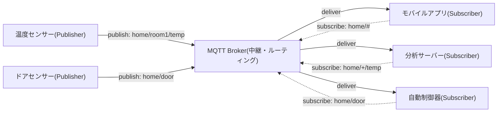
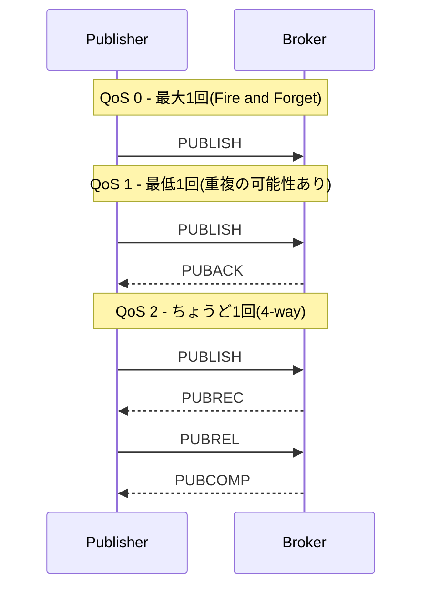
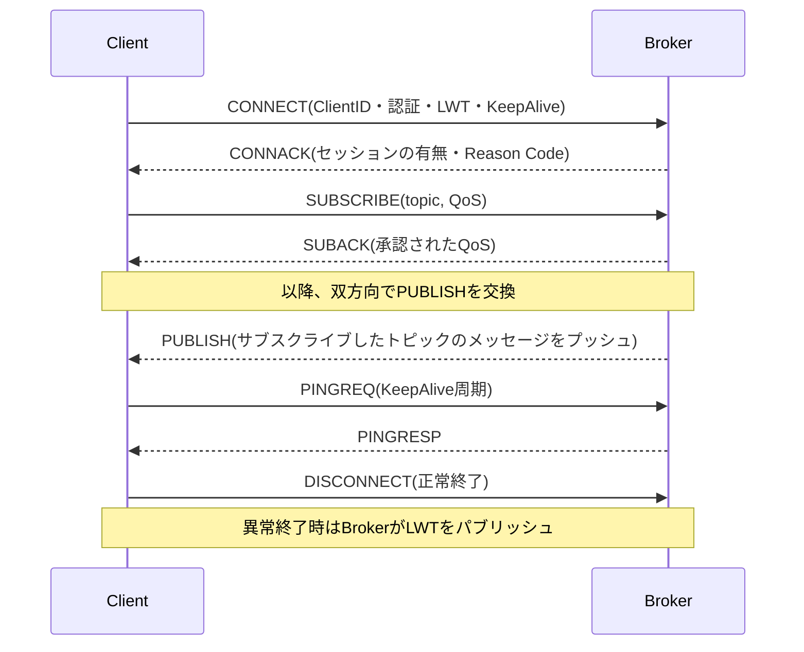

# MQTT(Message Queuing Telemetry Transport)

## 1. 概要

> **定義**: MQTTは、パブリッシュ/サブスクライブ(Publish/Subscribe)モデルを基盤とする**軽量メッセージングプロトコル**であり、帯域幅・電力・演算資源が制約された環境において、多数のデバイスがブローカー(Broker)を介して非同期に通信するよう設計されたアプリケーション層プロトコルである。OASIS MQTT 3.1.1(2014)として標準化され、同一仕様がISO/IEC 20922:2016として採択された。2019年にはOASIS MQTT 5.0として機能が大幅に拡張された。

MQTTが登場した背景には、1999年にIBMとArcom(現Eurotech)が石油パイプラインの遠隔監視(SCADA)のために、**衛星リンクのように帯域幅が狭く、遅延・切断が頻繁な回線**でも安定してセンサーデータを収集しなければならなかったという産業の現実がある。当時標準であったHTTPは、リクエスト/レスポンス(Request/Response)構造であるためヘッダーが重く、サーバーがクライアントに能動的にデータを送り込めず(ポーリングが必要)、リクエストのたびに接続を再確立するコストが大きかったため、数千台の低スペックノードをリアルタイムに扱うには不向きであった。MQTTはこの問題を、**固定ヘッダー2バイトという極端な軽量化**、**コネクション指向の常時セッション**、そして**ブローカー中心のパブリッシュ/サブスクライブ分離**によって解決する。

パブリッシュ/サブスクライブモデルの中核的な価値は、**送信者と受信者の時間的・空間的・同期的な結合を断ち切る(decoupling)** ことにある。パブリッシャーは、受信者が誰なのか、いくつあるのか、現在接続しているのかを知る必要がない。パブリッシャーは特定の**トピック(Topic)** にメッセージを投げ、そのトピックをサブスクライブしたすべてのクライアントがブローカーを通じてメッセージを受け取る。この構造のおかげで、新しいセンサーや分析サーバーを追加・削除しても既存ノードのコードを修正する必要がないため、数十万台規模へと拡張するIoT・スマートファクトリー・コネクテッドカー環境における事実上の標準プロトコルとして定着した。

特徴を要約すると、① 超軽量(最小固定ヘッダー2バイト、テキストのオーバーヘッドのないバイナリフレーム)、② パブリッシュ/サブスクライブに基づく非同期・多対多通信、③ 3段階のサービス品質(QoS 0/1/2)による信頼性の調整、④ TCPの常時接続上でのサーバープッシュのサポート、⑤ 遺言メッセージ(LWT)・保持メッセージ(Retain)・Keep Aliveなど、不安定な回線のためのセッション管理機能を備えている点である。

これらの特徴の組み合わせが重要である理由は、IoT環境の制約がいずれか一つではなく、**帯域幅・電力・演算・接続安定性が同時に不足する複合的な制約**であるためである。単にヘッダーを小さくしただけのプロトコルや、信頼性を高めただけのプロトコルでは、この複合的な制約を満たすことはできない。MQTTは、軽量性(帯域幅・電力)とQoSの選択肢(信頼性)、パブリッシュ/サブスクライブの分離(スケーラビリティ)、セッション管理(接続安定性)を一つのプロトコルの中でバランスよく提供することで、低スペックな末端からクラウドの収集層までをつなぐ実用的な解決策となった。このバランスこそが、MQTTが20年余りにわたってIoT標準の地位を維持してきた根本的な理由である。

## 2. MQTTアーキテクチャとパブリッシュ/サブスクライブモデル

MQTT通信は、メッセージを生成する**パブリッシャー(Publisher)**、メッセージを受信する**サブスクライバー(Subscriber)**、そして両者を中継してルーティング・セッション・QoSを担う**ブローカー(Broker)** で構成される。パブリッシャーとサブスクライバーを総称してクライアントと呼び、一つのクライアントがパブリッシャーであると同時にサブスクライバーであることもできる。すべてのメッセージは必ずブローカーを経由するため、ブローカーはシステムの中枢であると同時に単一障害点(SPOF)になり得るため、実務ではブローカーのクラスタリングと冗長化が必須である。

上記の構造において、パブリッシャーとサブスクライバーは互いをまったく知らないまま、トピック名だけで出会う。例えば温度センサーは`home/room1/temp`に25.3℃をパブリッシュするだけであり、この値がモバイルアプリ・分析サーバー・制御器のうち誰に何部配信されるかは、ブローカーがサブスクリプションテーブルを参照して決定する。このように**関係の中心がノードではなくトピックである**という点が、REST APIのエンドポイント中心の考え方と根本的に異なり、イベント駆動アーキテクチャ(EDA)と自然に結合する。

### A. トピック(Topic)とワイルドカード

トピックはメッセージのアドレスであり分類体系であって、スラッシュ(`/`)で階層を区切る文字列である(例:`factory/line2/machine5/vibration`)。トピックは事前に定義や登録をする必要がなく、パブリッシュ時点で動的に生成されるため柔軟であるが、逆に**命名規則(naming convention)を組織レベルで標準化しなければトピックが乱立**し、運用が困難になる。実務では、`国/工場/ライン/設備/測定項目`のように上位から下位へ絞り込んでいく階層設計と、先頭のスラッシュ(`/`)や空白を禁止するといった規約を文書化する。

サブスクライバーは、二種類のワイルドカードで複数のトピックを一度にサブスクライブする。単一階層ワイルドカード`+`は一つのレベルだけを置き換え、`home/+/temp`は`home/room1/temp`・`home/room2/temp`にマッチする。多階層ワイルドカード`#`はそれ以下のすべての階層を包含し、`home/#`は`home`配下全体をサブスクライブする(必ずトピックの最後に位置する)。ワイルドカードはサブスクライブにのみ使用でき、パブリッシュのトピックには使えない。例えば工場の監視ダッシュボードは、`factory/+/+/vibration`ですべてのライン・設備の振動値だけを選択的に収集できるため、トピック設計がそのままデータフィルタリングの設計となる。

### B. QoS(サービス品質)の3段階

MQTTの最も特徴的な機能は、メッセージ単位で信頼性のレベルを選択するQoSである。TCP自体が信頼性を提供するが、アプリケーションの観点での**再接続・重複・消失のシナリオ**まで保証するため、プロトコル層で別途の確認手順を設けている。各段階は信頼性とオーバーヘッドが正確に反比例するため、設計者はデータの性質に合わせてトレードオフを決定しなければならない。

**QoS 0(At most once)** は、応答なしに一度だけ送信して忘れる方式であり、消失を許容する代わりにオーバーヘッドが最も小さい。毎秒数十件ずつ更新される温度・照度のように、一、二件抜けても差し支えない高頻度のテレメトリに適している。**QoS 1(At least once)** は受信側のPUBACKを受け取るまで再送するため消失はないが、再送の過程で**重複受信**が発生し得るため、アプリケーションが冪等性(idempotency)を保証しなければならない。**QoS 2(Exactly once)** は、PUBLISH→PUBREC→PUBREL→PUBCOMPの4-wayハンドシェイクによって重複・消失の両方を排除するが、往復が2回必要となるため遅延と負荷が最も大きい。決済・課金・コマンド伝達のように、ただ一度の正確な配信が必須の場合にのみ限定的に使用する。例えば、スマートメーターの15分単位の検針値は課金に直結するためQoS 2を、リアルタイムの電力モニタリンググラフにはQoS 0を使うといった形で使い分けるのが、典型的な実務設計である。

### C. セッション管理機能:LWT・Retain・Keep Alive

不安定な無線・移動環境を前提とするMQTTは、接続状態を管理する三つの仕組みを持つ。第一に、**遺言メッセージ(LWT、Last Will and Testament)** は、クライアントが接続時にあらかじめ登録しておくメッセージであり、そのクライアントが異常に切断されると、ブローカーが代わりにそれをパブリッシュする。例えば、センサーが`status/sensor7 = offline`を遺言として登録しておけば、バッテリー切れで突然消えても、監視システムが即座に障害を認識できる。第二に、**保持メッセージ(Retained Message)** は、ブローカーがトピックごとの最新メッセージ1件を保存しておき、**新たにサブスクライブしたクライアントに即座に配信**する機能であり、後から接続したノードもポーリングなしに最後の状態値をすぐに知ることができる。第三に、**Keep Alive**は、クライアントが指定した周期内にPINGREQを送って接続の生存を知らせるものであり、ブローカーは1.5倍の時間内にシグナルがなければ接続が切れたとみなし、必要に応じてLWTをパブリッシュする。この三つの機能が組み合わさることで、MQTTは数万台のノードが頻繁に接続・離脱する環境においても状態の一貫性を維持する。

## 3. 通信手順とプロトコルスタック

MQTTはTCP/IP上で動作し、デフォルトポートは平文で1883、TLS暗号化時は8883を使用する。通信は必ず、クライアントがブローカーに**CONNECT**を送り、ブローカーが**CONNACK**で応答する接続確立から始まる。CONNECTパケットには、クライアント識別子(Client ID)、認証情報(username/password)、Keep Alive周期、Clean Sessionフラグ、LWT設定が含まれる。以降、クライアントはSUBSCRIBE/PUBLISHを自由にやり取りし、終了時にDISCONNECTを送る。

接続のライフサイクル全体をシーケンスで見ると次のとおりである。接続確立後にサブスクライブとパブリッシュが交互に行われ、Keep Aliveがバックグラウンドで接続を支える構造を確認できる。

MQTTのコマンドの流れを階層とともに見ると次のとおりである。

| 階層 | プロトコル/技術 | 役割 |
|------|--------------|------|
| アプリケーション | MQTT | パブリッシュ/サブスクライブ、QoS、セッション管理 |
| セキュリティ | TLS/SSL | 機密性・完全性・サーバー/クライアント認証 |
| トランスポート | TCP(1883/8883) | 信頼性のある順序保証ストリーム |
| ネットワーク | IP | ルーティング・アドレス指定 |

Clean Session(3.1.1)/Clean Start・Session Expiry(5.0)フラグは、再接続時に以前のセッションを引き継ぐかどうかを決定する。Clean Sessionをfalseにすると、ブローカーがオフライン期間中のQoS 1・2メッセージをキューに保管しておき、再接続時に配信するため、断続的に接続するモバイル・低消費電力ノードがメッセージを取りこぼさない。逆にtrueにすると、毎回新しいセッションで開始し、状態を残さない。

一方、TCPでさえ負担となる超低消費電力のセンサーネットワークのために、**MQTT-SN(MQTT for Sensor Networks)** という派生版が存在する。MQTT-SNはUDP・ZigBeeなどの非TCP媒体上で動作し、長い文字列のトピックの代わりに2バイトのトピックIDを使用し、ゲートウェイがMQTT-SNと標準MQTTを変換する。これは、バッテリーで数年間持ちこたえなければならない無線センサーノードの現実的な制約を反映した設計である。

パケット構造の観点からMQTTの軽量性を具体的に見ると、すべての制御パケットは最小2バイトの**固定ヘッダー(Fixed Header)** で始まる。最初のバイトの上位4ビットがパケット種別(CONNECT・PUBLISHなど14種)を、下位4ビットがフラグ(DUP・QoS・RETAIN)を表し、続く可変長フィールドが残りの長さをエンコードする。その後に、必要な場合にのみ可変ヘッダーとペイロードが付く。HTTPがリクエスト1件に数百バイトのテキストヘッダーを消費するのとは異なり、MQTT PUBLISHのオーバーヘッドが数バイトにとどまる理由は、まさにこの極端に圧縮されたバイナリフレーム設計にある。毎秒数千件を数十万ノードがパブリッシュする環境では、この差が帯域幅・電力・クラウドの受信コストの大きな格差につながる。

## 4. 類似プロトコルとの比較

MQTTの位置付けを理解するには、競合・補完プロトコルとの違いを、その**違いが生じる理由**まで併せて見なければならない。HTTPと比較すると、HTTPはリクエスト/レスポンスに基づくため、サーバーがクライアントに能動的にデータを送り込むことが難しく、ヘッダーが大きいためバッテリー・帯域幅を消費するのに対し、MQTTは常時接続とサーバープッシュによってリアルタイム性と効率を確保する。ただし、ファイアウォールの通過性・キャッシング・エコシステムの成熟度ではHTTPが勝っているため、大容量ファイルの転送や公開APIには依然としてHTTP/RESTが有利である。

CoAP(Constrained Application Protocol)は、UDPベースのリクエスト/レスポンス型RESTスタイルであり、ブローカーなしのノード間直接通信に強く、オーバーヘッドもより小さいが、多対多のパブリッシュ/サブスクライブと状態維持が必要なシナリオではMQTTが優位である。AMQPは金融レベルのトランザクション・ルーティング・キューイングを提供する重厚なエンタープライズメッセージング標準であり、信頼性は高いがIoTの末端には過大である。一方Kafkaは、毎秒数百万件のログ・イベントストリームをディスクに保存・再生することに特化しており、MQTTが収集した末端のデータをゲートウェイでKafkaへ渡して大規模分析パイプラインに接続する**MQTT+Kafkaのハイブリッド**が実務の定石である。

| 区分 | MQTT | CoAP | HTTP | AMQP |
|------|------|------|------|------|
| 通信モデル | Pub/Sub | Req/Resp(REST) | Req/Resp | Pub/Sub・キュー |
| トランスポート | TCP | UDP | TCP | TCP |
| ヘッダーのオーバーヘッド | 非常に小さい(2B〜) | 小さい(4B〜) | 大きい | 中程度 |
| QoS | 0/1/2 | Confirmable/Non | なし | トランザクション |
| ブローカー | 必須 | 不要 | 不要 | 必須 |
| 主な用途 | IoTのリアルタイム収集 | 制約ノードのREST | Web・公開API | エンタープライズ金融 |

実際の産業適用を見ると、AWS IoT Core・Azure IoT Hub・Google Cloud IoTはいずれもMQTTをデバイス接続の基本プロトコルとして採用しており、コネクテッドカーは車両-クラウド間のテレメトリに、スマートファクトリーはOPC-UAと組み合わせた設備データの収集に、MQTTを広範に使用している。例えば、Facebook Messengerの初期バージョンがモバイルのバッテリー節約のためにMQTTを採用した事例は、このプロトコルがIoTを超えてモバイルのリアルタイム通信にも有効であることを示している。

定量的な利点を例で見ると、バッテリー駆動の遠隔センサーが30秒ごとに状態をサーバーに通知する場合、HTTPSのポーリング方式では周期ごとにTCPの3-wayハンドシェイクとTLSネゴシエーション、数百バイトのリクエスト・レスポンスヘッダーを繰り返さなければならないが、MQTTは最初の1回だけ接続を確立した後、常時セッション上で数バイトのPUBLISHだけを送信する。複数のベンダーの実測事例では、この方式が同一データの転送基準でネットワークトラフィックと消費電力を数倍以上削減すると報告されており、これは数万台規模では通信料金とバッテリー交換周期という総保有コスト(TCO)の差に直結する。ただし、正確な削減幅はペイロードサイズ・周期・回線品質によって異なるため、一般化には注意が必要である。

## 5. 深化:MQTT 5.0の進化と最新動向

2019年に標準化されたMQTT 5.0は、大規模なIoT運用で明らかになった3.1.1の限界を補い、エンタープライズ機能を大量に導入した。第一に、**Reason CodeとUser Property** を導入し、接続・パブリッシュの失敗原因を細分化して返し、任意のメタデータ(キー・バリュー)をメッセージに載せられるようになったことで、これまでアプリケーションのペイロードに無理に詰め込んでいたコンテキストをプロトコルヘッダーに分離した。第二に、**共有サブスクリプション(Shared Subscription)** は、`$share/group/topic`形式で同一グループの複数のサブスクライバーがメッセージを分担して受け取れるようにし、単一のサブスクライバーに負荷が集中していた問題を解決して、**コンシューマー側の水平スケーリング(ロードバランシング)** をプロトコルレベルでサポートする。第三に、**トピックエイリアス(Topic Alias)** は、長いトピック文字列を2バイトの整数に置き換えて反復送信時の帯域幅を削減し、**メッセージ有効期限(Message Expiry Interval)** は、古いコマンドが遅れて配信されて誤動作を引き起こすことを防ぐ。第四に、**リクエスト/レスポンスパターン(Response Topic・Correlation Data)** を公式にサポートし、パブリッシュ/サブスクライブの上でRPCスタイルのやり取りを標準化した。また、**フロー制御(Receive Maximum)** によって、遅いサブスクライバーがブローカーに圧倒されないようにした。

最新動向としては、産業用標準化団体がMQTTの上にデータ構造と状態管理の規約を載せた**Sparkplug B**仕様を採用し、スマートファクトリーの相互運用性を高めている。また、WebSocketを介したMQTT(ブラウザからの直接接続)、そしてブローカーのクラスタリング・エッジ-クラウド間のブリッジングによる超大規模な拡張が活発に適用されている。韓国国内でも、スマートシティ・デジタルツイン・電力AMI(遠隔検針)インフラにおいて、MQTTがデータ収集層の事実上の標準として使われており、情報管理技術士の観点からは、単なるプロトコルではなく**IoTプラットフォームアーキテクチャにおけるデータ収集・連携のバックボーン**として理解する必要がある。

## 6. 考慮事項および示唆

MQTTを実際のシステムに適用する際、技術士は次の観点を総合的に考慮しなければならない。

第一に、**セキュリティ強化は選択ではなく必須**である。MQTT自体は平文のプロトコルであるため、必ずTLS(8883)で伝送区間を暗号化し、Client ID・username/passwordベースの認証に加えて、X.509証明書・OAuthトークンベースの相互認証を適用しなければならない。また、トピック単位のアクセス制御(ACL)によって特定のクライアントがパブリッシュ・サブスクライブできるトピックを制限しなければ、乗っ取られたノード一つが全トピックを盗聴・汚染する可能性がある。軽量性を理由にセキュリティを省略することが、最もよくある事故原因である。

第二に、**ブローカーの可用性とスケーラビリティ**を設計初期に確保しなければならない。すべてのトラフィックがブローカーを経由する構造上、ブローカーはSPOFであると同時に性能のボトルネックとなるため、ブローカーのクラスタリング・冗長化とともに、共有サブスクリプションを活用したコンシューマーの拡張、そしてエッジブローカーと中央ブローカーをつなぐブリッジングトポロジーによって水平スケーリングを計画しなければならない。

第三に、**QoSとセッションポリシーの慎重な選択**がコストと信頼性を左右する。すべてのメッセージにQoS 2とClean Session=falseを乱用すると、ブローカーの保存・再送負荷が爆発的に増大する。データの重要度と消失許容度を分類し、テレメトリはQoS 0、状態・コマンドはQoS 1〜2と差をつけて適用し、セッションを維持するかどうかもノードの特性に合わせて決定するポリシー設計が必要である。

第四に、**トピック命名の標準化とガバナンス**が長期的な運用性を決定する。トピックが自由に生成されるという柔軟性は、標準がなければ管理不能な混乱に帰結するため、階層的な命名規則・ネームスペース・バージョン管理を組織レベルで文書化し、データガバナンス体制と連携させなければならない。

第五に、**連携技術との統合戦略**を併せて描かなければならない。MQTTは末端の収集に最適化されたプロトコルであるため、収集後のストリーム処理(Kafka)・時系列保存(TSDB)・リアルタイム分析・デジタルツインとの連携を含むエンドツーエンド(End-to-End)のデータパイプラインの観点からアーキテクチャを設計して初めて、実質的な価値を創出できる。

総合すると、MQTTは単なる通信規約を超えて、IoTデータアーキテクチャの**収集層の標準**として理解すべきであり、プロトコルの軽量性という長所が、セキュリティ・可用性・ガバナンスという運用上の課題と常に噛み合っている点を見落としてはならない。特に超接続(Hyper-connectivity)時代にデバイス数が指数関数的に増加するにつれ、プロトコルの選択よりも**大規模運用体制(スケーリング・セキュリティ・オブザーバビリティ)の成熟度**がプロジェクトの成否を左右する。今後は5G・エッジコンピューティングと結合して超低遅延制御へと領域を広げ、MQTT 5.0のリクエスト/レスポンス・共有サブスクリプション機能を活用した双方向のインテリジェントな制御が広がる見通しであり、技術士はこうした流れの中で、要求される信頼性・コスト・スケーラビリティのトレードオフを定量的に判断し、最適なアーキテクチャを提示できなければならない。

## 参考資料
- OASIS, "MQTT Version 5.0 Specification" (2019). https://docs.oasis-open.org/mqtt/mqtt/v5.0/mqtt-v5.0.html
- OASIS, "MQTT Version 3.1.1" / ISO/IEC 20922:2016. https://docs.oasis-open.org/mqtt/mqtt/v3.1.1/mqtt-v3.1.1.html
- MQTT.org, "MQTT: The Standard for IoT Messaging". https://mqtt.org/
- HiveMQ, "MQTT Essentials" シリーズ. https://www.hivemq.com/mqtt-essentials/

---

> **一言まとめ**: MQTTは、ブローカーベースのパブリッシュ/サブスクライブとQoS 0/1/2・LWT・Retainによって、制約環境で軽量かつ信頼性のある通信を提供するIoTメッセージング標準であり、5.0の共有サブスクリプション・User Propertyなどによってエンタープライズ級のスケーラビリティを備えたデータ収集バックボーンである。
