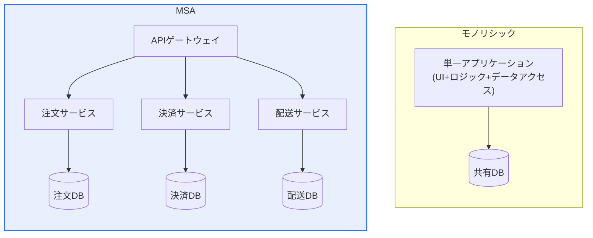
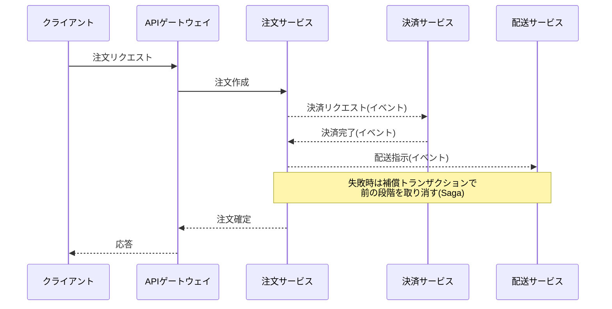

# マイクロサービスアーキテクチャ(MSA, Micro Service Architecture)

## 1. 概要

### A. 定義と特徴
> **MSA**とは、一つのアプリケーションを**独立して開発・デプロイ・スケーリング可能な小さなサービスの集合**として構成するアーキテクチャスタイルである。各サービスは一つのビジネス機能を担当し、独自のデータベースを持ち、軽量なAPI(主にHTTP/REST、メッセージング)で通信し、自律的に運用される。

MSAの中核的な発想は、「**巨大な一つを小さな複数に分割し、それぞれを独立させよう**」というものである。従来のモノリシック(Monolith)では、UI・ビジネスロジック・データアクセスが一つの大きなデプロイ単位にまとめられている。規模が小さいうちはこの構造が単純で効率的であるが、アプリケーションが大きくなるにつれ、三つの慢性的な問題が現れる。第一に、小さな修正でも全体を再ビルド・再デプロイしなければならず、デプロイ周期が遅くなる。第二に、特定の機能だけを部分的にスケーリングできないため、トラフィックが一つの機能に集中してもアプリケーション全体を複製しなければならない。第三に、一つのモジュールのメモリリーク・障害がプロセス全体を麻痺させ、障害が全面的に拡散する。

MSAは、この問題を機能単位(例:会員・注文・決済・配送)の独立したサービスに分解することで解決する。各サービスは独自のストレージを持ち、独立してデプロイされるため、決済ロジックだけを修正して決済サービスだけをデプロイでき(**迅速なデプロイ**)、注文が殺到すれば注文サービスだけを複数に増やすことができ(**効率的なスケーリング**)、配送サービスがダウンしても会員・注文は動作し続ける(**障害の隔離**)。組織の観点でも、サービスごとに小さなチームが全権を持って開発・運用する自律性が生まれる。この自律性がMSAの最大の利点であるが、その代償として「分散システム」というまったく異なる難易度の問題 — ネットワーク遅延・部分障害・データ整合性・運用の複雑さ — を抱え込むことになるという点を、必ず併せて理解しなければならない。

### B. 登場の背景
MSAが台頭した背景には、三つの流れが噛み合っている。第一は**ビジネスのスピード**である。Web・モバイルサービスの競争が激化するにつれ、「一日に数十回デプロイする」俊敏性が生存条件となり、全体を一括でデプロイするモノリシックではこのスピードを出せなかった。第二は**クラウドとコンテナの成熟**である。サーバーを必要なときに即座に増減させる弾力的なインフラ、そしてサービスを軽量にパッケージング・デプロイするコンテナ(Docker)とオーケストレーション(Kubernetes)が登場したことで、多数の小さなサービスを実際に運用できる土台が整った。第三は**組織論(コンウェイの法則)** である。「システムの構造は、それを作る組織のコミュニケーション構造に似る」という洞察から、小さく自律的なチーム構造と、小さく自律的なサービス構造を一致させようとする試みがMSAにつながった。

### C. 実装時の原則
| 原則 | 内容 |
|---|---|
| **単一責任** | サービスは一つのビジネス機能(ドメイン)に集中 |
| **自律性・独立デプロイ** | サービスごとの独立した開発・デプロイ・スケーリング |
| **分散データ** | サービスごとに独自のデータベース(DB共有禁止) |
| **障害の隔離** | 一つのサービスの障害が全体に伝播しないよう設計 |
| **API通信・疎結合** | 標準インターフェース(REST/メッセージング)のみで通信 |
| **自動化** | CI/CD・モニタリング・インフラ自動化で運用負担を相殺 |

これらの原則の中で、実務で最も頻繁に崩れるのが「**分散データ**」である。複数のサービスが便宜上一つのデータベースを共有すると、デプロイは分かれていてもデータが結び付いているため、スキーマを一つ変えるだけで複数のサービスを同時にデプロイしなければならない「**分散モノリス(distributed monolith)**」へと転落する。これはモノリシックの結合度とMSAの複雑さを同時に抱え込む最悪の形態であるため、サービスごとのデータ所有権を守ることがMSAの成否を分ける中核的な規律である。

## 2. モノリシック vs MSAの構造

以下の構造図は、二つのアーキテクチャのデプロイ・データ所有構造の違いを示す。モノリシックは一つのプロセスと一つのDB、MSAは複数のサービスとサービスごとのDBがAPIで接続された形態である。

二つの構造の違いは、単に「一塊か分割か」ではなく、**どこに複雑さが位置するか**の違いである。モノリシックでは複雑さがコード内部(巨大なコードベース)にあり、MSAでは複雑さがサービス間(ネットワーク・通信・データ整合性)へと移動する。したがってMSAは初期の複雑さが高く、小規模・単純なサービスにはかえって過剰設計となる。下表の「適合」の項目がこの判断の基準となる。

| 区分 | モノリシック | MSA |
|---|---|---|
| **構造** | 単一統合 | 独立サービスの集合 |
| **デプロイ** | 全体一括 | サービスごとに独立 |
| **スケーリング** | 全体の水平スケーリング | 必要なサービスのみ選択的にスケーリング |
| **障害** | 全体に影響 | 隔離(部分障害) |
| **データ** | 共有DB(強い一貫性が容易) | 分散DB(結果整合性) |
| **初期の複雑さ** | 低い | 高い(分散システム) |
| **適合** | 小規模・単純・初期のスタートアップ | 大規模・複雑・頻繁な変更・大規模組織 |

実務事例として、大手EC・ストリーミングサービスが、トラフィックの急増と頻繁な機能追加に対応しきれずに、モノリシックからMSAへと移行した事例は広く知られている。逆に、初期のスタートアップが流行を追って最初から数十のサービスに分割したものの、運用人員・自動化なしでは手に負えず、再びモノリシックに戻した(いわゆる「MSAロールバック」)事例も多い。この相反する事例が示す教訓は明確である — **MSAは目的ではなく、対応すべき規模と組織・自動化の能力が整ったときに選択する手段である**という点である。

## 3. サービス間通信とデータ整合性

サービスが分割されると、「一緒に成功するか一緒に失敗しなければならない処理」を複数のサービスにまたがって処理しなければならない。例えば「注文作成 → 決済承認 → 在庫引当」は一つの論理的な取引であるが、三つのサービスに分散している。モノリシックであれば一つのDBトランザクションで原子的に処理するところであるが、サービスごとにDBが分離されたMSAでは、従来の分散トランザクション(2PC)は性能・可用性の問題からうまく適合しない。

そのためMSAは、強い一貫性(即時一致)を諦めて**結果整合性(eventual consistency)** を受け入れる代わりに、失敗を取り消す方式でデータの整合性を合わせる。代表的なパターンが**サーガ(Saga)** である。サーガは複数のサービスのローカルトランザクションを順次実行し、途中で失敗した場合は、すでに完了した段階を取り消す「**補償トランザクション(compensating transaction)**」を実行して全体を元に戻す。上記のシーケンスで配送指示が失敗すれば、決済を返金(補償)し注文をキャンセルするといった形である。サーガはさらに、一つのサービスが流れを指揮するオーケストレーション方式と、各サービスがイベントをサブスクライブして自律的に反応するコレオグラフィ(choreography)方式に分かれる。

部分障害に対応するもう一つの軸は、**回復性(resilience)パターン**である。特定のサービスが遅くなったりダウンしたりしたときに、呼び出しが無期限に待機して連鎖障害(cascading failure)へと広がるのを防ぐため、**サーキットブレーカー(circuit breaker)** で障害サービスへの呼び出しを一定時間遮断し、**タイムアウト・リトライ・バルクヘッド(リソースの隔離)** で障害を封じ込める。これらのパターンがなければ、「一つのサービスの障害が全体に広がらない」というMSAの障害隔離の利点は理論にとどまる。すなわちMSAにおける障害の隔離は自然に得られるものではなく、こうしたパターンを明示的に実装して初めて実現される設計の成果物である。

## 4. サービスメッシュ(Service Mesh)

MSAにおいてサービスが数十・数百に増えると、前述のリトライ・サーキットブレーカー・認証・モニタリングをサービスごとにコードで実装することは非現実的になる。言語・フレームワークがまちまちであれば同じロジックを何度も書き直さなければならず、ポリシーを変えるたびにすべてのサービスを再デプロイしなければならない。**サービスメッシュ**は、この「サービス間通信の共通関心事」をアプリケーションコードから分離し、インフラ層(サイドカープロキシ)で一括処理する方式である。

中核となる考え方は、各サービスの横に**サイドカープロキシ(Envoyなど)** を付け、サービスがやり取りするすべてのトラフィックがこのプロキシを経由するようにすることである。そうすれば、トラフィックルーティング・リトライ・サーキットブレーカー・mTLS暗号化・認証・モニタリングをプロキシが代わりに処理し、開発者はビジネスロジックだけに集中できる。ポリシーは中央(コントロールプレーン)で宣言的に設定され、コード修正・再デプロイなしに全サービスへ一括適用される。

| 要素 | 内容 | 効果 |
|---|---|---|
| **サイドカープロキシ** | 各サービスの横で通信を代行(Envoy) | 通信ロジックをコードから分離 |
| **トラフィック管理** | ルーティング・リトライ・サーキットブレーカー・カナリア | 無停止デプロイ・回復性 |
| **セキュリティ** | mTLS相互認証・サービス間暗号化 | ゼロトラストな内部ネットワーク |
| **オブザーバビリティ(Observability)** | 分散トレーシング・メトリクス・ログ収集 | 障害原因の追跡が容易 |

代表的な実装は**Istio**であり、データプレーン(Envoyプロキシ)とコントロールプレーンで構成される。ただし、サービスメッシュもタダではない。サイドカーが増えるとリソース消費と遅延が増加し、運用の難易度も高くなるため、サービス数が少ないうちは導入の実益は大きくない。最近ではサイドカーの代わりにノード単位のプロキシを使う軽量化(ambient mesh)の流れも現れており、サービスメッシュもまた、規模と必要性に応じて選択すべき対象であって、MSAの必須の付属品ではないという点に留意すべきである。

## 5. 深化 — MSA移行戦略と最近の動向

MSA導入における最も現実的な失敗原因は、技術ではなく「**始め方**」である。経験則として広く通用している原則が「**モノリスファースト(Monolith First)**」であり、ドメイン境界が不確かな初期には、よく構造化されたモノリシックで始めてビジネスと境界を学習した後、頻繁に変わる部分や独立したスケーリングが必要な部分からサービスを切り出していく段階的な移行が安全である。この際に活用される代表的な技法が**ストラングラーフィグ(Strangler Fig)パターン**であり、既存のモノリシックを一度に取り除くのではなく、新機能・分離された機能をゲートウェイの背後で少しずつ新規サービスに置き換えながら、段階的に古いシステムを「締め付けて枯らし」取り除く方式である。実際の大規模サービスのMSA移行も、ほとんどがこの段階的な経路をたどった。

サービスの境界をどう分けるかについては、**ドメイン駆動設計(DDD)** の「境界づけられたコンテキスト(Bounded Context)」が理論的な基準を提供する。すなわち、技術的なレイヤー(画面・ロジック・データ)ではなく、ビジネス上の意味の境界に沿ってサービスを分けて初めて、凝集度が高く結合度の低い分解となる。細かく分けすぎれば(過度なナノサービス化)通信のオーバーヘッドと運用負担が爆発的に増え、大きく分けすぎればMSAの利点が失われるため、この境界設定こそがアーキテクトの中核的な能力である。

最近の動向としては、第一に**クラウドネイティブの標準化**によって、KubernetesがMSAのデプロイ・運用の事実上の標準プラットフォームとなった。第二に、**オブザーバビリティ(Observability)** が分散トレーシング(OpenTelemetryなど)を中心に統合され、MSA運用の必須能力として定着した。第三に、過度なマイクロサービス化の副作用への反省から、適正な大きさのサービスを志向する「**マクロサービス**」や、モジュール性は守りつつ単一デプロイする「**モジュラーモノリス(modular monolith)**」が代替案として再注目されている。これは、MSAが万能ではなくトレードオフの選択であることを産業界が学習した結果として読み取ることができる。

## 6. 考慮事項および示唆

1. **分散システムの複雑さが根本的な代償**である。MSAはスケーラビリティ・独立性・障害の隔離を得る代わりに、ネットワーク遅延・部分障害・データ整合性・運用負担を抱え込む。サーキットブレーカー・サーガ・APIゲートウェイ・分散トレーシングのようなパターンとツールによってこの複雑さを常時管理しなければならず、これに対応できる自動化(CI/CD)とオブザーバビリティの能力が前提とならなければ、MSAはかえって毒となる。
2. **適切なサービス分解が成否を分ける**。ドメイン駆動設計の境界づけられたコンテキストを基準に、ビジネスの境界に合わせて分割しなければならない。過度な細分化は通信・管理コストを、過小な分解は利点の喪失を招くため、「適正な大きさ」を見つけることがアーキテクトの中核的な判断である。
3. **段階的な移行が現実的**である。最初から完全なMSAを目指すよりも、モノリスで始めてストラングラーパターンで必要な部分から切り出していく方がリスクを減らせる。「MSAを導入するか否か」は技術の流行ではなく、組織の規模・変更頻度・運用能力を総合した意思決定でなければならない。
4. **組織構造との整合(コンウェイの法則)** が必須である。自律的なサービスは自律的なチームを前提とする。サービスは分割したのに意思決定・デプロイの権限が中央に縛られていれば、MSAの俊敏性の利点は失われる。アーキテクチャの転換とは、すなわち組織の転換である。
5. **オブザーバビリティとセキュリティを最初から設計**しなければならない。サービスが分散すると障害原因の追跡が難しくなるため、分散トレーシング・集中ロギング・メトリクスを初期から備えなければならず、内部サービス間の通信もmTLSなどゼロトラストの観点から保護しなければならない。これらは後から付け加えることが難しい基盤能力である。

## 参考資料
- Martin Fowler, "Microservices": https://martinfowler.com/articles/microservices.html
- Istio公式ドキュメント: https://istio.io/latest/docs/
- microservices.io(Chris Richardson、パターンカタログ): https://microservices.io/

---

> **一言まとめ**: MSAは*アプリケーションを独立してデプロイ・スケーリング可能な小さなサービスに分解* するアーキテクチャであり、迅速なデプロイ・効率的なスケーリング・障害の隔離を得る代わりに、分散の複雑さ(結果整合性・部分障害・運用負担)を代償として支払う。**DDDに基づく境界設定・サーガ/サーキットブレーカー・サービスメッシュ・Kubernetes・段階的移行**によってその複雑さを制御して初めて成功する。
