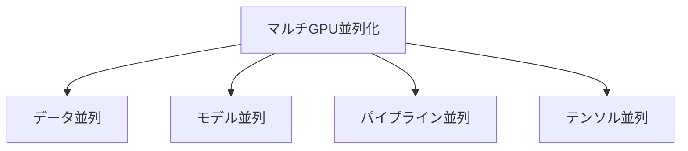

# マルチGPU技術(大規模ニューラルネットワークの訓練)

## 1. 概要

### A. 定義
> 複数のGPUに演算とデータを**分散して大規模ニューラルネットワークを並列に訓練**する技術であり、単一GPUのメモリ・演算の限界を超えるための分散学習(Distributed Training)の中核技法である。

マルチGPUが必要となる根本的な理由は二つある。一つは**モデルが1台のGPUメモリに収まらないこと**(例:数百億~数千億パラメータのLLM)であり、もう一つは**単独では学習に時間がかかりすぎること**である。前者の問題はモデルを分割する方式(モデル・テンソル並列)で、後者の問題はデータを分割して複数のGPUで分担処理する方式(データ並列)でアプローチし、実際の大規模学習はこれらを組み合わせて解決する。

### B. 利点および背景
GPT・LLaMAのような超大規模モデルが登場したことで、単一GPUでは学習そのものが不可能となった。これがマルチGPUが必須となった背景である。並列化の利点は単に速いことだけではない。複数のGPUのメモリを合わせて**単一GPUを超える大型モデル**を載せることができ、GPUを追加して処理量を**スケールアウト**でき、大きなバッチで学習して収束を安定化させることができる。ただし、GPUをN台つなげても速度がN倍になるわけではない。後述する**通信オーバーヘッド**のためである。この損失をどれだけ減らせるかが、すなわちスケーリング効率(scaling efficiency)である。

| 利点 | 内容 |
|---|---|
| **学習速度** | 並列演算により訓練時間を短縮 |
| **大規模モデル** | 複数GPUのメモリを合わせ、単一GPUを超えるモデルを学習 |
| **拡張性** | GPU追加により処理量をスケールアウト |
| **大容量バッチ** | 大きなバッチで収束を安定化 |

## 2. 並列化方式

並列化方式は**「何を分割するか」**によって区分される。**データ並列(Data Parallelism)**は、モデルをすべてのGPUに複製し、バッチ(データ)だけを分割して処理した後、各GPUが計算した勾配を**AllReduce**で平均して同期する。実装が容易なため最も広く使われるが、モデルが1台のGPUに収まるという前提がある。この前提が崩れると、**モデル並列(Model Parallelism)**によってモデル自体を複数のGPUに分割して載せる。モデル並列はさらに二つに細分される。**パイプライン並列**はレイヤーを段階(ステージ)に分けてベルトコンベアのように流し(ただし、前段が終わらなければ後段が始まらない遊休区間である「バブル」が生じる)、**テンソル並列**は一つの大きな行列演算そのものを複数のGPUが分割して同時に計算する。テンソル並列は演算の途中ごとに通信が頻繁に発生し、GPU間の帯域幅が非常に大きくなければならないため、通常は1ノード内(NVLink)で用いる。

| 方式 | 何を分割するか | 説明 |
|---|---|---|
| **データ並列** | バッチ(データ) | モデル複製、バッチ分割後にAllReduceで勾配を同期 |
| **モデル並列** | モデル(パラメータ) | 大型モデルを複数GPUに分割 |
| **パイプライン並列** | レイヤー(深さ) | レイヤーを段階に分けてパイプライン処理(バブルが存在) |
| **テンソル並列** | 個別演算(行列) | 一つの行列演算をGPU間で分割、通信が頻繁 |

## 3. 環境構築時の考慮事項

マルチGPU環境の成否を分けるのは、結局のところ**通信をどれだけ減らし、メモリをどれだけ節約するか**である。GPU数が増えるほど勾配同期の通信量が大きくなりボトルネックとなるため、GPU間にはNVLink、ノード間にはInfiniBand・RoCEのような超高速インターコネクトとNCCL通信ライブラリを用いて遅延を減らす。また、データ並列はモデルをGPUごとに複製するためメモリが浪費されるが、これをオプティマイザ状態・勾配・パラメータをGPU群に分散保存することで解決するのが**ZeRO**である。さらに、32ビットの代わりに16ビットを使う**混合精度(AMP)**、順伝播の中間値を破棄して再計算する**勾配チェックポインティング**によってメモリをさらに節約する。バッチが大きくなると学習が不安定になるため、学習率をバッチサイズに合わせて大きくし(スケーリング)、初期に徐々に上げるウォームアップを適用する。また、同期SGD(正確だが遅いGPUに足を引っ張られる)と非同期SGD(速いが不正確)の間の選択も考慮する。

| 考慮事項 | 内容 |
|---|---|
| **通信オーバーヘッド** | 勾配同期のボトルネック → NVLink・NCCL・InfiniBandで緩和 |
| **負荷分散** | GPU間の演算・メモリのバランス(パイプラインバブルの最小化) |
| **バッチ・学習率** | 大きなバッチ時の学習率スケーリング・ウォームアップ |
| **メモリ管理** | ZeRO・混合精度(AMP)・勾配チェックポインティング |
| **同期方式** | 同期(正確・低速) vs 非同期(高速・不正確)SGD |
| **電力・冷却・コスト** | 高密度GPUの発熱・電力管理、インフラコスト |

## 4. 関連技術・フレームワーク

こうした並列化・最適化の大部分は成熟したフレームワークによって抽象化されており、直接実装する必要は少ない。PyTorchの**DDP**はデータ並列を、**FSDP**とマイクロソフトの**DeepSpeed(ZeRO)**はメモリ分散までを、NVIDIAの**Megatron-LM**はテンソル・パイプライン並列を提供する。その下でGPU間の集団通信は**NCCL**が、ハードウェア層はNVLink/NVSwitchとInfiniBand・RoCEが担当する。

| 区分 | 例 |
|---|---|
| **通信ライブラリ** | NCCL, MPI |
| **分散フレームワーク** | PyTorch DDP/FSDP, DeepSpeed(ZeRO), Megatron-LM |
| **インターコネクト** | NVLink/NVSwitch, InfiniBand, RoCE |

## 5. 考慮事項および示唆(技術士の観点)
- **通信最適化が拡張効率の鍵**:GPUを増やしても通信ボトルネックが大きければ線形拡張は崩れる。インターコネクト・通信オーバーラップ(演算と通信の重ね合わせ)がスケーリング効率を左右する。
- **3D並列の組み合わせ**:超大規模モデルはデータ+パイプライン+テンソル並列を併用する**3D並列**で学習し、各並列の通信特性に合わせてノード内/ノード間の配置を最適化する。例えば、通信が頻繁なテンソル並列はNVLinkで結ばれたノード内に、通信が少ないデータ並列はノード間に配置する。
- **コスト・電力のトレードオフ**:高密度GPUクラスタは電力・冷却コストが大きいため、混合精度・効率的な並列の組み合わせによって目標性能あたりのコストを下げる設計が重要である。
- **AIデータセンターへの拡張**:HBM・超高速ネットワークと結合した大規模GPUクラスタが基盤モデル時代の中核インフラとなりつつあり、ソフトウェア(フレームワーク)とハードウェア(インターコネクト)の協調最適化が競争力を決定する。

---

> **一言まとめ**: マルチGPUは*データ・モデル・パイプライン・テンソル並列*によって何を分割するかに応じて大規模ニューラルネットワークを分散訓練する技術であり、GPUを増やしても損失を少なくするには**通信オーバーヘッド・メモリ(ZeRO/AMP)・同期**の最適化と、NCCL・DDP・InfiniBandなどのインフラが性能を左右する。
