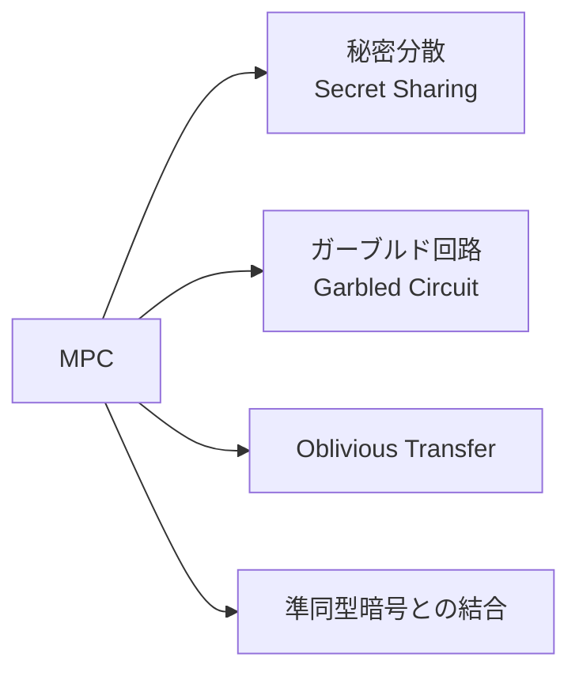
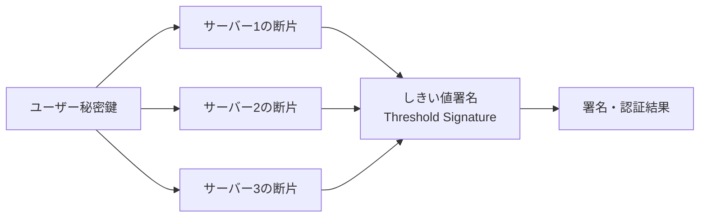

# マルチパーティ計算(MPC, Multi-Party Computation)

## 1. 概要

### A. 定義
> 互いに信頼しない**複数の参加者がそれぞれの入力を非公開に保ったまま**、事前に合意した関数の**結果値のみを共同で計算**して得る暗号プロトコル。一言でいえば「入力は隠し、結果だけを共有」する。

MPCの思考実験は、しばしば「**百万長者問題**」で説明される。二人の富豪が自分の財産額を相手に明かさずに、どちらがより裕福かだけを知る問題である。このように、元データを第三者や相手にも公開せずに、そのデータに対する計算結果のみを得る必要がある場合にMPCが用いられる。データを一箇所に集めて計算する従来方式とは異なり、MPCは**データを集めなくても共に計算**するという点が根本的に異なる。

### B. 原理
中核となるアイデアは、入力を**断片(Share)**に分割して分散することである。参加者は自分の入力を複数の断片に分け、互いに分け持たせるが、個々の断片一つだけでは元の値がまったく分からないように設計される(例:秘密sを乱数rで分割し、s−rとrとして配布)。その後、参加者たちは**断片の状態のまま加算・乗算演算を実行**し、最後に結果の断片を合わせて最終結果のみを復元する。加算は各自が断片を足すだけでよいので容易であるが、乗算は追加の通信(Beaver tripleなど)が必要でコストが大きい。この乗算コストがMPC性能の中核的な変数である。

### C. 特徴・セキュリティモデル
MPCの安全性は、共謀にどこまで耐えられるかで表現される。**しきい値(t)**未満の参加者が断片を集めても元の値を復元できてはならず、セキュリティ強度は攻撃者モデルによって分かれる。

| 項目 | 内容 |
|---|---|
| 入力プライバシー | 他の参加者の入力を知ることができない |
| 正確性 | 誠実な参加者は正しい結果を得る |
| 共謀耐性 | しきい値(t)未満の共謀に対して安全 |
| セキュリティモデル | Semi-honest(誠実だが好奇心あり) vs Malicious(悪意あり) |

ここで**Semi-honest**モデルは、参加者がプロトコルには誠実に従うものの、やり取りされる情報から他者の入力を覗き見ようとすると仮定するもので、比較的軽量である。一方、**Malicious**モデルは参加者がプロトコル自体に違反して操作すると仮定するため、検証手続きが追加されてはるかに重くなる。この仮定の違いが、そのまま性能とセキュリティのトレードオフの出発点となる。

## 2. MPC技術の種類

MPCを実装する技法は、計算をどのように表現するかによって分かれる。**秘密分散**は値を複数の断片に分けて算術演算として扱う方式で、多者(n者)計算と大規模な数値演算に強い。**ガーブルド回路**は計算を論理回路で表現した後、回路全体を暗号化して2者間で安全に評価する方式である。**OT**は、送信者が複数の値のうち受信者がどれを受け取ったかを知らずに伝達する基本構成要素であり、ガーブルド回路の土台となる。**準同型暗号との結合**は、暗号文のまま演算できるHEをMPCと組み合わせて通信量を削減するハイブリッドである。

| 技法 | 説明 | 代表例 |
|---|---|---|
| 秘密分散(Secret Sharing) | Shamirのしきい値分散で断片化した後に算術演算 | SPDZ, BGW |
| ガーブルド回路(Garbled Circuit) | 回路を暗号化して2者間で安全に計算 | Yao's GC |
| OT(Oblivious Transfer) | 何を渡したか分からない選択的転送 | GCの基盤要素 |
| 準同型暗号との結合 | 暗号文演算とのハイブリッドで通信を削減 | FHE+MPC |

## 3. MPCベースの認証サービス

MPCの代表的な実用例が**鍵の分散管理**である。従来の認証では秘密鍵を一箇所に保存するが、その地点が突破されるとすべてが奪われる(単一障害点)。MPCベースの認証は、秘密鍵を最初から**一度も一つにまとめられたことのない断片として分散生成(DKG)**し、署名が必要なときにt/n台のサーバーが各自の断片で部分計算に協力して、**完全な秘密鍵をどこでも復元することなく**署名を生成する(しきい値署名)。したがって、サーバー1~2台が漏洩しても、しきい値未満であれば鍵は安全である。

| 区分 | 内容 |
|---|---|
| 分散鍵生成(DKG) | 秘密鍵を単一地点なしに分散生成・保管 |
| しきい値署名(Threshold Signature) | t/n台のサーバーが協力して初めて署名 → 単一の漏洩にも安全 |
| 活用 | MPCウォレット(暗号資産)、分散認証・PKI、パスワードレス認証 |

例えば、暗号資産の**MPCウォレット**は秘密鍵(seed)そのものを保存しないため、既存のハードウェアウォレットの紛失・奪取リスクを構造的に低減する。

## 4. 考慮事項および示唆
MPCの最大の実務上の障壁は**性能**である。乗算のたびに参加者間で通信が行き交い、Maliciousモデルでは検証の負担が加わるため、計算・通信のオーバーヘッドが大きい。したがって、演算回路の最適化と前処理(オフライン段階で乱数断片を事前生成)によってオンライン遅延を減らすことが鍵となる。それでもMPCは**PET(プライバシー強化技術)**の中核的な柱であり、複数の機関が元データを共有せずに共同分析するシナリオ、すなわち金融業界の共同**不正検知**、病院間の**医療データ連携**、個人情報を保護しながら学習するAIなどに用いられる。さらに、**準同型暗号・差分プライバシー・連合学習**と相互に補完し合い、データ活用と保護を両立させる方向へ発展している。

---

> **一言まとめ**: MPCは*複数の参加者が入力を非公開にしたまま結果のみを共同計算*する暗号技術であり、秘密分散・ガーブルド回路・OTで実装され、秘密鍵を分散して単一障害点なしにしきい値署名を生成する分散認証・MPCウォレットや、プライバシー保護型の共同分析に活用される。
