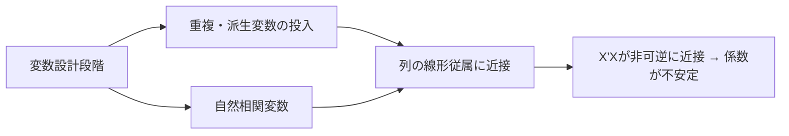

# 多重共線性(Multicollinearity)

## 1. 概要

### A. 定義
> 重回帰において**独立変数(説明変数)同士の間に強い線形相関関係**が存在し、個々の回帰係数の推定が不安定になる現象。

重回帰は、各独立変数が従属変数に及ぼす「**純粋な固有効果**」を係数として分離して推定する。この分離が成立するには、独立変数同士が互いに十分に独立していなければならない。ところが、二つの変数がほぼ同じ方向に動くと、回帰式は「従属変数の変化をAが説明したのかBが説明したのか」を区別する根拠を失う。数学的には、計画行列Xの列が線形従属に近づいてX'Xが**特異行列(非可逆)に近接**し、その逆行列の要素が爆発して係数推定値が大きく揺れ動く。すなわち多重共線性は、データそのものの誤りではなく、**変数構造に由来する識別(identification)問題**である。

### B. 問題点および必要性
多重共線性が深刻になると、係数の**標準誤差が大きくなり(分散の膨張)**t検定が有意とならず、さらには理論と逆の**符号に反転したり非現実的に大きな値**が推定されたりする。例えば、所得と消費を同時に投入すると、両者の係数が互いに打ち消し合って符号が揺らぐ。興味深いのは、このような状況でも**モデル全体の予測力(R²)は維持され得る**ことである。これは個々の変数の寄与を分けられないだけで、二つの変数が合わさって生み出す予測は依然として有効だからである。したがって「変数の影響を解釈・推論」する目的では必ず対処しなければならないが、「予測のみ」が目的であれば放置しても差し支えない場合がある。この目的の区別が対応戦略の出発点である。

## 2. 発生原因

原因は大きく三つに分かれる。第一に、同じ情報を単位だけ変えて投入する**重複変数**(身長をcmとinchで同時投入)は完全相関であるため最も深刻である。第二に、既存の変数から作った**派生・合成変数**(合計・比率)は元の変数と構造的に絡み合う。第三に、データの世界そのものに存在する**自然相関**(所得-消費、住宅面積-部屋数)は除去が難しく、実務で最もよく見られる。以下の表は類型別の例である。

| 原因 | 例 | 性格 |
|---|---|---|
| **重複変数** | 身長(cm)と身長(inch)の同時投入 | 完全共線性(除去で解決) |
| **派生・合成変数** | 合計・比率変数 | 構造的従属 |
| **自然相関** | 所得-消費、面積-部屋数 | 近似共線性(判断が必要) |

## 3. 診断方法

診断の核心は「ある変数が他の変数の組み合わせによってどれだけよく説明されるか」を定量化することである。その代表的な指標が**VIF(分散拡大係数)**であり、i番目の変数を残りの変数で回帰したときの決定係数Rᵢ²に対してVIFᵢ = 1/(1−Rᵢ²)と定義される。Rᵢ²が0.9ならVIF=10となり、これはその変数の係数の分散が、共線性がない場合よりも10倍に膨張したことを意味する。相関行列は二変数の組しか見ないため、三つ以上が絡み合った共線性を見逃す可能性があり、VIF・条件指数で補完する。

| 方法 | 判断基準 | 原理 |
|---|---|---|
| **相関係数** | 独立変数間の相関 ±0.8以上 | ペアごとの線形関係のみを捕捉 |
| **VIF/許容度** | VIF ≥ 10(厳格には5)、許容度=1/VIF | ある変数を残りの変数で説明できる程度 |
| **条件指数** | 30以上で深刻 | X'Xの固有値の最大/最小比の平方根 |

## 4. 解決方策

解決策は目的と原因によって異なる。解釈が重要であれば**変数の除去**が最も直接的であるが、ドメイン上必要な変数を取り除くとバイアス(欠落変数バイアス)が生じ得るため慎重であるべきである。情報の損失を避けるには、相関のある変数群を**主成分分析(PCA)**によって無相関な成分に再構成する。ただし、この場合の軸は解釈力が低下する。予測が目的であれば、係数を0の方向へ縮小させる**正則化回帰**が実用的である。Ridge(L2)は共線性下でも係数の分散を下げて安定化させ、Lasso(L1)は相関する変数のうち一部の係数を0にして自動選択の効果をもたらす。

| 方策 | 内容 | 適合状況 |
|---|---|---|
| **変数の除去** | 相関の高い変数のうち一つを除去 | 重複・解釈目的 |
| **次元削減** | PCA・因子分析で成分化 | 情報保存・多数の相関 |
| **正則化回帰** | Ridge(L2)・Lasso(L1) | 予測目的・係数の安定化 |
| **データの補強** | 標本の拡大、中心化(centering) | 標本不足・交互作用項 |

## 5. 考慮事項および示唆
技術士の観点から、多重共線性は「統計的欠陥」ではなく、**分析目的に応じた選択の問題**としてアプローチすべきである。予測精度のみが必要なサービス(レコメンド・需要予測)であれば、共線性を許容して正則化で管理するのが合理的であるが、政策・因果の解釈が必要な分析(要因効果の解明)では必ず除去・再構成する。機械学習では、木ベースのモデルが共線性に比較的鈍感であり、正則化(Regularization)と特徴量選択が自然な防御線となる。究極的には、事後的な処方よりも**ドメイン知識に基づく変数設計による事前予防**が最も効果的であり、これはデータガバナンス・フィーチャーストアの標準化とも結びつく。

---

> **一言まとめ**: 多重共線性は*独立変数間の強い線形相関によってX'Xが非可逆に近づき、回帰係数の推定が不安定*になる識別問題であり、VIF(≥10)・条件指数で診断し、目的に応じて変数除去・PCA・Ridge/Lassoで解決する。
