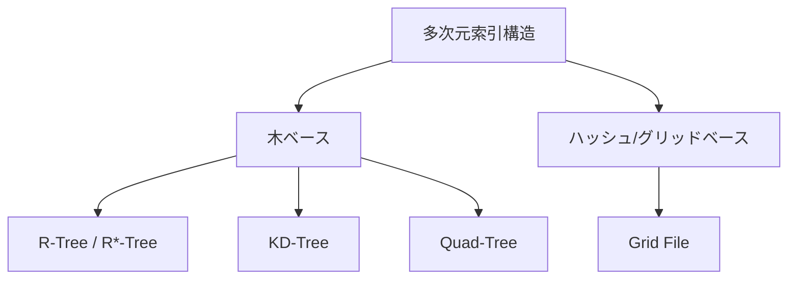

# 多次元索引構造(Multidimensional Index Structure)

## 1. 概要

### A. 定義
> 位置・空間・多属性のような**2次元以上の多次元データを効率的に検索**するための索引構造。範囲問合せ、最近傍(NN)問合せ、空間の包含・重なり問合せを高速に処理する。

### B. 登場背景および必要性
B-Treeのような従来の索引は、値を一つの軸(1次元)で整列して大小比較で探索するため、「緯度・経度がともに特定の範囲にある地点を探す」のように**複数の軸を同時に満たす**必要がある問合せには根本的に不向きである。二つの1次元索引をそれぞれ作成しても、一方の軸で絞り込んだ後、残りは全件検査しなければならず非効率である。空間データはそもそも「近い/含む」という関係が多次元座標の近接性によって定義されるため、この近接性そのものを反映して**空間を階層的に分割・クラスタリング**する索引が必要となる。地図サービス、画像特徴ベクトル検索、AI埋め込み検索が急増するにつれ、多次元索引は必須のインフラとなった。

## 2. 類型

索引構造は、空間を分割する方式によって分かれる。**R-Tree/R*-Tree**は、オブジェクトを囲む**最小外接矩形(MBR)**を階層的にまとめて木を構成し、問合せ領域と重なるMBRだけをたどって下りることで探索範囲を絞る。面積を持つ空間オブジェクト(建物・道路)と範囲問合せに強く、空間DBの事実上の標準であるが、MBR同士が重なると性能が低下するため、R*-Treeはこの重なりを最小化するよう改良された。**KD-Tree**は軸を交互に切り替えながら空間を二分割する構造で、点データのNN検索に効率的であるが、次元が高くなると分割効果が急減する。**Quad-Tree**は2D空間を四つの象限に再帰的に分割し、地図・画像のようにデータが疎で不均一な場合に有利である。**Grid File**は空間を格子状のバケットに分け、均等分布のデータでは定数時間に近いアクセスが可能である。

| 類型 | 分割方式 | 特徴・適合 |
|---|---|---|
| **R-Tree/R*-Tree** | MBRの階層的なまとまり | 空間オブジェクト・範囲問合せ、空間DBの標準 |
| **KD-Tree** | 軸を交互にした二分割 | 点データ・NN、高次元で性能低下 |
| **Quad-Tree** | 象限の再帰分割 | 2D画像・地図、疎なデータ |
| **Grid File** | 多次元格子バケット | 均等分布データに効率的 |

## 3. 選択基準

どの構造が最適かはデータと問合せの性質によって決まり、選択を誤ると索引がかえって負担となる。**データ型**が座標のみを持つ点であればKD-Treeが、面積・体積を持つ領域オブジェクトであればMBRベースのR-Treeが自然である。**問合せ型**が範囲問合せか、最近傍か、空間包含かによって有利な構造が分かれる。特に重要なのが**次元数**であり、数十~数百次元を超えると後述する次元の呪いによって木索引が無力化するため、近似(ANN)へと方向転換しなければならない。**データ分布**が均等であればGrid Fileが、偏っていれば密度に適応する木構造が優れる。

| 基準 | 考慮 |
|---|---|
| **データ型** | 点(KD) vs 領域/オブジェクト(R-Tree) |
| **問合せ型** | 範囲・NN・空間包含 |
| **次元数** | 高次元は近似(ANN)を考慮 |
| **分布** | 均等(Grid) vs 偏り(木) |

## 4. 活用事例

多次元索引は「近いものを素早く探す」あらゆるサービスの基盤にある。**空間DB・GIS**では、「自分の周辺1kmの飲食店」や「この行政区域に含まれる建物」をR-Treeで即座に探す。**マルチメディア**検索では画像を特徴ベクトルに変換した後、類似画像をNNで探し、**OLAP**では多次元キューブの範囲集計を高速化する。特に今日最大の応用は**AIベクトル検索**であり、テキスト・画像を高次元の埋め込みに変換して意味の近い項目を近似最近傍(ANN)で検索するもので、これがRAG・レコメンドシステムの中核である。

| 分野 | 活用 |
|---|---|
| **空間DB・GIS** | 周辺検索・領域問合せ(位置情報サービス) |
| **マルチメディア** | 画像・特徴ベクトルの類似度(NN)検索 |
| **OLAP** | 多次元キューブの範囲集計 |
| **AIベクトル検索** | 高次元埋め込みの近似最近傍(ANN)ベース |

## 5. 考慮事項および示唆
- **次元の呪い(Curse of Dimensionality)**:次元が大きくなるほどすべての点が互いに同じように遠くなり、「近い」という概念が無意味になって、木の枝刈り効果が失われる。したがって高次元では、PCAなどの次元削減を併用するか、精度を多少犠牲にして速度を得る**近似最近傍(ANN)**へ転換する。
- **分布・問合せへの適合性が性能を左右**:同じデータでも構造の選択によって数十倍の性能差が生じるため、データ分布と主な問合せパターンをまず分析して索引を決定しなければならない。
- **ベクトル検索への進化**:従来の木索引は**HNSW(グラフベース)・IVF(クラスタベース)**のようなANNアルゴリズムへと発展し、これらがRAG・レコメンド・セマンティック検索を支える中核インフラとなった。

---

> **一言まとめ**: 多次元索引構造は*R-Tree・KD-Tree・Quad-Tree・Grid File*などによって空間を階層分割し、多次元データの範囲・NN問合せを高速化するものであり、データ・問合せ型と次元数に合わせて選択し、次元の呪いのため高次元ではHNSW・IVFのようなベクトル検索(ANN)へと進化している。
