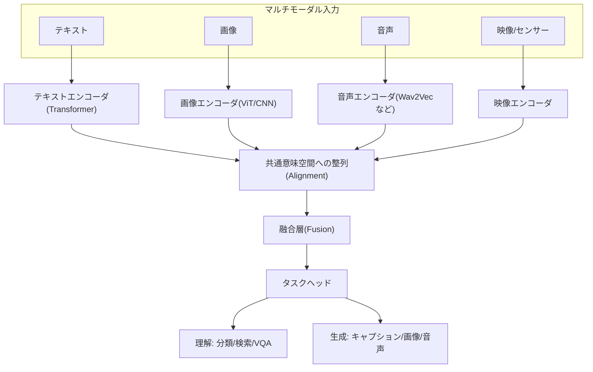
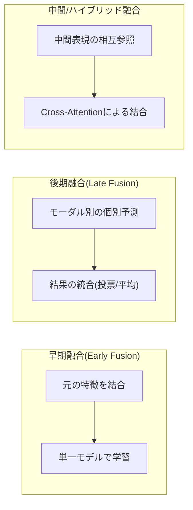

# マルチモーダルAI(Multimodal AI)

## 1. 概要

> **定義**: マルチモーダルAI(Multimodal AI)は、テキスト・画像・音声・映像・センサー信号など**異なる形態(Modality)のデータを同時に入力・処理・融合**し、単一モーダルだけでは得にくい統合的な理解と生成能力を獲得する人工知能技術である。各モーダルの表現を**共通意味空間(Joint Embedding Space)**に整列(Align)し、結合(Fuse)することが中核原理である。

マルチモーダルAIが台頭した背景は、人間の認知の本質と深く関わっている。人間は言語だけで世界を理解しているわけではない。「猫がソファで寝ている」という文を理解するとき、私たちは猫の視覚的な姿、ニャーという鳴き声、柔らかな触感の記憶を同時に動員する。すなわち人間の概念(Concept)は本質的に**複数の感覚の結合**によって形成されるものであり、したがってテキストのみを学習した言語モデルは、物理世界に対する接地(Grounding)を欠いた半人前の知能であるという限界を持つ。マルチモーダルAIは、このギャップを埋めてAIを**現実世界に接地された知能**へと拡張しようとする試みである。

第二の動因は、**大規模言語モデル(LLM)の発展とデータの限界**である。テキストコーパスはすでにかなりの部分が学習に使い尽くされており、純粋な言語データだけでは性能向上が鈍化しつつある。一方、画像・映像・音声はインターネット上に膨大に存在し、言語では表しきれない空間的・時間的・感性的な情報を含んでいる。異なるモーダルは相互補完的(Complementary)な情報を提供するため、これらを結合すれば個々のモーダルの弱点を補い、雑音(Noise)に頑健な予測が可能となる。例えば、騒音の激しい環境で音声認識率が低下しても、唇の動き(映像)を併せて見れば認識精度を回復できる。

第三の動因は**応用上の要求**である。自動運転はカメラ・LiDAR・レーダーを融合しなければならず、医療診断は画像(CT・MRI)・数値(血液検査)・テキスト(読影所見)を総合しなければならず、ロボットは視覚と言語指示を併せて理解してはじめて行動できる。GPT-4o、Gemini、Claudeなど最新の基盤モデルが、テキスト・画像・音声を一つのモデルで処理する方向へ収束しているのは、こうした実務上の要求の反映である。答案では、マルチモーダルAIを単なる機能拡張ではなく**「AGI(汎用人工知能)へ至る必須の経路であり、基盤モデルの標準形態」**と規定するのが妥当である。

## 2. マルチモーダルAIの全体構造

マルチモーダルAIは、各モーダルを独立にエンコードした後、共通表現空間に整列し、これを融合して最終タスク(理解・生成)を遂行する階層的な構造を持つ。以下の概念図は、入力から出力までの全体骨格を示す。

この構造において最も難しい問題は、**モーダル間の異質性(Heterogeneity Gap)**である。テキストは離散的(Discrete)なトークン系列であり、画像は連続的(Continuous)なピクセル格子であり、音声は時間軸上の波形である。データの次元・分布・意味密度がすべて異なるため、これらを一つのベクトル空間で比較可能にする**整列(Alignment)**がマルチモーダルの技術的核心となる。整列がうまくいけば、「子犬の写真」と「a photo of a dog」というテキストが埋め込み空間で近い位置に置かれるようになり、テキストで画像を検索したり画像を言語で説明したりするクロスモーダル(Cross-modal)タスクが可能になる。

整列の代表例がOpenAIの**CLIP(Contrastive Language-Image Pre-training)**である。CLIPは4億組の(画像, テキスト)データを対照学習(Contrastive Learning)で訓練し、対応する画像-テキストの組の埋め込みは近くに、対応しない組は遠くに配置する。こうして学習された共通空間のおかげで、CLIPは追加の再学習なしに任意のラベル集合に対して**ゼロショット(Zero-shot)分類**を行うことができ、その後Stable Diffusion・DALL-Eなど生成モデルのテキスト条件付けのバックボーンとして広く活用された。

## 3. モーダル融合(Fusion)戦略の類型と手順

複数モーダルの情報をいつ、どのように結合するかによって、性能と計算コストは大きく変わる。融合の時点を基準に、早期・後期・中間(ハイブリッド)融合に区分するのが一般的であり、以下の図は三つの方式のデータフローの違いを示す。

**早期融合(Early Fusion)**は、各モーダルの元の特徴(Feature)を入力段階で一つに連結(Concatenation)し、単一モデルで学習する方式である。モーダル間の低水準の相互作用を初期から学習できるため、きめ細かな相関関係の捕捉に有利であるが、次元が急増し、一つのモーダルが欠損(Missing)すると全体が脆弱になるという短所がある。**後期融合(Late Fusion)**は、モーダルごとに独立したモデルがそれぞれ予測を出した後、その結果を投票・加重平均で統合する方式であり、モジュール性が高く欠損に頑健であるが、モーダル間の相互作用を学習できない。この両者の折衷が**中間/ハイブリッド融合**であり、Transformerの**クロスアテンション(Cross-Attention)**を用いて、あるモーダルの表現が他のモーダルの表現を参照するようにする方式が現代のマルチモーダルモデルの主流となった。例えば、画像-テキスト質問応答(VQA)において、テキストの質問トークンが画像パッチ群をアテンションで照会して答えを見つける構造がこれに該当する。

実際の大規模マルチモーダルLLM(MLLM)の処理手順は次のとおりである。① 画像をViT(Vision Transformer)でエンコードし、視覚トークン系列を得る。② **整列モジュール(例:Q-Former、MLP Projector)**が視覚トークンを言語モデルが理解できる埋め込み空間へ射影(Projection)する。③ 射影された視覚トークンをテキストトークンとともに一つの系列として連結し、LLMに入力する。④ LLMが統合系列に対して自己回帰(Autoregressive)的に応答を生成する。この方式は、すでに十分に学習された言語モデルの推論能力をそのまま活用しつつ視覚理解を上乗せするもので、学習効率が高いため、LLaVA・BLIP-2・Flamingoなど多数のモデルが採用している。

## 4. 主要な応用と代表モデルの比較

マルチモーダルAIのタスクは、大きく**クロスモーダル理解(Understanding)**と**クロスモーダル生成(Generation)**に分かれる。理解タスクには画像キャプショニング、視覚質問応答(VQA)、テキスト-画像検索、文書理解(OCR+レイアウト)があり、生成タスクにはテキスト→画像(DALL-E、Stable Diffusion)、テキスト→映像(Sora)、テキスト→音声(TTS)、画像→テキスト(キャプション)がある。以下の表は代表的な技術の特性を比較したものであるが、各モデルが異なる設計思想を採った理由を併せて理解することが重要である。

| モデル/技術 | モーダルの組み合わせ | 中核技法 | 特徴 |
|---|---|---|---|
| CLIP | 画像↔テキスト | 対照学習、共通埋め込み | ゼロショット分類、検索のバックボーン |
| Stable Diffusion | テキスト→画像 | 潜在拡散(Latent Diffusion) | テキスト条件付き画像生成 |
| BLIP-2 / LLaVA | 画像+テキスト | Q-Former/射影+LLM | 視覚対話・VQA、学習効率 |
| GPT-4o / Gemini | テキスト・画像・音声 | 統合基盤モデル | リアルタイムのマルチモーダル対話 |

CLIPが**対照学習によって整列空間を作ること**に集中したとすれば、Stable Diffusionはその整列空間を**生成の条件(Condition)**として活用する。すなわち、テキスト埋め込みが拡散過程の方向を導き、望む画像を生成する。これは理解と生成が別個のものではなく、**同じ共通表現空間を共有**していることを示す事例である。一方、GPT-4oのように一つのモデルが複数のモーダルをネイティブ(Native)に処理する統合型は、モーダルごとのエンコーダを別々に置いて事後的に結合していた前世代とは異なり、入力段階から複数のモーダルトークンを一緒に扱うことで遅延(Latency)を減らし、音声対話の感情・抑揚まで反映する。

具体的な成果事例として、医療画像分野では、胸部X線画像と読影所見テキストを併せて学習したマルチモーダルモデルが、単一の画像モデルに比べて診断支援性能を改善したという研究が多数報告されている。自動運転では、Tesla・Waymoがカメラ・レーダー・LiDARを融合し、単一センサーの死角(悪天候時のカメラ性能低下、近距離でのレーダーの限界)を相互に補完している。これらの事例は、マルチモーダルの本質的な価値が**モーダル間の相互補完による頑健性(Robustness)の確保**にあることを実証している。

## 5. 深掘り:最新動向と課題

近年、マルチモーダルAIは**ネイティブマルチモーダル(Any-to-Any)基盤モデル**へと進化している。初期には事前学習済みのビジョンエンコーダと言語モデルを事後的に接続(Bridging)していたが、最新のモデルは最初から複数のモーダルを統合トークンとして学習し、モーダルの境界を取り払っている。さらに、テキスト・画像・音声だけでなく**行動(Action)**まで扱う**Vision-Language-Action(VLA)**モデルがロボティクスに適用され、言語指示と視覚認知をロボット制御信号に直接変換する**身体性を持つ知能(Embodied AI)**の研究が活発である。

同時に、解決すべき課題も明確である。第一に、**モーダルバイアス(Modality Bias)**— 学習が特定のモーダル(主にテキスト)に偏り、視覚情報を十分に活用できない現象がある。第二に、**ハルシネーション(Hallucination)**— 画像に存在しない物体を存在すると答えるなど、視覚的根拠なしに言語の事前知識に依存する誤りがマルチモーダルでも現れる。第三に、**整列データの確保と計算コスト**— 高品質な(画像, テキスト)の組の構築と大規模な対照学習には莫大な資源が必要である。第四に、**評価の難しさ**— 生成結果の品質とモーダル間の一貫性を定量評価する標準指標がまだ未成熟である。これらは答案において、マルチモーダルの限界と今後の研究方向として提示しやすい論点である。

## 6. 考慮事項および示唆

技術士の観点から、マルチモーダルAIの導入・活用時に考慮すべき戦略と示唆は次のとおりである。

- **適用戦略 — タスク特性に合った融合方式の選択**:モーダル間の低水準の相関が重要であれば(唇-音声の同期)早期・クロス融合を、モーダルが独立しており欠損が頻繁であれば後期融合を選択する。統合型の大型モデルが常に正解というわけではなく、コスト・遅延・データの可用性を併せて考慮した設計が必要である。
- **トレードオフ — 性能対資源**:ネイティブマルチモーダルモデルは強力であるが、学習・推論コストが大きい。実務では、CLIPのような軽量整列モデル+検索、あるいは事前学習済みエンコーダを再利用する射影方式でコストを削減し、オンデバイス環境では軽量マルチモーダル(sMLLM)を検討する。
- **信頼性・安全 — ハルシネーションと根拠提示**:医療・自動運転など高リスク領域では、マルチモーダルのハルシネーションを制御するために視覚的根拠を併せて提示(Grounding)し、XAI・Human-in-the-loopによる検証手続きを併用しなければならない。誤ったクロスモーダル判断は物理的な被害に直結し得る。
- **データ・ガバナンス — バイアスと著作権**:大規模な画像-テキストの組は著作権・個人情報・社会的バイアスを内包しているため、学習データの出所管理とバイアスの緩和、生成物の著作権・ディープフェイク悪用への対応など、AIガバナンス体制を併せて整備しなければならない。
- **展望 — AGIへの経路と標準化**:マルチモーダルは基盤モデルの標準形態へと収束しつつあり、VLA・Embodied AIへと拡張されて物理世界と相互作用する知能へと発展する見通しである。組織は、データ資産をモーダル横断的に統合・整列できるデータパイプラインと評価体系を先行して準備することが望ましい。

## 参考資料

- Radford et al., "Learning Transferable Visual Models From Natural Language Supervision (CLIP)", 2021 — https://arxiv.org/abs/2103.00020
- Li et al., "BLIP-2: Bootstrapping Language-Image Pre-training", 2023 — https://arxiv.org/abs/2301.12597
- Liu et al., "Visual Instruction Tuning (LLaVA)", 2023 — https://arxiv.org/abs/2304.08485

---
> **一言まとめ**: マルチモーダルAIは、テキスト・画像・音声など異質なモーダルを共通意味空間に整列・融合して相互補完的な理解と生成を実現する技術であり、CLIPの対照学習による整列とクロスアテンションによる融合を基盤として、基盤モデルの標準形態であると同時にAGI・身体性を持つ知能へ至る中核的な経路である。
