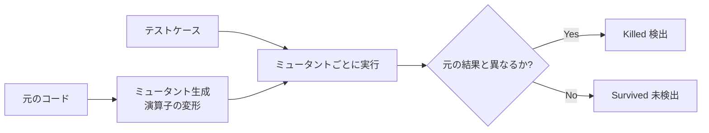

# ミューテーションテスト(Mutation Test)

## 1. 概要

### A. 定義
> プログラムのソースに**人為的な欠陥(ミュータント、Mutant)を注入**した後、既存のテストスイートがその欠陥を**検出(Kill)**するかどうかを測定し、テストケース自体の**欠陥検出力(有効性)**を定量評価するホワイトボックス技法。

一般的なテストが「プログラムは正しいか」を問うのに対し、ミューテーションテストは方向を逆転させて「**テストは十分に厳格か**」を問う。すなわち、検証の対象が製品コードではなく**テストそのもの**であるという点が本質である。ミュータントは開発者がよく犯す誤り(符号の入れ替え、比較演算子の誤りなど)を模したものであり、良いテストであればこうした微細な変形を必ず捉えなければならないという仮定に基づいている。

### B. 登場背景および必要性
現場でテスト品質の指標として広く用いられている**コードカバレッジ**には根本的な盲点がある。カバレッジは「そのコード行が実行されたか」を見るだけで、「実行結果が正しいことを**アサート(assert)**したか」は見ない。そのため、アサーション文が一つもない空のテストでもカバレッジ100%を達成できてしまう。このように、カバレッジの数値は高いが実際には何の欠陥も捉えられない**偽りの安心感**を取り除くため、実際の欠陥(ミュータント)を埋め込んでテストがそれを捉えるかを検証する方式が必要となった。これが、ミューテーションテストがカバレッジの限界を補完する点である。

## 2. 動作原理

動作の核心となる論理は次のとおりである。元のコードを一箇所ずつ変形した複数のミュータントを作成し、**各ミュータントに対して既存のテスト全体を実行する。**もしあるミュータントでテストが失敗すれば、そのテストは当該欠陥を検知する能力があるということなので、ミュータントを「**殺した(Killed)**」とみなす。逆に、ミュータントを埋め込んだにもかかわらずすべてのテストが依然として合格する場合、その欠陥を誰も捉えられなかったことになるため、ミュータントは「**生き残った(Survived)**」、すなわちテストに穴があるというシグナルである。生き残ったミュータントは、そのまま補強すべきテストのリストとなる。

## 3. ミューテーション演算子と指標

ミュータントは**ミューテーション演算子(Mutation Operator)**という規則によって機械的に生成される。これらの演算子は、実際のバグ統計で頻繁に現れる類型を模して設計されているため、ミュータントを捉える能力は、そのまま本物のバグを捉える能力の代理指標となる。

| ミューテーション演算子 | 例 |
|---|---|
| 算術 | `a+b` → `a-b` |
| 関係 | `a>b` → `a<b` |
| 論理 | `&&` → `\|\|` |
| 定数/変数の置換 | `x=1` → `x=0` |
| 文の削除 | 特定の行を除去 |

テストの有効性は**ミューテーションスコア(Mutation Score)**で定量化する。ここで分母から等価ミュータントを除くことが重要であるが、等価ミュータントは原理的に絶対に殺すことができないため、含めるとスコアが不当に低くなるからである。

| 指標 | 内容 |
|---|---|
| Mutation Score | Killed / (全ミュータント − Equivalent) × 100 |
| Killed | テストが検出したミュータント(良好) |
| Survived | 検出できなかったミュータント → テスト補完の対象 |
| Equivalent Mutant | 変形しても意味が同一で絶対に殺せないミュータント(限界) |

例えば、`if (x >= 1)`を`if (x > 0)`に変えたミュータントは、xが整数であれば二つの条件が完全に同じであり、どのような入力でも差を生じさせることができない。このような**等価ミュータント**は生き残るがテストの欠陥ではなく、これを人間が一つひとつ判別しなければならないことが、ミューテーションテストの代表的な難題である。

## 4. 長所と短所

ミューテーションテストの最大の強みは、カバレッジが見逃す**アサーションの不備**まで明らかにしてテスト品質を定量化する点であるが、その代償として**演算量が膨大**である。ミュータント一つごとにテスト全体を実行しなければならないため、ミュータントが数千個あればテストを数千回繰り返し実行することになる。

| 長所 | 短所 |
|---|---|
| テスト品質を定量評価(カバレッジの盲点を補完) | ミュータント × テストの組み合わせで演算量が過大 |
| 不十分なテストを具体的に特定・改善を誘導 | 等価ミュータントの判別が困難 |
| 実際の欠陥類型に基づくため信頼度が高い | 実行・判定を自動化するツールが必要 |

## 5. 考慮事項および示唆
性能の問題は実務適用における最大の障害であるため、**ミュータントのサンプリング**(全体ではなく一部のみ生成)、**選択的ミューテーション**(効果の大きい演算子のみ使用)、**並列実行**、変更されたコードにのみ適用する**増分ミューテーション**によって負担を軽減する。実務では、PIT(Java)のようなツールでCIパイプラインに統合し、コード変更時にミューテーションスコアが低下すると警告するよう運用する。特に航空・医療・自動車のような**セーフティクリティカル(Safety-critical)システム**では、テストが本当に欠陥を捉えるかを実証しなければならないため、ミューテーションテストがテスト信頼度の客観的な根拠として活用される。

---

> **一言まとめ**: ミューテーションテストは*コードに人為的な欠陥(ミュータント)を埋め込み、テストがそれを検出(Kill)するか*によってテストの欠陥検出力を定量評価する技法であり、カバレッジの盲点を補完するが、演算量・等価ミュータントが課題であり、サンプリング・並列化・CI統合によって実用化する。
