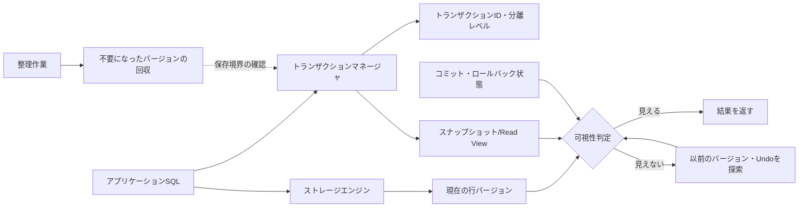
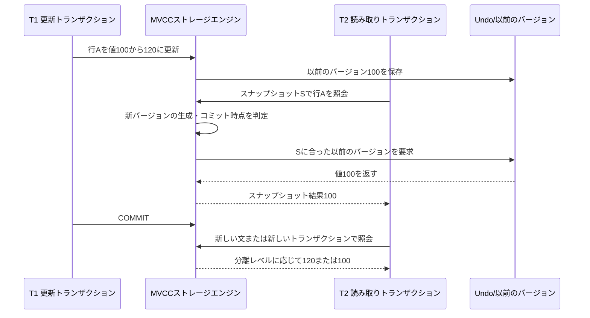

# MVCC(多版型同時実行制御)とスナップショットベースのトランザクション

## 1. 概要

> **定義**: MVCC(Multi-Version Concurrency Control、多版型同時実行制御)は、一つの行を更新する際に既存の値を即座に上書きするのではなく複数のバージョンとして保存し、各トランザクションが自身のスナップショットで参照可能なバージョンを判定することで、読み取りと書き込みの競合を減らす同時実行制御技法である。

オンラインサービスのデータベースでは、同時に実行されるトランザクションが同じ行を読み取り、変更する。単純なロックのみを用いると書き込みの一貫性は守りやすいが、読み取り要求が更新ロックを待つことで遅延が大きくなり、分析クエリが業務トランザクションを妨げるという問題が生じる。MVCCはこの競合を、「読み取るトランザクションは自身が参照可能な過去のバージョンを読み、書き込むトランザクションは新しいバージョンを作る」という方式で分離する。

MVCCの核心は、データを唯一の現在値として見ない点にある。論理的には一つの行であっても、物理的には生成トランザクション、失効トランザクション、以前のバージョンへの連結情報とともに複数のレコードが存在し得る。読み取り要求は、最新のレコードであるという理由だけで返すのではなく、自身のスナップショットでコミット済みとして見えるバージョンを選択する。この判定過程が分離性と非ブロッキング読み取りを生み出す。

ただし、MVCCはロックをなくす技術ではない。更新の競合、一意制約、明示的なロック読み取り、直列化レベルの検証には、依然としてロックや競合検出が必要である。また、長時間開かれたトランザクションが過去バージョンの整理を妨げると、ストレージ容量が増加し、インデックス・テーブルの性能が低下する。したがって、MVCCはストレージエンジンの内部実装とトランザクションの運用ポリシーを併せて設計してはじめて効果を発揮する。

技術士の答案では、MVCCを「高速なデータベース機能」としてのみ説明するのでは不十分である。どのスナップショットを選択するのか、コミット前後のバージョンがどのように見えるのか、分離レベルごとにどの現象が許容されるのか、過去のバージョンがいつ回収されるのかまで結び付けなければならない。特にPostgreSQLのタプル可視性・VACUUMとInnoDBのundoログ・Read Viewは実装方式が異なるため、共通の原理と製品ごとの違いを区別する。

### 1.1 登場背景と必要性

従来の2PL(Two-Phase Locking)は、トランザクションが読み取り・更新するデータにロックをかけて、他のトランザクションのアクセスを制御する。強い一貫性を得やすいが、共有ロックと排他ロックが重なると読み取りと書き込みが互いに待機する。大規模なWebサービスでは、短い注文更新一つが長時間実行されるレポート照会のせいで遅延することがあり得る。

MVCCは読み取り処理にデータの論理的な時点を付与する。トランザクションAが行を更新している間にトランザクションBが照会すると、BはAがまだコミットしていない新しい値を読まず、スナップショットに含まれる以前のバージョンを読む。その結果、「ダーティリード」を回避しつつ、単純な読み取り同士を不必要にブロックしない。

この方式は特に、読み取り比率の高いOLTP、注文・決済の同時処理、レプリカを用いた分析、長時間のレポート照会において有利である。逆に、更新の競合が非常に多い、長時間トランザクションが頻繁である、あるいはストレージ容量が限られている環境では、バージョンの生成・整理のコストを評価しなければならない。

### 1.2 中核目標

第一の目標は、トランザクションが一貫した観測時点を得られるようにすることである。トランザクションは他のトランザクションが途中で書き込む値を恣意的に見ることはなく、自身が許容するコミット時点の集合を基準に行を判定する。

第二の目標は、読み取りと書き込みの競合を減らすことである。一般的な非ロック読み取りは過去のバージョンを活用するため、更新者が書き込みロックを保持していても読み取りが必ずしも待機しない。ただし、この特性は最新の確定値や強いロックが必要な業務にはそのまま適用されない。

第三の目標は、分離レベルと性能の選択の幅を広げることである。READ COMMITTEDは文ごとに新しい観測時点を取ることができ、REPEATABLE READはトランザクションの間、同じスナップショットを維持できる。SERIALIZABLEは追加の競合検証によって直列実行と同等の結果を目指す。

## 2. MVCCの構成要素と可視性の原理

### 2.1 全体の動作構造

MVCCは、アプリケーション、トランザクションマネージャ、ストレージエンジン、バージョン格納領域、整理作業が結合した構造である。アプリケーションがSQLを実行すると、トランザクションマネージャは現在のトランザクションのIDと分離レベルに合ったスナップショットを作成する。ストレージエンジンは現在の行に連結された以前のバージョンをたどりながら、スナップショットで見える値を探す。

トランザクションIDは、バージョンの生成・変更の主体を識別する基準である。実装によって、行ヘッダ、トランザクションテーブル、undoログ、タイムライン情報が併用される。重要なのは、バージョンの値そのものだけでは可視性を決定できないという点である。バージョンがどのトランザクションで生成され、そのトランザクションがスナップショット時点でコミットされていたかまで確認しなければならない。

スナップショットは、特定時点において「見えるトランザクション」と「まだ見えないトランザクション」を区別する読み取り基準である。現在の行が後のトランザクションによって変更されていても、その変更トランザクションがスナップショットで見えなければ、ストレージエンジンは以前のバージョンをたどって返す。このため、物理的には最新ではないバージョンが論理的には正しい結果となる。

### 2.2 バージョンと可視性の判定

行バージョンは一般に、生成時点と失効時点に関するメタデータを持つ。新しいバージョンの生成トランザクションがコミットされており、当該バージョンの失効トランザクションがスナップショットで見えなければ、そのバージョンは読み取り対象となる。逆に、生成トランザクションがまだ進行中であれば、そのバージョンは他のトランザクションの通常の読み取りから除外される。

あるトランザクションが変更した値を自分自身が読めるかどうかは、エンジンの可視性規則に含まれる。自身の以前の文で行った変更は、外部へのコミットの有無にかかわらず、同じトランザクションの論理的な作業結果として見えることがある。この規則がなければ、一つのトランザクション内でINSERTの後にSELECTするといった自然な流れが崩れる。

削除も物理的な即時除去ではなく、削除マークまたは新しいバージョンの生成として処理されることがある。スナップショットで削除トランザクションが見えなければ以前のバージョンはまだ読むことができ、削除トランザクションが見えれば当該行は結果から除外される。その後、すべてのアクティブなトランザクションがその以前のバージョンを参照する可能性がなくなったときに、整理作業が実際の領域を回収する。

| 構成要素 | 役割 | 設計・運用のポイント |
|---|---|---|
| トランザクションID | バージョンの生成・変更主体の識別 | IDの枯渇・ラップアラウンドと状態追跡を考慮 |
| スナップショット/Read View | 見えるコミットと進行中トランザクションの区別 | 分離レベルによって生成時点が異なる |
| 行バージョン | 論理的な過去・現在の値を保存 | バージョンチェーンの長さとストレージ容量の管理 |
| Undo/以前のバージョン領域 | 読み取り用の過去の値とロールバック情報を提供 | 保存時間、I/O、整理遅延のモニタリング |
| 可視性判定器 | スナップショットに合ったバージョンを選択 | エンジンごとのヘッダ・トランザクション状態の確認 |
| 整理作業 | 不要になったバージョンの回収 | 長時間トランザクションと衝突しないよう運用 |

表の構成要素は互いに独立した機能のリストではなく、一つのライフサイクルである。トランザクションがバージョンを作り、スナップショットがそのバージョンを読み、アクティブなトランザクションが終了した後にはじめて整理作業が安全に過去のバージョンを除去できる。いずれか一つの段階が遅延すると、ストレージ容量と応答時間に連鎖的な影響が生じる。

### 2.3 読み取りと書き込みの論理的な流れ

読み取りトランザクションは、まず自身の分離レベルに合ったスナップショットを確保する。次にインデックスやテーブルから候補行を探し、候補バージョンの生成・削除メタデータをスナップショットと比較する。候補が見えなければ以前のバージョンの格納領域へ移動し、見えるバージョンを見つけるか、当該行がスナップショットに存在しないと判定する。

書き込みトランザクションは、既存の行を変更する場合でも、読み取りトランザクションが参照し得る過去の状態を保存する。ストレージエンジンによって、新しいバージョンを別レコードとして置く方式や、現在のレコードは維持して以前の値をundo領域に記録する方式が用いられる。この違いは、インデックス更新コスト、整理方式、障害復旧手順に影響を与える。

コミットは、バージョンが他のトランザクションのスナップショットで見えるようにする境界である。ロールバックは新しいバージョンを無効化するか、undo情報を用いて論理的な以前の状態を復元する。したがってMVCCはデータファイルだけの機能ではなく、WAL・redo・undo・トランザクション状態管理と連携して動作する。

## 3. 分離レベルと同時実行の異常現象

### 3.1 分離レベルの意味

分離レベルは、同時実行中のトランザクションが他のトランザクションの結果をどの程度まで観測できるかを定義する。名称が同じでも製品ごとに実装とデフォルト値が異なることがあるため、設計書には標準用語と実際のエンジン設定を併記しなければならない。

READ UNCOMMITTEDは、コミットされていない変更まで読めるため最も弱い分離である。MVCCエンジンが通常の照会でこれをそのまま許容しない、あるいは特別に処理する場合もあるため、「MVCCであれば常にダーティリードはない」と断定せず、製品ドキュメントを確認する。

READ COMMITTEDは、各SQL文の開始時または実行時に新しいスナップショットを取るモデルである。同じトランザクション内で二回照会すると、その間に他のトランザクションがコミットした変更を二回目の照会で見ることができる。業務画面の最新性は高いが、複数の文を組み合わせた業務ルールには追加のロックや条件検証が必要になることがある。

REPEATABLE READは、トランザクションの一貫した観測時点を維持するモデルである。同じトランザクション内の同一の論理クエリが一貫した結果を得やすいが、長時間開かれたトランザクションは過去バージョンの長期保存を要求する。MySQL InnoDBとPostgreSQLでは、同じ名称のレベルでも細部の現象と実装が異なることがある。

SERIALIZABLEは、同時実行の結果がいずれかの直列実行と同一になるよう制限する最も強いレベルである。MVCCベースのSSI(Serializable Snapshot Isolation)のようにロックを最小化しつつ危険な依存関係を検知する実装もあれば、範囲ロックと組み合わせる実装もある。競合時には再試行しなければならないため、アプリケーションの冪等性と再試行ポリシーが必須である。

| 分離レベル | 許容される可能性のある現象 | MVCC観点の特徴 | 適用例 |
|---|---|---|---|
| READ UNCOMMITTED | ダーティリードなど | 最も弱い一貫性、エンジンごとの処理の違い | 正確性より速さ優先の参考照会 |
| READ COMMITTED | 反復不能読み取り、一部のファントム | 文ごとのスナップショット | 一般的なWebリクエスト・OLTP |
| REPEATABLE READ | 実装によりファントム・書き込み競合 | トランザクションまたは一貫読み取りのスナップショット | 業務単位の一貫した照会 |
| SERIALIZABLE | 直列性違反を許容しない | 競合検出・範囲保護・再試行 | 在庫・精算・中核ルール |

この表を暗記する際は、現象の名称だけを覚えるのではなく、スナップショット生成時点と書き込み競合処理の違いに結び付ける。例えば、READ COMMITTEDで二つのSELECTが異なる値を読むのは誤りではなく、文ごとに観測時点が新たに作られたためである可能性がある。逆に、決済限度額のように複数の読み取り結果を合わせて判断する業務には、単一のスナップショットまたは明示的なロックが必要である。

### 3.2 代表的な同時実行の異常

ダーティリードは、他のトランザクションがまだコミットしていない値を読む現象である。MVCCの基本的なスナップショット可視性は、進行中のトランザクションのバージョンを除外することでこれを減らす。しかし、外部キャッシュや読み取りレプリカが別の一貫性規則を持つ場合、データベース内部でダーティリードがなくても、ユーザー画面では類似の錯覚が生じ得る。

反復不能読み取りは、一つのトランザクション内で同じ条件で読んだにもかかわらず、他のトランザクションのコミットによって値が変わる現象である。文ごとのスナップショットを用いるREAD COMMITTEDでは自然に現れ得る。合計・残高・権限を複数回読んで比較しなければならない場合は、一度に読むか、より強い分離レベルを選択しなければならない。

ファントムリードは、同じ条件の範囲照会を繰り返したときに、新たに挿入または削除された行のために結果の行集合が変わる現象である。単一の行バージョンを管理するだけでは、範囲全体の変化までは防げない。直列化レベル、範囲ロック、predicate locking、一意制約など、業務に合った範囲保護が必要である。

書き込みスキューは、二つのトランザクションが互いに異なる行を読んでそれぞれ変更するが、二つの変更を合わせた結果が業務の不変条件を破る現象である。例えば、当直医二人のうち一人以上が残らなければならないというルールにおいて、二つのトランザクションが互いに異なる医師を退勤処理すると、両者とも退勤する結果になり得る。単純なMVCCの一貫読み取りだけでは解決されず、SERIALIZABLE、明示的なロック、または原子的な条件付き更新が求められる。

## 4. 主要な実装と運用メカニズム

### 4.1 PostgreSQL系のタプルバージョンとVACUUM

PostgreSQLは、UPDATEを既存タプルの値だけを上書きする方式ではなく、新しいタプルバージョンを生成する方式で処理する。タプルヘッダのトランザクション情報とスナップショットを比較してどのバージョンが見えるかを決定し、以前のタプルはアクティブなトランザクションが必要としなくなったときに整理対象となる。

この構造は読み取りと書き込みの競合を減らす代わりに、テーブルに不要タプル(dead tuple)が蓄積し得る。VACUUMはもはや見えなくなったタプルを再利用可能としてマークし、トランザクションメタデータを管理する。VACUUMが過度に遅れると、テーブルの肥大化、インデックスの肥大化、スキャンコストの増加が発生する。

Autovacuumは、テーブルごとの変更量としきい値に基づいて整理作業を行う。デフォルト値だけを信頼するのではなく、更新頻度、行サイズ、インデックス数、長時間トランザクション、レプリケーションスロットを併せて観察し、テーブルごとにチューニングする。長時間トランザクションが過去のスナップショットを保持し続けているとVACUUMが領域を回収できないため、アプリケーションのコネクションプールとバッチ処理も点検しなければならない。

トランザクションIDのwraparoundは単なるストレージ容量の問題ではなく、可視性判定の安全性に関わる。データベースは古いトランザクションIDを適切にfreezeし、過去のバージョンの意味が変わらないよう管理する。運用者は、autovacuumの遅延、oldest xmin、dead tuple、テーブル・インデックスの肥大化を定期的にモニタリングしなければならない。

### 4.2 InnoDBのundoログとRead View

InnoDBは変更前の値をundoログに保存し、一貫読み取りが必要な場合にRead Viewとundoチェーンを用いてスナップショットに合ったバージョンを再構成する。現在のページにある値が自身のRead Viewから見て新しすぎる場合は、undoログをたどって過去の値を作り出す。

REPEATABLE READでは、トランザクションの一貫読み取りが同一の観測時点を維持する動作が重要である。READ COMMITTEDでは文ごとにより新しいRead Viewを作ることができるため、同じトランザクション内でも照会結果が異なり得る。この違いを、アプリケーションにおける「トランザクション」という言葉と混同してはならない。

undoログの整理は、どのアクティブなRead Viewも必要としなくなった時点で行われる。長時間開かれたトランザクション、大規模バッチ、コネクションの返却漏れは、undo領域とpurge遅延を増大させ得る。したがって、バージョンの整理はバックグラウンド処理の問題であると同時に、トランザクション境界を短く保つアプリケーション設計の問題でもある。

### 4.3 非ロック読み取りとロック読み取りの区別

通常のSELECTはスナップショットに合った非ロック読み取りを実行できるが、SELECT ... FOR UPDATEやSELECT ... FOR SHAREのように最新バージョンを確認してロックを取得する読み取りは、別の目的を持つ。在庫引き当て直前の数量を保護する場合や、ジョブキューの一行を占有する場合には、ロック読み取りが必要である。

非ロック読み取りは過去のバージョンを返すことがあるため、「最新の確定値」が常に必要な業務には不適切な場合がある。逆に、すべての照会をロック読み取りに変えると、MVCCが減らした同時実行性が再びロック競合によって失われる。照会の意味をまず定義した上で、ロックの有無を決定する。

上記の流れは、T2がいつスナップショットを作成したかによって結果が変わることを示している。T1がコミットする前であればT2は120を見ることができず、T1がコミットした後であっても、T2の分離レベルが以前のスナップショットを維持するならば100を見続けることができる。したがって障害分析の際には、SQLの実行時刻だけを記録するのではなく、トランザクション開始・スナップショット・コミットの時点を併せて記録しなければならない。

### 4.4 インデックスとバージョン整理の関係

MVCCはテーブル本体だけでなく、インデックスアクセスとも関係する。インデックスが指すタプルが現在のスナップショットで見えない場合、ストレージエンジンは可視性検査を行い、必要に応じて以前のバージョンを探す。インデックス設計が悪いと候補行が増え、バージョン判定とランダムI/Oがともに増加する。

一部のエンジンは、インデックスを読むだけで可視性を確認できるよう、別途のメタデータや可視性マップを活用する。この最適化が正しく機能するには、整理作業と統計の更新が正常でなければならない。したがって「インデックスを追加すればMVCCのコストがなくなる」のではなく、インデックスの選択度・カバリング・整理状態を併せて評価する。

## 5. 比較と産業適用事例

### 5.1 2PL・楽観的制御との比較

2PLは、競合の可能性があるデータにロックをかけて、実行中のトランザクションのアクセスを直接制限する。強いルールを表現しやすいが、ロック待機とデッドロックを管理しなければならない。MVCCは読み取り経路をバージョン選択で処理して読み取り待機を減らすが、古いバージョンの保存と書き込み競合時の再試行を必要とする。

楽観的同時実行制御は、競合がまれであるという仮定のもとでロックなしに作業し、コミット時にバージョン番号やタイムスタンプを検証する。MVCCと併用され得るが、同じ概念ではない。MVCCは読むべきバージョンを提供するメカニズムであり、楽観的検証はコミット可能性を判断するポリシーである。

| 区分 | MVCC | 2PL | 楽観的検証 |
|---|---|---|---|
| 読み取り方式 | スナップショットに適したバージョンを選択 | ロック取得後に読み取り | 現在値を読み後で検証 |
| 読み取り-書き込み競合 | 通常の読み取りは低い | ロックの種類により待機 | 通常は低いがコミット失敗の可能性 |
| 主なコスト | バージョン・undo・整理 | ロック待機・デッドロック | 競合時の再試行・ロールバック |
| 強み | 読み取りの拡張と一貫したスナップショット | ルール表現と最新値の保護 | 短いトランザクション・低い競合 |
| 注意点 | 長時間トランザクション・肥大化 | 待機の急増・デッドロック | 再試行の冪等性・飢餓 |

三つの方式は競合関係というよりも、組み合わせの対象である。実務のデータベースは、通常の照会にはMVCCを用いつつ、更新競合には行ロック、範囲の不変条件には直列化検証、アプリケーション層には楽観的バージョン検査を併せて適用する。技術士答案の設計提案も「MVCCを採用する」で終わらせず、競合が発生する経路ごとに補完手段を提示しなければならない。

### 5.2 事例1 — 注文・在庫サービス

商品一覧と注文照会は読み取り比率が高いため、MVCCベースの非ロック読み取りが遅延を減らす。顧客が注文状態を照会している間に運用者が状態を更新しても、顧客はコミット済みの一貫したバージョンを受け取り、通常の照会が長時間ロック待機することはない。

一方、在庫の引き当てでは、二つの注文が同じ最後の在庫を読んで両方とも成功してはならない。この経路は、`UPDATE ... SET stock = stock - 1 WHERE product_id = ? AND stock > 0`のような原子的な条件付き更新、または最新行のロックと併せて設計する。MVCCのスナップショット読み取りだけで在庫の不変条件が保証されると主張してはならない。

### 5.3 事例2 — 長時間レポートと運用トランザクション

月次売上レポートが数分間実行される環境において、MVCCは運用者が新規注文を処理している間も、レポートが自身の選択した時点の一貫したデータを読めるようにする。これにより、レポートがテーブル全体をロックして注文入力を妨げる問題が軽減される。

しかし、レポートトランザクションが長く維持されると、その時点以前のバージョンが整理できなくなる。解決策は、読み取り専用レプリカや分析用ストアへ負荷を分離し、レポートをページ単位の短いトランザクションに分割し、スナップショットの一貫性が本当に必要かどうかを業務側と合意することである。

### 5.4 事例3 — 金融精算と直列性の要求

金融精算では、単純な照会の非ブロッキング性よりも、重複・欠落・書き込みスキューの防止が重要である。残高と出金限度額を互いに異なる行から読み取って更新するロジックは、READ COMMITTEDだけでは安全でない場合がある。中核ルールは、SERIALIZABLE、明示的なロック、原子的な条件付き更新、精算後の突合によって多層的に防御する。

直列化競合によってトランザクションが再試行され得るため、精算APIはリクエスト識別子と冪等キーを使用しなければならない。外部の決済承認やメッセージ発行をデータベースの再試行と一まとめに処理すると外部への副作用が重複し得るため、アウトボックスパターンと重複排除キーを併せて設計する。

## 6. 深掘り — 分散・クラウド環境におけるMVCC

分散データベースでは、単一ノードのトランザクションIDだけで全体のスナップショットを表現することは難しい。論理タイムスタンプ、ハイブリッド論理クロック、範囲ごとのリーダー、コミット待機といったメカニズムを用いて、複数ノードの読み取り時点を調整する。ネットワーク遅延がスナップショットの一貫性と書き込み可用性のトレードオフにつながるため、CAPと一貫性モデルを併せて検討しなければならない。

分散SQLシステムにおける直列化スナップショットは、「各ノードで見える最新値」を単に合わせたものではない。クエリに必要な読み取りタイムスタンプを定め、その時点のデータが複数のレプリカに存在するかを確認し、コミットの競合と再試行を調整しなければならない。リージョン間の往復時間が長いと、強い一貫性の読み取り・書き込みがユーザーの遅延を増加させ得る。

クラウドのマネージドデータベースでは、MVCCの内部パラメータをすべて直接制御できない場合がある。代わりに、長時間トランザクション、コネクションプールのアイドルセッション、整理遅延、undo・WAL・ストレージ使用量、ロック待機と再試行率を、観測可能なサービス指標とする。自動スケーリングがストレージ容量の問題を隠し得るため、コストと性能を併せて追跡する。

HTAP環境では、OLTPのMVCCバージョン整理と分析スキャンのスナップショット寿命が衝突し得る。分析workloadを別のカラムストア・レプリケーションストリーム・レイクハウスに分離すれば、運用トランザクションのバージョン保存負担を下げられる。ただし、データの鮮度遅延とスキーマ変換のコストが生じるため、SLAに反映する。

近年のタイムトラベルクエリや監査証跡はMVCCの過去バージョンの概念に似ているが、目的が異なる。MVCCの過去バージョンは同時実行制御とロールバックのための内部データであり得るのに対し、規制監査用の履歴は長期保存・変更理由・アクセス制御・法的証拠能力を要求する。内部バージョンを監査台帳とみなさず、別途の不変イベント・監査ログの設計を設ける。

## 7. 考慮事項および示唆

### 7.1 トランザクションの寿命管理

トランザクションは業務単位を保証するのに必要な長さだけ維持し、ユーザー入力の待機や外部API呼び出しをデータベーストランザクションの中に入れない。長時間トランザクションは過去バージョンの整理とスキーマ変更を妨げ、障害時のロールバック範囲を広げる。

コネクションプールでトランザクション状態が残ったまま接続が再利用されないよう、自動ロールバックとタイムアウトを適用する。運用ダッシュボードには、最も古いトランザクション、アイドル状態のトランザクション、スナップショットの保持時間、整理遅延を個別に表示する。

### 7.2 一貫性要件と分離レベルのマッピング

すべての業務にSERIALIZABLEを適用する方式や、すべての業務をREAD COMMITTEDに統一する方式は危険である。注文照会、在庫引き当て、精算、監査照会のように業務上の意味が異なるフローごとに、許容可能な遅延と異常現象を定義する。

要件には「最新」という表現の代わりに、基準時点と許容遅延を記す。例えば、検索一覧は数秒の遅延を許容するが、決済完了の確認は同じセッション内で直前にコミットした結果を即座に確認しなければならない場合がある。読み取りルーティング、セッション固定、ロック読み取り、再試行をこのポリシーと結び付ける。

### 7.3 整理・ストレージ容量・性能の観測

バージョンの生成量は、UPDATE・DELETEの頻度、行サイズ、インデックス数によって異なる。dead tuple、undo history length、purge lag、テーブル・インデックスの肥大化、WAL増加量といったエンジン指標を収集し、ストレージ容量のしきい値と結び付ける。

整理作業をむやみに頻繁に実行するとI/O競合が増えることがあり、逆に遅すぎると照会性能とコストが悪化する。業務のピークとバッチ時間を考慮して自動整理のパラメータをチューニングし、設定変更は代表的なテーブルで負荷試験によって検証する。

### 7.4 失敗・再試行・冪等性

MVCCの直列化競合やデッドロックは、正常な同時実行制御の結果として発生し得る。アプリケーションはエラーを一律にユーザーの失敗として返したり無限に再試行したりせず、再試行可能なエラーを分類し、指数バックオフと最大回数を設定する。

再試行対象のトランザクションは、外部への副作用が重複しないよう、冪等キー、アウトボックス、重複受信防止、補償手順を備えなければならない。データベースのコミットは成功したが応答が失われた場合を考慮し、クライアントが同じリクエストを再送しても結果が一度だけ反映されるようにする。

### 7.5 セキュリティ・監査・運用統制

スナップショットが過去のデータを読むという事実は、アクセス制御を迂回するという意味ではない。行レベルセキュリティ、テナント条件、権限チェックは過去のバージョンにも同様に適用されなければならず、削除された個人情報の保存ポリシーと、undo・バックアップへの残存可能性を検討する。

運用者が性能問題を解決するために長時間トランザクションを強制終了する際は、業務への影響とロールバックコストを確認する。強制終了前後のセッション・クエリ・整理指標を記録し、原因と措置の効果を監査可能にする。

### 7.6 技術士の観点からの総合的示唆

MVCCはデータベースエンジンの機能であるが、実際の品質は、トランザクション境界・分離レベル・インデックス・整理ポリシー・モニタリング・再試行設計の組み合わせによって決まる。「読み取りの非ブロッキング」という長所だけを強調すると、バージョンの肥大化と業務の不変条件違反を見落とす。

アーキテクチャ選定の際には、TPSと平均遅延だけでなく、P99遅延、更新競合率、長時間トランザクションの比率、整理遅延、ストレージコスト、障害復旧時の再処理量を測定する。同じMVCCであっても、エンジンとworkloadによって最適な分離レベルとチューニング値は異なる。

答案の結論は「MVCCを適用する」ではなく、「業務ごとの一貫性等級を定義し、スナップショット読み取りとロック・直列化・冪等な再試行を組み合わせ、バージョンのライフサイクルを観測・統制する」とまとめるのが望ましい。

## 参考資料

- PostgreSQL, “Introduction to MVCC”: https://www.postgresql.org/docs/current/mvcc-intro.html
- PostgreSQL, “Concurrency Control”: https://www.postgresql.org/docs/current/mvcc.html
- MySQL, “Consistent Nonlocking Reads”: https://dev.mysql.com/doc/refman/8.4/en/innodb-consistent-read.html
- MySQL, “InnoDB Multi-Versioning”: https://dev.mysql.com/doc/refman/8.4/en/innodb-multi-versioning.html
- PostgreSQL, “Transaction Isolation”: https://www.postgresql.org/docs/current/transaction-iso.html

---

> **一言まとめ**: MVCCはトランザクションごとのスナップショットと多版管理によって読み取り・書き込みの競合を減らす技術であるが、分離レベル・競合時の再試行・長時間トランザクション・バージョン整理を併せて設計してはじめて、一貫性と性能を同時に達成できる。
