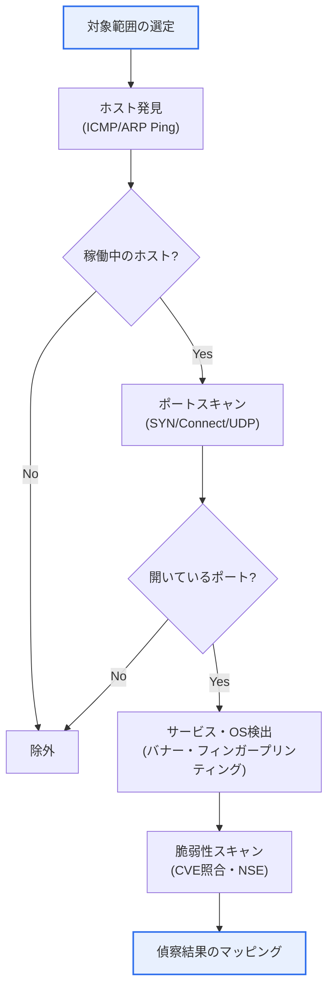
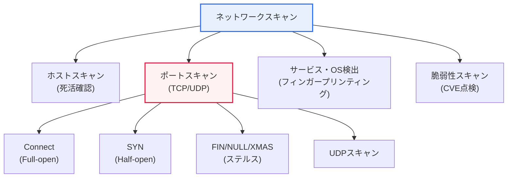

# ネットワークスキャン(Network Scanning)

## 1. 概要

### A. 定義

> **ネットワークスキャン(Network Scanning)**は、ネットワークに接続された**ホスト・ポート・サービス・脆弱性の情報を能動的に探索・収集**する技術であり、攻撃者にとっては侵入に先立つ事前偵察(reconnaissance)の中核手段であると同時に、防御者にとっては資産の識別と脆弱性診断(Vulnerability Assessment)のツールとして用いられるという二面性を持つ。

ネットワークスキャンがセキュリティにおいて重要である理由は、「**攻撃の第一段階であり、防御の第一段階でもある**」という二面性にある。サイバーキルチェーン(Cyber Kill Chain)の7段階のうち最初の段階が偵察(Reconnaissance)であり、攻撃者は標的に侵入する前に必ず対象の地形を把握する。どのホストが稼働しており(ホスト発見)、どのポートが開いており(ポートスキャン)、そのポートでどのサービス・OSがどのバージョンで動作しており(サービス/OSフィンガープリンティング)、そのバージョンに既知の脆弱性(CVE)があるか(脆弱性スキャン)を順に把握してはじめて、実際の攻撃(Exploitation)の経路を確定できる。スキャンとは、まさにこの「地図作り」の活動である。

ところが、まったく同じ技術を防御者も用いる。セキュリティ管理者は自らのネットワークを自らスキャンし、不必要に開いているポート、管理者の知らないうちに起動されたサービス(シャドーIT)、パッチの当たっていない脆弱なバージョンを見つけて先制的に遮断する。このため、代表的なツールである**Nmap(Network Mapper)**は攻撃者と防御者の双方にとって必須のツールとなっており、受動的な偵察(パッシブ)とは異なり対象に直接パケットを送る**能動的(Active)偵察**であるため、痕跡(ログ・トラフィック)を残す。したがって防御の観点では、① 他者のスキャンを検知・遮断する能力と、② 自らスキャンして攻撃対象領域(Attack Surface)を縮小する能力が同時に求められる。

### B. 受動的偵察と能動的偵察

偵察は、対象にパケットを送らず公開情報(WHOIS、DNS、検索エンジン、Shodanなど)だけで情報を集める**受動的(Passive)偵察**と、実際にパケットを投げて反応を観察する**能動的(Active)偵察**に分かれる。ネットワークスキャンは後者に該当し、反応を誘発する代わりに検知されるリスクを負う。攻撃者は通常、受動的偵察でおおよその資産範囲を絞り込んだ後、能動的スキャンで精密な地図を完成させる2段階戦略を用いる。

| 目的 | 内容 | 代表的な技法・ツール |
|---|---|---|
| **ホスト発見** | 稼働中のホストの識別(死活確認) | Ping/ICMP, ARPスキャン, TCP Ping |
| **ポートスキャン** | 開いているポート・サービスの把握 | SYN, Connect, UDPスキャン |
| **サービス・OS検出** | バージョン・OSの識別(フィンガープリンティング) | Nmap `-sV`, `-O`, バナーグラビング |
| **脆弱性スキャン** | 既知の脆弱性(CVE)の有無 | Nessus, OpenVAS, Nmap NSE |

## 2. スキャンの全体プロセスと類型

### A. スキャンプロセス

スキャンはむやみに全ポートを叩くものではなく、**ホスト発見 → ポートスキャン → サービス/OS検出 → 脆弱性スキャン**という漏斗(funnel)の形で絞り込んでいく。前段で稼働が確認されたホストにのみポートスキャンを行い、開いていることが確認されたポートにのみサービス検出を行うというように範囲を狭めることで、効率と隠密性の両方が高まる。例えば、/24帯域(254ホスト)の全ポート(65,535個)をスキャンすると約1,600万回のプローブが必要であるが、まずホスト発見で稼働中の20台だけに絞り、上位1,000ポートだけを見れば2万回にまで減る。

### B. スキャンの分類

**ホストスキャン**は、対象帯域でどのIPが実際に応答するかを最初に選別する。伝統的にはICMP Echo(Ping)を用いるが、ファイアウォールがICMPを遮断している環境が多いため、実務ではTCP SYN Ping(80/443ポートへSYNを送信)、TCP ACK Ping、UDP Pingを併用する。同一のブロードキャストドメイン内であれば、ファイアウォールでも防ぎにくい**ARPスキャン**が最も確実である。Nmapの`-sn`オプションが、ポートスキャンを行わずにホスト発見のみを実行するモードである。

**サービス・OS検出**は、開いているポートに実際のプローブを送り、応答の特徴(バナー文字列、TCP/IPスタックの微細な実装の違い)を指紋のように照合して、ソフトウェアの種類・バージョンとOSを推定する。例えば、22番ポートが`SSH-2.0-OpenSSH_7.4`というバナーを返せばOpenSSH 7.4と特定され、このバージョンに該当するCVEを即座に照会できる。OS検出(`-O`)は、TTLの初期値、TCPウィンドウサイズ、オプションの順序などのスタック特性を総合してWindows/Linux系を区別する。

### C. ポートスキャン技法の原理

ポートスキャンの核心は、**TCP 3-way handshake(SYN → SYN/ACK → ACK)**の動作原理を逆用することにある。開いているポートはSYNにSYN/ACKで応答し、閉じているポートはRSTで応答し、ファイアウォールが黙って破棄(Drop)すれば何の応答もない。この三つの反応の違いを読み取って、ポートの状態(open/closed/filtered)を判定するのである。

**TCP Connect(Full-open)**スキャンは、OSの`connect()`システムコールをそのまま用いてハンドシェイクを最後まで完了させる。特権がなくても実行でき結果も確実であるが、接続が完全に確立されるため、サーバーアプリケーションのログに接続記録がそのまま残り、検知されやすい。**SYN(Half-open)**スキャンはSYNだけを送り、SYN/ACKを受け取ったら「オープン」と判断した直後にACKの代わりにRSTを送って接続を切断する。3-way handshakeを完了しないため多くのアプリケーションログに残らず「ステルススキャン」と呼ばれ、高速かつ隠密であるためNmapのデフォルトスキャン(`-sS`、ただし管理者権限が必要)として用いられる。

**FIN・NULL・XMAS**スキャンは、ハンドシェイクとは無関係な異常なフラグの組み合わせを投げる。RFC 793によれば、閉じているポートはこうしたパケットにRSTで応答し、開いているポートは無視するため、「応答なし=オープンまたはフィルタ」と逆判定する。ステートレスな単純ファイアウォール・ACLを迂回できる余地があるが、Windows系はRFCに従わないためあまり通用しない。**UDPスキャン**は、コネクションレス型という特性上、応答がなくてもオープンである可能性があるため判定が遅く曖昧であり、閉じているポートが返すICMP Port Unreachable(Type 3, Code 3)の有無で状態を推定する。DNS(53)・SNMP(161)・NTP(123)のような重要なUDPサービスの点検には必ず必要である。

| 技法 | 動作原理 | 特徴 |
|---|---|---|
| **TCP Connect** | 3-way handshakeを完了 | 確実・権限不要・ログが残る |
| **SYN(Half-open)** | SYN後にRSTで中断 | 隠密・高速・デフォルトスキャン |
| **FIN/NULL/XMAS** | 異常フラグによる逆判定 | 単純ファイアウォールの迂回・Windowsでは無力 |
| **UDPスキャン** | ICMP Unreachableの有無 | 低速・曖昧・DNS/SNMP点検に必須 |

### D. 実務のスキャン例(Nmap)

実際の診断・ペネトレーションテストでは、目的に応じてオプションを組み合わせる。以下は代表的なスキャンシナリオであり、「広く浅く舐めてから狭く深く掘る」漏斗戦略がオプションのレベルでもそのまま現れている。

- `nmap -sn 10.0.0.0/24` — ポートスキャンなしでホスト発見のみ(死活確認)。帯域内で稼働中の資産をまず絞り込む。
- `nmap -sS -p- 10.0.0.5` — SYN(Half-open)スキャンで全ポート(1~65535)を点検。隠密かつ高速な基本の精密スキャン。
- `nmap -sV -sC 10.0.0.5` — サービスバージョン検出(`-sV`)+デフォルトスクリプト(`-sC`)でバナー・基礎的な脆弱性を確認。
- `nmap -O 10.0.0.5` — TCP/IPスタックの指紋でOS・バージョンを推定。
- `nmap -sU --top-ports 50 10.0.0.5` — 主要UDPポート(DNS・SNMP・NTPなど)を点検。
- `nmap -T2 -f -D RND:10 <target>` — 速度を落とし(`-T2`)、パケット分割・デコイ(`-D`)でIDS検知の回避を試験(ペネトレーションテストに限定)。
- `nmap --script vuln 10.0.0.5` — NSE(Nmap Scripting Engine)で既知の脆弱性を自動点検。

このようにスキャンは、「どの情報を、どれだけ隠密に」という目的に応じて、技法・速度・回避オプションを変える。防御者は資産点検に`-sV -sC`を、攻撃者は検知回避に`-T2 -f -D`を好むという違いが、そのまま検知ルール設計の手がかりとなる。

## 3. 検知および対応

スキャンは能動的偵察であるため、必ず痕跡を残す。**短時間に一つの送信元が多数のポート・多数のホストへ接続を試みる**パターン、完了しない半開接続(Half-open)の急増、異常フラグのパケットなどが代表的な兆候である。防御は、こうした兆候を検知する軸と、そもそも見えるものを減らす軸に分かれる。

まず**IDS/IPSとSIEM**は、しきい値ベース(例:1秒間にN個のポートへの接続)またはシグネチャベースでスキャンを検知・遮断し、ファイアウォールは不要なポートを根本から遮断して、スキャンに応答する対象領域そのものを縮小する。能動的には、**ハニーポット・ポートノッキング(port knocking)**でスキャナを誘引・識別することもある。しかし根本的な対策は**攻撃対象領域の最小化**である。使用していないサービスを停止し、ポートを閉じれば、スキャンしても何も出てこない。実際、2017年のワナクライ(WannaCry)事件は、インターネットに露出したSMB(445)ポートを大量スキャンして拡散したが、445ポートの遮断・パッチ適用だけで大部分を予防できたという点が、対象領域縮小の重要性を示している。

| 対応 | 内容 |
|---|---|
| **IDS/IPS** | スキャンパターン(大量接続・Half-open)の検知・遮断 |
| **ファイアウォール・ACL** | 不要ポートの遮断、最小露出の原則 |
| **ポート/サービスの最小化** | 未使用サービスの閉鎖、ハードニング |
| **SIEM・SOAR連携** | ログの相関分析・自動対応(プレイブック) |

## 4. 深掘り — 防御的活用と最新動向

スキャンは「防ぐべき脅威」であると同時に、「積極的に活用すべきセキュリティプロセス」でもある。成熟した組織は、スキャンを**脆弱性管理(Vulnerability Management, VM)**と**攻撃対象領域管理(ASM)**の中核エンジンとして位置付ける。定期的(例:週1回)に内部・外部の資産を自動スキャンし、新たに開いたポート、新たに立ち上がったサービス、新規CVEへの露出をSIEMに集約し、SOARプレイブックでチケット発行・隔離まで自動化する。クラウド環境ではインスタンスが随時生成・消滅するため静的な資産台帳が無意味となり、**継続的(continuous)スキャン**とクラウドAPI連携による資産発見が必須となった。

攻撃ツールも進化している。Nmapが精密スキャンの標準であるとすれば、**Masscan・ZMap**はインターネット全体(約43億のIPv4)を数分~数十分で走査する超高速スキャナであり、大規模な露出資産の調査に用いられる。**Shodan・Censys**はこうしたスキャン結果を常時蓄積して検索エンジンのように提供しており、攻撃者はここから特定の脆弱なバージョンが露出している対象を即座に選び出せるため、「偵察の商品化」が起きている。防御者もまた、自組織の資産をShodanで検索して意図しない露出を点検するという逆転の発想による活用が推奨される。一方、IPv6の普及はアドレス空間が膨大(2^128)であるため総当たりスキャンを困難にするが、DNS・構成管理情報の漏洩を通じた標的型偵察という新たな局面を生んでいる。

過去問・類似テーマの観点では、ネットワークスキャンは**サイバーキルチェーン、ペネトレーションテスト(侵入テスト)方法論、脆弱性管理、IDS/IPS、SOAR**と幅広く関連付けて出題される。答案では単なる技法の列挙にとどめず、「攻撃の偵察であり防御の点検でもある」という二面性と、対象領域の最小化・能動的活用という防御戦略を併せて提示する構成が高得点に有利である。

## 5. 考慮事項および示唆

1. **合法性が絶対的な前提である。**スキャンは権限のない対象に実施すると、韓国の情報通信網法違反(侵入・障害誘発)に該当するおそれがあるため、ペネトレーションテスト・資産点検など正当な権限と**事前の書面同意(Scope of Work)**の範囲内でのみ実施しなければならない。対象IP・時間・技法を明記した契約がなければ、防御目的であっても法的リスクを負う。

2. **攻撃対象領域の最小化が根本的な防御である。**開いているポート・不要なサービスを減らすことは検知・遮断よりも効果が大きく、定期的な自己スキャンで露出面の変化を追跡し、ハードニング基準(CIS Benchmarkなど)を適用して「見えるものそのものをなくす」アプローチが優先される。

3. **防御の観点から能動的に活用する。**脆弱性管理・資産管理にスキャンを常時組み込んで新規CVEへの露出に先制的に対処し、スキャン検知イベントをSIEM・SOARと連携させて、偵察段階でキルチェーンを断ち切る「早期遮断」戦略を駆使する。

4. **検知回避と誤検知のバランスを考慮する。**攻撃者は速度調整(低速スキャン)・分散した送信元・デコイ(decoy)で検知を回避するため、単純なしきい値検知は迂回されやすい。正規の脆弱性スキャナのトラフィックと悪意ある偵察を区別するポリシー(ホワイトリスト・振る舞いベース分析)を策定し、誤検知と検知漏れを同時に減らさなければならない。

5. **クラウド・IPv6環境への移行に備える。**動的な資産と膨大なアドレス空間は従来の周期的スキャンの実効性を低下させるため、API連携の継続的スキャンと攻撃対象領域管理(ASM)ソリューションへとパラダイムを転換しなければならない。

## 6. 参考資料

- Nmap公式ドキュメント(Reference Guide): https://nmap.org/book/man.html
- MITRE ATT&CK, Active Scanning(T1595): https://attack.mitre.org/techniques/T1595/
- Lockheed Martin, Cyber Kill Chain: https://www.lockheedmartin.com/en-us/capabilities/cyber/cyber-kill-chain.html
- CISA, Reducing the Significant Risk of Known Exploited Vulnerabilities: https://www.cisa.gov/known-exploited-vulnerabilities-catalog

---

> **一言まとめ**: ネットワークスキャンは*ホスト・ポート・サービス・脆弱性を能動的に探索*する技術であり、攻撃の最初の偵察であると同時に防御の最初の点検でもあるという二面性を持ち、SYN・FIN・UDPなど3-way handshakeを逆用する技法があり、*攻撃対象領域の最小化・IDS/IPSによる検知・SIEM・SOAR連携・合法的な実施*が防御の核心である。
