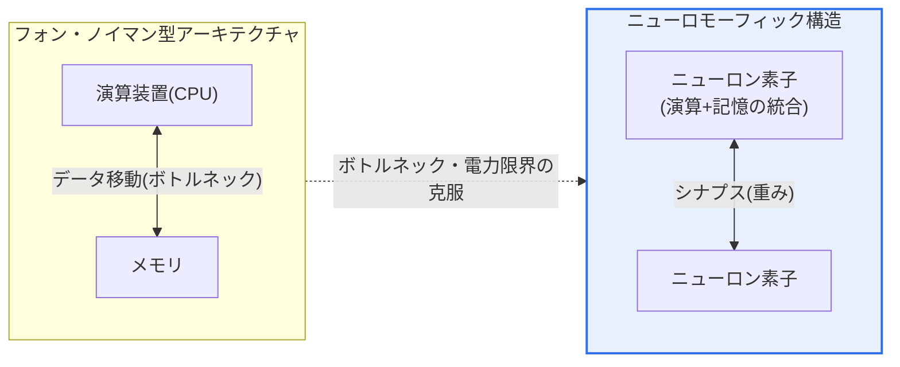
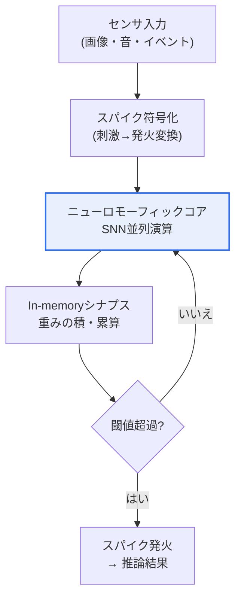

# ニューロモーフィックチップ(Neuromorphic Chip)

## 1. 概要

### A. 定義
> **ニューロモーフィックチップ(Neuromorphic Chip)** とは、人間の脳の **ニューロン(neuron)とシナプス(synapse)の構造・動作方式をハードウェアで模倣** し、演算と記憶を統合してイベント駆動で並列演算を行うことにより、極低消費電力のAI処理を実現する神経模倣半導体である。

ニューロモーフィックチップの核心的な発想は、「**コンピュータを脳のように作り、脳と同じくらい効率的に動作させよう**」というものである。今日のほとんどのコンピュータは **フォン・ノイマン型アーキテクチャ(von Neumann architecture)** に従う。演算装置(CPU)とメモリが物理的に分離されており、命令とデータを両者間のバスで絶えず運び続ける。演算速度は向上したものの、このデータ移動経路の帯域幅が性能を制約し、移動の過程で膨大な電力が消費される。これを **フォン・ノイマン・ボトルネック(von Neumann bottleneck)** あるいは「メモリの壁(memory wall)」と呼ぶ。大規模ディープラーニングのようにデータを大量にやり取りする処理ほど、このボトルネックは致命的となる。

一方、人間の脳はまったく異なる方式で動作する。約860億個のニューロンがそれぞれ演算と記憶を同時に担い(In-memory)、刺激があるときだけスパイク(spike)と呼ばれる短い電気信号を隣接ニューロンへ送り(event-driven)、膨大な数のニューロンが大規模に並列動作する。その結果、脳はスーパーコンピュータが数メガワットを消費する認知処理を **約20W** ——白熱電球1個程度の電力で処理する。ニューロモーフィックチップは、この脳の3つの原理(演算・記憶の統合、イベント駆動のスパイク、大規模並列)を半導体で実装し、フォン・ノイマン・ボトルネックを回避してAI演算の電力効率を根本的に引き上げる。情報の表現・伝達は、生物学的ニューロンの発火を模した **スパイキングニューラルネットワーク(SNN, Spiking Neural Network)** によって行われる。

### B. 登場背景
ディープラーニングの普及に伴い、モデル規模と学習・推論の演算量が指数関数的に増大し、これをGPUの大規模クラスタで処理する中で、データセンターの消費電力と発熱が深刻な制約となった。同時に、スマートフォン・ウェアラブル・IoT・自律機器のようにバッテリーで常時動作しなければならないエッジ環境では、クラウドへデータを送らずに機器内で低消費電力にAIを動かす必要性が高まった。

ムーアの法則の鈍化と「メモリの壁」の深刻化により、既存アーキテクチャの改良だけではこの要求に応えるのは難しいという認識が広がり、演算方式そのものを変えるアプローチが注目された。フォン・ノイマン型アーキテクチャの電力・ボトルネックの限界を超える新たなコンピューティングパラダイムへの要求が、ニューロモーフィックコンピューティング登場の背景である。

## 2. フォン・ノイマン型アーキテクチャとの比較

全体構造の観点から見ると、両方式の根本的な違いは「演算と記憶が分離されているか」である。フォン・ノイマン型ではCPUとメモリ間の往復移動が必須であるのに対し、ニューロモーフィックではニューロン・シナプス素子の中で演算と記憶が一体となって行われる。

この構造の違いが実務上もたらす結果を表に整理するが、各項目の「理由」が重要である。**処理方式** において、フォン・ノイマン型は命令を1行ずつ逐次実行することに最適化されているのに対し、ニューロモーフィックは刺激があるときだけ該当ニューロンが反応するイベント駆動であるため、常にすべての素子が動作するわけではない。そのため **電力** に大きな差が生じる——データがなければ計算も電力消費もほとんど発生しないからである(sparse activity)。これこそがニューロモーフィックが「低消費電力AI」と呼ばれる根本的な理由である。

| 区分 | フォン・ノイマン型アーキテクチャ | ニューロモーフィックチップ |
|---|---|---|
| **構造** | 演算・メモリの分離 | 演算・メモリの統合(ニューロン・シナプス) |
| **処理** | 逐次的(命令実行) | 並列・イベント駆動(スパイク) |
| **情報表現** | 2値(ビット) | スパイク発火のタイミング・頻度 |
| **電力** | 高い(データ移動・常時動作) | 非常に低い(刺激時のみ動作) |
| **強み** | 汎用・高精度演算 | 低消費電力のパターン認識・常時推論 |

## 3. 中核技術要素と動作原理

### A. スパイキングニューラルネットワーク(SNN)
ニューロモーフィックチップのソフトウェア的な頭脳に当たるのが **SNN** である。従来の人工ニューラルネットワーク(ANN)が各ニューロンで連続的な実数値を乗算・加算して次の層へ伝達するのとは異なり、SNNは生物学的ニューロンのように入力が蓄積されて閾値(threshold)を超えた瞬間にのみスパイクを発火する。代表的なモデルであるLIF(Leaky Integrate-and-Fire)ニューロンは、入力電流を膜電位に積分(integrate)し、閾値に達すると発火し、発火がなければ電位は徐々に漏れ出す(leaky)。情報は値そのものよりも、スパイクが「いつ、どれくらい頻繁に」発生するか(時間符号化、temporal coding)に込められる。刺激がなければ計算もないというこのスパース性(sparsity)が、低消費電力の核心である。ただし、この不連続な発火は微分が困難であるため、従来の誤差逆伝播法(back-propagation)をそのまま使うことはできず、代理勾配(surrogate gradient)やANN-SNN変換といった別の学習手法が必要となる。

### B. In-memory Computingとシナプス素子
フォン・ノイマン・ボトルネックを解消する物理的な方法が **In-memory Computing(メモリ内演算)** である。データをCPUに取り込んで計算し書き戻す代わりに、データが格納されたメモリ素子の位置で直接演算を行う。そのために、シナプスの「結合強度(重み)」を保存しながら同時にアナログ演算を行える新素子が研究されている。代表的な **メモリスタ(Memristor)** は、流した電流の履歴に応じて抵抗値が変化する素子であり、抵抗状態でシナプスの重みを表現し、オームの法則・キルヒホッフの法則によって積和演算(MAC)を物理的に実行する。PCM(相変化メモリ)・ReRAMといった素子も同じ目的で活用される。演算と記憶が1つの素子で行われるためデータ移動がなくなり、これが電力・遅延の削減に直結する。

### C. 非同期・イベント駆動処理
ニューロモーフィックチップは、全体を1つのクロックで同期させて毎サイクルすべての素子を駆動する方式ではなく、各コアがスパイク(イベント)が到着したときだけ非同期に動作する。この方式では、入力がスパースであるほどアイドル電力が極端に低くなり、複数のコアが異なるイベントを同時に処理する大規模並列性が自然に得られる。以下は、センシング→スパイク符号化→SNN処理→推論結果に至るデータフローを示した概念図である。

### D. ANNとSNNの違い
従来のディープラーニングの人工ニューラルネットワーク(ANN)とニューロモーフィックのSNNは、情報の表現方式そのものが異なる。ANNは各ニューロンが毎時点で1つの実数活性値を出力し、すべてのニューロンが同期的に更新されるため、入力の有無にかかわらずネットワーク全体が密(dense)な演算を行う。一方SNNは時間軸を明示的に持ち、ニューロンが発火したときだけ2値のスパイク(0/1)を隣接ニューロンへ伝達する。つまり情報は「値の大きさ」ではなく「発火の時点・頻度」に載る。この違いにより、SNNは入力がスパースであるほど演算量と電力が激減する利点を得るが、その代わりに時間次元が加わり、発火が不連続であるために学習が難しいという代償を払う。

学習面での含意も大きい。ANNでは出力から入力方向へ誤差を微分して重みを更新する誤差逆伝播法が確立しているが、SNNのスパイクは微分不可能であるためそのまま適用できない。そのため、発火関数を滑らかな関数で近似する代理勾配(surrogate gradient)、十分に学習済みのANNをSNNへ変換する方式、そして生物学的に局所的なSTDP(スパイクタイミング依存可塑性)のような規則が研究されている。精度では依然として成熟したANNが上回る場合が多いが、電力効率と遅延におけるSNNの利点が、エッジ応用においてそれを相殺する。

### E. 代表的なチップと学習方式
商用・研究用のニューロモーフィックチップとしては、Intelの **Loihi/Loihi 2**、IBMの **TrueNorth**・**NorthPole**、英国マンチェスター大学の **SpiNNaker** などがある。Loihi 2は128個の非同期ニューロモーフィックコアとオンチップ学習(on-chip learning)をサポートし、チップ内部でシナプスの重みを更新しながら適応できる。このようなオンチップ学習は、クラウドへデータを送らずに機器上で自ら学習するエッジAIに有利である。以下は代表的なチップの志向を比較したもので、同じ「ニューロモーフィック」でも、完全イベント駆動SNN(Loihi)と低精度推論アクセラレーション(NorthPole)のように設計思想が分かれる。

| チップ | 開発主体 | 特徴 |
|---|---|---|
| **Loihi 2** | Intel | 128コア、オンチップ学習、完全イベント駆動SNN |
| **TrueNorth** | IBM | 100万ニューロン級、超低消費電力推論に特化(研究用) |
| **NorthPole** | IBM | 低精度(2~8bit)推論アクセラレーション、ニアメモリ演算 |
| **SpiNNaker** | Univ. of Manchester | 多数のARMコアによる大規模SNNシミュレーション |

ここでLoihi 2を多数束ねた大規模システムが後述するHala Pointであり、これはニューロモーフィックが単一チップを超えてシステムレベルへ拡張できることを示している。

## 4. 適用事例と産業動向の比較

ニューロモーフィックの強みは、「低消費電力で常時動作するパターン認識・異常検知」において際立つ。代表的な事例が **イベントカメラ(DVS, Dynamic Vision Sensor)** との組み合わせである。一般的なカメラが決められたフレームごとに画面全体を丸ごと撮影するのとは異なり、イベントカメラは輝度が変化した画素のみを非同期にスパイクとして出力する。このスパースなイベントストリームはSNNの入力と形式が一致するため、ニューロモーフィックチップは別途の変換なしにマイクロ秒単位の遅延で動きを追跡できる。背景が静止したシーンでは伝送・演算すべきイベントがほとんどないため、電力が極端に低くなる。この特性は、高速な反応と低消費電力が同時に求められる自動運転・ドローン・ロボットのリアルタイム認知に特に有利である。

第二に、バッテリーで常時動作しなければならないウェアラブル・ヘルスケア分野において、心電図・筋電図などの生体信号の異常パターンを低消費電力で途切れなく監視する用途が研究されている。第三に、スマートファクトリーにおいて設備の振動・音響信号を常時学習・監視し、故障を早期に予測する予知保全(predictive maintenance)がある。これら3つの事例の共通点は、「データの大半は平常時には静かで、異常時にのみ急変する」というスパース性であり、まさにこの点がイベント駆動ニューロモーフィックの電力効率が最大化される条件である。

規模面での進展を示す代表例が、Intelが米国サンディア国立研究所に構築した大規模ニューロモーフィックシステム **Hala Point** である。公開資料によれば、このシステムは1,152個のLoihi 2プロセッサで約11.5億個のニューロンと数百億規模のシナプスを実装しながら、電子レンジ大の6Uシャーシに収まり、最大消費電力は約2,600W程度であり、ニューロン規模に対する電力効率が非常に高い。これは、ニューロモーフィックが小型エッジだけでなく、「持続可能なAI」のためのデータセンター級アプローチにも拡張し得ることを示唆する。ただし、これらの数値は研究・実証段階の発表値であり、汎用AIワークロードにおける実効性能は応用によって異なり得る。

一方、ニューロモーフィックの性能を公正に比較することは容易ではない。GPUには1秒あたりの浮動小数点演算数(FLOPS)という馴染みのある尺度があるが、イベント駆動SNNは処理する演算量そのものが入力のスパース性によって変わるため、同じ物差しで測ることが難しい。そのため「スパイクあたりのエネルギー(pJ/spike)」や「推論あたりのエネルギー(mJ/inference)」、遅延(latency)などを併せて見て、必ず同一タスク(iso-accuracy)においてGPU比で何倍の電力効率なのかを検討しなければならない。発表される「数百~数千倍の低消費電力」といった数値も特定のスパースなワークロードに限定された値である可能性があり、応用条件を確認しない一般化には注意が必要である。

産業動向上、ニューロモーフィックはGPUを置き換えるというより、役割を分担する方向で定着しつつある。大規模学習・汎用推論は依然としてGPU/NPUが担い、常時・低消費電力・低遅延が決定的となるエッジ認知領域でニューロモーフィックが補完的なアクセラレータとして用いられる構図が現実的である。

## 5. 深掘り — ソフトウェアエコシステムと標準化の課題

ニューロモーフィックはフォン・ノイマン・ボトルネックを回避する複数のアプローチの1つであり、隣接技術との関係の中で理解することが有用である。メモリで積和演算を行うIn-memory Computing(PIM)と概念を共有し、低消費電力エッジAIという目標ではオンデバイスAI・軽量NPUと重なり、「フォン・ノイマン以後」という大局的な視点では量子コンピューティングとともに非フォン・ノイマン型コンピューティングの一系統にまとめられる。ただし各技術の性格は異なる——PIM・NPUが既存のディープラーニング演算をより効率的に「加速」することに重点を置くのに対し、ニューロモーフィックは情報の表現方式(スパイク・時間符号化)そのものを脳に近づけるという、より根本的な転換を志向する。この違いが、そのままエコシステム参入障壁の大きさでもある。

ニューロモーフィックがハードウェア上の潜在力にもかかわらず広く商用化されていない最大の理由は、**ソフトウェア・アルゴリズムのエコシステムの未成熟** である。GPUベースのディープラーニングは、CUDA・PyTorch・TensorFlowへと連なる成熟した開発スタックと膨大な事前学習済みモデル、人材プールを備えているが、SNNは学習手法が確立途上であり、フレームワーク(例: Intel Lava、snnTorch、Norseなど)も比較的初期段階にある。SNNの不連続な発火のために標準的な誤差逆伝播法を使いにくいという根本的な難点、精度面で成熟したANNに依然として後れを取っている課題、チップごとにアーキテクチャ・APIが異なり移植性が低いという点が重なっている。このため学界・産業界は、SNN学習アルゴリズム(代理勾配・ANN変換)の精度向上、ベンダー中立な開発ツールとベンチマークの標準化、イベント駆動センサとチップを統合したパイプラインの確保を中核課題として取り組んでいる。ハードウェアの電力優位性を実際の応用成果へと変える鍵は、結局このソフトウェアエコシステムにある。

まとめると、ニューロモーフィックの成熟度は「チップのニューロン数」ではなく、「開発者が容易に使えるツール・モデル・標準がどれだけ整っているか」によって決まる。GPUエコシステムがCUDAを軸に10年以上かけて蓄積されたことを考えれば、ニューロモーフィックもまたキラーアプリケーション(低消費電力でなければ成立しないユースケース)を中心にエコシステムが段階的に形成される可能性が高い。技術士の観点では、ハードウェアのスペックよりも、このエコシステム・標準の成熟曲線を導入判断の中核指標とすべきである。

## 6. 考慮事項および示唆(技術士の観点)

1. **低消費電力エッジ・オンデバイスAIの有力な選択肢である。** バッテリーで常時動作するIoT・ウェアラブル・自律機器において極低消費電力でAI推論を実行できるため、クラウド依存を減らし、プライバシー・遅延を改善するオンデバイスAIの突破口となる。ただし適用は、常時・低消費電力・パターン認識が中核となるワークロードに選択的に行うべきである。

2. **ソフトウェア・アルゴリズムのエコシステム確保が商用化の鍵である。** GPUに比べて未成熟なSNN開発ツール・学習手法・標準をいかに早く整備するかが普及速度を左右する。組織はフレームワーク(Lavaなど)の成熟度とベンチマーク標準化の動向を注視しつつ、パイロットを準備することが望ましい。

3. **GPU/NPUとの役割分担(ハイブリッド)の観点が現実的である。** 大規模学習はGPU、常時・低遅延のエッジ認知はニューロモーフィックが担う異種アクセラレーション構成でアプローチすべきであり、全面置換ではなく相補的な採用が合理的である。

4. **素子・プロセス技術の成熟と信頼性検証が必要である。** メモリスタ・PCMなどのアナログ新素子には、ばらつき(variability)・耐久性・精度の問題が残っており、再現性と信頼性の検証が大規模採用の前提となる。素子-回路-アルゴリズムを一体で最適化するアプローチが求められる。

5. **持続可能なAIの観点での戦略的価値が大きい。** データセンターの電力・炭素排出が社会的制約となる状況において、ニューロモーフィックの電力効率はESG・エネルギーコストの面で戦略的資産となり得る。量子コンピューティングとともにフォン・ノイマンの限界を超える将来コンピューティングの一翼として、中長期的な投資・人材確保の対象として検討に値する。

## 参考資料
- Intel, "Intel Builds World's Largest Neuromorphic System (Hala Point)": https://www.intc.com/news-events/press-releases/detail/1691/intel-builds-worlds-largest-neuromorphic-system-to
- Intel Research, Neuromorphic Computing: https://www.intel.com/content/www/us/en/research/neuromorphic-computing.html
- Open Neuromorphic, "A Look at Loihi 2": https://open-neuromorphic.org/neuromorphic-computing/hardware/loihi-2-intel/

---

> **一言まとめ**: ニューロモーフィックチップは、*脳のニューロン・シナプスを模倣して演算・メモリを統合し、スパイク(SNN)によるイベント駆動の並列演算* を行う神経模倣半導体であり、フォン・ノイマン・ボトルネックとAIの電力問題を超えて超低消費電力のエッジAIを実現する有力技術であるが、SNNソフトウェアエコシステムの成熟が商用化の鍵である。
