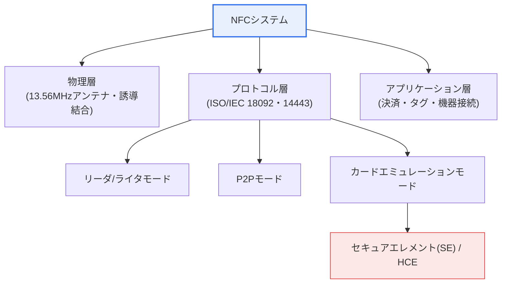
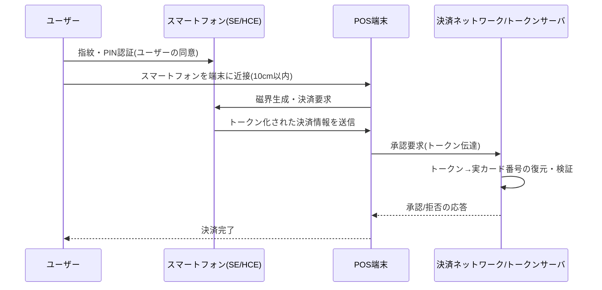

# NFC(Near Field Communication)

## 1. 概要

### A. 定義
> **NFC(Near Field Communication)** とは、13.56MHz帯において **約10cm以内の極近距離でのみ無線でデータを送受信する** 非接触型の近距離通信技術である。RFID技術を基盤として発展し、ISO/IEC 18092(NFCIP-1)とISO/IEC 14443を標準とし、スマートフォンに内蔵されて決済・タグ・機器接続の事実上の標準となった。

NFCを理解する核心は、「**通信距離が短いことが、なぜ短所ではなく長所なのか**」である。ほとんどの無線技術はより遠く、より速く届くことを目標とするが、NFCは正反対に通信距離を意図的に10cm以内に制限した。10cmという短い距離は、ユーザーに **意図的に機器を近づける行為** を要求するからである。この物理的な近接行為そのものが「私はこの決済/認証に同意する」という明示的な意思表示となるため、別途の複雑なペアリングやパスワード入力なしに、直感的かつ安全なインタラクションが可能となる。地下鉄の改札にカードをかざす瞬間の自然さこそ、この設計思想の結果である。

このような設計は「距離こそがセキュリティ」という逆転の発想に基づいている。通信範囲が広ければ攻撃者が遠くから密かに信号を傍受したり偽造したりできるが、10cm以内に物理的に接近しなければならないとなれば、攻撃の難易度は劇的に上がる。すなわちNFCは物理的制約をセキュリティ資産へと転換した代表的な事例であり、これがBluetooth・Wi-Fiといった長距離技術と区別される根本的な差別化要素である。

### B. 登場背景および必要性
NFCは2004年にソニー・NXP(当時はフィリップス)・ノキアが結成したNFC Forumを中心に標準化が推進された。その背景には、交通カード・クレジットカードですでに普及していた非接触スマートカード(RFID)インフラを、**専用カードなしにスマートフォン1台に統合** しようとする産業的要求があった。利用者は財布の中の複数枚のカードを、事業者はカードの発行・配布コストを削減したいと考え、スマートフォンという汎用端末がその統合の器となった。

特に決済・認証の領域では、「速く、誤操作がなく、ユーザーの意図が明確でなければならない」という3つの要求が同時に存在する。NFCは数十msの接続遅延、10cmという明確な操作範囲、タグ・カード・P2Pを包含する柔軟性によってこれらの要求を一度に満たし、その結果、モバイル決済・入退室管理・機器間の簡易接続の共通インタフェースとして定着した。

### C. 特徴および動作原理
NFCは低消費電力・高速接続(数十ms)を特徴とし、アクティブ(Active)モードとパッシブ(Passive)モードの両方をサポートする。アクティブモードでは双方の機器が磁界を生成し、パッシブモードでは一方のみが磁界を生成し、もう一方はその磁界から電力を得る。特に **パッシブタグは自前の電源がなくても**、リーダが生成する電磁界から誘導電力を得て動作するため、バッテリー不要のステッカータグやプラスチックカードが実現できる。例えば展示会のポスターに貼られた薄いNFCステッカーは電源をまったく持たないが、スマートフォンをかざした瞬間にスマートフォンが生成した磁界から電力の供給を受け、URLを送信する。

通信は **電磁誘導結合(Inductive Coupling)** 方式で行われる。リーダのアンテナコイルに高周波電流が流れると13.56MHzの交流磁界が形成され、近接したタグのコイルに誘導電流が発生する。データはこの磁界を負荷変調(Load Modulation)などで変化させて伝達し、伝送速度は106/212/424 kbps程度である。これは大容量ファイルの転送には遅いが、決済トークンやタグのURLのような数百バイト単位のデータを瞬時にやり取りするには十分である。

## 2. NFCの全体構造と動作モード

まずNFCシステムの全体構成を概観すると、物理層(13.56MHz・アンテナ)-プロトコル層(ISO標準)-アプリケーション層(決済・タグ)に分かれ、スマートフォンはこの3層を1つのチップ(NFCコントローラ + セキュアエレメント)に集約する。

NFCの3つの動作モードは、スマートフォンが通信過程で **どのような役割を担うか** によって分かれる。この区分は単なる分類ではなく、同じハードウェアが状況に応じてリーダにもカードにもなるというNFCの柔軟性を示している。

**A. リーダ/ライタモード** では、スマートフォンはタグを読み書きするリーダとなる。アクティブ機器であるスマートフォンが磁界を生成し、パッシブタグがその中でデータを応答する。博物館の展示物の横にあるタグを読み取って解説を呼び出したり、製品パッケージのタグで真正品かどうかを確認したりするのが代表例である。このモードの中核的価値は、「オフラインの事物にデジタル情報を結び付ける」ことにある。

**B. P2P(Peer-to-Peer)モード** では、2つのアクティブ機器が対等にデータを交換する。一方が先に磁界を生成するともう一方が応答し、役割を交互に担う。初期にはAndroid Beamによる名刺・写真の交換に使われたが、実際にはBluetooth・Wi-Fi Directの **接続情報をNFCで先に交換(ハンドオーバー)** し、大容量転送は高速無線に引き渡す用途のほうが実用的であった。つまりNFCが「握手」を行い、本題の会話はBluetoothが担う構造である。

**C. カードエミュレーション(Card Emulation)モード** は、産業的な波及効果が最も大きいモードである。スマートフォンがあたかもクレジットカード・交通カードのように振る舞い、既存の決済端末(POS)にスマートフォンを物理カードとして認識させる。Samsung Pay(非接触)・Apple Pay・Googleウォレットの決済はすべてこのモードであり、オフィスの入館証やモバイル身分証もこれに属する。このモードはさらに、決済資格情報をどこに保管するかによって、物理チップである **セキュアエレメント(SE)** に置く方式と、ソフトウェアで処理する **HCE(Host Card Emulation、Android 4.4~)** に分かれる。

| モード | スマートフォンの役割 | 磁界の生成 | 代表的な活用 |
|---|---|---|---|
| **リーダ/ライタ** | リーダ(読む側) | スマートフォン | ポスター・製品タグの照会、真正性認証 |
| **P2P** | 対等な交換主体 | 交互 | 接続情報のハンドオーバー、名刺・ファイル交換 |
| **カードエミュレーション** | カード(読まれる側) | POS端末 | モバイル決済・交通カード・入館証・身分証 |

## 3. 決済処理手順とセキュリティアーキテクチャ

カードエミュレーションベースのモバイル決済が実際にどのように流れるかを段階的に見ると、NFCのセキュリティが「距離」だけでなく、「トークン化」と「隔離保管」の多層構造の上に成り立っていることがわかる。

この手順で注目すべき点は、**実際のカード番号(PAN)が端末や通信区間にまったく露出しない** ことである。スマートフォンはカード番号の代わりに、一回限り・機器固有の **トークン(Token)** を伝達し、トークンを実際のカード番号に戻す復元は決済ネットワークのトークンサーバのみが行う。仮に通信が傍受されても、攻撃者が得られるのは再利用不可能なトークンだけであるため、被害は限定される。これが、物理カードの複製(スキミング)に比べてモバイル決済が構造的に安全である理由である。

第二の防御線は **隔離保管** である。決済資格情報はスマートフォンの一般ストレージではなく、ハードウェア的に分離された **セキュアエレメント(Secure Element)** やOSから分離された信頼実行環境に保管され、悪意あるアプリはアクセスできない。HCE方式は物理SEの代わりに、クラウドベースのトークンと有効期間が限定された資格情報によってリスクを低減する。

第三の防御線は **ユーザー認証** である。決済直前に指紋・顔・PINで所有者本人であることを確認するため、紛失したスマートフォンを拾った者がそのまま決済することはできない。結局、NFC決済の安全性は「10cmの物理的近接 + トークン化 + ハードウェア隔離 + 生体認証」という4重の構造で成り立っている。

## 4. RFIDとの比較

NFCはRFIDの一系統であるが目指す目的が異なり、この違いは両技術が最適化した「距離」に由来する。RFIDが数メートルの距離で多数の物品を同時に高速識別する **物流・在庫管理** に最適化されているのに対し、NFCは短い距離で安全に1件を処理する **決済・認証** に特化している。物流では倉庫を通過するパレット数百個を一度に読み取らなければならないため距離と複数同時認識が重要だが、決済では隣の人のカードが誤って読み取られてはならないため、むしろ距離は短くなければならない。つまり同じルーツから生まれながらも要求が正反対であったため、設計が分かれたのである。

また、NFCは双方向通信とP2Pをサポートし、2つのアクティブ機器が対話できるが、一般的なRFIDはリーダがタグを読み取る単方向に近い。この双方向性により、NFCは単純な識別を超えて、ネゴシエーションやハンドオーバーのような複雑なインタラクションまでこなすことができる。

| 区分 | NFC | RFID |
|---|---|---|
| **距離** | ≤10cm | 数cm ~ 数m(UHFは最大数十m) |
| **周波数** | 13.56MHz(HF固定) | LF(125kHz)・HF(13.56MHz)・UHF(860~960MHz) |
| **通信方向** | 双方向(P2P可能) | 主に単方向 |
| **複数認識** | 1:1中心 | 多数のタグを同時認識 |
| **主な用途** | 決済・タグ・機器接続 | 物流・在庫・入退室・資産追跡 |

## 5. 深掘り:拡張活用と最新動向

NFCの重心は、単純な決済を超えて **デジタルアイデンティティ・モバイルキー** へと移りつつある。代表的な事例が自動車のデジタルキーである。Car Connectivity Consortium(CCC)が標準化したDigital Keyは、スマートフォンを自動車のキーとして使用するが、バッテリーが切れても開錠できるよう、近接・低消費電力に強い **NFCをバックアップチャネル** とし、平常時のハンズフリーエントリーはUWB・BLEが担う組み合わせを採用した。つまりNFCは「確実にかざす瞬間の認証」という強みによって、他の無線技術と役割を分担しながら生き残っている。

モバイル身分証・電子パスポートの領域も拡大している。電子パスポートのチップはISO/IEC 14443ベースでNFCリーダで読み取ることができ、モバイル運転免許証・デジタル身分証もNFCタッチによるオフライン検証をサポートする方向へ発展している。これは「10cmの近接 = 本人の提示」という直感が、本人確認の文脈においてもそのまま有効であるためである。

競合・補完技術の観点では、NFCはQR決済・BLE・UWBと共存している。QR決済は専用ハードウェア(NFCアンテナ・SE)なしにカメラだけで可能なため小規模事業者への普及が早かったが、照準・スキャンの過程が必要であり、「かざした瞬間に完了」するNFCの即時性には及ばない。UWBは数cm単位の精密な距離測定によってリレー攻撃により強いが、ハードウェアの普及率が低い。このように各技術はトレードオフが明確であり、単一技術が他の技術を完全に置き換えるよりも、状況に応じて併用される構図が定着しつつある。

セキュリティ面での最新の論点は **リレー攻撃(Relay Attack)** への対応である。攻撃者が正規のスマートフォンと正規の端末の間の通信を中継装置でつなぎ、「距離の制約」を無力化する攻撃であり、応答時間を精密に測定する **距離限定(Distance Bounding)** 手法や、前述のUWB精密測位との組み合わせによって対策が強化されている。近距離という物理的前提が技術によって偽装され得るという点で、NFCの「距離=セキュリティ」という公式は、付加的な検証によって継続的に補強されている。

## 6. 考慮事項および示唆(技術士の観点)

1. **モバイル決済エコシステムの中核インフラであり標準インタフェースである。** NFCは専用カード・ハードウェアなしにスマートフォンだけでカード・交通・入退室を統合したという点で、ユーザー体験革新の代表的事例である。技術士の答案では、単なる通信技術ではなく「決済・認証産業の共通プラットフォーム」として位置付けるべきである。

2. **セキュリティは物理的距離だけに依存しない多層構造で設計すべきである。** 10cmの制約、トークン化、セキュアエレメント・HCEによる隔離、生体認証、リレー攻撃対策に至るまで、階層別の防御が組み合わさって初めて実効的な安全性が確保される。「距離が短いから安全だ」という断定はリレー攻撃の前に崩れるため、注意が必要である。

3. **競合・補完技術との役割分担戦略が重要である。** QR(普及性)・BLE(連続性)・UWB(精密測位)とのトレードオフを理解し、NFCは「明確な意思表示が必要な認証・決済」に配置するのが合理的である。自動車のデジタルキーのように、複数の無線技術を階層的に組み合わせる設計が実務の標準となりつつある。

4. **デジタルアイデンティティ・モバイルキーへの拡張に備えた相互運用性・標準準拠が求められる。** ISO/IEC 18092・14443、NFC Forumのタグ規格、CCC Digital Keyなどの標準に準拠してこそ、異種端末・インフラ間の互換性が保証される。身分証・車両キーなど高信頼領域に進むほど、標準適合性と認証体系が導入の成否を左右する。

5. **個人情報・プライバシーの観点からの統制も並行すべきである。** タグベースの位置・行動追跡やスキミングの懸念に備え、最小限の収集・暗号化・ユーザー同意の手続きを設計に組み込むべきであり、決済履歴のような機微情報の保管・廃棄ポリシーも併せて整備する必要がある。

## 参考資料
- NFC Forum(標準・技術概要): https://nfc-forum.org/
- ISO/IEC 18092(NFCIP-1): https://www.iso.org/standard/56692.html
- Car Connectivity Consortium — Digital Key: https://carconnectivity.org/digital-key/

---

> **一言まとめ**: NFCは *13.56MHz・10cm以内の非接触近距離通信* であり、短い通信距離をむしろセキュリティ・直感性の長所とし、リーダ・P2P・カードエミュレーションの3モードをサポートし、トークン化・セキュアエレメント(SE/HCE)・生体認証・距離限定の多層防御と組み合わさってモバイル決済の中核となり、デジタルアイデンティティ・モバイルキーへと拡張しつつある。
