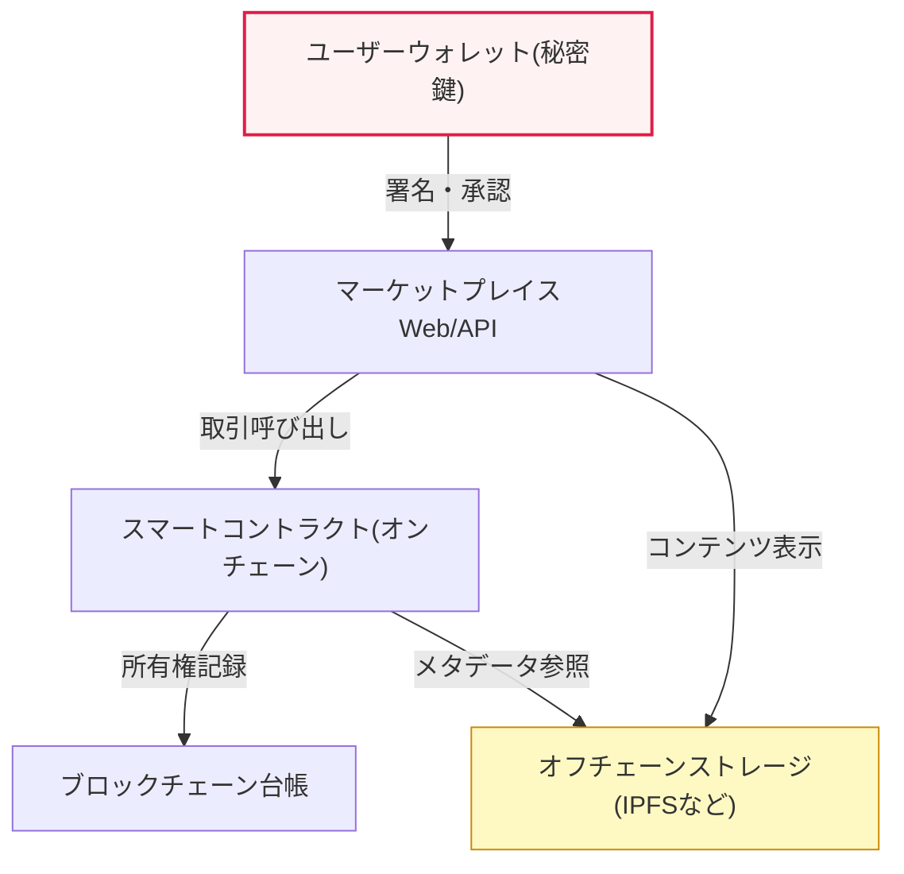
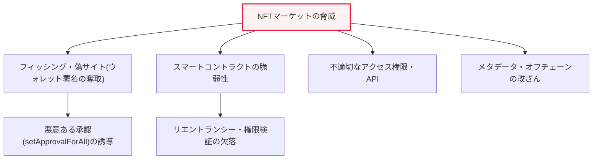

# NFTマーケットプレイスの特性とセキュリティ脆弱性

## 1. 概要

### A. 定義と背景
> **NFT(Non-Fungible Token、非代替性トークン)**とは、ブロックチェーンに記録され、それぞれが固有で互いに代替できないデジタル資産の証票であり、**NFTマーケットプレイス**とは、このNFTを発行(minting)・取引・展示するオンラインプラットフォームである。市場の拡大に伴い、この取引窓口が**ハッカーの主要な標的**となっており、NFT固有の特性が生む新たなセキュリティ脅威を理解し、対応しなければならない。

NFTマーケットプレイスが構造的にセキュリティ上脆弱である根本的な理由は、「**NFTの特性とブロックチェーン・Web・ユーザーが交わる結合点**」にある。NFTはブロックチェーンに記録されて改ざんが不可能であり、所有権が暗号学的に明確であるという強みを持つが、肝心の取引を仲介するマーケットプレイスは一般的なWebアプリケーションであり、ユーザーの資産の支配権は個人ウォレットの秘密鍵(private key)にかかっている。まさにこの接点で脆弱性が発生する。ブロックチェーン上のNFTそのものは安全であっても、それを売買する**Webサービスがハッキングされたり、ユーザーが騙されてウォレットの署名(トランザクション承認)を誤って行ったりすれば、資産を失う。**

特にブロックチェーンの「**取り消し不能(不可逆性)**」という特性は諸刃の剣である。正常な取引においては二重支払い・取引改ざんを防ぐ強みとなるが、一度奪取されたNFTや誤って承認された取引は取り消し・返金が不可能であり、被害がそのまま確定する。銀行口座であれば不正取引を事後に停止・回収できるが、オンチェーン取引にはそのような「取り消しボタン」がない。すなわち、**NFTそのもののセキュリティと、それを扱うサービス・ユーザーのセキュリティは別物**であり、実際の事故の大部分は後者、つまりマーケットプレイス・ウォレット・ユーザー行動の層で発生するという点が、このテーマの核心的な洞察である。

### B. NFTの特性とセキュリティ上の含意
NFTの4つの代表的な特性は、それぞれセキュリティに直接的な影響を与える。表に先立ってその含意を押さえると、**非代替性**は各トークンが固有の価値を持つため盗難対象が特定されることを意味し、**所有権証明**は履歴が透明である一方、資産規模が公開されて標的が露出するという両面性を持つ。**不可逆性**は前述のとおり事後の復旧を根本的に遮断し、**オフチェーン連携**は、肝心の高価なコンテンツ(画像・映像)がブロックチェーンではなく外部ストレージにあるため、その地点が別の攻撃対象領域となることを示唆している。

| 特性 | 内容 | セキュリティ上の含意 |
|---|---|---|
| **非代替性** | 各トークンが固有(1:1の識別) | 高額資産が特定されて標的化 |
| **所有権証明** | ブロックチェーンに所有・取引履歴を記録 | 透明だが保有資産・規模が露出 |
| **不可逆性** | 取引の取り消し・巻き戻し不可 | 事後復旧不可、予防が唯一の対応 |
| **オフチェーン連携** | 実際のコンテンツは外部(IPFSなど)に保存 | リンク・コンテンツの改ざん・消失という攻撃対象領域 |

## 2. NFT取引の構造と脅威ポイント

NFT取引は単一のシステムではなく、複数の層が連動する構造である。ユーザーの**ウォレット(秘密鍵)**、マーケットプレイスの**Webフロントエンド・バックエンドAPI**、オンチェーンの**スマートコントラクト**、そしてコンテンツを格納する**オフチェーンストレージ(IPFSなど)**が1つの取引フローを構成する。以下の構造図はこれらの層がどのようにつながっているかを示しており、各接続線がそのまま潜在的な攻撃ポイントとなる。

この構造において、脅威は特定の1か所ではなく層ごとに分散して現れる。脅威の類型を系統図に整理すると次のとおりであり、フィッシング・コントラクトの欠陥・APIの脆弱性・メタデータ改ざんが4つの軸を成す。

### A. フィッシング・署名奪取
実際のNFT窃取事故で最も頻繁な経路が、**フィッシングによるウォレット署名の奪取**である。攻撃者は有名マーケットプレイスや人気プロジェクトを騙った偽サイト・メール・SNSリンクでユーザーを誘い込み、「エアドロップの受け取り」「ミンティングへの参加」といったもっともらしい名目でウォレット接続と署名を要求する。問題は、ユーザーが何気なく署名するトランザクションが、実は自分のNFTすべてを攻撃者に送信・承認する内容である可能性があるという点である。

技術的に最も危険なのが、`setApprovalForAll`のような**包括的承認(approval)**関数である。この承認1回で、特定のコントラクトがユーザーの当該コレクション全体を代わりに移転する権限を得るが、ウォレットのUIではその意味が直感的に示されないため、ユーザーがリスクを認識しにくい。承認を奪取した攻撃者は、その後ユーザーの関与なしにいつでも資産を持ち出すことができ、前述の不可逆性のため、移転が完了すると取り戻す方法はない。2022年には大手マーケットプレイスのユーザーを狙った大規模なフィッシング事故がこの手口で多数発生し、社会的な警戒感を高めた。

### B. スマートコントラクトの脆弱性
NFTの発行・取引・ロイヤリティ支払いはスマートコントラクトのコードによって自動実行されるため、**そのコードの欠陥はそのまま資金の窃取に直結**する。代表的なものとして、外部呼び出し中の状態変更を悪用するリエントランシー(reentrancy)、権限検証の欠落により任意のユーザーが管理者機能を呼び出せるアクセス制御の欠陥、整数オーバーフロー・ロジックエラーなどがある。コントラクトは一度デプロイされると修正が難しく(不変性)、公開されていて誰でもコードを分析できるため、脆弱性は即座に攻撃にさらされる。したがって、デプロイ前の専門的な監査(audit)と形式検証、デプロイ後のバグバウンティ運営が事実上必須である。

### C. アクセス権限・APIの脆弱性とメタデータ改ざん
マーケットプレイスのバックエンドAPIに**不適切な認可(authorization)**があれば、攻撃者は他人の出品情報を改ざんしたり、無断取引を成立させたりできる。また、前述のオフチェーン連携の問題により、NFTの実際のコンテンツとメタデータが中央集権的なサーバや可変URLに保存されていると、**リンク改ざん・コンテンツ差し替え・サービス終了による消失**のリスクが生じる。ユーザーが高額なNFTを購入したにもかかわらず、肝心の指し示す絵が消えたり変わったりすることが実際に起きている。このため、IPFSのコンテンツアドレス(ハッシュ)ベースの保存やArweaveのような永続保存が推奨される。

| 脆弱性 | 内容 | 主な影響 |
|---|---|---|
| **フィッシング・署名奪取** | 偽サイトでウォレット署名・承認を誘導 | 資産の無断移転(不可逆) |
| **スマートコントラクトの欠陥** | リエントランシー・権限検証の欠落などのロジック脆弱性 | 大規模な資金窃取 |
| **アクセス権限・APIの脆弱性** | 不適切な認可による無断取引・操作 | 出品情報の改ざん、無断販売 |
| **メタデータ改ざん** | オフチェーンコンテンツ・リンクの改ざん・消失 | 資産価値の毀損 |
| **偽NFT・著作権侵害** | 著作物の無断発行、なりすまし販売 | 利用者の欺瞞・法的紛争 |

## 3. 対応策(層別防御)

対応の核心原則は、前述の脅威が層ごとに分散しているため、**防御も層ごとに統合的に構成**しなければならないということである。ある1つの層だけを強化しても、他の層が突破されれば資産を失うからである。マーケットプレイス事業者はWebセキュリティとコントラクト監査を、ユーザーは署名の習慣とウォレット管理を、資産面では完全性と真正性の検証をそれぞれ担う。

| 区分 | 対応 |
|---|---|
| **マーケットプレイス** | Webセキュリティ(WAF・MFA認証)、スマートコントラクト監査・形式検証、APIの最小権限・認可強化、不正取引検知 |
| **ユーザー** | ウォレット署名前の権限確認(`setApprovalForAll`に警戒)、フィッシングサイト・リンクへの注意、ハードウェアウォレットの使用、未使用承認の定期的な取り消し(revoke) |
| **NFT資産** | 著作権・真正性の検証、オフチェーンコンテンツの完全性(IPFSハッシュ・Arweave永続保存) |
| **取引の安全** | 不正取引・異常承認の検知、承認権限の最小化・自動失効、ウォレット-マーケット連携時のホワイトリスト |

特にユーザー教育は費用対効果が最も大きい。実際の被害の大部分がコードのハッキングではなく、**ユーザーを欺くソーシャルエンジニアリング(フィッシング)**に起因するからである。「署名する前に何を承認するのか必ず確認する」「出所不明なリンクからのウォレット接続は禁止」「未使用の承認を定期的に取り消す」という3つの習慣だけでも、相当数の事故を予防できる。

### A. マーケットプレイス(事業者)観点での深掘り対応
事業者側の防御は、「Webアプリケーションセキュリティ」と「オンチェーンロジックセキュリティ」の両方を求めるという点で、一般的なWebサービスよりも範囲が広い。Web層では、WAF・MFA・セッション保護といった従来の統制に加え、ウォレット接続時に署名対象トランザクションの意味をユーザーに明確に示す**透明な署名UX**を提供すべきである。バックエンドAPIは最小権限の原則に従って認可を厳格に検証し、出品・価格変更のような機微な操作には所有権確認と再認証を要求すべきである。オンチェーン層では、コントラクトをデプロイ前に専門的な監査・形式検証にかけ、デプロイ後も異常トランザクションの監視とバグバウンティで常時点検する。

また、マーケットプレイスは利用者の資産を直接保管していなくても、なりすまし・偽コレクション・著作権侵害を排除する**キュレーション・検証体系**を備えるべきである。偽造コレクションが本物のように表示されれば、利用者の欺瞞とプラットフォームの信頼毀損に直結するからである。人気コレクションに対する認証バッジ、発行者の身元確認、通報・ブロックのプロセスが代表的な仕組みである。

### B. ユーザー観点での深掘り対応
ユーザー側の最善の防御は、**鍵管理と承認管理**に要約される。高額資産はインターネットから切り離されたハードウェアウォレット(コールドウォレット)に保管し、日常的なやり取りは少額のみを入れた別の「ホットウォレット」に分けるウォレット分離戦略が推奨される。承認面では、`setApprovalForAll`のような包括的承認を濫用せず、必要な分だけ承認し、取引終了後は承認照会・取り消し(revoke)ツールで不要な権限を整理すべきである。取り消されていない承認を放置すると、後日そのコントラクトが侵害された場合に自分の資産までリスクにさらされるからである。

| 対応層 | 中核措置 | 防御する脅威 |
|---|---|---|
| **鍵管理** | ハードウェアウォレット、ホット/コールド分離、シードのオフライン保管 | 鍵の窃取・漏えい |
| **承認管理** | 最小限の承認、定期的な取り消し、承認状況の点検 | 包括的承認の悪用 |
| **取引検証** | 署名内容の確認、ドメイン・URLの再確認 | フィッシングによる署名奪取 |

### C. 資産・コンテンツ完全性の観点での対応
NFTの価値は結局それが指し示すコンテンツにあるため、**オフチェーンコンテンツの永続性と完全性**を確保することが資産保護の最後の環である。メタデータと実ファイルを中央サーバの可変URLに置くと、リンクが切れたり内容が変わったりする可能性があるため、コンテンツのハッシュがそのままアドレスとなるIPFS(コンテンツアドレス指定)や、永続保存を志向するArweaveに保管することが望ましい。そうすれば、コンテンツがわずかでも変更されるとアドレスが変わるため、改ざんを即座に検知できる。併せて、発行段階で著作権・真正性を検証して無断発行・盗用を排除してこそ、購入者が「偽物を買った」後に生じる紛争と損失を予防できる。

## 4. 深掘り — 最新動向と出題予想

最近、ウォレット・標準の陣営は、ユーザーが署名内容をより理解しやすくする方向へ進化している。**署名内容を人間が読める形で表示する署名標準(例: EIP-712構造化データ署名)**や、危険な承認を事前に警告・遮断するウォレットセキュリティ拡張、承認状況を照会・取り消しできるツールが普及しつつある。また、資産をコードベースのアカウント(スマートコントラクトウォレット)で管理し、**鍵の紛失・窃取時のソーシャルリカバリー(social recovery)や取引限度・ホワイトリスト**を適用しようとするアカウント抽象化(Account Abstraction、ERC-4337)の流れも注目されている。規制面では、仮想資産利用者保護とマネーロンダリング対策(AML)の要求が強化され、マーケットプレイスのKYC・不正取引報告の義務が大きくなる傾向にある。

技術士の観点では、このテーマは「**NFTの特性を説明し、そこから派生するマーケットプレイスのセキュリティ脅威と対応を論ぜよ**」「**ブロックチェーンの不可逆性がセキュリティに及ぼす両面性を説明せよ**」「**オンチェーンとオフチェーンのセキュリティの違いと統合防御戦略**」といった形で出題されやすい。答案は、(1) NFTの4大特性とセキュリティ上の含意、(2) ウォレット・Web/API・コントラクト・オフチェーンの層別脅威、(3) フィッシングによる署名奪取が実際の被害の多数を占めるという実務的洞察、(4) 層別・予防中心の対応を組み合わせて展開すると説得力が高い。

## 5. 考慮事項および示唆

1. **不可逆性が脅威を増幅するため、予防が唯一の対応**である。オンチェーン取引は取り消すことができず、事後の復旧は根本的に不可能である。したがって、署名前の確認・フィッシング遮断・承認の最小化といった事前予防に資源を集中すべきであり、事故対応は拡散防止・再発防止に焦点を当てざるを得ない。
2. **オンチェーン・オフチェーンのセキュリティの分離を理解した統合防御**が必要である。NFTそのもの(オンチェーン)が安全でも、マーケットプレイス(Web)・ウォレット(ユーザー)・コンテンツ(オフチェーン)のいずれかが突破されれば資産を失うため、全層を1つの脅威モデルとして捉え、統合的に保護すべきである。
3. **スマートコントラクトの監査と形式検証が必須**である。コントラクトの欠陥は個々のユーザーではなくプロトコル全体の大規模な窃取へと拡大するため、デプロイ前の専門監査・形式検証と、デプロイ後のバグバウンティ・監視を常時運用すべきである。
4. **ユーザー中心の脅威に対するUX・教育への投資**が核心である。実際の被害の多数がコードではなく人を欺くフィッシングから生じるため、ウォレット・マーケットの署名UXを「何を承認するのかが明確に見えるように」改善し、ユーザーのセキュリティ教育を並行してこそ実効性が上がる。
5. **規制・制度との整合性**を考慮すべきである。仮想資産利用者保護の法制、AML/KYC、著作権保護の要求が強化される流れの中で、マーケットプレイスは不正取引検知・本人確認・著作権検証の体系を整え、法的リスクと利用者の信頼を併せて管理しなければならない。

## 参考資料
- OWASP Smart Contract Top 10: https://owasp.org/www-project-smart-contract-top-10/
- Ethereum, "ERC-721 Non-Fungible Token Standard": https://ethereum.org/en/developers/docs/standards/tokens/erc-721/
- Ethereum, "EIP-712: Typed structured data hashing and signing": https://eips.ethereum.org/EIPS/eip-712

---

> **一言まとめ**: NFTマーケットプレイスは *不可逆性・オフチェーン連携といったNFTの特性*により、フィッシングによる署名奪取・スマートコントラクトの欠陥・APIの脆弱性・メタデータ改ざんの脅威にさらされており、オンチェーン・マーケット・ユーザー・オフチェーンの全層を統合したセキュリティと、コントラクト監査・予防中心のユーザー署名管理で対応しなければならない。
