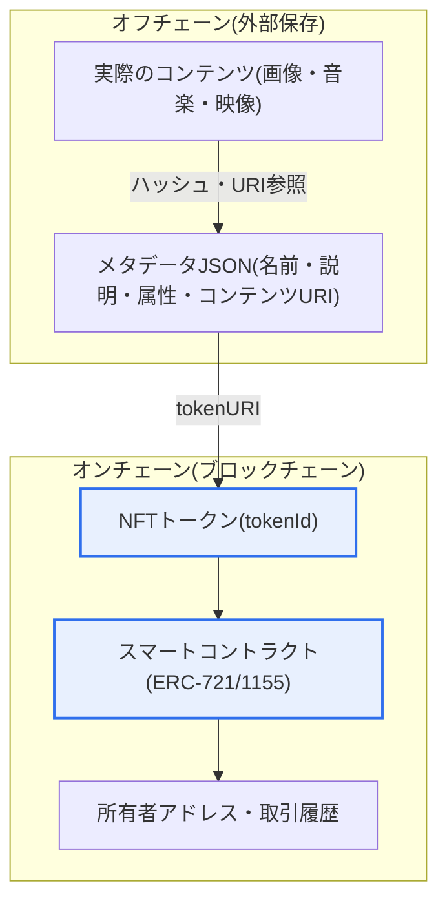
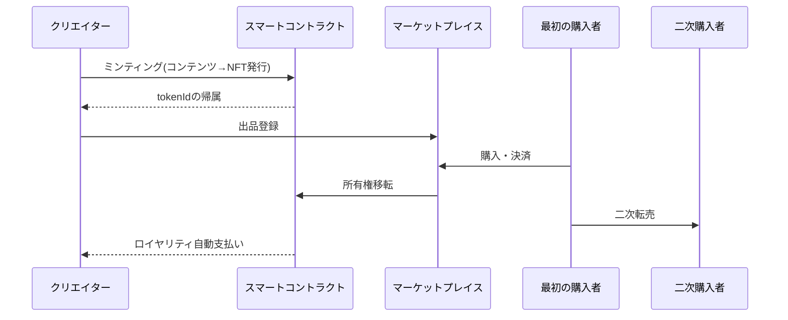

# 非代替性トークン(NFT, Non-Fungible Token)

## 1. 概要

### A. 定義
> **NFT(Non-Fungible Token)** とは、ブロックチェーンに記録され、**それぞれが固有であり互いに代替できない(Non-Fungible)** デジタルトークンであり、デジタル・実物資産(絵画・音楽・コレクターズアイテム・会員権など)の所有権と真正性を改ざん不可能な形で証明する手段である。

NFTの核心的な発想は、「**複製が自由なデジタル世界に、本物のオリジナルと所有権を付与すること**」である。デジタルファイルは完全に無限複製できるため、物理世界の「一点物のオリジナル」という概念が成立しなかった。誰もが同じ画像をダウンロードして所有できる世界では、「これが本物のオリジナルであり、その持ち主は誰か」を見分ける方法がなかったのである。NFTは、ブロックチェーンという分散台帳に「この資産の現在の所有者は誰であり、どのような取引を経てきたか」という記録を改ざん不可能な形で刻むことで、複製がいくら多くても「所有権記録のオリジナル性」を保証する。

ここで「非代替性(Non-Fungible)」が概念の核心である。代替可能な(fungible)資産は、同じ価値の別の個体と自由に交換される。1ビットコインは別の1ビットコインと、1万円札は別の1万円札と完全に同一の価値を持ち、互いに交換しても差し支えない。一方NFTは、各トークンが互いに異なる固有の資産と1:1で結び付いているため交換できない。私が所有する特定作品のNFTは、他人が所有する別の作品のNFTと決して同じではない。この固有性・不可分性のおかげで、これまで希少性の概念を適用しにくかったデジタルアート・コレクターズアイテム・ゲームアイテム・メンバーシップに、「この世に1つだけ」あるいは「限定発行」という物理的財の属性を移植できるようになった。

### B. 登場背景および必要性
NFTの台頭は、技術的成熟と市場の要求がかみ合った結果である。技術的には、イーサリアムがスマートコントラクト(自動実行されるプログラム契約)を大衆化したことで、所有権移転・ロイヤリティ分配といったルールをコードとして台帳に組み込めるようになったことが決定的であった。2017年にはクリプトキティーズ(CryptoKitties)というコレクション型ゲームがイーサリアムネットワークを麻痺させるほどの人気を集め、NFTの大衆的な可能性を初めて示し、これを契機に固有トークンの標準(ERC-721)が確立された。

市場面では、創作・収集活動が急速にデジタルへ移行する中で、クリエイターが仲介者(ギャラリー・プラットフォーム)を介さず直接作品の所有権を販売し、二次流通でも継続的にロイヤリティを受け取りたいという要求が高まった。従来のデジタル流通では、クリエイターは最初の販売以降の転売から何の対価も得られなかったが、NFTのスマートコントラクトは「転売されるたびに原作者へ一定割合を自動支払い」するロイヤリティ構造をコードで強制できる。このように「デジタル資産に所有権・希少性・継続的収益を付与する」という必要性が、NFT普及の原動力となった。ただし、このロイヤリティの強制はマーケットプレイスがそれを尊重する場合にのみ実効性があり、その後ロイヤリティ回避の論争へとつながった点については後述する。

## 2. 構造および動作原理

NFTの構造を理解する核心は、「何をオンチェーンに置き、何をオフチェーンに置くか」である。以下の全体構造図は、実際のコンテンツ・メタデータ・所有権記録がどのように階層的に結び付いているかを示している。

ブロックチェーンの保存コストは非常に高いため、容量の大きい画像・音楽といった実際のコンテンツは、通常IPFS(分散ファイルシステム)やArweave、あるいは一般的なサーバなどのオフチェーンに置かれる。オンチェーンには、そのコンテンツの場所(URI)と特性を収めた「メタデータ」へのリンク、そして所有権・取引履歴のみを記録する。この階層構造が、NFTの強み(改ざん不可能な所有権証明)と弱み(コンテンツ自体の永続性の脆弱さ)を同時に生み出している。

### A. スマートコントラクトとトークン標準
NFTの実体は、ブロックチェーン上で動作するスマートコントラクトである。このコントラクトは各トークンに固有の識別番号(tokenId)を付与し、どのアドレスがどのトークンを所有するかのマッピングを管理し、所有権移転(transfer)・発行(mint)・焼却(burn)といった動作のルールをコードで定義する。代表的な標準である **ERC-721** は、「トークン1つ1つが互いに異なる」純粋な非代替性を実装する。一方 **ERC-1155** は、1つのコントラクトで代替可能トークンと非代替性トークンを併せて扱う「マルチトークン」標準であり、ゲームアイテムのように「同じ種類を複数」発行しなければならない状況でガス代を節約できる利点がある。

標準化が重要な理由は相互運用性にある。標準に従えば、どのマーケットプレイス・ウォレットでもそのNFTを同じ方式で認識・取引できる。もし発行者ごとに勝手に実装していたら、特定のプラットフォームでしか使えない断片化された資産になっていたであろう。標準インタフェースこそが、NFTエコシステムという市場を成立させた土台なのである。

### B. 発行(ミンティング)と所有権移転
ミンティング(minting)とは、コンテンツをNFT化してブロックチェーンに初めて登録するプロセスである。クリエイターがメタデータを準備してコントラクトの発行関数を呼び出すと、新しいtokenIdが生成され、クリエイターのアドレスに帰属する。この際、イーサリアムなどではネットワーク利用料であるガス代(gas fee)が発生し、ネットワーク混雑時にはこの費用が数十ドルに達し、少額の創作物にとって参入障壁となることもある。これを緩和するため、実際に販売が成立した時点で発行する「遅延ミンティング(lazy minting)」手法が使われる。

所有権移転は、マーケットプレイスで販売が成立すると、スマートコントラクトが代金決済とトークン移転をアトミックに処理する方式で行われる。すべての取引履歴が台帳に残るため、特定のNFTの最初のクリエイターから現在の所有者までの「来歴(provenance)」が透明に追跡される。この検証可能な来歴こそが、美術品の真贋判定においてNFTが持つ最も実質的な価値と評価されている。

以下の表は上述した特徴を整理したものであり、各項目の根拠は前の段落の説明にある。

| 特徴 | 内容 | 実務上の含意 |
|---|---|---|
| 非代替性 | 各トークンが固有(tokenId) | 希少性・1:1の識別 |
| 所有権証明 | オンチェーンの所有・取引履歴 | 改ざん不可能な来歴追跡 |
| 標準・相互運用 | ERC-721/1155 | ウォレット・マーケットとの互換 |
| スマートコントラクト | ルールのコード化 | ロイヤリティの自動分配 |
| オフチェーン連携 | コンテンツは外部、所有権のみオンチェーン | 永続性リスクが常に存在 |

## 3. 活用分野および事例

NFT取引の典型的な流れをプロセスの観点から見ると、以下のとおりである。この詳細フロー図は、創作・発行から二次流通・ロイヤリティまでのライフサイクルを強調している。

デジタルアート・コレクターズアイテムの分野が初期市場を牽引した。2021年、デジタルアーティストのビープル(Beeple)のコラージュ作品がクリスティーズのオークションで約6,930万ドルで落札された出来事はNFTを世界的な話題にし、プロフィール画像(PFP)形式のコレクションがコミュニティメンバーシップの象徴として取引された。これは、NFTが単なる所有を超えて、「同じ集団に属している」というアイデンティティ・帰属意識の媒介になり得ることを示した。

ゲーム分野では、アイテム・キャラクターをNFT化し、利用者が実際の所有権を持ってゲーム外でも取引するP2E(Play to Earn)モデルが登場した。ただし初期のP2Eは新規流入資金に依存する構造的脆弱性により多くが崩壊し、その後は「面白さ」を中心に据えて所有権を付加する方向へと再編されつつある。会員権・チケット分野では、コンサートの入場券やメンバーシップをNFTとして発行し、偽造やダフ屋行為を防止し、所有者だけに付加的な特典を提供する方式が試みられている。

最も実用的な拡張として注目されているのが **実物資産のトークン化(RWA, Real World Asset)** である。不動産・高級ブランド品・美術品・債券といった実物の所有権・持分をNFTで表現し、真正性の証明、分割所有、取引の流動性を高める方向である。例えば、高額なブランド品にNFT形式のデジタル保証書を組み合わせ、真正品認証と所有履歴を管理する事例が増えており、これは投機的なイメージから脱却し、NFTの重心を「実質的な効用」へと移す流れを代表している。

| 分野 | 代表的な活用 | 事例・特徴 |
|---|---|---|
| デジタルアート・コレクターズアイテム | 美術品・PFPの所有・取引 | ビープル6,930万ドルで落札 |
| ゲーム | アイテムの所有・取引(P2E) | 面白さ中心に再編 |
| 会員権・チケット | メンバーシップ・入場券の証明 | ダフ屋・偽造防止 |
| 実物連携(RWA) | 不動産・ブランド品の真正性・分割所有 | 流動性・認証の強化 |
| コンテンツ・音楽 | 創作ロイヤリティの自動化 | 二次流通の収益配分 |

## 4. 深掘り:市場の浮き沈みと規制・会計の動向

NFT市場は、2021年から2022年初頭にかけての爆発的な好況の後、急激な調整を経験した。取引量と平均価格が高値から大きく下落し、「バブル」との批判が提起されたが、これは資産そのものの欠陥というより、実質的な効用なしに投機心理に依存した初期市場の自然な整理過程と解釈する見方が優勢である。その後市場は、純粋な収集・投機から、前述のRWA・チケット・メンバーシップ・ブランドロイヤルティプログラムなど「効用ベース」の活用へと重心を移しつつある。

ガバナンス・規制面の論点も浮上した。第一は **ロイヤリティ回避** の問題である。クリエイターロイヤリティはスマートコントラクトではなくマーケットプレイスのポリシーに依存する場合が多く、ロイヤリティを無視したり任意にしたりするプラットフォームが登場したことで、クリエイターの収益モデルが揺らいだ。これは「コードこそが法(code is law)」という理想と実際の市場慣行との間のギャップを露呈した事例である。第二は **有価証券性の判断** である。NFTを分割したり収益を約束する形で販売したりすると、各国の監督当局がこれを有価証券と見なす可能性があり、資本市場規制の適用可否が発行構造設計の中核変数となった。

韓国国内でも仮想資産利用者保護に関する法制が整備される中で、NFTが「仮想資産」に該当するかどうかが事案ごとに議論されている。一般に、純粋な収集・鑑賞目的の1点物NFTは規制対象の仮想資産から除外される方向で議論されているが、決済・投資手段としての性格が強い場合や大量・分割発行される場合には規制が適用され得るという点で、発行目的と構造によって法的性格が異なることに留意すべきである(具体的な適用は関連法令・有権解釈に従うため、断定は避ける)。会計・課税面でも、保有・処分損益の認識と税務処理の基準が整備される過程にある。

## 5. 考慮事項および示唆(技術士の観点)

1. **オフチェーンコンテンツの永続性確保**: 所有権記録はオンチェーンで永続的であるが、肝心のコンテンツが一般的なサーバのURLを指していると、そのサーバが消えた瞬間に「所有権はあるが見るべき絵はない」状態となる。IPFS・Arweaveのようなコンテンツアドレス方式(content-addressed)の分散ストレージとオンチェーンのハッシュ固定によって完全性を保証し、さらにSVGなどで画像をオンチェーンに直接保存する「完全オンチェーン」方式まで検討すべきである。NFTの信頼は、所有権とコンテンツの永続性が共に確保されたときに完成する。

2. **所有権と著作権・利用権の区別**: NFTを購入することが、そのまま著作権(複製・頒布・二次的著作物の作成権)を持つことを意味するわけではない。通常、所有者は「当該トークンの所有」と契約で明示された限定的な利用権のみを得て、著作権はクリエイターに残る場合が多い。この区別が不明確だと無断発行・盗用・権利紛争が発生するため、発行時に利用範囲を明示したライセンスと真正性の検証体系が不可欠である。

3. **投機・詐欺・セキュリティリスクの管理**: 極端な価格変動性、相場操縦(wash trading)、ラグプル(持ち逃げ)、フィッシングによるウォレット乗っ取り、マーケットプレイスの脆弱性などのリスクが常に存在する。秘密鍵の管理(ハードウェアウォレット)、コントラクト監査(audit)、承認(approve)権限の最小化といったセキュリティ規則と、実質的な効用に基づく価値評価が、投資家・利用者保護の鍵である。

4. **環境・コストと技術転換**: 初期のNFTは、プルーフ・オブ・ワーク(PoW)ベースのイーサリアムの高いエネルギー消費とガス代が批判された。しかし、イーサリアムのプルーフ・オブ・ステーク(PoS)への移行によりエネルギー消費は大幅に減少し、レイヤー2(ロールアップ)による拡張で取引コストも低下する傾向にある。持続可能性・コストは固定された限界ではなく、技術の進化によって改善される変数であることを認識し、最新動向に基づいて判断すべきである。

5. **標準・相互運用性と制度との整合性**: ウォレット・マーケット・チェーン間の相互運用性のために標準準拠とクロスチェーン連携が重要であり、同時に仮想資産・証券・税務・個人情報関連の法制との整合性を発行段階から設計すべきである。技術的な可能性だけで事業を設計すると、規制リスクが事後的に事業そのものを無力化し得るため、「技術-法制-ビジネス」を併せて設計する視点が求められる。

## 参考資料
- Ethereum, ERC-721 Non-Fungible Token Standard, https://eips.ethereum.org/EIPS/eip-721
- Ethereum, ERC-1155 Multi Token Standard, https://eips.ethereum.org/EIPS/eip-1155
- Ethereum.org, NFT概要, https://ethereum.org/en/nft/
- 韓国金融委員会、仮想資産利用者保護関連の政策資料, https://www.fsc.go.kr

---

> **一言まとめ**: NFTは *ブロックチェーンのスマートコントラクトによってデジタル・実物資産の固有性・所有権を改ざん不可能な形で証明* する非代替性トークンであり、アート・ゲーム・会員権・RWAに活用されるが、オフチェーンコンテンツの永続性・著作権との区別・投機とセキュリティのリスク・規制との整合性が中核的な課題である。
