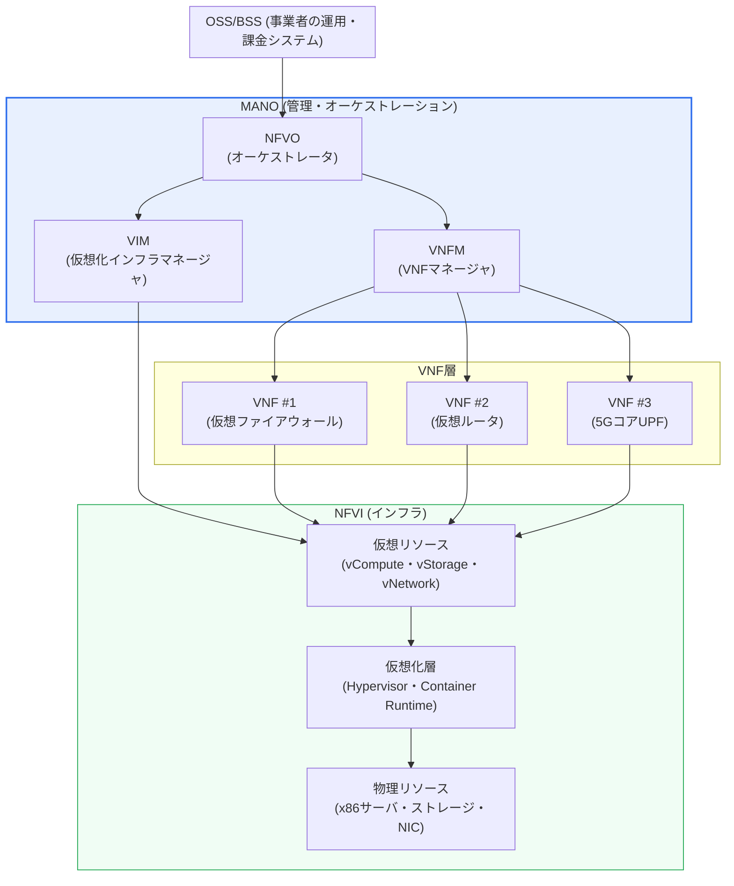
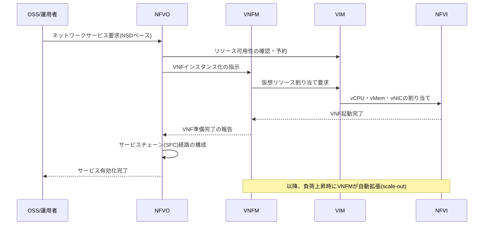

# ネットワーク機能仮想化(NFV, Network Functions Virtualization)

## 1. 概要

### A. 定義
> **NFV(Network Functions Virtualization)** とは、ファイアウォール・ルータ・ロードバランサ・DPI・EPCなど、これまで **専用ハードウェア機器(appliance)に固定されていたネットワーク機能** を、汎用サーバ(x86)上で動作する **ソフトウェア(仮想ネットワーク機能、VNF)** として分離・実装し、必要に応じて配置・拡張・移動・削除できるようにするアーキテクチャ技術である。2012年に欧州電気通信標準化機構(ETSI)のNFV ISG(Industry Specification Group)が通信事業者主導で標準化を開始した。

NFVの核心的な発想は、「**ネットワーク機能をハードウェアから切り離してソフトウェア化しよう**」というものである。これを理解するには、まず従来のネットワーク機器の構造的限界を押さえる必要がある。従来の通信網は、特定の機能ごとにベンダーの専用ASIC・ファームウェアに最適化された物理機器(専用ハードウェア)を置く方式であった。ファイアウォールはファイアウォールの筐体、ロードバランサはロードバランサの筐体、セッション管理(EPC)はさらに別の筐体を購入してラックに挿し、ケーブルで接続した。この方式は性能に優れるものの、新しいサービスを1つ立ち上げるたびに機器の購入・設置・配線・構成に数週間~数か月を要し、特定ベンダーに依存し(vendor lock-in)、容量を超えれば機器を丸ごと交換しなければならない非弾力的な構造であった。

NFVはこの構造を根本的に変える。ネットワーク機能を「筐体」ではなく、汎用サーバ上で動作する **VMまたはコンテナ形式のソフトウェア(VNF)** として再定義することで、サーバリソースさえあればファイアウォール・ルータ・5Gコア機能を **ソフトウェアのインストールのように数分で配置** し、トラフィックが集中すればインスタンスを増やして(scale-out)対応し、不要になれば回収してリソースを返却する。すなわちNFVは、サーバ仮想化がITインフラにもたらした柔軟性をネットワーク領域に拡張したものであり、「ネットワークのクラウド化」と要約できる。

### B. 登場背景と必要性
NFVが通信事業者(Telco)主導で生まれた決定的な背景は、**トラフィックの急増と収益性悪化の乖離** である。スマートフォン・OTT・動画のトラフィックが毎年数十%増加しているにもかかわらずデータ料金(ARPU)は停滞し、事業者は増え続けるトラフィックを高価な専用機器の増設で賄う従来の方式では収益を上げられなくなった。加えて、5G・IoTが要求する **ネットワークスライシング**(1つの物理網を用途別の論理網に分割する技術)と超低遅延のエッジサービスは、物理機器を個別に配置する方式では現実的に実装不可能であった。事業者は、IT業界ですでに検証済みの「汎用サーバ + 仮想化 + 自動化」をネットワークに導入すれば、**CAPEX(資本支出)・OPEX(運用支出)を同時に削減** し、新規サービスの市場投入期間(Time-to-Market)を劇的に短縮できると考えた。これが、2012年に世界の主要通信事業者がETSIに集まりNFV白書を発表した直接的な動機となった。

特にNFVはSDNとともに「次世代ネットワークの二本柱」として挙げられる。**SDNが制御プレーンとデータプレーンを分離してネットワークを「プログラム可能」にしたとすれば、NFVはネットワーク機能をハードウェアから分離して「ソフトウェア化」した。** 両者は独立しても使われるが、SDNがVNF間のトラフィック経路を柔軟に接続し(Service Function Chaining)、NFVがその上で機能を担うという形で相互補完するとき、シナジーが最大化される。

## 2. NFVのアーキテクチャ(ETSI NFV MANO)

ETSI NFVは全体構造を大きく **① VNF(仮想ネットワーク機能)、② NFVI(NFVインフラ)、③ MANO(管理・オーケストレーション)** の3領域として定義する。以下の図は、これら3領域と主要構成要素の関係を示した全体構造図である。

**VNF(Virtualized Network Function)** とは、従来専用機器が担っていた個々のネットワーク機能をソフトウェアで実装したものである。仮想ファイアウォール(vFW)、仮想ルータ(vRouter)、仮想ロードバランサ、5GコアのUPF/AMF/SMFなどが代表的である。1つの論理的なサービスは複数のVNFの組み合わせで構成でき、各VNFはさらに複数のVNFC(Component)に分割できる。VNFの実体はVMイメージやコンテナイメージであるため、スナップショット・複製・マイグレーションといった仮想化の利点をそのまま享受できる。例えば特定地域でDDoSが発生した場合、仮想ファイアウォールのインスタンスを数分以内に複数起動して(scale-out)防御容量を増やし、攻撃が収まれば回収するという弾力的な対応が可能である。

代表的なVNFの類型を整理すると次のとおりであり、これは従来どのような専用機器がソフトウェアに置き換えられるかを示している。

- **セキュリティ系** — 仮想ファイアウォール(vFW)、仮想IPS/IDS、仮想DPI(ディープパケットインスペクション)、仮想VPNゲートウェイ
- **ネットワーキング系** — 仮想ルータ(vRouter)、仮想スイッチ、仮想ロードバランサ(vLB)、仮想NAT
- **モバイルコア系** — 4G EPC(仮想S/P-GW、MME)、5Gコア(UPF・AMF・SMF・PCFなど)
- **加入者網・アクセス系** — vCPE(仮想顧客宅内機器)、vBNG、vRAN/O-RAN機能

このように1つの物理サーバプール上に性格のまったく異なる機能を同時に載せられる点がNFVのリソース統合(consolidation)効果であり、異なるVNFを組み合わせて新しいサービスを迅速に設計できる柔軟性の源泉である。

**NFVI(NFV Infrastructure)** は、VNFが実際に載る土台であり、物理リソース(x86サーバ・ストレージ・ネットワークカード)と、それを抽象化する仮想化層(ハイパーバイザまたはコンテナランタイム)、そしてその上でVNFに提供される仮想リソース(vCPU・vMemory・vStorage・vNetwork)で構成される。NFVIの性能はそのままVNFの性能を左右するため、ソフトウェアベースのパケット処理のボトルネックを克服するための高速化技術(DPDK、SR-IOV、SmartNICなど)が併せて適用されるのが一般的である。この部分は後の深掘りの節で詳しく扱う。

**MANO(Management and Orchestration)** はNFVの頭脳であり、VNFのライフサイクル全体とインフラリソースを管理・自動化する。MANOは次の3要素で構成される。**NFVO(NFV Orchestrator)** は最上位の指揮者として、複数のVNFを組み合わせてエンドツーエンドのネットワークサービスを構成し(Service Chaining)、リソース全体を調整してサービスのライフサイクルを司る。**VNFM(VNF Manager)** は個々のVNFのインスタンス化・拡張・修復・終了といったライフサイクルを担い、状態を監視してオートスケーリング・自動復旧を行う。**VIM(Virtualized Infrastructure Manager)** はNFVIの物理・仮想リソースを実際に割り当て・回収する管理者であり、代表的にはOpenStackやKubernetesがこの役割を担う。

| 領域 | 構成要素 | 中核的役割 | 代表的な実装 |
|---|---|---|---|
| **VNF** | VNF / VNFC | ネットワーク機能のソフトウェア実装 | vFW、vRouter、5G UPF |
| **NFVI** | 物理・仮想リソース、仮想化層 | VNF実行基盤の提供 | KVM、OpenStack、コンテナ |
| **MANO** | NFVO / VNFM / VIM | ライフサイクル・リソース管理・オーケストレーション | OSM、ONAP、Tacker |

## 3. VNFライフサイクルとサービスチェイニング(SFC)の動作

NFVの実質的な価値は、VNFを **自動的に配置し、トラフィックフローに合わせて複数のVNFを順番につなぐ(サービスチェイニング)** ことから生まれる。従来はトラフィックがファイアウォール → IPS → ロードバランサの順に流れるよう物理的にケーブルを配線しなければならなかったが、NFV・SDN環境ではソフトウェアのポリシーだけでこの経路(Service Function Chain)を即座に定義・変更できる。以下のシーケンスは、新規ネットワークサービスが要求され、VNFが配置されてサービスチェーンが構成される過程を示している。

**設計・オンボーディング段階** では、VNFベンダーが提供するイメージと、そのVNFをどのように配置・構成するかを記述した **VNFD(VNF Descriptor)**、複数のVNFから成るサービス全体を記述した **NSD(Network Service Descriptor)** をカタログに登録(オンボーディング)する。これらのディスクリプタは必要リソース・拡張ポリシー・接続関係を宣言的に記述しており、以降の自動化の基準となる。

**インスタンス化・運用段階** では、運用者がサービスを要求すると、NFVOがNSDを解釈して必要なVNFをVNFM・VIMを通じてNFVI上に自動配置し、SDNコントローラと連携して、トラフィックがVNFを定められた順序で通過するよう経路を設定する。運用中はVNFMが各VNFの負荷・状態を監視し、閾値を超えればインスタンスを追加し(auto-scaling)、障害を検知すれば自動的に再起動・置換する(auto-healing)。

**終了・回収段階** では、サービスが不要になるとVNFを終了し、占有していたリソースを返却して他のサービスが再利用できるようにする。このように配置–拡張–修復–回収がソフトウェアで自動化されることが、NFVが提供する弾力性の本質である。

ここで注目すべき点は、**NFVとSDNは異なる問題を解きながら、1つのフローの中でかみ合う** ということである。NFVは「どの機能(VNF)をどこにどれだけ起動するか」を担い、SDNは「それらのVNFの間にトラフィックをどの経路で流すか」を担う。サービスチェイニングにおいてNFVOがファイアウォール・IPS・ロードバランサのVNFを配置すると、SDNコントローラが各スイッチのフローテーブルを更新し、パケットがその順序で通過するようにする。したがって実務設計では、NFVのオーケストレーション(MANO)とSDNの経路制御を1つのクローズドループ(closed-loop)自動化として連携させることが中核的な設計ポイントとなる。例えば、特定のVNFインスタンスがauto-scalingで新たに起動したら、SDNが即座に新しいインスタンスへトラフィックを分散・再配置しなければ、サービスの無停止は維持されない。

## 4. 従来の専用機器方式とNFV方式の比較

NFVの意義は単なる「仮想化」ではなく、ネットワーク運用の **経済性と俊敏性そのものを変える** 点にある。以下の比較は、両方式の違いが「なぜ」生じるのかに焦点を当てる。

| 区分 | 従来の専用機器(Appliance) | NFV方式 |
|---|---|---|
| 機能実装 | ベンダー専用HW+ファームウェア | 汎用サーバ上のSW(VNF) |
| 導入速度 | 数週間~数か月(購入・配線) | 数分~数時間(SW配置) |
| 拡張性 | 機器交換(scale-up) | インスタンス増設(scale-out) |
| コスト構造 | 高いCAPEX・固定費 | CAPEX↓、リソース共有によりOPEX↓ |
| ベンダー依存 | 高い(lock-in) | 低い(マルチベンダーVNF) |
| 性能 | 非常に高い(ASIC) | 相対的に低い→高速化技術で補完 |

専用機器が高速である理由は、パケット処理を専任するASICがハードウェアレベルで動作するためであり、NFVが相対的に遅い理由は、汎用CPUがソフトウェアでパケットを処理し、カーネル・仮想化層を経由するためである。この性能差がNFV導入の最大の障害であったため、DPDK・SR-IOVのような高速化技術がNFVの成否を分ける中核要素となった。逆に、NFVが圧倒的に優位に立つのは俊敏性と経済性である。例えばある通信事業者が新規の法人顧客に「仮想ファイアウォール+仮想VPN」の組み合わせサービスを提供する場合、専用機器方式であれば機器の購入・設置に数週間かかるが、NFVであればカタログのVNFDを組み合わせて数時間以内にサービスを開通し、使用量ベースで課金できる。

**具体的な事例** として、国内外の通信事業者は5G商用化の過程で **5Gコア網(5GC)をクラウドネイティブNFV(CNF)で構築** する傾向にある。5G SA(Standalone)コアのUPF・AMF・SMFはほとんどがコンテナベースのVNFとして実装され、トラフィックが集中する地域ではエッジ(MEC)にUPFを分散配置して超低遅延を確保する。AT&Tが自社ネットワークの相当部分をホワイトボックス+仮想化へと転換した「Domain 2.0」戦略(2020年頃までにネットワーク機能の大部分をソフトウェア化する目標を提示)、そしてそのために開発・寄贈したオーケストレーションプラットフォーム **ONAP** は、NFV商用化の代表的な産業事例とされる。

性能面の数値からもその効果を推し量ることができる。初期のカーネルネットワークスタックベースの純粋なソフトウェア処理は、汎用サーバで数Gbps程度にとどまっていたが、DPDKでカーネルをバイパスすれば同一サーバで数十Gbps級のスループットを確保でき、専用機器を相当程度置き換えられる性能水準に達する。また、新規サービスの開通が「数週間」から「数時間」へ短縮されるTime-to-Marketの改善、そして遊休リソースを共有・再利用することで得られるインフラ稼働率の向上は、事業者の観点では定量的なOPEX削減に直結する。ただし、この効果は前述の高速化技術と自動化が十分に成熟して初めて実現されるという点で、NFVの導入は「機器をソフトウェアに置き換えること」以上の運用能力の転換を要求する。

## 5. 深掘り — 性能ボトルネックの克服とクラウドネイティブへの転換(CNF)

NFV導入初期の最大の技術的難題は、**ソフトウェアベースのパケット処理の性能限界** であった。汎用サーバでパケットがNIC → カーネルネットワークスタック → ハイパーバイザ → VNFへと移動する過程には、割り込み・コンテキストスイッチ・メモリコピーが多数介在し、ASICに比べてスループット(throughput)と遅延(latency)で大きく不利であった。これを克服するため、3つの高速化技術が標準的に用いられる。**DPDK(Data Plane Development Kit)** はカーネルをバイパス(kernel bypass)し、ユーザー空間でポーリング方式によりパケットを直接処理することで、割り込みのオーバーヘッドを除去し、スループットを数倍に引き上げる。**SR-IOV(Single Root I/O Virtualization)** は物理NICを複数の仮想機能(VF)に分割し、VNFがハイパーバイザを経由せずにNICへ直接アクセスできるようにして遅延を低減する。**SmartNIC・DPU** はパケット処理・暗号化などを専用ハードウェアにオフロードし、CPUの負担を軽減する。これらの技術のおかげで、NFVは商用通信網レベルの性能を確保できるようになった。

最近の決定的な流れは、**VMベースのNFVからコンテナ・Kubernetesベースのクラウドネイティブ NFVへの転換** である。初期のVNFは重く起動の遅いVMで実装されていたが、これを軽量コンテナで再実装した **CNF(Cloud-native Network Function)** が普及するにつれ、デプロイ速度・リソース効率・拡張性が一段と改善された。この過程でVIMの役割はOpenStackから **Kubernetes** へと移りつつあり、ETSIもコンテナインフラマネージャ(CISM)の概念を導入して標準を現行化した。CNFはマイクロサービス・CI/CD・GitOpsといったクラウドネイティブな運用方式をネットワークに取り入れ、ネットワーク機能もアプリケーションのように継続的にデプロイ・更新する時代を切り開いている。これは通信網の運用がITのDevOps文化と収束することを意味し、事業者の組織・プロセスの変化まで要求する。

さらにNFVは、**オープンRAN(O-RAN)** および **エッジコンピューティング(MEC)** と結び付き、適用範囲を広げている。無線基地局の機能(vRAN/O-RAN)までソフトウェアで仮想化して汎用サーバで動作させようとする試みが代表的であり、これは特定の機器ベンダーへの依存を打破し、ネットワークの全階層をソフトウェアで再編しようとする大きな流れの一部である。

## 6. 考慮事項および示唆

- **性能と決定性(Determinism)の確保** — NFVは本質的にソフトウェア処理であるため、通信網が要求するキャリアグレードの性能・遅延の決定性を保証するには、DPDK・SR-IOV・CPUピニング・NUMAアラインメント・hugepageなどのインフラ最適化が必須である。導入時に目標SLAを定義し、PoCで実測検証することが、トレードオフ(汎用性 vs 性能)管理の出発点である。

- **管理の複雑性と自動化の成熟度** — 物理機器がなくなった代わりに、VNF・NFVI・MANOという多層のソフトウェアスタックが新たに生まれ、障害箇所と管理ポイントがむしろ増える可能性がある。MANO(OSM・ONAP)とオブザーバビリティ(Observability)・クローズドループ自動化を併せて導入し、「手動運用を自動化で相殺」できなければ、OPEX削減効果は半減する。組織の自動化成熟度がNFV成功の実質的な前提条件である。

- **セキュリティ境界の再定義** — 機能がソフトウェア化・共有インフラ化されるにつれ、ハイパーバイザの脆弱性、VNF間のラテラルムーブメント(lateral movement)、マルチテナンシーの分離失敗といった新たな脅威が登場する。マイクロセグメンテーション、VNFイメージの完全性検証、ゼロトラスト・コンフィデンシャルコンピューティングの適用など、ソフトウェア定義環境に適したセキュリティアーキテクチャを並行して設計すべきである。

- **SDN・5G・エッジとの連携戦略** — NFVは単独でも有効であるが、SDNの動的経路制御、5Gネットワークスライシング、MECの分散配置と組み合わせたときに価値が最大化される。したがってNFVは、個別技術の導入ではなく「ソフトウェア定義インフラ(SDI)」への転換という大きな構図の中でロードマップを策定すべきである。

- **標準・オープンソースエコシステムの活用とベンダー依存の回避** — ETSI NFV標準、OSM・ONAP・TackerなどのオープンソースMANO、そしてCNF・Kubernetesエコシステムを積極的に活用しつつ、マルチベンダーVNFの相互運用性(オンボーディング・認証手続き)を事前に確保し、新たな形のソフトウェアベンダー依存に陥らないようガバナンスを整えるべきである。

- **段階的な移行とハイブリッド運用** — 既存の専用機器を一度に撤去することが難しい通信網の特性上、初期には物理機器とVNFが共存するハイブリッド期間が避けられない。トラフィック特性(超高速バックボーン vs 柔軟性が重要な付加サービス)に応じて仮想化対象を選別し、リスクの低い領域から段階的に移行するロードマップが失敗の確率を下げる。

## 参考資料
- ETSI, "Network Functions Virtualisation (NFV); Architectural Framework" (ETSI GS NFV 002), https://www.etsi.org/technologies/nfv
- ETSI NFV, "NFV Management and Orchestration (MANO)" (ETSI GS NFV-MAN 001), https://www.etsi.org/committee/nfv
- Linux Foundation, "Open Source MANO (OSM)", https://osm.etsi.org/
- Linux Foundation, "ONAP (Open Network Automation Platform)", https://www.onap.org/

---
> **一言まとめ**: NFVは、専用ハードウェアに閉じ込められていたネットワーク機能を汎用サーバ上のソフトウェア(VNF)として分離し、ETSI MANO(NFVO・VNFM・VIM)でライフサイクルを自動化することで、CAPEX・OPEXの削減と俊敏なサービス提供を実現するネットワークのクラウド化技術であり、SDN・5G・エッジと結び付いてクラウドネイティブ(CNF)へと進化している。
