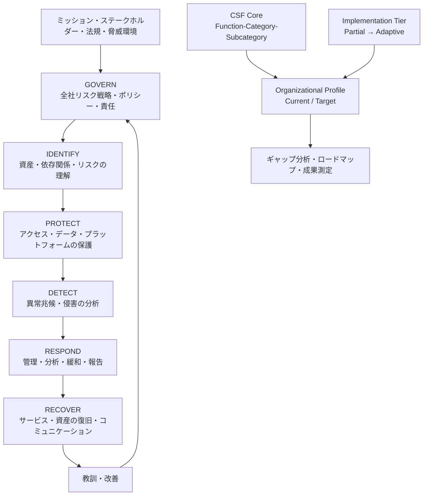
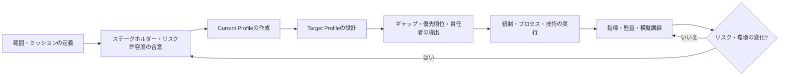

# NIST Cybersecurity Framework 2.0に基づくサイバーセキュリティリスク管理

## 1. 概要

> **定義**: NIST Cybersecurity Framework(CSF) 2.0とは、組織がサイバーセキュリティリスクを理解し、優先順位を定め、管理するための非規範的(outcome-based)なフレームワークである。

NIST CSFは、特定の製品、統制リストあるいは認証制度というより、組織が達成すべきサイバーセキュリティの成果(outcome)を共通言語として整理するリスク管理体系である。
したがって「ファイアウォールを設置したか」といった実装手段を直接指示するのではなく、「重要資産へのアクセスが管理されているか」といった成果を提示する。
組織は自らの規模、業種、規制、脅威水準、技術環境に合わせて、その成果を達成する方法を選択する。

CSF 2.0は2024年2月26日にNIST Cybersecurity White Paper 29として発行された。
このバージョンは既存の中核構造を拡張し、セキュリティ運用担当者だけでなく、経営陣、取締役会、調達・法務・人事・監査の担当者も利用できるよう汎用性を高めた。
特に、サイバーセキュリティをIT部門だけの技術的統制ではなく全社的リスク管理(ERM)の一部として扱い、GOVERN機能を最上位に追加した。

CSF 2.0の適用対象は、大企業や重要インフラ事業者に限定されない。
小規模組織、公的機関、製造業のOT、IoT、クラウド、モバイル、AIシステムなど、ICTを活用するあらゆる組織が、自らに必要な成果を選択できる。
これは、組織ごとに資産とリスク許容度が異なるため、単一の統制基準を強制すると形式的な準拠だけが残るという問題意識に基づいている。

技術士の答案では、CSFを「識別-防御-検知-対応-復旧」の循環としてだけ暗記するのでは不十分である。
CSF 2.0では、GOVERNが残る5つの機能の優先順位とリスク受容基準を定め、IDENTIFYが現在のリスクを把握し、PROTECT・DETECT・RESPOND・RECOVERが予防から改善までをつなぐという構造を説明しなければならない。
また、Core、Organizational Profile、Implementation Tierの関係と実際の実施手順を併せて提示してこそ、フレームワークを運用モデルとして解釈できる。

### 1.1 登場背景と必要性

デジタルサービスが業務の中核となるにつれ、サイバー事故の影響は情報漏えいにとどまらず、生産停止、安全事故、契約違反、評判の低下、株主価値の毀損へと拡大した。
クラウドとSaaS、外部委託開発、オープンソース、API、リモートワークが増えるにつれ、組織の境界はネットワーク内部に限定されなくなった。
このような環境でセキュリティを機器リストや部門別のチェックシートで管理すると、サプライヤーとサービスの連鎖関係、業務の重要度、復旧可能性を併せて判断することが難しい。

CSFは、経営陣が理解できるリスクの言語と、実務担当者が使えるセキュリティの成果を結び付ける。
例えば経営陣が「オンライン注文サービスの許容停止時間は30分」という業務目標を提示すれば、セキュリティ・インフラ組織はそれに基づいて認証強化、ログ収集、侵害検知、隔離と復旧検証の成果を設計できる。
この結び付きがあってこそ、投資コストを技術の流行ではなく、事業への影響と残留リスクによって説明できる。

### 1.2 中核的な特徴

第一に、CSFは成果中心である。
同じセキュリティ成果を達成する方法は、オンプレミスのSIEMでもマネージド検知・対応サービスでもあり得るため、組織の条件に合った技術選択が可能である。

第二に、CSFはリスクベースである。
すべての資産を同じ水準で保護する代わりに、ミッション、ステークホルダー、規制、脅威、リスク許容度を考慮して投資の順序を決める。

第三に、CSFはライフサイクル型である。
防御統制だけを強化するのではなく、検知、インシデント対応、サービス復旧、事後改善までを含め、予防の失敗を前提としてレジリエンスを管理する。

第四に、CSFはマッピング可能な共通言語である。
ISO/IEC 27001、NIST SP 800-53、CIS Controls、業界別規程などとの関係をInformative Referencesで結び付けることができるが、そのマッピング自体がCSF Coreの必須統制や認証を意味するわけではない。

## 2. CSF 2.0の全体構造と概念図

CSF 2.0は、CSF Core、Organizational Profiles、Implementation Tiers、補助資料で構成される。
Coreは「何を達成するか」を、Profileは「自組織の現在と目標の状態は何か」を、Tierは「リスク管理慣行の厳格さと統合の水準はどの程度か」を表現する。
これら3要素を分離することで、共通基準と組織別の実行計画を混同せずに管理できる。

### 2.1 CSF Core

CSF Coreは、Function、Category、Subcategoryの階層でサイバーセキュリティの成果を分類する。
Functionは最も高いレベルの視点であり、Categoryは関連する成果のまとまりであり、Subcategoryは評価と設計で使用できる具体的な成果記述である。
階層があるからといって、実際の実行順序や重要度の順序を意味するわけではない。

Coreの成果は、チェックリストのすべての項目を漏れなく実施せよという命令ではない。
組織は事業目的とリスクプロファイルに応じて必要な成果を選択し、その成果を達成する活動と責任者を定義する。
したがって同じSubcategoryを選択しても、銀行は取引の完全性と規制報告を、製造業者は生産の安全とOTの可用性をより強く設計することができる。

### 2.2 Organizational Profile

Organizational Profileは、特定組織のCSF Core成果に関する現在(Current)の状態と目標(Target)の状態を記述する。
Current Profileは現在達成している成果と達成方法を表現し、Target Profileは戦略の変化、新技術、規制、脅威インテリジェンスまで考慮して望ましい状態を表現する。

Profileは単なる文書ではなく、ギャップ分析のベースラインである。
CurrentとTargetを比較すれば、未達の成果、前提条件、責任者、投資コスト、目標スケジュールを導き出すことができる。
例えばTargetが「重要APIのすべての認証イベントを集中分析する」であれば、現在のログの欠落とサービスごとのフォーマットの違いをギャップとして記録し、収集・標準化・検知ルールのロードマップにつなげる。

### 2.3 Implementation Tier

Implementation Tierは、組織のサイバーセキュリティリスク管理の慣行が事業ニーズとどれだけ結び付いているか、全社的リスク管理とどれだけ統合されているかを説明する。
Tierはセキュリティ統制の数や製品価格を評価する等級ではなく、組織の運用特性と意思決定の方式を表現するコンテキスト情報である。

| Tier | 名称 | 中核的な運用特性 |
|---|---|---|
| Tier 1 | Partial | リスク管理が非公式・場当たり的であり、組織全体で一貫していない。 |
| Tier 2 | Risk Informed | リスク情報を活用するが、全社のポリシー・プロセスとの統合は限定的である。 |
| Tier 3 | Repeatable | ポリシーと手順が公式化され、反復可能であり、組織全体で運用される。 |
| Tier 4 | Adaptive | 変化する脅威と事業環境を予測し、継続的に改善する。 |

Tier 1の組織が必ずしもTier 4を目標にしなければならないわけではない。
小規模組織が中核資産について一貫したリスク評価と復旧を行うTier 2~3の水準を確保することのほうが、手に負えない高度化目標を掲げて運用が止まってしまうよりも合理的な場合がある。
逆に金融取引プラットフォームのように障害・侵害の波及効果が大きい組織は、検知と対応データのリアルタイム性、サプライチェーンの統合、適応的な改善を目標にTier 4の要素を選択できる。

## 3. 6つのFunctionの原理と適用

### 3.1 GOVERN(GV): ガバナンス

GOVERNはCSF 2.0で新たに前面に配置された機能であり、組織のサイバーセキュリティリスク管理の戦略・期待水準・ポリシーを策定し、伝達し、モニタリングする。
組織のミッション、ステークホルダー、法令・規制・契約、リスク選好とリスク許容度を反映し、残る5つの機能の優先順位を定める。

GOVERNの核心は、セキュリティチームがすべてのリスクを単独で決定しないよう、責任と権限を明確にすることである。
取締役会や経営陣はリスク受容の可否と予算を決定し、CISOまたはセキュリティ責任者はポリシーとプログラムを運用し、システムオーナーは資産ごとのリスクと例外に責任を持つというように役割を分担する。

サプライチェーンリスクもGOVERNで扱うべきである。
外部のクラウド、SaaS、開発業者、オープンソース、AIサービスが中核機能を担っているのであれば、サプライヤーのセキュリティ要件、インシデント通知、脆弱性対応、契約終了とデータ返却の条件を調達・契約・運用に含めなければならない。
サプライヤーのセキュリティ評価を契約締結時に一度だけ行って終わらせると、サービスの変更や合併・買収、下請けサプライヤーの変化に対応できないため、定期的なモニタリングが必要である。

### 3.2 IDENTIFY(ID): 資産とリスクの理解

IDENTIFYは、組織のデータ、ハードウェア、ソフトウェア、システム、施設、サービス、人員、サプライヤーを把握し、関連するサイバーセキュリティリスクを理解する機能である。
資産の識別は単なるCMDBのリスト作成ではなく、資産が提供する業務サービス、データフロー、依存関係、オーナー、攻撃対象領域、復旧優先順位を結び付ける作業でなければならない。

資産リストにない資産は統制対象から漏れる。
例えば開発者が個人のクラウドストレージにソースコードをコピーしたり、事業部門が承認なしにSaaSを購入したりすると、公式の資産台帳と実際の攻撃対象領域との間にシャドーITが生じる。
したがって、ネットワーク・クラウド・SaaS・コードリポジトリ・エンドポイントの自動検出結果をオーナー確認と結び付け、新規資産と廃棄資産の状態変化を追跡しなければならない。

リスク評価は、資産の価値、脅威の可能性、脆弱性、露出と影響の組み合わせで行う。
例えば顧客認証APIは外部への露出と個人情報への影響が大きいため、一般的な社内Wikiよりも強力な認証、ロギング、レート制限、復旧テストの対象となる。
このとき点数だけを算出すると優先順位の根拠が弱くなるため、業務停止時間、影響を受ける顧客数、法的義務、サプライヤーへの依存度を併せて記述する。

### 3.3 PROTECT(PR): 防御措置

PROTECTは、識別されたリスクを低減するための防御措置を講じる機能である。
主な範囲には、アイデンティティ管理・認証・アクセス制御、意識向上・トレーニング、データセキュリティ、プラットフォームセキュリティ、技術インフラのレジリエンスが含まれる。

アクセス制御は、アカウントを作成して権限を付与する手続きだけを意味するのではない。
ユーザー・サービス・機器のアイデンティティを確認して最小権限を適用し、特権を別途承認・記録し、職務変更・退職・サービス終了時には権限を回収しなければならない。
パスキーやフィッシング耐性のあるMFAを導入しても、アカウント復旧や緊急用アカウントが迂回路にならないよう、同じ水準の統制を設計すべきである。

データ保護では、保存時・転送時の暗号化、鍵管理、バックアップ、保存・廃棄、完全性検証、アクセス記録を併せて考慮する。
暗号化だけでデータ漏えいのリスクが消えるわけではなく、アプリケーションログに平文の個人情報が残ったり、バックアップアカウントが奪取されたりすれば、防御措置は無力化される。
分類等級とデータフローに応じて、マスキング、トークン化、DLP、保存期間、廃棄証跡を組み合わせることが望ましい。

プラットフォームセキュリティとは、OS・コンテナ・ミドルウェア・クラウド設定・ソフトウェアサプライチェーンの安全な構成と変更管理である。
標準イメージとInfrastructure as Codeを使用すれば、同一の設定を繰り返し適用でき、ポリシー違反をデプロイ前に遮断できる。
ただし、自動化されたデプロイは誤ったポリシーを大規模に拡散させる可能性もあるため、承認、検証、段階的デプロイ、ロールバックを併せて用意しなければならない。

### 3.4 DETECT(DE): 検知と分析

DETECTは、攻撃と侵害の可能性を示す異常兆候、侵害指標(IoC)、有害イベントを適時に発見・分析する機能である。
検知の品質は単にログを大量に集めることで決まるのではなく、重要資産に必要なテレメトリと検知仮説を定義することで決まる。

例えば、管理者アカウントの普段と異なる国からのログイン、大量のトークン発行、異常なAPI呼び出し量、バックアップ削除と暗号化処理の連鎖は、ランサムウェアやアカウント乗っ取りの検知仮説となり得る。
イベントには時刻、主体、対象、行為、結果、相関キーが含まれていてこそ分析が可能であり、時刻同期と保存期間が不十分であればフォレンジック上の価値が下がる。

検知は誤検知と見逃しのバランスの問題である。
すべてのイベントをアラートにすると分析チームが疲弊して重要なシグナルを見逃す可能性があるため、資産の重要度、攻撃段階、信頼度、潜在的影響を反映して優先順位を定める。
アラートの精度だけでなく、検知後の分析にかかる時間と、実際の対応につながる割合も運用指標として管理する。

### 3.5 RESPOND(RS): インシデント対応

RESPONDは、インシデントが検知された後に影響を封じ込め、原因を分析し、緩和・報告・コミュニケーションを行う機能である。
インシデント対応計画には、宣言基準、指揮系統、証拠保全、隔離の権限、顧客・規制当局・捜査機関への通知、復旧への引き継ぎ条件を含める。

初期段階では、完全な原因究明よりも拡散防止が重要な場合がある。
例えばアカウント乗っ取りが疑われる場合は、トークンの失効とセッションの終了を先に行い、悪意あるIPの遮断とサービスの隔離を実施した後にフォレンジック分析を進める。
しかし、性急なシステムの再設定やログの削除は証拠を毀損する可能性があるため、事前に承認されたプレイブックとデジタル証拠の手続きが必要である。

インシデントのコミュニケーションでは、技術的事実、法的義務、顧客の信頼を併せて考慮する。
確認されていない原因を断定せず、現在の影響、暫定措置、次回の更新時期を一貫して伝えるべきであり、サプライヤー起因のインシデントの場合も、契約上の通知と共同対応の役割を明確にしなければならない。

### 3.6 RECOVER(RC): 復旧と改善

RECOVERは、インシデントによって影響を受けた資産と運用を復元し、正常なサービスに戻る機能である。
復旧の核心は、バックアップファイルを持っているかどうかよりも、信頼できる状態で定められた時間内にサービスを再開できるかどうかである。

業務影響分析(BIA)によって、サービスごとのRTOとRPO、復旧優先順位、意思決定権を定義する。
バックアップは運用アカウントから分離し、変更不可(イミュータブル)・オフラインのコピーを考慮し、実際の復旧テストを通じてバックアップの完全性、アプリケーションの依存関係、鍵と証明書の可用性を確認する。
ランサムウェアの状況で感染したバックアップを復元すると再感染するため、復旧前のマルウェア検査とクリーンなベースラインの検証が必要である。

復旧が完了したら事案をクローズするのではなく、教訓をCurrent ProfileとTarget Profileに反映する。
検知ルールの漏れ、サプライヤー連絡先の誤り、過剰な権限、復旧手順のボトルネックを改善バックログに登録し、次の模擬訓練や実際の変更で効果を確認してこそ継続的改善となる。

## 4. 実行手順と運用成果物

### 4.1 適用ロードマップ

最初の段階は範囲を定めることである。
全社全体を一度に定めようとせず、顧客認証・決済・生産制御・中核データのようにミッションへの影響が大きいサービスから境界を設定する。
範囲には、関連するクラウドアカウント、サプライヤー、ユーザー、データフロー、相互依存するサービスを含める。

第二に、GOVERNの観点から経営目標とリスク許容度を確定する。
「無条件のセキュリティ強化」ではなく、許容可能なサービス停止時間、個人情報への影響、規制違反のリスク、投資の制約について合意してこそ、Target Profileの優先順位が現実的なものとなる。

第三に、Current Profileを作成する。
資産台帳、脆弱性、IAM、バックアップ、ログ、インシデント記録、サプライヤー評価、監査資料を証拠として活用し、文書があるからといって成果が達成されたとはみなさない。
運用サンプル、設定の照会、インタビュー、模擬訓練の結果によって、実際に実施されているかどうかを確認する。

第四に、Target Profileとギャップを定義する。
すべての成果を同時に達成しようとせず、影響度・実現可能性・依存関係・規制期限を基準に優先順位を定める。
例えば、重要サービスの管理者MFAとイミュータブルバックアップを先に確保した後、詳細な検知の自動化とサプライチェーンのテレメトリを拡張することができる。

第五に、実行と測定を繰り返す。
ポリシー改訂、設計変更、ツール導入、教育、模擬訓練を、責任者と期限のある実施項目に分解し、経営陣に残留リスクと推移を報告する。
新しいサービス、インシデント、規制や脅威の変化が生じれば、ProfileとTierの判断を更新する。

### 4.2 主な成果物

| 段階 | 代表的な成果物 | 技術士の観点での確認質問 |
|---|---|---|
| 範囲設定 | サービスマップ、資産・データフロー、ステークホルダー一覧 | 何が停止したらミッションが失敗するか? |
| ガバナンス | リスク選好、ポリシー、RACI、サプライチェーン要件 | 誰がリスクを受容し、誰が予算を決定するか? |
| 現状診断 | Current Profile、証拠リスト、成熟度・ギャップ評価 | 文書ではなく実際の成果をどう証明するか? |
| 目標設計 | Target Profile、優先順位、ロードマップ | 規制・脅威・事業の変化が目標に反映されているか? |
| 実行 | 統制の実装、プレイブック、教育・訓練 | 予防に失敗した場合に検知・対応・復旧がつながるか? |
| 改善 | 指標、監査、インシデントの教訓、改善バックログ | 測定結果が次の投資と設計に反映されるか? |

## 5. 比較および連携

### 5.1 CSF 1.1とCSF 2.0

CSF 2.0は、既存の5つの機能の単なる名称変更ではなく、適用範囲とガバナンスの視点を拡張した改訂である。
従来のIdentify-Protect-Detect-Respond-Recoverの流れは維持されるが、GOVERNが追加され、全社的リスク管理とサプライチェーン・ポリシー・責任を明示的に調整する。

CSF 2.0は、成果の順序を固定された実行順序として解釈しないよう注意を促している。
現実の組織は、インシデント対応を通じて識別情報を更新し、復旧の教訓によってガバナンスのポリシーを変え、防御と検知を同時に改善する。
したがって試験の答案では、循環的・同時的・継続的な機能である点を強調するのが適切である。

| 区分 | CSF 1.1 | CSF 2.0 | 実務上の意味 |
|---|---|---|---|
| 主な対象 | 重要インフラの改善に強く焦点 | 産業・政府・学界・非営利など汎用 | 中小組織と非ITのステークホルダーまで拡張 |
| 最上位機能 | Identify, Protect, Detect, Respond, Recover | Governを含む6つのFunction | ERM・責任・ポリシーをセキュリティ運用と結び付け |
| Profile | Current/Target中心 | Organizational Profileへ拡張 | プロファイルの目的とステークホルダーとのコミュニケーションを明確化 |
| 実装コンテキスト | Implementation Tierを提供 | Tierのリスク管理統合の視点を強化 | 技術成熟度と混同しない |
| 補助資料 | マッピング・事例中心 | Quick-Start、Community Profile、Examplesなど | 利用者の目標に合わせた適用経路を提供 |

CSF 2.0へ移行する際、既存の資産と統制を廃棄して新しい体系をゼロから作る必要はない。
現行のCSF 1.1プロファイルと統制の証拠を保存したうえで、GOVERNの成果と新しいCategory、変更されたID・PR・RS・RCの位置をマッピングし、組織のリスク管理会議体につなげる方式が、コストと混乱を減らす。

### 5.2 CSFとISO/IEC 27001・NIST RMF

CSFとISO/IEC 27001はいずれもリスクベースのセキュリティを支援するが、目的と成果物が異なる。
CSFは成果を共通言語として整理し、現在と目標のギャップを伝えやすくする一方、ISO/IEC 27001は情報セキュリティマネジメントシステム(ISMS)の確立・運用・改善と認証というマネジメントシステムの要求事項に焦点を当てる。
そのため、CSFでリスクの優先順位と経営陣とのコミュニケーションを定め、ISO/IEC 27001のマネジメントシステムと管理策で実行するという相互補完が可能である。

NIST RMFは、システムのライフサイクルにおいてCategorize、Select、Implement、Assess、Authorize、Monitorを実施するリスク管理プロセスである。
CSFが「どのようなセキュリティ成果を達成するか」を上位レベルで示すとすれば、RMFはシステムごとのセキュリティ・プライバシー要件を選択し、評価・承認・モニタリングする手順をより具体化する。
両者を組み合わせれば、全社のTarget Profileから中核システムのセキュリティ要件と承認証拠へと降りていくトレーサビリティが向上する。

## 6. 事例: クラウドベースの決済サービスへのCSF適用

以下は特定の企業を指すものではない仮想事例である。
月間取引量の多いオンライン決済サービスがマルチクラウドと外部の認証・メッセージングサプライヤーを利用しており、目標は、セキュリティインシデントが発生しても決済の中核機能を30分以内に限定的に再開することである。

まずGOVERNで、決済サービスオーナー、CISO、法務、クラウド運用担当者、サプライヤー担当者のRACIを定める。
法的届出と顧客通知の条件、リスク受容権限者、サプライヤーのインシデント通知時間、緊急隔離の権限を、契約と内部ポリシーに反映する。

IDENTIFYでは、決済API、トークン化ストレージ、鍵管理サービス、注文DB、管理コンソールと外部サプライヤーとの間のデータフローを描く。
資産ごとに、オーナー、個人情報の有無、外部への露出、最大許容停止時間、復旧の依存関係、ログの所在を記載する。

PROTECTでは、管理者アカウントとサービスアカウントにフィッシング耐性のあるMFAと最小権限を適用し、決済データはトークン化と鍵の分離で保護する。
デプロイパイプラインはコードレビュー、イメージ署名、脆弱性検査、承認済みアーティファクトのポリシーを経由し、イミュータブルバックアップと別途の復旧用アカウントを運用する。

DETECTでは、管理者ログインの異常、大量の決済失敗、異常なトークン発行、バックアップの削除と権限昇格を主要な検知仮説とする。
APIゲートウェイ、クラウド監査ログ、IAM、DB監査ログを共通の時間軸と取引識別子で結び付け、1人のユーザーの行為を追跡する。

RESPONDでは、アカウント乗っ取りと決済改ざんを別々のシナリオとして区別する。
アカウント乗っ取りが疑われる場合はセッションとトークンを失効させ、決済改ざんが疑われる場合は高リスク取引を一時保留し、サプライヤーと法務・顧客対応チームに事前定義されたメッセージを伝達する。

RECOVERでは、クリーンなイメージとバックアップの完全性を確認した後、読み取り専用の照会、決済承認、精算の順にサービスを部分的に再開する。
復旧テストで鍵へのアクセスやDNSの切り替えがボトルネックとして判明すれば、それを改善バックログに登録し、Target Profileを更新する。

この事例の核心は、ツールを大量に購入することではない。
業務目標である30分以内の復旧と取引の完全性を、CSFの成果、責任、技術的統制、訓練、測定指標へと結び付けた点が重要である。
試験では、各Functionごとに成果物と統制の例を提示し、サプライヤー・規制・復旧まで途切れなく結び付ければ、完成度の高い答案となる。

## 7. 深掘り: クラウド・AI・サプライチェーン環境への拡張

CSF 2.0はITだけに縛られず、クラウド、OT、IoT、モバイル、AIシステムにも適用される成果構造を提示している。
AIシステムでは、モデルそのものだけでなく、学習データ、プロンプト・検索ソース、モデル提供者、推論インフラ、出力の利用者、評価データのライフサイクルを、資産と依存関係として識別しなければならない。

AIサプライヤーや外部モデルを利用する場合、GOVERNで利用目的と禁止用途、データの持ち出し、責任分界、変更通知の条件を決定する。
IDENTIFYではモデル・データ・ツール呼び出し・権限・出力のフローを資産マップとして作成し、PROTECTでは機密情報の入力防止、アクセス権限、モデル・パッケージの出所検証を適用する。
DETECT・RESPONDでは、プロンプトインジェクション、データ漏えい、ツールの悪用、モデル性能の劣化を検知し、遮断・ロールバック・人間によるレビューで対応する。

ソフトウェアサプライチェーンは、組織の境界外での変更がサービスのリスクにつながる代表的な領域である。
ソースリポジトリ、ビルドランナー、パッケージレジストリ、コンテナイメージ、デプロイ環境の信頼関係を識別し、ビルドの来歴(provenance)、署名、SBOM、脆弱性対応、サプライヤーからの通知を組み合わせなければならない。
単一のSBOMの提出だけでサプライチェーンの安全が保証されるわけではなく、実際のビルド成果物とデプロイ成果物の連結性と検証可能性が重要である。

CSFの非規範性は長所であると同時に運用上の難しさでもある。
組織が成果の文言をコピーするだけでは実行責任と検証基準が空白になるため、各Subcategoryに担当者・証拠・測定式・目標水準・例外承認・再検討周期を付与して管理しなければならない。
例えば「重要資産の脆弱性を管理する」を、週次の重要度評価、期限内の対応率、例外の失効率、再発率として具体化すべきである。

## 8. 考慮事項および示唆

### 8.1 技術士の観点での適用戦略

1. **ガバナンスと技術を分離しない。** GOVERNで決定したリスク選好とサービスの重要度が、IAM、ロギング、バックアップといった技術的な優先順位へと降りていくよう、トレーサビリティを構築する。

2. **Profileを生きたベースラインとして運用する。** CurrentとTargetを文書保管用に作るのではなく、資産の変化、新規クラウド、インシデント、監査結果と結び付けて定期的に更新する。

3. **Tierを成熟度スコアと誤解しない。** Tier 4が常に優れているのではなく、事業への影響とコスト・人員・リスク許容度に見合った運用慣行であるかを判断しなければならない。

4. **予防統制とレジリエンスにバランスよく投資する。** 攻撃を100%防ぐという前提の代わりに、高品質な検知、迅速な隔離、クリーンなバックアップと復旧訓練によって残留リスクを下げる。

5. **サプライチェーンと第三者アクセスを同一のリスク体系に組み込む。** 契約評価、技術検証、継続的モニタリング、インシデント通知と契約終了の戦略を、切り離された購買チェックリストとして扱わない。

6. **成果指標は活動量よりもリスク低減を測定する。** 教育回数やパッチ件数だけを報告するのではなく、重要資産のカバレッジ、平均検知・対応時間、復旧成功率、インシデント再発率、残留リスクを併せて見る。

7. **証拠中心で監査可能性を確保する。** ポリシーの文言、設定のスナップショット、アクセス承認、ログ、訓練結果、復旧リハーサル、例外承認に、識別子と保存期間を付与する。

8. **業界・規制のフレームワークとマッピングしつつ、重複する統制を減らす。** CSF、ISO/IEC 27001、個人情報保護の要件、クラウド基準を統制カタログに統合し、1つの証拠が複数の要件を満たすよう設計する。

### 8.2 限界と補完

CSFは組織が達成すべき成果と適用の方向性を示すが、具体的な製品、最低限のセキュリティ水準、すべての法的義務を代わりに決定するものではない。
したがって組織は、業界規制、契約、個人情報保護、安全、輸出管理といった別途の義務を識別し、CSFの成果にマッピングしなければならない。

また、Profileの作成はステークホルダーの合意を要する社会的なプロセスである。
経営陣がリスク選好を定めなかったり、資産オーナーが不明確であったりすると、技術チームが恣意的なスコアを付けることになり、ギャップ分析が予算争いに変質しかねない。
その場合は、重要なサービスから小規模なパイロットを実施し、実際のインシデントシナリオとコストを根拠に合意を広げていくことが現実的である。

## 参考資料

- NIST, *The NIST Cybersecurity Framework (CSF) 2.0* (NIST CSWP 29, 2024-02-26): https://nvlpubs.nist.gov/nistpubs/CSWP/NIST.CSWP.29.pdf
- NIST, *Cybersecurity Framework 2.0*: https://www.nist.gov/cyberframework
- NIST, *Cybersecurity Framework Frequently Asked Questions*: https://www.nist.gov/cyberframework/faqs
- NIST, *CSF 2.0 Resource & Overview Guide* (SP 1299): https://nvlpubs.nist.gov/nistpubs/SpecialPublications/NIST.SP.1299.pdf

---

> **一言まとめ**: NIST CSF 2.0は、GOVERNで全社のリスクを整合させ、IDENTIFY→PROTECT→DETECT→RESPOND→RECOVERの成果をProfile・Tier・指標で運用することにより、サイバーセキュリティを継続的に改善する共通フレームワークである。
