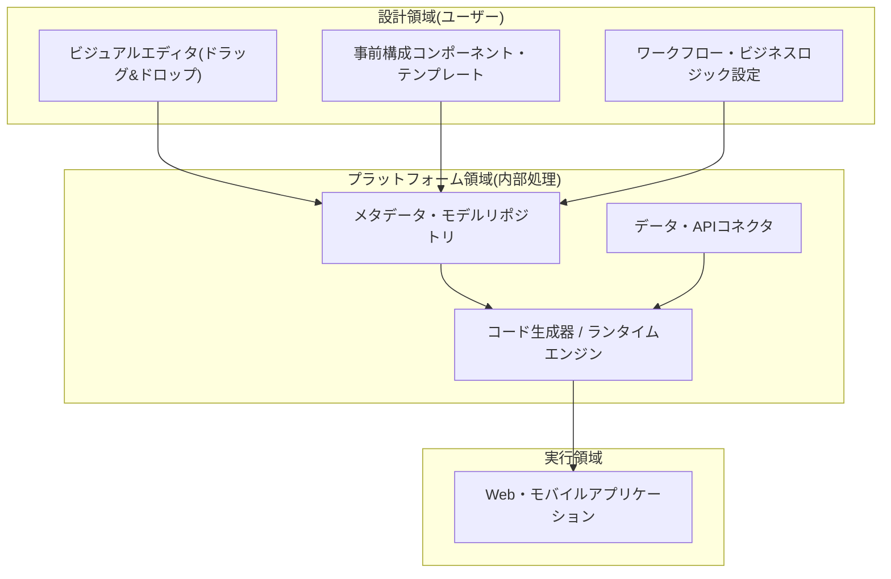
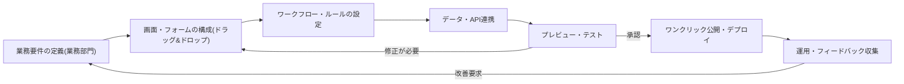

# ノーコード(No-Code)

## 1. 概要

### A. 定義
> **ノーコード(No-Code)** とは、プログラミングコードを直接記述せず、**視覚的なGUI(ドラッグ&ドロップ)と事前構成されたコンポーネント・テンプレート** だけでアプリケーションを開発する方式であり、開発者ではない業務部門のユーザー(市民開発者)でもソフトウェアを作れるようにする開発パラダイムである。

ノーコードの本質は、ソフトウェア開発の **民主化(Democratization)** である。かつてアプリ制作は、プログラミング言語と実行環境を扱える開発者だけの領域であった。ノーコードは「コーディング」という参入障壁を「視覚的な操作」に置き換えることで、業務を最もよく知る現場の担当者が、自ら必要なツールを作れるようにする。これは、IT部門に開発依頼が溜まり数か月待たなければならなかったボトルネックを解消し、ビジネスのアイデアが即座に実行へとつながるスピードを生み出す。

ノーコードを成り立たせる技術的原理は、**抽象化レイヤーの上方移動** である。アセンブリから高水準言語へ、さらにフレームワークへと抽象化レベルが上がってきた流れの延長線上で、ノーコードは「コード」という表現手段そのものを視覚的なメタモデルへとさらに一段引き上げたものである。ユーザーが画面上でフォームやボタンを配置してルールを設定すると、プラットフォーム内部のランタイム・コード生成器がそれを実際に実行可能なアプリケーション(Web/モバイル)へと変換する。つまりコードが消えたのではなくプラットフォームの背後に隠されたのであり、この点がノーコードの長所(生産性)と限界(プラットフォーム依存・不透明性)を同時に規定している。例えば、マーケティング担当者が開発者の助けなしにキャンペーン申込フォームと承認ワークフローを自ら作るといった具合である。

### B. 登場背景および必要性
ノーコード台頭の背景には、明確な需給の不均衡がある。一方ではデジタルトランスフォーメーション(DX)の需要が急増し、企業ごとに必要な社内アプリ・自動化が急増しているのに、他方では熟練開発者が慢性的に不足している。増え続けるソフトウェア需要を少数の開発者では賄えなくなると、「コーディングなしの開発」によって開発の担い手そのものを業務部門へ拡張しようとする圧力が高まった。Gartnerなどは、今後の新規アプリケーション開発の相当部分がローコード・ノーコード方式で行われると予測してきたが、具体的な数値は調査機関・時点ごとに異なるため、一般化して理解するのが適切である。

また、クラウド(SaaS)の普及がノーコードを後押しした。インフラ・デプロイをプラットフォームが代行してくれるため、ユーザーはサーバやデプロイパイプラインを知らなくても、ブラウザで作ってすぐに公開できる。結局ノーコードは、「開発者不足」という供給制約と「即時性の要求」という需要特性がクラウドの上で出会って形成された流れである。

## 2. ノーコードプラットフォームのアーキテクチャと構成要素

ノーコードプラットフォームは、表向きは単純なエディタであるが、内部的にはユーザーの視覚的な操作を実行可能なアプリへと変換する複数のレイヤーで構成されている。各構成要素の役割を原理中心に見ると、次のとおりである。

**ビジュアルエディタ(Visual Editor)** は、ユーザーが画面レイアウトをドラッグ&ドロップで構成する入口である。エディタはユーザーの操作をコードではなく **メタデータ(宣言的モデル)** として記録する。「ここにフォーム、その下に送信ボタン、クリック時に保存」といった意図は内部的にはJSON/モデル形式で保存され、この宣言的な表現がノーコードの移植性と自動化を可能にする基盤となる。エディタの完成度が、そのままプラットフォームの表現力を左右する。

**事前構成コンポーネント・テンプレート(Pre-built Components)** は、ボタン・フォーム・チャート・テーブルのような検証済みのUI部品と、特定業務(在庫管理・アンケート・CRM)向けの完成型テンプレートの集合である。ユーザーはゼロから作らずにこれらの部品を組み立てるため開発速度が上がるが、逆に提供された部品の範囲を超える要求は実装が難しくなる。この「組み立て式」という特性が、ノーコードの生産性と柔軟性の限界を同時に生み出している。

**ワークフロー・ロジックエンジン(Workflow Engine)** は、条件分岐・自動化・承認フローといったビジネスロジックを視覚的に定義する部分である。「フォーム送信時に管理者へ通知 → 承認されたら次の段階へ」といったルールをルールベース(rule-based)で表現し、これが単なる画面作成を超えて実際の業務自動化を可能にする。ロジックが複雑になるほど視覚的な表現がかえって難解になるという「逆説」が存在し、この点でノーコードの適正な適用範囲が分かれる。

**データ・APIコネクタ(Connectors)** は、内蔵データベースと外部のSaaS・APIを接続し、データの読み書きを可能にする。コネクタの多様性がプラットフォームの実用性を決定するが、提供されていないシステムと連携するには、結局カスタムコードが必要になる場合が多い。最後に、**ランタイム・デプロイエンジン** がメタデータを実際の実行アプリへと変換・公開する。

以下は、ノーコードで1つの業務アプリを作る実際の進行手順(プロセス詳細図)である。要件定義から公開・運用までが、従来の開発よりも短いフィードバックループで繰り返されるのが特徴である。

この手順で注目すべき点は、**業務部門が要件定義と検証の主体として直接参加する** ことである。従来の開発では、業務部門が要件を文書で伝え、開発者が解釈・実装し、再び業務部門が確認する過程で、意味の損失と待ち時間が発生する。ノーコードでは要件を持つ人がそのまま作る人になるため、この往復による損失を解消する。ただしこの構造は裏を返せば、ソフトウェア工学の正式な検証(テスト・コードレビュー・セキュリティ点検)の手順が省略されやすいというリスクを内包しているため、後述するガバナンスの議論が重要となる。

## 3. ノーコードとローコードの比較

ノーコードとしばしば併せて言及されるローコード(Low-Code)は、一見似ているが、対象ユーザーと柔軟性において明確に異なる。ノーコードは **コーディングが完全になく、非開発者(業務部門)を対象** とし、定型化された範囲内で動作するのに対し、ローコードは **最小限のコーディングを許容し、開発者・準開発者がより複雑で柔軟なアプリ** を作れるようにする。

この違いが生じる根本的な理由は、「エスケープハッチ(escape hatch)の有無」である。ローコードは視覚的開発を基本としつつ、プラットフォームがカバーできない部分でコードを直接挿入する余地を残している。その結果、ローコードは基幹系に近い複雑な要求まで拡張可能であるが、開発の知識が必要となる。ノーコードはこのエスケープハッチを閉じて単純さとアクセシビリティを最大化する代わりに、表現範囲を自ら制限している。実務上の含意は明確である。ユーザーのIT能力と要求の複雑さに応じて両者を選択すべきであり、実際に多くの商用プラットフォームは両方の性格をスペクトラムとして併せて提供している。

| 区分 | ノーコード(No-Code) | ローコード(Low-Code) |
|---|---|---|
| **対象ユーザー** | 非開発者(業務部門、市民開発者) | 開発者・準開発者(IT部門) |
| **コーディング** | なし(完全に視覚的) | 最小限のコーディングを併用(拡張可能) |
| **柔軟性** | 低い(定型範囲内) | 高い(カスタマイズ・連携) |
| **適した領域** | 単純なフォーム・業務自動化・プロトタイプ | 中程度の複雑さの業務・基幹系の補助 |
| **トレードオフ** | アクセシビリティ↑ / 表現力↓ | 表現力↑ / 学習曲線↑ |

## 4. 長所・短所の詳細分析と適用事例

ノーコードの長所は明確である。第一に、開発速度が速い。アイデアからデプロイまでが数日以内に短縮され、特にプロトタイピング・MVP検証に強力である。第二に、開発者への依存とコストが減り、ITバックログのボトルネックが緩和される。第三に、業務部門が直接主導するため要求と結果のギャップが小さく、「要件伝達 → 開発 → 再確認」の繰り返しによる損失が減る。

しかし、限界も構造的である。定型化された枠組みの中でしか動作しないため、複雑なシステムや大規模・高性能が求められるシステムには不向きであり、きめ細かなカスタマイズが難しい。また、特定プラットフォームに **依存(Vendor Lock-in)** して移行が困難になり、料金・ポリシーの変更に脆弱である。何よりも、IT部門の統制外でアプリが増える **シャドーIT(Shadow IT)** と、それに伴うデータ・セキュリティ・ガバナンスのリスクが大きくなる。性能・拡張性の面でも、プラットフォームの抽象化レイヤーのオーバーヘッドにより、大量トラフィックの処理に限界がある可能性がある。

**具体的な事例を挙げると**、⑴ スタートアップがコーディングなしにノーコードのアプリビルダーで初期サービスのプロトタイプを作り、資金調達・市場検証に活用する事例、⑵ 大企業の業務部門がスプレッドシートで管理していた在庫・依頼処理をノーコードのワークフローツールに移行し、承認リードタイムを大幅に短縮する事例、⑶ 非営利団体・公共機関がアンケート・申請受付フォームを即座に作成してキャンペーンに対応する事例が代表的である。共通点は、「定型業務の即時自動化」というノーコードの強みの領域に該当することである。逆に、リアルタイムで大量の取引を処理する中核の決済・基幹系システムをノーコードだけで構築しようとして、性能・柔軟性の限界に突き当たるのは典型的な誤適用である。

| 区分 | 内容 |
|---|---|
| **長所** | 迅速な開発・デプロイ、開発者依存↓、コスト削減、業務部門主導、低い参入障壁 |
| **短所** | 複雑・大規模には不向き、カスタマイズの限界、ベンダー依存、シャドーIT・セキュリティ・ガバナンスの懸念、性能の限界 |

## 5. 深掘り — 生成AIとの結合と市民開発のガバナンス

ノーコードは最近、**生成AIと結び付く** ことでさらに一段進化している。従来のノーコードが「ドラッグ&ドロップ」であるとすれば、AI結合型は自然言語で「こういうアプリを作って」と指示すると、画面・データモデル・ワークフローの草案を自動生成する方向へ進んでいる。これは開発の民主化を加速させると同時に、生成結果の正確性・セキュリティを人間が検証しなければならないという新たな課題を生む。AIが作ったアプリには意図しないデータアクセスや誤ったロジックが含まれる可能性があるため、「生成は容易になったが、検証の責任は残る」という点が核心である。

また、**市民開発者(Citizen Developer)の台頭** は、組織にガバナンスの課題をもたらす。業務部門が作るアプリが増えると、統制されないシャドーITとデータ漏えい・規程違反のリスクが大きくなる。そのため成熟した企業は、ノーコードを禁止する代わりに、ITが承認済みのプラットフォーム・コネクタ・データアクセス範囲を定め、その囲いの中で業務部門が自由に作れるようにする **ガードレール型ガバナンス** を採用している。これは統制と自律のバランスを取る実務的な解決策であり、ノーコード普及期の中核的な管理課題である。

## 6. 考慮事項および示唆(技術士の観点)

1. **適用範囲の明確な区分(適材適所戦略)。** ノーコードは定型業務の自動化・プロトタイピング・社内ツールには効率的であるが、高性能・高可用性・複雑なロジックが必要な中核基幹系は、従来の開発またはローコードと併用するのが安全である。「何をノーコードで、何をコードで」というポートフォリオ判断が先行すべきである。

2. **シャドーITの統制とITガバナンスへの組み込み。** 業務部門主導の開発が増えるほどデータ・セキュリティ・コンプライアンスのリスクが大きくなるため、承認済みプラットフォーム・データアクセスポリシー・監査体制を備えたガードレール型ガバナンスによって、自律と統制を同時に確保すべきである。

3. **ベンダー依存(Lock-in)と出口戦略(トレードオフ)。** 特定プラットフォームへの依存はコスト・ポリシーのリスクにつながるため、データ標準・エクスポート(export)の可否・移行経路を事前に確認し、依存を許容できる水準を判断すべきである。

4. **性能・拡張性・技術的負債の観点。** 成長によってトラフィック・複雑さが増すと、ノーコードの抽象化の限界がボトルネックとなり得るため、規模拡大時の従来型開発への移行(再作成)シナリオを事前に設計しておくことが望ましい。

5. **人材・能力戦略(組織の観点)。** ノーコードは開発者を置き換えるというより、開発者を反復作業から解放して高付加価値領域に集中させるツールと見るのが妥当である。市民開発者の教育と、ITの支援者(enabler)としての役割の再定義が、導入成功の鍵である。

6. **品質・セキュリティ検証体制の補完。** ノーコードは正式な開発ライフサイクルのテスト・コードレビュー・セキュリティ点検を迂回しやすいため、承認前レビュー・権限の最小化・機微情報の取り扱いガイドといった最低限の品質ゲートをプラットフォームレベルで強制し、「速さ」が「粗雑さ」にならないようバランスを取るべきである。

## 参考資料
- Gartner, "Low-Code / No-Code" Glossary, https://www.gartner.com/en/information-technology/glossary/low-code-application-platform-lcap
- Microsoft Power Platform(ノーコード・ローコードの事例), https://www.microsoft.com/power-platform

---

> **一言まとめ**: ノーコードは *コーディングなしに視覚的な編集でアプリを開発* し、業務部門の市民開発者の参加を可能にする開発民主化技術であり、迅速な開発・低い参入障壁という長所と、柔軟性・性能・ベンダー依存・ガバナンスの限界を併せて考慮して適用範囲を区分し、ガードレール型のITガバナンスで管理しなければならない。
