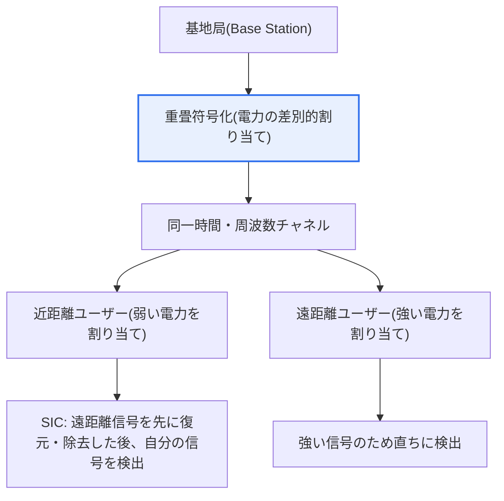
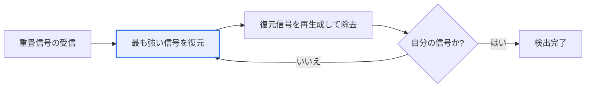

# 非直交多元接続(NOMA, Non-Orthogonal Multiple Access)

## 1. 概要

### A. 定義
> 複数のユーザーに **同一の時間・周波数リソースを電力差(またはコード)によって重畳して割り当て**、受信側で逐次干渉除去(SIC)によって信号を分離する多元接続技術である。従来の直交方式(OMA)とは異なり、リソースを分割せずに重ねて使用することで、周波数利用効率と収容容量を大きく高める。

NOMAを理解する核心は、「**リソースを分割せずに重ねて使う**」という発想の転換である。従来の直交多元接続(OMA, Orthogonal Multiple Access)は、ユーザーごとに時間(TDMA)・周波数(FDMA)・コード(CDMA)・サブキャリア(OFDMA)を重ならないように(直交するように)分けて与え、互いに干渉しないようにした。この方式は受信処理が単純で安定しているが、リソースが物理的に限られているため、**直交リソースの数がそのまま収容可能なユーザー数の上限** となるという根本的な限界を持つ。

NOMAはこの前提を覆す。**同じ時間・周波数を複数のユーザーが共有しつつ、電力の強さ(Power Domain)を変えて** 割り当てる。基地局は、チャネル状態の良い(近い)ユーザーには弱い電力を、チャネル状態の悪い(遠い)ユーザーには強い電力を割り当て、複数の信号を1つに重ねて(重畳符号化、Superposition Coding)送信する。受信側では **逐次干渉除去(SIC, Successive Interference Cancellation)** の手法により、電力の強い信号から順に復元・除去して自分の信号を分離する。こうすることで、同じリソースでより多くのユーザーを同時に収容し、周波数利用効率を高めることができるため、超大量接続が求められる5G/6Gの候補技術として継続的に研究されてきた。

### B. 登場背景および必要性
NOMAが浮上した背景には、「周波数は有限なのに接続需要は爆発的に増える」という構造的矛盾がある。IoT・超大量接続によって接続機器の数が急増し、1つのセルが収容しなければならない端末数は、人を中心とした通信の時代とは比較にならないほど大きくなった。特に5Gが定義した3つの利用シナリオのうち **mMTC(大規模マシンタイプ通信)** は、狭い地域に極端に多くの低速端末を収容しなければならず、直交リソースを1つずつ割り当てるOMAではこの密度に対応することが難しい。

また、限られた周波数スペクトルはオークション・割当コストが非常に高い国家資源であるため、**同じ帯域幅でどれだけ多くの情報・ユーザーを運べるか(周波数利用効率、spectral efficiency)** が、移動通信事業者の中核的な競争力となる。NOMAはリソースを重ねて使う方式によってこの効率の理論的上限を引き上げることができるため、OMAの容量限界を超えるための有力な代替案として研究されてきた。

## 2. 動作原理 — 電力重畳とSIC

NOMAの動作は、「送信側で重ね、受信側で剥がす」という2つの軸で理解できる。以下の概念図は、ダウンリンク(下り)NOMAの全体構造を示している。

基地局は2人のユーザーの信号を **電力を変えて1つに合成した後**、同じリソースに載せて送信する。ここで重要な原理は、「**チャネル状態の悪いユーザーにより大きな電力を与える**」という点である。直感に反するように見えるが、チャネル状態の悪い(遠い)ユーザーは信号が大きく減衰するため、そもそも強い電力を載せなければ最低限の受信品質を確保できず、チャネル状態の良い(近い)ユーザーは弱い電力でも十分だからである。この電力配分の非対称性こそが、SICを可能にする鍵である。

**遠距離ユーザー(強い電力)** は、自分の信号が全受信電力の大部分を占めるため、近距離ユーザーの弱い信号を雑音とみなして直ちに自分の信号を検出する。一方 **近距離ユーザー(弱い電力)** は、まず電力の強い遠距離ユーザーの信号を復元し、それを受信信号から差し引き(干渉除去)、残った信号から初めて自分の信号を検出する。この「強いものから順に剥がしていく」過程がSICの本質であり、複数のユーザーが重なっていても各自の信号を分離できる理由である。

この過程をプロセスの観点から見ると、次のような逐次処理として整理される。

この逐次構造のため、NOMAの性能は **SICの精度に大きく依存** する。前段で強い信号を正確に復元・除去できなければ、その誤差が後段の信号検出にそのまま伝播(誤り伝播、Error Propagation)し、性能が急激に劣化する。したがって実際の実装では、電力配分の最適化、ユーザーペアリング(どのユーザー同士を組み合わせるか)、チャネル推定の精度が設計の中核変数となる。

**簡単な数値例** で原理を具体化してみよう。基地局が総電力を2人のユーザーに配分し、チャネル状態の悪い遠距離ユーザーに80%、チャネル状態の良い近距離ユーザーに20%を与えるとする(値は説明のための例である)。遠距離ユーザーにとっては、自分の信号が受信電力の大部分を占め、近距離ユーザーの20%の信号は相対的に弱いため、雑音として扱っても検出が可能である。近距離ユーザーはチャネル状態が良く信号対雑音比が高いため、まず強い80%の信号(遠距離ユーザーのもの)を余裕をもって復元・除去した後、自分の分である20%の信号をきれいに検出する。このように **電力比の非対称性とチャネル利得の非対称性がかみ合うとき**、2人のユーザーが同じリソースを使っても各自の信号を回復できるというのが、NOMAの核心的な直観である。

### C. ダウンリンクとアップリンクの違い
NOMAは、ダウンリンク(Downlink、基地局→端末)とアップリンク(Uplink、端末→基地局)とで動作の様相が異なる。**ダウンリンク** では、基地局がすべてのユーザーの信号を把握し電力を制御して重ねるため、重畳符号化と電力配分を基地局が一括して最適化でき、SICは各端末が行う。一方 **アップリンク** では、異なる位置の端末が独立して送信し、信号は自然に異なる電力で基地局に到達し、SICは基地局が行う。アップリンクNOMAは、スケジューリング要求なしに即座に送信するグラントフリー(Grant-free)方式と組み合わせやすく、接続遅延を削減しなければならない大規模IoTシナリオで特に注目されている。ただし、端末間の電力制御が難しく衝突の可能性もあるため、基地局の信号分離能力がダウンリンクよりも重要となる。

## 3. 中核構成技術

NOMAは、3つの要素技術が有機的にかみ合って動作する。各技術は単独で存在するのではなく、互いの前提となっている。

**電力割り当て(Power-domain Multiplexing)** はNOMAの出発点である。チャネル状態情報(CSI)に基づいてユーザーごとの電力の強さを差別的に割り当てるが、この配分がそのままセル全体の公平性(Fairness)と総容量(Sum-rate)の間のバランスを決定する。電力差を十分に広げられなければSICが信号を区別できず、広げすぎると特定のユーザーだけが良い品質を得る不公平が生じる。

**重畳符号化(Superposition Coding)** は、複数のユーザーの信号を電力を変えて1つに合成して送信する送信側の手法である。情報理論的には放送チャネル(Broadcast Channel)の容量を達成する手法として知られており、NOMAはこの古くからの理論を実際の多元接続に適用したものとみなすことができる。

**逐次干渉除去(SIC)** は受信側の中核的な手法であり、前述のとおり強い信号から復元・除去して自分の信号を分離する。受信機の複雑さの大部分はここで発生するため、端末の演算能力と消費電力が制約されるIoT環境では、SICの段数(同時に重ねるユーザー数)を制限するという実務的な妥協が必要となる。SICの処理手順を段階に分けると次のとおりである。

- **① 整列**: 受信した重畳信号の中で、電力の強い信号から処理順序を定める(電力の大きさ = 処理の優先順位)。
- **② 復元**: 最も強い信号を先に復調・復号(デコード)してデータを推定する。
- **③ 再生成**: 推定したデータで当該信号を再び作り(再変調)、元の波形を復元する。
- **④ 除去**: 再生成した信号を受信信号から差し引いて干渉を取り除く。
- **⑤ 反復・終了**: 残った信号について②~④を繰り返し、自分の信号に到達したら検出を終える。

この手順で②の復元を誤ると③~④の除去が不正確になって誤りが後段へ伝播するため、各段階の精度が鎖のようにつながっているという点が、SIC設計の根本的な難しさである。

| 技術 | 位置 | 役割 | 中核課題 |
|---|---|---|---|
| **電力割り当て** | 送信 | チャネル状態に応じた電力の差別的割り当て | 総容量と公平性のバランス |
| **重畳符号化** | 送信 | 複数の信号を重ねて送信 | 放送チャネル容量の達成 |
| **SIC** | 受信 | 強い信号から除去・分離 | 複雑さ・誤り伝播 |

## 4. OMAとの比較 — 違いが生じる理由

NOMAとOMAの違いは、単なる「効率 対 単純さ」ではなく、**干渉を扱う哲学の違い** に由来する。OMAはそもそも干渉が生じないようにリソースを直交分離する「干渉回避(interference avoidance)」戦略であり、NOMAは干渉を許容しつつ受信側で能動的に除去する「干渉管理(interference management)」戦略である。この観点の違いが、その後のあらゆる特性の違いを生み出している。

| 区分 | OMA(直交) | NOMA(非直交) |
|---|---|---|
| **リソース割り当て** | ユーザーごとに分離(直交) | 同一リソースを重畳共有 |
| **干渉処理** | 回避(直交により根本的に遮断) | 管理(SICで除去) |
| **識別方式** | 時間・周波数・コードの分離 | 電力差(またはコード) |
| **受信処理** | 単純(低複雑度) | 逐次干渉除去(高複雑度) |
| **周波数利用効率** | 相対的に低い | 高い |
| **収容容量** | 直交リソース数に制限 | 大きい(超大量接続) |
| **遅延・電力** | 低い | SICにより増加 |

この表で実務上最も重要な含意は、**「タダ飯はない」** ということである。NOMAが周波数利用効率と収容容量を高める代償として、受信機の複雑さ・演算遅延・消費電力が増加し、SICの誤りリスクが生じる。したがってNOMAはあらゆる状況で優れているわけではなく、**チャネル利得の差が大きいユーザー同士を組み合わせるとき** に利得が最大化される。チャネル状態が似ているユーザー同士では電力差を広げにくくSICがうまく機能しないため、その場合はむしろOMAのほうが有利になり得る。

**具体的な事例** として、セル境界の遠距離ユーザーと基地局近くの近距離ユーザーをペアにすると、チャネル利得の差が大きいためNOMAの利得が大きい。一方、2人のユーザーがともにセル中央に同程度の距離でいる場合は、電力領域での識別が曖昧になる。このため実際の標準化の議論では、NOMAを単独の方式としてではなく、OFDMAの上に選択的に載せる形や、MIMO・ビームフォーミングと組み合わせた形で検討してきた。

## 5. 深掘り — 標準化動向と進化の方向性

NOMAは長らく有力な候補技術として研究されてきたが、**商用移動通信の標準に全面的に採用されたと断定することは難しい。** 3GPPは5G NRの標準化過程で複数の多元接続の候補を検討し、電力領域NOMAもその1つであったが、受信機の複雑さや標準化時点での成熟度などを理由に、5Gの基本的な多元接続としてはOFDMA系が維持されたとされている。ただし、放送・リレー・特定のアップリンクシナリオなどでは、NOMA的な手法が部分的に活用・研究されており、具体的な採用範囲はリリースや時点によって異なるため、一般化して理解するのが安全である。

技術的な進化の方向性は、大きく2つに分かれる。第一に、**コード領域NOMA(Code-domain)** への拡張である。電力領域の代わりにスパース符号(SCMA, Sparse Code Multiple Access)や低密度拡散コードを用いてユーザーを識別する方式であり、SICの複雑さを緩和しつつ大規模接続を狙う。第二に、**MIMO・ビームフォーミングとの結合(MIMO-NOMA)** である。空間領域(アンテナ・ビーム)と電力領域を併せて活用し、ビームで分けたユーザーグループの内部で再びNOMAによって重ねて収容する階層的な構造である。

6Gの観点では、NOMAは **超大量接続(膨大なIoT端末)と超低遅延・高信頼を同時に要求する環境** で再び注目されている。特にグラントフリー(Grant-free)のアップリンク接続と組み合わせれば、端末がスケジューリング要求の手続きなしに即座に送信し、基地局が重なった信号を分離する方式によって接続遅延を大きく削減できるため、mMTC・URLLCを組み合わせたシナリオの候補として議論されている。ただし、これも研究・標準化が進行中の領域であるため、確定した商用技術と断定しないのが正確である。

**応用が検討されている代表的な領域** を整理すると、理解が具体的になる。第一に、衛星・非地上系ネットワーク(NTN)である。衛星セルはカバレッジが広いため、ユーザー間のチャネル利得の差が自然に大きく開き、NOMAの前提(電力・チャネルの非対称性)がよく成立するため、限られた衛星リソースで多数の端末を収容する方策として研究されている。第二に、車両通信(V2X)・ミリ波スモールセルのように、ユーザー密度とチャネルのばらつきが大きい環境である。第三に、放送・マルチキャストのように、1つのリソースで複数の受信者に異なる品質のコンテンツを階層的に送信(階層符号化)する場合である。これらの事例の共通点はいずれも「**チャネル利得の差が大きい、あるいはリソースが極度に制限されている**」ことであり、NOMAがいつ利得を生むのかを逆説的に示している。

## 6. 考慮事項および示唆(技術士の観点)

1. **SICの複雑さと誤り伝播が最大の課題である。** 受信側で信号を逐次除去するSICは、演算量がユーザー数に応じて増加し、前段の信号復元の誤りが後段へ伝播する。端末の電力・演算能力が制約されるIoTでは、同時多重化するユーザー数(SICの段数)を制限するか、複雑さの低いコード領域の手法と折衷する設計が現実的である。

2. **ユーザーペアリングと電力配分が性能を左右する。** チャネル利得の差が大きいユーザーを組み合わせてこそ利得が大きいため、スケジューラはどのユーザー同士を重ねるか(pairing)と電力をどう配分するか(power allocation)をリアルタイムで最適化しなければならない。これは総容量の最大化とユーザー間の公平性の間のトレードオフを解く問題であり、NOMA実務の中核的なアルゴリズム課題である。

3. **正確なチャネル推定とCSIフィードバックが前提である。** 電力配分とSICはいずれもチャネル状態情報(CSI)に依存するため、チャネル推定の誤差やフィードバック遅延が大きいとNOMAの利点は相殺される。高速移動環境のようにチャネルが急速に変化する状況ではこの前提が弱まり、OMAに対する優位性が小さくなり得る。

4. **標準・商用化の成熟度を冷静に評価すべきである。** NOMAは理論的な利得が明確であるが、受信機の複雑さ・実装コスト・既存標準との整合性のため、全面的な商用化には慎重な判断が必要である。技術士の観点では、「有望だが状況依存的」な技術として位置付け、mMTC・グラントフリーなど利得の大きい特定シナリオに選択的に適用する戦略を提示するのが妥当である。

5. **他技術との結合による進化が現実的な経路である。** 単独の方式としてOMAを置き換えるよりも、MIMO・ビームフォーミング・mmWaveと組み合わせたり(MIMO-NOMA)、コード領域へ拡張したり(SCMA)する方向が実質的である。6Gの超大量接続・超低遅延の要求に合わせ、NOMAは多元接続手法の「唯一の正解」ではなく、状況に応じて選択されるツールボックスの一翼として理解するのが適切である。

---

> **一言まとめ**: NOMAは *同一の時間・周波数を電力差によって重畳共有* し、受信側でSICによって信号を分離する非直交多元接続であり、OMAの容量限界を超えて周波数利用効率・収容容量を高めるが、SICの複雑さ・誤り伝播・チャネル推定への依存という代償を伴い、チャネル利得の差が大きい超大量接続(mMTC)シナリオにおいてMIMO・コード領域と結び付いて進化する5G/6Gの候補技術である。
