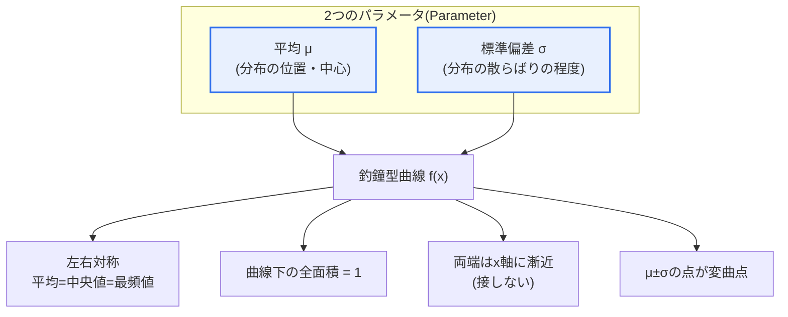
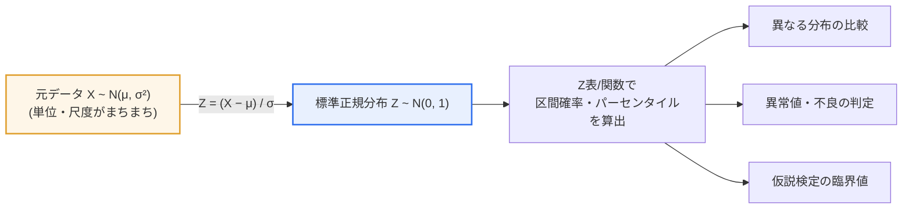

# 正規分布(Normal Distribution)の特徴

## 1. 概要

### A. 定義
> **正規分布**とは、平均(μ)を中心に左右対称な **釣鐘(Bell)型の連続確率分布** であり、自然・社会現象において最も広く現れ、統計的推論(estimation・testing)の数学的基盤となる分布である。確率密度関数は平均μと分散σ²(標準偏差σ)の2つのパラメータだけで完全に決定され、記号ではX ~ N(μ, σ²)と表記する。

正規分布が統計学の中心に位置する根本的な理由は、「**世の中の数多くの現象が釣鐘型に分布し、そうでない母集団から抽出した標本でさえ、その平均は正規分布に収束する**」という二重の普遍性にある。人の身長・体重、繰り返し測定で生じる誤差、製造工程で生産される部品の寸法のように、複数の小さく独立した要因が足し合わされて生じる値は、特定の要因が支配しない限り、自然に平均の周りに集まり両極端がまれになる釣鐘型となる。これは偶然ではなく、独立な確率変数の和が正規分布に近づくという数学的性質の現れである。

さらに決定的なのが **中心極限定理(Central Limit Theorem, CLT)** である。母集団が正規分布でなくても、その母集団から大きさnの標本を繰り返し抽出して計算した標本平均X̄の分布は、nが大きくなるにつれて正規分布N(μ, σ²/n)に近づく。例えば、サイコロの目(1~6、一様分布)を30個ずつ抽出して平均を求める実験を数千回繰り返すと、個々の目は一様分布であるにもかかわらず、標本平均のヒストグラムは3.5を中心とする釣鐘型になる。この性質のおかげで、母集団の分布がわからなくても「標本を通じて」パラメータを推定し仮説を検定することができ、正規分布は信頼区間・仮説検定・回帰分析・品質管理(シックスシグマ)など推測統計全般の共通言語となる。

最後に、**パラメータの単純さ** も正規分布の強力な実務上の利点である。平均(位置)と標準偏差(散らばり)のわずか2つの値さえわかれば分布全体の形が確定し、任意の区間の確率を計算できる。この経済性が、理論の展開と現場での適用の双方を容易にしている。

### B. 登場背景と必要性
正規分布は、18~19世紀の天文観測と測地の過程で、繰り返し測定するたびに値が少しずつ異なる「**測定誤差**」を数学的に説明しようとする努力の中で確立された。ド・モアブル(de Moivre)が二項分布の近似として釣鐘型の曲線を初めて扱い、その後 **ガウス(Gauss)** が誤差論において最小二乗法とともにこの分布を体系化したことから、今日では「**ガウス分布(Gaussian distribution)**」とも呼ばれる。観測誤差は特定の方向に偏らず、平均0を中心に対称的に散らばるという直観が、正規分布の釣鐘型へとつながった。このように誤差モデルから出発した分布が、標本平均の収束というCLTによって裏付けられたことで、自然・工学・社会科学・経営のデータを扱う標準的なツールとして定着した。

## 2. 確率密度関数と幾何学的特徴

正規分布の形と性質を左右するのは、平均μと標準偏差σである。以下の図は、2つのパラメータが曲線のどの側面を決定し、そこからどのような幾何学的性質が派生するかを示している。

確率密度関数は f(x) = (1 / (σ√(2π))) · exp( −(x−μ)² / (2σ²) ) である。数式は複雑に見えるが、構造は単純である。指数部の−(x−μ)²/(2σ²)の項が核心であり、xが平均μから離れるほど(x−μ)²が大きくなり、負の指数によって値が急激に小さくなるため、曲線は速やかに低くなる。前の1/(σ√(2π))は全面積を1に合わせる正規化定数である。この2つの部分が組み合わさり、「平均付近が最も高く、両端に行くほど対称的に減少する」釣鐘型を形作る。

**第一に、左右対称性と代表値の一致** である。曲線はx=μを軸として完全に対称であるため、平均・中央値・最頻値がすべてμで一致する。これは、一方に偏った(歪度のある)分布と正規分布を区別する重要なシグナルである。所得分布のように右裾の長いデータでは平均が中央値より大きく現れるため、3つの代表値が離れている場合は正規性を疑うべきである。

**第二に、標準偏差が決定する散らばり** である。σが小さければ曲線は平均の周りに鋭く突き出し、σが大きければ低く広く広がる。平均が同じでもσが異なれば、まったく異なるリスク・品質水準を意味する。例えば2つの生産ラインがいずれも平均直径10mmの部品を作っていても、σが0.05mmのラインと0.20mmのラインでは不良率が大きく異なる。正規分布においてμ±σの点は曲線の凹凸が切り替わる **変曲点** でもあり、σは統計的にも幾何学的にも「散らばりの自然な単位」となる。

**第三に、面積=確率と漸近性** である。曲線下の全面積は常に1であり、特定の区間[a, b]の面積がそのままその区間に値が入る確率P(a≤X≤b)となる。また、曲線は両端でx軸に限りなく近づくが決して接しない漸近線を持つ。これは「どれほど極端な値でも確率は0ではない」ことを意味し、後述する裾の厚い(fat-tail)リスクの議論の出発点となる。

| 特徴 | 内容 | 実務上の含意 |
|---|---|---|
| **左右対称** | 平均を中心に対称、平均=中央値=最頻値 | 3つの代表値が離れていれば正規性を疑う |
| **釣鐘型** | 平均付近に密集、両端に行くほど減少 | 平均付近の値が最も多い |
| **2パラメータで決定** | μ(位置)・σ(散らばり)で分布が完全に決定 | 2つの値だけで任意区間の確率を計算 |
| **面積 = 1** | 曲線下の全面積=1、区間の面積=確率 | 積分/表で確率を算出 |
| **漸近性** | 両端がx軸に接せず無限に近づく | 極端値でも確率は0ではない |
| **変曲点 μ±σ** | 凹凸の転換点が標準偏差の位置 | σが散らばりの自然な単位 |

## 3. 68-95-99.7ルールと標準正規分布(標準化)

### A. 68-95-99.7の経験則
正規分布の実用性を最も直感的に示すのが、**68-95-99.7ルール(経験則、empirical rule)** である。平均を中心に±1σ以内に約68.3%、±2σ以内に約95.4%、±3σ以内に約99.7%のデータが含まれる。この比率は、平均・標準偏差が何であれ、正規分布でありさえすれば常に成り立つ。

具体的に、平均70点・標準偏差10点の試験成績が正規分布に従うとすれば、60~80点の区間に全学生の約68%が集まり、50~90点に約95%が、40~100点に約99.7%が含まれる。100点満点で90点を超える学生は上位約2.3%にすぎないという計算がすぐに得られる。このルールのおかげで「何σを外れたら異常値とみなす」という管理基準を設けることができ、これが統計的工程管理(SPC)の管理限界線(±3σ)と異常値検知の根拠となる。

### B. 標準化(Z変換)と標準正規分布
異なる正規分布を同じ物差しで比較するには、**標準正規分布**(平均0、標準偏差1、Z ~ N(0,1))に変換する。元のデータXをZ = (X − μ) / σに変換することを **標準化(standardization)** といい、Z値は「平均から標準偏差何個分離れているか」を意味する。標準化すれば、単位の異なる値も共通の尺度で比較できる。例えば、国語の点数(平均70、σ 10)で85点を取った学生のZは+1.5、数学の点数(平均60、σ 20)で85点を取った学生のZは+1.25である。素点は同じ85点であるが、標準化すると国語での成績のほうが相対的に優れていることがわかる。

標準化の真の力は、確率計算の標準化にある。すべての正規分布はZに変換した後、1つの標準正規分布表(または関数)さえあれば任意区間の確率を読み取ることができる。かつてはZ表を手で引いていたが、今日ではスプレッドシートのNORM.S.DIST、Pythonのscipy.stats.normのような関数で即座に計算する。仮説検定で有意水準5%に対応する臨界値±1.96(両側)、有意水準1%の±2.58も、すべてこの標準正規分布から得られる値である。

| 区間 | 含まれる割合 | 活用例 |
|---|---|---|
| **±1σ** | 約68.3% | 日常的な変動範囲 |
| **±2σ (≈1.96σ)** | 約95.4%(正確に95%は1.96σ) | 95%信頼区間・有意水準5% |
| **±3σ** | 約99.7% | SPC管理限界・異常値の基準 |
| **±6σ** | 約99.99966% | シックスシグマ品質(100万個あたり3.4の欠陥) |

## 4. 類似・関連分布との比較

正規分布を正しく使うには、いつ別の分布に切り替えるべきかを知ることが重要である。以下の比較は単なる列挙ではなく、「なぜその分布が必要になるのか」という文脈を含んでいる。

t分布は、標本が小さく(おおよそn<30)、母標準偏差がわからないため標本標準偏差で代用する場合に用いる。正規分布よりも裾が厚いが、これは小さな標本では標準偏差の推定の不確実性が大きいためである。標本が大きくなるとt分布は正規分布に収束する。カイ二乗分布・F分布は、分散の検定や分散分析(ANOVA)で分散の比を扱う際に登場する。二項分布は成功/失敗の離散事象を扱うが、試行回数が大きく成功確率が極端でなければ正規分布で近似(正規近似)でき、CLTの代表的な応用となる。

| 分布 | いつ使うか | 正規分布との関係 |
|---|---|---|
| **標準正規(Z)** | 母分散が既知、または大標本 | 正規分布を平均0・σ 1に変換したもの |
| **t分布** | 小標本・母分散が未知 | 裾が厚い、nが大きくなると正規に収束 |
| **カイ二乗** | 分散の検定・適合度検定 | 標準正規の二乗の和 |
| **二項分布** | 成功/失敗の離散事象 | nが大きければ正規近似が可能(CLT) |

## 5. 深掘り — 実務適用事例と正規性の限界

正規分布は産業現場で幅広く用いられている。**品質経営のシックスシグマ** が代表的である。シックスシグマは工程のばらつきを正規分布でモデル化し、規格限界(spec limit)が平均から6σ離れるようにばらつきを減らして、不良を極限まで低減する方法論である。実務では、工程平均が長期的に±1.5σドリフト(shift)すると補正し、シックスシグマ水準を「100万機会あたり約3.4個の欠陥(DPMO 3.4)」と定義する。GE・モトローラが1980~90年代にこの方法で品質コストを大幅に削減した事例が広く知られている。

**金融リスク管理** においても、正規分布は長らく標準として用いられてきた。収益率が正規分布に従うと仮定すれば、特定の信頼水準における最大予想損失である **VaR(Value at Risk)** を、標準偏差とZ値で簡単に計算できる。例えば日次収益率の標準偏差が2%であれば、95% VaRは約1.65×2% = 3.3%程度と推定される。しかし、ここには重要な限界がある。実際の金融収益率は正規分布よりもはるかに裾が厚く(leptokurtic)、極端な事象が頻繁に発生する。2008年の世界金融危機は、正規分布の仮定の下では「数万年に一度」起こるような暴落が現実には繰り返し起きることを示し、その後、極値理論(EVT)・t分布・ヒストリカルシミュレーションなど、裾の厚さを反映する補完的手法が重視されるようになった。

これらの事例が与える教訓は、正規分布は強力であるが万能ではないという点である。データが正規分布に「従うだろう」と仮定する前に、**正規性検定と視覚的診断** で確認する手順が必要である。代表的には、シャピロ-ウィルク(Shapiro-Wilk)検定、コルモゴロフ-スミルノフ(K-S)検定といった正規性検定と、データの分位数を理論分位数と比較する **Q-Qプロット** が用いられる。Q-Qプロットで点が直線に沿えば正規性に合致し、両端が上に曲がれば裾の厚さを、S字に曲がれば歪度を示唆する。正規性が崩れている場合は、対数・平方根変換(Box-Coxを含む)によって正規に近づけるか、正規性を要求しないノンパラメトリック手法(マン-ホイットニー、クラスカル-ウォリスなど)に切り替える。

## 6. 考慮事項および示唆(技術士の観点)

1. **正規性仮定の検証を手順化せよ。** t検定・回帰分析・ANOVAなど広く使われるパラメトリック手法の多くは、正規性を前提としている。したがって、データ分析プロセスに正規性検定(Shapiro-Wilk)とQ-Qプロットを標準ステップとして組み込み、違反時には変換またはノンパラメトリック手法へ分岐する判断基準を事前に用意してこそ、信頼できる結論が得られる。

2. **中心極限定理を根拠としつつ、標本サイズを確保せよ。** 母集団が正規でなくても標本平均は正規に収束するため、ほとんどの推論は正規分布の上で可能である。ただしこれは「十分に大きな標本」を前提とする。歪度の大きい母集団ほど大きなnが必要となるため、標本設計の段階で必要な標本サイズを算定し、小標本ではt分布など補正された分布を適用すべきである。

3. **裾の厚い(fat-tail)リスクを別途管理せよ。** 金融・災害・セキュリティ事故のように極端値の衝撃が大きい領域では、正規分布は裾のリスクを過小評価する。VaRを超えて条件付きVaR(Expected Shortfall)、極値理論、ストレステストを併用し、「まれだが致命的な」事象に備えることが、技術士の観点でのリスク設計である。

4. **品質・運用管理の定量基準として活用せよ。** 68-95-99.7ルールと±3σ管理限界は、SPC・シックスシグマ・SLAの異常値検知の定量的な骨格を提供する。工程能力指数(Cp、Cpk)で規格に対するばらつきを数値化し、観測値が管理限界を外れた場合に原因を追跡する体制を整えれば、データに基づいて品質を継続的に改善できる。

5. **機械学習・異常検知との連携を考慮せよ。** 多くのアルゴリズムは、入力特徴量の正規性または標準化(スケーリング)を仮定するか、それによって恩恵を受ける。Zスコアに基づく標準化は特徴量間のスケールを揃える標準的な前処理であり、正規分布の仮定を利用した異常検知(例: Gaussian anomaly detection)はログ分析・不正取引検知などに応用される。データパイプラインの設計時に分布特性を明示的に扱うことが、性能と解釈可能性をともに高める。

## 参考資料
- NIST/SEMATECH e-Handbook of Statistical Methods, "Normal Distribution": https://www.itl.nist.gov/div898/handbook/eda/section3/eda3661.htm
- Wikipedia, "Normal distribution": https://en.wikipedia.org/wiki/Normal_distribution
- Wikipedia, "Central limit theorem": https://en.wikipedia.org/wiki/Central_limit_theorem
- Wikipedia, "68–95–99.7 rule": https://en.wikipedia.org/wiki/68%E2%80%9395%E2%80%9399.7_rule

---

> **一言まとめ**: 正規分布は *平均を中心に左右対称な釣鐘型の連続分布* であり、平均(μ)・標準偏差(σ)の2つのパラメータで完全に決定され、68-95-99.7ルールと標準化(Z)によって確率を計算し、中心極限定理を通じて統計的推論の土台となるが、裾の厚いリスクと正規性の検証を併せて扱わなければならない。
