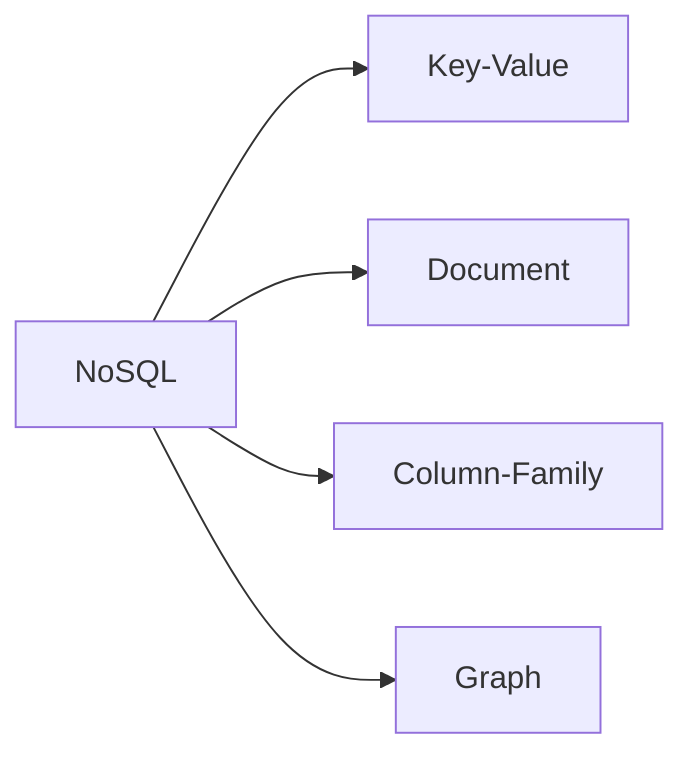
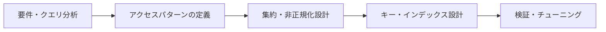

# NoSQLの類型とデータモデリング手順

## 1. 概要

### A. 定義
> リレーショナルスキーマ・SQL・強い整合性というRDBMSの前提から離れ、**大容量・非構造化・分散・高拡張性** の要求に最適化されたデータ格納技術群である。名称の「Not Only SQL」が示すとおり、SQLを排除するというより、**リレーショナルだけでは対応しにくい領域を補完** する代替手段である。

### B. 登場背景および必要性
RDBMSは整合性が重要な構造化データには強力であるが、性能を高めるにはサーバのスペックを上げる **垂直スケーリング(Scale-up)** に依存するため、物理的・コスト的な限界に突き当たる。ところが2000年代以降、大規模Webサービスは急増するトラフィックと、ログ・JSON・ソーシャル関係のような非構造化・半構造化データを、安価な複数台のサーバに分散して格納する **水平スケーリング(Scale-out)** を必要とするようになった。さらに、サービス初期からスキーマを確定することが難しく、要件が頻繁に変わる環境では、カラム1つの追加でもテーブル全体をロックする固定スキーマが障害となる。NoSQLは、こうした **柔軟なスキーマ、水平スケーリング、高可用性** を優先目標として登場した。

### C. RDBMSとの特徴比較
NoSQLがこれらの特性を得る代わりに何を諦めているのかが重要である。代表的には、**強い整合性(ACID)の代わりに結果整合性(BASE)** を選択する。分散した複数のノードにデータを複製・分散すると、すべてのノードを常に同一の状態に保つことが高コストになるため、一時的な不整合を許容しつつ最終的には収束するよう緩和したのである。

| 区分 | RDBMS | NoSQL |
|---|---|---|
| スキーマ | 固定(事前定義) | 柔軟(スキーマレス) |
| 拡張方式 | 垂直(Scale-up) | 水平(Scale-out) |
| 整合性モデル | ACID(強い一貫性) | BASE(結果整合性) |
| トランザクション | 強い(複数テーブル) | 限定的 |
| 適したデータ | 構造化・リレーション中心 | 非構造化・大容量・分散 |

## 2. NoSQLの類型

NoSQLはデータを格納するモデルによって4つの類型に分かれ、それぞれ適したアクセスパターンが異なる。

**Key-Value** は、キーで値を出し入れする最も単純な形態である。構造が単純な分だけ参照が非常に高速であり、キャッシュ・セッションの保存に適している(Redis)。**Document** は、値の位置にJSON/BSONのような階層的な文書を格納し、1つのエンティティに関連するデータを丸ごと保存・参照できるため、半構造化データに強い(MongoDB)。**Column-Family** は、行ではなくカラム単位で格納し、特定のカラムだけを大量に読む分析や時系列の書き込みに有利である(Cassandra、HBase)。**Graph** は、データをノードとエッジ(関係)で表現し、複数段階にわたる関係の探索(友達の友達、推薦)をJOINなしで高速に行う(Neo4j)。

| 類型 | データモデル | 代表的な製品 | 主な用途 |
|---|---|---|---|
| **Key-Value** | キーと値のペア | Redis, DynamoDB | キャッシュ・セッション・設定 |
| **Document** | JSON/BSON文書 | MongoDB | 半構造化・カタログ |
| **Column-Family** | カラム指向 | Cassandra, HBase | 大容量の時系列・ログ |
| **Graph** | ノード-エッジ | Neo4j | 関係ネットワーク・推薦・不正検知 |

## 3. CAP定理と整合性の選択

NoSQL設計の中核理論がCAPである。分散システムは **一貫性(Consistency)・可用性(Availability)・分断耐性(Partition tolerance)** の3つを同時にすべて満たすことはできず、ネットワーク分断(P)が現実には避けられない以上、**分断が発生した瞬間にCとAのどちらかを諦め** なければならないというものである。ノード間の通信が途切れたとき、古い値であっても応答を返せば(Aを選択)一貫性が崩れ、最新の値を保証するために応答を止めれば(Cを選択)可用性が低下する。

そのため、NoSQL製品は目的によって性格が分かれる。Cassandra・DynamoDBのように常に応答を優先する **AP型** は、SNSのフィードのように一時的な不整合が許容されるサービスに、HBase・MongoDB(構成による)のように正確性を優先する **CP型** は、在庫・残高のように誤答が致命的な領域に使われる。すなわち、CAPの選択は技術的な好みではなく、**ビジネス要件が決定するトレードオフ** である。

## 4. データモデリング手順

NoSQLモデリングの最大の特徴は、方向性がRDBと **正反対** である点である。RDBはデータの構造(エンティティ・リレーション)を先に正規化してから必要なクエリを組むが、NoSQLは **どのように参照するか(クエリ)を先に決め、それに合わせてデータ構造を作る。**

| 段階 | 内容 | 原理 |
|---|---|---|
| **クエリ優先(Query-First)** | 参照パターンを先に分析 | JOINが弱いため、読み取りの形に格納を合わせる |
| **非正規化・埋め込み** | データの重複・文書への内包 | 1回の読み取りで完結させJOINを回避 |
| **キー設計** | パーティションキー・ソートキーの設計 | データをノードに均等に分散・整列 |
| **検証・チューニング** | アクセスパターンごとの性能・ホットスポットの点検 | 特定キーへの偏り(Hotspot)を防止 |

例えばEコマースで「注文画面に会員名・商品名を併せて表示する」のであれば、RDBのように会員・商品・注文テーブルをJOINする代わりに、注文文書の中に会員名・商品名を **あらかじめ複製して埋め込んで** おく。1回の参照で画面が完成するため高速であるが、会員が名前を変更すると複製された値をすべて更新しなければならない負担が生じる。このように、NoSQLモデリングは **読み取り性能のために書き込みの複雑さと重複を受け入れる** 設計である。パーティションキーの選び方を誤って特定のノードにだけリクエストが集中すると(ホットスポット)、拡張性が崩れるため、キー設計が性能の鍵となる。

## 5. 考慮事項および示唆
- **整合性 vs 可用性の明示的な選択**: CAPのトレードオフをサービスの特性に合わせて意識的に決定すべきであり、金融のように正確性が必須の領域では、無分別なAP型の採用を避けるべきである。
- **再設計の負担**: アクセスパターンが変わるとデータ構造そのものを組み直さなければならないため、初期のクエリ分析の正確性が長期的な運用コストを左右する。
- **ポリグロットパーシステンス(Polyglot Persistence)**: 現実のシステムは1つに統一するよりも、構造化された取引はRDB、セッションはKey-Value、推薦はGraphのように **目的別に最適なストアを併用** する方向へ進んでおり、NewSQLはNoSQLの拡張性とRDBのACIDを両立させようとする折衷案として進化している。

---

> **一言まとめ**: NoSQLは *大容量・非構造化・分散に最適化された格納技術群* であり、Key-Value・Document・Column・Graphの類型があり、CAP定理に従って整合性・可用性をトレードオフとして選択し、参照パターンを先に定義して非正規化・埋め込みによってJOINを回避するクエリ優先のモデリングに従う。
