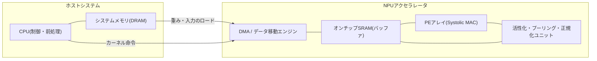
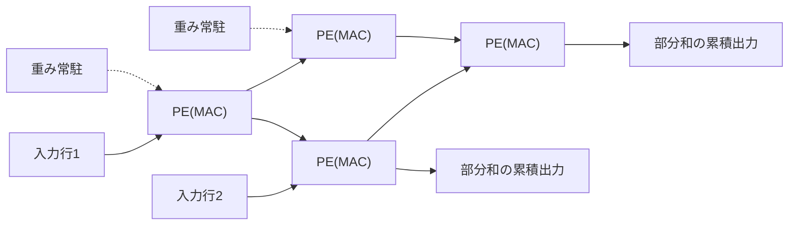
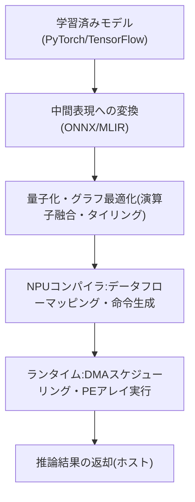

# NPU(Neural Processing Unit、ニューラルネットワーク処理装置)

## 1. 概要

### A. 定義
> **NPU(Neural Processing Unit)** は、深層ニューラルネットワークの中核演算である **行列・ベクトル乗算と積和演算(MAC, Multiply-Accumulate)** を大規模並列に処理するよう特化した **AI専用アクセラレータ(Domain-Specific Accelerator)** である。汎用演算を目指したCPUや、グラフィックス演算から出発したGPUとは異なり、NPUは「ニューラルネットワークの推論・学習という特定ワークロード」のためだけにデータパス・メモリ階層・数値精度を再設計した **ドメイン特化アーキテクチャ(DSA)** の代表例である。

従来のCPUは分岐予測・アウトオブオーダー実行など制御中心の最適化により多様な処理を柔軟にこなすが、ニューラルネットワークのように同一の積和演算が数億〜数兆回繰り返される規則的な演算には非効率である。GPUは数千個のコアによってこの並列性をかなり吸収したが、もともとグラフィックスパイプライン向けの汎用性が残っているため、電力・面積効率の面ではなお改善の余地がある。NPUは制御ロジックを最小化し、**演算器(PE)アレイとオンチップメモリ**にダイ面積を集中させることで、同じ電力ではるかに高い演算スループット(TOPS)と電力効率(TOPS/W)を達成する。GoogleのTPU、AppleのNeural Engine、Samsung・QualcommのモバイルSoCに搭載されたNPUブロックが代表的である。

### B. 登場背景と必要性
NPUが台頭した背景には三つの圧力が重なっている。第一は **ディープラーニング演算量の爆発的増加** である。画像認識から始まり、Transformerベースの大規模言語モデル(LLM)へと移る中でモデルパラメータと演算量は指数関数的に増え、汎用プロセッサでは合理的な時間・コストの範囲内でこれを処理することが難しくなった。第二は **電力効率(Energy Efficiency)の限界** である。ムーアの法則の鈍化とデナードスケーリングの終焉により、トランジスタを増やしても電力密度が同時に上昇する状況では、性能を引き上げるには汎用性を捨てて特定演算に回路を特化させる **ドメイン特化アクセラレーション** が事実上唯一の出口となった。第三は **推論の遍在化(Ubiquitous Inference)** であり、スマートフォン・自動車・IoT端末のようにバッテリーと発熱が制約となる環境でAIを常時稼働させるオンデバイス需要が高まるにつれ、少ない電力でニューラルネットワークを動かす専用ハードウェアが必須となった。これら三つの圧力がかみ合い、「ニューラルネットワークだけが得意なチップ」であるNPUが、CPU・GPUに続くコンピューティングの第三の軸として定着した。

歴史的に見ると、初期にはGPUがディープラーニングブームを牽引したが、学習・推論の規模が大きくなるにつれ「汎用並列」だけではコスト・電力を賄いきれない臨界点に達し、このとき特定ワークロードに回路を合わせる専用アクセラレータが必然的な解決策として登場した。Googleが2015年頃、自社データセンターの推論負荷を下げるためにTPUを開発したことが象徴的な転換点であり、以後クラウド・モバイル・車載の全領域でNPUの内製化が標準となった。

さらに一歩踏み込むと、NPUの台頭はコンピューティング設計思想の転換を反映している。半導体の性能向上がクロック・汎用性の拡大だけでは限界に突き当たると、特定アプリケーションの演算パターンに回路を合わせる **ドメイン特化アーキテクチャ(DSA)** が性能・電力の新たな突破口として浮上し、ニューラルネットワークはその最初の大規模な成功例となった。すなわちNPUは単なる新製品ではなく「フォン・ノイマン型の汎用性からアプリケーション特化へ」という時代的潮流の産物であり、この観点を理解してはじめて以降の構造的選択が一貫して読み解ける。

### C. 特徴
NPUの性格は **① 特定演算への特化(MAC中心)、② 大規模データ並列性の活用、③ 低精度整数演算の選好(INT8など)、④ データ再利用の最大化による電力効率優先** に要約される。これは「柔軟性」を一部犠牲にする代わりに「効率」を得る設計思想であり、後述する構造・精度・コンパイラスタックはすべてこの原則から派生する。

四つの特徴は互いにかみ合っている。MAC中心の特化(①)があるからこそ規則的な配列で並列性(②)を最大化でき、その規則性のおかげで低精度整数演算(③)を高密度に集積でき、データ再利用(④)によって移動エネルギーを削減して電力効率が完成する。逆にこの規則性から外れるワークロードでは四つの利点が同時に弱まり、これがNPUの強みと限界を同時に規定する。したがってNPUを理解するとは、この四つの軸がどのような条件で成立し、どのような条件で崩れるかを知ることに等しい。

## 2. アーキテクチャ構造と動作原理

NPU性能の核心は **演算器をどのように配列してデータ移動を減らすか** にある。以下の構造図は、ホスト(CPU)とNPUが協調する典型的なシステム構成を示す。

ホストCPUはモデルグラフを分解して演算をNPUに委任し、膨大な重み・入力はDMAが **オンチップSRAMバッファ** へ移した後、**PEアレイ** で行列積が実行される。ここでの核心は **演算量に対するデータ再利用を最大化** し、低速で電力消費の大きい外部DRAMアクセスを最小化することである。一度読んだデータを何度も再利用するほど(高いOperational Intensity)NPUの利点は大きくなる。

この構造が電力効率につながる原理は「高価な資源を節約し、安価な資源を活用する」に要約される。ニューラルネットワーク演算で本当にコストが大きいのは乗算そのものではなく、そのオペランドを遠いメモリから運ぶことである。NPUはまさにこのデータ移動を狙い、制御ロジックを取り除いて確保したダイ面積を演算器とオンチップバッファに投資する。以下ではその具体的な設計要素を一つずつ見ていく。

### A. シストリックアレイと積和演算の並列化
NPUの心臓部は **シストリックアレイ(Systolic Array)** と呼ばれる2次元格子状の演算器配列である。これは多数の処理要素(PE)が格子状に接続され、データが心臓の鼓動のように1クロックごとに隣接PEへ流れ、各PEが積和演算を行う構造である。行列AとBの積を計算する際、入力はアレイの一辺から流れ込み、重みは各PEに常駐し、部分和がアレイに沿って累積されて反対側から出ていく。この方式の決定的な利点は、**一度読んだデータがアレイ内部を通過しながら複数のPEで再利用** され、外部メモリアクセス回数を劇的に減らせる点にある。Google TPUが256×256規模の大型シストリックアレイで1サイクルあたり数万回のMACを処理したことが代表例であり、制御オーバーヘッドがほとんどないまま演算密度を極限まで引き上げる。

以下の詳細図は2×2に縮小した例で、入力が左から流れ込み、重みが各PEに常駐し、部分和が下方向に累積されるシストリックアレイのデータフローを示す。

核心は、一度投入された入力・重みがアレイを通過しながら複数のPEで繰り返し使われる点であり、この再利用が外部メモリアクセスを減らす源泉である。シストリックアレイが効率的な理由は単に「コアが多いから」ではなく、**データ移動パターンが規則的かつ局所的** だからである。GPUが膨大なレジスタ・キャッシュを通じて柔軟にデータを共有するのに対し、シストリックアレイは隣接PE間の配線だけでデータを伝達し、配線長と電力を削減する。ただしこの規則性は積和演算が密に詰まっているときにのみ効果的であり、疎(Sparse)な演算や不規則な演算ではPE稼働率が低下しうるという限界も併せ持つ。

### B. データフロー(Dataflow)と再利用戦略
NPU設計で性能・電力を左右するもう一つの軸は、**どのデータを固定し、何を流すか** を決めるデータフローである。大きく三つある。**重み固定(Weight Stationary)** は重みをPEに常駐させて再利用を最大化する方式で、同じ重みを複数の入力に繰り返し適用する畳み込み層・全結合層に有利である。**出力固定(Output Stationary)** は各PEが一つの出力値の累積を最後まで担当して部分和の移動をなくし、**行固定(Row Stationary)** は入力・重み・部分和の再利用を総合的にバランスさせる方式(例:MIT Eyeriss)である。どれが最適かは層の形状(チャネル数・カーネルサイズ・バッチサイズ)によって異なるため、実際のNPUは複数のデータフローをサポートするか、特定ワークロードに合わせて選択する。このように「何を再利用するか」の設計がそのまま電力効率を決定する。

一方、データフローの選択はオンチップメモリ階層の設計と連動する。NPUは外部DRAM、大容量のオンチップ **グローバルバッファ(Global Buffer, SRAM)**、そして各PE内部の小さな **レジスタファイル** へと続く多段のメモリ階層を持ち、上位(PE側)に行くほどアクセスエネルギーは急激に低くなる。したがってデータをできる限りPEの近く(レジスタ・ローカルバッファ)に長く留めて再利用することが電力効率の鍵であり、データフローとは結局「この階層のどこに何をどれだけ保持しておくか」を決めるポリシーにほかならない。このためNPU設計では、演算器の数を増やすことと同じくらい、バッファ容量と帯域幅のバランスを取ることが重要である。

### C. 低精度演算と量子化
NPUがGPUに比べて圧倒的な電力効率を実現するもう一つの秘訣は **低い数値精度(Reduced Precision)** である。学習には通常FP32/FP16のような浮動小数点が使われるが、推論段階では32ビット浮動小数点を **8ビット整数(INT8)** やそれ以下に下げる **量子化(Quantization)** を適用しても精度低下が大きくないことが実証されている。整数乗算器は浮動小数点に比べて回路面積・電力が数分の一であるため、同じダイにより多くの演算器を搭載し、より低い電力で動かすことができる。例えばINT8演算はFP32に比べておよそ4分の1のメモリと、はるかに少ないエネルギーで同じ演算を行う。最新のNPUはさらに進んで、INT4・FP8などの超低精度、層ごとに精度を変える **混合精度(Mixed Precision)**、重みが0の結合をスキップする **スパース性(Sparsity)アクセラレーション** までサポートして効率を高めている。ただし精度を下げるほど精度劣化のリスクが大きくなるため、量子化を考慮した学習(QAT)などでこれを補正することが実務上の鍵となる。

### D. ソフトウェアスタックとコンパイラ
NPUはハードウェアだけでは動作せず、**モデルをハードウェア命令に変換するコンパイラ・ランタイムスタック** が性能の半分以上を左右する。開発者がPyTorch・TensorFlowで作成したモデルはONNXのような中間表現に変換された後、NPU専用コンパイラ(例:ベンダーSDK、Apache TVM、Google XLA)がこれを受け取り、**演算子融合(Operator Fusion)、タイリング(Tiling)、メモリ割り当て、データフローのマッピング** を行って最適化された実行コードを生成する。この過程で複数の演算を一つにまとめて中間結果のメモリ往復をなくし、大きな行列をオンチップバッファのサイズに合わせて分割(タイリング)して再利用を最大化する。ハードウェアがいかに優れていても、コンパイラが演算をうまくマッピングできなければPE稼働率は急落するため、NPUの競争力は **ハードウェア・ソフトウェア協調設計(HW-SW Co-design)** に大きく依存する。実際、新興NPUスタートアップが直面する最大の難関も、チップそのものよりこのソフトウェアエコシステムの成熟度である場合が多い。

### E. 性能指標とルーフライン(Roofline)の観点
NPUを評価・比較する際には、単一の数値ではなく複数の指標を併せて見る必要がある。最も広く使われるのは毎秒の演算回数である **TOPS(Tera Operations Per Second)** と、これを消費電力で割った **電力効率TOPS/W** である。しかしTOPSは理論上の最大値(Peak)にすぎないため、実際のワークロードで演算器がどれだけ埋まっているかを示す **実効稼働率(Utilization)** と **モデルFLOP稼働率(MFU, Model FLOPs Utilization)** を併せて見なければ歪みを避けられない。例えばあるチップが100 TOPSをうたっていても実際の推論で稼働率が30%にとどまるなら、競合チップの60 TOPS・稼働率70%の方が速い場合がある。このように「カタログスペック」と「実測性能」の乖離を読み取ることが、技術士の観点からの見識である。

性能のボトルネックが演算なのかメモリなのかを構造的に診断するツールが **ルーフラインモデル(Roofline Model)** である。横軸に演算強度(Operational Intensity、1バイトあたりの演算数)、縦軸に達成性能をとると、性能はメモリ帯域幅が描く **斜めの屋根** と演算性能が描く **水平の屋根** のうち低い方に抑えられる。演算強度の低いLLMの重み読み込みのような処理は帯域幅の屋根に引っかかり(Memory-bound)、演算器をいくら増やしても速くならない。反対に密な畳み込みは演算の屋根に引っかかる(Compute-bound)。したがってNPUの設計・チューニングは、対象ワークロードがルーフラインのどの領域にあるかをまず把握し、それに合わせて演算器・帯域幅・オンチップバッファのバランスを取ることから始まる。

### F. 限界と課題
NPUは万能ではなく、特化の代償としていくつかの構造的限界を抱える。第一は **柔軟性の不足** である。ハードウェアが特定の演算子・データフローに最適化されているため、Attentionの変種や新しい活性化関数のように予期しない演算パターンが登場すると、対応が遅れたりCPUへフォールバック(Fallback)して性能が急落したりする。ディープラーニングのモデル構造が急速に変化する現実において、チップの設計・検証・量産に数年を要するハードウェアがソフトウェアの変化速度についていくのは難しいという **速度の不一致** が根本的なジレンマである。

第二は **スパース性・非定型演算の非効率** である。シストリックアレイは密な行列積に最適だが、重みの大半が0の疎なモデルや、グラフ・推薦用埋め込みのようにアクセスが不規則なワークロードではPEが遊休状態となり、理論性能を発揮できない。第三は **ソフトウェアの成熟度とベンダーロックイン** であり、先に強調したようにコンパイラ・フレームワークのエコシステムが弱ければ優れたチップも本来の性能を発揮できず、特定ベンダーのツールチェーンに縛られるLock-inリスクも大きい。これらの限界は、NPUをCPU・GPUの代替ではなく **役割を分担する補完財** として位置づける根拠となる。

## 3. 類型およびCPU・GPUとの比較

NPUは配置される位置と目的によって性格が分かれる。以下は代表的な分類と特性を整理した表である。

| 区分 | 配置・形態 | 目標 | 代表例 |
|------|-----------|------|-----------|
| データセンターNPU | サーバー用アクセラレータカード・モジュール | 大規模な学習・推論のスループット | Google TPU、国内外のAI半導体 |
| モバイル/エッジNPU | SoC内蔵のIPブロック | 低消費電力のオンデバイス推論 | Apple Neural Engine、スマートフォンNPU |
| 車載/組込みNPU | 車載SoC・専用チップ | リアルタイム・機能安全対応の推論 | ADAS・自動運転SoC |

表は分類を補助するにすぎず、核心は **同じ「ニューラルネットワーク特化」という思想が、電力予算と遅延要求に応じて異なる形で実装される** という点である。データセンターNPUは数百ワットを使ってスループットを最大化する一方、モバイルNPUは数ワット以下で常時推論を継続しなければならないため、整数演算・クロックゲーティングなどの低消費電力技術により重きを置く。

以下の手順図は、学習済みモデルがNPU上で実際に実行されるまでに経るデプロイ・実行パイプラインを示す。ハードウェアに劣らず、このソフトウェア経路が実効性能を左右する。

この流れの中で3〜4段階(量子化・マッピング)の品質が実効稼働率を左右する。同じハードウェアでも、コンパイラが演算を細かく分割してオンチップバッファに合わせ、不要なメモリ往復を除去すれば性能は倍増する一方、マッピングが拙ければ高価なPEアレイが遊んでしまう。これが、NPUを「ハードウェア単体」ではなく「ハードウェア・ソフトウェアシステム」として見るべき理由である。

CPU・GPUとの比較は項目の羅列ではなく、**なぜ差が生じるのか** として理解すべきである。CPUは少数の強力なコアと精緻な制御によって **分岐・逐次ロジック** に強いが、大規模な並列乗算には非効率である。GPUは数千コアのSIMT構造によって **汎用並列演算** に優れ学習に広く使われるが、グラフィックス出自の汎用性ゆえに推論専用機と比べて電力効率が低い。NPUは制御・汎用性を削ぎ落とし **MACアレイとオンチップメモリに資源を集中** させるため、特定のニューラルネットワークワークロードでGPUの数倍のTOPS/Wを実現する。その代わり、サポートする演算子が限られ、新しいモデル構造が登場するとハードウェア・コンパイラがそれに追随しなければならないという柔軟性の代償を払う。要するに **CPU=柔軟性、GPU=汎用並列、NPU=効率特化** という相補的な役割分担であり、実際のシステムは三つをヘテロジニアス(Heterogeneous)に組み合わせて使用する。

### 具体例で見る効率の差
効率の差を数値感覚で理解すると、NPUの存在理由が明確になる。第一に **精度削減の効果** である。FP32乗算器をINT8に下げると乗算器の回路面積・電力がおおよそ一桁倍程度減り、同じダイにはるかに多くのMACを集積し、より低い電力で駆動できる。重みの保存容量とメモリ帯域幅の消費も4分の1程度に減り、メモリボトルネックの大きい推論では二重の利得をもたらす。第二に **データ移動エネルギー** である。一般に、1回の積和演算そのものよりも、そのオペランドを外部DRAMから読み出す方が数十倍のエネルギーを要するとされており、シストリックアレイ・オンチップバッファで再利用を増やして外部アクセスを減らすことが電力効率の核心であることがわかる。第三に **稼働率の現実** である。GoogleのTPU論文は、初期のデータセンター推論においてワークロードによって演算器稼働率が大きく変動したことを報告しており、これは「理論TOPSが高くても実効性能はマッピング・バッチサイズに左右される」という先の指摘を実証している。これら三つの事例は、NPU導入の判断がスペックの数字ではなく **対象ワークロードでの実測** に基づくべきことを示している。

## 4. 深掘り:最新動向と実務適用

NPU分野はいくつかの明確な潮流の中で急速に進化している。第一に **生成AI・LLM推論への特化** である。TransformerのAttention演算と巨大な重みを効率的に処理するため、帯域幅の大きいHBMを組み合わせ、KVキャッシュ管理やFlashAttention系の最適化をハードウェア・コンパイラのレベルでサポートする方向へと設計が再編されている。LLM推論はメモリ帯域幅に敏感(Memory-bound)な特性が強いため、演算器だけでなくメモリサブシステムの設計が性能を左右する。

この流れの中で、NPU設計の重心は純粋な演算性能から **メモリ階層・インターコネクト** へと移りつつある。LLM推論時間のかなりの部分が巨大な重みとKVキャッシュの読み込みに費やされるため、HBM帯域幅の拡大、多数のチップをつなぐ高速インターコネクト(チップ間通信)、そして複数のNPUにモデルを分割して載せるテンソル並列・パイプライン並列化が中核的な設計変数となった。すなわち「チップ1個のTOPS」よりも「複数チップを束ねたシステムの実効帯域幅とスケーラビリティ」が競争力を分ける。

第二に **オンデバイスAIの本格化** である。スマートフォン・PC(いわゆるAI PC)に強力なNPUが標準搭載されるにつれ、クラウドに送らず端末上で直接言語モデル・画像生成を動かす事例が増えている。これは **応答遅延の短縮、通信コストの削減、個人情報のローカル処理(プライバシー)** という実質的な利点をもたらす。例えば通話のリアルタイム翻訳、写真補正、文書要約のような機能が、ネットワークなしに端末のNPUだけで処理される方向へと製品が進化している。オンデバイス推論はデータが端末から出ないため、個人情報保護法・データ主権の要求にも合致し、規制の厳しい医療・金融領域で特に注目されている。ただし端末の限られた電力・メモリに合わせるため、軽量化(量子化・蒸留・プルーニング)と小型モデル(sLM)の設計が前提となり、ここで再びNPUの低精度・スパースアクセラレーション機能が威力を発揮する。

第三に **車両・ロボットなどセーフティクリティカル(Safety-critical)領域への拡張** である。自動運転ADASはカメラ・LiDARの入力をリアルタイムに推論する必要があるため、決定論的遅延(Deterministic Latency)と機能安全(ISO 26262)への準拠を満たす車載NPUが求められる。この領域では最大性能よりも **最悪実行時間(WCET)の保証とエラー検出・回復** がより重要であり、データセンター向けとは設計の優先順位が異なる。1フレームでも推論が遅れれば安全に直結するため、ここではスループットよりも予測可能性こそが品質である。

第四に **AI半導体エコシステムと国家戦略の競争** である。NVIDIAのGPU中心の構図に対抗し、Google・Amazon・Microsoftなどのハイパースケーラーが独自のNPU(TPU、Trainium/Inferentia、Maiaなど)を設計してコスト・サプライチェーンを内製化しており、韓国国内でもデータセンター向けAI半導体の開発が国家レベルの課題として推進されている。これはNPUが単なる部品を超え、**AI主権・産業競争力の中核インフラ** へと格上げされたことを示している。ただしこの競争の勝負どころはチップ性能だけでなく、先に述べたコンパイラ・フレームワーク・開発者エコシステムの成熟にあることが繰り返し確認されている。実際、後発組がハードウェアスペックで先行しながら市場で苦戦する主な理由がソフトウェアエコシステムの格差である場合が多く、「チップを作る能力」と「チップを使わせる能力」は別個の課題として扱われる。

第五に **演算パラダイムの融合** である。NPUは先に扱ったPIM(メモリ内演算)・ニューロモーフィック・アナログインメモリコンピューティングなどと排他的ではなく、むしろメモリボトルネックを共に攻略する方向へと収斂しつつある。例えば帯域幅が鍵となる層はPIM/HBMで、密な行列積はシストリックアレイで分担して処理するヘテロジニアスな結合が研究されており、今後NPUは単一のアーキテクチャではなく、複数の演算方式を一つのパッケージに収めるヘテロジニアスアクセラレータの中心軸へと進化する可能性が高い。

## 5. 考慮事項と示唆

技術士の観点から、NPUの導入・設計・戦略は次のように整理できる。

- **ワークロード整合性を優先した選定**: NPUは万能ではなく、規則的・高密度な行列演算に特化したアクセラレータである。導入前に対象ワークロードがメモリ・演算特性上、実際にNPUの利点を得られるか(畳み込み・Transformerなど)をベンチマークで検証し、不規則・制御中心のロジックはCPUに残す **ヘテロジニアス分割** を設計原則とすべきである。

- **効率と精度のトレードオフ管理**: 量子化・スパース化・低精度化は電力効率を大きく高めるが、モデル精度低下のリスクを伴う。量子化を考慮した学習(QAT)、精度別の感度分析、精度・遅延・電力の3者目標を併せて管理する **定量的な受入基準(SLA)** の設定が必要である。

- **ソフトウェアエコシステム・移植性(Portability)の確保**: NPUの性能はコンパイラ・ランタイムに大きく左右され、ベンダーロックイン(Lock-in)のリスクも大きい。ONNX・MLIRなどの標準中間表現とオープンなコンパイラスタックを活用して移植性を確保し、特定ベンダーに依存しない抽象化レイヤーを設計段階で考慮すべきである。

- **総所有コスト(TCO)と電力・冷却の観点からの経済性**: データセンター導入時にはチップ単価だけでなく、電力・冷却・ラック密度・遊休率まで含めたTCOでGPUと比べた経済性を評価すべきである。電力効率(TOPS/W)はそのまま運用コストと炭素排出に直結するため、ESG・グリーンITの観点からもNPUの効率上の利点は戦略的価値を持つ。

- **関連技術との統合ロードマップ**: NPUはHBM・PIMなどのメモリ革新、チップレット(Chiplet)・CXLなどのヘテロジニアス集積・インターコネクト、MLOps・オンデバイスフレームワークと組み合わせたときに効果が最大化される。単体導入ではなく、メモリ・パッケージング・ソフトウェアを包括する **システムレベルの協調設計ロードマップ** の観点からアプローチすることが望ましい。

- **ガバナンス・ライフサイクル管理**: ハードウェア特化が進むほど、モデル・コンパイラ・ハードウェアのバージョン間整合性の管理が重要になる。モデル更新時の再量子化・再コンパイルのパイプラインをMLOpsに統合し、ハードウェアの世代交代に備えた抽象化・回帰検証体制を整えてこそ、長期運用リスクを低減できる。

- **展望**: ムーアの法則の鈍化が続く限りドメイン特化アクセラレーションはさらに拡散し、NPUはCPU・GPUと並存する常設のコンピューティング軸として定着する見通しである。今後はアナログ・インメモリ演算、光演算などとの融合、生成AI推論への特化の深化が主要な発展方向となるであろう。

## 参考資料
- Google Cloud, "Introduction to Cloud TPU": https://cloud.google.com/tpu/docs/intro-to-tpu
- N. P. Jouppi et al., "In-Datacenter Performance Analysis of a Tensor Processing Unit" (ISCA 2017): https://arxiv.org/abs/1704.04760
- Y. Chen et al., "Eyeriss: An Energy-Efficient Reconfigurable Accelerator for Deep Convolutional Neural Networks": https://ieeexplore.ieee.org/document/7738524

---
> **一言まとめ**: NPUは、ニューラルネットワークの積和演算をシストリックアレイ・低精度演算・データ再利用によって特化加速するAI専用アクセラレータであり、CPU・GPUと相補的に組み合わさって、オンデバイスからデータセンターまでAI時代の電力効率を担うコンピューティングの第三の軸である。
