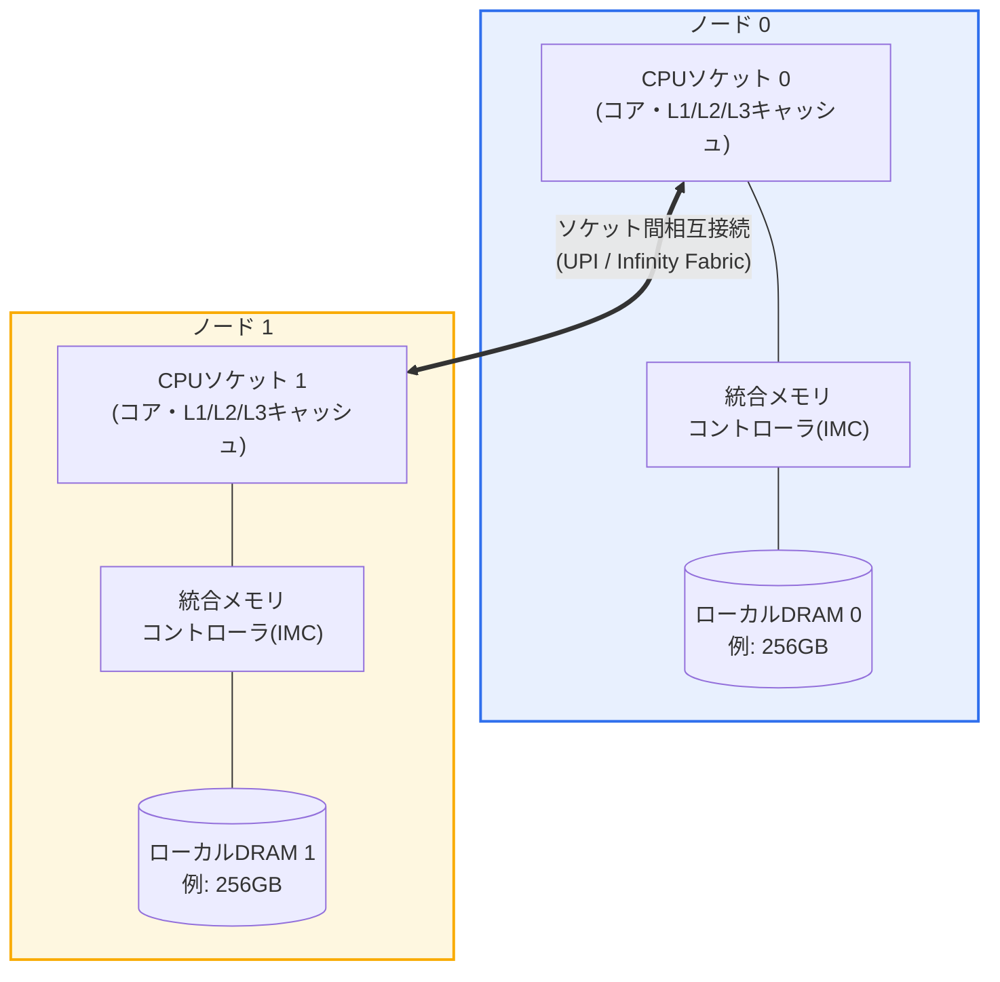

# 不均一メモリアクセス(NUMA, Non-Uniform Memory Access)

## 1. 概要

### A. 定義

> **NUMA(Non-Uniform Memory Access、不均一メモリアクセス)** は、多数のプロセッサ(ソケット)とメモリを複数の **ノード(node)** にまとめ、各プロセッサが自身と物理的に近い **ローカルメモリ(local memory)** には高速に、他ノードに属する **リモートメモリ(remote memory)** には相互接続網(interconnect)を経由して相対的に低速にアクセスするよう構成した共有メモリ型マルチプロセッシング構造である。

NUMAの核心的な発想は、「すべてのCPUがすべてのメモリに同じ時間でアクセスする」という理想を捨てる代わりに、システムのスケーラビリティ(scalability)を得ることにある。従来の **UMA(Uniform Memory Access)** あるいは対称型マルチプロセッシング(SMP)では、すべてのプロセッサが一つの共通バスと単一のメモリプールを共有するため、どのCPUがどのアドレスを読んでもアクセス遅延は同一である。これはプログラミングモデルを単純にするが、プロセッサ数が増えるほど共有バスがボトルネックとなり、4〜8ソケットを超えるとスケーリング効率が急激に低下する。

NUMAはこのボトルネックを「メモリをCPUのそばに分散配置する」ことで解決する。各ソケットに専用のメモリコントローラとローカルDRAMを接続しておけば、大半のアクセスがローカルで処理され、共有バスの競合がなくなる。ただしその代償として、他ノードのメモリを読む際にはソケット間リンク(例:Intel UPI、AMD Infinity Fabric)を1〜2ホップ渡る必要があるため、遅延が大きくなり帯域幅が低くなる。すなわち「メモリアクセス時間がデータの物理的位置によって異なる」ことが名前どおりの本質であり、ソフトウェアがこの非対称性を認識してデータ・スレッドの配置を最適化してはじめて、性能を十分に引き出すことができる。

一点留意すべきは、今日の商用サーバーのNUMAの大半が、**キャッシュコヒーレンシ(cache coherence)をハードウェアが保証するccNUMA(cache-coherent NUMA)** であるという事実である。プログラマは依然として単一のグローバルアドレス空間を見ており、リモートメモリにもポインタ一つで透過的にアクセスする。NUMAは正確性の問題ではなく **性能の問題** であり、配置を誤っても遅くなるだけで誤りにはならないという点が、分散メモリ(MPIなど)と決定的に異なる。

### B. 登場背景と必要性

マルチコア・マルチソケットの時代が開かれ、プロセッサの演算能力はコア数に比例して増加したが、メモリサブシステムはその速度に追いつけなかった。単一バスのSMPはすべてのコアが一つのメモリチャネルを奪い合うため、コアが16個、32個と増えるとメモリ帯域幅がすぐに上限となり、いわゆる **メモリの壁(Memory Wall)** とバス競合が深刻化した。データセンターが求める大規模インメモリデータベース、仮想化集約、HPCシミュレーションは、数百GB〜数TBのメモリと数十個のコアを一つのノードに収める必要があり、単一バス構造ではこれを賄えなかった。

NUMAはこうした必要性から自然に登場した。メモリコントローラをCPUダイ内部に統合(IMC, Integrated Memory Controller)し、ソケットごとに独立したメモリチャネルを与えることで、システム全体のメモリ帯域幅がソケット数に比例して **線形にスケール** するようにしたのである。例えば2ソケットサーバーは各ソケットが8チャネルのDDR5を備えてノードあたり300GB/s以上、合計で600GB/sを超える帯域幅を提供できるが、これは単一バスでは不可能な数値である。今日のx86サーバー(Intel Xeon、AMD EPYC)と大型ARMサーバーは事実上すべてNUMAであり、クラウドの大型インスタンス、リレーショナル・インメモリDBMS、仮想化ホストにおいて、NUMAを意識したチューニングは性能エンジニアリングの基本となっている。

## 2. 全体構造と構成要素

NUMAシステムの全体構造は、「ノード = プロセッサ + ローカルメモリ + メモリコントローラ」を基本単位とし、これらのノードを高速な相互接続網で結んだ形として理解できる。以下の構造図は、2ノードで構成された典型的なccNUMAサーバーのハードウェア配置を示す。



**ノード(node)** は、NUMAにおいて局所性(locality)を判断する基本的な境界である。一つのノードは通常、一つのCPUソケットとそのソケットに直結されたメモリチャネル・DRAMで構成され、オペレーティングシステムはこのノード単位でCPUとメモリ資源を管理する。ノード0のコアがノード0のDRAMを読めばローカルアクセス、ノード1のDRAMを読めばリモートアクセスである。最近の大型プロセッサは、一つのソケット内でもダイ(die)やメモリコントローラのグループをさらに複数のサブノードとして公開する **SNC(Sub-NUMA Clustering)** やチップレットベースの構成を用いることがあり、物理ソケット数より多くのNUMAノードが見える場合も珍しくない。

**相互接続網(interconnect)** は、ノード間のリモートアクセスとキャッシュコヒーレンシのトラフィックが流れる通路である。Intelはかつてのクイックパス(QPI)からUPI(Ultra Path Interconnect)へ、AMDはInfinity Fabricでソケットを接続する。このリンクの帯域幅とホップ(hop)数がリモートアクセス性能を左右し、4ソケット・8ソケットのようにノードが増えるとノード間距離(あるノードは直結、あるノードは中間ノードを経由)が均一でなくなるため、**NUMA距離(NUMA distance)** という概念が必要になる。Linuxは `numactl --hardware` でノード間の相対距離行列(例:ローカル10、リモート21)を提供する。

**メモリコントローラ(IMC)** は、各ノードの局所性を物理的に成立させる中核である。メモリコントローラがCPUダイ内部に統合されたことで、自ノードのDRAMには短い配線で直接アクセスし、他ノードのDRAMには相互接続を経由するという非対称性が生まれる。**キャッシュコヒーレンシプロトコル**(MESI/MESIF/MOESI系)は、複数ノードのキャッシュに散らばった同一データのコピーが互いに矛盾しないことを保証し、プログラマに対して単一の共有メモリという錯覚を維持させる。

以下のシーケンス図は、あるコアが特定の仮想アドレスにアクセスする際、そのデータがローカルノードにあるかリモートノードにあるかによって、経路と遅延がどのように分かれるかを示す。この「ローカルなら高速な直行、リモートなら相互接続を迂回」という分岐が、NUMA性能のすべてを凝縮している。

```mermaid
sequenceDiagram
  participant Core as "ノード0 コア"
  participant L3 as "L3キャッシュ(ノード0)"
  participant MC0 as "IMC(ノード0)"
  participant Link as "相互接続(UPI/IF)"
  participant MC1 as "IMC(ノード1)"
  Core->>L3: アドレス照会(キャッシュヒット?)
  alt キャッシュヒット
    L3-->>Core: データを即時返却(数ns)
  else キャッシュミス - ローカルメモリ
    L3->>MC0: ローカルDRAM要求
    MC0-->>Core: データ返却(約90ns、ローカル)
  else キャッシュミス - リモートメモリ
    L3->>Link: リモートノードへ要求を転送
    Link->>MC1: ノード1 DRAM要求
    MC1-->>Link: データ転送
    Link-->>Core: データ返却(約150ns、リモート)
  end
```

### A. ローカルアクセスとリモートアクセスの性能非対称性

NUMAを理解する上で最も実質的な観点は、ローカルとリモートの定量的な差である。ローカルアクセスはメモリコントローラを通じて直ちにDRAMに到達するが、リモートアクセスは「要求 → ソケット間リンク → 相手ノードのメモリコントローラ → DRAM → 再びリンク → 元のノード」という経路を経るため遅延が加算される。実測ベースでは、リモートの遅延はローカル比でおよそ **1.5〜2.2倍**、リモートの帯域幅はローカルの **50〜70%程度** に低下するのが一般的である。例えばローカルアクセスが90nsであれば、リモートは130〜180nsになりうる。

この差が実際のアプリケーションに及ぼす影響は決して小さくない。大規模インメモリDBで、スレッドが自ノードではなくリモートノードのバッファプールに繰り返しアクセスすると、アクセス一つひとつの遅延増加が累積してスループットが20〜40%低下する事例が報告されている。逆に、データとそれを処理するスレッドを同じノードに配置すればリモートトラフィックがなくなり、相互接続帯域幅の競合も同時に減るという二重の効果がある。

注意すべきは、リモートアクセスは「遅い」のであって「誤り」ではないという事実である。ccNUMAではリモートデータも正確に読み出され、性能低下が生じるだけである。したがってNUMA最適化は、正確性の検証ではなく、プロファイリングを通じた局所性改善の問題としてアプローチすべきである。

### B. オペレーティングシステムのNUMA対応ポリシー(スケジューリング・メモリ配置)

NUMAの性能は、その半分以上がオペレーティングシステムとランタイムの配置ポリシーにかかっている。Linuxカーネルは物理メモリをノードごとのゾーン(zone)として管理し、プロセスがメモリを要求すると、デフォルトで **first-touchポリシー** を適用する。これはページを「割り当てを要求した時点」ではなく「そのページに最初に実際の書き込み(touch)を行ったスレッドが属するノード」に配置するポリシーであり、初期化ループを実際の計算を行うスレッドに並列で実行させれば、データは自然に各スレッドのローカルノードに分散される。

スケジューラもNUMAを認識する。CPUスケジューラはスレッドをできる限り自身のメモリがあるノードのコアで実行しようとし(**CPU affinity・NUMA balancing**)、Linuxの **AutoNUMA** は実行中のページアクセス統計を収集し、頻繁にリモートアクセスされるページをアクセス元スレッドのノードへマイグレーションしたり、スレッドをデータ側へ移住させたりして局所性を事後的に補正する。ただしこうした自動バランシングはページ移動のコストを伴うため、遅延に敏感なワークロードでは、むしろ `numactl --cpunodebind --membind` で明示的に固定する方が安定する。

メモリ配置戦略にはいくつかの選択肢がある。特定ノードに集約する **bind**、複数ノードにラウンドロビンで分散する **interleave**、まずローカルを使い不足すればリモートに回す **preferred** ポリシーが代表的である。例えば帯域幅が鍵となるHPCのストリーミングカーネルは、interleaveで全ノードのメモリ帯域幅を合算して使う方が有利であり、遅延が鍵となるOLTPはbindで局所性を最大化する方が有利である。このようにワークロード特性によって正反対のポリシーが最適となる点が、NUMAチューニングの妙味であり難しさでもある。

### C. アプリケーション・仮想化レイヤーのNUMA整合

ハードウェアとOSが準備されていても、アプリケーションがノード境界を無視すれば効果は失われる。そのためDBMS・JVM・仮想化ハイパーバイザは、自らNUMAを認識するよう設計されている。SQL Serverは **soft-NUMA** でスケジューラグループをノードに整列させ、Oracle・PostgreSQLは大型のバッファキャッシュをノードにインターリーブしたり特定ノードに固定したりするオプションを提供する。JVMは `-XX:+UseNUMA` フラグでヒープの若い世代(young gen)をノードごとに分割し、各GCスレッドがローカル領域のみを扱うようにしてリモートアクセスを減らす。

仮想化・コンテナ環境では **vNUMA(virtual NUMA)** の整合が重要である。物理ホストのNUMAトポロジをゲストVMにそのまま公開すれば、ゲストOSが自身の視点で改めてNUMA最適化を行い、二重に局所性を確保できる。逆に、VMの仮想CPUとメモリが複数の物理ノードにまたがって配置されると(NUMAスパン)、ゲスト内部のいかなる最適化も物理的なリモートアクセスを回避できない。VMware・KVMはVMのvCPUとメモリをできる限り一つの物理ノード内にまとめて配置するスケジューリングを行い、Kubernetesも **Topology Manager** でCPU・メモリ・デバイス(NIC・GPU)を同一ノードに整列させ、遅延に敏感なPodの性能を保証する。

### D. キャッシュコヒーレンシトラフィックと偽共有(false sharing)

NUMAにおいてしばしば見落とされるが性能を大きく左右するのが、キャッシュコヒーレンシの維持にかかるコストである。ccNUMAでは複数ノードのキャッシュに同じデータのコピーが存在しうるため、あるノードがそのデータを変更すると、他ノードのコピーを無効化(invalidate)したり最新版を引き渡したりするコヒーレンシトラフィックが相互接続を流れる。このトラフィックはリモートデータへのアクセスとは無関係に、ローカルデータしか扱っていないように見えるコードでさえ発生しうる。

代表的な落とし穴が **偽共有(false sharing)** である。異なるノードのスレッドが論理的には別々の変数を扱っていても、それらの変数が偶然同じキャッシュライン(通常64バイト)内に置かれていると、あるスレッドの書き込みが他ノードのキャッシュしたライン全体を無効化し、不要なコヒーレンシの往復が急増する。例えばスレッドごとのカウンタ配列を隣接して配置すると、各スレッドが自分のカウンタだけをインクリメントしているにもかかわらず、ノード間のキャッシュラインのピンポンによって性能が数分の一に低下しうる。解決策は各カウンタをキャッシュラインサイズにパディング(cache line padding)して別々のラインに置くことであり、これはNUMA・マルチコア性能チューニングの古典的な手法である。

したがってNUMA最適化は「データをローカルに置くこと」だけでなく、「ノード間で共有・競合する書き込みを最小化すること」まで含む。`perf c2c`(cache-to-cache)のようなツールで、どのキャッシュラインがノードをまたいで競合しているかを特定し、データ構造をノードごとにシャーディングまたはパディングしてコヒーレンシトラフィックを減らすことが、実務上の中核課題である。

## 3. UMA・NUMA・分散メモリの比較

三つの構造の違いは単純な優劣ではなく、「プログラミングの容易さ」と「スケーラビリティ」をどう交換するかの問題である。UMA(SMP)はすべてのアクセス遅延が同一でプログラミングが最も単純だがスケーラビリティが低く、分散メモリ(例:MPIクラスタ)はほぼ無限にスケールするがノード間で明示的なメッセージパッシングが必要で開発負担が大きい。NUMAはその間で、「単一アドレス空間の利便性」と「ソケット単位のスケーラビリティ」を折衷した地点に位置する。

| 区分 | UMA(SMP) | NUMA(ccNUMA) | 分散メモリ(MPP) |
|------|----------|--------------|------------------|
| メモリモデル | 単一の共有プール | 単一アドレス空間、物理的に分散 | ノードごとの独立メモリ |
| アクセス遅延 | 均一 | ローカル≠リモート(非対称) | リモートは明示的通信 |
| キャッシュコヒーレンシ | HWが保証 | HWが保証(ccNUMA) | なし(SWが管理) |
| スケーラビリティ | 低い(〜8ソケット) | 中程度(数十ソケット) | 非常に高い(数千ノード) |
| プログラミング難易度 | 低い | 中程度(配置チューニング) | 高い(MPIなど) |
| 代表例 | 小型マルチコア | Xeon/EPYCサーバー | HPCスーパーコンピュータ |

表から明らかなように、NUMAがUMAと決定的に異なる点は「アクセス遅延の非対称性」であり、分散メモリと異なる点は「キャッシュコヒーレンシと単一アドレス空間の維持」である。この二つの境界のおかげで、NUMAは既存のSMP向けに書かれたソフトウェアを修正なしで動かしつつ(正確性の保持)、性能チューニングを加えれば大型システムへとスケールする実用的な折衷案となる。実務で「コードはそのまま動くが遅い」という症状が現れた場合、その多くはUMAを前提に書かれたコードがNUMAハードウェア上でリモートアクセスを乱発しているケースである。

具体例として、あるインメモリキャッシュサーバーを2ソケット・40コアの機器で何のチューニングもせずに稼働させたところ、40個のスレッドがノード境界をまたいでヒープを共有し、スループットが目標の60%台にとどまったが、スレッドをノードごとに20個ずつに分けてローカルヒープのみを使うようシャーディングし、`numactl` で固定したところ、スループットが約1.5倍向上した事例がある。これはコードロジックを一行も変えずに配置だけを変えた結果であるという点で、NUMA最適化の性格をよく示している。

## 4. 深掘り:CXLとメモリ階層の拡張、そして最新動向

NUMAの概念は、最近の **CXL(Compute Express Link)** の台頭によって新たな局面を迎えている。CXLはPCIe物理層の上でキャッシュコヒーレンシを維持したままメモリを拡張・共有・プーリングするオープンな相互接続標準であり、CXLで接続した外付けメモリはCPUから見ると「コアを持たないもう一つのNUMAノード(memory-only node, CPU-less node)」として現れる。すなわちリモートアクセスよりもさらに一段遠い階層が生まれるわけであり、オペレーティングシステムはこれを既存のNUMAフレームワークで管理する。Linuxが導入した **階層型メモリ(tiered memory)** とページの昇格・降格(promotion/demotion)メカニズムは、ホットなデータは高速なローカルDRAMに、コールドなデータは低速なCXLメモリに置く自動配置を、NUMAノード間のページマイグレーションで実現する。

この流れは、NUMAを「ソケット間の非対称性」から「メモリ階層全般の非対称性」へと拡張する。かつてはローカル対リモートの2段階であったが、今やローカルDRAM(約90ns)→ リモートDRAM(約150ns)→ CXLメモリ(約250〜400ns)へと続く多段階の遅延階層を、ソフトウェアが認識・活用しなければならない。また、複数のサーバーがCXLスイッチを介して一つのメモリプールを共有する **メモリプーリング(memory pooling)** は、データセンターのメモリストランディング(割り当てられたが使われないメモリ)問題を緩和する手段として注目されており、NUMA最適化手法の価値はむしろ高まっている。

AI・データセンターの観点からも、NUMAは依然として決定的である。GPUを複数枚搭載した学習サーバーでは、各GPUが特定のNUMAノードのPCIe・メモリに接続されているため、データローダスレッドとピン留めメモリ(pinned memory)バッファを当該GPUと同じノードに配置してこそ、PCIe・NVLinkの転送遅延とリモートDRAMアクセスを同時に減らせる。KubernetesのTopology Manager、NVIDIAのGPUトポロジを考慮した配置はいずれもこの原理を自動化したものである。ただしCXL・tiered memoryの詳細な性能数値や標準の細部は世代・実装ごとのばらつきが大きいため、実際の設計時にはベンダー文書と実測で確認することが望ましい。

## 5. 考慮事項と示唆

技術士の観点から、NUMAは単なるハードウェアの細部ではなく「局所性をシステムの全階層で整合させる設計原理」として理解すべきであり、次のような戦略的示唆を持つ。

- **適用戦略 — ワークロード特性に応じたポリシーの二元化**: 遅延重視型(OLTP、インメモリキャッシュ)はbind・affinityで局所性を最大化し、帯域幅集約型(HPCストリーミング、大規模分析)はinterleaveで全ノードの帯域幅を合算して活用すべきである。唯一の正解はないため、導入前に必ずプロファイリング(`numastat`、`perf c2c`、LIKWIDなど)でリモートアクセス比率とボトルネックの類型をまず診断すべきである。

- **トレードオフ — 自動バランシング対明示的固定**: AutoNUMA・NUMA balancingは開発負担なしに局所性を改善するが、ページマイグレーションと統計収集のオーバーヘッドを招く。遅延のジッタ(jitter)に敏感なリアルタイム・金融システムでは、自動化を無効にして手動固定を選ぶ方が予測可能性を高める。利便性と決定性のバランスをワークロードごとに判断すべきである。

- **仮想化・クラウド整合の重要性**: 物理NUMAがいかによくチューニングされていても、vNUMA・コンテナのトポロジが物理境界とずれていれば効果は相殺される。VMのサイズを物理ノードに合わせ(NUMAスパンの回避)、KubernetesのTopology ManagerでCPU・メモリ・NIC・GPUを同一ノードに整列させることが、大型インスタンスの性能保証の前提条件である。クラウドの大型インスタンス選定時には、vCPU・メモリの比率がノード境界と整合しているかを検討すべきである。

- **展望と関連技術 — CXL・階層型メモリへの拡張**: CXLによるメモリ拡張・プーリングが普及すれば、NUMAはソケット間の非対称性を超え、DRAM〜CXLを包括する多段階のメモリ階層管理へと進化する。階層型メモリにおけるホット/コールドページの自動配置、メモリプーリングによる資源ストランディングの緩和は、データセンターのTCO削減の中核手段となるため、NUMAを意識した設計能力は今後も性能・コスト最適化の基盤技術であり続ける見通しである。

- **ガバナンス・運用の観点**: NUMA最適化は一過性のチューニングではなく、デプロイパイプラインに内在化してこそ持続する。性能回帰を早期に捉えるためにリモートアクセス比率を観測指標(observability)として常時モニタリングし、ハードウェアの世代交代時にはトポロジの変化(SNC、チップレット、ノード数の増加)を配置ポリシーに反映する運用プロセスが必要である。

## 参考資料

- Linux Kernel Documentation, "What is NUMA?" — https://www.kernel.org/doc/html/latest/mm/numa.html
- Linux `numactl`/`numastat` man pages — https://man7.org/linux/man-pages/man8/numactl.8.html
- Christoph Lameter, "NUMA (Non-Uniform Memory Access): An Overview", ACM Queue — https://queue.acm.org/detail.cfm?id=2513149
- Compute Express Link (CXL) Specification — https://computeexpresslink.org/
- Kubernetes Topology Manager — https://kubernetes.io/docs/tasks/administer-cluster/topology-manager/

---

> **一言まとめ**: NUMAは、プロセッサごとにローカルメモリを接続してスケーラビリティを得る代わりにローカル・リモートのアクセス遅延が異なるccNUMA構造であり、first-touch・affinity・interleaveなどOS・アプリケーション・仮想化の全階層における局所性の整合が性能を左右し、CXL・階層型メモリへとその概念が拡張されつつある。
