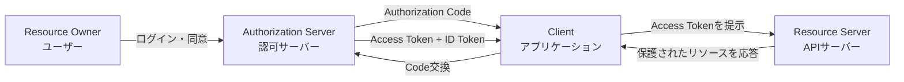
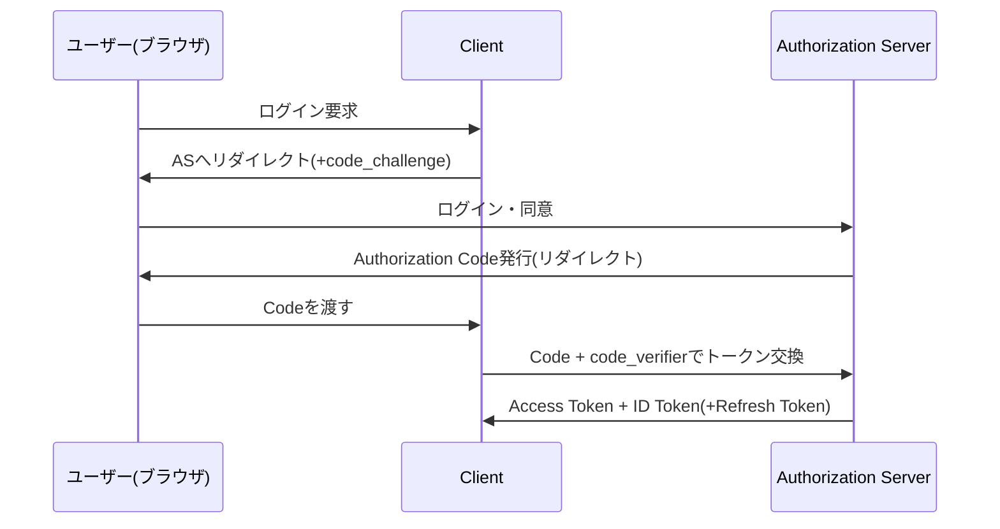

# OAuth 2.0とOpenID Connect(OIDC)

## 1. 概要

### A. 定義
> **OAuth 2.0**は、リソースオーナー(ユーザー)のパスワードを第三者アプリケーションに露出させることなく、**限定された範囲(scope)のアクセス権限を委譲**するための認可(Authorization)フレームワーク(RFC 6749)である。**OpenID Connect(OIDC)**は、このOAuth 2.0の上に**IDトークン**という標準化された身元証明レイヤーを載せ、「このユーザーは誰か」を確認する**認証(Authentication)プロトコル**である。

二つの標準はしばしば一括りに呼ばれるが、解決する問題は異なる。OAuth 2.0は「このアプリケーションがユーザーに代わって何ができるか」という**権限(authorization)**の問いに答えるよう設計されており、本来はユーザーの身元を証明する用途ではなかった。実際、初期のWebサービスの多くはOAuthのアクセストークン発行の成否だけでログイン成功を判断する便法(pseudo-authentication)を用い、トークンの再利用やオーディエンスの混同(audience confusion)といった脆弱性に見舞われた。こうした問題を根本的に解決するため、OpenID Foundationが2014年にOIDCを標準化し、**誰がログインしたか(authentication)**と**何にアクセスできるか(authorization)**を明確に分離し、前者を改ざんの有無が検証可能なJWT形式のIDトークンとして標準化した([Duende Software](https://duendesoftware.com/learn/the-differences-between-oauth-2-0-and-openid-connect-and-why-they-matter))。

### B. 登場背景と必要性
かつてWebサービス間の連携は、ユーザーが自分のIDとパスワードを相手サービスに直接入力する方式(パスワード共有、password anti-pattern)が一般的であった。この方式ではパスワードが複数のサービスに分散して保存されるため漏えいリスクが高まり、ユーザーが特定の権限だけを委譲したり、後で取り消したりすることは不可能であった。OAuthは、ユーザーが信頼する認可サーバー(例:Google、Kakao)でログインした後、クライアントアプリには**範囲が限定され、取り消し可能なトークン**のみを発行することでこの問題を解決する。そこにOIDCが加わったことで、一つのアカウントで複数のサービスにログインする**SSO(Single Sign-On)**や、マイクロサービス・モバイルアプリ・SPA(Single Page Application)環境における標準化された身元連携が可能となった。現在、ソーシャルログイン(「Googleでログイン」「Kakaoでログイン」)の大半や企業向けSSO(Okta、Azure AD、Keycloakなど)は、この二つの標準の組み合わせで実装されている。

## 2. 全体構造と参加主体

OAuth/OIDCのエコシステムは大きく四つの主体で構成され、各主体の役割と信頼境界を正確に理解してはじめて、認可フローを設計・監査できる。

- **リソースオーナー(Resource Owner)**: 保護されたリソース(写真、プロフィール、メールなど)の実際の所有者であるユーザーである。認可サーバーの画面でログインし、「このアプリが自分のメールにアクセスすることを許可するか」に同意(consent)する主体であり、この同意UIの明確さが信頼モデル全体の実質的な防御線となる。
- **クライアント(Client)**: リソースにアクセスしようとするアプリケーションである。クライアントシークレットを安全に保管できるかどうかによって**コンフィデンシャルクライアント(confidential、サーバーサイドアプリ)**と**パブリッククライアント(public、モバイル・SPA)**に分かれ、この区分が後述するグラントタイプ選択の中核的な基準となる。
- **認可サーバー(Authorization Server)**: ユーザーを認証し、同意を得てトークンを発行する信頼の中心点である。OIDCをサポートする場合は**OpenID Provider(OP)**とも呼ばれ、`/.well-known/openid-configuration` パスで自身のエンドポイント・サポートするアルゴリズムを標準化された方式で公開する**ディスカバリ(Discovery)**機能を提供する。
- **リソースサーバー(Resource Server)**: 実際に保護されたAPI・データを保有するサーバーであり、クライアントが提示したアクセストークンの有効性とスコープを検証した後にのみ応答する。

### トークンの種類と有効期間の設計(参考)

OAuth/OIDCのエコシステムで扱うトークンは互いに性格が異なり、これを混同するとセキュリティ設計全体が揺らぐ。**アクセストークン(Access Token)**はリソースサーバーに提示する「入場券」であり、形式が標準化されていないため、不透明な任意の文字列(opaque token)の場合もあればJWTの場合もある。**IDトークン**は必ずJWTでなければならず、クライアントが直接解釈・検証するよう設計された身元証明書である。**リフレッシュトークン**はリソースサーバーには決して提示されず、認可サーバーに新しいアクセストークンを要求するときにのみ使われる再発行用トークンである。

| トークン | 提示先 | 形式 | 一般的な有効期間 |
|---|---|---|---|
| Access Token | リソースサーバー(API) | 不透明な文字列またはJWT | 5分〜1時間 |
| ID Token | クライアント(アプリ自身) | JWT(必須) | 1回限りの検証(再利用しない) |
| Refresh Token | 認可サーバー | 不透明な文字列を推奨 | 数日〜数か月(ローテーション適用) |

例えばあるコマースプラットフォームがアクセストークンの有効期間を30分、リフレッシュトークンの有効期間を14日に設定した場合、ユーザーは2週間に一度だけ再ログインすればよいが、アクセストークンが窃取されても攻撃者が悪用できる時間は最大30分に制限される。このように二つのトークンの有効期間を分離して設計すること自体が、「使いやすさとセキュリティのバランス」を扱う技術士答案の中核的な論点となる。

## 3. OAuth 2.0 認可グラント(Grant)の類型

認可グラントは「クライアントがどのような方式でトークンの発行を受けるか」についてのシナリオ別の規格であり、クライアントの信頼レベルとユーザーの関与の有無によって選択が分かれる。

### A. Authorization Code Grant(+ PKCE)
最も安全で標準的なフローであり、Webサーバーアプリケーションはもちろん、PKCE(Proof Key for Code Exchange, RFC 7636)を加えたモバイル・SPAでも使用される。

このフローの核心は、**認可コード(authorization code)がブラウザを通じて露出しても、実際のトークン交換はクライアントと認可サーバー間のバックチャネル(back-channel)通信で行われる**という点である。コード自体は短命(数十秒〜数分)かつ1回限りであるため、窃取されても悪用価値は低い。ただしパブリッククライアントはクライアントシークレットを安全に保管できないため、コード窃取(authorization code interception)攻撃を防ぐために**PKCE**を付加する。PKCEはクライアントがランダムな `code_verifier` を生成し、そのハッシュ値である `code_challenge` を認可リクエストに含め、実際のトークン交換時に元の `code_verifier` を併せて提示した場合にのみトークンが発行されるようにする。こうすれば、攻撃者がリダイレクトURIを傍受してコードを盗んでも、その検証子を知らないためトークンに交換することはできない。

### B. Client Credentials Grant
ユーザーの関与がない**サーバー間(machine-to-machine)**通信に使われる。クライアントが自身のクライアントID・シークレットだけで直接認可サーバーにトークンを要求し、ユーザーからの委譲ではなくアプリケーション自体の身元でアクセス権限を得る。バッチ処理、バックエンドのマイクロサービス間のAPI呼び出し、管理用スクリプトなどでよく使われ、必ずコンフィデンシャルクライアント(シークレットを安全に保管できるサーバー)でのみ使用しなければならない。

### C. Refresh Token Grant
アクセストークンは窃取被害を減らすために短い有効期限(数分〜数十分)を持つ。毎回ユーザーに再ログインを求めると使い勝手が大きく損なわれるため、最初の認可時に併せて発行される**リフレッシュトークン**によって、ユーザーの関与なしに新しいアクセストークンを再発行する。リフレッシュトークンはアクセストークンより有効期間が長く(数日〜数か月)、窃取時の被害が大きいため、サーバー側の安全なストレージにのみ置き、**1回使用したら新しいリフレッシュトークンに交換(rotation)**するのが最新のセキュリティ慣行である。

### D. (使用非推奨)Implicit GrantとResource Owner Password Credentials
初期のOAuth 2.0には、SPAのためにトークンをURLフラグメントで即座に返す**インプリシットグラント(Implicit Grant)**と、ユーザーのID・パスワードをクライアントが直接受け取って認可サーバーに渡す**ROPC(Resource Owner Password Credentials)**が定義されていた。しかしインプリシットグラントはトークンがブラウザ履歴・リファラーに露出し、バックチャネルでの検証もないため窃取に脆弱であり、ROPCはクライアントがユーザーのパスワードを直接扱うため、OAuthが本来なくそうとした「パスワード共有」問題を再現してしまった。このため両方式とも最新の標準では事実上廃止されており、後述する**OAuth 2.1**はこの二つを仕様から完全に削除した。

### E. グラント類型の比較まとめ

前述の四つ(および廃止対象の二つ)のグラントは、「誰が関与するか」と「クライアントがシークレットを安全に保管できるか」という二つの軸で整理すると、選択基準が明確になる。

| グラント | ユーザーの関与 | 適したクライアント | 現在の推奨状況 |
|---|---|---|---|
| Authorization Code(+PKCE) | 必要 | パブリック・コンフィデンシャル双方 | 推奨(基本) |
| Client Credentials | 不要 | コンフィデンシャルクライアント(M2M) | 推奨 |
| Refresh Token | 不要(初回のみ必要) | パブリック・コンフィデンシャル双方 | 推奨(ローテーション必須) |
| Implicit | 必要 | パブリッククライアント | 廃止(OAuth 2.1で削除) |
| ROPC | 必要(パスワードを直接入力) | レガシー移行用 | 廃止を推奨 |

## 4. OpenID Connect:OAuthの上の認証レイヤー

OIDCはOAuth 2.0の認可コードフローをそのまま再利用しつつ、リクエスト時に `scope=openid` を含め、レスポンスに**IDトークン**を追加する方式で動作する。すなわち別個の新しいプロトコルではなく、OAuth 2.0の**標準拡張(profile)**である。

### A. IDトークンの構造
IDトークンは署名された**JWT(JSON Web Token)**であり、`iss`(発行者)、`sub`(ユーザーの一意識別子)、`aud`(トークンの受信対象クライアント)、`exp`(有効期限)、`iat`(発行時刻)、`nonce`(リプレイ攻撃防止用の乱数)などの標準クレームと、`name`・`email` のようなユーザー属性クレームを含む。クライアントはこのトークンの署名を認可サーバーの公開鍵で検証することで、トークンが偽造されておらず、自身を対象(`aud`)として発行されたことを暗号学的に確認できる。この署名検証の可能性こそが「IDトークンでログインの有無を判断しても安全である」根本的な理由であり、単なるアクセストークン(不透明な文字列であるか、リソースサーバーのみが解釈可能)ではこのような安全な判断は不可能である。

### B. UserInfoエンドポイントとディスカバリ
IDトークンに含まれる情報が最小限である場合、クライアントはアクセストークンを携えて標準化された `/userinfo` エンドポイントに追加のユーザー属性を照会できる。また、OIDC対応サーバーは `/.well-known/openid-configuration` 文書を通じて認可・トークン・UserInfoの各エンドポイントのアドレス、サポートする署名アルゴリズム、サポートするスコープの一覧を標準JSONで公開するため、クライアントライブラリはサーバーごとの設定なしに自動で連携情報を取得できる。

| 項目 | OAuth 2.0 | OpenID Connect |
|---|---|---|
| 目的 | 認可(リソースアクセスの委譲) | 認証(身元確認)+ 認可 |
| 中核トークン | Access Token, Refresh Token | ID Token(JWT)+ OAuthトークン |
| ユーザー情報 | 標準未定義 | IDトークンのクレーム + `/userinfo` |
| スコープ | サービスごとに自由定義(`read`, `write`) | 標準スコープ(`openid`,`profile`,`email`) |
| ディスカバリ | 未定義 | `/.well-known/openid-configuration` |
| 単独使用 | 可能(M2M APIアクセス) | 不可(OAuth 2.0ベースが必須) |

([Duende Software](https://duendesoftware.com/learn/the-differences-between-oauth-2-0-and-openid-connect-and-why-they-matter); [SuperTokens](https://supertokens.com/blog/openid-connect-vs-oauth2))

### C. OIDCの三つのフロー(Flow)

OIDCはOAuthのグラントをそのまま継承しつつ、三つのフローに細分化される。**Authorization Code Flow**はサーバーサイドアプリに適し、IDトークンとアクセストークンの両方をバックチャネルで安全に受け取る。**Implicit Flow**はかつてSPAのためにフロントチャネルでトークンを即座に返していたが、前述のセキュリティ上の弱点のため廃止対象である。**Hybrid Flow**は、認可レスポンスの段階でIDトークンをフロントチャネルで先に受け取って画面にユーザー名を即座に表示しつつ、アクセストークンはその後のバックチャネル交換で安全に受け取る折衷案であり、リダイレクト後の画面遷移の遅延を減らす必要があるエンタープライズSSOのシナリオでしばしば使われる。

## 5. 比較・適用事例

最も身近な事例はソーシャルログインである。例えばあるコマースアプリが「Googleでログイン」ボタンを提供している場合、ユーザーがGoogleの認可サーバーで認証・同意した後、アプリはGoogleからIDトークン(ユーザーが誰か)と、必要であればアクセストークン(Googleカレンダー・ドライブなど付加的なAPIへのアクセス権限)を併せて受け取る。このときアプリはGoogleのパスワードを一切見ることがなく、ユーザーはGoogleアカウントの設定からいつでも当該アプリのアクセス権限だけを個別に取り消すことができる。企業環境では、Okta・Azure AD・Keycloakのような**IdP(Identity Provider)**をOIDCで連携し、社内の数十のシステムに一つのアカウントでSSOログインを実現することが標準的なパターンであり、人事システムでの退職処理一回で全連携システムへのアクセスを同時に遮断できる点が、システムごとの個別アカウント管理に比べた明確な実務上の利点である。反対に、サーバー間のバッチ連携(例:社内の決済サービスが精算サービスのAPIを毎時呼び出す)にはユーザーの関与がないため、OIDCではなく純粋なOAuthのClient Credentials Grantが適しており、ここに無理にユーザーの身元という概念を持ち込むと、かえって設計が複雑になる。

## 6. 関連既出問題・類似テーマとの連携

このテーマは情報管理技術士試験において、単独の問題としても、他のテーマの下位論点としても頻繁に登場する。「識別と認証」「JWT」「アクセス制御(Access Control)」「ゼロトラストセキュリティモデル」の各テーマとは、認証・認可の具体的な実装標準という関係でつながり、「マイデータ伝送セキュリティ」「金融クラウドSLA」のテーマでは、FAPIが実際の規制要件の技術的根拠として引用される。答案を構成する際は「OAuth/OIDCの概念 → グラントの選択基準 → 最新のセキュリティ強化(OAuth 2.1・FAPI)→ ゼロトラスト・マイクロサービスアーキテクチャへの適用」という流れで展開すれば、単なるプロトコル説明を超えて、技術士答案が求めるアーキテクチャ・ガバナンスの観点まで自然に盛り込むことができる。

## 7. 深掘り — 最新動向とセキュリティ強化標準

OAuthのエコシステムは2020年代に入り、「デフォルト値そのものをより安全にする」方向へと急速に進化している。

- **OAuth 2.1**: RFC 6749以降に散在していた複数のセキュリティ勧告(各RFC)を一つの仕様に統合する作業であり、**PKCEをすべてのクライアント(パブリック+コンフィデンシャルの双方)に必須化**し、脆弱性が繰り返し指摘された**Implicit GrantとROPCを仕様から完全に削除**した。また、リダイレクトURIを文字列どおり完全一致(exact match)させることを強制し、リフレッシュトークンのローテーション(rotation)を要求する([OAuth.net](https://oauth.net/2.1/); [WorkOS](https://workos.com/blog/oauth-2-1-vs-oauth-2-0))。
- **FAPI(Financial-grade API)**: OpenID Foundationが、金融業界のようにリスクの高いAPIのために、OAuth/OIDCの上に追加の制約を課したプロファイルである。クライアント認証にシークレットの代わりに**mTLSまたは署名付きJWT(private_key_jwt)**を要求し、アクセストークンをクライアント証明書にバインド(sender-constrained token)して、トークン窃取時にも再利用を防ぐ([OpenID Foundation FAPI](https://openid.net/specs/openid-financial-api-part-2-1_0.html))。韓国国内のオープンバンキング・マイデータAPIのセキュリティ要件も、これと類似した思想(強いクライアント認証、トークンバインディング)をとっている。
- **DPoP(Demonstrating Proof of Possession)**: アクセストークンが窃取されても攻撃者がそのまま再利用できないよう、クライアントがリクエストのたびに自分だけが知る秘密鍵で署名した証明値を併せて提示するようにする拡張であり、mTLSの使用が難しい環境(SPA、モバイル)でトークンバインディングを実現する代替手段として注目されている。

## 8. 考慮事項と示唆(技術士の観点)

- **アーキテクチャ設計原則**: マイクロサービス・APIゲートウェイ環境では、認証(身元確認)はOIDCで中央集権化し、個々のサービス間の認可はスコープ・クレームベースの細分化されたポリシーとして分離することが、保守性とセキュリティを同時に確保する設計である。認証ロジックをサービスごとに実装すると、実装のばらつきによる脆弱性が必然的に発生する。
- **トレードオフ**: PKCE・mTLS・トークンバインディングのような強化策はセキュリティを高めるが、クライアント実装の複雑さとインフラ(証明書管理など)の負担を増やす。内部ネットワークのM2M通信のように脅威モデルが相対的に低い領域にまで金融業界レベル(FAPI)の統制を一律に適用すると過剰設計となるため、リソースの機微度に応じて統制レベルを階層化すべきである。
- **ゼロトラストとの連携**: OAuth/OIDCの「リクエストのたびに有効なトークンとスコープを検証する」という原則は、ゼロトラストセキュリティモデルの中核的な前提(暗黙の信頼の排除、継続的な検証)と正確にかみ合う。特に短いアクセストークンの有効期間と細分化されたスコープは、事故発生時の被害範囲を最小化する最小権限(least privilege)原則の実質的な実装である。
- **展望 — AIエージェント時代の認可**: 最近、LLMエージェントがユーザーに代わって複数のAPIを自律的に呼び出す事例が増えるにつれ、「エージェントがどの範囲まで、どれだけの期間代理行動できるか」を表現する委譲認可モデル(例:動的クライアント登録、細分化されたRich Authorization Requests、エージェントごとの短命トークン)が、OAuthエコシステムの新たな拡張ポイントとして浮上している。情報管理技術士の受験の観点からは、既存の3者委譲(ユーザー・クライアント・サーバー)モデルが「人間ではないエージェント」という4番目の行為者をいかに安全に受け入れるかが、今後の出題・実務の双方で重要となる領域である。
- **監査・ログの観点**: 認可サーバーにおけるトークンの発行・更新・失効の履歴、同意画面の表示の有無、スコープの変更履歴は、個人情報処理方針の遵守と事故対応(フォレンジック)の双方に不可欠な証跡である。情報システム監理・ISMS-P審査においても「誰がいつどの範囲で委譲したかを追跡できるか」を認証・認可体系の中核的な点検項目として扱うため、設計初期にトークンイベントのロギング体系を併せて整備すべきである。
- **可用性・障害分離**: 認可サーバーは事実上、全社システムの単一の信頼点(SPOFに近い構造)となるため、認可サーバーの障害がそのまま全体のログイン不可につながる。マルチリージョン構成や、キャッシュした公開鍵でオフラインのトークン検証を維持する方式など、可用性設計を別途考慮すべきである。

## 参考資料
- [OAuth 2.1 — oauth.net](https://oauth.net/2.1/)
- [OAuth 2.0 vs OAuth 2.1: What changed, why it matters — WorkOS](https://workos.com/blog/oauth-2-1-vs-oauth-2-0)
- [The differences between OAuth 2.0 and OpenID Connect — Duende Software](https://duendesoftware.com/learn/the-differences-between-oauth-2-0-and-openid-connect-and-why-they-matter)
- [OpenID Connect vs OAuth2 — SuperTokens](https://supertokens.com/blog/openid-connect-vs-oauth2)
- [Financial-grade API Security Profile 1.0 - Part 2: Advanced — OpenID Foundation](https://openid.net/specs/openid-financial-api-part-2-1_0.html)
- [OAuth 2.1: Key Updates and Differences from OAuth 2.0 — FusionAuth](https://fusionauth.io/articles/oauth/differences-between-oauth-2-oauth-2-1)
- [OAuth vs OpenID Connect — GeeksforGeeks](https://www.geeksforgeeks.org/websites-apps/oauth-vs-openid-connect/)

このように多角的な根拠があるだけに、実際の技術士答案を書く際は「OAuthとOIDCは異なる」という単純な一文にとどまらず、前述の構造・セキュリティ強化の動向を併せて提示してこそ、実務・審査の観点を適切に示すことができる。

---

> **一言まとめ**: OAuth 2.0はユーザーのパスワードを露出させずに範囲が限定されたアクセス権限を委譲する認可フレームワークであり、OpenID Connectはその上で署名付きIDトークンにより「誰がログインしたか」を証明する認証レイヤーであり、PKCE・FAPI・OAuth 2.1のような最新の強化標準がトークンの窃取・再利用の脅威に対応して進化を続けている。
