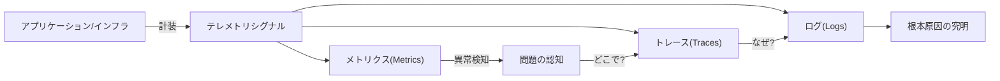
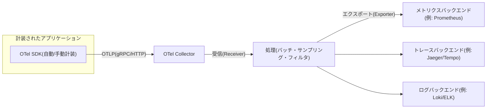

# オブザーバビリティ(Observability)とOpenTelemetry

## 1. 概要

> **定義**: オブザーバビリティ(可観測性)とは、システムの外部に放出されるテレメトリ(メトリクス・ログ・トレース)だけでシステムの内部状態を推論し、事前に定義していない問いに対しても原因を究明できる能力である。

従来のモニタリングは、「障害が起きたか」をあらかじめ定めたしきい値とダッシュボードで確認することに焦点を当てていた。
しかしマイクロサービス・コンテナ・サーバーレスが普及するにつれ、一つのユーザーリクエストが数十のサービスを経由し、インスタンスは数分単位で生成・消滅するようになった。
このような環境では「何が故障するか」を事前にすべて予測して指標を仕込んでおくことは不可能であり、障害の様相も「完全停止」より「特定のユーザー・特定の経路でのみ遅くなる」形で現れる。
オブザーバビリティは、このように**知らなかった未知の問題(unknown-unknowns)**を事後に探索的に掘り下げられるようにすることを目標とする点で、従来のモニタリングと区別される。

モニタリングとオブザーバビリティは対立概念ではなく、包含関係に近い。
モニタリングは既知の障害モードに対する指標を収集・アラートする活動であり、オブザーバビリティはその指標を含め、システムが十分に豊富なテレメトリを放出するよう設計する**特性(property)**である。
すなわち「モニタリングをする」は行為であり、「観測可能である」はシステムが備えるべき性質である。
したがってオブザーバビリティは運用ツールをもう一つ導入する問題ではなく、コードが意味のあるシグナルを残すよう設計段階で確保すべき品質特性である。

試験答案では、オブザーバビリティを「3大要素(メトリクス・ログ・トレース)」の羅列で終わらせず、三つのシグナルが**なぜ相互補完的であり、どのように連携(correlation)したときに価値が生まれるのか**、そしてそれをベンダーロックインなしに標準化するOpenTelemetryの役割までつなげてこそ、設計観点の答案となる。

### 1.1 登場背景と必要性

第一に、分散システムの複雑さである。
モノリシックでは一つのプロセスのログだけを見ればよかったが、100個のサービスに分解されると、一つのリクエストの遅延がどの区間で発生したかを単一のログでは知ることができない。
サービス間の因果関係を追跡するには、リクエストをエンドツーエンド(end-to-end)でつないで見られる分散トレーシングが必須となる。

第二に、インフラの揮発性(ephemerality)である。
KubernetesのPodやサーバーレス関数は、問題発生後にアクセスして調査しようとしても、すでに消えてしまっている。
したがって事後的にアクセスしてデバッグする代わりに、実行中に十分なシグナルを外部へ送り出しておく方式へと転換しなければならない。

第三に、コストとユーザー体験の観点である。
障害の平均復旧時間(MTTR)の大部分は「原因究明(検知後の診断)」に費やされ、可観測性が低いとこの区間が長くなって売上・信頼の損失が大きくなる。
可観測性はそのままMTTRの短縮に直結するため、SREにおける信頼性管理の前提条件となる。

### 1.2 中核目標と非目標

中核目標は、未知の問題の探索的診断、シグナル間の相関関係の確保、ベンダー中立な計装の標準化、そして診断時間の短縮である。
反対に、すべてのデータを無制限に収集・永久保存することは目標ではない。
テレメトリはそれ自体が保存・転送・クエリのコストを生むため、カーディナリティとサンプリング(sampling)を設計してS/N比を管理することが、むしろ中核的な能力である。

## 2. オブザーバビリティの3大シグナル(Three Pillars)

オブザーバビリティは一般に、メトリクス・ログ・トレースの三つのシグナルで説明される。
ただし三つのシグナルをそれぞれ別のツールでばらばらに見ると「サイロ」となり、価値が半減する。
真の可観測性は、一つの問題状況において、指標(何が・どれだけ)→ トレース(どこで)→ ログ(なぜ)へと**途切れなく行き来できるとき**に達成される。

### 2.1 メトリクス(Metrics)

メトリクスは時間に沿って集計された数値(リクエスト量、エラー率、レイテンシ、リソース使用率など)である。
個々のイベントを捨てて統計に圧縮するため保存コストが低く、長期トレンドやアラートに適している。
例えば「5分間の5xxエラー率 > 1%」はメトリクスで監視しやすい形であり、RED(Rate・Errors・Duration)やUSE(Utilization・Saturation・Errors)といった方法論で、どの指標を見るべきかを体系化する。
ただしメトリクスは集計の過程で個々のリクエストのコンテキストを失うため、「何かがおかしい」ことは教えてくれるが「なぜ」には答えられない。
特にラベル(label)の組み合わせが増えるとカーディナリティが爆発して保存・クエリのコストが急増するため、ユーザーIDのように値が無限にある次元をメトリクスのラベルに使わないよう注意しなければならない。

### 2.2 ログ(Logs)

ログは特定の時点に発生した個々のイベントの記録である。
最も豊富なコンテキストを含められるため根本原因分析の最終的な手がかりとなるが、量が多く保存・検索のコストが大きい。
非構造化テキストログよりも**構造化ログ(JSONなど)**を使えば、フィールド単位の検索・集計が可能となり、可観測性が大きく向上する。
核心はログにトレースIDを併せて記録してトレースとログを相互に連携させることであり、これがなければログは再びサイロとなる。

### 2.3 トレース(Traces)

トレースは、一つのリクエストが複数のサービスを経由しながら生成した作業単位(スパン、Span)の因果・時間関係をつないだものである。
各スパンはサービス名・開始/終了時刻・ステータス・親スパンを持ち、これらがツリーを形成してリクエストの全行程を示す。
分散トレーシングは、W3C Trace Context標準の `traceparent` ヘッダによってサービス境界を越えてコンテキストを伝播(context propagation)する。
これにより、「決済APIのp99レイテンシ増加が、実は下位のクーポンサービスのDBロックによるものだった」といった**区間ごとのボトルネック**を正確に特定できる。

| シグナル | 問い | 強み | 弱み | コスト |
|------|------|------|------|------|
| メトリクス | 何が、どれだけ | 低コスト・長期トレンド・アラート | 個別コンテキストの喪失 | 低い |
| ログ | なぜ(詳細なコンテキスト) | 最高の詳細度 | 大容量・ノイズ | 高い |
| トレース | どこで(区間) | エンドツーエンドの因果関係 | 計装・伝播が必要 | 中程度 |

## 3. OpenTelemetry(OTel)標準とパイプライン

かつてはシグナルごと・ベンダーごとに計装ライブラリが異なり、観測ツールを替えるとアプリケーションコードを再計装しなければならないというベンダーロックインが大きかった。
**OpenTelemetry(OTel)**はCNCF傘下のプロジェクトであり、メトリクス・ログ・トレースを包括する**単一の計装API/SDKと転送規格(OTLP)**を標準化してこの問題を解決する。
開発者はOTel APIで一度だけ計装し、データをどこに送るかは設定(Exporter)で切り替える。
すなわち「計装(コード)」と「バックエンド(ツール)」を分離して、ベンダー中立性を確保する。

**OTel Collector**はこの構造の中心的な部品であり、複数のソースからテレメトリを受け取り(Receiver)、バッチ化・サンプリング・機微情報のマスキング・再ラベリングなどで加工(Processor)した後、複数のバックエンドへエクスポートする(Exporter)。
アプリケーションはCollector一か所に送るだけでよいため、バックエンドの交換や多重送信がコード変更なしに可能となる。
また、サンプリングをCollectorで集中処理すれば、トレース全体を見て判断する**テールベースサンプリング(tail-based sampling)**によって「エラーが発生したリクエストは必ず保存する」というポリシーを実装できる。
計装は自動計装(エージェントがHTTP・DB呼び出しを自動捕捉)と手動計装(業務上の意味を持つカスタムスパン・属性の追加)を併用し、後者が答案の品質を左右する。

## 4. 導入時の比較と事例 — なぜこのように設計するのか

可観測性設計の中核的な葛藤は、**完全性とコスト**のトレードオフである。
すべてのリクエストのトレースを100%保存するのが理想だが、大規模トラフィックでは保存・転送のコストを賄いきれない。
そこでサンプリング戦略を選ぶ。
ヘッドベース(head-based)はリクエスト開始時点で確率的に採用の可否を決めるためオーバーヘッドは低いが、「まれに発生したエラーリクエスト」を取りこぼす可能性がある。
テールベース(tail-based)はリクエスト完了後に結果(エラー・高レイテンシ)を見て採用するため診断価値の高いトレースを選別して保存できるが、完了までバッファリングが必要でCollectorのリソースをより多く消費する。
したがって「正常トラフィックは1%サンプリング、エラー・低速リクエストは100%保存」のように二つの方式を組み合わせるのが、実務の定石である。

具体的な効果の例として、あるサービスでユーザーの決済遅延に関する苦情が散発的に発生したとする。
メトリクスダッシュボードでは全体のp50レイテンシが正常であるため原因が見えないが、エラー・高レイテンシのリクエストだけを100%保存したトレースを開くと、特定の決済手段の経路の下位スパンで、外部PG事業者の応答に3秒以上かかっていた事実が明らかになる。
そのスパンに紐づく構造化ログのトレースIDに移動すれば、特定のカード会社におけるタイムアウト時のリトライが原因であることを確認できる。
このように三つのシグナルをトレースIDでつなぎ合わせる相関関係があってこそ「平均は正常なのに一部だけ遅い」問題を診断でき、これこそが可観測性が単なるモニタリングと分かれる地点である。

## 5. 考慮事項と示唆(技術士の観点)

第一に、**可観測性は設計品質であり、事後的なツール導入ではない。**
コードが意味のあるスパン・属性・構造化ログを残すよう、開発標準(ロギング規約、トレース伝播、相関ID)をアーキテクチャ段階で定める必要があり、可観測性の確保を運用チームに押し付けると失敗する。

第二に、**コスト・カーディナリティのガバナンスが成否を分ける。**
無秩序なラベル付けや全量保存は、観測プラットフォームのコストをサービスインフラよりも大きくしかねない。
シグナルごとの保存期間の差別化(メトリクスは長期、ログ・トレースは短期)、サンプリング、カーディナリティの上限をポリシーとして管理すべきである。

第三に、**標準の採用によってベンダーロックインを緩和する。**
OpenTelemetry・OTLP・W3C Trace Contextのようなオープン標準で計装すれば、バックエンド(オープンソース/商用/クラウド)をコード変更なしに交換・併用でき、長期的な交渉力と移植性を確保できる。

第四に、**セキュリティ・個人情報との相反を管理する。**
テレメトリにはユーザー識別子・トークンなどの機微情報が混入しやすいため、Collector段階でのマスキング・フィルタリングとアクセス制御を設け、観測データが新たな漏えい経路とならないようにすべきである。

第五に、**SRE・AIOpsへの連携という展望である。**
観測データはSLI/SLO・エラーバジェット算定の入力となり、さらには異常検知・根本原因推論を自動化するAIOpsの学習データとなる。
したがって可観測性は、短期的には障害対応の、長期的には自律運用(self-healing)の基盤インフラとして位置づけられる。

## 参考資料
- OpenTelemetry公式ドキュメント: https://opentelemetry.io/docs/
- W3C Trace Context標準: https://www.w3.org/TR/trace-context/
- CNCF OpenTelemetryプロジェクト: https://www.cncf.io/projects/opentelemetry/

---
> **一言まとめ**: オブザーバビリティは、メトリクス・ログ・トレースをトレースIDで相互に連携させ、未知の障害まで事後的な探索によって究明するシステムの特性であり、OpenTelemetryによる標準計装とサンプリング・カーディナリティのガバナンスによって、ベンダーロックインなしにコスト効率よく確保される。
